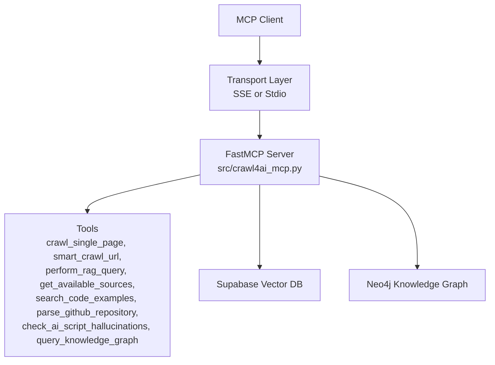
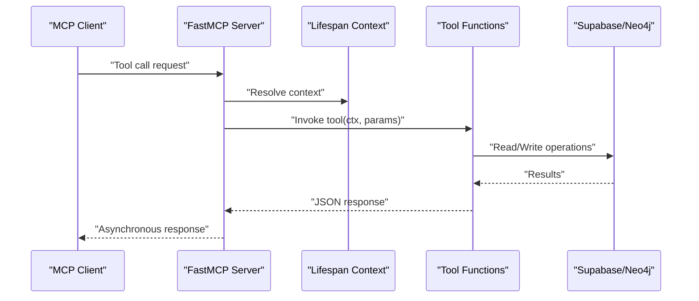
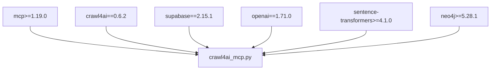

# API Reference

<cite>
**Referenced Files in This Document**
- [mcp.json](file://mcp.json)
- [README.md](file://README.md)
- [pyproject.toml](file://pyproject.toml)
- [src/crawl4ai_mcp.py](file://src/crawl4ai_mcp.py)
- [src/utils.py](file://src/utils.py)
- [knowledge_graphs/parse_repo_into_neo4j.py](file://knowledge_graphs/parse_repo_into_neo4j.py)
</cite>

## Table of Contents
1. [Introduction](#introduction)
2. [Project Structure](#project-structure)
3. [Core Components](#core-components)
4. [Architecture Overview](#architecture-overview)
5. [Detailed Component Analysis](#detailed-component-analysis)
6. [Dependency Analysis](#dependency-analysis)
7. [Performance Considerations](#performance-considerations)
8. [Troubleshooting Guide](#troubleshooting-guide)
9. [Conclusion](#conclusion)
10. [Appendices](#appendices)

## Introduction
This document provides API documentation for the MCP tool endpoints exposed by the Crawl4AI RAG MCP server. It covers the tool definitions, parameters, return values, MCP protocol requirements, error handling, asynchronous response patterns, authentication, rate limiting, timeouts, and versioning considerations. The source of truth for tool definitions is mcp.json, and implementation details are in src/crawl4ai_mcp.py. Additional knowledge graph tools are documented where applicable.

## Project Structure
The MCP server exposes a set of tools for web crawling, RAG search, and knowledge graph operations. The server is configured via environment variables and can be connected using SSE or stdio transports.

**Diagram sources**
- [src/crawl4ai_mcp.py](file://src/crawl4ai_mcp.py#L295-L300)
- [mcp.json](file://mcp.json#L1-L9)

**Section sources**
- [mcp.json](file://mcp.json#L1-L9)
- [README.md](file://README.md#L533-L593)

## Core Components
- FastMCP server with SSE transport and stdio transport support
- Tools for crawling, RAG search, code example search, and knowledge graph operations
- Supabase client for vector search and storage
- Optional Neo4j integration for knowledge graph operations

**Section sources**
- [src/crawl4ai_mcp.py](file://src/crawl4ai_mcp.py#L295-L300)
- [src/crawl4ai_mcp.py](file://src/crawl4ai_mcp.py#L1038-L1088)
- [src/crawl4ai_mcp.py](file://src/crawl4ai_mcp.py#L1089-L1348)
- [src/crawl4ai_mcp.py](file://src/crawl4ai_mcp.py#L1349-L1505)
- [src/crawl4ai_mcp.py](file://src/crawl4ai_mcp.py#L1506-L1594)
- [src/crawl4ai_mcp.py](file://src/crawl4ai_mcp.py#L1600-L2055)
- [src/crawl4ai_mcp.py](file://src/crawl4ai_mcp.py#L2057-L2185)

## Architecture Overview
The MCP server initializes a lifespan context that manages the crawler, Supabase client, optional reranking model, and optional Neo4j components. Tools operate within this context and return JSON-formatted responses.

**Diagram sources**
- [src/crawl4ai_mcp.py](file://src/crawl4ai_mcp.py#L130-L293)
- [src/crawl4ai_mcp.py](file://src/crawl4ai_mcp.py#L1038-L1505)
- [src/crawl4ai_mcp.py](file://src/crawl4ai_mcp.py#L1600-L2185)

## Detailed Component Analysis

### Tool: crawl_single_page
- Description: Crawl a single web page and store its content in Supabase for later retrieval and querying. Supports static content only mode to avoid JavaScript redirects.
- Tool name: crawl_single_page
- Parameters:
  - url (string, required): Target URL to crawl
  - disable_javascript (boolean, optional): If true, disables JavaScript for static content only
  - chunk_size (integer, optional): Maximum size of each content chunk in characters
- Return value structure (JSON):
  - success (boolean)
  - url (string)
  - chunks_stored (integer)
  - code_examples_stored (integer)
  - content_length (integer)
  - total_word_count (integer)
  - source_id (string)
  - links_count (object with internal and external counts)
  - error (string, present on failure)
- MCP protocol requirements:
  - Transport: SSE or stdio
  - Authentication: None (environment variables used internally)
  - Asynchronous response: Returned as JSON string
- Error handling:
  - Returns structured JSON with success=false and error on failures
- Example request:
  - Tool call with url and optional disable_javascript
- Example response:
  - Success JSON with summary fields
  - Failure JSON with error field

**Section sources**
- [src/crawl4ai_mcp.py](file://src/crawl4ai_mcp.py#L662-L831)

### Tool: smart_crawl_url
- Description: Intelligently crawl a URL based on its type (sitemap, text file, or regular webpage) and store content in Supabase. Supports parallel crawling and recursive crawling with depth control.
- Tool name: smart_crawl_url
- Parameters:
  - url (string, required): Target URL (sitemap.xml, .txt, or regular webpage)
  - max_depth (integer, optional): Maximum recursion depth for regular URLs
  - max_concurrent (integer, optional): Maximum number of concurrent browser sessions
  - chunk_size (integer, optional): Maximum size of each content chunk in characters
  - disable_javascript (boolean, optional): If true, disables JavaScript for static content only
- Return value structure (JSON):
  - success (boolean)
  - url (string)
  - crawl_type (string)
  - pages_crawled (integer)
  - chunks_stored (integer)
  - code_examples_stored (integer)
  - sources_updated (integer)
  - urls_crawled (array)
  - error (string, present on failure)
- MCP protocol requirements:
  - Transport: SSE or stdio
  - Authentication: None
  - Asynchronous response: Returned as JSON string
- Error handling:
  - Returns structured JSON with success=false and error on failures
- Example request:
  - Tool call with url and optional parameters
- Example response:
  - Success JSON with summary fields
  - Failure JSON with error field

**Section sources**
- [src/crawl4ai_mcp.py](file://src/crawl4ai_mcp.py#L833-L1037)

### Tool: get_available_sources
- Description: Get all available sources (domains) from the sources table, including summaries and statistics.
- Tool name: get_available_sources
- Parameters: None
- Return value structure (JSON):
  - success (boolean)
  - sources (array of objects with source_id, summary, total_word_count, created_at, updated_at)
  - count (integer)
  - error (string, present on failure)
- MCP protocol requirements:
  - Transport: SSE or stdio
  - Authentication: None
  - Asynchronous response: Returned as JSON string
- Error handling:
  - Returns structured JSON with success=false and error on failures

**Section sources**
- [src/crawl4ai_mcp.py](file://src/crawl4ai_mcp.py#L1038-L1088)

### Tool: perform_rag_query
- Description: Perform a RAG (Retrieval Augmented Generation) query on stored content with optional source filtering and hybrid search/reranking.
- Tool name: perform_rag_query
- Parameters:
  - query (string, required): Search query
  - source_type (string, optional): 'all', 'docs', 'dml', 'python', 'source'
  - match_count (integer, optional): Maximum number of results to return
- Return value structure (JSON):
  - success (boolean)
  - query (string)
  - source_type (string)
  - search_mode (string)
  - reranking_applied (boolean)
  - results (array of objects with url, content, metadata, similarity, optional rerank_score)
  - count (integer)
  - error (string, present on failure)
- MCP protocol requirements:
  - Transport: SSE or stdio
  - Authentication: None
  - Asynchronous response: Returned as JSON string
- Error handling:
  - Returns structured JSON with success=false and error on failures
- Notes:
  - Uses hybrid search and/or reranking based on environment configuration
  - Supports multi-source queries for 'source' and 'docs'

**Section sources**
- [src/crawl4ai_mcp.py](file://src/crawl4ai_mcp.py#L1089-L1348)

### Tool: search_code_examples
- Description: Search for code examples relevant to the query with optional source filtering and hybrid search/reranking.
- Tool name: search_code_examples
- Parameters:
  - query (string, required): Search query
  - source_id (string, optional): Filter results by source_id
  - match_count (integer, optional): Maximum number of results to return
- Return value structure (JSON):
  - success (boolean)
  - query (string)
  - source_filter (string)
  - search_mode (string)
  - reranking_applied (boolean)
  - results (array of objects with url, code, summary, metadata, source_id, similarity, optional rerank_score)
  - count (integer)
  - error (string, present on failure)
- MCP protocol requirements:
  - Transport: SSE or stdio
  - Authentication: None
  - Asynchronous response: Returned as JSON string
- Error handling:
  - Returns structured JSON with success=false and error on failures
- Notes:
  - Requires USE_AGENTIC_RAG=true to be enabled

**Section sources**
- [src/crawl4ai_mcp.py](file://src/crawl4ai_mcp.py#L1349-L1505)

### Tool: parse_github_repository
- Description: Parse a GitHub repository into the Neo4j knowledge graph, storing classes, methods, functions, and imports for hallucination detection.
- Tool name: parse_github_repository
- Parameters:
  - repo_url (string, required): GitHub repository URL ending with .git
- Return value structure (JSON):
  - success (boolean)
  - repo_url (string)
  - repo_name (string)
  - message (string)
  - statistics (object with repository, files_processed, classes_created, methods_created, functions_created, attributes_created, sample_modules)
  - ready_for_validation (boolean)
  - next_steps (array of strings)
  - error (string, present on failure)
- MCP protocol requirements:
  - Transport: SSE or stdio
  - Authentication: None
  - Asynchronous response: Returned as JSON string
- Error handling:
  - Returns structured JSON with success=false and error on failures
- Notes:
  - Requires USE_KNOWLEDGE_GRAPH=true and valid Neo4j configuration

**Section sources**
- [src/crawl4ai_mcp.py](file://src/crawl4ai_mcp.py#L2057-L2185)
- [knowledge_graphs/parse_repo_into_neo4j.py](file://knowledge_graphs/parse_repo_into_neo4j.py#L1-L200)

### Tool: check_ai_script_hallucinations
- Description: Check an AI-generated Python script for hallucinations by validating imports, method calls, class usage, and function calls against the knowledge graph.
- Tool name: check_ai_script_hallucinations
- Parameters:
  - script_path (string, required): Absolute path to the Python script to analyze
- Return value structure (JSON):
  - success (boolean)
  - script_path (string)
  - overall_confidence (number)
  - validation_summary (object with total_validations, valid_count, invalid_count, uncertain_count, not_found_count, hallucination_rate)
  - hallucinations_detected (array)
  - recommendations (array)
  - analysis_metadata (object with total_imports, total_classes, total_methods, total_attributes, total_functions)
  - libraries_analyzed (array)
  - error (string, present on failure)
- MCP protocol requirements:
  - Transport: SSE or stdio
  - Authentication: None
  - Asynchronous response: Returned as JSON string
- Error handling:
  - Returns structured JSON with success=false and error on failures
- Notes:
  - Requires USE_KNOWLEDGE_GRAPH=true and valid Neo4j configuration

**Section sources**
- [src/crawl4ai_mcp.py](file://src/crawl4ai_mcp.py#L1506-L1594)

### Tool: query_knowledge_graph
- Description: Query and explore the Neo4j knowledge graph with commands such as repos, explore, classes, class, method, and custom Cypher queries.
- Tool name: query_knowledge_graph
- Parameters:
  - command (string, required): Command string (e.g., repos, explore <repo>, classes [repo], class <name>, method <name> [class], query <cypher>)
- Return value structure (JSON):
  - success (boolean)
  - command (string)
  - data (object varies by command)
  - metadata (object with total_results, limited, and additional fields)
  - error (string, present on failure)
- MCP protocol requirements:
  - Transport: SSE or stdio
  - Authentication: None
  - Asynchronous response: Returned as JSON string
- Error handling:
  - Returns structured JSON with success=false and error on failures
- Notes:
  - Requires USE_KNOWLEDGE_GRAPH=true and valid Neo4j configuration

**Section sources**
- [src/crawl4ai_mcp.py](file://src/crawl4ai_mcp.py#L1600-L2055)

## Dependency Analysis
The server depends on MCP, Crawl4AI, Supabase, OpenAI/Copilot, sentence-transformers, and Neo4j. Version constraints are defined in pyproject.toml.

**Diagram sources**
- [pyproject.toml](file://pyproject.toml#L11-L25)

**Section sources**
- [pyproject.toml](file://pyproject.toml#L11-L25)

## Performance Considerations
- Reranking: Cross-encoder reranking adds ~100–200ms per query depending on result count.
- Hybrid search: Combines vector and keyword search for robustness at slight computational overhead.
- Parallel crawling: max_concurrent controls concurrency; reduce for memory-constrained environments.
- Contextual embeddings: Enhances retrieval accuracy but increases LLM calls during indexing.
- Code example extraction: Significantly slower crawling due to code extraction and summarization.

[No sources needed since this section provides general guidance]

## Troubleshooting Guide
- Startup readiness: Wait for the server ready message before connecting clients.
- Rate limiting: GitHub Copilot integration includes automatic rate limiting and exponential backoff.
- Neo4j connectivity: Validate environment variables and ensure Neo4j is running.
- Supabase connectivity: Verify SUPABASE_URL and SUPABASE_SERVICE_KEY.
- Tool-specific checks:
  - USE_AGENTIC_RAG must be enabled for search_code_examples
  - USE_KNOWLEDGE_GRAPH must be enabled for knowledge graph tools

**Section sources**
- [README.md](file://README.md#L425-L482)
- [README.md](file://README.md#L297-L317)
- [README.md](file://README.md#L352-L371)

## Conclusion
The MCP server provides a comprehensive suite of tools for web crawling, RAG search, code example retrieval, and knowledge graph operations. Tools return structured JSON responses and follow MCP protocol requirements. Proper configuration of environment variables enables advanced features like hybrid search, reranking, contextual embeddings, and knowledge graph validation.

[No sources needed since this section summarizes without analyzing specific files]

## Appendices

### MCP Protocol Requirements
- Transport: SSE or stdio
- Connection configuration examples:
  - SSE: mcp.json defines transport and url
  - Stdio: README provides configuration examples for various clients

**Section sources**
- [mcp.json](file://mcp.json#L1-L9)
- [README.md](file://README.md#L533-L593)

### Authentication and Security
- No explicit authentication required by tools; relies on environment variables for external services.
- Supabase uses service key; OpenAI/GitHub Copilot credentials are configured via environment variables.

**Section sources**
- [src/utils.py](file://src/utils.py#L106-L119)
- [README.md](file://README.md#L206-L242)

### Rate Limiting and Timeouts
- GitHub Copilot rate limiting: Requests per minute configurable; burst protection and smart throttling.
- Timeouts: Crawler run configurations include page timeouts and delays for static content.
- Startup time: Model downloads and loading can take 30 seconds to several minutes.

**Section sources**
- [README.md](file://README.md#L297-L317)
- [src/crawl4ai_mcp.py](file://src/crawl4ai_mcp.py#L688-L710)

### Versioning and Backward Compatibility
- Project version: 0.1.0
- MCP dependency: >=1.19.0
- Crawl4AI dependency: 0.6.2
- Supabase dependency: 2.15.1
- OpenAI dependency: 1.71.0
- sentence-transformers dependency: >=4.1.0
- Neo4j dependency: >=5.28.1

**Section sources**
- [pyproject.toml](file://pyproject.toml#L1-L40)

### Example Requests and Responses
- Example request for crawl_single_page:
  - Tool call with url and optional disable_javascript
- Example response for crawl_single_page:
  - Success JSON with summary fields
- Example request for perform_rag_query:
  - Tool call with query, source_type, match_count
- Example response for perform_rag_query:
  - Success JSON with results array and rerank_score if enabled
- Example request for search_code_examples:
  - Tool call with query, optional source_id, match_count
- Example response for search_code_examples:
  - Success JSON with results array
- Example request for parse_github_repository:
  - Tool call with repo_url
- Example response for parse_github_repository:
  - Success JSON with statistics and next steps
- Example request for check_ai_script_hallucinations:
  - Tool call with script_path
- Example response for check_ai_script_hallucinations:
  - Success JSON with validation_summary, hallucinations_detected, recommendations
- Example request for query_knowledge_graph:
  - Tool call with command (e.g., repos, explore <repo>, classes [repo], class <name>, method <name> [class], query <cypher>)
- Example response for query_knowledge_graph:
  - Success JSON with data and metadata

**Section sources**
- [src/crawl4ai_mcp.py](file://src/crawl4ai_mcp.py#L662-L831)
- [src/crawl4ai_mcp.py](file://src/crawl4ai_mcp.py#L1089-L1348)
- [src/crawl4ai_mcp.py](file://src/crawl4ai_mcp.py#L1349-L1505)
- [src/crawl4ai_mcp.py](file://src/crawl4ai_mcp.py#L2057-L2185)
- [src/crawl4ai_mcp.py](file://src/crawl4ai_mcp.py#L1506-L1594)
- [src/crawl4ai_mcp.py](file://src/crawl4ai_mcp.py#L1600-L2055)