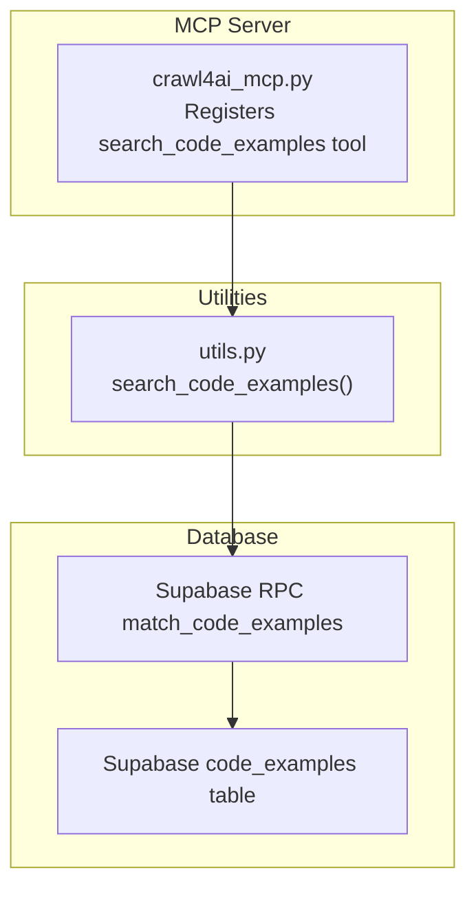
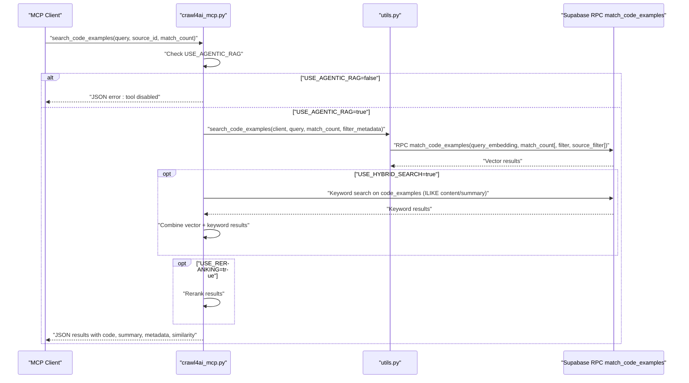
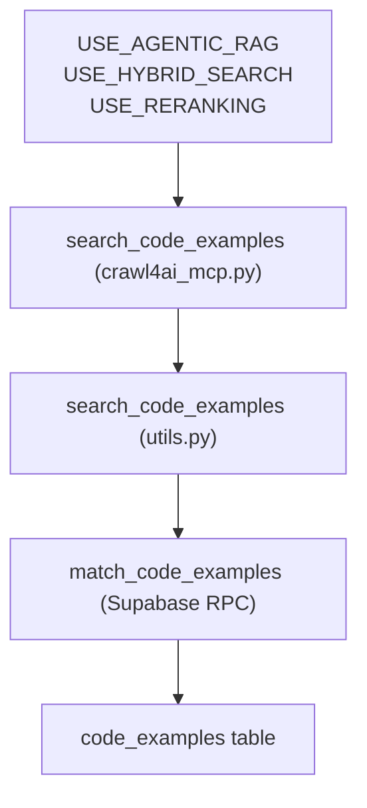

# Conditional Tools

<cite>
**Referenced Files in This Document**
- [src/crawl4ai_mcp.py](file://src/crawl4ai_mcp.py)
- [src/utils.py](file://src/utils.py)
- [README.md](file://README.md)
</cite>

## Table of Contents
1. [Introduction](#introduction)
2. [Project Structure](#project-structure)
3. [Core Components](#core-components)
4. [Architecture Overview](#architecture-overview)
5. [Detailed Component Analysis](#detailed-component-analysis)
6. [Dependency Analysis](#dependency-analysis)
7. [Performance Considerations](#performance-considerations)
8. [Troubleshooting Guide](#troubleshooting-guide)
9. [Conclusion](#conclusion)

## Introduction
This document provides API documentation for the conditional tool search_code_examples. It explains the tool’s purpose, parameters, return value structure, and environment-dependent availability. It also details how the tool searches through extracted code examples rather than general documentation content, and how the implementation uses Supabase keyword search on the code_examples table. Example requests and responses are included, along with common issues and resolutions.

## Project Structure
The search_code_examples tool is implemented as an MCP tool registered in the server and backed by a vectorized code example search function in utilities. The tool is gated behind the USE_AGENTIC_RAG environment variable.

**Diagram sources**
- [src/crawl4ai_mcp.py](file://src/crawl4ai_mcp.py#L1350-L1505)
- [src/utils.py](file://src/utils.py#L935-L984)

**Section sources**
- [src/crawl4ai_mcp.py](file://src/crawl4ai_mcp.py#L1350-L1505)
- [src/utils.py](file://src/utils.py#L935-L984)

## Core Components
- Tool name: search_code_examples
- Availability: Only when USE_AGENTIC_RAG=true
- Purpose: Search specifically for code examples and their summaries from crawled documentation, returning targeted code snippet retrieval for AI coding assistants.
- Implementation: Uses vector similarity search via a Supabase RPC function and can optionally combine with keyword search on the code_examples table.

Key environment variables:
- USE_AGENTIC_RAG: Enables code example extraction and the search_code_examples tool.
- USE_HYBRID_SEARCH: Enables hybrid search combining vector and keyword results.
- USE_RERANKING: Applies cross-encoder reranking to refine results.
- SUPABASE_URL, SUPABASE_SERVICE_KEY: Supabase connectivity for database operations.

**Section sources**
- [README.md](file://README.md#L60-L80)
- [README.md](file://README.md#L336-L342)
- [src/crawl4ai_mcp.py](file://src/crawl4ai_mcp.py#L1350-L1505)
- [src/utils.py](file://src/utils.py#L935-L984)

## Architecture Overview
The tool integrates with the MCP server and utilities to deliver a hybrid or vector-only search over code examples.

**Diagram sources**
- [src/crawl4ai_mcp.py](file://src/crawl4ai_mcp.py#L1350-L1505)
- [src/utils.py](file://src/utils.py#L935-L984)

## Detailed Component Analysis

### Tool Definition and Registration
- The tool is defined as an asynchronous MCP tool in the server module.
- It validates the USE_AGENTIC_RAG environment variable and returns an error if disabled.
- It supports optional source_id filtering and match_count limiting.
- It can perform hybrid search by combining vector and keyword results, and optionally applies reranking.

Parameters:
- query: String search query.
- source_id: Optional string to filter by source identifier.
- match_count: Integer maximum number of results to return.

Return value structure (JSON):
- success: Boolean indicating success or failure.
- query: Original query string.
- source_filter: Provided source_id or null.
- search_mode: "hybrid" or "vector".
- reranking_applied: Boolean indicating whether reranking was applied.
- results: Array of result objects with:
  - url: Source URL.
  - code: Extracted code example content.
  - summary: Generated summary of the code example.
  - metadata: Metadata associated with the example.
  - source_id: Source identifier.
  - similarity: Vector similarity score (present when vector search is used).
  - rerank_score: Rerank score (present when reranking is applied).
- count: Number of results returned.
- error: Present on failure with error message.

Behavioral notes:
- When USE_HYBRID_SEARCH=true, the server performs a vector search and a keyword search on the code_examples table, then merges them with preference for items appearing in both.
- When USE_RERANKING=true, a cross-encoder model reranks results by relevance to the query.

**Section sources**
- [src/crawl4ai_mcp.py](file://src/crawl4ai_mcp.py#L1350-L1505)

### Implementation Details in Utilities
- The vector search function constructs an enhanced query incorporating both the user query and a summary template, then creates an embedding for the query.
- It calls the Supabase RPC function match_code_examples with parameters:
  - query_embedding: Embedding vector for the enhanced query.
  - match_count: Maximum number of results.
  - filter: Optional metadata filter.
  - source_filter: Optional source_id filter.
- The function returns a list of matching code examples from the code_examples table.

Supabase keyword search (when hybrid is enabled):
- The server executes a keyword search on the code_examples table using ILIKE on both content and summary fields.
- It can apply an additional source_id filter if provided.
- Results are combined with vector results, giving preference to items present in both.

**Section sources**
- [src/utils.py](file://src/utils.py#L935-L984)
- [src/crawl4ai_mcp.py](file://src/crawl4ai_mcp.py#L1396-L1458)

### How It Differs from General Documentation Search
- The search_code_examples tool searches the code_examples table, which contains extracted code snippets and their summaries.
- General documentation search targets the crawled_pages table and uses match_crawled_pages RPC.
- The code example search is optimized for code-focused queries and returns both code and summary fields.

**Section sources**
- [src/utils.py](file://src/utils.py#L935-L984)
- [src/crawl4ai_mcp.py](file://src/crawl4ai_mcp.py#L1396-L1458)

### Example Requests and Responses

Example request (tool invocation):
- Parameters:
  - query: "how to configure a model"
  - source_id: "example.com"
  - match_count: 5

Example response (success):
{
  "success": true,
  "query": "how to configure a model",
  "source_filter": "example.com",
  "search_mode": "vector",
  "reranking_applied": false,
  "results": [
    {
      "url": "https://example.com/docs/model-config",
      "code": "...\n",
      "summary": "Configure model parameters...",
      "metadata": { "chunk_index": 1, "char_count": 1200 },
      "source_id": "example.com",
      "similarity": 0.85
    }
  ],
  "count": 1
}

Example response (failure - tool disabled):
{
  "success": false,
  "error": "Code example extraction is disabled. Perform a normal RAG search."
}

Example response (empty results):
{
  "success": true,
  "query": "nonexistent term",
  "source_filter": null,
  "search_mode": "vector",
  "reranking_applied": false,
  "results": [],
  "count": 0
}

**Section sources**
- [src/crawl4ai_mcp.py](file://src/crawl4ai_mcp.py#L1350-L1505)

## Dependency Analysis
- The MCP tool depends on environment variables to gate functionality.
- The vector search relies on the Supabase RPC match_code_examples and the embedding provider configured in utilities.
- Hybrid search adds a keyword search on the code_examples table using ILIKE conditions.
- Reranking depends on a cross-encoder model when enabled.

**Diagram sources**
- [src/crawl4ai_mcp.py](file://src/crawl4ai_mcp.py#L1350-L1505)
- [src/utils.py](file://src/utils.py#L935-L984)

**Section sources**
- [src/crawl4ai_mcp.py](file://src/crawl4ai_mcp.py#L1350-L1505)
- [src/utils.py](file://src/utils.py#L935-L984)

## Performance Considerations
- Enabling USE_AGENTIC_RAG increases crawling and storage costs due to code extraction and summarization.
- Hybrid search adds keyword search overhead but improves recall for exact terms.
- Reranking improves precision but adds latency proportional to result count.

[No sources needed since this section provides general guidance]

## Troubleshooting Guide
Common issues and resolutions:
- Tool does not appear in the tool list:
  - Cause: USE_AGENTIC_RAG is not set to true in the environment.
  - Resolution: Set USE_AGENTIC_RAG=true and restart the server.
- Empty results:
  - Cause: No code examples have been extracted yet, or the query yields no matches.
  - Resolution: Ensure USE_AGENTIC_RAG=true and crawl documentation to populate the code_examples table; adjust query terms or enable hybrid search.
- Tool returns an error indicating the tool is disabled:
  - Cause: USE_AGENTIC_RAG remains false.
  - Resolution: Update environment configuration and restart the server.

**Section sources**
- [README.md](file://README.md#L336-L342)
- [src/crawl4ai_mcp.py](file://src/crawl4ai_mcp.py#L1350-L1505)

## Conclusion
The search_code_examples tool provides a focused, code-centric search capability powered by vector similarity and optional keyword matching. Its availability and behavior are controlled by environment variables, and it integrates seamlessly with the MCP server and Supabase backend. Proper configuration and understanding of its hybrid and reranking features can significantly improve the relevance of code example retrieval for AI coding assistants.