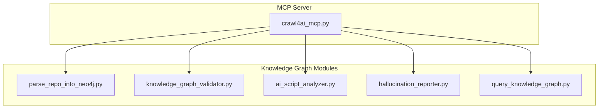
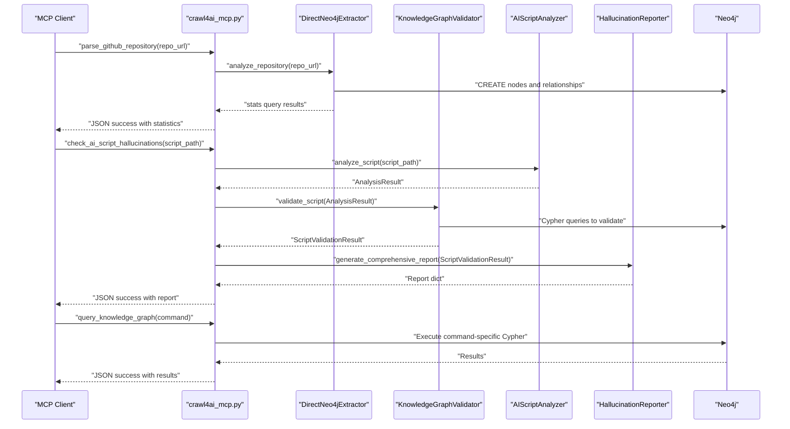
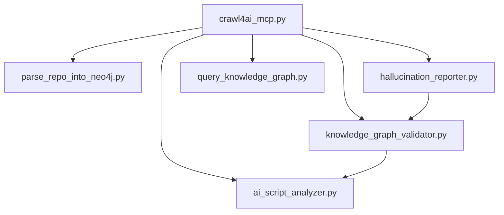

# Knowledge Graph Tools

<cite>
**Referenced Files in This Document**
- [crawl4ai_mcp.py](file://src/crawl4ai_mcp.py)
- [parse_repo_into_neo4j.py](file://knowledge_graphs/parse_repo_into_neo4j.py)
- [ai_hallucination_detector.py](file://knowledge_graphs/ai_hallucination_detector.py)
- [ai_script_analyzer.py](file://knowledge_graphs/ai_script_analyzer.py)
- [knowledge_graph_validator.py](file://knowledge_graphs/knowledge_graph_validator.py)
- [hallucination_reporter.py](file://knowledge_graphs/hallucination_reporter.py)
- [query_knowledge_graph.py](file://knowledge_graphs/query_knowledge_graph.py)
</cite>

## Table of Contents
1. [Introduction](#introduction)
2. [Project Structure](#project-structure)
3. [Core Components](#core-components)
4. [Architecture Overview](#architecture-overview)
5. [Detailed Component Analysis](#detailed-component-analysis)
6. [Dependency Analysis](#dependency-analysis)
7. [Performance Considerations](#performance-considerations)
8. [Troubleshooting Guide](#troubleshooting-guide)
9. [Conclusion](#conclusion)

## Introduction
This document provides API documentation for three MCP tools that integrate with a Neo4j-powered knowledge graph:
- parse_github_repository
- check_ai_script_hallucinations
- query_knowledge_graph

It explains how each tool works, its parameters, return values, example requests/responses, and error handling behavior. It also describes how the underlying knowledge graph modules parse repositories, validate AI scripts, and query the graph.

## Project Structure
The MCP server exposes the tools defined in the server module. The knowledge graph logic resides in dedicated modules under knowledge_graphs/.

**Diagram sources**
- [crawl4ai_mcp.py](file://src/crawl4ai_mcp.py#L1500-L2199)
- [parse_repo_into_neo4j.py](file://knowledge_graphs/parse_repo_into_neo4j.py#L1-L858)
- [knowledge_graph_validator.py](file://knowledge_graphs/knowledge_graph_validator.py#L1-L1244)
- [ai_script_analyzer.py](file://knowledge_graphs/ai_script_analyzer.py#L1-L532)
- [hallucination_reporter.py](file://knowledge_graphs/hallucination_reporter.py#L1-L523)
- [query_knowledge_graph.py](file://knowledge_graphs/query_knowledge_graph.py#L1-L400)

**Section sources**
- [crawl4ai_mcp.py](file://src/crawl4ai_mcp.py#L1500-L2199)

## Core Components
- parse_github_repository: Clones a GitHub repository, analyzes Python files, and stores code structure (classes, methods, functions, imports) into Neo4j for subsequent hallucination detection.
- check_ai_script_hallucinations: Validates an AI-generated Python script against the knowledge graph by analyzing imports, method calls, class instantiations, function calls, and attribute accesses.
- query_knowledge_graph: Executes commands to explore the knowledge graph (list repositories, explore repository, list classes, explore class, search method, run custom Cypher query).

**Section sources**
- [crawl4ai_mcp.py](file://src/crawl4ai_mcp.py#L1500-L2199)
- [parse_repo_into_neo4j.py](file://knowledge_graphs/parse_repo_into_neo4j.py#L1-L858)
- [knowledge_graph_validator.py](file://knowledge_graphs/knowledge_graph_validator.py#L1-L1244)
- [ai_script_analyzer.py](file://knowledge_graphs/ai_script_analyzer.py#L1-L532)
- [hallucination_reporter.py](file://knowledge_graphs/hallucination_reporter.py#L1-L523)
- [query_knowledge_graph.py](file://knowledge_graphs/query_knowledge_graph.py#L1-L400)

## Architecture Overview
The MCP server initializes Neo4j components and exposes tools that rely on:
- DirectNeo4jExtractor for repository parsing and graph creation
- KnowledgeGraphValidator for script validation
- AIScriptAnalyzer for AST-based script analysis
- HallucinationReporter for generating structured reports
- KnowledgeGraphQuerier for interactive graph exploration

**Diagram sources**
- [crawl4ai_mcp.py](file://src/crawl4ai_mcp.py#L1500-L2199)
- [parse_repo_into_neo4j.py](file://knowledge_graphs/parse_repo_into_neo4j.py#L1-L858)
- [knowledge_graph_validator.py](file://knowledge_graphs/knowledge_graph_validator.py#L1-L1244)
- [ai_script_analyzer.py](file://knowledge_graphs/ai_script_analyzer.py#L1-L532)
- [hallucination_reporter.py](file://knowledge_graphs/hallucination_reporter.py#L1-L523)
- [query_knowledge_graph.py](file://knowledge_graphs/query_knowledge_graph.py#L1-L400)

## Detailed Component Analysis

### parse_github_repository
- Tool name: parse_github_repository
- Description: Parses a GitHub repository into the Neo4j knowledge graph. It validates the repository URL, clones the repository (shallow clone), analyzes Python files, and creates nodes and relationships representing files, classes, methods, functions, and imports.
- Parameters:
  - repo_url (string, required): GitHub repository URL ending with .git. Must start with https:// or git@.
- Returns:
  - JSON object with:
    - success (boolean)
    - repo_url (string)
    - repo_name (string)
    - message (string)
    - statistics (object):
      - repository (string)
      - files_processed (integer)
      - classes_created (integer)
      - methods_created (integer)
      - functions_created (integer)
      - attributes_created (integer)
      - sample_modules ([string])
    - ready_for_validation (boolean)
    - next_steps ([string])

Example request:
- Tool: parse_github_repository
- Parameters: {"repo_url": "https://github.com/user/repo.git"}

Example response (success):
{
  "success": true,
  "repo_url": "https://github.com/user/repo.git",
  "repo_name": "repo",
  "message": "Successfully parsed repository 'repo' into knowledge graph",
  "statistics": {
    "repository": "repo",
    "files_processed": 120,
    "classes_created": 85,
    "methods_created": 320,
    "functions_created": 45,
    "attributes_created": 110,
    "sample_modules": ["myapp.api", "myapp.models", "myapp.utils"]
  },
  "ready_for_validation": true,
  "next_steps": [
    "Repository is now available for hallucination detection",
    "Use check_ai_script_hallucinations to validate scripts against repo",
    "The knowledge graph contains classes, methods, and functions from this repository"
  ]
}

Error handling:
- Knowledge graph disabled: returns {"success": false, "error": "..."}. Enable USE_KNOWLEDGE_GRAPH=true.
- Neo4j not configured: returns {"success": false, "error": "..."}. Set NEO4J_URI, NEO4J_USER, NEO4J_PASSWORD.
- Invalid repo URL: returns {"success": false, "repo_url": "...", "error": "..."}. Ensure URL ends with .git and starts with https:// or git@.
- Parsing failure: returns {"success": false, "repo_url": "...", "error": "..."}. Check repository accessibility and Neo4j connectivity.

Notes:
- The tool uses DirectNeo4jExtractor.analyze_repository internally, which:
  - Clears existing data for the repository
  - Clones with shallow depth
  - Walks the repository to find Python files (excluding tests and common directories)
  - Builds module names and identifies project modules
  - Creates constraints and indexes
  - Inserts nodes and relationships for Repository, File, Class, Method, Attribute, Function, and IMPORTS relationships

**Section sources**
- [crawl4ai_mcp.py](file://src/crawl4ai_mcp.py#L2057-L2184)
- [parse_repo_into_neo4j.py](file://knowledge_graphs/parse_repo_into_neo4j.py#L1-L858)

### check_ai_script_hallucinations
- Tool name: check_ai_script_hallucinations
- Description: Validates an AI-generated Python script against the knowledge graph. It analyzes imports, method calls, class instantiations, function calls, and attribute accesses, then compares them against the graph to detect hallucinations.
- Parameters:
  - script_path (string, required): Absolute path to the Python script to analyze.
- Returns:
  - JSON object with:
    - success (boolean)
    - script_path (string)
    - overall_confidence (float)
    - validation_summary (object):
      - total_validations (integer)
      - valid_count (integer)
      - invalid_count (integer)
      - uncertain_count (integer)
      - not_found_count (integer)
      - hallucination_rate (float)
    - hallucinations_detected ([object])
    - recommendations ([string])
    - analysis_metadata (object):
      - total_imports (integer)
      - total_classes (integer)
      - total_methods (integer)
      - total_attributes (integer)
      - total_functions (integer)
    - libraries_analyzed ([object])

Example request:
- Tool: check_ai_script_hallucinations
- Parameters: {"script_path": "/absolute/path/to/script.py"}

Example response (success):
{
  "success": true,
  "script_path": "/absolute/path/to/script.py",
  "overall_confidence": 0.85,
  "validation_summary": {
    "total_validations": 24,
    "valid_count": 18,
    "invalid_count": 3,
    "uncertain_count": 2,
    "not_found_count": 1,
    "hallucination_rate": 0.17
  },
  "hallucinations_detected": [
    {
      "type": "METHOD_NOT_FOUND",
      "location": "Line 42",
      "description": "Non-existent method 'nonexistent_method' on class 'SomeClass'",
      "suggestion": "Use 'existing_method' instead"
    }
  ],
  "recommendations": [
    "Found 1 non-existent methods in knowledge graph libraries. Consider checking the official documentation.",
    "Found 1 parameter mismatch in knowledge graph libraries. Check function signatures.",
    "Overall confidence is moderate. Most validations were for external libraries not in the knowledge graph."
  ],
  "analysis_metadata": {
    "total_imports": 5,
    "total_classes": 3,
    "total_methods": 8,
    "total_attributes": 2,
    "total_functions": 6
  },
  "libraries_analyzed": [
    {
      "module_name": "requests",
      "import_status": "VALID",
      "import_confidence": 0.90,
      "classes_used": [],
      "methods_called": [],
      "attributes_accessed": [],
      "functions_called": []
    },
    {
      "module_name": "mylib",
      "import_status": "VALID",
      "import_confidence": 0.85,
      "classes_used": [
        {"class_name": "SomeClass", "status": "VALID", "confidence": 0.90}
      ],
      "methods_called": [
        {"method_name": "existing_method", "class_name": "SomeClass", "status": "VALID", "confidence": 0.95}
      ],
      "attributes_accessed": [],
      "functions_called": []
    }
  ]
}

Error handling:
- Knowledge graph disabled: returns {"success": false, "error": "..."}. Enable USE_KNOWLEDGE_GRAPH=true.
- Neo4j not configured: returns {"success": false, "error": "..."}. Set NEO4J_URI, NEO4J_USER, NEO4J_PASSWORD.
- Invalid script path: returns {"success": false, "script_path": "...", "error": "..."}. Ensure path exists and is readable.
- Analysis failures: returns {"success": false, "script_path": "...", "error": "..."}. Check script readability and Neo4j connectivity.

Validation pipeline:
- AIScriptAnalyzer extracts imports, class instantiations, method calls, function calls, and attribute accesses from the script.
- KnowledgeGraphValidator validates each element against the graph, including parameter validation for methods and functions.
- HallucinationReporter generates a comprehensive report with categorized validations, hallucinations, recommendations, and library summaries.

**Section sources**
- [crawl4ai_mcp.py](file://src/crawl4ai_mcp.py#L1506-L1594)
- [ai_script_analyzer.py](file://knowledge_graphs/ai_script_analyzer.py#L1-L532)
- [knowledge_graph_validator.py](file://knowledge_graphs/knowledge_graph_validator.py#L1-L1244)
- [hallucination_reporter.py](file://knowledge_graphs/hallucination_reporter.py#L1-L523)

### query_knowledge_graph
- Tool name: query_knowledge_graph
- Description: Executes commands to explore the knowledge graph. Supported commands include listing repositories, exploring a repository, listing classes, exploring a class, searching for a method, and running a custom Cypher query.
- Parameters:
  - command (string, required): Command string. Supported commands:
    - repos
    - explore <repo_name>
    - classes [repo_name]
    - class <class_name>
    - method <method_name> [class_name]
    - query <cypher_query>
- Returns:
  - JSON object with:
    - success (boolean)
    - command (string)
    - data (object or null)
    - metadata (object)

Example request:
- Tool: query_knowledge_graph
- Parameters: {"command": "repos"}

Example response (repos):
{
  "success": true,
  "command": "repos",
  "data": ["pydantic-ai", "requests"],
  "metadata": {}
}

Example request:
- Tool: query_knowledge_graph
- Parameters: {"command": "explore pydantic-ai"}

Example response (explore):
{
  "success": true,
  "command": "explore pydantic-ai",
  "data": {
    "files_count": 120,
    "classes_count": 85,
    "functions_count": 45,
    "attributes_count": 110
  },
  "metadata": {}
}

Example request:
- Tool: query_knowledge_graph
- Parameters: {"command": "method run_stream Agent"}

Example response (method):
{
  "success": true,
  "command": "method run_stream Agent",
  "data": {
    "methods": [
      {
        "class_name": "Agent",
        "class_full_name": "pydantic_ai.Agent",
        "method_name": "run_stream",
        "params_list": ["self", "prompt: str", "stream: bool=True"],
        "return_type": "StreamedRunResult",
        "args": ["self", "prompt"]
      }
    ],
    "class_filter": "Agent"
  },
  "metadata": {
    "total_results": 1,
    "limited": false
  }
}

Example request:
- Tool: query_knowledge_graph
- Parameters: {"command": "query MATCH (c:Class)-[:HAS_METHOD]->(m:Method) WHERE m.name = 'run' RETURN c.name, m.name LIMIT 5"}

Example response (custom query):
{
  "success": true,
  "command": "query MATCH ...",
  "data": {
    "query": "MATCH (c:Class)-[:HAS_METHOD]->(m:Method) WHERE m.name = 'run' RETURN c.name, m.name LIMIT 5",
    "results": [
      {"c.name": "SomeClass", "m.name": "run"},
      {"c.name": "AnotherClass", "m.name": "run"}
    ]
  },
  "metadata": {
    "total_results": 2,
    "limited": false
  }
}

Error handling:
- Knowledge graph disabled: returns {"success": false, "error": "..."}. Enable USE_KNOWLEDGE_GRAPH=true.
- Neo4j not configured: returns {"success": false, "error": "..."}. Set NEO4J_URI, NEO4J_USER, NEO4J_PASSWORD.
- Empty command: returns {"success": false, "command": "", "error": "..."}. Provide a valid command.
- Cypher query errors: returns {"success": false, "command": "...", "error": "..."}. Fix the Cypher syntax.

Command routing:
- repos: Lists repositories in the graph.
- explore <repo>: Returns counts for files, classes, functions, and attributes in the given repository.
- classes [repo]: Lists classes across repositories or within a specific repository (limited to 20).
- class <name>: Explores a class and lists its methods and attributes.
- method <name> [class]: Searches for a method by name, optionally constrained to a class.
- query <cypher>: Executes a custom Cypher query with a limit of 20 results.

**Section sources**
- [crawl4ai_mcp.py](file://src/crawl4ai_mcp.py#L1602-L2056)
- [query_knowledge_graph.py](file://knowledge_graphs/query_knowledge_graph.py#L1-L400)

## Dependency Analysis
The MCP server depends on the knowledge graph modules for repository parsing, validation, and querying. The modules are cohesive around their responsibilities and interact with Neo4j via AsyncGraphDatabase drivers.

**Diagram sources**
- [crawl4ai_mcp.py](file://src/crawl4ai_mcp.py#L1500-L2199)
- [parse_repo_into_neo4j.py](file://knowledge_graphs/parse_repo_into_neo4j.py#L1-L858)
- [knowledge_graph_validator.py](file://knowledge_graphs/knowledge_graph_validator.py#L1-L1244)
- [ai_script_analyzer.py](file://knowledge_graphs/ai_script_analyzer.py#L1-L532)
- [hallucination_reporter.py](file://knowledge_graphs/hallucination_reporter.py#L1-L523)
- [query_knowledge_graph.py](file://knowledge_graphs/query_knowledge_graph.py#L1-L400)

**Section sources**
- [crawl4ai_mcp.py](file://src/crawl4ai_mcp.py#L1500-L2199)
- [knowledge_graph_validator.py](file://knowledge_graphs/knowledge_graph_validator.py#L1-L1244)

## Performance Considerations
- Repository parsing:
  - Uses shallow clone to reduce bandwidth and time.
  - Excludes test directories and common non-source folders.
  - Performs AST analysis and Neo4j writes in batches; consider batching Cypher operations for very large repositories.
- Validation:
  - Maintains caches for modules, classes, and methods to reduce repeated queries.
  - Parameter validation supports positional, keyword-only, varargs, and varkwargs.
- Query tool:
  - Limits results to 20 for custom queries to prevent overwhelming responses.

[No sources needed since this section provides general guidance]

## Troubleshooting Guide
Common issues and resolutions:
- Knowledge graph disabled:
  - Symptom: Tools return {"success": false, "error": "..."} indicating knowledge graph is disabled.
  - Resolution: Set USE_KNOWLEDGE_GRAPH=true in environment variables.
- Neo4j configuration errors:
  - Symptom: Authentication or connection failures.
  - Resolution: Verify NEO4J_URI, NEO4J_USER, NEO4J_PASSWORD. Use format_neo4j_error to interpret errors.
- Repository access issues:
  - Symptom: Repository parsing fails due to invalid URL or network issues.
  - Resolution: Ensure repo_url ends with .git and starts with https:// or git@. Confirm network access and repository availability.
- Script validation issues:
  - Symptom: Script path not found or unreadable.
  - Resolution: Ensure script_path exists and is readable. Only .py files are supported.
- Query errors:
  - Symptom: Cypher query errors or empty command.
  - Resolution: Provide a valid command. Fix Cypher syntax and ensure the graph contains expected data.

**Section sources**
- [crawl4ai_mcp.py](file://src/crawl4ai_mcp.py#L63-L101)
- [crawl4ai_mcp.py](file://src/crawl4ai_mcp.py#L1506-L1594)
- [crawl4ai_mcp.py](file://src/crawl4ai_mcp.py#L1602-L2056)
- [parse_repo_into_neo4j.py](file://knowledge_graphs/parse_repo_into_neo4j.py#L1-L858)

## Conclusion
These MCP tools provide a complete pipeline for building and querying a knowledge graph from GitHub repositories, and for validating AI-generated scripts against real codebases. By enabling the knowledge graph and configuring Neo4j, teams can detect hallucinations early in development and explore repository structures efficiently.