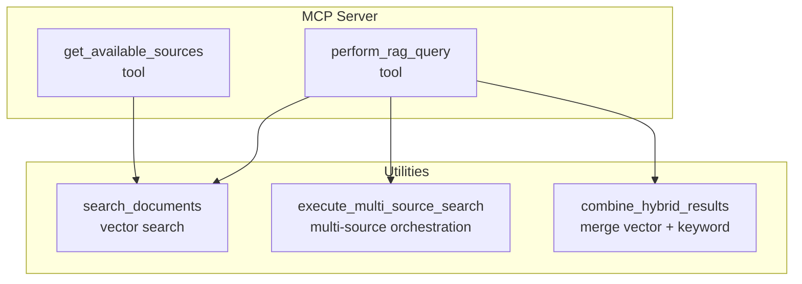
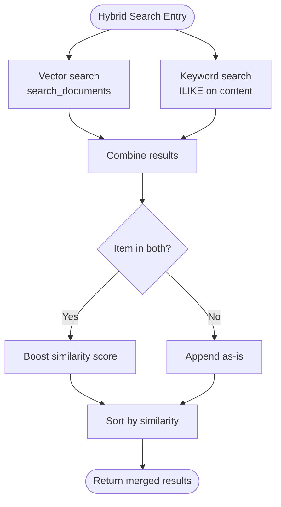
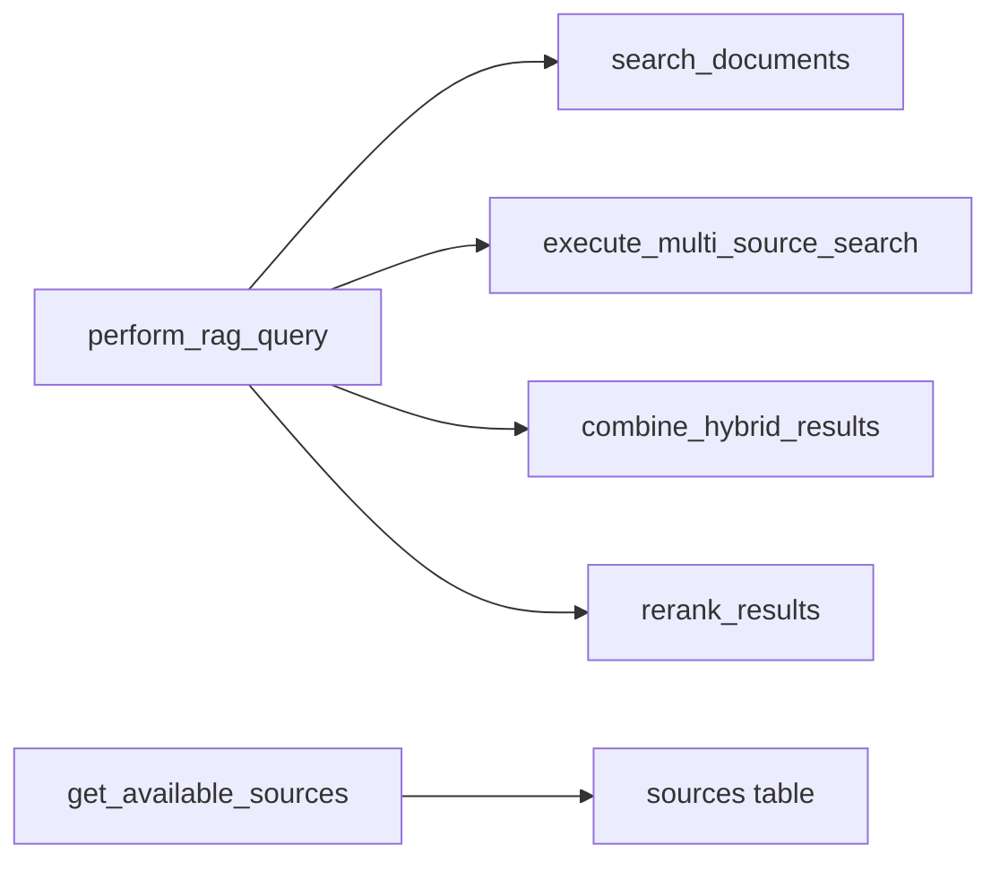

# RAG Search Tools

<cite>
**Referenced Files in This Document**
- [src/crawl4ai_mcp.py](file://src/crawl4ai_mcp.py)
- [src/utils.py](file://src/utils.py)
- [README.md](file://README.md)
- [scripts/README.md](file://scripts/README.md)
</cite>

## Table of Contents
1. [Introduction](#introduction)
2. [Project Structure](#project-structure)
3. [Core Components](#core-components)
4. [Architecture Overview](#architecture-overview)
5. [Detailed Component Analysis](#detailed-component-analysis)
6. [Dependency Analysis](#dependency-analysis)
7. [Performance Considerations](#performance-considerations)
8. [Troubleshooting Guide](#troubleshooting-guide)
9. [Conclusion](#conclusion)

## Introduction
This document provides API documentation for the RAG search tools exposed by the MCP server:
- perform_rag_query
- get_available_sources

It explains the tool names, descriptions, parameters, return value structures, and operational behavior. It also details how hybrid search combines vector and keyword search, how results are merged and ranked, and how to use get_available_sources to discover accessible knowledge sources. Example requests and responses are included, along with error handling guidance.

## Project Structure
The RAG search logic is implemented in the MCP server module and utility functions:
- perform_rag_query is defined in the MCP server module and orchestrates search strategies.
- get_available_sources is defined in the MCP server module and returns available knowledge sources.
- Underlying vector search and hybrid combination logic is implemented in utility functions.



**Diagram sources**
- [src/crawl4ai_mcp.py](file://src/crawl4ai_mcp.py#L1089-L1288)
- [src/crawl4ai_mcp.py](file://src/crawl4ai_mcp.py#L1349-L1548)
- [src/utils.py](file://src/utils.py#L549-L587)
- [src/utils.py](file://src/utils.py#L1022-L1060)

**Section sources**
- [src/crawl4ai_mcp.py](file://src/crawl4ai_mcp.py#L1089-L1288)
- [src/crawl4ai_mcp.py](file://src/crawl4ai_mcp.py#L1349-L1548)
- [src/utils.py](file://src/utils.py#L549-L587)
- [src/utils.py](file://src/utils.py#L1022-L1060)

## Core Components
- perform_rag_query
  - Purpose: Perform a RAG query over stored content with optional source filtering and hybrid search.
  - Parameters:
    - query: string, required. Search query text.
    - source_type: string, optional. One of "all", "docs", "dml", "python", "source". Defaults to "all".
    - match_count: integer, optional. Number of results to return. Defaults to 5.
  - Behavior:
    - Respects environment flags for hybrid search and reranking.
    - Applies source filtering at the database level when a single source is selected.
    - Uses multi-source orchestration when searching multiple sources.
    - Executes hybrid search by combining vector and keyword results when enabled.
    - Optionally applies reranking using a cross-encoder model.
  - Return: JSON string containing success status, query, source_type, search_mode, reranking_applied, results, and count.

- get_available_sources
  - Purpose: List all available knowledge sources (domains) in the database with summaries and statistics.
  - Parameters: None (tool signature).
  - Return: JSON string containing success status, sources array, and count.

**Section sources**
- [src/crawl4ai_mcp.py](file://src/crawl4ai_mcp.py#L1089-L1161)
- [src/crawl4ai_mcp.py](file://src/crawl4ai_mcp.py#L1039-L1088)
- [src/utils.py](file://src/utils.py#L549-L587)

## Architecture Overview
The RAG query flow integrates MCP tool invocation with vector search and optional hybrid and reranking steps.

```mermaid
sequenceDiagram
participant Client as "MCP Client"
participant Server as "MCP Server"
participant Tool as "perform_rag_query"
participant Utils as "search_documents"
participant Multi as "execute_multi_source_search"
participant Hybrid as "combine_hybrid_results"
Client->>Server : Invoke tool "perform_rag_query"
Server->>Tool : Call with query, source_type, match_count
alt Single source filter
Tool->>Utils : search_documents(query, match_count, filter_metadata)
Utils-->>Tool : vector results
else Multi-source filter
Tool->>Multi : execute_multi_source_search(query, source_ids, match_count, use_hybrid)
Multi->>Utils : search_documents per source
Utils-->>Multi : vector results per source
Multi->>Hybrid : combine_hybrid_results(vector_results, keyword_results)
Hybrid-->>Multi : merged results
Multi-->>Tool : combined results
end
opt Hybrid enabled
Tool->>Hybrid : combine_hybrid_results(vector_results, keyword_results)
Hybrid-->>Tool : merged results
end
opt Reranking enabled
Tool->>Tool : rerank_results(...)
Tool-->>Client : results with rerank_score (if available)
else
Tool-->>Client : results
end
```

**Diagram sources**
- [src/crawl4ai_mcp.py](file://src/crawl4ai_mcp.py#L1181-L1288)
- [src/crawl4ai_mcp.py](file://src/crawl4ai_mcp.py#L1248-L1288)
- [src/utils.py](file://src/utils.py#L549-L587)
- [src/utils.py](file://src/utils.py#L1022-L1060)

## Detailed Component Analysis

### perform_rag_query
- Tool name: perform_rag_query
- Description: Searches stored content using semantic vector search with optional source filtering and hybrid search. Supports reranking to improve result relevance.
- Parameters:
  - query: string, required. The search query text.
  - source_type: string, optional. Controls which sources to search:
    - "all": Search all sources.
    - "docs": Search documentation sources only (excludes Simics sources).
    - "dml": Search Simics DML sources only.
    - "python": Search Simics Python sources only.
    - "source": Search both Simics DML and Python sources.
  - match_count: integer, optional. Number of results to return. Defaults to 5.
- Behavior:
  - Reads environment flags:
    - USE_HYBRID_SEARCH: Enables hybrid search combining vector and keyword search.
    - USE_RERANKING: Enables cross-encoder reranking.
  - Source filtering:
    - For single-source filters ("dml", "python"), applies a metadata filter at the database level.
    - For "source", executes multi-source search across ["simics-dml", "simics-python"].
    - For "docs", retrieves non-Simics sources and searches across them.
    - For "all", searches without source filtering.
  - Hybrid search:
    - Executes vector search and keyword search (ILIKE on content).
    - Merges results with preference for items present in both searches, boosting similarity scores for items in both.
  - Reranking:
    - If enabled and a reranking model is loaded, reranks results using a cross-encoder model.
- Return value structure:
  - success: boolean
  - query: string
  - source_type: string
  - search_mode: string ("hybrid" or "vector")
  - reranking_applied: boolean
  - results: array of objects with:
    - url: string
    - content: string
    - metadata: object
    - similarity: number
    - rerank_score: number (present if reranking applied)
  - count: integer

- How query, source_ids, match_count, and use_hybrid_search control search behavior:
  - query: Used to generate a vector embedding and drive both vector and keyword searches.
  - source_ids: When provided (e.g., for "source" or "docs"), the server executes per-source queries and merges results.
  - match_count: Limits the number of results returned; intermediate steps may fetch more to allow filtering.
  - use_hybrid_search: When true, the server runs both vector and keyword searches and merges them with preference for items in both.

- Hybrid search mechanism:
  - Vector search: Calls search_documents to retrieve top-k matches filtered by source.
  - Keyword search: Executes an ILIKE query on content to find exact-text matches, optionally filtered by source.
  - Combination: Items appearing in both sets receive a similarity boost; remaining vector-only and keyword-only results are appended and sorted by similarity.

- Example requests and responses:
  - Request:
    - Tool: perform_rag_query
    - Parameters: query="device initialization patterns", source_type="docs", match_count=5
  - Response:
    - success: true
    - query: "device initialization patterns"
    - source_type: "docs"
    - search_mode: "vector" or "hybrid"
    - reranking_applied: true/false
    - results: [{url, content, metadata, similarity, rerank_score?}, ...]
    - count: 5

- Error cases:
  - Empty results: Returned as an empty results array with success true.
  - Invalid source IDs: Handled by database-level filtering; if no sources match, results may be empty.
  - Database errors: The tool catches exceptions and returns success false with an error message.

**Section sources**
- [src/crawl4ai_mcp.py](file://src/crawl4ai_mcp.py#L1089-L1161)
- [src/crawl4ai_mcp.py](file://src/crawl4ai_mcp.py#L1181-L1288)
- [src/crawl4ai_mcp.py](file://src/crawl4ai_mcp.py#L1248-L1288)
- [src/utils.py](file://src/utils.py#L549-L587)
- [src/utils.py](file://src/utils.py#L1022-L1060)

### get_available_sources
- Tool name: get_available_sources
- Description: Returns a list of all available knowledge sources (domains) stored in the database, along with summaries and statistics.
- Parameters: None
- Return value structure:
  - success: boolean
  - sources: array of objects with:
    - source_id: string
    - summary: string
    - total_word_count: integer
    - created_at: string
    - updated_at: string
  - count: integer

- Example requests and responses:
  - Request:
    - Tool: get_available_sources
  - Response:
    - success: true
    - sources: [{source_id, summary, total_word_count, created_at, updated_at}, ...]
    - count: N

- Error cases:
  - Database connectivity issues: Returns success false with an error message.

**Section sources**
- [src/crawl4ai_mcp.py](file://src/crawl4ai_mcp.py#L1039-L1088)

### Hybrid Search Mechanism
The hybrid search combines vector and keyword search results to improve recall and precision:
- Vector search: Uses semantic similarity to find relevant chunks.
- Keyword search: Uses ILIKE to find exact-text matches.
- Combination:
  - Items present in both sets receive a similarity boost.
  - Remaining vector-only and keyword-only results are appended.
  - Results are sorted by similarity score.



**Diagram sources**
- [src/crawl4ai_mcp.py](file://src/crawl4ai_mcp.py#L1248-L1275)
- [src/utils.py](file://src/utils.py#L1022-L1060)

**Section sources**
- [src/crawl4ai_mcp.py](file://src/crawl4ai_mcp.py#L1248-L1275)
- [src/utils.py](file://src/utils.py#L1022-L1060)

## Dependency Analysis
- perform_rag_query depends on:
  - search_documents for vector search.
  - execute_multi_source_search for multi-source orchestration.
  - combine_hybrid_results for merging vector and keyword results.
  - rerank_results for optional reranking.
- get_available_sources depends on:
  - Direct database query to the sources table.



**Diagram sources**
- [src/crawl4ai_mcp.py](file://src/crawl4ai_mcp.py#L1089-L1288)
- [src/crawl4ai_mcp.py](file://src/crawl4ai_mcp.py#L1349-L1548)
- [src/utils.py](file://src/utils.py#L549-L587)
- [src/utils.py](file://src/utils.py#L1022-L1060)

**Section sources**
- [src/crawl4ai_mcp.py](file://src/crawl4ai_mcp.py#L1089-L1288)
- [src/crawl4ai_mcp.py](file://src/crawl4ai_mcp.py#L1349-L1548)
- [src/utils.py](file://src/utils.py#L549-L587)
- [src/utils.py](file://src/utils.py#L1022-L1060)

## Performance Considerations
- Hybrid search adds computational overhead by running both vector and keyword searches and merging results.
- Reranking improves relevance but increases latency; enable only when needed.
- match_count influences query cost; larger counts increase database and model processing time.
- Multi-source searches scale linearly with the number of sources queried.

[No sources needed since this section provides general guidance]

## Troubleshooting Guide
- No results found:
  - Ensure content has been crawled and indexed; verify database population.
  - Confirm environment flags for USE_HYBRID_SEARCH and USE_RERANKING are set appropriately.
- Poor relevance:
  - Enable USE_RERANKING to improve ranking order.
- Connection errors:
  - Verify SUPABASE_URL and SUPABASE_SERVICE_KEY are configured.
- Empty results for specific source filters:
  - Use get_available_sources to discover valid source IDs and adjust filters accordingly.

**Section sources**
- [README.md](file://README.md#L767-L773)

## Conclusion
The perform_rag_query and get_available_sources tools provide a flexible and powerful RAG querying interface. perform_rag_query supports single-source and multi-source filtering, hybrid search, and optional reranking to balance precision and recall. get_available_sources enables discovery of accessible knowledge sources. Together, they form a robust foundation for agent-driven knowledge retrieval.