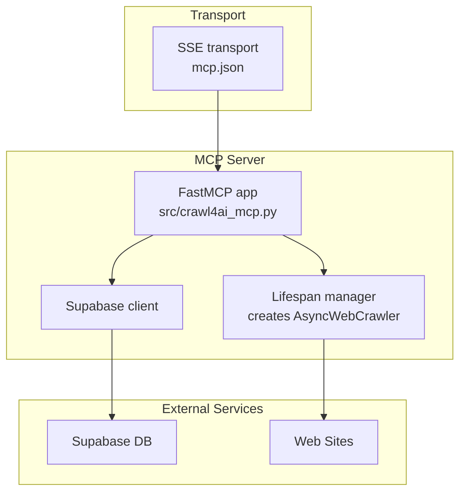
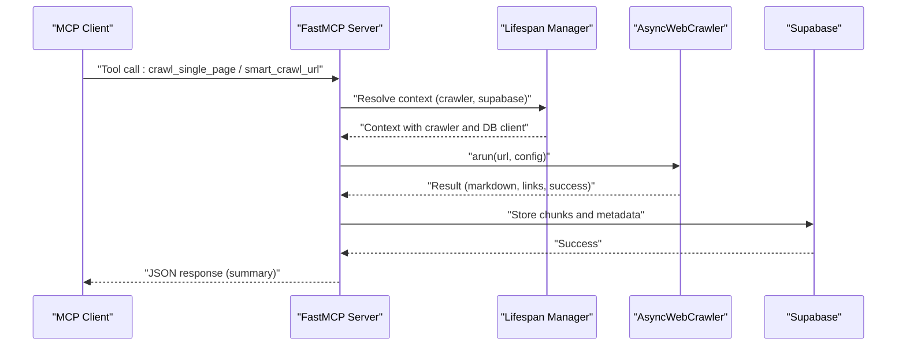
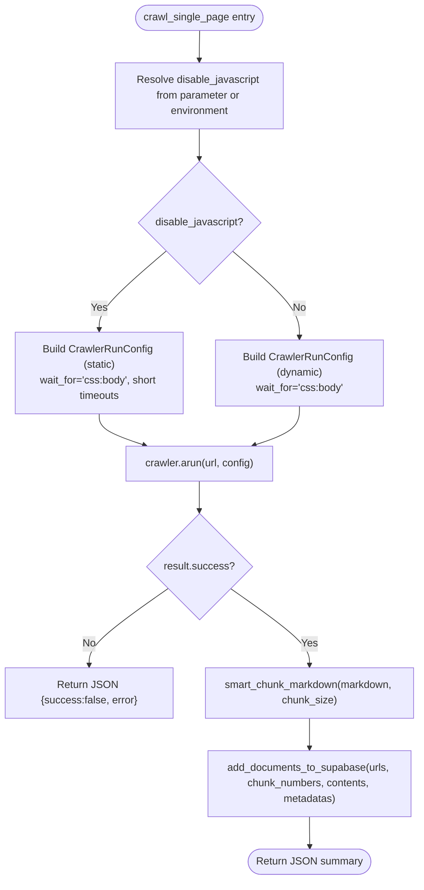
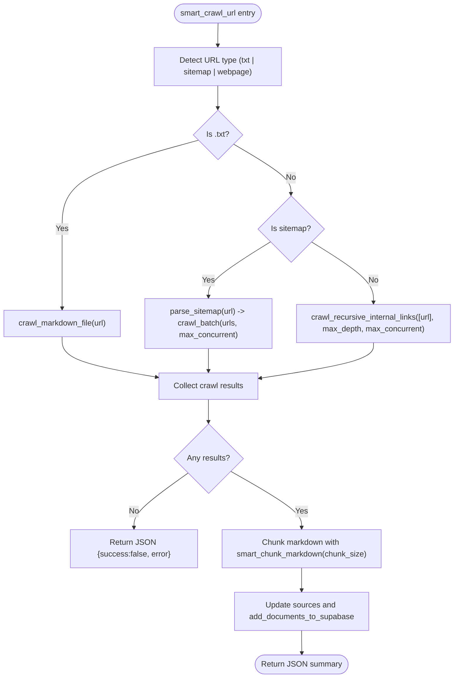
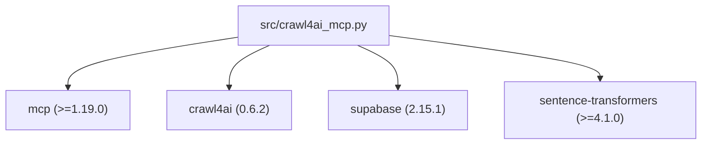

# Web Crawling Tools

<cite>
**Referenced Files in This Document**
- [mcp.json](file://mcp.json)
- [src/crawl4ai_mcp.py](file://src/crawl4ai_mcp.py)
- [README.md](file://README.md)
- [src/utils.py](file://src/utils.py)
- [uv.lock](file://uv.lock)
- [pyproject.toml](file://pyproject.toml)
</cite>

## Table of Contents
1. [Introduction](#introduction)
2. [Project Structure](#project-structure)
3. [Core Components](#core-components)
4. [Architecture Overview](#architecture-overview)
5. [Detailed Component Analysis](#detailed-component-analysis)
6. [Dependency Analysis](#dependency-analysis)
7. [Performance Considerations](#performance-considerations)
8. [Troubleshooting Guide](#troubleshooting-guide)
9. [Conclusion](#conclusion)

## Introduction
This document provides API documentation for the web crawling endpoints exposed by the MCP server:
- crawl_single_page
- smart_crawl_url

It covers tool names, descriptions, parameters, return value structures, MCP protocol requirements, error handling, asynchronous response patterns, authentication, rate limiting behavior, timeouts, versioning and backward compatibility, and how disable_javascript and chunk_size influence crawling behavior and storage. The source of truth for tool definitions is mcp.json, and implementation details are in src/crawl4ai_mcp.py.

## Project Structure
The MCP server is implemented as a FastMCP application that exposes tools for crawling and RAG. The server initializes a Crawl4AI AsyncWebCrawler and integrates with Supabase for persistent storage of crawled content. The server listens over SSE transport as defined in mcp.json.

**Diagram sources**
- [mcp.json](file://mcp.json#L1-L9)
- [src/crawl4ai_mcp.py](file://src/crawl4ai_mcp.py#L295-L301)
- [src/crawl4ai_mcp.py](file://src/crawl4ai_mcp.py#L140-L170)

**Section sources**
- [mcp.json](file://mcp.json#L1-L9)
- [src/crawl4ai_mcp.py](file://src/crawl4ai_mcp.py#L295-L301)

## Core Components
- crawl_single_page: Crawls a single URL and stores the resulting markdown chunks in Supabase. Supports optional disable_javascript and chunk_size parameters.
- smart_crawl_url: Intelligently crawls a URL based on its type (sitemap, text file, or regular webpage), with options for max_depth, max_concurrent, chunk_size, and disable_javascript.

Both tools return a JSON string summarizing the operation outcome and storage results.

**Section sources**
- [src/crawl4ai_mcp.py](file://src/crawl4ai_mcp.py#L662-L831)
- [src/crawl4ai_mcp.py](file://src/crawl4ai_mcp.py#L833-L1037)

## Architecture Overview
The MCP server exposes crawl tools via the FastMCP framework. The server lifecycle manages an AsyncWebCrawler and a Supabase client. Tools operate asynchronously and return JSON responses. Storage is performed in Supabase tables for later RAG.

**Diagram sources**
- [src/crawl4ai_mcp.py](file://src/crawl4ai_mcp.py#L140-L170)
- [src/crawl4ai_mcp.py](file://src/crawl4ai_mcp.py#L662-L831)
- [src/crawl4ai_mcp.py](file://src/crawl4ai_mcp.py#L833-L1037)

## Detailed Component Analysis

### crawl_single_page
- Tool name: crawl_single_page
- Description: Crawls a single web page and stores its content in Supabase. Ideal for retrieving content from a specific URL without following links.
- Parameters:
  - url: string, required
  - disable_javascript: boolean, optional, default None (resolved from environment)
  - chunk_size: integer, optional, default 5000
- Return value: JSON string with fields:
  - success: boolean
  - url: string
  - chunks_stored: integer
  - code_examples_stored: integer
  - content_length: integer
  - total_word_count: integer
  - source_id: string
  - links_count: object with internal and external counts
- Error handling:
  - On crawler failure: returns JSON with success false and error message
  - On exceptions: returns JSON with success false and error string
- Asynchronous response pattern:
  - Tool is async and returns a JSON string immediately after completion
- Behavior differences:
  - disable_javascript=True: static content only, waits for body, shorter timeouts
  - disable_javascript=False: dynamic content with JavaScript enabled
- Storage behavior:
  - Chunks markdown content using smart_chunk_markdown with chunk_size
  - Stores chunks and metadata in Supabase, updates source summary

**Diagram sources**
- [src/crawl4ai_mcp.py](file://src/crawl4ai_mcp.py#L662-L831)

**Section sources**
- [src/crawl4ai_mcp.py](file://src/crawl4ai_mcp.py#L662-L831)

### smart_crawl_url
- Tool name: smart_crawl_url
- Description: Intelligently crawls a URL based on its type:
  - sitemap.xml: extracts and crawls all URLs in parallel
  - .txt file: retrieves content directly
  - regular webpage: recursively crawls internal links up to max_depth
- Parameters:
  - url: string, required
  - max_depth: integer, optional, default 3
  - max_concurrent: integer, optional, default 10
  - chunk_size: integer, optional, default 5000
  - disable_javascript: boolean, optional, default None (resolved from environment)
- Return value: JSON string with fields:
  - success: boolean
  - url: string
  - crawl_type: string ("text_file", "sitemap", "webpage")
  - pages_crawled: integer
  - chunks_stored: integer
  - code_examples_stored: integer
  - sources_updated: integer
  - urls_crawled: array (first 5 entries plus "..." if more)
- Error handling:
  - No URLs found in sitemap: returns JSON with success false and error
  - No content found: returns JSON with success false and error
  - Exceptions: returns JSON with success false and error string
- Asynchronous response pattern:
  - Tool is async and returns a JSON string after processing
- Behavior differences:
  - disable_javascript: note indicates static-only crawling requires crawler reconfiguration; for static content, prefer crawl_single_page with disable_javascript=True
- Storage behavior:
  - Chunks markdown content using smart_chunk_markdown with chunk_size
  - Updates source summaries and stores chunks and metadata in Supabase
  - Optionally extracts code examples if USE_AGENTIC_RAG is enabled

**Diagram sources**
- [src/crawl4ai_mcp.py](file://src/crawl4ai_mcp.py#L833-L1037)

**Section sources**
- [src/crawl4ai_mcp.py](file://src/crawl4ai_mcp.py#L833-L1037)

## Dependency Analysis
- Transport and server:
  - mcp.json defines SSE transport and server URL
  - FastMCP app is created with host/port from environment
- External libraries:
  - mcp (>=1.19.0) for protocol and SSE transport
  - crawl4ai for AsyncWebCrawler and CrawlerRunConfig
  - supabase for database operations
  - sentence-transformers for optional reranking
- Environment variables:
  - SUPABASE_URL, SUPABASE_SERVICE_KEY for database
  - CRAWL_STATIC_CONTENT_ONLY for static/dynamic mode
  - USE_AGENTIC_RAG for code example extraction
  - USE_KNOWLEDGE_GRAPH for knowledge graph features
  - USE_HYBRID_SEARCH and USE_RERANKING for RAG enhancements

**Diagram sources**
- [pyproject.toml](file://pyproject.toml#L11-L25)
- [uv.lock](file://uv.lock#L923-L946)

**Section sources**
- [pyproject.toml](file://pyproject.toml#L11-L25)
- [uv.lock](file://uv.lock#L923-L946)

## Performance Considerations
- Static vs dynamic crawling:
  - Static mode (disable_javascript=True) reduces timeouts and avoids JavaScript redirects, yielding predictable content sizes and faster processing for simple pages.
  - Dynamic mode enables JavaScript execution, capturing richer content but potentially increasing crawl time and memory usage.
- Chunk sizing:
  - Larger chunk_size reduces the number of database records but increases payload sizes; smaller chunk_size improves granularity for RAG but increases storage overhead.
- Concurrency:
  - max_concurrent controls parallel browser sessions; higher values increase throughput but also resource usage.
- Storage batching:
  - add_documents_to_supabase uses batch_size for efficient inserts.

**Section sources**
- [src/crawl4ai_mcp.py](file://src/crawl4ai_mcp.py#L662-L831)
- [src/crawl4ai_mcp.py](file://src/crawl4ai_mcp.py#L833-L1037)

## Troubleshooting Guide
- Authentication:
  - Supabase credentials must be set via environment variables SUPABASE_URL and SUPABASE_SERVICE_KEY.
- Transport and connectivity:
  - Ensure the server is reachable at the URL defined in mcp.json (SSE).
- JavaScript redirects:
  - Use disable_javascript=True to avoid unexpected content expansion caused by JavaScript redirects.
- Body tag not found:
  - The crawler waits for css:body to ensure content readiness; if pages fail to render, verify site availability and network conditions.
- Database errors:
  - Confirm Supabase project is active and credentials are correct.

**Section sources**
- [src/utils.py](file://src/utils.py#L106-L120)
- [README.md](file://README.md#L483-L521)
- [README.md](file://README.md#L311-L338)

## MCP Protocol Requirements

- Tool call format:
  - Tools are decorated with @mcp.tool() and are invoked by MCP clients. Parameters are passed as named arguments in the tool call.
- Asynchronous response:
  - Both crawl_single_page and smart_crawl_url are async and return a JSON string summarizing the operation.
- Error handling:
  - Tools return JSON with success=false and error details on failures or exceptions.
- Authentication:
  - The server does not implement explicit MCP authentication; it relies on the underlying transport and environment configuration. Ensure the MCP client connects to the SSE endpoint defined in mcp.json.
- Versioning and compatibility:
  - The server depends on mcp>=1.19.0 and crawl4ai==0.6.2. Align client versions accordingly to ensure compatibility.

**Section sources**
- [src/crawl4ai_mcp.py](file://src/crawl4ai_mcp.py#L1037-L1039)
- [src/crawl4ai_mcp.py](file://src/crawl4ai_mcp.py#L1088-L1090)
- [uv.lock](file://uv.lock#L923-L946)
- [pyproject.toml](file://pyproject.toml#L11-L25)

## Example Requests and Responses

- Example request (crawl_single_page):
  - Tool: crawl_single_page
  - Parameters:
    - url: "https://example.com/docs/page"
    - disable_javascript: true
    - chunk_size: 5000
  - Response:
    - JSON with success, url, chunks_stored, content_length, total_word_count, source_id, links_count

- Example request (smart_crawl_url):
  - Tool: smart_crawl_url
  - Parameters:
    - url: "https://example.com/sitemap.xml"
    - max_depth: 3
    - max_concurrent: 10
    - chunk_size: 5000
    - disable_javascript: null
  - Response:
    - JSON with success, url, crawl_type, pages_crawled, chunks_stored, sources_updated, urls_crawled

Notes:
- Replace values with actual target URLs and adjust parameters as needed.
- Responses are JSON strings returned by the server after asynchronous processing.

**Section sources**
- [src/crawl4ai_mcp.py](file://src/crawl4ai_mcp.py#L662-L831)
- [src/crawl4ai_mcp.py](file://src/crawl4ai_mcp.py#L833-L1037)

## Parameters and Behavior Details

- disable_javascript:
  - When true, crawler configuration disables JavaScript execution, waits for body, and uses shorter timeouts for static content.
  - When false, crawler executes JavaScript dynamically.
  - If not provided, resolves from environment variable CRAWL_STATIC_CONTENT_ONLY.
- chunk_size:
  - Controls the maximum size of each content chunk in characters.
  - Affects the number of database records created and storage overhead.

**Section sources**
- [src/crawl4ai_mcp.py](file://src/crawl4ai_mcp.py#L662-L831)
- [src/crawl4ai_mcp.py](file://src/crawl4ai_mcp.py#L833-L1037)
- [README.md](file://README.md#L483-L521)

## Authentication, Rate Limiting, and Timeouts

- Authentication:
  - Supabase credentials (SUPABASE_URL, SUPABASE_SERVICE_KEY) are required for database operations.
  - No explicit MCP authentication is implemented in the server.
- Rate limiting:
  - The repository includes rate limiting utilities for other providers (e.g., Copilot), but no built-in rate limiting is shown for the crawl tools themselves.
- Timeouts:
  - Static mode uses shorter timeouts and explicit wait_for="css:body".
  - Dynamic mode uses default crawler timeouts with wait_for="css:body".

**Section sources**
- [src/utils.py](file://src/utils.py#L106-L120)
- [src/crawl4ai_mcp.py](file://src/crawl4ai_mcp.py#L662-L831)
- [src/crawl4ai_mcp.py](file://src/crawl4ai_mcp.py#L833-L1037)

## Versioning and Backward Compatibility

- Dependencies:
  - mcp>=1.19.0
  - crawl4ai==0.6.2
- Recommendations:
  - Align client and server versions to mcp>=1.19.0 and crawl4ai==0.6.2 to ensure compatibility.
- Backward compatibility:
  - Tool signatures and return values are defined by the server implementation. Maintain parameter names and types to preserve compatibility.

**Section sources**
- [uv.lock](file://uv.lock#L923-L946)
- [pyproject.toml](file://pyproject.toml#L11-L25)

## Difference Between Static and JavaScript-Enabled Crawling

- Static content crawling (disable_javascript=True):
  - No JavaScript execution
  - Waits for body element
  - Shorter timeouts
  - Predictable content sizes, avoids redirects
- JavaScript-enabled crawling (disable_javascript=False):
  - Executes JavaScript dynamically
  - Captures richer content
  - Potentially slower and more resource-intensive

**Section sources**
- [src/crawl4ai_mcp.py](file://src/crawl4ai_mcp.py#L662-L831)
- [README.md](file://README.md#L483-L521)

## Conclusion
The MCP server exposes two primary crawling tools: crawl_single_page and smart_crawl_url. Both are async and return JSON summaries. Their behavior is controlled by disable_javascript and chunk_size, with static mode optimized for predictable, fast crawling and dynamic mode for richer content. Storage is handled via Supabase, and the server’s transport and dependencies are defined in mcp.json and pyproject.toml/uv.lock. For reliable operation, ensure proper environment configuration, understand the differences between static and dynamic crawling, and align client versions with the server’s dependencies.