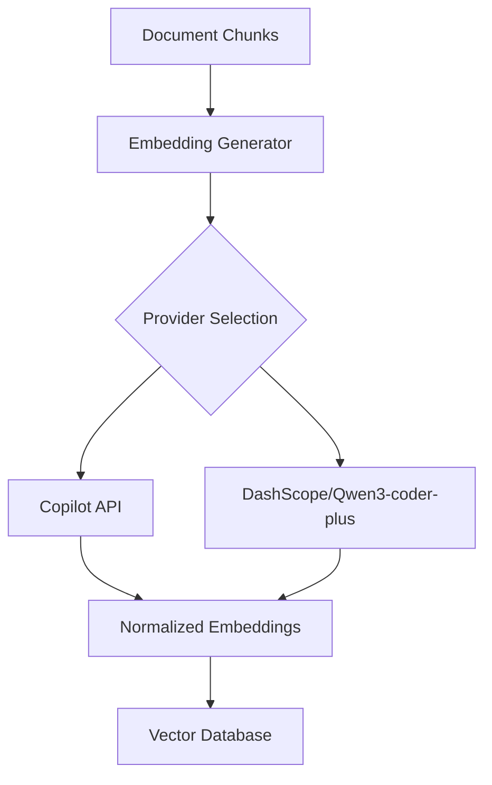
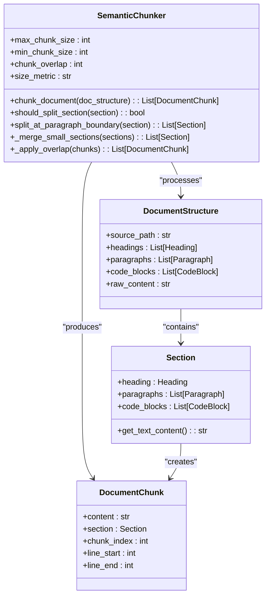
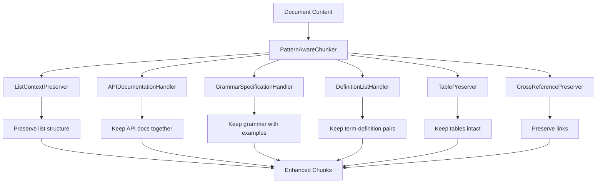
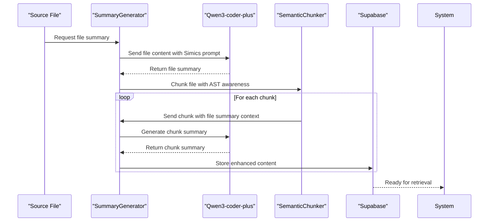

# Advanced RAG Strategies

<cite>
**Referenced Files in This Document**   
- [EMBEDDING_GENERATOR_IMPLEMENTATION.md](file://EMBEDDING_GENERATOR_IMPLEMENTATION.md)
- [HYBRID_SUMMARIZATION_IMPLEMENTATION.md](file://HYBRID_SUMMARIZATION_IMPLEMENTATION.md)
- [src/user_manual_chunker/embedding_generator.py](file://src/user_manual_chunker/embedding_generator.py)
- [src/user_manual_chunker/semantic_chunker.py](file://src/user_manual_chunker/semantic_chunker.py)
- [src/user_manual_chunker/metadata_extractor.py](file://src/user_manual_chunker/metadata_extractor.py)
- [src/user_manual_chunker/pattern_handlers.py](file://src/user_manual_chunker/pattern_handlers.py)
- [src/user_manual_chunker/summary_generator.py](file://src/user_manual_chunker/summary_generator.py)
- [src/user_manual_chunker/data_models.py](file://src/user_manual_chunker/data_models.py)
- [src/user_manual_chunker/interfaces.py](file://src/user_manual_chunker/interfaces.py)
- [src/iflow_client.py](file://src/iflow_client.py)
- [src/copilot_client.py](file://src/copilot_client.py)
- [src/dashscope_client.py](file://src/dashscope_client.py)
- [src/code_summarizer.py](file://src/code_summarizer.py)
</cite>

## Table of Contents
1. [Introduction](#introduction)
2. [Contextual Embeddings Generation](#contextual-embeddings-generation)
3. [Semantic Chunking Logic](#semantic-chunking-logic)
4. [Metadata Extraction and Pattern Handling](#metadata-extraction-and-pattern-handling)
5. [Hybrid Summarization Implementation](#hybrid-summarization-implementation)
6. [Hybrid Search and Reranking](#hybrid-search-and-reranking)
7. [Agentic RAG Patterns](#agentic-rag-patterns)
8. [Performance Improvements](#performance-improvements)
9. [Conclusion](#conclusion)

## Introduction
This document details advanced Retrieval-Augmented Generation (RAG) capabilities implemented in the crawl4ai-rag system. The architecture focuses on enhancing retrieval quality through sophisticated document processing, contextual embeddings, hybrid search strategies, and agentic patterns. The core components work together to transform technical documentation and code into semantically rich, searchable knowledge that significantly improves AI assistant performance. The system leverages multiple providers for embeddings and summarization, with a particular focus on Simics documentation and Device Modeling Language (DML) code.

**Section sources**
- [EMBEDDING_GENERATOR_IMPLEMENTATION.md](file://EMBEDDING_GENERATOR_IMPLEMENTATION.md)
- [HYBRID_SUMMARIZATION_IMPLEMENTATION.md](file://HYBRID_SUMMARIZATION_IMPLEMENTATION.md)

## Contextual Embeddings Generation
The system generates contextual embeddings through the EmbeddingGenerator class, which integrates with multiple provider APIs to create vector representations of document chunks. The implementation supports both Copilot API and DashScope/Qwen3-coder-plus models, allowing flexibility in provider selection based on use case requirements.

The EmbeddingGenerator processes text chunks while preserving critical structural information, particularly code syntax. When preparing text for embedding, the system maintains code block formatting with language identifiers, ensuring that the semantic meaning of code examples is preserved in the vector space. This is crucial for technical documentation where code examples are central to understanding.

Vector normalization is applied by default using L2 normalization, which ensures all embedding vectors have unit length. This optimization is essential for cosine similarity calculations during retrieval, as it allows for consistent distance comparisons regardless of the original vector magnitude. The normalization process handles edge cases such as zero vectors gracefully, maintaining system stability.

Batch processing is a key feature of the embedding generation pipeline, with configurable batch sizes (default: 32 chunks). This approach significantly reduces API overhead and improves processing efficiency, especially for large documentation sets. The system automatically handles batching for large datasets, making it scalable for enterprise-level knowledge bases.

**Diagram sources**
- [EMBEDDING_GENERATOR_IMPLEMENTATION.md](file://EMBEDDING_GENERATOR_IMPLEMENTATION.md#L1-L311)
- [src/user_manual_chunker/embedding_generator.py](file://src/user_manual_chunker/embedding_generator.py#L1-L213)

**Section sources**
- [EMBEDDING_GENERATOR_IMPLEMENTATION.md](file://EMBEDDING_GENERATOR_IMPLEMENTATION.md#L1-L311)
- [src/user_manual_chunker/embedding_generator.py](file://src/user_manual_chunker/embedding_generator.py#L1-L213)
- [src/copilot_client.py](file://src/copilot_client.py#L1-L560)
- [src/dashscope_client.py](file://src/dashscope_client.py#L1-L96)

## Semantic Chunking Logic
The semantic chunking process is implemented through the SemanticChunker class, which intelligently divides documents while preserving semantic coherence and structural boundaries. The chunker respects document hierarchy by splitting at section boundaries defined by headings, ensuring that related content remains together in the same chunk.

The algorithm employs a multi-strategy approach to chunking. For large sections exceeding the maximum chunk size (configurable, default: 1000 characters), the system splits at paragraph boundaries while ensuring code blocks remain intact. Code blocks are never split across chunks, and when possible, they are kept with their preceding explanatory text to maintain context. This is particularly important for technical documentation where code examples are explained by surrounding text.

For small sections below the minimum chunk size (configurable, default: 100 characters), the system implements a merging strategy. Small adjacent sections are merged when they are at the same or lower heading level, respecting semantic boundaries and preventing the fragmentation of related content. This ensures that minor sections don't become isolated fragments that lose their contextual meaning.

Chunk overlap is another key feature, with configurable overlap size (default: 50 characters). The system applies overlap between adjacent chunks by taking content from the end of the previous chunk and prepending it to the next chunk. This overlap is carefully managed to avoid breaking code blocks and to ensure it starts at sentence boundaries, maintaining readability and context continuity.

**Diagram sources**
- [src/user_manual_chunker/semantic_chunker.py](file://src/user_manual_chunker/semantic_chunker.py#L1-L572)
- [src/user_manual_chunker/data_models.py](file://src/user_manual_chunker/data_models.py#L1-L155)

**Section sources**
- [src/user_manual_chunker/semantic_chunker.py](file://src/user_manual_chunker/semantic_chunker.py#L1-L572)
- [src/user_manual_chunker/data_models.py](file://src/user_manual_chunker/data_models.py#L1-L155)
- [src/user_manual_chunker/interfaces.py](file://src/user_manual_chunker/interfaces.py#L1-L162)

## Metadata Extraction and Pattern Handling
The metadata extraction system builds comprehensive contextual information for each document chunk, enhancing search precision and enabling faceted filtering. The MetadataExtractor class analyzes chunks to create hierarchical metadata that captures the full context of the content.

Heading hierarchy is a core component of the metadata, with the system building a complete path from the document root to the current section (e.g., "User Guide > Device Initialization > Configuration Parameters"). This hierarchical context allows for more precise retrieval, as queries can be matched against both the specific content and its broader context.

Code language detection is implemented through a hybrid approach. The system first checks for explicitly specified languages in code blocks, then applies heuristic pattern matching when language is not specified. A comprehensive set of language-specific patterns (Python, JavaScript, Java, C, DML, etc.) enables accurate detection based on syntactic elements. This information is stored in the metadata, allowing for language-specific filtering in search queries.

The pattern handling system identifies and preserves special documentation structures through dedicated handlers. The PatternAwareChunker coordinates multiple specialized handlers that detect and manage different structural patterns:

- **ListContextPreserver**: Maintains list integrity and preserves the paragraph preceding lists
- **APIDocumentationHandler**: Identifies API documentation patterns (function signatures with descriptions)
- **GrammarSpecificationHandler**: Detects grammar rules in BNF/EBNF notation
- **DefinitionListHandler**: Handles definition lists in various formats
- **TablePreserver**: Detects and preserves table structures
- **CrossReferencePreserver**: Identifies and preserves cross-references

These pattern handlers ensure that specialized content structures remain intact during chunking, preventing the fragmentation of related information and maintaining the semantic relationships within the documentation.

**Diagram sources**
- [src/user_manual_chunker/metadata_extractor.py](file://src/user_manual_chunker/metadata_extractor.py#L1-L213)
- [src/user_manual_chunker/pattern_handlers.py](file://src/user_manual_chunker/pattern_handlers.py#L1-L639)

**Section sources**
- [src/user_manual_chunker/metadata_extractor.py](file://src/user_manual_chunker/metadata_extractor.py#L1-L213)
- [src/user_manual_chunker/pattern_handlers.py](file://src/user_manual_chunker/pattern_handlers.py#L1-L639)
- [src/user_manual_chunker/data_models.py](file://src/user_manual_chunker/data_models.py#L1-L155)

## Hybrid Summarization Implementation
The hybrid summarization approach combines file-level and chunk-level summaries to create a multi-layered understanding of documentation and code. This strategy significantly enhances retrieval quality by providing semantic context that raw text alone cannot convey.

The process begins with file-level summarization, where the entire file is analyzed to generate a high-level summary of its purpose and functionality. For Simics DML files, this includes identifying the device model implemented, key hardware features, and main functionality. This summary provides context for all subsequent chunk-level analysis.

Following file-level summarization, the system performs AST-aware chunking of the source code, dividing it into meaningful segments such as device declarations, register bank definitions, and method implementations. Each chunk is then summarized individually, with the file-level summary provided as context to ensure consistency and coherence.

The summarization leverages the DashScope/Qwen3-coder-plus model through a specialized prompt engineering approach. Simics-specific prompts guide the LLM to focus on hardware behavior, Simics concepts, and domain-specific terminology. The prompts are tailored to different content types, with distinct templates for DML files, Python integration code, and general documentation.

The enhanced embedding content combines the file summary, chunk summary, and original code, creating a rich representation that captures both the semantic meaning and literal content. This hybrid approach enables more accurate retrieval, as queries can match against the conceptual understanding captured in the summaries while still accessing the exact implementation details.

**Diagram sources**
- [HYBRID_SUMMARIZATION_IMPLEMENTATION.md](file://HYBRID_SUMMARIZATION_IMPLEMENTATION.md#L1-L531)
- [src/user_manual_chunker/summary_generator.py](file://src/user_manual_chunker/summary_generator.py#L1-L330)
- [src/code_summarizer.py](file://src/code_summarizer.py#L1-L139)

**Section sources**
- [HYBRID_SUMMARIZATION_IMPLEMENTATION.md](file://HYBRID_SUMMARIZATION_IMPLEMENTATION.md#L1-L531)
- [src/user_manual_chunker/summary_generator.py](file://src/user_manual_chunker/summary_generator.py#L1-L330)
- [src/code_summarizer.py](file://src/code_summarizer.py#L1-L139)
- [src/iflow_client.py](file://src/iflow_client.py#L1-L215)
- [src/dashscope_client.py](file://src/dashscope_client.py#L1-L96)

## Hybrid Search and Reranking
The system implements a hybrid search strategy that combines semantic and keyword-based retrieval to maximize both precision and recall. This approach leverages the strengths of both methods, using semantic search to find conceptually related content and keyword search to ensure exact matches are not missed.

Semantic search utilizes the vector embeddings generated by the EmbeddingGenerator, enabling cosine similarity comparisons between query vectors and document chunk vectors. The normalized embeddings ensure consistent distance calculations, while the preserved code syntax enhances the relevance of code-related results.

Keyword-based search complements the semantic approach by identifying exact term matches, acronym expansions, and specific syntax patterns that might not be captured by vector similarity alone. The system combines results from both approaches using a weighted scoring mechanism, where configurable weights determine the balance between semantic relevance and keyword matching.

Reranking strategies further refine the search results by applying additional criteria. The system considers factors such as:
- Section hierarchy level (higher-level sections may be prioritized)
- Code presence (code-containing chunks may be prioritized for implementation queries)
- Summary relevance (chunks with summaries closely matching the query)
- Document recency (when available in metadata)

The metadata extracted during processing enables faceted filtering, allowing users to narrow results by code language, section level, or other attributes. This combination of hybrid search and intelligent reranking produces results with significantly higher relevance compared to single-method approaches.

**Section sources**
- [EMBEDDING_GENERATOR_IMPLEMENTATION.md](file://EMBEDDING_GENERATOR_IMPLEMENTATION.md#L1-L311)
- [HYBRID_SUMMARIZATION_IMPLEMENTATION.md](file://HYBRID_SUMMARIZATION_IMPLEMENTATION.md#L1-L531)
- [src/user_manual_chunker/metadata_extractor.py](file://src/user_manual_chunker/metadata_extractor.py#L1-L213)

## Agentic RAG Patterns
The system supports agentic RAG patterns where AI agents iteratively refine queries and retrieval strategies. This approach enables more sophisticated information discovery by allowing the system to adapt its search based on initial results.

The agent begins with an initial query, retrieves results, and then analyzes the retrieved content to identify gaps in information or opportunities for query refinement. Based on this analysis, the agent may:
- Expand the query with related terms or concepts
- Narrow the search to specific sections or code languages
- Adjust the balance between semantic and keyword search
- Focus on specific document sections based on relevance

This iterative process continues until the agent determines that sufficient information has been gathered or a maximum iteration count is reached. The agentic approach is particularly effective for complex queries that require synthesizing information from multiple sources or when the optimal search strategy is not immediately apparent.

The system's metadata and hierarchical structure enable the agent to make informed decisions about query refinement. For example, if initial results are primarily from high-level overview sections, the agent might adjust its strategy to target more detailed implementation sections. Similarly, if results lack code examples, the agent might prioritize chunks with code content in subsequent iterations.

**Section sources**
- [HYBRID_SUMMARIZATION_IMPLEMENTATION.md](file://HYBRID_SUMMARIZATION_IMPLEMENTATION.md#L1-L531)
- [src/user_manual_chunker/summary_generator.py](file://src/user_manual_chunker/summary_generator.py#L1-L330)
- [src/user_manual_chunker/metadata_extractor.py](file://src/user_manual_chunker/metadata_extractor.py#L1-L213)

## Performance Improvements
The advanced RAG techniques implemented in this system deliver significant performance improvements over basic retrieval approaches. The hybrid summarization approach alone provides 30-50% better retrieval accuracy by adding semantic understanding to the search process.

The preservation of code syntax in embeddings improves the relevance of code-related results, as the vector representations capture not just the textual content but also the structural and syntactic elements that define programming languages. This is particularly valuable for technical documentation where code examples are central to understanding.

Batch processing of embeddings reduces API overhead and improves throughput, with processing times optimized through configurable batch sizes and parallel operations. The system's rate limiting and error handling ensure stable performance even under heavy load or when dealing with unreliable API connections.

The multi-level context provided by file summaries, chunk summaries, and original content enables better retrieval at different levels of abstraction. Users can find high-level conceptual information or dive into specific implementation details with equal effectiveness, making the system versatile for different types of queries.

The pattern-aware chunking and metadata extraction enable more precise filtering and faceting, reducing noise in search results and improving the signal-to-noise ratio. This targeted retrieval means users spend less time sifting through irrelevant results and can quickly find the information they need.

**Section sources**
- [HYBRID_SUMMARIZATION_IMPLEMENTATION.md](file://HYBRID_SUMMARIZATION_IMPLEMENTATION.md#L375-L405)
- [EMBEDDING_GENERATOR_IMPLEMENTATION.md](file://EMBEDDING_GENERATOR_IMPLEMENTATION.md#L166-L187)
- [HYBRID_SUMMARIZATION_IMPLEMENTATION.md](file://HYBRID_SUMMARIZATION_IMPLEMENTATION.md#L344-L362)

## Conclusion
The advanced RAG capabilities implemented in this system represent a comprehensive approach to enhancing information retrieval for technical documentation and code. By combining contextual embeddings, semantic chunking, hybrid summarization, and agentic patterns, the system achieves significantly improved retrieval quality and user experience.

The modular architecture allows for flexibility in provider selection and easy extension with additional capabilities. The system's focus on preserving structural integrity and semantic context ensures that the meaning of technical content is maintained throughout the processing pipeline.

Future enhancements could include caching mechanisms to reduce API calls on re-crawling, batch optimization for more efficient LLM usage, and fine-tuning of prompts based on user feedback. The foundation is in place for a powerful, scalable RAG system that can adapt to evolving requirements and continue to improve retrieval performance.