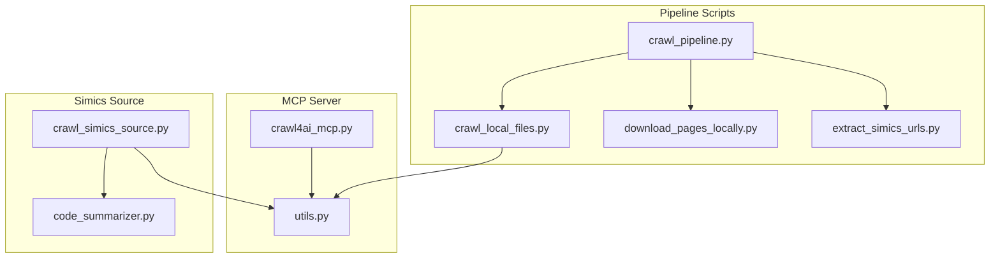
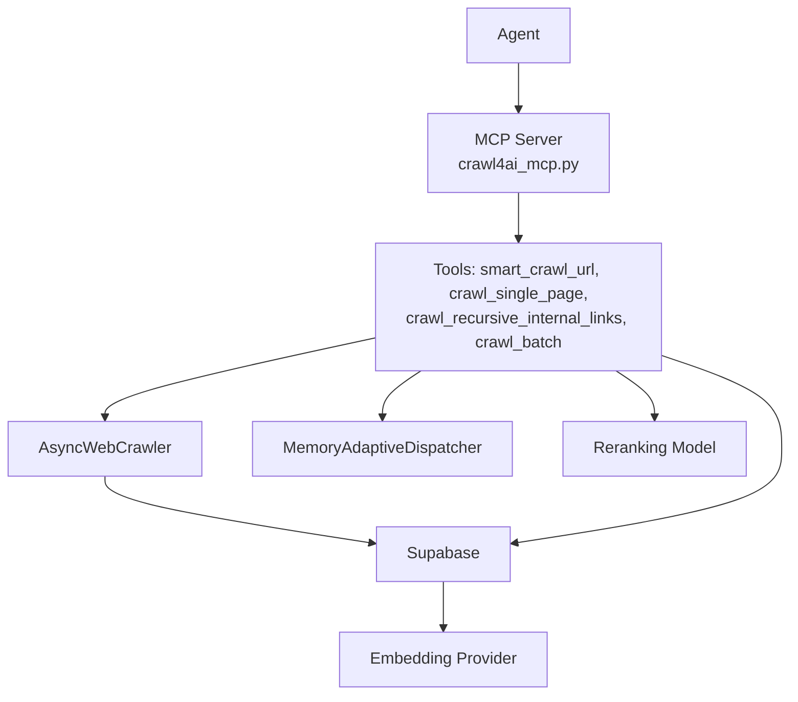
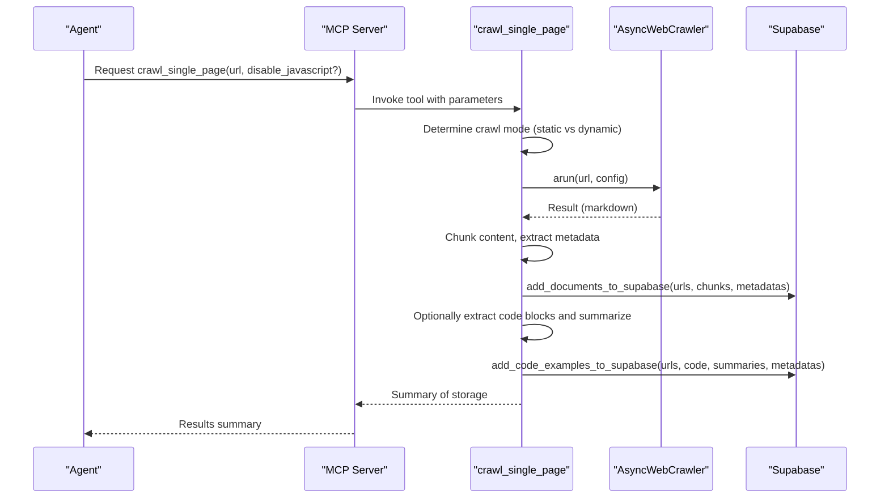
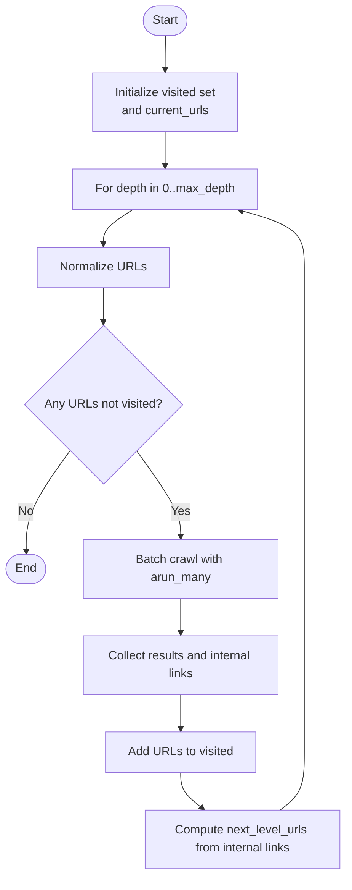
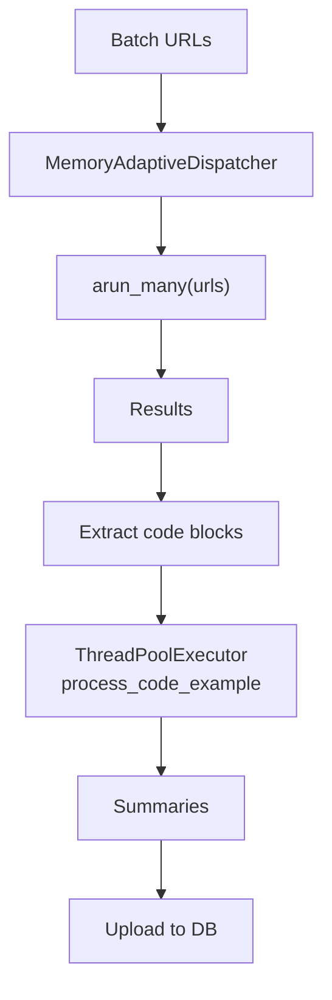
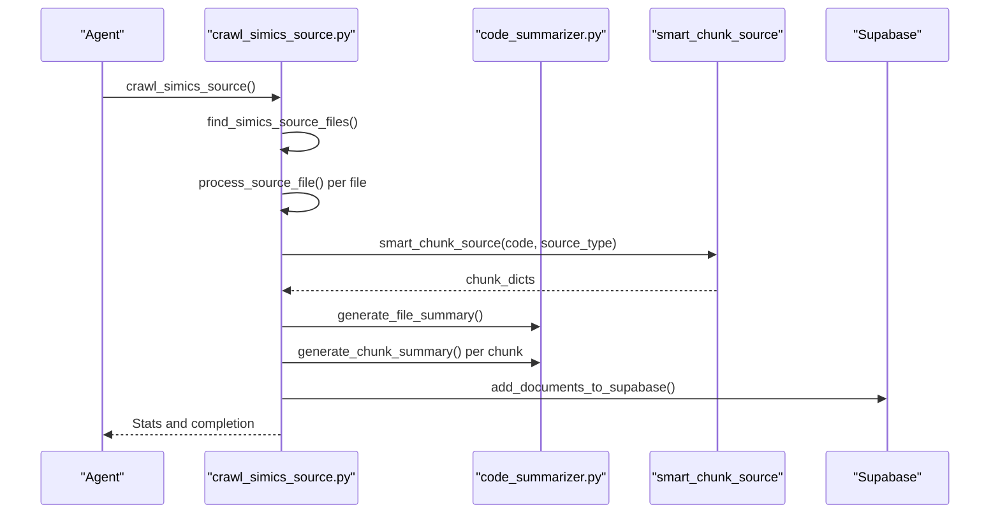
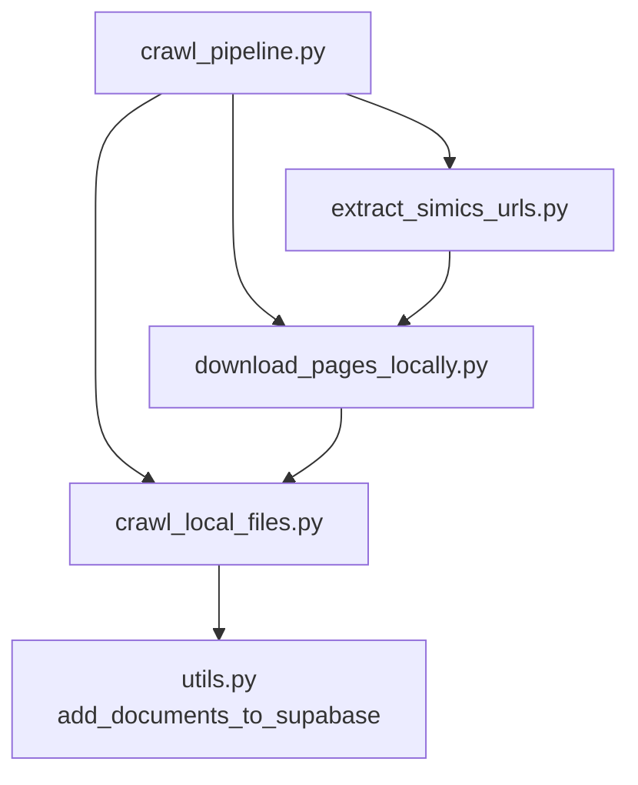
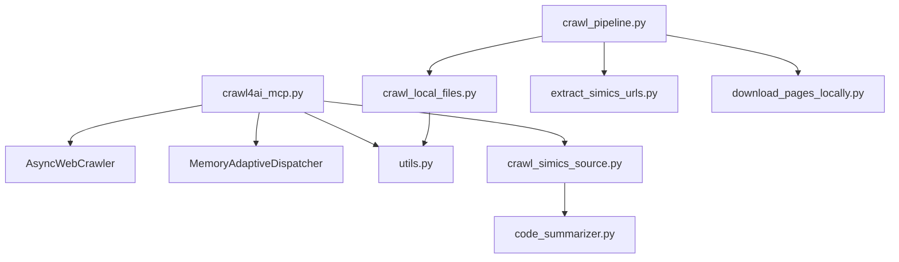

# Agentic RAG

<cite>
**Referenced Files in This Document**
- [crawl4ai_mcp.py](file://src/crawl4ai_mcp.py)
- [utils.py](file://src/utils.py)
- [crawl_local_files.py](file://scripts/crawl_local_files.py)
- [download_pages_locally.py](file://scripts/download_pages_locally.py)
- [extract_simics_urls.py](file://scripts/extract_simics_urls.py)
- [crawl_pipeline.py](file://scripts/crawl_pipeline.py)
- [crawl_simics_source.py](file://scripts/crawl_simics_source.py)
- [code_summarizer.py](file://src/code_summarizer.py)
- [README.md](file://README.md)
</cite>

## Table of Contents
1. [Introduction](#introduction)
2. [Project Structure](#project-structure)
3. [Core Components](#core-components)
4. [Architecture Overview](#architecture-overview)
5. [Detailed Component Analysis](#detailed-component-analysis)
6. [Dependency Analysis](#dependency-analysis)
7. [Performance Considerations](#performance-considerations)
8. [Troubleshooting Guide](#troubleshooting-guide)
9. [Conclusion](#conclusion)
10. [Appendices](#appendices)

## Introduction
This document explains agentic RAG patterns implemented in the repository, focusing on how AI agents iteratively refine queries and process results in the RAG pipeline. It details the implementation of autonomous web navigation via the smart_crawl_url and crawl_single_page tools, the recursive crawling strategy, and parallel processing capabilities. It also covers integration with source code crawling for Simics DML files, including examples of agent behavior when processing complex documentation structures and handling JavaScript-rendered content. Finally, it documents configuration options that control agent behavior and rate limiting.

## Project Structure
The repository organizes RAG-related functionality across:
- MCP server and tools for web crawling and RAG orchestration
- Scripts for pipeline orchestration, local crawling, and Simics source crawling
- Utilities for embeddings, search, and parallel processing
- Knowledge graph and code summarization modules for advanced analysis

**Diagram sources**
- [crawl4ai_mcp.py](file://src/crawl4ai_mcp.py#L1-L120)
- [utils.py](file://src/utils.py#L1-L120)
- [crawl_pipeline.py](file://scripts/crawl_pipeline.py#L1-L120)
- [crawl_local_files.py](file://scripts/crawl_local_files.py#L1-L120)
- [download_pages_locally.py](file://scripts/download_pages_locally.py#L1-L120)
- [extract_simics_urls.py](file://scripts/extract_simics_urls.py#L1-L120)
- [crawl_simics_source.py](file://scripts/crawl_simics_source.py#L1-L120)
- [code_summarizer.py](file://src/code_summarizer.py#L1-L120)

**Section sources**
- [crawl4ai_mcp.py](file://src/crawl4ai_mcp.py#L1-L120)
- [crawl_pipeline.py](file://scripts/crawl_pipeline.py#L1-L120)

## Core Components
- MCP server with tools for smart crawling, recursive link traversal, and RAG orchestration
- Utilities for embeddings, search, parallel processing, and code example extraction
- Pipeline scripts for orchestrating URL extraction, local downloads, and local crawling
- Simics source crawler integrating AST-aware chunking and domain-specific summarization
- Configuration options controlling agent behavior, reranking, and rate limiting

**Section sources**
- [crawl4ai_mcp.py](file://src/crawl4ai_mcp.py#L120-L260)
- [utils.py](file://src/utils.py#L120-L260)
- [crawl_pipeline.py](file://scripts/crawl_pipeline.py#L60-L120)

## Architecture Overview
The agentic RAG architecture centers on the MCP server’s tools that:
- Detect URL types (sitemap, txt, or regular webpages)
- Choose between static and dynamic crawling modes
- Recursively traverse internal links up to a configurable depth
- Parallelize batch crawls with adaptive dispatchers
- Extract and summarize code examples for specialized code search
- Integrate reranking and hybrid search for improved precision

**Diagram sources**
- [crawl4ai_mcp.py](file://src/crawl4ai_mcp.py#L848-L999)
- [crawl4ai_mcp.py](file://src/crawl4ai_mcp.py#L2205-L2277)
- [utils.py](file://src/utils.py#L549-L620)

**Section sources**
- [crawl4ai_mcp.py](file://src/crawl4ai_mcp.py#L848-L999)
- [crawl4ai_mcp.py](file://src/crawl4ai_mcp.py#L2205-L2277)
- [utils.py](file://src/utils.py#L549-L620)

## Detailed Component Analysis

### Smart Crawling Tools: smart_crawl_url and crawl_single_page
These tools embody agentic behavior by:
- Inspecting URL type and selecting the appropriate crawl strategy
- Iteratively refining content extraction by toggling between static and dynamic modes
- Handling JavaScript redirects carefully to avoid content inflation
- Extracting code examples when enabled and storing them separately for specialized code search

**Diagram sources**
- [crawl4ai_mcp.py](file://src/crawl4ai_mcp.py#L662-L800)
- [utils.py](file://src/utils.py#L383-L548)
- [utils.py](file://src/utils.py#L589-L717)

**Section sources**
- [crawl4ai_mcp.py](file://src/crawl4ai_mcp.py#L662-L800)
- [utils.py](file://src/utils.py#L589-L717)

### Recursive Crawling Strategy
The recursive crawler explores internal links up to a maximum depth, using:
- Adaptive dispatchers to manage concurrency and memory pressure
- URL normalization and visited-set tracking to avoid cycles
- Depth-first expansion with breadth-limited exploration

**Diagram sources**
- [crawl4ai_mcp.py](file://src/crawl4ai_mcp.py#L2228-L2277)

**Section sources**
- [crawl4ai_mcp.py](file://src/crawl4ai_mcp.py#L2228-L2277)

### Parallel Processing Capabilities
Parallelism is implemented across:
- Batch crawling with adaptive dispatchers
- Code example extraction using thread pools
- Contextual embedding generation using thread pools

**Diagram sources**
- [crawl4ai_mcp.py](file://src/crawl4ai_mcp.py#L2205-L2227)
- [crawl4ai_mcp.py](file://src/crawl4ai_mcp.py#L960-L999)
- [utils.py](file://src/utils.py#L367-L478)

**Section sources**
- [crawl4ai_mcp.py](file://src/crawl4ai_mcp.py#L2205-L2227)
- [crawl4ai_mcp.py](file://src/crawl4ai_mcp.py#L960-L999)
- [utils.py](file://src/utils.py#L367-L478)

### Simics Source Code Crawling and AST-Aware Chunking
The Simics source crawler integrates:
- File discovery across DML and Python files
- AST-aware chunking for structured code understanding
- Domain-specific summarization for file and chunk-level context
- Per-file processing workflow with incremental progress and error recovery

**Diagram sources**
- [crawl_simics_source.py](file://scripts/crawl_simics_source.py#L431-L528)
- [crawl_simics_source.py](file://scripts/crawl_simics_source.py#L219-L431)
- [code_summarizer.py](file://src/code_summarizer.py#L27-L139)
- [code_summarizer.py](file://src/code_summarizer.py#L141-L253)
- [crawl4ai_mcp.py](file://src/crawl4ai_mcp.py#L559-L627)

**Section sources**
- [crawl_simics_source.py](file://scripts/crawl_simics_source.py#L431-L528)
- [crawl_simics_source.py](file://scripts/crawl_simics_source.py#L219-L431)
- [code_summarizer.py](file://src/code_summarizer.py#L27-L139)
- [code_summarizer.py](file://src/code_summarizer.py#L141-L253)
- [crawl4ai_mcp.py](file://src/crawl4ai_mcp.py#L559-L627)

### Pipeline Orchestration and Local Crawling
The pipeline coordinates:
- URL extraction from sitemaps/indexes
- Local page downloads for deterministic crawling
- Local file crawling with markdown generation and code example extraction

**Diagram sources**
- [crawl_pipeline.py](file://scripts/crawl_pipeline.py#L125-L205)
- [extract_simics_urls.py](file://scripts/extract_simics_urls.py#L19-L85)
- [download_pages_locally.py](file://scripts/download_pages_locally.py#L1-L90)
- [crawl_local_files.py](file://scripts/crawl_local_files.py#L95-L183)
- [utils.py](file://src/utils.py#L383-L548)

**Section sources**
- [crawl_pipeline.py](file://scripts/crawl_pipeline.py#L125-L205)
- [crawl_local_files.py](file://scripts/crawl_local_files.py#L95-L183)
- [utils.py](file://src/utils.py#L383-L548)

### Agent Behavior Examples
- Complex documentation structures: The recursive crawler expands internal links to capture related pages, while the hybrid search combines vector and keyword results to surface both semantically similar and exact-term-matching content.
- JavaScript-rendered content: The agent can toggle disable_javascript to avoid redirects that inflate content size, or enable dynamic crawling for pages that require client-side rendering.

**Section sources**
- [crawl4ai_mcp.py](file://src/crawl4ai_mcp.py#L848-L999)
- [README.md](file://README.md#L483-L529)

### Configuration Options for Agent Behavior and Rate Limiting
Key environment variables and their effects:
- USE_AGENTIC_RAG: Enables code example extraction and storage for specialized code search
- USE_RERANKING: Applies cross-encoder reranking to improve result ordering
- USE_CONTEXTUAL_EMBEDDINGS: Enhances chunk embeddings with contextual prompts
- CRAWL_STATIC_CONTENT_ONLY: Forces static content crawling to avoid redirects
- MODEL_CHOICE: Selects the model used for chat completions and contextual embeddings
- USE_QWEN_EMBEDDINGS, USE_COPILOT_EMBEDDINGS: Switches embedding provider preferences
- USE_KNOWLEDGE_GRAPH: Enables knowledge graph tools for hallucination detection and repository analysis

Rate limiting and concurrency:
- MemoryAdaptiveDispatcher controls max_concurrent sessions and memory thresholds
- ThreadPoolExecutor limits parallelism for code example summarization and contextual embedding

**Section sources**
- [README.md](file://README.md#L330-L408)
- [crawl4ai_mcp.py](file://src/crawl4ai_mcp.py#L150-L210)
- [crawl4ai_mcp.py](file://src/crawl4ai_mcp.py#L2205-L2277)
- [utils.py](file://src/utils.py#L367-L478)

## Dependency Analysis
The primary dependencies and relationships:
- MCP server depends on AsyncWebCrawler and MemoryAdaptiveDispatcher for scalable crawling
- Utilities encapsulate embedding creation, search, and parallel processing
- Simics source crawler depends on AST-aware chunking and domain-specific summarization
- Pipeline scripts coordinate URL extraction, downloading, and local crawling

**Diagram sources**
- [crawl4ai_mcp.py](file://src/crawl4ai_mcp.py#L1-L120)
- [crawl4ai_mcp.py](file://src/crawl4ai_mcp.py#L2205-L2277)
- [utils.py](file://src/utils.py#L1-L120)
- [crawl_simics_source.py](file://scripts/crawl_simics_source.py#L1-L120)
- [code_summarizer.py](file://src/code_summarizer.py#L1-L120)
- [crawl_local_files.py](file://scripts/crawl_local_files.py#L1-L120)
- [crawl_pipeline.py](file://scripts/crawl_pipeline.py#L1-L120)
- [extract_simics_urls.py](file://scripts/extract_simics_urls.py#L1-L120)
- [download_pages_locally.py](file://scripts/download_pages_locally.py#L1-L120)

**Section sources**
- [crawl4ai_mcp.py](file://src/crawl4ai_mcp.py#L1-L120)
- [utils.py](file://src/utils.py#L1-L120)
- [crawl_simics_source.py](file://scripts/crawl_simics_source.py#L1-L120)
- [code_summarizer.py](file://src/code_summarizer.py#L1-L120)
- [crawl_local_files.py](file://scripts/crawl_local_files.py#L1-L120)
- [crawl_pipeline.py](file://scripts/crawl_pipeline.py#L1-L120)
- [extract_simics_urls.py](file://scripts/extract_simics_urls.py#L1-L120)
- [download_pages_locally.py](file://scripts/download_pages_locally.py#L1-L120)

## Performance Considerations
- Prefer static content crawling for predictable content sizes and faster throughput when redirects are not required
- Use USE_CONTEXTUAL_EMBEDDINGS and USE_RERANKING judiciously, as they add computational overhead
- Control concurrency via MemoryAdaptiveDispatcher and ThreadPoolExecutor to balance throughput and resource usage
- Batch uploads to Supabase to minimize network overhead

[No sources needed since this section provides general guidance]

## Troubleshooting Guide
Common issues and mitigations:
- JavaScript redirects causing inflated content: Use disable_javascript or CRAWL_STATIC_CONTENT_ONLY to constrain content
- Slow startup due to model downloads: Disable unused features (USE_RERANKING, USE_KNOWLEDGE_GRAPH) or rely on cached models
- Memory pressure during parallel crawling: Adjust max_concurrent and monitor memory thresholds
- Database insertion failures: Utilize retry logic and exponential backoff built into utilities

**Section sources**
- [README.md](file://README.md#L483-L529)
- [utils.py](file://src/utils.py#L512-L548)
- [crawl4ai_mcp.py](file://src/crawl4ai_mcp.py#L2205-L2277)

## Conclusion
The repository implements a robust agentic RAG system with autonomous web navigation, recursive crawling, and parallel processing. The MCP server’s tools enable iterative query refinement through hybrid search and reranking, while the Simics source crawler integrates AST-aware chunking and domain-specific summarization. Configuration options provide fine-grained control over agent behavior, enabling efficient and accurate retrieval across complex documentation and source code domains.

[No sources needed since this section summarizes without analyzing specific files]

## Appendices
- Configuration precedence and recommended setups are documented in the repository’s README
- Pipeline scripts provide deterministic workflows for URL extraction, local downloads, and local crawling

**Section sources**
- [README.md](file://README.md#L372-L408)
- [crawl_pipeline.py](file://scripts/crawl_pipeline.py#L125-L205)