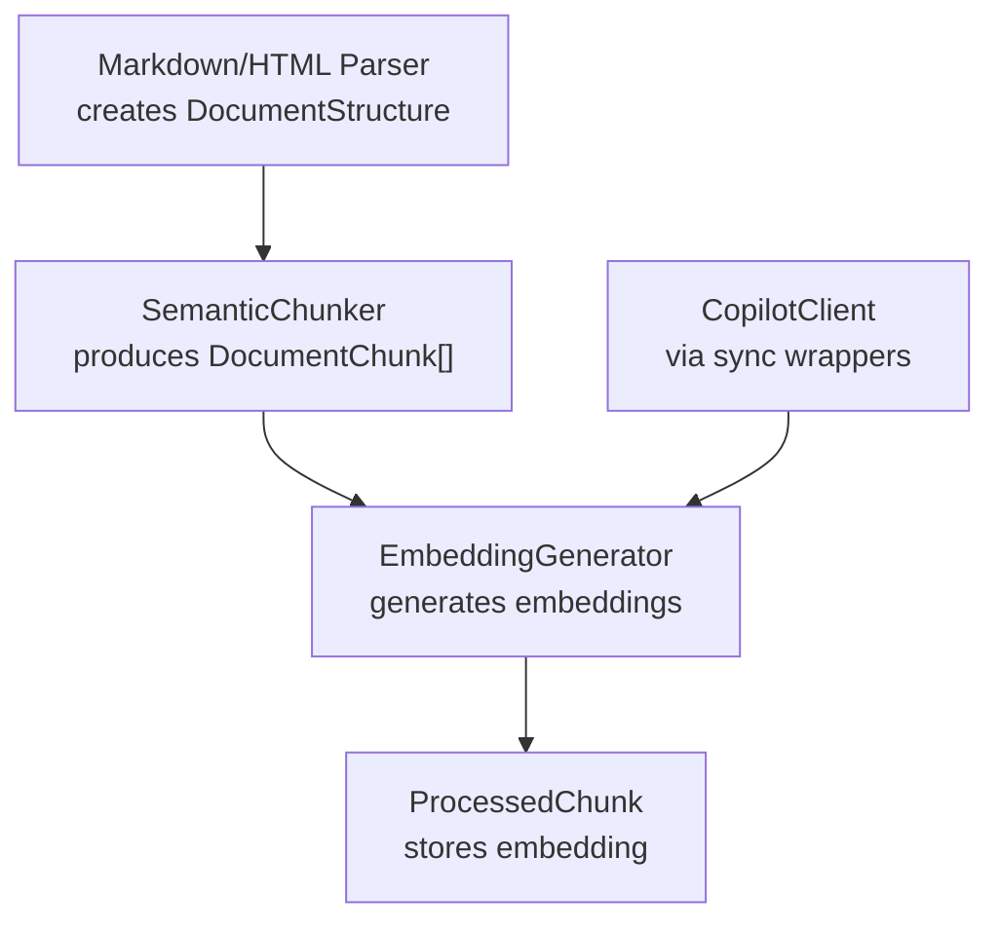
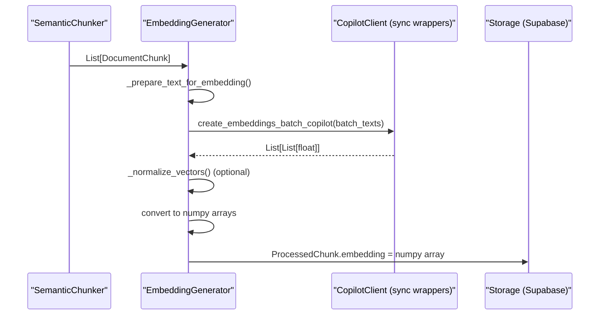
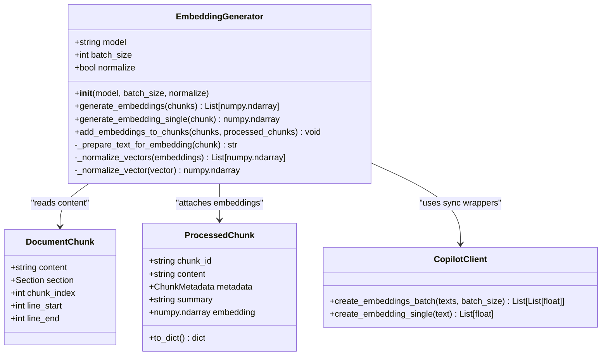
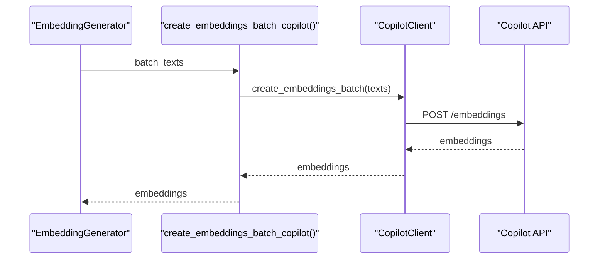
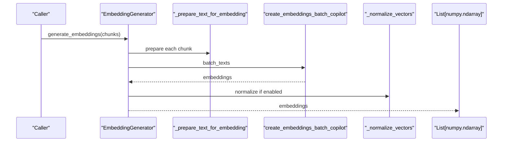
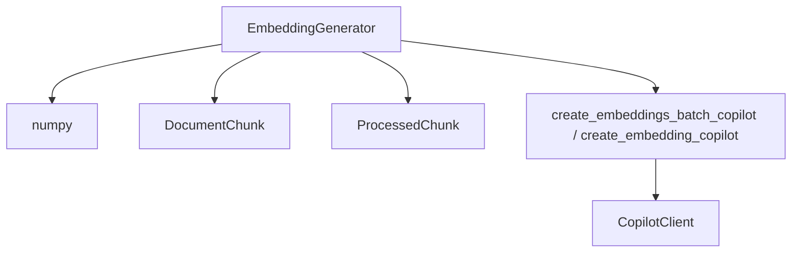

# Contextual Embeddings

<cite>
**Referenced Files in This Document**
- [EMBEDDING_GENERATOR_IMPLEMENTATION.md](file://EMBEDDING_GENERATOR_IMPLEMENTATION.md)
- [embedding_generator.py](file://src/user_manual_chunker/embedding_generator.py)
- [copilot_client.py](file://src/copilot_client.py)
- [data_models.py](file://src/user_manual_chunker/data_models.py)
- [interfaces.py](file://src/user_manual_chunker/interfaces.py)
- [config.py](file://src/user_manual_chunker/config.py)
- [demo_embedding_generator.py](file://demo_embedding_generator.py)
- [test_embedding_generator.py](file://test_embedding_generator.py)
- [semantic_chunker.py](file://src/user_manual_chunker/semantic_chunker.py)
- [__init__.py](file://src/user_manual_chunker/__init__.py)
</cite>

## Table of Contents
1. [Introduction](#introduction)
2. [Project Structure](#project-structure)
3. [Core Components](#core-components)
4. [Architecture Overview](#architecture-overview)
5. [Detailed Component Analysis](#detailed-component-analysis)
6. [Dependency Analysis](#dependency-analysis)
7. [Performance Considerations](#performance-considerations)
8. [Troubleshooting Guide](#troubleshooting-guide)
9. [Conclusion](#conclusion)
10. [Appendices](#appendices)

## Introduction
This document explains how contextual embeddings are generated for documentation chunks using the EmbeddingGenerator class and the Copilot API integration. It covers batch processing with configurable batch sizes, vector normalization for cosine similarity optimization, and code syntax preservation in embeddings. It also documents the generate_embeddings() and generate_embedding_single() methods, configuration options, performance characteristics, error handling, and integration with the broader RAG pipeline.

## Project Structure
The embedding generation capability is implemented within the user_manual_chunker package and integrates with the Copilot client for API calls. The pipeline stages leading to embeddings include parsing, semantic chunking, metadata extraction, summarization, and embedding generation.

**Diagram sources**
- [semantic_chunker.py](file://src/user_manual_chunker/semantic_chunker.py#L85-L144)
- [embedding_generator.py](file://src/user_manual_chunker/embedding_generator.py#L48-L213)
- [copilot_client.py](file://src/copilot_client.py#L431-L507)
- [data_models.py](file://src/user_manual_chunker/data_models.py#L137-L155)

**Section sources**
- [__init__.py](file://src/user_manual_chunker/__init__.py#L1-L67)
- [EMBEDDING_GENERATOR_IMPLEMENTATION.md](file://EMBEDDING_GENERATOR_IMPLEMENTATION.md#L130-L165)

## Core Components
- EmbeddingGenerator: Provides batch and single embedding generation, text preparation, normalization, and convenience methods to attach embeddings to ProcessedChunk objects.
- CopilotClient and sync wrappers: Provide batch and single embedding calls to the Copilot API, with rate limiting and error handling.
- Data models: Define DocumentChunk, ProcessedChunk, and ChunkMetadata used across the pipeline.
- Configuration: Centralizes model selection, batch size, and other processing options.

Key responsibilities:
- Batch processing with configurable batch size
- Vector normalization for cosine similarity
- Code syntax preservation in embedding input
- Integration with Copilot API via sync wrappers
- Error handling with descriptive messages

**Section sources**
- [embedding_generator.py](file://src/user_manual_chunker/embedding_generator.py#L30-L213)
- [copilot_client.py](file://src/copilot_client.py#L431-L507)
- [data_models.py](file://src/user_manual_chunker/data_models.py#L137-L155)
- [config.py](file://src/user_manual_chunker/config.py#L13-L67)

## Architecture Overview
The EmbeddingGenerator sits between the chunker and the storage layer. It transforms DocumentChunk objects into normalized numpy embeddings and attaches them to ProcessedChunk objects for downstream storage and retrieval.

**Diagram sources**
- [embedding_generator.py](file://src/user_manual_chunker/embedding_generator.py#L48-L124)
- [copilot_client.py](file://src/copilot_client.py#L431-L507)
- [data_models.py](file://src/user_manual_chunker/data_models.py#L137-L155)

## Detailed Component Analysis

### EmbeddingGenerator
The EmbeddingGenerator class encapsulates embedding generation with:
- Initialization parameters: model, batch_size, normalize
- Batch generation: generate_embeddings()
- Single generation: generate_embedding_single()
- Text preparation: preserves code blocks and language markers
- Normalization: L2 normalization for cosine similarity
- Convenience: add_embeddings_to_chunks()

**Diagram sources**
- [embedding_generator.py](file://src/user_manual_chunker/embedding_generator.py#L30-L213)
- [copilot_client.py](file://src/copilot_client.py#L431-L507)
- [interfaces.py](file://src/user_manual_chunker/interfaces.py#L150-L162)
- [data_models.py](file://src/user_manual_chunker/data_models.py#L137-L155)

Implementation highlights:
- Batch processing: generate_embeddings() iterates over chunks in steps of batch_size, prepares texts, calls the Copilot batch wrapper, converts to numpy arrays, and optionally normalizes.
- Single processing: generate_embedding_single() prepares text, calls the Copilot single wrapper, converts to numpy, and normalizes if enabled.
- Code preservation: _prepare_text_for_embedding() returns the chunk’s content as-is, which already preserves code blocks with language markers from earlier parsing.
- Normalization: _normalize_vector() computes L2 norm and returns the vector scaled to unit length; _normalize_vectors() applies this to a list.
- Integration: add_embeddings_to_chunks() validates equal lengths, generates embeddings, and assigns them to ProcessedChunk.embedding.

**Section sources**
- [embedding_generator.py](file://src/user_manual_chunker/embedding_generator.py#L48-L213)
- [interfaces.py](file://src/user_manual_chunker/interfaces.py#L150-L162)
- [data_models.py](file://src/user_manual_chunker/data_models.py#L137-L155)

### Copilot API Integration
The EmbeddingGenerator relies on sync wrappers around the async CopilotClient:
- create_embeddings_batch_copilot(): synchronous wrapper for batch embeddings
- create_embedding_copilot(): synchronous wrapper for single embeddings

These wrappers handle event loop detection and thread pool execution, returning fallback zero embeddings on failure and printing diagnostic messages.

**Diagram sources**
- [copilot_client.py](file://src/copilot_client.py#L431-L507)
- [embedding_generator.py](file://src/user_manual_chunker/embedding_generator.py#L76-L88)

**Section sources**
- [copilot_client.py](file://src/copilot_client.py#L431-L507)

### Data Models and Interfaces
- DocumentChunk: carries content and structural context for embedding.
- ProcessedChunk: holds content, metadata, summary, and embedding for persistence and retrieval.
- ChunkMetadata: stores structural and provenance information.

These models are used by EmbeddingGenerator to prepare inputs and attach outputs.

**Section sources**
- [interfaces.py](file://src/user_manual_chunker/interfaces.py#L150-L162)
- [data_models.py](file://src/user_manual_chunker/data_models.py#L137-L155)

### Configuration Options
- Model selection: embedding_model in ChunkerConfig controls the model used by the Copilot client.
- Batch size: embedding_batch_size in ChunkerConfig sets the batch size for embedding generation.
- Normalization: controlled by EmbeddingGenerator.normalize flag; default is True for cosine similarity.

Environment variables:
- MANUAL_EMBEDDING_MODEL
- MANUAL_EMBEDDING_BATCH_SIZE

**Section sources**
- [config.py](file://src/user_manual_chunker/config.py#L13-L67)
- [EMBEDDING_GENERATOR_IMPLEMENTATION.md](file://EMBEDDING_GENERATOR_IMPLEMENTATION.md#L22-L38)

### Batch Processing and Normalization
- Batch processing: generate_embeddings() splits input chunks into batches and calls the Copilot batch wrapper for each slice.
- Normalization: _normalize_vector() and _normalize_vectors() compute L2 norms and scale vectors to unit length; zero vectors are returned unchanged.
- Order preservation: batches are concatenated in order, maintaining alignment with input chunks.

**Section sources**
- [embedding_generator.py](file://src/user_manual_chunker/embedding_generator.py#L73-L92)
- [test_embedding_generator.py](file://test_embedding_generator.py#L197-L219)

### Code Syntax Preservation
- Embedding input text is derived from DocumentChunk.content, which preserves code blocks with language markers from the Section.get_text_content() method.
- Tests verify that code markers remain intact in prepared text and that embeddings are generated for chunks containing code.

**Section sources**
- [embedding_generator.py](file://src/user_manual_chunker/embedding_generator.py#L128-L144)
- [test_embedding_generator.py](file://test_embedding_generator.py#L343-L361)

### API Workflows
Sequence for batch embedding generation:

**Diagram sources**
- [embedding_generator.py](file://src/user_manual_chunker/embedding_generator.py#L48-L92)
- [copilot_client.py](file://src/copilot_client.py#L431-L507)

## Dependency Analysis
- EmbeddingGenerator depends on:
  - Copilot sync wrappers for API calls
  - numpy for vector operations and normalization
  - DocumentChunk interface and ProcessedChunk data model
- CopilotClient manages authentication, rate limiting, and retries.
- The package exports EmbeddingGenerator for easy integration.

**Diagram sources**
- [embedding_generator.py](file://src/user_manual_chunker/embedding_generator.py#L16-L20)
- [copilot_client.py](file://src/copilot_client.py#L431-L507)
- [interfaces.py](file://src/user_manual_chunker/interfaces.py#L150-L162)
- [data_models.py](file://src/user_manual_chunker/data_models.py#L137-L155)

**Section sources**
- [__init__.py](file://src/user_manual_chunker/__init__.py#L37-L39)

## Performance Considerations
- Batch size: The default is 32 chunks; larger batches reduce API overhead but increase memory usage. Typical performance characteristics indicate processing time proportional to the number of chunks and network latency.
- Memory usage: Embeddings for the default model have a fixed dimensionality; memory scales linearly with the number of chunks.
- Normalization overhead: Vector normalization is lightweight and performed via vectorized numpy operations.
- Rate limiting: The Copilot client enforces rate limits and includes exponential backoff for transient failures.

Practical guidance:
- Adjust embedding_batch_size according to available memory and throughput targets.
- Use normalization for cosine similarity-based retrieval.
- Monitor API quotas and consider increasing COPILOT_REQUESTS_PER_MINUTE if needed.

**Section sources**
- [EMBEDDING_GENERATOR_IMPLEMENTATION.md](file://EMBEDDING_GENERATOR_IMPLEMENTATION.md#L166-L207)
- [copilot_client.py](file://src/copilot_client.py#L19-L118)

## Troubleshooting Guide
Common issues and resolutions:
- Missing API token: Ensure GITHUB_TOKEN is set; the Copilot client requires authentication.
- Network or rate limit errors: The Copilot client implements rate limiting and backoff; verify network connectivity and consider reducing batch size or rate.
- Chunk count mismatch: add_embeddings_to_chunks() raises a ValueError if the number of chunks differs from the number of ProcessedChunk objects.
- Batch failures: generate_embeddings() surfaces exceptions with batch identification; inspect the error message to locate failing batches.

Validation and demonstration:
- Unit tests cover initialization, normalization, batching, error handling, and integration with ProcessedChunk.
- The demo script demonstrates batch and single embedding generation, code preservation, normalization verification, and performance measurement.

**Section sources**
- [test_embedding_generator.py](file://test_embedding_generator.py#L220-L258)
- [test_embedding_generator.py](file://test_embedding_generator.py#L312-L341)
- [demo_embedding_generator.py](file://demo_embedding_generator.py#L1-L190)
- [EMBEDDING_GENERATOR_IMPLEMENTATION.md](file://EMBEDDING_GENERATOR_IMPLEMENTATION.md#L257-L311)

## Conclusion
The EmbeddingGenerator provides a robust, configurable, and production-ready mechanism for generating contextual embeddings from documentation chunks. It integrates seamlessly with the Copilot API, preserves code syntax, normalizes vectors for cosine similarity, and offers both batch and single embedding generation. With comprehensive tests and clear error handling, it is ready for integration into the broader RAG pipeline.

## Appendices

### Configuration Reference
- Model selection: MANUAL_EMBEDDING_MODEL
- Batch size: MANUAL_EMBEDDING_BATCH_SIZE
- Normalization: controlled by EmbeddingGenerator.normalize (default True)

**Section sources**
- [config.py](file://src/user_manual_chunker/config.py#L13-L67)
- [EMBEDDING_GENERATOR_IMPLEMENTATION.md](file://EMBEDDING_GENERATOR_IMPLEMENTATION.md#L22-L38)

### Integration with Pipeline
- Input: SemanticChunker produces DocumentChunk objects.
- Output: ProcessedChunk objects include embeddings for storage and retrieval.
- Storage: ProcessedChunk.to_dict() serializes embedding as a list suitable for vector databases.

**Section sources**
- [semantic_chunker.py](file://src/user_manual_chunker/semantic_chunker.py#L85-L144)
- [data_models.py](file://src/user_manual_chunker/data_models.py#L137-L155)
- [EMBEDDING_GENERATOR_IMPLEMENTATION.md](file://EMBEDDING_GENERATOR_IMPLEMENTATION.md#L219-L256)