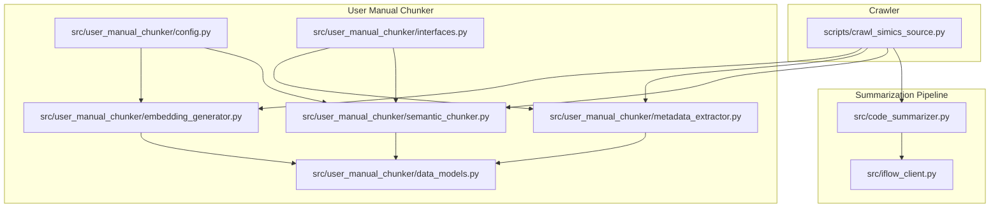
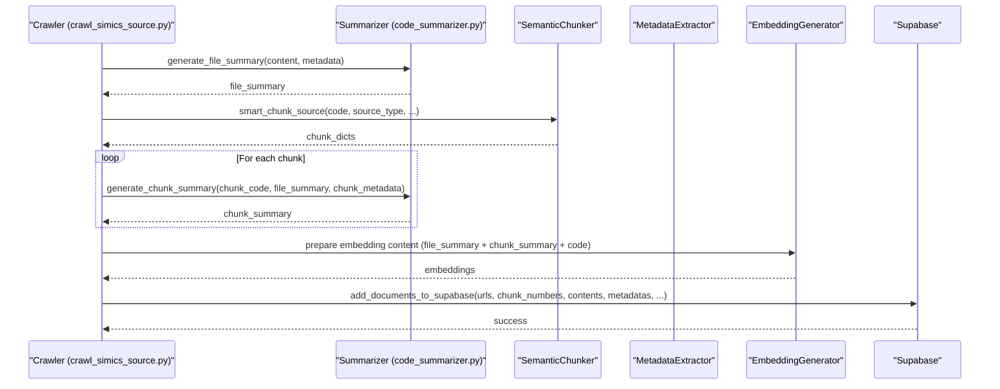
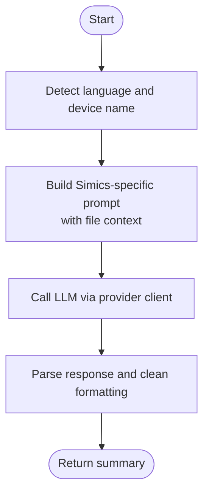
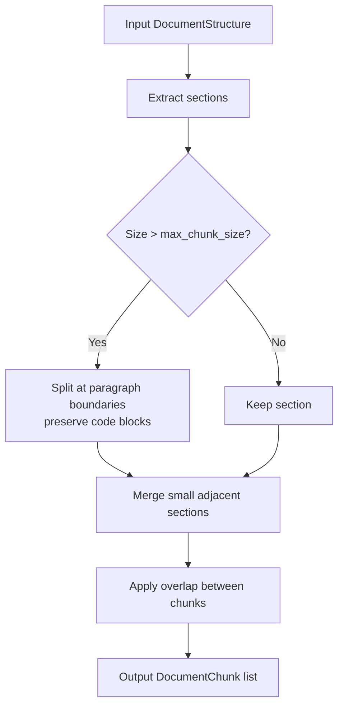
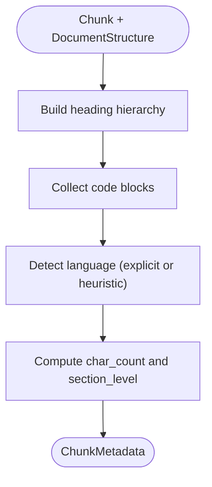
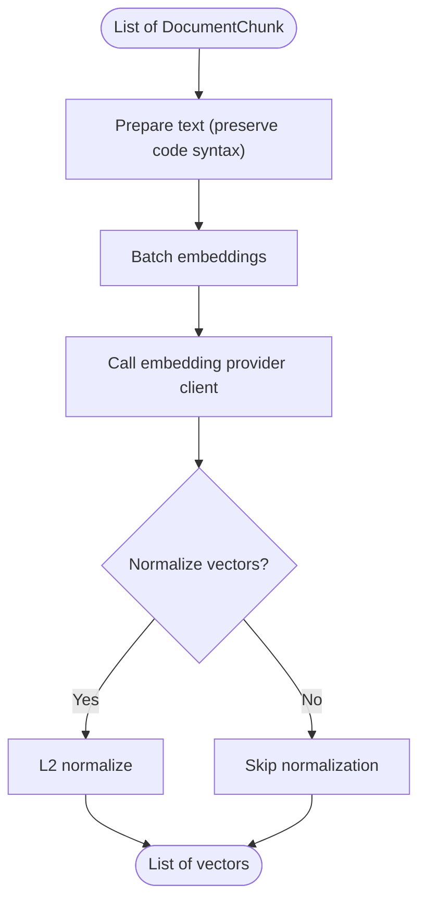
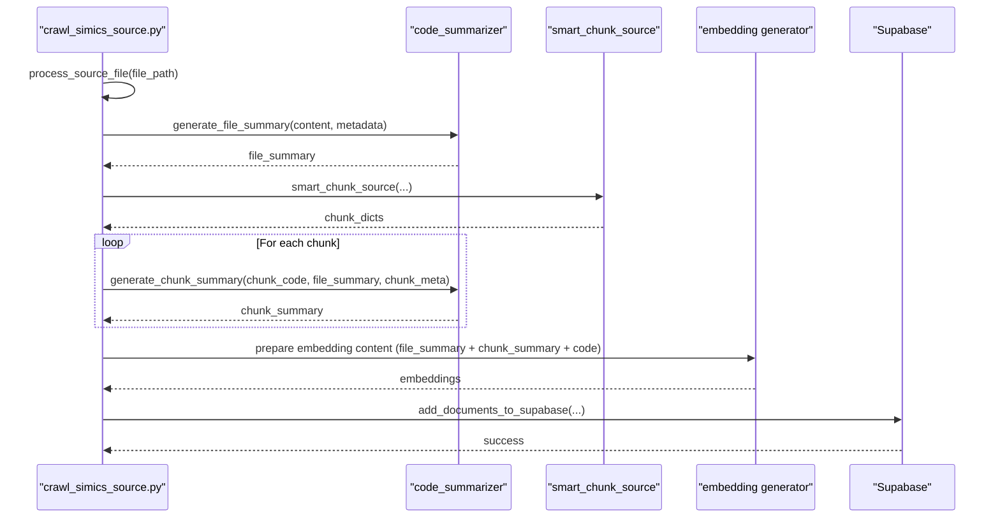
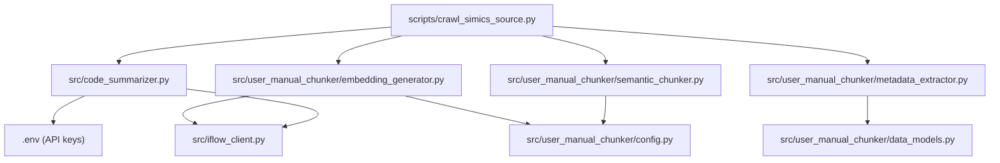

# Hybrid Search

<cite>
**Referenced Files in This Document**
- [HYBRID_SUMMARIZATION_IMPLEMENTATION.md](file://HYBRID_SUMMARIZATION_IMPLEMENTATION.md)
- [README.md](file://README.md)
- [scripts/crawl_simics_source.py](file://scripts/crawl_simics_source.py)
- [src/code_summarizer.py](file://src/code_summarizer.py)
- [src/iflow_client.py](file://src/iflow_client.py)
- [src/user_manual_chunker/semantic_chunker.py](file://src/user_manual_chunker/semantic_chunker.py)
- [src/user_manual_chunker/metadata_extractor.py](file://src/user_manual_chunker/metadata_extractor.py)
- [src/user_manual_chunker/embedding_generator.py](file://src/user_manual_chunker/embedding_generator.py)
- [src/user_manual_chunker/data_models.py](file://src/user_manual_chunker/data_models.py)
- [src/user_manual_chunker/config.py](file://src/user_manual_chunker/config.py)
- [src/user_manual_chunker/interfaces.py](file://src/user_manual_chunker/interfaces.py)
</cite>

## Table of Contents
1. [Introduction](#introduction)
2. [Project Structure](#project-structure)
3. [Core Components](#core-components)
4. [Architecture Overview](#architecture-overview)
5. [Detailed Component Analysis](#detailed-component-analysis)
6. [Dependency Analysis](#dependency-analysis)
7. [Performance Considerations](#performance-considerations)
8. [Troubleshooting Guide](#troubleshooting-guide)
9. [Conclusion](#conclusion)
10. [Appendices](#appendices)

## Introduction
This document explains the hybrid search implementation that combines semantic search with keyword-based retrieval to improve result accuracy. It details how file-level and chunk-level summaries enhance search relevance, describes the multi-level context generation (file summary + chunk summary + code), and outlines metadata extraction that contributes to hybrid search effectiveness. It also covers configuration options for enabling/disabling hybrid search and performance considerations when using summary-enhanced embeddings.

## Project Structure
The hybrid search implementation spans multiple modules:
- Summarization pipeline for Simics source code (file-level and chunk-level)
- Semantic chunking and metadata extraction for user manual documentation
- Embedding generation and storage for both user manuals and Simics source code
- Crawler script orchestrating the end-to-end workflow for Simics source code

**Diagram sources**
- [scripts/crawl_simics_source.py](file://scripts/crawl_simics_source.py#L219-L430)
- [src/code_summarizer.py](file://src/code_summarizer.py#L1-L160)
- [src/iflow_client.py](file://src/iflow_client.py#L106-L184)
- [src/user_manual_chunker/semantic_chunker.py](file://src/user_manual_chunker/semantic_chunker.py#L1-L120)
- [src/user_manual_chunker/metadata_extractor.py](file://src/user_manual_chunker/metadata_extractor.py#L1-L95)
- [src/user_manual_chunker/embedding_generator.py](file://src/user_manual_chunker/embedding_generator.py#L1-L120)
- [src/user_manual_chunker/data_models.py](file://src/user_manual_chunker/data_models.py#L1-L120)
- [src/user_manual_chunker/config.py](file://src/user_manual_chunker/config.py#L1-L70)
- [src/user_manual_chunker/interfaces.py](file://src/user_manual_chunker/interfaces.py#L1-L80)

**Section sources**
- [HYBRID_SUMMARIZATION_IMPLEMENTATION.md](file://HYBRID_SUMMARIZATION_IMPLEMENTATION.md#L1-L120)
- [README.md](file://README.md#L205-L243)

## Core Components
- Summarization: Generates file-level and chunk-level summaries with Simics-specific prompts and context.
- Semantic chunking: Produces coherent chunks while preserving code boundaries and section semantics.
- Metadata extraction: Builds hierarchical metadata including heading paths, code language detection, and provenance.
- Embedding generation: Creates vectors for chunks, preserving code syntax and normalizing for cosine similarity.
- Crawler orchestration: Integrates summarization, chunking, metadata, and embedding into a single pipeline for Simics source code.

**Section sources**
- [src/code_summarizer.py](file://src/code_summarizer.py#L1-L160)
- [src/user_manual_chunker/semantic_chunker.py](file://src/user_manual_chunker/semantic_chunker.py#L1-L120)
- [src/user_manual_chunker/metadata_extractor.py](file://src/user_manual_chunker/metadata_extractor.py#L1-L95)
- [src/user_manual_chunker/embedding_generator.py](file://src/user_manual_chunker/embedding_generator.py#L1-L120)
- [scripts/crawl_simics_source.py](file://scripts/crawl_simics_source.py#L219-L430)

## Architecture Overview
The hybrid search architecture integrates:
- File-level and chunk-level summarization to enrich the content used for embeddings
- Semantic chunking to ensure coherent retrieval units
- Metadata extraction to provide structured context for filtering and ranking
- Embedding generation for vector similarity search
- Crawler orchestration to produce summary-enhanced embeddings and store them with metadata

**Diagram sources**
- [scripts/crawl_simics_source.py](file://scripts/crawl_simics_source.py#L282-L390)
- [src/code_summarizer.py](file://src/code_summarizer.py#L1-L160)
- [src/user_manual_chunker/semantic_chunker.py](file://src/user_manual_chunker/semantic_chunker.py#L85-L144)
- [src/user_manual_chunker/embedding_generator.py](file://src/user_manual_chunker/embedding_generator.py#L48-L120)

## Detailed Component Analysis

### Summarization Pipeline
- File-level summarization: Generates a concise description of the entire file using Simics-specific prompts and context.
- Chunk-level summarization: Generates focused summaries for each code chunk using file context and chunk metadata.
- LLM integration: Uses an OpenAI-compatible interface via a provider client with rate limiting and backoff.

**Diagram sources**
- [src/code_summarizer.py](file://src/code_summarizer.py#L27-L140)
- [src/iflow_client.py](file://src/iflow_client.py#L106-L184)

**Section sources**
- [src/code_summarizer.py](file://src/code_summarizer.py#L1-L160)
- [src/iflow_client.py](file://src/iflow_client.py#L1-L120)

### Semantic Chunking
- Splits documents at section boundaries, preserves code blocks, merges small sections, and applies overlap to maintain context.
- Supports token-based sizing when configured.

**Diagram sources**
- [src/user_manual_chunker/semantic_chunker.py](file://src/user_manual_chunker/semantic_chunker.py#L85-L144)
- [src/user_manual_chunker/semantic_chunker.py](file://src/user_manual_chunker/semantic_chunker.py#L146-L237)
- [src/user_manual_chunker/semantic_chunker.py](file://src/user_manual_chunker/semantic_chunker.py#L391-L490)

**Section sources**
- [src/user_manual_chunker/semantic_chunker.py](file://src/user_manual_chunker/semantic_chunker.py#L1-L200)
- [src/user_manual_chunker/interfaces.py](file://src/user_manual_chunker/interfaces.py#L63-L104)

### Metadata Extraction
- Builds heading hierarchy from chunk to root.
- Detects programming languages in code blocks, including heuristic detection when language is unspecified.
- Records source file, section level, code presence, and counts.

**Diagram sources**
- [src/user_manual_chunker/metadata_extractor.py](file://src/user_manual_chunker/metadata_extractor.py#L49-L94)
- [src/user_manual_chunker/metadata_extractor.py](file://src/user_manual_chunker/metadata_extractor.py#L117-L165)

**Section sources**
- [src/user_manual_chunker/metadata_extractor.py](file://src/user_manual_chunker/metadata_extractor.py#L1-L120)
- [src/user_manual_chunker/data_models.py](file://src/user_manual_chunker/data_models.py#L118-L155)

### Embedding Generation
- Prepares text for embedding while preserving code syntax.
- Supports batch processing and normalization for cosine similarity.
- Integrates with an embedding provider client.

**Diagram sources**
- [src/user_manual_chunker/embedding_generator.py](file://src/user_manual_chunker/embedding_generator.py#L128-L181)
- [src/user_manual_chunker/embedding_generator.py](file://src/user_manual_chunker/embedding_generator.py#L48-L120)

**Section sources**
- [src/user_manual_chunker/embedding_generator.py](file://src/user_manual_chunker/embedding_generator.py#L1-L120)
- [src/user_manual_chunker/config.py](file://src/user_manual_chunker/config.py#L1-L70)

### Crawler Orchestration for Simics Source Code
- Processes DML and Python files, determines source IDs, and prepares metadata.
- Orchestrates file-level summarization, chunking, chunk-level summarization, and embedding preparation.
- Stores results in Supabase with enhanced content and metadata.

**Diagram sources**
- [scripts/crawl_simics_source.py](file://scripts/crawl_simics_source.py#L282-L390)
- [src/code_summarizer.py](file://src/code_summarizer.py#L141-L253)
- [src/user_manual_chunker/embedding_generator.py](file://src/user_manual_chunker/embedding_generator.py#L128-L181)

**Section sources**
- [scripts/crawl_simics_source.py](file://scripts/crawl_simics_source.py#L219-L430)

## Dependency Analysis
- Summarization depends on a provider client for LLM calls and environment variables for credentials.
- Semantic chunking depends on configuration for chunk sizes and metrics.
- Metadata extraction depends on document structure and code block detection.
- Embedding generation depends on a provider client and configuration for batch size and normalization.
- Crawler orchestrates all components and coordinates environment-driven toggles.

**Diagram sources**
- [src/code_summarizer.py](file://src/code_summarizer.py#L1-L160)
- [src/iflow_client.py](file://src/iflow_client.py#L106-L184)
- [src/user_manual_chunker/semantic_chunker.py](file://src/user_manual_chunker/semantic_chunker.py#L1-L120)
- [src/user_manual_chunker/config.py](file://src/user_manual_chunker/config.py#L1-L70)
- [src/user_manual_chunker/metadata_extractor.py](file://src/user_manual_chunker/metadata_extractor.py#L1-L95)
- [src/user_manual_chunker/embedding_generator.py](file://src/user_manual_chunker/embedding_generator.py#L1-L120)
- [scripts/crawl_simics_source.py](file://scripts/crawl_simics_source.py#L219-L430)

**Section sources**
- [src/user_manual_chunker/interfaces.py](file://src/user_manual_chunker/interfaces.py#L1-L162)
- [src/user_manual_chunker/data_models.py](file://src/user_manual_chunker/data_models.py#L1-L120)

## Performance Considerations
- Parallel chunk-level summarization reduces processing time by distributing LLM calls across workers.
- Caching summaries in metadata avoids regenerating summaries on re-crawl unless file content changes.
- Batch embedding processing minimizes overhead and improves throughput.
- Normalization ensures cosine similarity is effective for retrieval.
- Token-based chunking can improve alignment with model token limits when enabled.

Practical tips:
- Tune chunk size and overlap to balance recall and precision.
- Adjust embedding batch size according to provider limits and memory availability.
- Use environment variables to control rate limiting and concurrency for LLM calls.
- Monitor token counts and adjust truncation thresholds for long files.

**Section sources**
- [HYBRID_SUMMARIZATION_IMPLEMENTATION.md](file://HYBRID_SUMMARIZATION_IMPLEMENTATION.md#L343-L374)
- [src/user_manual_chunker/embedding_generator.py](file://src/user_manual_chunker/embedding_generator.py#L30-L60)
- [src/user_manual_chunker/config.py](file://src/user_manual_chunker/config.py#L1-L70)

## Troubleshooting Guide
Common issues and resolutions:
- Missing API key for LLM provider: Ensure the environment variable is set before running summarization.
- Rate limiting errors: Reduce concurrent workers or increase rate limit settings; the provider client implements backoff.
- Summarization disabled: Confirm the environment toggle is enabled to include summaries in embeddings.
- Metadata inconsistencies: Verify heading hierarchy and code language detection logic.

Operational checks:
- Validate environment variables for provider credentials and toggles.
- Confirm chunker configuration parameters meet constraints.
- Ensure embedding provider client is reachable and returning vectors.

**Section sources**
- [src/iflow_client.py](file://src/iflow_client.py#L106-L184)
- [scripts/crawl_simics_source.py](file://scripts/crawl_simics_source.py#L247-L251)
- [src/user_manual_chunker/config.py](file://src/user_manual_chunker/config.py#L71-L116)

## Conclusion
The hybrid search implementation integrates file-level and chunk-level summaries with semantic chunking and metadata extraction to produce richer embeddings. The crawler orchestrates this pipeline for Simics source code, storing enhanced content and metadata for improved retrieval. Configuration toggles enable selective activation of summarization and embedding generation, while performance optimizations like parallel processing and batching ensure scalability.

## Appendices

### Configuration Options for Hybrid Search
- Enable/disable summarization and embedding generation via environment variables.
- Configure chunk sizes, overlap, and size metrics for semantic chunking.
- Set embedding model and batch size for embedding generation.
- Control rate limiting for LLM calls.

Environment variables and configuration keys:
- Summarization toggle and model selection
- Chunker parameters (max/min chunk size, overlap, size metric)
- Embedding model and batch size
- Rate limiting parameters for provider client

**Section sources**
- [README.md](file://README.md#L205-L243)
- [src/user_manual_chunker/config.py](file://src/user_manual_chunker/config.py#L1-L70)
- [src/iflow_client.py](file://src/iflow_client.py#L90-L120)

### Role of File-Level and Chunk-Level Summaries
- File-level summaries provide high-level context for the entire file, improving retrieval for broad topics.
- Chunk-level summaries add specificity for code segments, improving precision for targeted queries.
- Combined with code content, summaries yield embeddings that reflect both structure and semantics.

**Section sources**
- [HYBRID_SUMMARIZATION_IMPLEMENTATION.md](file://HYBRID_SUMMARIZATION_IMPLEMENTATION.md#L1-L73)
- [src/code_summarizer.py](file://src/code_summarizer.py#L1-L160)

### Multi-Level Context Generation
- File summary: overall purpose and functionality
- Chunk summary: specific implementation details
- Code: actual implementation preserved for syntax-aware embeddings

This hierarchy enables retrieval at different abstraction levels, improving both recall and precision.

**Section sources**
- [HYBRID_SUMMARIZATION_IMPLEMENTATION.md](file://HYBRID_SUMMARIZATION_IMPLEMENTATION.md#L407-L414)
- [scripts/crawl_simics_source.py](file://scripts/crawl_simics_source.py#L338-L370)

### Metadata Extraction and Hybrid Search Effectiveness
- Hierarchical metadata (heading path) supports filtering and ranking.
- Code language detection aids in targeted retrieval and reranking.
- Provenance metadata (file path, source type, chunk indices) improves explainability and result filtering.

**Section sources**
- [src/user_manual_chunker/metadata_extractor.py](file://src/user_manual_chunker/metadata_extractor.py#L49-L94)
- [src/user_manual_chunker/data_models.py](file://src/user_manual_chunker/data_models.py#L118-L155)