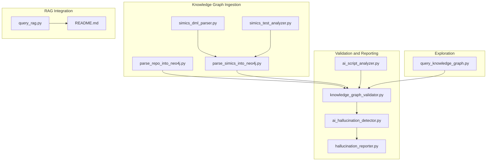
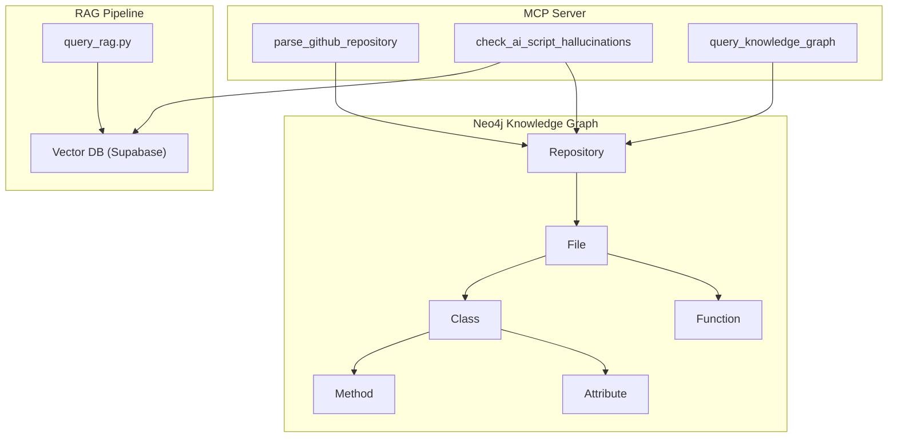
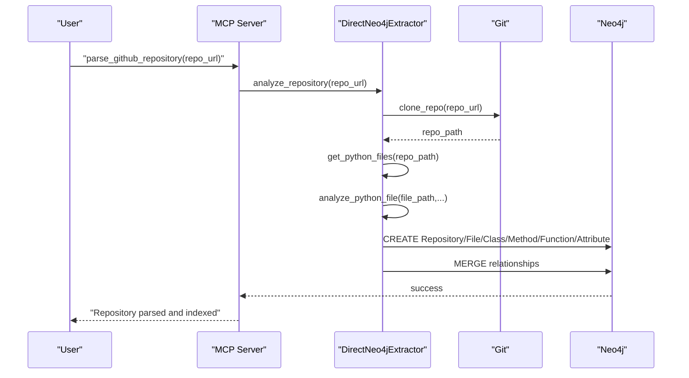
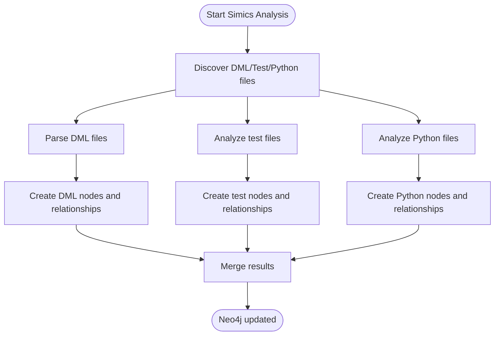
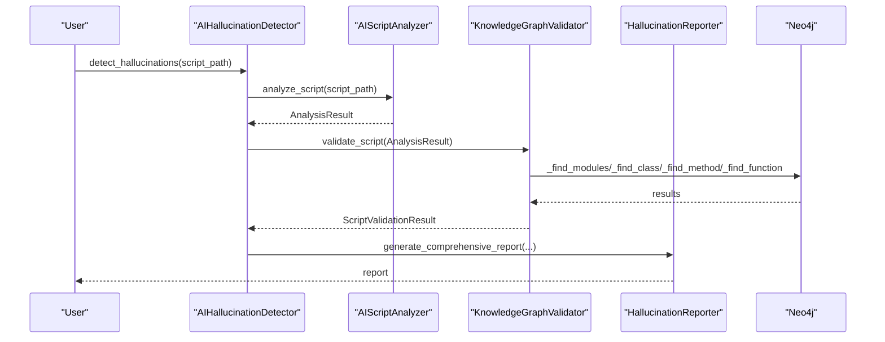
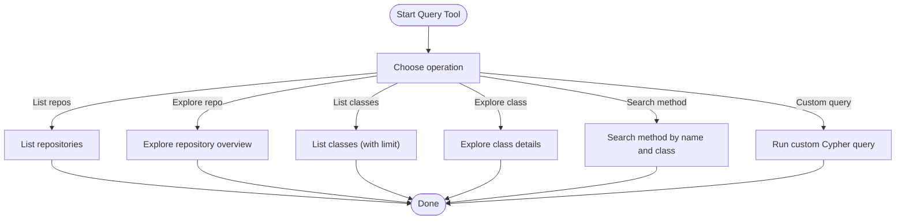
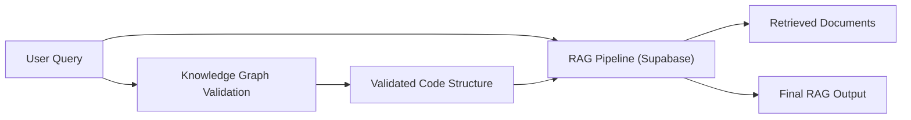
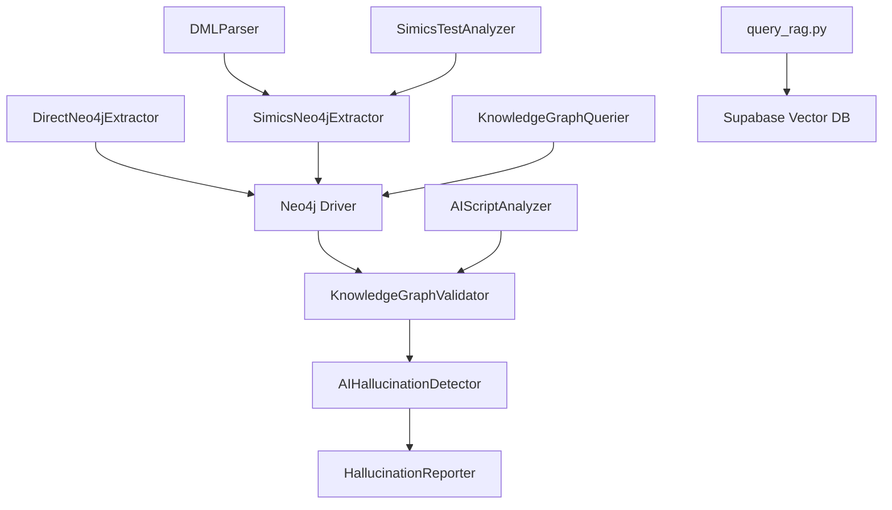

# Knowledge Graph Integration

<cite>
**Referenced Files in This Document**
- [README.md](file://README.md)
- [parse_repo_into_neo4j.py](file://knowledge_graphs/parse_repo_into_neo4j.py)
- [query_knowledge_graph.py](file://knowledge_graphs/query_knowledge_graph.py)
- [ai_hallucination_detector.py](file://knowledge_graphs/ai_hallucination_detector.py)
- [ai_script_analyzer.py](file://knowledge_graphs/ai_script_analyzer.py)
- [knowledge_graph_validator.py](file://knowledge_graphs/knowledge_graph_validator.py)
- [hallucination_reporter.py](file://knowledge_graphs/hallucination_reporter.py)
- [parse_simics_into_neo4j.py](file://knowledge_graphs/parse_simics_into_neo4j.py)
- [simics_dml_parser.py](file://knowledge_graphs/simics_dml_parser.py)
- [simics_test_analyzer.py](file://knowledge_graphs/simics_test_analyzer.py)
- [query_rag.py](file://scripts/query_rag.py)
- [test_neo4j_integration.py](file://tests/test_neo4j_integration.py)
</cite>

## Table of Contents
1. [Introduction](#introduction)
2. [Project Structure](#project-structure)
3. [Core Components](#core-components)
4. [Architecture Overview](#architecture-overview)
5. [Detailed Component Analysis](#detailed-component-analysis)
6. [Dependency Analysis](#dependency-analysis)
7. [Performance Considerations](#performance-considerations)
8. [Troubleshooting Guide](#troubleshooting-guide)
9. [Conclusion](#conclusion)
10. [Appendices](#appendices)

## Introduction
This document explains how the repository integrates a knowledge graph built on Neo4j with Retrieval-Augmented Generation (RAG). It covers how code structure information is stored in Neo4j, how the knowledge graph enhances RAG by providing structural context, and how hallucinations are detected using the knowledge graph. It also documents the schema design, the implementation of parse_github_repository, query_knowledge_graph, and the integration points with the main RAG pipeline.

## Project Structure
The knowledge graph functionality lives primarily under the knowledge_graphs directory and integrates with the broader RAG pipeline via scripts and MCP tools. The key areas are:
- Knowledge graph ingestion and schema: parse_repo_into_neo4j.py, parse_simics_into_neo4j.py, simics_dml_parser.py, simics_test_analyzer.py
- Validation and hallucination detection: ai_script_analyzer.py, knowledge_graph_validator.py, ai_hallucination_detector.py, hallucination_reporter.py
- Exploration and querying: query_knowledge_graph.py
- RAG integration: query_rag.py and README documentation



**Diagram sources**
- [parse_repo_into_neo4j.py](file://knowledge_graphs/parse_repo_into_neo4j.py#L1-L858)
- [parse_simics_into_neo4j.py](file://knowledge_graphs/parse_simics_into_neo4j.py#L1-L717)
- [simics_dml_parser.py](file://knowledge_graphs/simics_dml_parser.py#L1-L467)
- [simics_test_analyzer.py](file://knowledge_graphs/simics_test_analyzer.py#L1-L542)
- [ai_script_analyzer.py](file://knowledge_graphs/ai_script_analyzer.py#L1-L532)
- [knowledge_graph_validator.py](file://knowledge_graphs/knowledge_graph_validator.py#L1-L1244)
- [ai_hallucination_detector.py](file://knowledge_graphs/ai_hallucination_detector.py#L1-L335)
- [hallucination_reporter.py](file://knowledge_graphs/hallucination_reporter.py#L1-L523)
- [query_knowledge_graph.py](file://knowledge_graphs/query_knowledge_graph.py#L1-L400)
- [query_rag.py](file://scripts/query_rag.py#L1-L348)
- [README.md](file://README.md#L626-L773)

**Section sources**
- [README.md](file://README.md#L626-L773)

## Core Components
- Knowledge graph ingestion: parses repositories and Simics code into Neo4j nodes and relationships.
- Structural validation: validates AI-generated Python scripts against the knowledge graph to detect hallucinations.
- Exploration tool: interactive CLI to query and explore the knowledge graph.
- RAG integration: query_rag.py demonstrates how the RAG pipeline filters and retrieves results by source type, complementing knowledge graph validation.

**Section sources**
- [parse_repo_into_neo4j.py](file://knowledge_graphs/parse_repo_into_neo4j.py#L1-L858)
- [ai_script_analyzer.py](file://knowledge_graphs/ai_script_analyzer.py#L1-L532)
- [knowledge_graph_validator.py](file://knowledge_graphs/knowledge_graph_validator.py#L1-L1244)
- [hallucination_reporter.py](file://knowledge_graphs/hallucination_reporter.py#L1-L523)
- [query_knowledge_graph.py](file://knowledge_graphs/query_knowledge_graph.py#L1-L400)
- [query_rag.py](file://scripts/query_rag.py#L1-L348)

## Architecture Overview
The knowledge graph architecture stores repository code structure in Neo4j and validates AI-generated scripts against it. The MCP server exposes tools for parsing repositories, validating scripts, and querying the knowledge graph. The RAG pipeline continues to use vector search with optional filters; the knowledge graph adds a complementary structural validation layer.



**Diagram sources**
- [parse_repo_into_neo4j.py](file://knowledge_graphs/parse_repo_into_neo4j.py#L612-L804)
- [knowledge_graph_validator.py](file://knowledge_graphs/knowledge_graph_validator.py#L642-L804)
- [query_knowledge_graph.py](file://knowledge_graphs/query_knowledge_graph.py#L1-L400)
- [query_rag.py](file://scripts/query_rag.py#L1-L348)
- [README.md](file://README.md#L626-L773)

## Detailed Component Analysis

### Knowledge Graph Schema and Storage
The knowledge graph schema models repositories, files, classes, methods, functions, and attributes, with relationships representing containment and definitions.

- Nodes:
  - Repository: GitHub repositories
  - File: Python files within repositories
  - Class: Python classes with methods and attributes
  - Method: Class methods with parameter information
  - Function: Standalone functions
  - Attribute: Class attributes

- Relationships:
  - Repository CONTAINS File
  - File DEFINES Class
  - File DEFINES Function
  - Class HAS_METHOD Method
  - Class HAS_ATTRIBUTE Attribute

```mermaid
erDiagram
REPOSITORY {
string name PK
datetime created_at
}
FILE {
string path PK
string name
string module_name
int line_count
datetime created_at
}
CLASS {
string full_name PK
string name
datetime created_at
}
METHOD {
string method_id PK
string name
string full_name
string[] args
string[] params_list
string[] params_detailed
string return_type
datetime created_at
}
FUNCTION {
string func_id PK
string name
string full_name
string[] args
string[] params_list
string[] params_detailed
string return_type
datetime created_at
}
ATTRIBUTE {
string attr_id PK
string name
string full_name
string type
datetime created_at
}
REPOSITORY ||--o{ FILE : "CONTAINS"
FILE ||--o{ CLASS : "DEFINES"
FILE ||--o{ FUNCTION : "DEFINES"
CLASS ||--o{ METHOD : "HAS_METHOD"
CLASS ||--o{ ATTRIBUTE : "HAS_ATTRIBUTE"
```

**Diagram sources**
- [parse_repo_into_neo4j.py](file://knowledge_graphs/parse_repo_into_neo4j.py#L612-L804)

**Section sources**
- [parse_repo_into_neo4j.py](file://knowledge_graphs/parse_repo_into_neo4j.py#L612-L804)
- [README.md](file://README.md#L626-L773)

### parse_github_repository Implementation
The parse_github_repository functionality clones a GitHub repository, analyzes Python files using AST, and writes nodes and relationships directly into Neo4j. It:
- Clones the repository (with shallow depth) and enumerates Python files
- Identifies project modules and determines module names
- Extracts classes, methods, functions, and imports from each file
- Creates Repository, File, Class, Method, Function, Attribute nodes and relationships
- Uses MERGE semantics to avoid duplicates and maintains constraints/indexes



**Diagram sources**
- [parse_repo_into_neo4j.py](file://knowledge_graphs/parse_repo_into_neo4j.py#L529-L804)

**Section sources**
- [parse_repo_into_neo4j.py](file://knowledge_graphs/parse_repo_into_neo4j.py#L529-L804)

### Simics-Specific Extensions
For Simics codebases, the system extends the repository parser to handle DML files, test files, and Python files:
- DML parsing extracts devices, interfaces, methods, attributes, registers, and creates DML-specific nodes and relationships
- Test analysis extracts Simics API calls, device instantiations, test functions/fixtures, and assertions
- Python analysis reuses the base Python analyzer to create File/Class/Method/Function nodes



**Diagram sources**
- [parse_simics_into_neo4j.py](file://knowledge_graphs/parse_simics_into_neo4j.py#L1-L717)
- [simics_dml_parser.py](file://knowledge_graphs/simics_dml_parser.py#L1-L467)
- [simics_test_analyzer.py](file://knowledge_graphs/simics_test_analyzer.py#L1-L542)

**Section sources**
- [parse_simics_into_neo4j.py](file://knowledge_graphs/parse_simics_into_neo4j.py#L1-L717)
- [simics_dml_parser.py](file://knowledge_graphs/simics_dml_parser.py#L1-L467)
- [simics_test_analyzer.py](file://knowledge_graphs/simics_test_analyzer.py#L1-L542)

### Knowledge Graph Validation and Hallucination Detection
The validation pipeline:
- Parses AI-generated Python scripts using AST to extract imports, class instantiations, method calls, function calls, and attribute accesses
- Validates each element against the knowledge graph:
  - Imports: checks if modules exist in the knowledge graph and lists available classes/functions
  - Classes: verifies constructors and parameters
  - Methods: verifies existence and parameter validity
  - Attributes: verifies existence or treats certain patterns as valid (e.g., decorated methods)
  - Functions: verifies existence and parameter validity
- Generates a comprehensive report with confidence scores and recommendations



**Diagram sources**
- [ai_hallucination_detector.py](file://knowledge_graphs/ai_hallucination_detector.py#L1-L335)
- [ai_script_analyzer.py](file://knowledge_graphs/ai_script_analyzer.py#L1-L532)
- [knowledge_graph_validator.py](file://knowledge_graphs/knowledge_graph_validator.py#L1-L1244)
- [hallucination_reporter.py](file://knowledge_graphs/hallucination_reporter.py#L1-L523)

**Section sources**
- [ai_hallucination_detector.py](file://knowledge_graphs/ai_hallucination_detector.py#L1-L335)
- [ai_script_analyzer.py](file://knowledge_graphs/ai_script_analyzer.py#L1-L532)
- [knowledge_graph_validator.py](file://knowledge_graphs/knowledge_graph_validator.py#L1-L1244)
- [hallucination_reporter.py](file://knowledge_graphs/hallucination_reporter.py#L1-L523)

### query_knowledge_graph Functionality
The query_knowledge_graph tool provides:
- Listing repositories and exploring repository structure
- Listing classes and exploring class details (methods, attributes)
- Searching for methods by name and class
- Running custom Cypher queries
- Interactive mode for ad-hoc exploration



**Diagram sources**
- [query_knowledge_graph.py](file://knowledge_graphs/query_knowledge_graph.py#L1-L400)

**Section sources**
- [query_knowledge_graph.py](file://knowledge_graphs/query_knowledge_graph.py#L1-L400)

### Enhancing RAG with Structural Context
The knowledge graph enhances RAG by:
- Providing structural context: when retrieving documentation, the knowledge graph can inform which classes and methods are available, helping disambiguate search terms and improve relevance
- Enabling hallucination detection: by validating AI-generated code against the knowledge graph, the system reduces false positives and incorrect usage patterns
- Complementary filtering: the RAG pipeline can filter by source type (e.g., docs vs. DML vs. Python), while the knowledge graph validates structural correctness



**Diagram sources**
- [query_rag.py](file://scripts/query_rag.py#L1-L348)
- [knowledge_graph_validator.py](file://knowledge_graphs/knowledge_graph_validator.py#L1-L1244)

**Section sources**
- [query_rag.py](file://scripts/query_rag.py#L1-L348)
- [knowledge_graph_validator.py](file://knowledge_graphs/knowledge_graph_validator.py#L1-L1244)

## Dependency Analysis
The knowledge graph components depend on Neo4j for storage and retrieval, and on the RAG pipeline’s vector database for documentation search. The validation pipeline depends on the AST analyzer and the knowledge graph validator.



**Diagram sources**
- [knowledge_graph_validator.py](file://knowledge_graphs/knowledge_graph_validator.py#L1-L1244)
- [ai_hallucination_detector.py](file://knowledge_graphs/ai_hallucination_detector.py#L1-L335)
- [hallucination_reporter.py](file://knowledge_graphs/hallucination_reporter.py#L1-L523)
- [ai_script_analyzer.py](file://knowledge_graphs/ai_script_analyzer.py#L1-L532)
- [parse_repo_into_neo4j.py](file://knowledge_graphs/parse_repo_into_neo4j.py#L1-L858)
- [parse_simics_into_neo4j.py](file://knowledge_graphs/parse_simics_into_neo4j.py#L1-L717)
- [simics_dml_parser.py](file://knowledge_graphs/simics_dml_parser.py#L1-L467)
- [simics_test_analyzer.py](file://knowledge_graphs/simics_test_analyzer.py#L1-L542)
- [query_knowledge_graph.py](file://knowledge_graphs/query_knowledge_graph.py#L1-L400)
- [query_rag.py](file://scripts/query_rag.py#L1-L348)

**Section sources**
- [knowledge_graph_validator.py](file://knowledge_graphs/knowledge_graph_validator.py#L1-L1244)
- [ai_hallucination_detector.py](file://knowledge_graphs/ai_hallucination_detector.py#L1-L335)
- [hallucination_reporter.py](file://knowledge_graphs/hallucination_reporter.py#L1-L523)
- [ai_script_analyzer.py](file://knowledge_graphs/ai_script_analyzer.py#L1-L532)
- [parse_repo_into_neo4j.py](file://knowledge_graphs/parse_repo_into_neo4j.py#L1-L858)
- [parse_simics_into_neo4j.py](file://knowledge_graphs/parse_simics_into_neo4j.py#L1-L717)
- [simics_dml_parser.py](file://knowledge_graphs/simics_dml_parser.py#L1-L467)
- [simics_test_analyzer.py](file://knowledge_graphs/simics_test_analyzer.py#L1-L542)
- [query_knowledge_graph.py](file://knowledge_graphs/query_knowledge_graph.py#L1-L400)
- [query_rag.py](file://scripts/query_rag.py#L1-L348)

## Performance Considerations
- Neo4j constraints and indexes are created to optimize lookups (unique constraints for File and Class, indexes for File, Class, Method names).
- Caching is used in the validator to avoid repeated queries for modules, classes, and methods.
- Shallow cloning and file filtering reduce repository processing overhead.
- Simics-specific schema adds constraints and indexes for DML and test nodes.

[No sources needed since this section provides general guidance]

## Troubleshooting Guide
Common issues and resolutions:
- Neo4j connection failures: verify URI, user, and password; confirm the database is running.
- Knowledge graph tools not available: ensure USE_KNOWLEDGE_GRAPH is enabled and environment variables are set.
- Repository parsing errors: check repository URL, network connectivity, and file size filters.
- Validation failures: ensure repositories are parsed into the knowledge graph before validation.

**Section sources**
- [test_neo4j_integration.py](file://tests/test_neo4j_integration.py#L1-L251)
- [README.md](file://README.md#L205-L243)

## Conclusion
The knowledge graph integration augments the RAG pipeline by storing repository code structure in Neo4j and validating AI-generated scripts against it. This provides structural context and enables hallucination detection, improving the reliability of AI coding assistance. The system supports both generic Python repositories and Simics-specific codebases, with flexible querying and reporting capabilities.

[No sources needed since this section summarizes without analyzing specific files]

## Appendices

### Example Workflows
- Parse a repository into the knowledge graph and validate an AI script:
  - Use the MCP tool parse_github_repository to index the repository
  - Use the MCP tool check_ai_script_hallucinations to validate the script
  - Review the generated report for detected hallucinations and recommendations

- Explore the knowledge graph:
  - Use the MCP tool query_knowledge_graph to list repositories, classes, and methods, or run custom Cypher queries

- Integrate with RAG:
  - Use query_rag.py to filter by source type (docs, dml, python, source, all) and combine results from multiple sources

**Section sources**
- [README.md](file://README.md#L626-L773)
- [query_rag.py](file://scripts/query_rag.py#L1-L348)
- [query_knowledge_graph.py](file://knowledge_graphs/query_knowledge_graph.py#L1-L400)
- [ai_hallucination_detector.py](file://knowledge_graphs/ai_hallucination_detector.py#L1-L335)