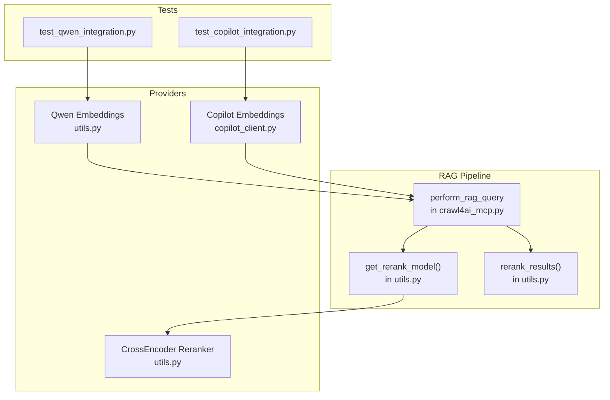
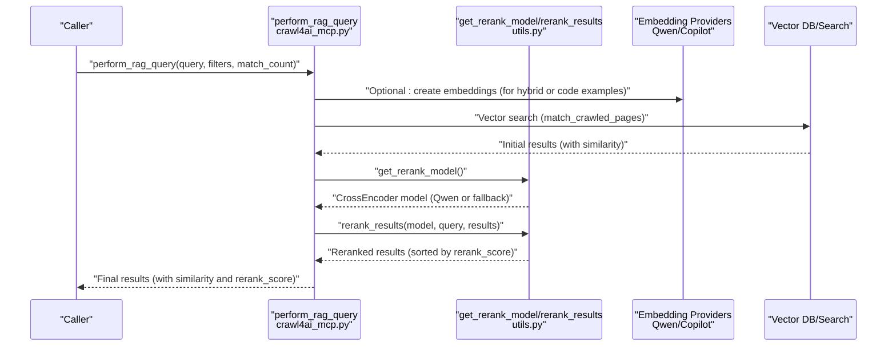
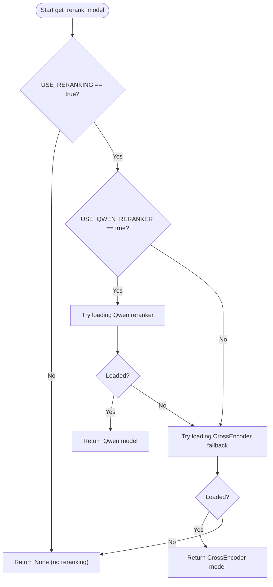
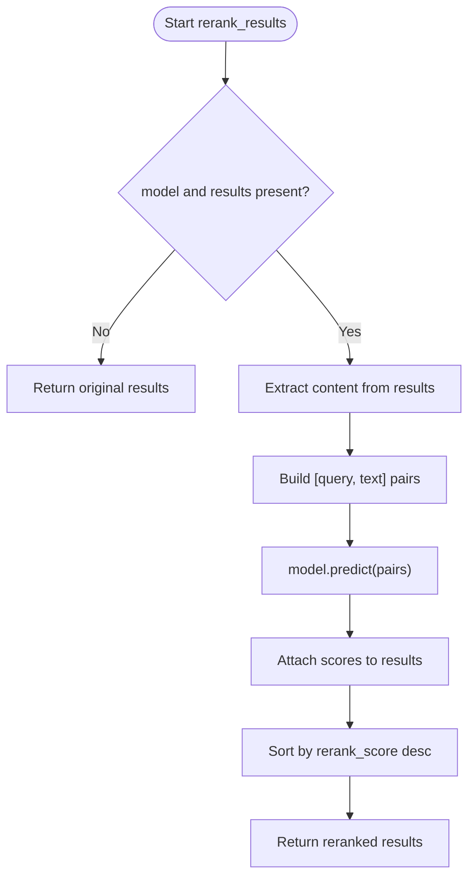
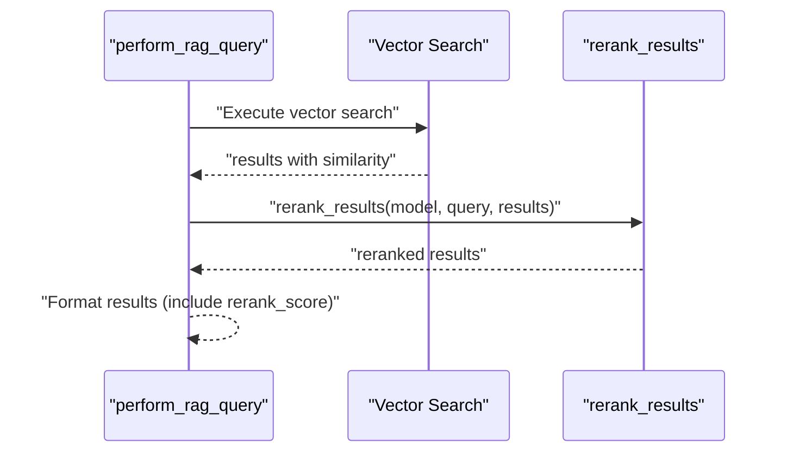
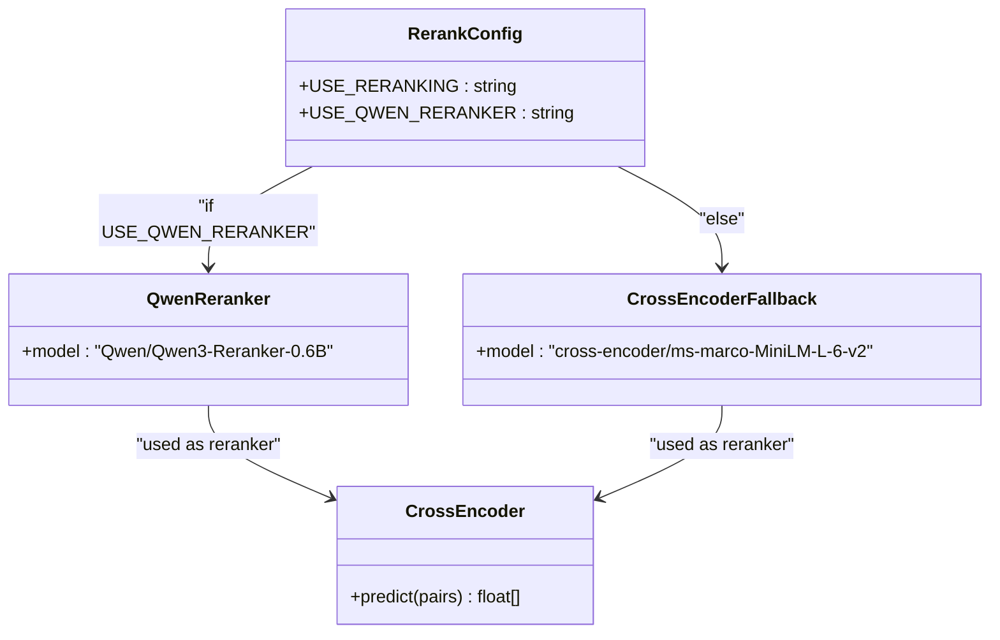
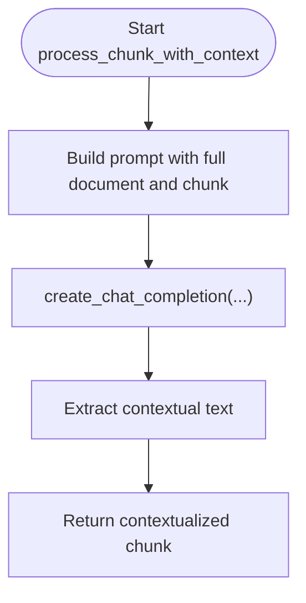
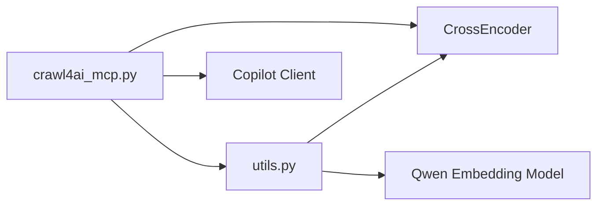

# Reranking

<cite>
**Referenced Files in This Document**
- [README.md](file://README.md)
- [src/utils.py](file://src/utils.py)
- [src/crawl4ai_mcp.py](file://src/crawl4ai_mcp.py)
- [tests/test_qwen_integration.py](file://tests/test_qwen_integration.py)
- [tests/test_copilot_integration.py](file://tests/test_copilot_integration.py)
- [src/copilot_client.py](file://src/copilot_client.py)
- [scripts/query_rag.py](file://scripts/query_rag.py)
</cite>

## Table of Contents
1. [Introduction](#introduction)
2. [Project Structure](#project-structure)
3. [Core Components](#core-components)
4. [Architecture Overview](#architecture-overview)
5. [Detailed Component Analysis](#detailed-component-analysis)
6. [Dependency Analysis](#dependency-analysis)
7. [Performance Considerations](#performance-considerations)
8. [Troubleshooting Guide](#troubleshooting-guide)
9. [Conclusion](#conclusion)
10. [Appendices](#appendices)

## Introduction
This document explains reranking strategies in the Retrieval-Augmented Generation (RAG) pipeline. It focuses on how initial search results are re-ordered based on relevance scoring, the implementation of reranking using different AI providers (Qwen and Copilot), the role of context analysis in improving ranking accuracy, the integration between the RAG query flow and reranking, configuration options for selecting reranking models and thresholds, and practical examples of performance improvements along with trade-offs between accuracy and latency.

## Project Structure
The reranking capability is implemented across several modules:
- Utilities for reranking and model selection
- The main RAG query controller that orchestrates search and reranking
- Provider integrations for embeddings and chat completions
- Tests validating Qwen and Copilot integration
- A CLI script for querying and inspecting results

**Diagram sources**
- [src/crawl4ai_mcp.py](file://src/crawl4ai_mcp.py#L1280-L1334)
- [src/utils.py](file://src/utils.py#L986-L1186)
- [src/copilot_client.py](file://src/copilot_client.py#L183-L385)
- [tests/test_qwen_integration.py](file://tests/test_qwen_integration.py#L1-L249)
- [tests/test_copilot_integration.py](file://tests/test_copilot_integration.py#L1-L263)

**Section sources**
- [src/crawl4ai_mcp.py](file://src/crawl4ai_mcp.py#L1280-L1334)
- [src/utils.py](file://src/utils.py#L986-L1186)
- [src/copilot_client.py](file://src/copilot_client.py#L183-L385)
- [tests/test_qwen_integration.py](file://tests/test_qwen_integration.py#L1-L249)
- [tests/test_copilot_integration.py](file://tests/test_copilot_integration.py#L1-L263)

## Core Components
- Reranking model selection and loading:
  - The system conditionally loads a Qwen reranker or falls back to a CrossEncoder model based on environment configuration.
- Reranking scoring and sorting:
  - For each candidate result, the system constructs query-document pairs and computes relevance scores, then sorts results by rerank score.
- Integration with the RAG query flow:
  - The RAG controller performs vector search, optionally applies hybrid combination, and then reranks results if enabled.

Key responsibilities:
- Environment-driven model selection
- Cross-encoder scoring pipeline
- Integration with vector search and hybrid search
- Output formatting with rerank scores

**Section sources**
- [src/utils.py](file://src/utils.py#L986-L1186)
- [src/crawl4ai_mcp.py](file://src/crawl4ai_mcp.py#L1280-L1334)

## Architecture Overview
The reranking architecture integrates with the RAG query controller and provider embeddings. The flow is:

**Diagram sources**
- [src/crawl4ai_mcp.py](file://src/crawl4ai_mcp.py#L1280-L1334)
- [src/utils.py](file://src/utils.py#L986-L1186)

## Detailed Component Analysis

### Reranking Model Selection and Loading
- Environment flags:
  - USE_RERANKING enables reranking globally.
  - USE_QWEN_RERANKER selects the Qwen reranker; otherwise a CrossEncoder model is used.
- Model loading:
  - Qwen reranker: Qwen/Qwen3-Reranker-0.6B
  - Fallback: cross-encoder/ms-marco-MiniLM-L-6-v2
- Error handling:
  - On failure to load Qwen, the system logs and attempts the fallback CrossEncoder model. If both fail, reranking is disabled.

**Diagram sources**
- [src/utils.py](file://src/utils.py#L986-L1015)

**Section sources**
- [src/utils.py](file://src/utils.py#L986-L1015)

### Reranking Scoring and Sorting
- Input:
  - A CrossEncoder model, a query string, and a list of results (each with content).
- Processing:
  - Extract content from each result.
  - Build query-document pairs.
  - Predict relevance scores.
  - Attach scores to results and sort descending by score.
- Output:
  - A reranked list of results with a new field for rerank_score.

**Diagram sources**
- [src/utils.py](file://src/utils.py#L1150-L1186)

**Section sources**
- [src/utils.py](file://src/utils.py#L1150-L1186)

### Integration Between perform_rag_query and Reranking
- The RAG controller performs vector search and prints initial counts.
- If reranking is enabled and a model is loaded, it reranks results and logs top scores.
- Results are formatted to include similarity and rerank_score when available.

**Diagram sources**
- [src/crawl4ai_mcp.py](file://src/crawl4ai_mcp.py#L1280-L1334)
- [src/utils.py](file://src/utils.py#L1150-L1186)

**Section sources**
- [src/crawl4ai_mcp.py](file://src/crawl4ai_mcp.py#L1280-L1334)

### Implementation Using Different AI Providers
- Qwen reranker:
  - Selected via USE_QWEN_RERANKER and loaded as a CrossEncoder model.
  - Tests validate Qwen embeddings and precedence over other providers.
- Copilot embeddings:
  - Used for vector search and code example retrieval; not directly used for reranking.
  - Tests validate Copilot embedding creation and chat completion.

**Diagram sources**
- [src/utils.py](file://src/utils.py#L986-L1015)

**Section sources**
- [tests/test_qwen_integration.py](file://tests/test_qwen_integration.py#L1-L249)
- [tests/test_copilot_integration.py](file://tests/test_copilot_integration.py#L1-L263)
- [src/copilot_client.py](file://src/copilot_client.py#L183-L385)

### Role of Context Analysis in Ranking Accuracy
- Contextual embedding generation:
  - The system can generate contextual information for a chunk within a document to improve retrieval.
  - This is achieved by prompting a chat completion API with the full document and the target chunk, then extracting a succinct context.
- Impact:
  - Enhances retrieval quality by situating chunks within broader document context, which can improve downstream reranking effectiveness.

**Diagram sources**
- [src/utils.py](file://src/utils.py#L319-L355)

**Section sources**
- [src/utils.py](file://src/utils.py#L319-L355)

### Configuration Options for Selecting Reranking Models and Thresholds
- Environment flags:
  - USE_RERANKING: Enable or disable reranking globally.
  - USE_QWEN_RERANKER: Choose Qwen reranker; otherwise fallback CrossEncoder is used.
- Practical guidance:
  - Enable USE_RERANKING for improved result ordering.
  - Prefer USE_QWEN_RERANKER for higher-quality reranking when models are available.
- Thresholds:
  - There is no explicit threshold configuration in the codebase. Reranking currently sorts by predicted scores without applying a cutoff.

**Section sources**
- [src/utils.py](file://src/utils.py#L986-L1015)
- [README.md](file://README.md#L767-L773)

### Examples Showing Performance Improvements and Trade-offs
- Performance improvement example:
  - The RAG controller logs top rerank scores alongside similarity scores, demonstrating that reranking can reorder results to prioritize higher-scoring matches.
- Trade-offs:
  - Accuracy vs. latency: Cross-encoder reranking adds compute time proportional to the number of results. Qwen reranker may offer better accuracy but can increase latency depending on model size and hardware.
  - Provider choice impacts cost and availability (e.g., Copilot and DashScope).

**Section sources**
- [src/crawl4ai_mcp.py](file://src/crawl4ai_mcp.py#L1298-L1312)
- [src/utils.py](file://src/utils.py#L1150-L1186)

## Dependency Analysis
- Coupling:
  - The RAG controller depends on reranking utilities for model loading and scoring.
  - Embedding providers (Qwen and Copilot) are used for vector search and code examples; they are not directly coupled to reranking.
- Cohesion:
  - Reranking logic is cohesive within utils.py, encapsulating model selection and scoring.
- External dependencies:
  - sentence_transformers CrossEncoder for reranking.
  - Optional Qwen embedding model for embeddings.
  - Optional Copilot client for embeddings and chat.

**Diagram sources**
- [src/crawl4ai_mcp.py](file://src/crawl4ai_mcp.py#L1280-L1334)
- [src/utils.py](file://src/utils.py#L986-L1186)
- [src/copilot_client.py](file://src/copilot_client.py#L183-L385)

**Section sources**
- [src/crawl4ai_mcp.py](file://src/crawl4ai_mcp.py#L1280-L1334)
- [src/utils.py](file://src/utils.py#L986-L1186)
- [src/copilot_client.py](file://src/copilot_client.py#L183-L385)

## Performance Considerations
- Reranking cost:
  - Cross-encoder scoring scales linearly with the number of results. Larger match_count increases latency.
- Model selection:
  - Qwen reranker may improve accuracy but can be heavier; CrossEncoder fallback is lighter.
- Provider throughput:
  - Embedding providers (Qwen, Copilot) have rate limits and retries; plan match_count and batching accordingly.
- Hybrid search:
  - Combining vector and keyword results can increase total candidates; reranking then operates over the combined set.

[No sources needed since this section provides general guidance]

## Troubleshooting Guide
- Reranking not applied:
  - Ensure USE_RERANKING is enabled and a model is successfully loaded.
  - If USE_QWEN_RERANKER is enabled but model fails to load, the system falls back to CrossEncoder.
- Poor relevance:
  - Enable USE_RERANKING and consider USE_QWEN_RERANKER for better accuracy.
- Provider issues:
  - For Copilot, ensure GITHUB_TOKEN is set and rate limits are configured.
  - For Qwen embeddings, confirm model availability and device configuration.

**Section sources**
- [src/utils.py](file://src/utils.py#L986-L1015)
- [tests/test_copilot_integration.py](file://tests/test_copilot_integration.py#L1-L263)
- [README.md](file://README.md#L767-L773)

## Conclusion
Reranking in this RAG pipeline improves result ordering by scoring query-document pairs with a cross-encoder model. The system supports Qwen reranker selection with a robust fallback, integrates cleanly into the RAG query flow, and benefits from context-aware chunking to enhance retrieval quality. While reranking improves accuracy, it introduces additional latency; careful configuration of environment flags and provider settings can balance quality and performance.

[No sources needed since this section summarizes without analyzing specific files]

## Appendices

### How to Inspect Rerank Scores
- Use the CLI script to query and display rerank scores alongside similarity:
  - The script prints rerank_score when available, helping compare pre- and post-reranking ordering.

**Section sources**
- [scripts/query_rag.py](file://scripts/query_rag.py#L186-L211)