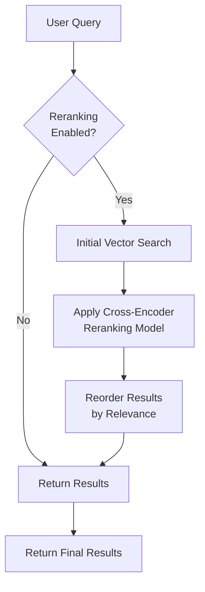
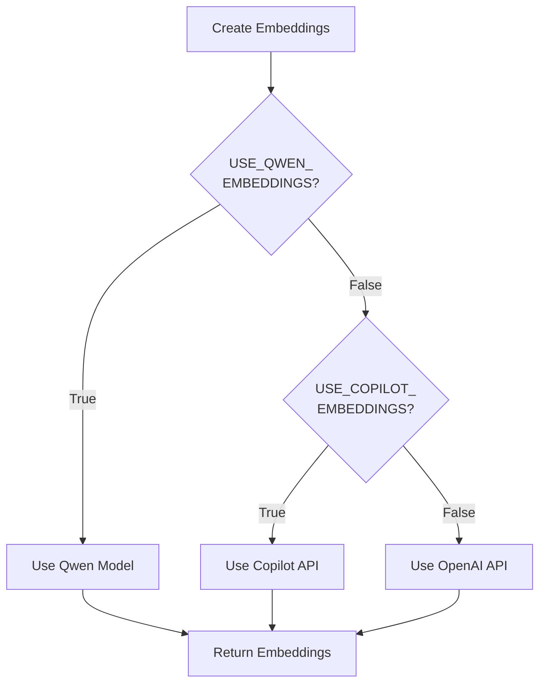
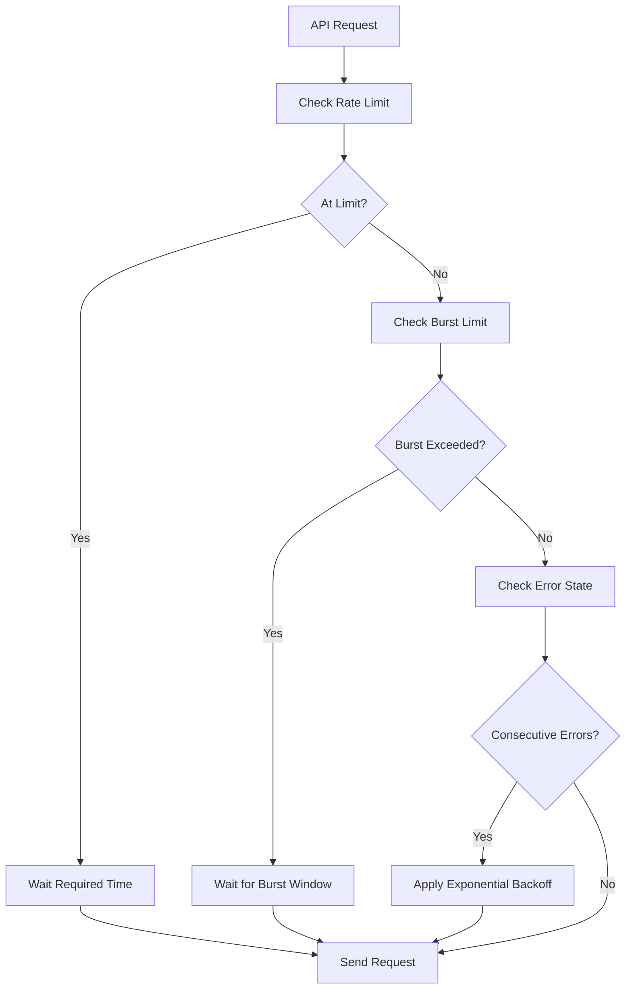

# Configuration

<cite>
**Referenced Files in This Document**   
- [mcp.json](file://mcp.json)
- [pyproject.toml](file://pyproject.toml)
- [src/utils.py](file://src/utils.py)
- [src/crawl4ai_mcp.py](file://src/crawl4ai_mcp.py)
- [src/user_manual_chunker/config.py](file://src/user_manual_chunker/config.py)
- [README.md](file://README.md)
- [tests/test_mcp_server.py](file://tests/test_mcp_server.py)
</cite>

## Table of Contents
1. [Introduction](#introduction)
2. [Environment Variables](#environment-variables)
3. [Configuration File Structure](#configuration-file-structure)
4. [RAG Strategies Configuration](#rag-strategies-configuration)
5. [Embedding Models and Providers](#embedding-models-and-providers)
6. [Knowledge Graph Validation](#knowledge-graph-validation)
7. [Rate Limiting Settings](#rate-limiting-settings)
8. [Configuration Profiles](#configuration-profiles)
9. [Security and Credential Management](#security-and-credential-management)
10. [Dynamic Reconfiguration](#dynamic-reconfiguration)

## Introduction
This document provides comprehensive guidance on configuration management for the Crawl4AI RAG MCP server. It covers all environment variables, configuration files, and settings required to customize the system for different deployment scenarios. The documentation details the structure and purpose of key configuration elements, including the mcp.json file, RAG strategies, embedding models, and knowledge graph validation. It also provides examples of configuration profiles for various environments and guidance on securing sensitive credentials.

**Section sources**
- [README.md](file://README.md#L204-L449)

## Environment Variables
The system uses environment variables as the primary configuration mechanism, allowing for flexible deployment across different environments. Key environment variables include:

- **SUPABASE_URL**: The URL of the Supabase project for vector storage
- **SUPABASE_SERVICE_KEY**: The service key for Supabase authentication
- **NEO4J_URI**: The connection URI for the Neo4j knowledge graph database
- **EMBEDDING_PROVIDER**: Specifies the embedding provider (OpenAI, Copilot, or Qwen)
- **USE_RERANKING**: Enables or disables cross-encoder reranking of search results
- **USE_HYBRID_SEARCH**: Controls whether to use hybrid search combining vector and keyword search
- **USE_KNOWLEDGE_GRAPH**: Enables or disables knowledge graph functionality
- **GITHUB_TOKEN**: Authentication token for GitHub Copilot services
- **OPENAI_API_KEY**: API key for OpenAI services
- **MODEL_CHOICE**: Specifies the LLM model to use for summaries and contextual embeddings

These variables are typically defined in a `.env` file in the project root directory and loaded at application startup.

**Section sources**
- [README.md](file://README.md#L204-L242)
- [src/utils.py](file://src/utils.py#L113-L117)
- [tests/test_mcp_server.py](file://tests/test_mcp_server.py#L85-L98)

## Configuration File Structure
The configuration system consists of multiple files that work together to define the application's behavior. The primary configuration files are mcp.json and various environment-based settings.

### mcp.json Structure
The mcp.json file defines the MCP server configuration with the following structure:

```json
{
  "mcpServers": {
    "crawl4ai-rag": {
      "transport": "sse",
      "url": "http://localhost:8051/sse"
    }
  }
}
```

This configuration specifies:
- **mcpServers**: Object containing server definitions
- **crawl4ai-rag**: Named server instance
- **transport**: Communication protocol (SSE for Server-Sent Events)
- **url**: Endpoint URL for the MCP server

The mcp.json file serves as the entry point configuration that defines how external systems connect to the MCP server.

**Diagram sources**
- [mcp.json](file://mcp.json#L1-L8)

**Section sources**
- [mcp.json](file://mcp.json#L1-L8)

## RAG Strategies Configuration
The system supports multiple RAG (Retrieval-Augmented Generation) strategies that can be configured through environment variables to optimize search performance and relevance.

### Hybrid Search
Hybrid search combines vector similarity search with keyword-based search to improve result quality. When enabled via `USE_HYBRID_SEARCH=true`, the system:

1. Performs vector search to find semantically similar content
2. Conducts keyword search to find exact term matches
3. Combines results with preference for items appearing in both searches
4. Boosts similarity scores for items found in both result sets

This approach leverages the strengths of both search methods, providing better coverage and precision than either method alone.

### Reranking
Reranking applies a cross-encoder model to re-score search results based on their relevance to the original query. When `USE_RERANKING=true`, the system:

1. Retrieves initial results using vector search
2. Uses a cross-encoder model to score each result against the query
3. Reorders results by the reranking score
4. Returns the re-ranked results to the client

The system supports multiple reranking models, with fallback options if the preferred model fails to load.



**Diagram sources**
- [src/crawl4ai_mcp.py](file://src/crawl4ai_mcp.py#L1305-L1334)
- [src/utils.py](file://src/utils.py#L1022-L1048)

**Section sources**
- [src/crawl4ai_mcp.py](file://src/crawl4ai_mcp.py#L1305-L1334)
- [src/utils.py](file://src/utils.py#L1022-L1048)
- [README.md](file://README.md#L344-L350)

## Embedding Models and Providers
The system supports multiple embedding providers, allowing users to choose based on cost, performance, and subscription preferences.

### Available Providers
The system supports three embedding providers:

1. **Qwen**: Local embedding model (Qwen/Qwen3-Embedding-0.6B) that runs on CPU
2. **GitHub Copilot**: Cloud-based embeddings using the text-embedding-3-small model
3. **OpenAI**: Cloud-based embeddings using the text-embedding-3-small model

The provider is selected through environment variables, with a fallback chain that tries providers in order of preference.

### Configuration Options
Embedding configuration is controlled by the following environment variables:

- **USE_QWEN_EMBEDDINGS**: Enables the local Qwen embedding model
- **USE_COPILOT_EMBEDDINGS**: Enables GitHub Copilot embeddings
- **OPENAI_API_KEY**: Required when using OpenAI embeddings
- **GITHUB_TOKEN**: Required when using Copilot embeddings

The system implements a fallback mechanism: it first attempts to use Qwen embeddings, then falls back to Copilot, and finally uses OpenAI as the default option.



**Diagram sources**
- [src/utils.py](file://src/utils.py#L136-L158)
- [src/utils.py](file://src/utils.py#L66-L91)

**Section sources**
- [src/utils.py](file://src/utils.py#L136-L158)
- [README.md](file://README.md#L248-L265)

## Knowledge Graph Validation
The system includes knowledge graph validation capabilities that verify code against a knowledge graph stored in Neo4j.

### Configuration
Knowledge graph functionality is controlled by the following environment variables:

- **USE_KNOWLEDGE_GRAPH**: Enables or disables knowledge graph features
- **NEO4J_URI**: Connection URI for the Neo4j database
- **NEO4J_USER**: Username for Neo4j authentication
- **NEO4J_PASSWORD**: Password for Neo4j authentication

When `USE_KNOWLEDGE_GRAPH=true`, the system initializes connections to Neo4j and enables validation features that can detect hallucinations in code.

### Validation Process
The knowledge graph validator performs the following checks:

1. Validates import statements against known libraries in the knowledge graph
2. Checks class instantiations for valid constructors
3. Verifies method calls against known method signatures
4. Validates attribute accesses on known classes
5. Reports hallucinations with confidence scores and suggestions

The validation process helps ensure that generated code is accurate and based on real libraries and APIs.

**Section sources**
- [src/crawl4ai_mcp.py](file://src/crawl4ai_mcp.py#L190-L198)
- [tests/test_mcp_server.py](file://tests/test_mcp_server.py#L99-L109)
- [knowledge_graphs/knowledge_graph_validator.py](file://knowledge_graphs/knowledge_graph_validator.py#L391-L425)

## Rate Limiting Settings
The system implements comprehensive rate limiting to ensure stable operation and prevent API overuse.

### Configuration Variables
Rate limiting is configured through the following environment variables:

- **COPILOT_REQUESTS_PER_MINUTE**: Maximum requests per minute for Copilot API
- **DASHSCOPE_REQUESTS_PER_MINUTE**: Maximum requests per minute for DashScope API
- **DASHSCOPE_BURST_LIMIT**: Maximum requests per 10 seconds (burst protection)

### Rate Limiting Features
The rate limiting system includes multiple layers of protection:

1. **Requests per minute**: Configurable limit on average request rate
2. **Burst protection**: Limits on rapid successive requests (max 10 per 10 seconds)
3. **Exponential backoff**: Progressive delays on consecutive errors
4. **Error handling**: Special handling for rate limit (429) and server (5xx) errors

The system automatically handles rate limiting by pausing requests when limits are approached, ensuring compliance with API usage policies.



**Diagram sources**
- [src/iflow_client.py](file://src/iflow_client.py#L39-L63)
- [src/copilot_client.py](file://src/copilot_client.py#L42-L70)

**Section sources**
- [src/iflow_client.py](file://src/iflow_client.py#L39-L63)
- [src/copilot_client.py](file://src/copilot_client.py#L42-L70)
- [README.md](file://README.md#L298-L316)

## Configuration Profiles
The system supports different configuration profiles for development, testing, and production environments.

### Development Profile
```env
# Development configuration
HOST=0.0.0.0
PORT=8051
TRANSPORT=sse

# Use local Qwen embeddings for development
USE_QWEN_EMBEDDINGS=true
USE_COPILOT_EMBEDDINGS=false
USE_COPILOT_CHAT=false

# Enable RAG features for testing
USE_HYBRID_SEARCH=true
USE_RERANKING=true

# Disable knowledge graph for faster startup
USE_KNOWLEDGE_GRAPH=false

# Development database
SUPABASE_URL=http://localhost:5432
SUPABASE_SERVICE_KEY=dev-key-123
```

### Testing Profile
```env
# Testing configuration
HOST=localhost
PORT=8051
TRANSPORT=sse

# Use Copilot for consistent test results
USE_QWEN_EMBEDDINGS=false
USE_COPILOT_EMBEDDINGS=true
USE_COPILOT_CHAT=true
GITHUB_TOKEN=${GITHUB_TOKEN}

# Enable all RAG features
USE_HYBRID_SEARCH=true
USE_RERANKING=true
USE_AGENTIC_RAG=true

# Enable knowledge graph validation
USE_KNOWLEDGE_GRAPH=true
NEO4J_URI=bolt://localhost:7687
NEO4J_USER=neo4j
NEO4J_PASSWORD=test-password

# Test database
SUPABASE_URL=https://test.supabase.co
SUPABASE_SERVICE_KEY=test-key-456
```

### Production Profile
```env
# Production configuration
HOST=0.0.0.0
PORT=8051
TRANSPORT=sse

# Use Copilot for production (cost-effective with subscription)
USE_QWEN_EMBEDDINGS=false
USE_COPILOT_EMBEDDINGS=true
USE_COPILOT_CHAT=true
GITHUB_TOKEN=${GITHUB_TOKEN}

# Optimize RAG for production
USE_HYBRID_SEARCH=true
USE_RERANKING=true
USE_AGENTIC_RAG=true

# Enable knowledge graph for accuracy
USE_KNOWLEDGE_GRAPH=true
NEO4J_URI=${NEO4J_URI}
NEO4J_USER=${NEO4J_USER}
NEO4J_PASSWORD=${NEO4J_PASSWORD}

# Production database
SUPABASE_URL=${SUPABASE_URL}
SUPABASE_SERVICE_KEY=${SUPABASE_SERVICE_KEY}

# Rate limiting for production stability
COPILOT_REQUESTS_PER_MINUTE=60
DASHSCOPE_REQUESTS_PER_MINUTE=60
DASHSCOPE_BURST_LIMIT=10
```

**Section sources**
- [README.md](file://README.md#L204-L242)
- [pyproject.toml](file://pyproject.toml#L11-L25)

## Security and Credential Management
The system implements several security measures to protect sensitive credentials and ensure secure operation.

### Environment Variable Security
Sensitive credentials should never be hardcoded in configuration files. Instead, use the following practices:

1. Store credentials in environment variables
2. Use `.env` files that are excluded from version control
3. Use environment variable substitution in production
4. Never commit credentials to source code repositories

### Credential Protection
The system protects credentials through:

- Environment variable isolation
- Secure loading via python-dotenv
- Masking in logs and output
- Validation of required credentials at startup

During testing and diagnostics, sensitive values are masked with asterisks to prevent accidental exposure.

### Best Practices
1. Use different credentials for development, testing, and production
2. Rotate credentials regularly
3. Use the principle of least privilege for API keys
4. Monitor API usage for unusual patterns
5. Store production credentials in secure secret management systems

**Section sources**
- [README.md](file://README.md#L159-L168)
- [tests/run_all_tests.py](file://tests/run_all_tests.py#L162-L164)

## Dynamic Reconfiguration
The system has limitations regarding dynamic reconfiguration, requiring restarts for most configuration changes.

### Static Configuration
Most configuration settings are loaded at application startup and cannot be changed without restarting the server:

- Environment variables
- MCP server transport and URL
- Database connection settings
- AI provider selections
- RAG strategy settings

### Runtime Configuration
Some settings can be adjusted at runtime through API parameters:

- Search query parameters
- Crawl depth and scope
- Result limits and offsets
- Specific tool configurations

However, core system configuration requires a server restart to take effect, ensuring stability and preventing configuration conflicts during operation.

**Section sources**
- [src/crawl4ai_mcp.py](file://src/crawl4ai_mcp.py#L56-L60)
- [README.md](file://README.md#L425-L449)