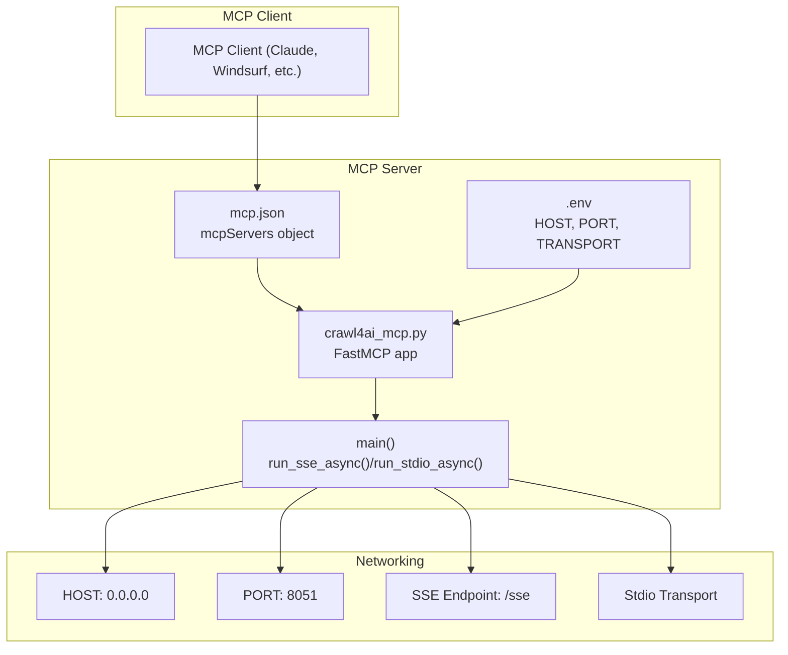
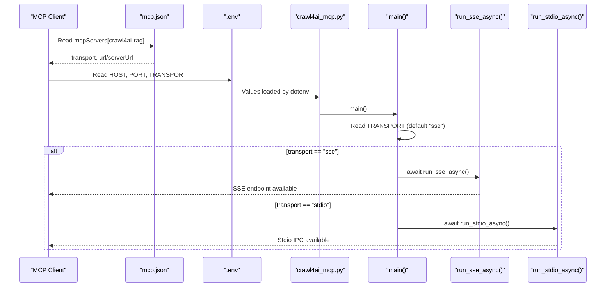
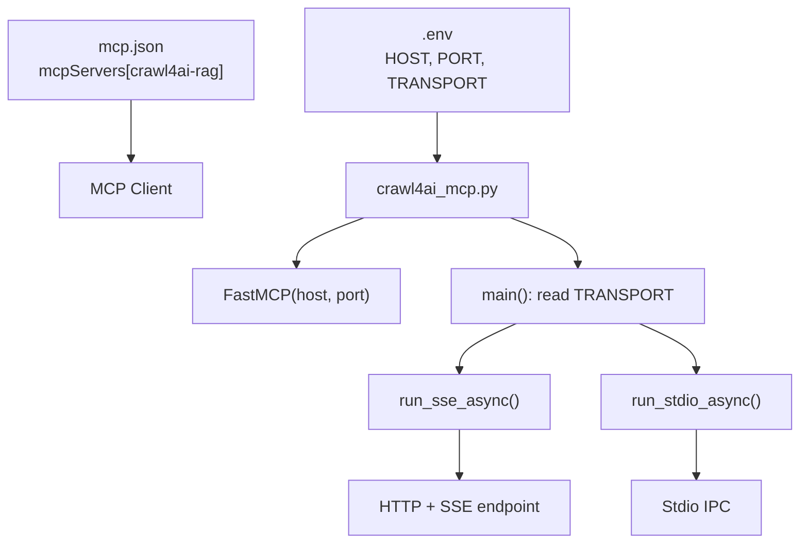
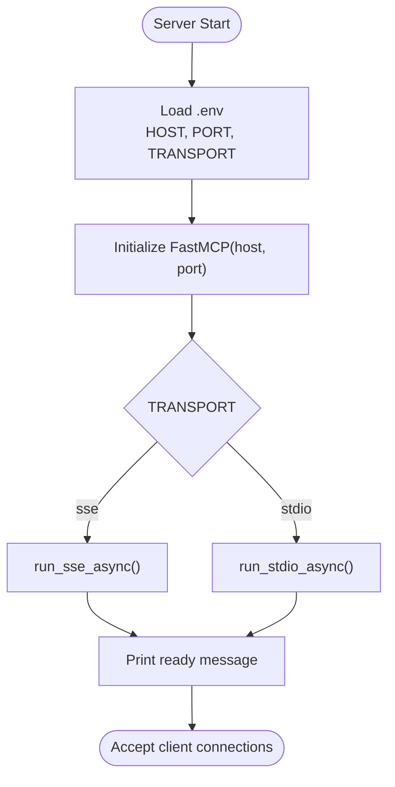
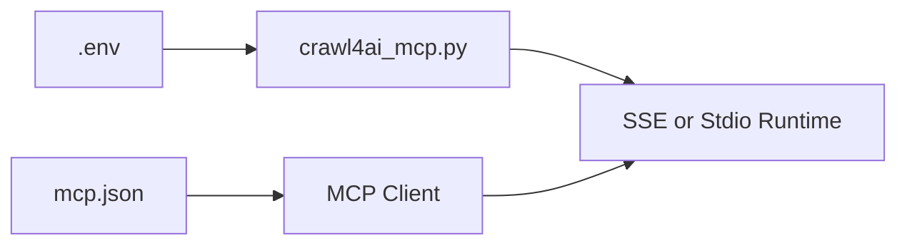

# MCP Server Configuration (mcp.json)

<cite>
**Referenced Files in This Document**
- [mcp.json](file://mcp.json)
- [crawl4ai_mcp.py](file://src/crawl4ai_mcp.py)
- [README.md](file://README.md)
- [Dockerfile](file://Dockerfile)
- [test_mcp_server.py](file://tests/test_mcp_server.py)
</cite>

## Table of Contents
1. [Introduction](#introduction)
2. [Project Structure](#project-structure)
3. [Core Components](#core-components)
4. [Architecture Overview](#architecture-overview)
5. [Detailed Component Analysis](#detailed-component-analysis)
6. [Dependency Analysis](#dependency-analysis)
7. [Performance Considerations](#performance-considerations)
8. [Troubleshooting Guide](#troubleshooting-guide)
9. [Conclusion](#conclusion)

## Introduction
This document explains how to configure and operate the MCP server for this project using mcp.json. It focuses on:
- The structure and semantics of the mcpServers object
- Transport options (sse and stdio) and their impact on client connectivity
- How the TRANSPORT environment variable controls server startup
- Practical examples for local development and Docker deployments
- Guidance for URL formatting in containerized environments
- Troubleshooting common connection issues

## Project Structure
At a high level, the MCP server is implemented as a FastMCP application that listens on HOST and PORT, and exposes either SSE or stdio transports. The mcp.json file defines the MCP client’s server endpoint for connecting to this server.

**Diagram sources**
- [mcp.json](file://mcp.json#L1-L8)
- [crawl4ai_mcp.py](file://src/crawl4ai_mcp.py#L295-L300)
- [crawl4ai_mcp.py](file://src/crawl4ai_mcp.py#L2280-L2289)
- [README.md](file://README.md#L204-L213)

**Section sources**
- [mcp.json](file://mcp.json#L1-L8)
- [crawl4ai_mcp.py](file://src/crawl4ai_mcp.py#L295-L300)
- [README.md](file://README.md#L204-L213)

## Core Components
- mcpServers object: Defines one or more MCP servers that a client can connect to. Each entry specifies transport and URL (or command/args/env for stdio).
- Transport selection: Controlled by the TRANSPORT environment variable. The server starts with either SSE or stdio based on this value.
- Server binding: HOST and PORT are read from environment variables and passed to the FastMCP constructor.

Key behaviors:
- SSE transport: Exposes an HTTP endpoint for SSE-based connections.
- Stdio transport: Runs the server as a child process and communicates via stdin/stdout.
- URL formatting: For SSE, the URL must include the transport-specific path (e.g., /sse).

**Section sources**
- [mcp.json](file://mcp.json#L1-L8)
- [crawl4ai_mcp.py](file://src/crawl4ai_mcp.py#L2280-L2289)
- [README.md](file://README.md#L204-L213)

## Architecture Overview
The MCP server startup flow is driven by environment variables and the mcp.json configuration. The following sequence diagram maps the actual code paths:

**Diagram sources**
- [mcp.json](file://mcp.json#L1-L8)
- [crawl4ai_mcp.py](file://src/crawl4ai_mcp.py#L2280-L2289)
- [README.md](file://README.md#L204-L213)

## Detailed Component Analysis

### mcpServers Object Structure
The mcpServers object is a dictionary keyed by server alias (here, "crawl4ai-rag"). Each entry defines:
- transport: Either "sse" or "stdio".
- url or serverUrl: For SSE, the HTTP URL to connect to. Some clients use serverUrl instead of url.
- command, args, env: For stdio, the command to launch the server and environment variables to pass.

Practical notes:
- For SSE, the URL must include the transport path (e.g., "/sse").
- For stdio, the client launches the server process and communicates via stdio, passing environment variables as needed.

**Section sources**
- [mcp.json](file://mcp.json#L1-L8)
- [README.md](file://README.md#L535-L592)

### Transport Options: SSE vs Stdio
- SSE transport:
  - Starts an HTTP server bound to HOST:PORT and exposes an SSE endpoint.
  - Clients connect via HTTP using the configured URL.
  - Recommended for most desktop and external clients.

- Stdio transport:
  - Starts the server as a child process and communicates via stdin/stdout.
  - The client supplies command and env to launch the server.
  - Useful when the client can spawn a process locally.

Selection logic:
- The TRANSPORT environment variable determines which runner is invoked at startup.

**Section sources**
- [crawl4ai_mcp.py](file://src/crawl4ai_mcp.py#L2280-L2289)
- [README.md](file://README.md#L569-L592)

### Server Binding and Startup
- HOST and PORT are read from environment variables and passed to the FastMCP constructor.
- The server prints a readiness message after initialization completes.
- Clients must wait for this message before attempting to connect.

**Section sources**
- [crawl4ai_mcp.py](file://src/crawl4ai_mcp.py#L295-L300)
- [README.md](file://README.md#L425-L445)

### URL Formatting and Container Networking
- Local development: Use localhost and the configured PORT.
- Docker deployments: Use host.docker.internal for URLs when the client runs in a different container or host network.
- SSE URL must include the transport path (/sse).

**Section sources**
- [README.md](file://README.md#L535-L568)
- [Dockerfile](file://Dockerfile#L1-L22)

### Configuration Integration with TRANSPORT and Startup
- The server reads TRANSPORT from environment variables and selects the appropriate runner.
- The mcp.json transport and url define how the client connects to the server.
- For stdio, the client supplies command and env to the MCP client runtime.

**Section sources**
- [crawl4ai_mcp.py](file://src/crawl4ai_mcp.py#L2280-L2289)
- [README.md](file://README.md#L569-L592)

## Architecture Overview
The following diagram shows how mcp.json, environment variables, and the server code integrate:

**Diagram sources**
- [mcp.json](file://mcp.json#L1-L8)
- [crawl4ai_mcp.py](file://src/crawl4ai_mcp.py#L295-L300)
- [crawl4ai_mcp.py](file://src/crawl4ai_mcp.py#L2280-L2289)

## Detailed Component Analysis

### SSE Configuration Example
- Define transport as "sse" and url as "http://localhost:8051/sse" in mcp.json.
- For Docker, replace localhost with host.docker.internal in the client configuration.

**Section sources**
- [mcp.json](file://mcp.json#L1-L8)
- [README.md](file://README.md#L535-L568)

### Stdio Configuration Example
- Define command and args to launch the server, and pass env variables including TRANSPORT.
- The client will spawn the process and communicate via stdio.

**Section sources**
- [README.md](file://README.md#L569-L592)

### Docker Deployment Notes
- The Dockerfile exposes the configured PORT and runs the server entrypoint.
- When connecting from another container, use host.docker.internal for URLs in the client configuration.

**Section sources**
- [Dockerfile](file://Dockerfile#L1-L22)
- [README.md](file://README.md#L562-L568)

### Server Startup Flow

**Diagram sources**
- [crawl4ai_mcp.py](file://src/crawl4ai_mcp.py#L295-L300)
- [crawl4ai_mcp.py](file://src/crawl4ai_mcp.py#L2280-L2289)
- [README.md](file://README.md#L425-L445)

## Dependency Analysis
- The server depends on environment variables for configuration.
- The client depends on mcp.json to discover the server endpoint and transport.
- The transport selection is centralized in main() and controlled by TRANSPORT.

**Diagram sources**
- [crawl4ai_mcp.py](file://src/crawl4ai_mcp.py#L2280-L2289)
- [mcp.json](file://mcp.json#L1-L8)

**Section sources**
- [crawl4ai_mcp.py](file://src/crawl4ai_mcp.py#L2280-L2289)
- [mcp.json](file://mcp.json#L1-L8)

## Performance Considerations
- SSE transport is generally recommended for desktop and external clients.
- Startup includes model downloads and initialization; wait for the ready message before connecting.
- Disable unused features to reduce startup time.

[No sources needed since this section provides general guidance]

## Troubleshooting Guide
Common issues and resolutions:
- Client cannot connect immediately:
  - Wait for the server ready message before connecting.
- Wrong transport:
  - Ensure TRANSPORT matches the client configuration (sse vs stdio).
- Incorrect URL:
  - For SSE, include the transport path (/sse) in the URL.
  - For Docker, use host.docker.internal instead of localhost.
- Stdio not working:
  - Verify command and env are correctly supplied in mcp.json.
- Startup hangs or slow:
  - Allow time for model downloads and initialization.

**Section sources**
- [README.md](file://README.md#L425-L445)
- [README.md](file://README.md#L535-L592)
- [test_mcp_server.py](file://tests/test_mcp_server.py#L59-L78)

## Conclusion
The MCP server configuration hinges on three pillars:
- mcp.json defines how the client discovers and connects to the server.
- .env controls server binding and transport selection.
- The server startup logic enforces the selected transport and exposes the appropriate endpoint.

By aligning these elements—mcp.json transport/url, TRANSPORT, HOST, PORT—you can reliably connect MCP clients in both local and containerized environments.