# Core Features and Tools

<cite>
**Referenced Files in This Document**
- [README.md](file://README.md)
- [mcp.json](file://mcp.json)
- [src/crawl4ai_mcp.py](file://src/crawl4ai_mcp.py)
- [src/utils.py](file://src/utils.py)
- [scripts/query_rag.py](file://scripts/query_rag.py)
- [scripts/crawl_pipeline.py](file://scripts/crawl_pipeline.py)
- [knowledge_graphs/query_knowledge_graph.py](file://knowledge_graphs/query_knowledge_graph.py)
</cite>

## Table of Contents
1. [Introduction](#introduction)
2. [Project Structure](#project-structure)
3. [Core Components](#core-components)
4. [Architecture Overview](#architecture-overview)
5. [Detailed Component Analysis](#detailed-component-analysis)
6. [Dependency Analysis](#dependency-analysis)
7. [Performance Considerations](#performance-considerations)
8. [Troubleshooting Guide](#troubleshooting-guide)
9. [Conclusion](#conclusion)
10. [Appendices](#appendices)

## Introduction
This document explains the core features and tools provided by the Crawl4AI RAG MCP Server. It covers how the MCP server exposes tools to AI agents, the tool registration mechanism, and the end-to-end data flow from crawling to indexing to querying. It also details the primary tools (URL type detection, recursive crawling with parallel processing, semantic search with hybrid retrieval, and source management), conditional tools (search_code_examples), and practical usage patterns.

## Project Structure
The repository organizes the MCP server implementation, utilities, scripts, and knowledge graph components as follows:
- MCP server and tool definitions: src/crawl4ai_mcp.py
- Shared utilities for embeddings, search, chunking, and database operations: src/utils.py
- Scripts for pipeline orchestration and testing queries: scripts/*
- Knowledge graph tools and CLI: knowledge_graphs/*

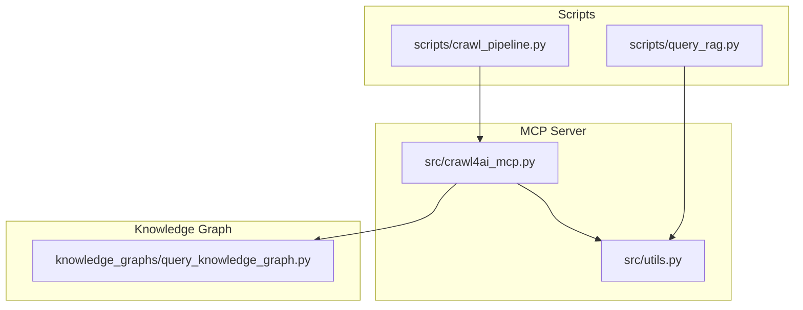

**Diagram sources**
- [src/crawl4ai_mcp.py](file://src/crawl4ai_mcp.py#L1-L120)
- [src/utils.py](file://src/utils.py#L1-L120)
- [scripts/crawl_pipeline.py](file://scripts/crawl_pipeline.py#L1-L120)
- [scripts/query_rag.py](file://scripts/query_rag.py#L1-L60)
- [knowledge_graphs/query_knowledge_graph.py](file://knowledge_graphs/query_knowledge_graph.py#L1-L60)

**Section sources**
- [README.md](file://README.md#L40-L70)
- [src/crawl4ai_mcp.py](file://src/crawl4ai_mcp.py#L1-L120)
- [src/utils.py](file://src/utils.py#L1-L120)
- [scripts/crawl_pipeline.py](file://scripts/crawl_pipeline.py#L1-L120)
- [scripts/query_rag.py](file://scripts/query_rag.py#L1-L60)
- [knowledge_graphs/query_knowledge_graph.py](file://knowledge_graphs/query_knowledge_graph.py#L1-L60)

## Core Components
- MCP server lifecycle and tool registration: The server initializes the crawler, Supabase client, optional reranking model, and knowledge graph components. Tools are registered using the @mcp.tool() decorator and live within the server’s lifespan.
- Utility functions: Provide embedding generation, vector search, code example extraction and summarization, source management, and hybrid search combination.
- Scripts: Offer pipeline orchestration and CLI-based querying for testing and validation.

Key responsibilities:
- Tool registration: Tools are decorated with @mcp.tool() and bound to the server via FastMCP.
- Data persistence: Documents and code examples are inserted into Supabase with retry logic and metadata.
- Search: Vector similarity search with optional hybrid keyword search and reranking.

**Section sources**
- [src/crawl4ai_mcp.py](file://src/crawl4ai_mcp.py#L120-L220)
- [src/utils.py](file://src/utils.py#L120-L220)
- [scripts/query_rag.py](file://scripts/query_rag.py#L1-L60)

## Architecture Overview
The MCP server exposes tools that agents can invoke. Internally, tools coordinate with Crawl4AI for web crawling, utilities for chunking and embeddings, Supabase for vector storage and retrieval, and optional knowledge graph components.

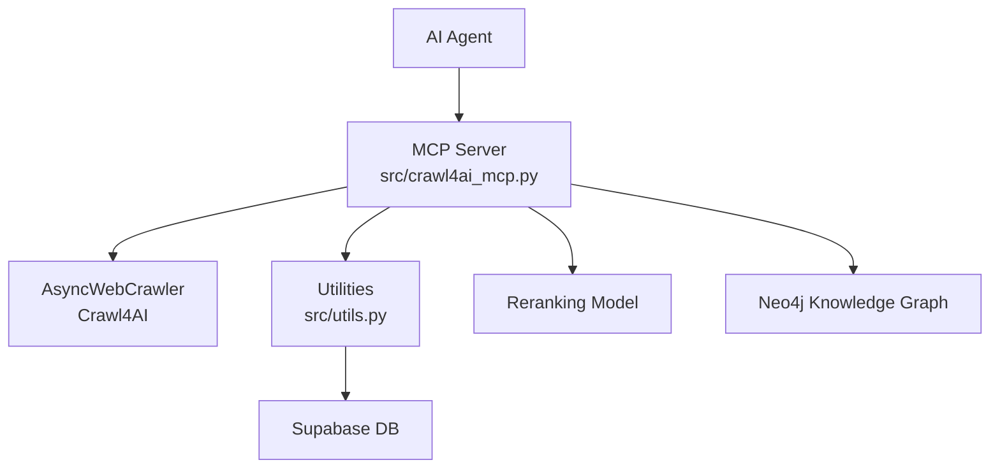

**Diagram sources**
- [src/crawl4ai_mcp.py](file://src/crawl4ai_mcp.py#L120-L220)
- [src/utils.py](file://src/utils.py#L120-L220)

## Detailed Component Analysis

### Tool Registration Mechanism in MCP
- The server defines a lifespan manager that initializes the crawler, Supabase client, optional reranking model, and knowledge graph components. Tools are declared with @mcp.tool() and become available to clients.
- The server uses FastMCP with a lifespan to manage resources and ensure proper cleanup.

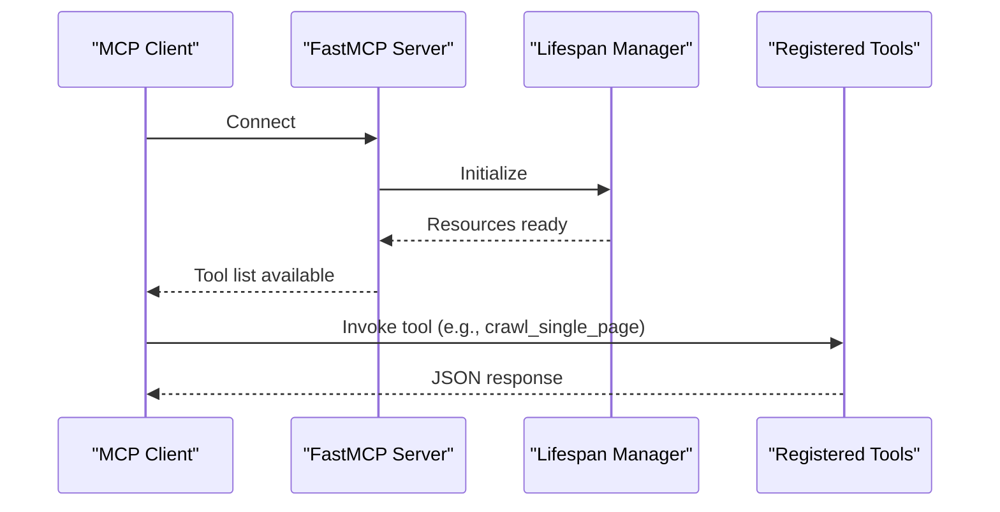

**Diagram sources**
- [src/crawl4ai_mcp.py](file://src/crawl4ai_mcp.py#L120-L220)

**Section sources**
- [src/crawl4ai_mcp.py](file://src/crawl4ai_mcp.py#L120-L220)

### URL Type Detection and Smart Crawling
- The smart_crawl_url tool detects URL types and selects the appropriate strategy:
  - Sitemap: Extract URLs and crawl in parallel.
  - Text file: Directly retrieve content.
  - Regular webpage: Recursively crawl internal links up to a depth with parallel processing.
- It supports a disable_javascript parameter to force static-only content.

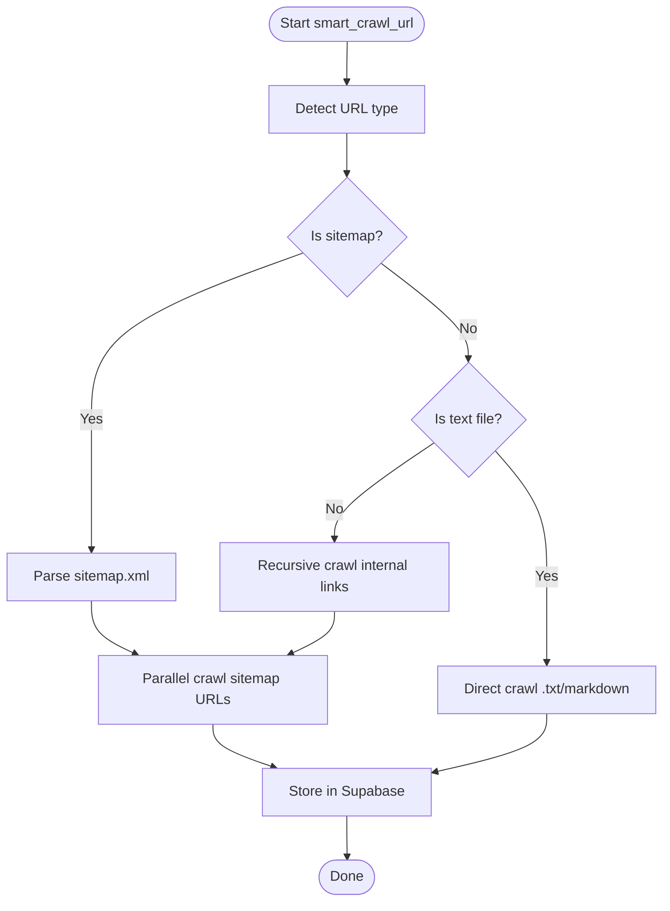

**Diagram sources**
- [src/crawl4ai_mcp.py](file://src/crawl4ai_mcp.py#L832-L920)
- [src/crawl4ai_mcp.py](file://src/crawl4ai_mcp.py#L2206-L2277)

**Section sources**
- [src/crawl4ai_mcp.py](file://src/crawl4ai_mcp.py#L832-L920)
- [src/crawl4ai_mcp.py](file://src/crawl4ai_mcp.py#L2206-L2277)

### Recursive Crawling with Parallel Processing
- crawl_recursive_internal_links performs breadth-first crawling up to a specified depth, collecting internal links and avoiding revisits.
- crawl_batch uses MemoryAdaptiveDispatcher to control concurrency and memory usage while crawling multiple URLs in parallel.

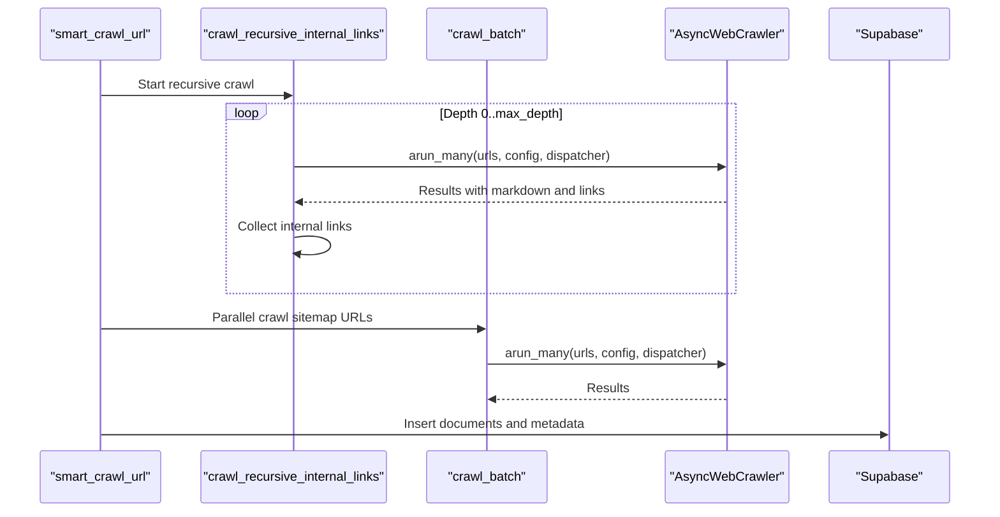

**Diagram sources**
- [src/crawl4ai_mcp.py](file://src/crawl4ai_mcp.py#L2228-L2277)
- [src/crawl4ai_mcp.py](file://src/crawl4ai_mcp.py#L2206-L2227)

**Section sources**
- [src/crawl4ai_mcp.py](file://src/crawl4ai_mcp.py#L2228-L2277)
- [src/crawl4ai_mcp.py](file://src/crawl4ai_mcp.py#L2206-L2227)

### Semantic Search with Hybrid Retrieval
- perform_rag_query executes vector similarity search and optionally combines results with keyword search (ILIKE) to improve recall.
- Results can be reranked using a cross-encoder model when enabled.

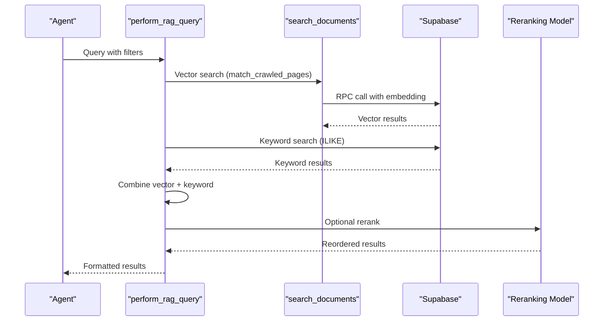

**Diagram sources**
- [src/crawl4ai_mcp.py](file://src/crawl4ai_mcp.py#L1332-L1422)
- [src/utils.py](file://src/utils.py#L1022-L1187)

**Section sources**
- [src/crawl4ai_mcp.py](file://src/crawl4ai_mcp.py#L1332-L1422)
- [src/utils.py](file://src/utils.py#L1022-L1187)

### Source Management
- Source summaries and word counts are tracked per source_id and updated in the sources table.
- The system supports multi-source queries and combines results across sources.

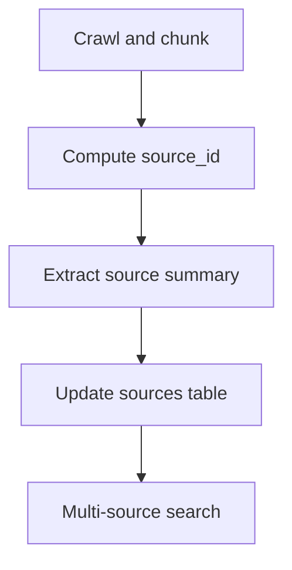

**Diagram sources**
- [src/crawl4ai_mcp.py](file://src/crawl4ai_mcp.py#L758-L820)
- [src/utils.py](file://src/utils.py#L842-L933)
- [src/utils.py](file://src/utils.py#L1084-L1148)

**Section sources**
- [src/crawl4ai_mcp.py](file://src/crawl4ai_mcp.py#L758-L820)
- [src/utils.py](file://src/utils.py#L842-L933)
- [src/utils.py](file://src/utils.py#L1084-L1148)

### Conditional Tools: search_code_examples
- search_code_examples is available when USE_AGENTIC_RAG is enabled. It searches code examples with optional source filtering and supports hybrid search and reranking.
- The tool extracts code blocks from markdown, summarizes them, and stores them in a dedicated table for code-focused retrieval.

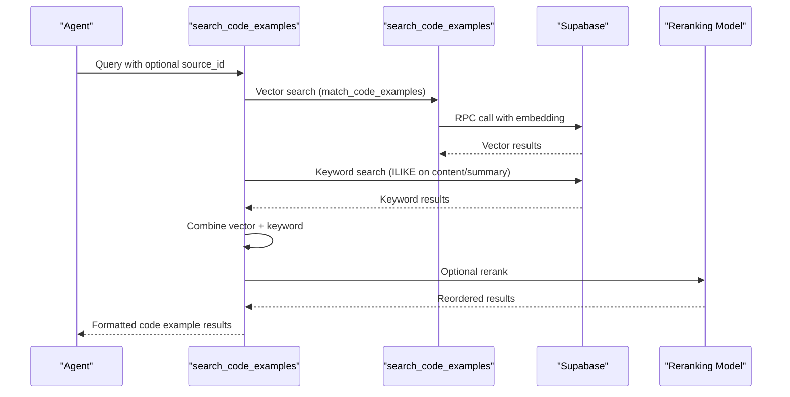

**Diagram sources**
- [src/crawl4ai_mcp.py](file://src/crawl4ai_mcp.py#L1420-L1499)
- [src/utils.py](file://src/utils.py#L935-L984)

**Section sources**
- [src/crawl4ai_mcp.py](file://src/crawl4ai_mcp.py#L1420-L1499)
- [src/utils.py](file://src/utils.py#L935-L984)

### Knowledge Graph Tools (Conditional)
- parse_github_repository: Parses a GitHub repository into Neo4j for hallucination detection.
- check_ai_script_hallucinations: Validates AI-generated Python scripts against the knowledge graph.
- query_knowledge_graph: CLI-like tool to explore repositories, classes, methods, and run custom Cypher queries.

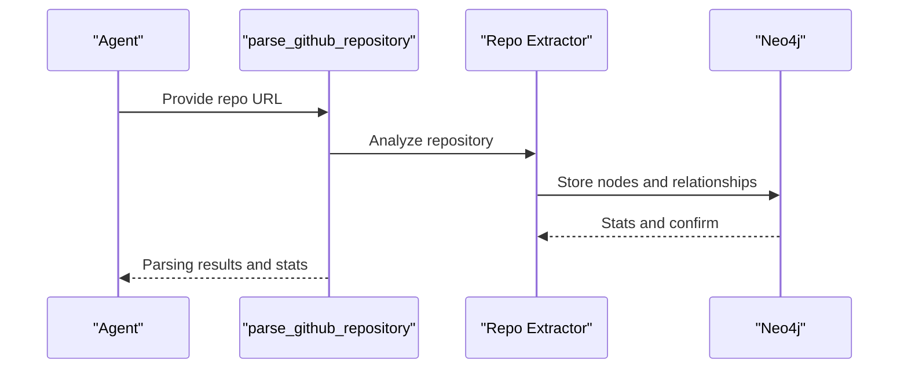

**Diagram sources**
- [src/crawl4ai_mcp.py](file://src/crawl4ai_mcp.py#L2057-L2185)
- [knowledge_graphs/query_knowledge_graph.py](file://knowledge_graphs/query_knowledge_graph.py#L1-L120)

**Section sources**
- [src/crawl4ai_mcp.py](file://src/crawl4ai_mcp.py#L2057-L2185)
- [knowledge_graphs/query_knowledge_graph.py](file://knowledge_graphs/query_knowledge_graph.py#L1-L120)

### Tool Invocation Patterns and Expected Responses
- Tool registration: Tools are decorated with @mcp.tool() and bound to the server’s lifespan. They receive a Context and typed parameters, returning JSON-formatted strings.
- Example invocation patterns:
  - crawl_single_page(url, disable_javascript?, chunk_size?)
  - smart_crawl_url(url, max_depth?, max_concurrent?, chunk_size?, disable_javascript?)
  - perform_rag_query(query, source_type?, match_count?, use_hybrid?, use_reranking?)
  - search_code_examples(query, source_id?, match_count?)
  - get_available_sources()
  - parse_github_repository(repo_url)
  - check_ai_script_hallucinations(script_path)
  - query_knowledge_graph(command)

Expected response shape (examples):
- Success: { "success": true, "results": [...], "count": N, "search_mode": "...", "reranking_applied": true/false }
- Error: { "success": false, "error": "..." }

**Section sources**
- [src/crawl4ai_mcp.py](file://src/crawl4ai_mcp.py#L1332-L1422)
- [src/crawl4ai_mcp.py](file://src/crawl4ai_mcp.py#L1420-L1499)
- [src/crawl4ai_mcp.py](file://src/crawl4ai_mcp.py#L2057-L2185)

### Practical Usage Sequences
- Typical workflow:
  1. Use smart_crawl_url to crawl a sitemap or a website recursively with parallel processing.
  2. Optionally enable USE_AGENTIC_RAG to extract and index code examples.
  3. Use perform_rag_query to search across sources with hybrid search and reranking.
  4. For code-specific needs, use search_code_examples with source filtering.
  5. For hallucination detection, parse a repository and validate scripts.

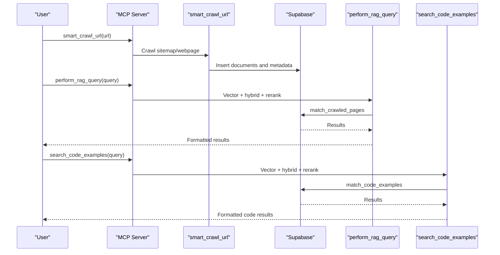

**Diagram sources**
- [src/crawl4ai_mcp.py](file://src/crawl4ai_mcp.py#L832-L920)
- [src/crawl4ai_mcp.py](file://src/crawl4ai_mcp.py#L1332-L1422)
- [src/crawl4ai_mcp.py](file://src/crawl4ai_mcp.py#L1420-L1499)

**Section sources**
- [src/crawl4ai_mcp.py](file://src/crawl4ai_mcp.py#L832-L920)
- [src/crawl4ai_mcp.py](file://src/crawl4ai_mcp.py#L1332-L1422)
- [src/crawl4ai_mcp.py](file://src/crawl4ai_mcp.py#L1420-L1499)

## Dependency Analysis
- External dependencies include Crawl4AI for web crawling, Supabase for vector storage and retrieval, sentence-transformers for reranking, and Neo4j for knowledge graph operations.
- Internal dependencies:
  - src/crawl4ai_mcp.py depends on src/utils.py for embeddings, search, chunking, and database operations.
  - Scripts depend on src/utils.py for database connectivity and search utilities.

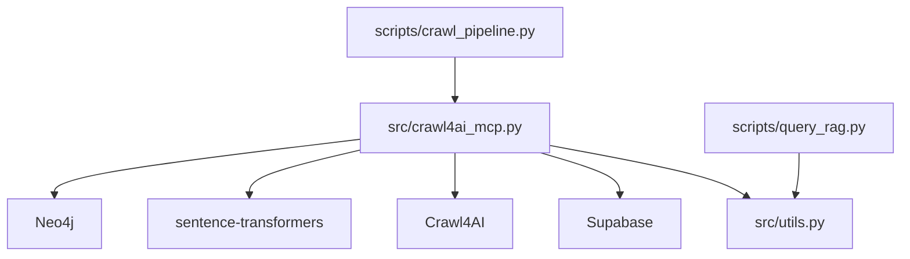

**Diagram sources**
- [src/crawl4ai_mcp.py](file://src/crawl4ai_mcp.py#L1-L120)
- [src/utils.py](file://src/utils.py#L1-L120)
- [scripts/crawl_pipeline.py](file://scripts/crawl_pipeline.py#L1-L120)
- [scripts/query_rag.py](file://scripts/query_rag.py#L1-L60)

**Section sources**
- [src/crawl4ai_mcp.py](file://src/crawl4ai_mcp.py#L1-L120)
- [src/utils.py](file://src/utils.py#L1-L120)
- [scripts/crawl_pipeline.py](file://scripts/crawl_pipeline.py#L1-L120)
- [scripts/query_rag.py](file://scripts/query_rag.py#L1-L60)

## Performance Considerations
- Parallel crawling: Use max_concurrent to balance throughput and resource usage. Lower values reduce memory pressure.
- Contextual embeddings: Enabling contextual embeddings increases latency due to LLM calls per chunk.
- Hybrid search: Improves recall but adds computational overhead.
- Reranking: Adds latency (~100–200ms) but improves result ranking.
- Static vs dynamic content: disable_javascript reduces redirects and can stabilize content size for predictable indexing.

[No sources needed since this section provides general guidance]

## Troubleshooting Guide
- Startup readiness: Wait for the server-ready message before connecting clients.
- JavaScript redirects: Use disable_javascript or CRAWL_STATIC_CONTENT_ONLY to avoid unexpected content expansion.
- Rate limiting: Adjust COPILOT_REQUESTS_PER_MINUTE and monitor exponential backoff behavior.
- Database connectivity: Verify SUPABASE_URL and SUPABASE_SERVICE_KEY; ensure pgvector extension is initialized.
- Knowledge graph: Confirm Neo4j URI, user, and password; ensure the knowledge graph tools are enabled.

**Section sources**
- [README.md](file://README.md#L420-L482)
- [README.md](file://README.md#L706-L714)

## Conclusion
The Crawl4AI RAG MCP Server provides a robust framework for AI agents to crawl, index, and retrieve knowledge from web sources. Its tool registration mechanism integrates seamlessly with MCP clients, while utilities and scripts streamline end-to-end workflows. Conditional features like code example extraction and knowledge graph tools extend capabilities for specialized use cases.

[No sources needed since this section summarizes without analyzing specific files]

## Appendices

### Configuration and Transport
- Transport configuration for clients is defined in mcp.json and README examples.

**Section sources**
- [mcp.json](file://mcp.json#L1-L9)
- [README.md](file://README.md#L533-L592)

### CLI-Based Testing and Pipelines
- scripts/query_rag.py offers a CLI to test RAG queries, source filtering, and hybrid search.
- scripts/crawl_pipeline.py orchestrates multi-step crawling pipelines for clean, predictable results.

**Section sources**
- [scripts/query_rag.py](file://scripts/query_rag.py#L1-L120)
- [scripts/crawl_pipeline.py](file://scripts/crawl_pipeline.py#L1-L120)