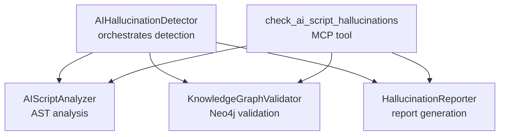
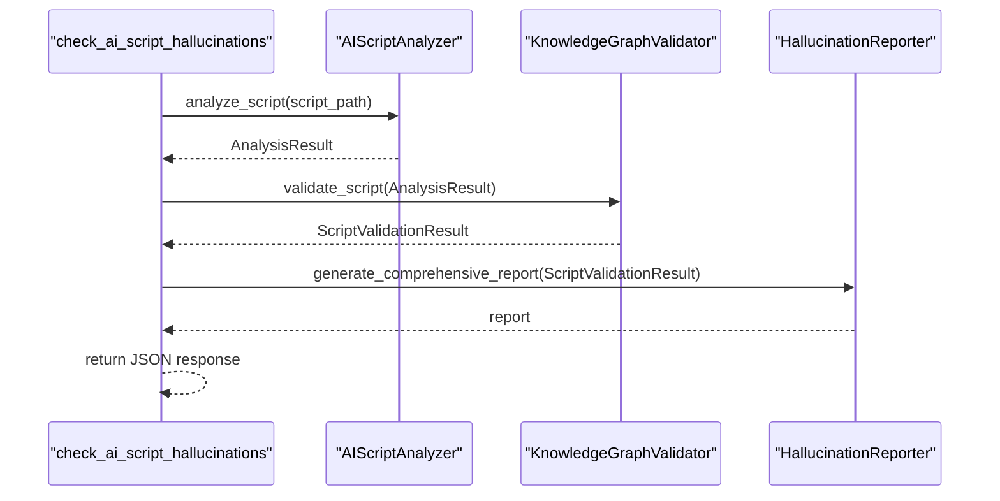
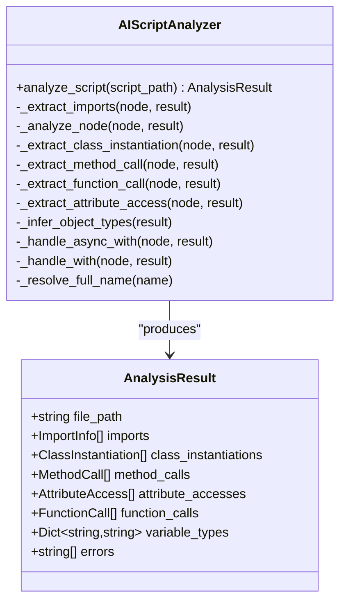
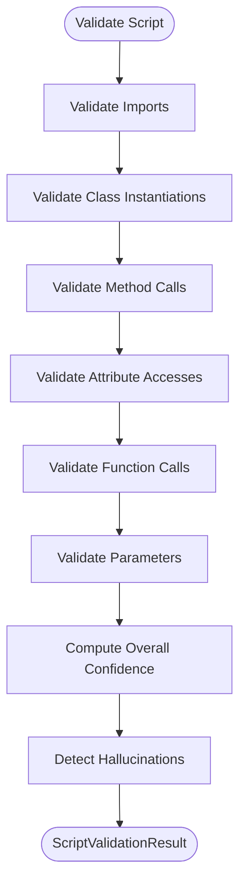
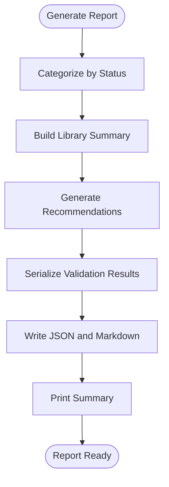
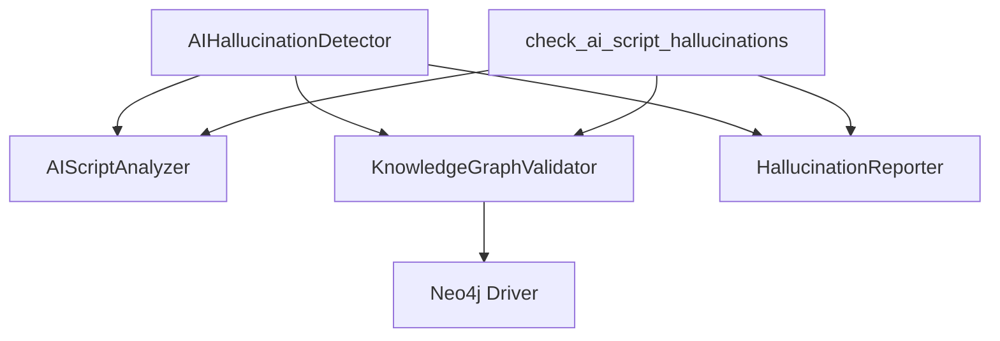

# Hallucination Detection

<cite>
**Referenced Files in This Document**
- [ai_hallucination_detector.py](file://knowledge_graphs/ai_hallucination_detector.py)
- [ai_script_analyzer.py](file://knowledge_graphs/ai_script_analyzer.py)
- [knowledge_graph_validator.py](file://knowledge_graphs/knowledge_graph_validator.py)
- [hallucination_reporter.py](file://knowledge_graphs/hallucination_reporter.py)
- [crawl4ai_mcp.py](file://src/crawl4ai_mcp.py)
</cite>

## Table of Contents
1. [Introduction](#introduction)
2. [Project Structure](#project-structure)
3. [Core Components](#core-components)
4. [Architecture Overview](#architecture-overview)
5. [Detailed Component Analysis](#detailed-component-analysis)
6. [Dependency Analysis](#dependency-analysis)
7. [Performance Considerations](#performance-considerations)
8. [Troubleshooting Guide](#troubleshooting-guide)
9. [Conclusion](#conclusion)

## Introduction
This document explains the AI hallucination detection system that validates AI-generated Python scripts against a Neo4j knowledge graph. It focuses on:
- The orchestration function check_ai_script_hallucinations and its parameters, domain models, and usage patterns
- The AIScriptAnalyzer’s AST-based analysis covering imports, method calls, class instantiations, function calls, and attribute access
- The HallucinationReporter’s comprehensive reporting in JSON and Markdown formats
- How validation results are categorized and how recommendations are generated
- Common issues such as false positives in external library detection and troubleshooting guidance
- Performance considerations and best practices for interpreting hallucination reports

## Project Structure
The hallucination detection system is organized around four primary modules:
- Orchestrator: AIHallucinationDetector coordinates analysis, validation, and reporting
- Analyzer: AIScriptAnalyzer performs AST-based extraction of imports, calls, and accesses
- Validator: KnowledgeGraphValidator validates against Neo4j knowledge graph and computes confidence and hallucinations
- Reporter: HallucinationReporter generates JSON and Markdown reports and prints summaries

**Diagram sources**
- [ai_hallucination_detector.py](file://knowledge_graphs/ai_hallucination_detector.py#L48-L126)
- [ai_script_analyzer.py](file://knowledge_graphs/ai_script_analyzer.py#L93-L133)
- [knowledge_graph_validator.py](file://knowledge_graphs/knowledge_graph_validator.py#L129-L164)
- [hallucination_reporter.py](file://knowledge_graphs/hallucination_reporter.py#L21-L40)
- [crawl4ai_mcp.py](file://src/crawl4ai_mcp.py#L1506-L1593)

**Section sources**
- [ai_hallucination_detector.py](file://knowledge_graphs/ai_hallucination_detector.py#L31-L126)
- [ai_script_analyzer.py](file://knowledge_graphs/ai_script_analyzer.py#L21-L133)
- [knowledge_graph_validator.py](file://knowledge_graphs/knowledge_graph_validator.py#L23-L164)
- [hallucination_reporter.py](file://knowledge_graphs/hallucination_reporter.py#L21-L40)
- [crawl4ai_mcp.py](file://src/crawl4ai_mcp.py#L1506-L1593)

## Core Components
- AIHallucinationDetector: Provides a high-level API to analyze a script, validate against the knowledge graph, generate reports, and persist outputs.
- AIScriptAnalyzer: Parses Python scripts with AST and extracts imports, class instantiations, method calls, function calls, and attribute accesses, including variable type inference.
- KnowledgeGraphValidator: Validates each extracted element against Neo4j, computes confidence, detects hallucinations, and aggregates results.
- HallucinationReporter: Transforms validation results into structured JSON and Markdown reports, summarizes findings, and generates actionable recommendations.

**Section sources**
- [ai_hallucination_detector.py](file://knowledge_graphs/ai_hallucination_detector.py#L31-L126)
- [ai_script_analyzer.py](file://knowledge_graphs/ai_script_analyzer.py#L21-L133)
- [knowledge_graph_validator.py](file://knowledge_graphs/knowledge_graph_validator.py#L23-L164)
- [hallucination_reporter.py](file://knowledge_graphs/hallucination_reporter.py#L21-L40)

## Architecture Overview
The system follows a pipeline: AST analysis → knowledge graph validation → report generation. The MCP tool check_ai_script_hallucinations integrates the same pipeline into a server-side tool.

**Diagram sources**
- [crawl4ai_mcp.py](file://src/crawl4ai_mcp.py#L1506-L1593)
- [ai_script_analyzer.py](file://knowledge_graphs/ai_script_analyzer.py#L93-L133)
- [knowledge_graph_validator.py](file://knowledge_graphs/knowledge_graph_validator.py#L129-L164)
- [hallucination_reporter.py](file://knowledge_graphs/hallucination_reporter.py#L21-L40)

## Detailed Component Analysis

### check_ai_script_hallucinations
- Purpose: A server-side tool that validates an AI-generated Python script for hallucinations by analyzing it with AST, validating against the knowledge graph, and generating a structured report.
- Parameters:
  - ctx: MCP server context
  - script_path: Absolute path to the Python script to analyze
- Domain models:
  - AnalysisResult (from AIScriptAnalyzer): Captures imports, class instantiations, method calls, function calls, attribute accesses, and variable types.
  - ScriptValidationResult (from KnowledgeGraphValidator): Aggregates validation outcomes per category with confidence and suggestions.
  - ValidationResult and ValidationStatus enums define outcome semantics.
- Usage patterns:
  - Validates environment configuration for knowledge graph availability
  - Validates script path
  - Runs analyzer and validator in sequence
  - Generates comprehensive report and returns a JSON payload with validation summary, hallucinations, recommendations, and library analysis

Key implementation references:
- Tool signature and documentation: [crawl4ai_mcp.py](file://src/crawl4ai_mcp.py#L1506-L1528)
- Environment checks and path validation: [crawl4ai_mcp.py](file://src/crawl4ai_mcp.py#L1530-L1554)
- AST analysis invocation: [crawl4ai_mcp.py](file://src/crawl4ai_mcp.py#L1556-L1560)
- Knowledge graph validation: [crawl4ai_mcp.py](file://src/crawl4ai_mcp.py#L1563-L1565)
- Report generation and response formatting: [crawl4ai_mcp.py](file://src/crawl4ai_mcp.py#L1566-L1593)

**Section sources**
- [crawl4ai_mcp.py](file://src/crawl4ai_mcp.py#L1506-L1593)

### AIScriptAnalyzer: AST-based Analysis
- Responsibilities:
  - Parse Python scripts with AST
  - Extract imports (including from-imports) and build an import map
  - Identify class instantiations and infer types for subsequent method calls/attributes
  - Extract method calls, function calls, and attribute accesses
  - Track context managers to refine type inference (e.g., pydantic_ai.StreamedRunResult)
  - Build AnalysisResult with lists of imports, instantiations, method calls, function calls, attribute accesses, and variable types
- Key behaviors:
  - Import resolution: Maps aliases to full module names
  - Class instantiation detection: Distinguishes direct assignments vs nested calls
  - Parameter representation: Converts arguments to readable strings for validation
  - Context-aware type inference: Uses with/async with scopes to improve accuracy

Implementation highlights:
- Analysis entrypoint: [ai_script_analyzer.py](file://knowledge_graphs/ai_script_analyzer.py#L93-L133)
- Import extraction and mapping: [ai_script_analyzer.py](file://knowledge_graphs/ai_script_analyzer.py#L134-L173)
- Node analysis passes: [ai_script_analyzer.py](file://knowledge_graphs/ai_script_analyzer.py#L174-L229)
- Class instantiation extraction: [ai_script_analyzer.py](file://knowledge_graphs/ai_script_analyzer.py#L230-L263)
- Method call extraction: [ai_script_analyzer.py](file://knowledge_graphs/ai_script_analyzer.py#L264-L289)
- Function call extraction: [ai_script_analyzer.py](file://knowledge_graphs/ai_script_analyzer.py#L291-L315)
- Attribute access extraction: [ai_script_analyzer.py](file://knowledge_graphs/ai_script_analyzer.py#L316-L332)
- Type inference and context manager handling: [ai_script_analyzer.py](file://knowledge_graphs/ai_script_analyzer.py#L333-L491)
- Name resolution helpers: [ai_script_analyzer.py](file://knowledge_graphs/ai_script_analyzer.py#L492-L505)

**Diagram sources**
- [ai_script_analyzer.py](file://knowledge_graphs/ai_script_analyzer.py#L21-L133)
- [ai_script_analyzer.py](file://knowledge_graphs/ai_script_analyzer.py#L93-L133)

**Section sources**
- [ai_script_analyzer.py](file://knowledge_graphs/ai_script_analyzer.py#L21-L133)
- [ai_script_analyzer.py](file://knowledge_graphs/ai_script_analyzer.py#L134-L229)
- [ai_script_analyzer.py](file://knowledge_graphs/ai_script_analyzer.py#L230-L332)
- [ai_script_analyzer.py](file://knowledge_graphs/ai_script_analyzer.py#L333-L491)
- [ai_script_analyzer.py](file://knowledge_graphs/ai_script_analyzer.py#L492-L505)

### KnowledgeGraphValidator: Validation Against Neo4j
- Responsibilities:
  - Validate imports, class instantiations, method calls, attribute accesses, and function calls
  - Compute confidence scores and aggregate overall confidence
  - Detect hallucinations and produce a list of detected issues
  - Provide suggestions for corrections (e.g., similar method names)
- Key behaviors:
  - Import validation: Marks modules present in knowledge graph vs external libraries
  - Class instantiation validation: Checks class existence and constructor parameter validity
  - Method validation: Checks method existence and parameter validity; suggests similar names
  - Attribute validation: Treats decorated methods as attributes when applicable
  - Function validation: Checks function existence and parameter validity
  - Parameter validation: Handles positional/keyword-only/varargs/varkwargs with detailed parsing
  - Hallucination detection: Aggregates METHOD_NOT_FOUND, ATTRIBUTE_NOT_FOUND, and INVALID_PARAMETERS for knowledge graph items only

Implementation highlights:
- Validation orchestration: [knowledge_graph_validator.py](file://knowledge_graphs/knowledge_graph_validator.py#L129-L164)
- Import validation: [knowledge_graph_validator.py](file://knowledge_graphs/knowledge_graph_validator.py#L165-L226)
- Class instantiation validation: [knowledge_graph_validator.py](file://knowledge_graphs/knowledge_graph_validator.py#L227-L303)
- Method validation: [knowledge_graph_validator.py](file://knowledge_graphs/knowledge_graph_validator.py#L304-L389)
- Attribute validation: [knowledge_graph_validator.py](file://knowledge_graphs/knowledge_graph_validator.py#L390-L467)
- Function validation: [knowledge_graph_validator.py](file://knowledge_graphs/knowledge_graph_validator.py#L468-L537)
- Parameter validation logic: [knowledge_graph_validator.py](file://knowledge_graphs/knowledge_graph_validator.py#L539-L641)
- Hallucination detection: [knowledge_graph_validator.py](file://knowledge_graphs/knowledge_graph_validator.py#L1194-L1244)

**Diagram sources**
- [knowledge_graph_validator.py](file://knowledge_graphs/knowledge_graph_validator.py#L129-L164)
- [knowledge_graph_validator.py](file://knowledge_graphs/knowledge_graph_validator.py#L165-L226)
- [knowledge_graph_validator.py](file://knowledge_graphs/knowledge_graph_validator.py#L227-L303)
- [knowledge_graph_validator.py](file://knowledge_graphs/knowledge_graph_validator.py#L304-L389)
- [knowledge_graph_validator.py](file://knowledge_graphs/knowledge_graph_validator.py#L390-L467)
- [knowledge_graph_validator.py](file://knowledge_graphs/knowledge_graph_validator.py#L468-L537)
- [knowledge_graph_validator.py](file://knowledge_graphs/knowledge_graph_validator.py#L539-L641)
- [knowledge_graph_validator.py](file://knowledge_graphs/knowledge_graph_validator.py#L1194-L1244)

**Section sources**
- [knowledge_graph_validator.py](file://knowledge_graphs/knowledge_graph_validator.py#L23-L164)
- [knowledge_graph_validator.py](file://knowledge_graphs/knowledge_graph_validator.py#L165-L226)
- [knowledge_graph_validator.py](file://knowledge_graphs/knowledge_graph_validator.py#L227-L303)
- [knowledge_graph_validator.py](file://knowledge_graphs/knowledge_graph_validator.py#L304-L389)
- [knowledge_graph_validator.py](file://knowledge_graphs/knowledge_graph_validator.py#L390-L467)
- [knowledge_graph_validator.py](file://knowledge_graphs/knowledge_graph_validator.py#L468-L537)
- [knowledge_graph_validator.py](file://knowledge_graphs/knowledge_graph_validator.py#L539-L641)
- [knowledge_graph_validator.py](file://knowledge_graphs/knowledge_graph_validator.py#L1194-L1244)

### HallucinationReporter: Reporting System
- Responsibilities:
  - Generate comprehensive JSON and Markdown reports
  - Categorize validation items by status (VALID, INVALID, UNCERTAIN, NOT_FOUND)
  - Filter out external library detections and focus on knowledge graph items
  - Summarize validation counts, overall confidence, and hallucination rate
  - Provide actionable recommendations based on detected issues
  - Serialize validation results and include suggestions

Implementation highlights:
- Report generation: [hallucination_reporter.py](file://knowledge_graphs/hallucination_reporter.py#L21-L190)
- Library summary aggregation: [hallucination_reporter.py](file://knowledge_graphs/hallucination_reporter.py#L236-L322)
- Recommendation generation: [hallucination_reporter.py](file://knowledge_graphs/hallucination_reporter.py#L323-L364)
- JSON and Markdown persistence: [hallucination_reporter.py](file://knowledge_graphs/hallucination_reporter.py#L365-L494)
- Console summary printing: [hallucination_reporter.py](file://knowledge_graphs/hallucination_reporter.py#L495-L523)

**Diagram sources**
- [hallucination_reporter.py](file://knowledge_graphs/hallucination_reporter.py#L21-L190)
- [hallucination_reporter.py](file://knowledge_graphs/hallucination_reporter.py#L236-L364)
- [hallucination_reporter.py](file://knowledge_graphs/hallucination_reporter.py#L365-L494)
- [hallucination_reporter.py](file://knowledge_graphs/hallucination_reporter.py#L495-L523)

**Section sources**
- [hallucination_reporter.py](file://knowledge_graphs/hallucination_reporter.py#L21-L190)
- [hallucination_reporter.py](file://knowledge_graphs/hallucination_reporter.py#L236-L364)
- [hallucination_reporter.py](file://knowledge_graphs/hallucination_reporter.py#L365-L494)
- [hallucination_reporter.py](file://knowledge_graphs/hallucination_reporter.py#L495-L523)

### AIHallucinationDetector: Orchestration
- Responsibilities:
  - Initialize knowledge graph connection
  - Validate input script path and type
  - Run analyzer, validator, and reporter
  - Persist JSON and Markdown reports and print summaries
  - Support batch processing with aggregated summaries

Implementation highlights:
- Main detection function: [ai_hallucination_detector.py](file://knowledge_graphs/ai_hallucination_detector.py#L48-L126)
- Batch detection: [ai_hallucination_detector.py](file://knowledge_graphs/ai_hallucination_detector.py#L127-L203)
- CLI entrypoint and argument parsing: [ai_hallucination_detector.py](file://knowledge_graphs/ai_hallucination_detector.py#L204-L335)

**Section sources**
- [ai_hallucination_detector.py](file://knowledge_graphs/ai_hallucination_detector.py#L48-L126)
- [ai_hallucination_detector.py](file://knowledge_graphs/ai_hallucination_detector.py#L127-L203)
- [ai_hallucination_detector.py](file://knowledge_graphs/ai_hallucination_detector.py#L204-L335)

## Dependency Analysis
- Coupling:
  - AIHallucinationDetector depends on AIScriptAnalyzer, KnowledgeGraphValidator, and HallucinationReporter
  - KnowledgeGraphValidator depends on AnalysisResult and ValidationStatus enums
  - HallucinationReporter depends on ScriptValidationResult and ValidationStatus
  - check_ai_script_hallucinations depends on AIScriptAnalyzer, KnowledgeGraphValidator, and HallucinationReporter
- Cohesion:
  - Each component encapsulates a single responsibility: analysis, validation, reporting, or orchestration
- External dependencies:
  - Neo4j driver for asynchronous graph operations
  - JSON serialization for report outputs

**Diagram sources**
- [ai_hallucination_detector.py](file://knowledge_graphs/ai_hallucination_detector.py#L31-L60)
- [knowledge_graph_validator.py](file://knowledge_graphs/knowledge_graph_validator.py#L116-L128)
- [crawl4ai_mcp.py](file://src/crawl4ai_mcp.py#L1506-L1593)

**Section sources**
- [ai_hallucination_detector.py](file://knowledge_graphs/ai_hallucination_detector.py#L31-L60)
- [knowledge_graph_validator.py](file://knowledge_graphs/knowledge_graph_validator.py#L116-L128)
- [crawl4ai_mcp.py](file://src/crawl4ai_mcp.py#L1506-L1593)

## Performance Considerations
- Caching:
  - KnowledgeGraphValidator caches module, class, and method lookups to reduce repeated queries
- Asynchronous operations:
  - Neo4j operations are performed asynchronously to minimize latency
- AST traversal:
  - Analyzer performs two passes: import collection and usage analysis, then type inference
- Recommendations:
  - Limit report sizes by sampling valid items and focusing on detected hallucinations

Best practices:
- Prefer knowledge graph modules for validation to reduce false positives
- Use batch mode for analyzing multiple scripts to leverage shared caches
- Keep scripts modular to improve type inference accuracy

[No sources needed since this section provides general guidance]

## Troubleshooting Guide
Common issues and resolutions:
- Knowledge graph disabled:
  - Ensure USE_KNOWLEDGE_GRAPH is set to true and Neo4j credentials are configured
  - Reference: [crawl4ai_mcp.py](file://src/crawl4ai_mcp.py#L1530-L1537)
- External library false positives:
  - External libraries are marked as UNCERTAIN and excluded from hallucination detection
  - Reference: [knowledge_graph_validator.py](file://knowledge_graphs/knowledge_graph_validator.py#L214-L226)
- Method not found suggestions:
  - Similar method names are suggested when a method is not found
  - Reference: [knowledge_graph_validator.py](file://knowledge_graphs/knowledge_graph_validator.py#L345-L357)
- Parameter mismatch:
  - Detailed parameter validation distinguishes positional/keyword-only/varargs/varkwargs
  - Reference: [knowledge_graph_validator.py](file://knowledge_graphs/knowledge_graph_validator.py#L539-L641)
- Low confidence:
  - Overall confidence reflects reliance on external libraries; review recommendations
  - Reference: [hallucination_reporter.py](file://knowledge_graphs/hallucination_reporter.py#L358-L363)

**Section sources**
- [crawl4ai_mcp.py](file://src/crawl4ai_mcp.py#L1530-L1537)
- [knowledge_graph_validator.py](file://knowledge_graphs/knowledge_graph_validator.py#L214-L226)
- [knowledge_graph_validator.py](file://knowledge_graphs/knowledge_graph_validator.py#L345-L357)
- [knowledge_graph_validator.py](file://knowledge_graphs/knowledge_graph_validator.py#L539-L641)
- [hallucination_reporter.py](file://knowledge_graphs/hallucination_reporter.py#L358-L363)

## Conclusion
The hallucination detection system combines AST-based analysis, Neo4j-backed validation, and comprehensive reporting to identify and remediate AI-generated hallucinations. The MCP tool check_ai_script_hallucinations exposes this pipeline for server-side integration, while the AIHallucinationDetector provides a robust CLI and batch processing capability. By focusing on knowledge graph items and leveraging caching and asynchronous operations, the system balances accuracy and performance. Use the recommendations and reports to iteratively improve AI-generated scripts and reduce hallucinations.