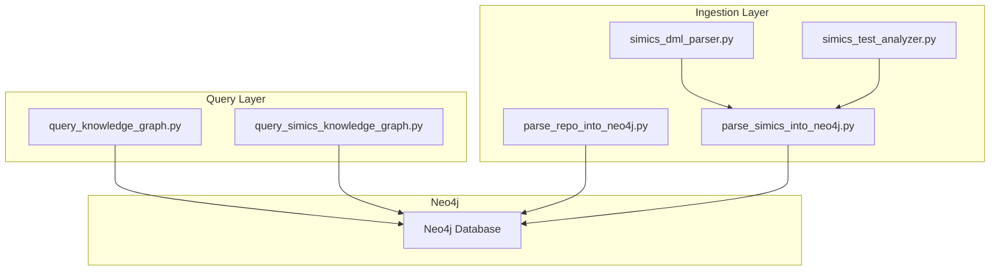
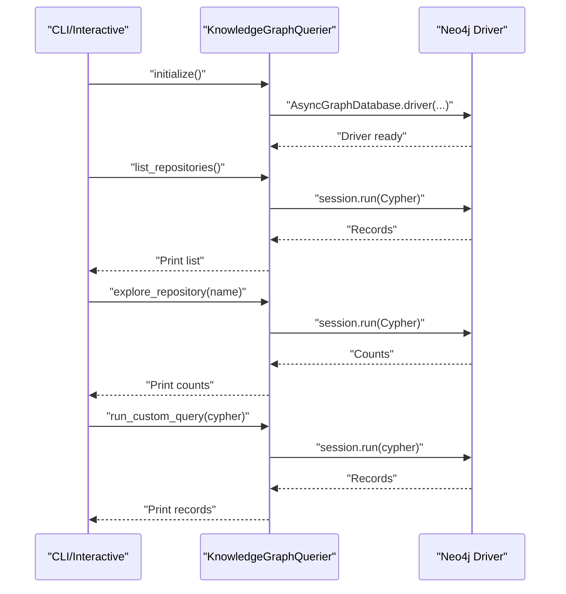
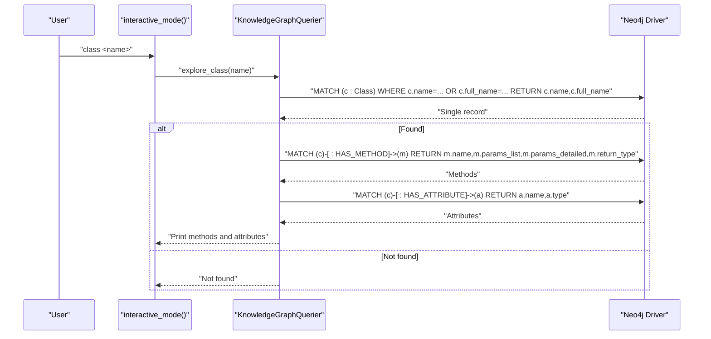
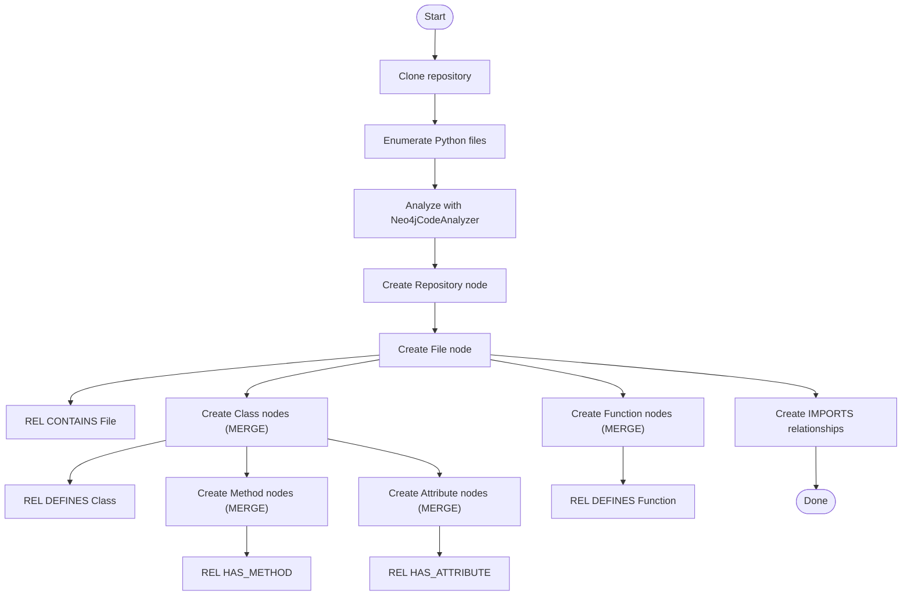
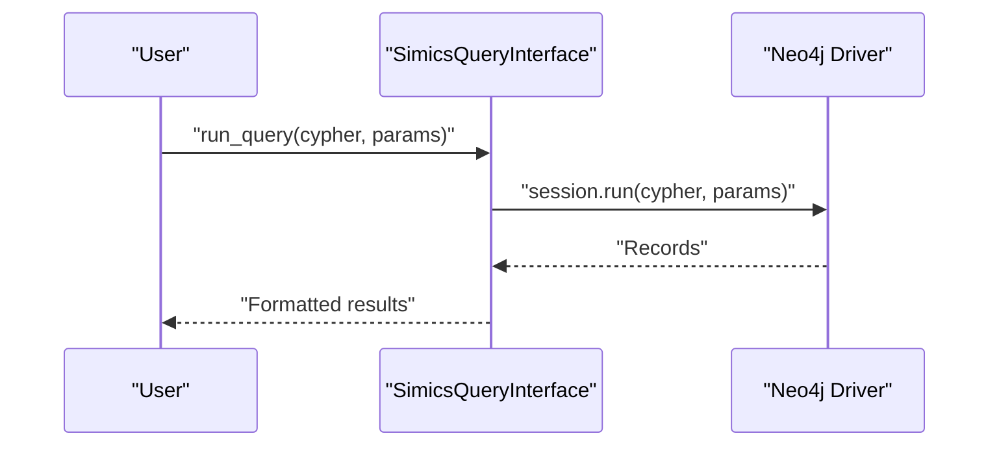
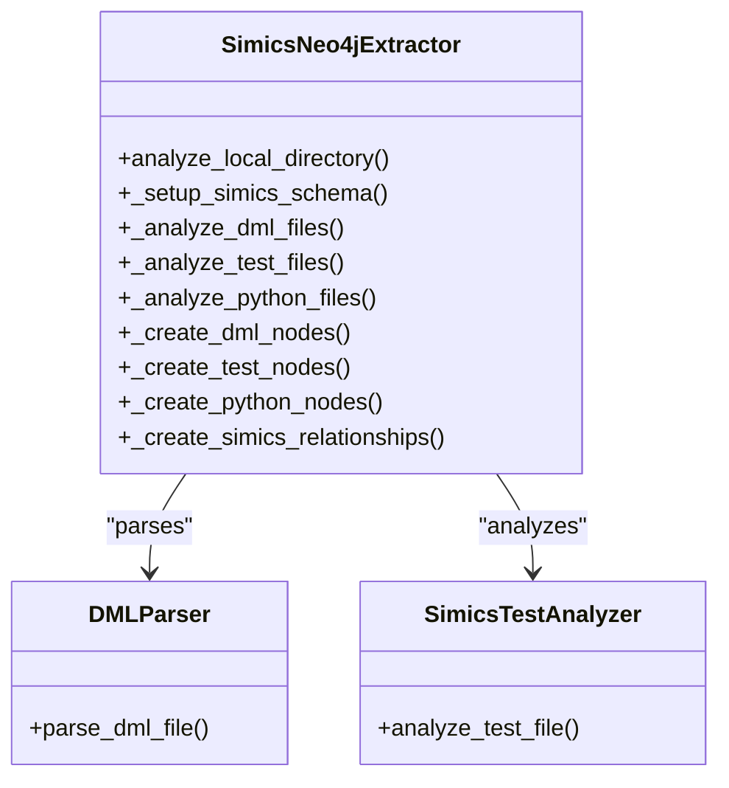
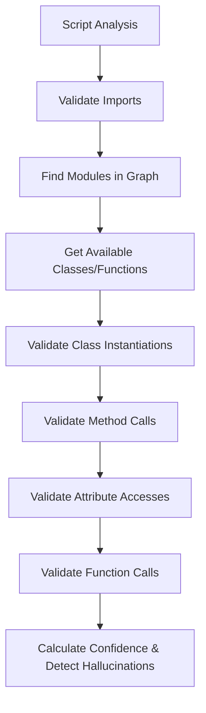
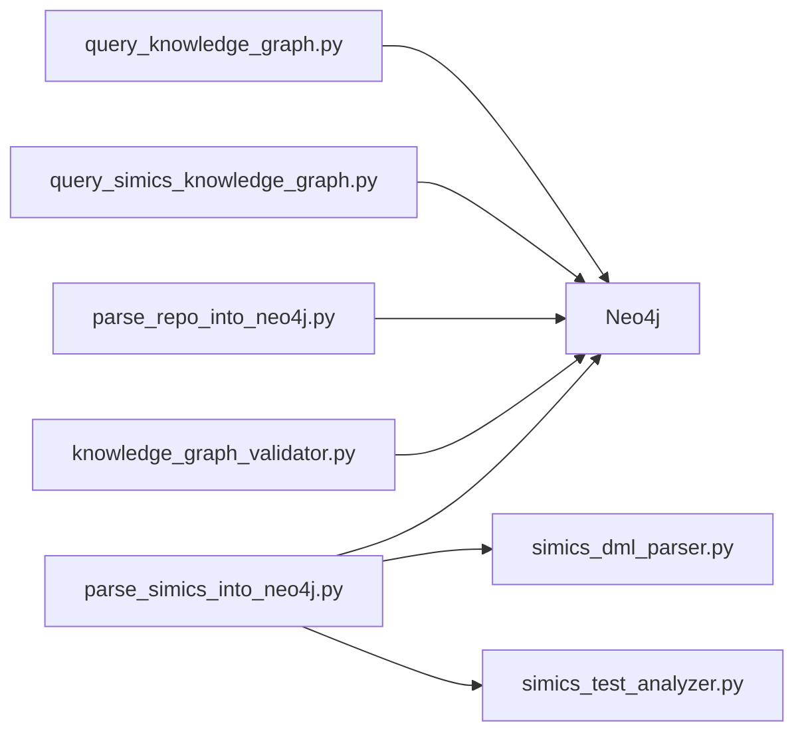

# Knowledge Graph Querying

<cite>
**Referenced Files in This Document**
- [query_knowledge_graph.py](file://knowledge_graphs/query_knowledge_graph.py)
- [parse_repo_into_neo4j.py](file://knowledge_graphs/parse_repo_into_neo4j.py)
- [query_simics_knowledge_graph.py](file://knowledge_graphs/query_simics_knowledge_graph.py)
- [parse_simics_into_neo4j.py](file://knowledge_graphs/parse_simics_into_neo4j.py)
- [simics_dml_parser.py](file://knowledge_graphs/simics_dml_parser.py)
- [simics_test_analyzer.py](file://knowledge_graphs/simics_test_analyzer.py)
- [knowledge_graph_validator.py](file://knowledge_graphs/knowledge_graph_validator.py)
- [README_Simics.md](file://knowledge_graphs/README_Simics.md)
- [README.md](file://README.md)
</cite>

## Table of Contents
1. [Introduction](#introduction)
2. [Project Structure](#project-structure)
3. [Core Components](#core-components)
4. [Architecture Overview](#architecture-overview)
5. [Detailed Component Analysis](#detailed-component-analysis)
6. [Dependency Analysis](#dependency-analysis)
7. [Performance Considerations](#performance-considerations)
8. [Troubleshooting Guide](#troubleshooting-guide)
9. [Conclusion](#conclusion)
10. [Appendices](#appendices)

## Introduction
This document explains the knowledge graph querying system built around Neo4j. It focuses on:
- The query_knowledge_graph module and its command system (repos, explore, classes, class, method, query)
- The Simics-specific query interface and pre-built queries
- The Neo4j schema design for Python and Simics code
- Practical usage patterns, example Cypher queries, and result processing
- Troubleshooting and performance optimization for effective exploration

## Project Structure
The knowledge graph querying system spans multiple modules:
- query_knowledge_graph.py: generic Python code graph querying and CLI/interactive interface
- parse_repo_into_neo4j.py: ingestion of Python repositories into Neo4j with constraints/indexes
- query_simics_knowledge_graph.py: Simics-specific queries and interactive mode
- parse_simics_into_neo4j.py: Simics code ingestion (DML, tests, Python) with Simics schema
- simics_dml_parser.py: DML parsing for device, interface, method, attribute, register extraction
- simics_test_analyzer.py: enhanced Python test analysis for Simics patterns
- knowledge_graph_validator.py: validation of AI-generated scripts against the knowledge graph

**Diagram sources**
- [query_knowledge_graph.py](file://knowledge_graphs/query_knowledge_graph.py#L1-L400)
- [query_simics_knowledge_graph.py](file://knowledge_graphs/query_simics_knowledge_graph.py#L1-L545)
- [parse_repo_into_neo4j.py](file://knowledge_graphs/parse_repo_into_neo4j.py#L1-L858)
- [parse_simics_into_neo4j.py](file://knowledge_graphs/parse_simics_into_neo4j.py#L1-L717)
- [simics_dml_parser.py](file://knowledge_graphs/simics_dml_parser.py#L1-L467)
- [simics_test_analyzer.py](file://knowledge_graphs/simics_test_analyzer.py#L1-L542)

**Section sources**
- [query_knowledge_graph.py](file://knowledge_graphs/query_knowledge_graph.py#L1-L400)
- [README_Simics.md](file://knowledge_graphs/README_Simics.md#L1-L355)

## Core Components
- KnowledgeGraphQuerier: asynchronous Neo4j client with methods for listing repositories, exploring repositories, listing classes, exploring classes, searching methods, and running custom Cypher queries. It also provides an interactive CLI.
- SimicsQueryInterface: extends KnowledgeGraphQuerier with Simics-specific pre-defined queries (device hierarchy, interfaces, methods, registers, test coverage, API usage, patterns, dependencies, cross-language links, similar devices, fixtures, stats).
- DirectNeo4jExtractor and Neo4jCodeAnalyzer: ingest Python repositories into Neo4j, creating File, Class, Method, Function, Attribute nodes and relationships like CONTAINS, DEFINES, HAS_METHOD, IMPORTS.
- SimicsNeo4jExtractor: extends ingestion to Simics code, adding DMLFile, DMLDevice, DMLInterface, DMLMethod, DMLAttribute, DMLRegister, TestFile, TestFunction, TestFixture, SimicsAPI, DeviceUnderTest nodes and relationships like INHERITS_FROM, IMPLEMENTS, HAS_METHOD, HAS_ATTRIBUTE, HAS_REGISTER, CONTAINS, TESTS, USES_API.
- DMLParser and SimicsTestAnalyzer: parsers/analyzer for Simics-specific structures and test patterns.
- KnowledgeGraphValidator: validates AI-generated Python scripts against the knowledge graph to detect hallucinations.

**Section sources**
- [query_knowledge_graph.py](file://knowledge_graphs/query_knowledge_graph.py#L1-L400)
- [query_simics_knowledge_graph.py](file://knowledge_graphs/query_simics_knowledge_graph.py#L1-L545)
- [parse_repo_into_neo4j.py](file://knowledge_graphs/parse_repo_into_neo4j.py#L1-L858)
- [parse_simics_into_neo4j.py](file://knowledge_graphs/parse_simics_into_neo4j.py#L1-L717)
- [simics_dml_parser.py](file://knowledge_graphs/simics_dml_parser.py#L1-L467)
- [simics_test_analyzer.py](file://knowledge_graphs/simics_test_analyzer.py#L1-L542)
- [knowledge_graph_validator.py](file://knowledge_graphs/knowledge_graph_validator.py#L1-L1244)

## Architecture Overview
The system separates ingestion and querying:
- Ingestion builds the graph with constraints and indexes for performance and uniqueness guarantees.
- Querying exposes both generic and Simics-specific interfaces with CLI and interactive modes.

**Diagram sources**
- [query_knowledge_graph.py](file://knowledge_graphs/query_knowledge_graph.py#L1-L400)

## Detailed Component Analysis

### query_knowledge_graph.py: Generic Python Knowledge Graph Querying
- Parameters and environment:
  - Reads NEO4J_URI, NEO4J_USER, NEO4J_PASSWORD from environment variables.
  - Uses AsyncGraphDatabase driver for async operations.
- Commands and workflows:
  - repos: lists repositories via MATCH (r:Repository) RETURN r.name ORDER BY r.name.
  - explore <repo>: counts files, classes, functions under a repository using CONTAINS and DEFINES relationships.
  - classes [repo]: lists classes with optional repository filter; returns name and full_name.
  - class <name>: explores a class by name/full_name; retrieves HAS_METHOD and HAS_ATTRIBUTE relationships; prints method signatures and attribute types.
  - method <name> [class]: searches methods by name, optionally constrained to a class; prints class_full_name, method signature, return type, and legacy args.
  - query <cypher>: runs arbitrary Cypher; prints first 20 records and truncates long outputs.
  - interactive mode: parses commands and routes to appropriate methods.
- Result processing:
  - Iterates over session.run results and prints human-readable summaries.
  - Limits output for large result sets.

**Diagram sources**
- [query_knowledge_graph.py](file://knowledge_graphs/query_knowledge_graph.py#L1-L400)

**Section sources**
- [query_knowledge_graph.py](file://knowledge_graphs/query_knowledge_graph.py#L1-L400)

### parse_repo_into_neo4j.py: Python Repository Ingestion
- Schema design:
  - Nodes: Repository, File, Class, Method, Function, Attribute.
  - Relationships: CONTAINS (Repo->File), DEFINES (File->Class/Function), HAS_METHOD (Class->Method), HAS_ATTRIBUTE (Class->Attribute), IMPORTS (File->File).
- Constraints and indexes:
  - UNIQUE constraints on File.path and Class.full_name.
  - Indexes on File.name, Class.name, Method.name.
- Workflows:
  - Clones repository (shallow) and enumerates Python files.
  - Analyzes files with Neo4jCodeAnalyzer to extract classes, functions, methods, attributes, imports.
  - Creates nodes and relationships using MERGE to avoid duplicates; sets properties and timestamps.
  - Supports clearing repository data in dependency order to satisfy constraints.

**Diagram sources**
- [parse_repo_into_neo4j.py](file://knowledge_graphs/parse_repo_into_neo4j.py#L1-L858)

**Section sources**
- [parse_repo_into_neo4j.py](file://knowledge_graphs/parse_repo_into_neo4j.py#L1-L858)

### query_simics_knowledge_graph.py: Simics-Specific Querying
- Extends KnowledgeGraphQuerier with SimicsQueryInterface:
  - Pre-defined queries: device-hierarchy, device-interfaces, device-methods, device-registers, test-coverage, untested-devices, api-usage, test-patterns, device-dependencies, cross-language-links, similar-devices, test-fixtures, stats.
  - Interactive mode with help, list, stats, query, custom, and quit.
- Result display:
  - Formats results for readability; limits output; shows hierarchy chains and counts.

**Diagram sources**
- [query_simics_knowledge_graph.py](file://knowledge_graphs/query_simics_knowledge_graph.py#L1-L545)

**Section sources**
- [query_simics_knowledge_graph.py](file://knowledge_graphs/query_simics_knowledge_graph.py#L1-L545)
- [README_Simics.md](file://knowledge_graphs/README_Simics.md#L1-L355)

### parse_simics_into_neo4j.py: Simics Ingestion Pipeline
- Adds Simics-specific node types and relationships:
  - DMLFile, DMLDevice, DMLInterface, DMLMethod, DMLAttribute, DMLRegister
  - TestFile, TestFunction, TestFixture, SimicsAPI, DeviceUnderTest
  - Relationships: INHERITS_FROM, IMPLEMENTS, HAS_METHOD, HAS_ATTRIBUTE, HAS_REGISTER, CONTAINS, TESTS, USES_API
- Schema setup:
  - Constraints: UNIQUE on DMLDevice.name, DMLInterface.name, DMLFile.file_path, TestFunction(name,file_path), TestFixture(name,file_path), SimicsAPI.name, DeviceUnderTest.name.
  - Indexes: DMLMethod.name, DMLAttribute.name, TestFunction.category, SimicsAPI.module.
- Workflows:
  - Discovers DML/test/Python files from a local directory.
  - Parses DML with DMLParser and tests with SimicsTestAnalyzer.
  - Creates nodes and relationships; links tests to DML devices and APIs.

**Diagram sources**
- [parse_simics_into_neo4j.py](file://knowledge_graphs/parse_simics_into_neo4j.py#L1-L717)
- [simics_dml_parser.py](file://knowledge_graphs/simics_dml_parser.py#L1-L467)
- [simics_test_analyzer.py](file://knowledge_graphs/simics_test_analyzer.py#L1-L542)

**Section sources**
- [parse_simics_into_neo4j.py](file://knowledge_graphs/parse_simics_into_neo4j.py#L1-L717)
- [simics_dml_parser.py](file://knowledge_graphs/simics_dml_parser.py#L1-L467)
- [simics_test_analyzer.py](file://knowledge_graphs/simics_test_analyzer.py#L1-L542)

### knowledge_graph_validator.py: Hallucination Detection
- Validates AI-generated Python scripts against the knowledge graph:
  - Imports, classes, methods, attributes, functions
  - Parameter validation using detailed parameter strings
  - Caching for performance
- Uses Cypher queries to find modules, classes, functions, and method/attribute details.

**Diagram sources**
- [knowledge_graph_validator.py](file://knowledge_graphs/knowledge_graph_validator.py#L1-L1244)

**Section sources**
- [knowledge_graph_validator.py](file://knowledge_graphs/knowledge_graph_validator.py#L1-L1244)

## Dependency Analysis
- Coupling:
  - query_knowledge_graph.py depends on neo4j driver and environment variables.
  - query_simics_knowledge_graph.py extends KnowledgeGraphQuerier and uses pre-defined Cypher queries.
  - parse_repo_into_neo4j.py and parse_simics_into_neo4j.py both depend on Neo4j driver and create constraints/indexes.
  - simics_dml_parser.py and simics_test_analyzer.py are used by parse_simics_into_neo4j.py.
  - knowledge_graph_validator.py depends on neo4j driver and uses Cypher extensively.
- Cohesion:
  - Each module has a focused responsibility: ingestion, querying, parsing, validation.

**Diagram sources**
- [query_knowledge_graph.py](file://knowledge_graphs/query_knowledge_graph.py#L1-L400)
- [query_simics_knowledge_graph.py](file://knowledge_graphs/query_simics_knowledge_graph.py#L1-L545)
- [parse_repo_into_neo4j.py](file://knowledge_graphs/parse_repo_into_neo4j.py#L1-L858)
- [parse_simics_into_neo4j.py](file://knowledge_graphs/parse_simics_into_neo4j.py#L1-L717)
- [simics_dml_parser.py](file://knowledge_graphs/simics_dml_parser.py#L1-L467)
- [simics_test_analyzer.py](file://knowledge_graphs/simics_test_analyzer.py#L1-L542)
- [knowledge_graph_validator.py](file://knowledge_graphs/knowledge_graph_validator.py#L1-L1244)

**Section sources**
- [query_knowledge_graph.py](file://knowledge_graphs/query_knowledge_graph.py#L1-L400)
- [query_simics_knowledge_graph.py](file://knowledge_graphs/query_simics_knowledge_graph.py#L1-L545)
- [parse_repo_into_neo4j.py](file://knowledge_graphs/parse_repo_into_neo4j.py#L1-L858)
- [parse_simics_into_neo4j.py](file://knowledge_graphs/parse_simics_into_neo4j.py#L1-L717)
- [knowledge_graph_validator.py](file://knowledge_graphs/knowledge_graph_validator.py#L1-L1244)

## Performance Considerations
- Constraints and indexes:
  - UNIQUE constraints on File.path and Class.full_name prevent duplicates and improve MERGE performance.
  - Indexes on File.name, Class.name, Method.name accelerate lookups.
  - Simics schema adds indexes on DMLMethod.name, DMLAttribute.name, TestFunction.category, SimicsAPI.module.
- Query limits and pagination:
  - Use LIMIT clauses in Cypher queries to cap result sizes.
  - Interactive modes truncate outputs (e.g., first 20 records).
- Batch operations:
  - MERGE is used to avoid duplicates; ensure parameters are stable to maximize cache hits.
- Connection tuning:
  - Use async sessions and avoid long-running transactions.
  - Consider Neo4j configuration for large imports (e.g., batch sizes, memory settings).
- Filtering:
  - Prefer repository-scoped queries (e.g., Repository.name) to reduce graph traversal cost.

[No sources needed since this section provides general guidance]

## Troubleshooting Guide
- Connection failures:
  - Verify Neo4j URI, user, and password; ensure Neo4j is running and reachable.
  - Check environment variables and network connectivity.
- Query timeouts:
  - Simplify queries; add LIMIT; use indexes; avoid expensive traversals without filters.
- Large imports:
  - Process subdirectories separately; use --dml-only or --tests-only filters; monitor memory usage.
- Duplicate nodes:
  - MERGE is used; ensure unique keys (e.g., method_id, attr_id, full_name) are correctly set.
- Simics parsing errors:
  - Increase logging verbosity; inspect DML and test files for unusual patterns.

**Section sources**
- [README_Simics.md](file://knowledge_graphs/README_Simics.md#L291-L355)
- [parse_repo_into_neo4j.py](file://knowledge_graphs/parse_repo_into_neo4j.py#L419-L434)
- [parse_simics_into_neo4j.py](file://knowledge_graphs/parse_simics_into_neo4j.py#L182-L206)

## Conclusion
The knowledge graph querying system provides robust tools for exploring Python and Simics codebases:
- query_knowledge_graph.py offers a flexible CLI and interactive mode for general Python code graphs.
- query_simics_knowledge_graph.py delivers Simics-specific insights with pre-built queries and an interactive interface.
- parse_repo_into_neo4j.py and parse_simics_into_neo4j.py establish a strong schema with constraints and indexes.
- knowledge_graph_validator.py enables hallucination detection by validating AI-generated scripts against the graph.

Together, these components support efficient exploration, debugging, and validation of complex codebases.

[No sources needed since this section summarizes without analyzing specific files]

## Appendices

### Neo4j Schema Design and Relationships
- Python code graph:
  - Nodes: Repository, File, Class, Method, Function, Attribute
  - Relationships: CONTAINS, DEFINES, HAS_METHOD, HAS_ATTRIBUTE, IMPORTS
- Simics code graph:
  - Nodes: DMLFile, DMLDevice, DMLInterface, DMLMethod, DMLAttribute, DMLRegister, TestFile, TestFunction, TestFixture, SimicsAPI, DeviceUnderTest
  - Relationships: INHERITS_FROM, IMPLEMENTS, HAS_METHOD, HAS_ATTRIBUTE, HAS_REGISTER, CONTAINS, TESTS, USES_API

**Section sources**
- [README_Simics.md](file://knowledge_graphs/README_Simics.md#L1-L120)
- [parse_repo_into_neo4j.py](file://knowledge_graphs/parse_repo_into_neo4j.py#L419-L434)
- [parse_simics_into_neo4j.py](file://knowledge_graphs/parse_simics_into_neo4j.py#L182-L206)

### Example Cypher Queries and Result Processing
- List repositories:
  - Cypher: MATCH (r:Repository) RETURN r.name ORDER BY r.name
  - Result processing: iterate records and print names
- Explore repository counts:
  - Cypher: MATCH (r:Repository {name: $repo_name})-[:CONTAINS]->(f:File) RETURN count(f)
  - Result processing: fetch single count and print
- List classes with optional repo filter:
  - Cypher: MATCH (r:Repository {name: $repo_name})-[:CONTAINS]->(f:File)-[:DEFINES]->(c:Class) RETURN c.name, c.full_name ORDER BY c.name LIMIT $limit
  - Result processing: iterate records and print name/full_name
- Explore class methods and attributes:
  - Cypher: MATCH (c:Class)-[:HAS_METHOD]->(m:Method) WHERE c.name=$class_name OR c.full_name=$class_name RETURN m.name, m.params_list, m.params_detailed, m.return_type ORDER BY m.name
  - Result processing: iterate records and print method signatures
- Search methods by name:
  - Cypher: MATCH (c:Class)-[:HAS_METHOD]->(m:Method) WHERE (c.name=$class_name OR c.full_name=$class_name) AND m.name=$method_name RETURN c.name, c.full_name, m.name, m.params_list, m.return_type, m.args
  - Result processing: iterate records and print class_full_name.method_name signatures

**Section sources**
- [query_knowledge_graph.py](file://knowledge_graphs/query_knowledge_graph.py#L1-L400)

### Usage Patterns and Best Practices
- Use interactive mode for ad-hoc exploration; switch to CLI for automation.
- Apply repository filters to narrow scope and improve performance.
- Leverage indexes and LIMIT to keep queries responsive.
- For Simics codebases, use pre-defined queries to understand device hierarchies, test coverage, and API usage patterns.

**Section sources**
- [query_knowledge_graph.py](file://knowledge_graphs/query_knowledge_graph.py#L1-L400)
- [query_simics_knowledge_graph.py](file://knowledge_graphs/query_simics_knowledge_graph.py#L1-L545)
- [README_Simics.md](file://knowledge_graphs/README_Simics.md#L121-L205)