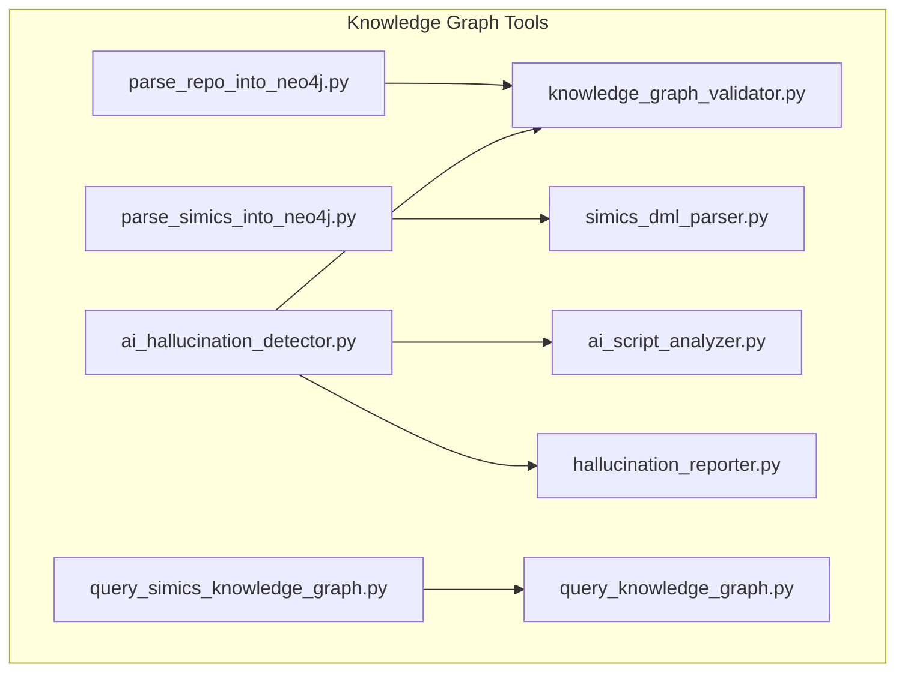
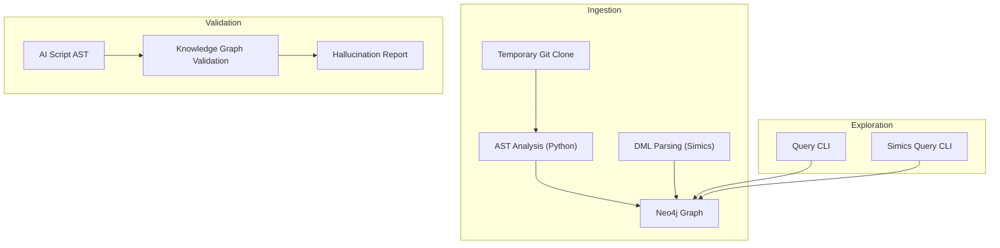
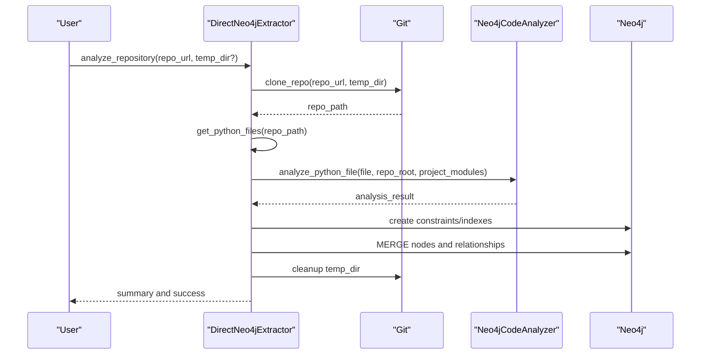
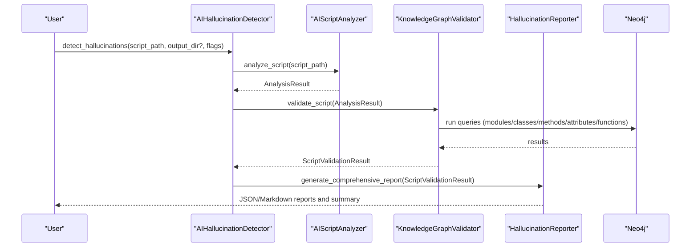
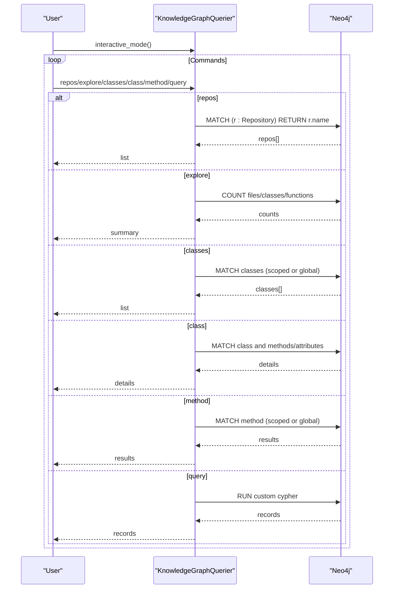
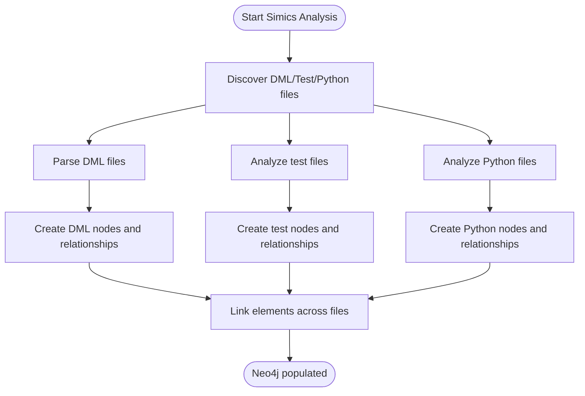
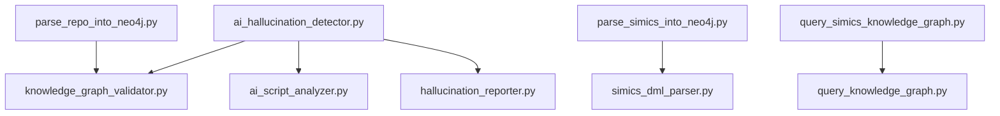

# Knowledge Graph Tools

<cite>
**Referenced Files in This Document**
- [README.md](file://README.md)
- [parse_repo_into_neo4j.py](file://knowledge_graphs/parse_repo_into_neo4j.py)
- [query_knowledge_graph.py](file://knowledge_graphs/query_knowledge_graph.py)
- [ai_hallucination_detector.py](file://knowledge_graphs/ai_hallucination_detector.py)
- [ai_script_analyzer.py](file://knowledge_graphs/ai_script_analyzer.py)
- [knowledge_graph_validator.py](file://knowledge_graphs/knowledge_graph_validator.py)
- [hallucination_reporter.py](file://knowledge_graphs/hallucination_reporter.py)
- [parse_simics_into_neo4j.py](file://knowledge_graphs/parse_simics_into_neo4j.py)
- [simics_dml_parser.py](file://knowledge_graphs/simics_dml_parser.py)
- [query_simics_knowledge_graph.py](file://knowledge_graphs/query_simics_knowledge_graph.py)
</cite>

## Table of Contents
1. [Introduction](#introduction)
2. [Project Structure](#project-structure)
3. [Core Components](#core-components)
4. [Architecture Overview](#architecture-overview)
5. [Detailed Component Analysis](#detailed-component-analysis)
6. [Dependency Analysis](#dependency-analysis)
7. [Performance Considerations](#performance-considerations)
8. [Troubleshooting Guide](#troubleshooting-guide)
9. [Conclusion](#conclusion)
10. [Appendices](#appendices)

## Introduction
This document explains the knowledge graph tools that power AI hallucination detection and repository code analysis. It covers:
- parse_github_repository (via parse_repo_into_neo4j.py)
- check_ai_script_hallucinations (via ai_hallucination_detector.py, ai_script_analyzer.py, knowledge_graph_validator.py, hallucination_reporter.py)
- query_knowledge_graph (via query_knowledge_graph.py and Simics extensions)

It also documents the Neo4j schema design, the repository parsing workflow (including temporary cloning and AST analysis), the AI hallucination detection process, and the query command system with examples and troubleshooting guidance.

## Project Structure
The knowledge graph tools live primarily under knowledge_graphs/. The key modules are:
- Repository parsing and ingestion: parse_repo_into_neo4j.py, parse_simics_into_neo4j.py, simics_dml_parser.py
- AI script analysis: ai_script_analyzer.py
- Knowledge graph validation: knowledge_graph_validator.py
- Hallucination detection orchestration: ai_hallucination_detector.py
- Reporting: hallucination_reporter.py
- Query interfaces: query_knowledge_graph.py, query_simics_knowledge_graph.py

**Diagram sources**
- [parse_repo_into_neo4j.py](file://knowledge_graphs/parse_repo_into_neo4j.py#L1-L120)
- [parse_simics_into_neo4j.py](file://knowledge_graphs/parse_simics_into_neo4j.py#L1-L120)
- [simics_dml_parser.py](file://knowledge_graphs/simics_dml_parser.py#L1-L120)
- [ai_script_analyzer.py](file://knowledge_graphs/ai_script_analyzer.py#L1-L120)
- [knowledge_graph_validator.py](file://knowledge_graphs/knowledge_graph_validator.py#L1-L120)
- [ai_hallucination_detector.py](file://knowledge_graphs/ai_hallucination_detector.py#L1-L120)
- [hallucination_reporter.py](file://knowledge_graphs/hallucination_reporter.py#L1-L120)
- [query_knowledge_graph.py](file://knowledge_graphs/query_knowledge_graph.py#L1-L120)
- [query_simics_knowledge_graph.py](file://knowledge_graphs/query_simics_knowledge_graph.py#L1-L120)

**Section sources**
- [README.md](file://README.md#L626-L714)

## Core Components
- parse_repo_into_neo4j.py: Clones a GitHub repository, analyzes Python files using AST, and writes nodes and relationships directly into Neo4j. It defines Repository, File, Class, Method, Function, Attribute nodes and CONTAINS, DEFINES, HAS_METHOD, HAS_ATTRIBUTE, IMPORTS relationships.
- ai_script_analyzer.py: Parses Python scripts using AST to extract imports, class instantiations, method calls, function calls, and attribute accesses.
- knowledge_graph_validator.py: Validates parsed script elements against the knowledge graph, including imports, class constructors, method calls, attribute access, and function calls. It computes parameter validation and confidence scores.
- ai_hallucination_detector.py: Orchestrates the end-to-end hallucination detection pipeline: AST analysis, knowledge graph validation, and comprehensive reporting.
- hallucination_reporter.py: Generates JSON and Markdown reports summarizing validation results, confidence metrics, and recommendations.
- query_knowledge_graph.py: Interactive CLI to explore repositories, classes, methods, and run custom Cypher queries.
- parse_simics_into_neo4j.py: Extends repository parsing to Simics DML, test, and Python files, creating Simics-specific nodes and relationships.
- simics_dml_parser.py: Parses DML files to extract devices, interfaces, methods, attributes, registers, and relationships.
- query_simics_knowledge_graph.py: Pre-defined Simics queries and an interactive interface for exploring the Simics knowledge graph.

**Section sources**
- [parse_repo_into_neo4j.py](file://knowledge_graphs/parse_repo_into_neo4j.py#L1-L120)
- [ai_script_analyzer.py](file://knowledge_graphs/ai_script_analyzer.py#L1-L120)
- [knowledge_graph_validator.py](file://knowledge_graphs/knowledge_graph_validator.py#L1-L120)
- [ai_hallucination_detector.py](file://knowledge_graphs/ai_hallucination_detector.py#L1-L120)
- [hallucination_reporter.py](file://knowledge_graphs/hallucination_reporter.py#L1-L120)
- [query_knowledge_graph.py](file://knowledge_graphs/query_knowledge_graph.py#L1-L120)
- [parse_simics_into_neo4j.py](file://knowledge_graphs/parse_simics_into_neo4j.py#L1-L120)
- [simics_dml_parser.py](file://knowledge_graphs/simics_dml_parser.py#L1-L120)
- [query_simics_knowledge_graph.py](file://knowledge_graphs/query_simics_knowledge_graph.py#L1-L120)

## Architecture Overview
The knowledge graph architecture consists of:
- Data ingestion: Temporary cloning and AST-based parsing of Python code into Neo4j nodes and relationships.
- Validation: AST-based analysis of AI-generated scripts matched against the knowledge graph to detect hallucinations.
- Exploration: Interactive CLI and Simics-specific query interfaces to explore the graph.

**Diagram sources**
- [parse_repo_into_neo4j.py](file://knowledge_graphs/parse_repo_into_neo4j.py#L480-L612)
- [simics_dml_parser.py](file://knowledge_graphs/simics_dml_parser.py#L120-L180)
- [ai_script_analyzer.py](file://knowledge_graphs/ai_script_analyzer.py#L93-L133)
- [knowledge_graph_validator.py](file://knowledge_graphs/knowledge_graph_validator.py#L129-L164)
- [hallucination_reporter.py](file://knowledge_graphs/hallucination_reporter.py#L21-L60)
- [query_knowledge_graph.py](file://knowledge_graphs/query_knowledge_graph.py#L1-L60)
- [query_simics_knowledge_graph.py](file://knowledge_graphs/query_simics_knowledge_graph.py#L1-L60)

## Detailed Component Analysis

### parse_github_repository (parse_repo_into_neo4j.py)
- Purpose: Clone a GitHub repository (with shallow depth), scan Python files, extract classes, methods, functions, and imports, and write them into Neo4j with appropriate constraints and indexes.
- Key parameters:
  - repo_url: GitHub repository URL ending with .git
  - temp_dir: Optional temporary directory for cloning
- Domain models:
  - Nodes: Repository, File, Class, Method, Function, Attribute
  - Relationships: CONTAINS, DEFINES, HAS_METHOD, HAS_ATTRIBUTE, IMPORTS
- Implementation highlights:
  - Shallow clone to minimize bandwidth and time
  - AST-based analysis to extract public classes, methods, functions, and internal imports
  - Module name resolution to distinguish internal vs external imports
  - MERGE semantics to avoid duplicates and maintain idempotency
  - Constraints and indexes for performance and uniqueness
- Neo4j schema:
  - Unique constraints: File.path, Class.full_name
  - Indexes: File.name, Class.name, Method.name
- Typical Cypher patterns used:
  - MERGE for nodes and relationships
  - MATCH with WHERE clauses to connect Repository/File/Class/Method/Function
  - OPTIONAL MATCH to resolve imports to target files
- Example Cypher snippets (paths):
  - [MERGE File and connect to Repository](file://knowledge_graphs/parse_repo_into_neo4j.py#L625-L650)
  - [MERGE Class and connect to File](file://knowledge_graphs/parse_repo_into_neo4j.py#L651-L667)
  - [MERGE Method and connect to Class](file://knowledge_graphs/parse_repo_into_neo4j.py#L668-L704)
  - [MERGE Attribute and connect to Class](file://knowledge_graphs/parse_repo_into_neo4j.py#L705-L734)
  - [MERGE Function and connect to File](file://knowledge_graphs/parse_repo_into_neo4j.py#L735-L765)
  - [Create IMPORTS relationships](file://knowledge_graphs/parse_repo_into_neo4j.py#L766-L778)
  - [Constraints and indexes](file://knowledge_graphs/parse_repo_into_neo4j.py#L421-L434)

**Diagram sources**
- [parse_repo_into_neo4j.py](file://knowledge_graphs/parse_repo_into_neo4j.py#L529-L612)

**Section sources**
- [parse_repo_into_neo4j.py](file://knowledge_graphs/parse_repo_into_neo4j.py#L480-L804)

### check_ai_script_hallucinations (ai_hallucination_detector.py, ai_script_analyzer.py, knowledge_graph_validator.py, hallucination_reporter.py)
- Purpose: Validate AI-generated Python scripts against the knowledge graph to detect hallucinations (non-existent classes, methods, attributes, incorrect parameters).
- Workflow:
  1. AST analysis of the script to extract imports, class instantiations, method/function calls, and attribute accesses.
  2. Knowledge graph validation to confirm existence and signatures.
  3. Report generation with confidence scores and recommendations.
- Key parameters:
  - script_path: Path to the Python script to validate
  - output_dir: Directory to save reports
  - save_json/save_markdown/print_summary: Controls report generation and output
- Data models:
  - AnalysisResult: Aggregates imports, class instantiations, method calls, function calls, attribute accesses, and variable type tracking.
  - ValidationResult: Encapsulates status, confidence, message, details, and suggestions.
  - ScriptValidationResult: Aggregates validation results for the entire script.
- Validation logic:
  - Imports: Match module names to files in the knowledge graph; external modules are treated as uncertain but not errors.
  - Class instantiations: Locate class in knowledge graph and validate constructor parameters.
  - Method calls: Locate method on the object’s class and validate parameters.
  - Attribute access: Locate attribute on the object’s class; if not found, check if it is a method used as a decorator.
  - Function calls: Locate function in the knowledge graph and validate parameters.
- Parameter validation:
  - Parses expected parameters (positional, keyword-only, varargs, varkwargs) and compares with provided args/kwargs.
  - Computes confidence and suggestions for invalid parameters.
- Example Cypher snippets (paths):
  - [Find modules by module name](file://knowledge_graphs/knowledge_graph_validator.py#L644-L704)
  - [Get classes/functions for a repository](file://knowledge_graphs/knowledge_graph_validator.py#L705-L772)
  - [Find class by full_name](file://knowledge_graphs/knowledge_graph_validator.py#L773-L840)
  - [Find method by class and method name](file://knowledge_graphs/knowledge_graph_validator.py#L841-L910)
  - [Find attribute by class and attribute name](file://knowledge_graphs/knowledge_graph_validator.py#L911-L980)
  - [Find function by full_name](file://knowledge_graphs/knowledge_graph_validator.py#L981-L1050)

**Diagram sources**
- [ai_hallucination_detector.py](file://knowledge_graphs/ai_hallucination_detector.py#L48-L122)
- [ai_script_analyzer.py](file://knowledge_graphs/ai_script_analyzer.py#L93-L133)
- [knowledge_graph_validator.py](file://knowledge_graphs/knowledge_graph_validator.py#L129-L164)
- [hallucination_reporter.py](file://knowledge_graphs/hallucination_reporter.py#L21-L60)

**Section sources**
- [ai_hallucination_detector.py](file://knowledge_graphs/ai_hallucination_detector.py#L1-L203)
- [ai_script_analyzer.py](file://knowledge_graphs/ai_script_analyzer.py#L1-L120)
- [knowledge_graph_validator.py](file://knowledge_graphs/knowledge_graph_validator.py#L129-L200)
- [hallucination_reporter.py](file://knowledge_graphs/hallucination_reporter.py#L1-L120)

### query_knowledge_graph (query_knowledge_graph.py)
- Purpose: Interactive CLI to explore the knowledge graph with commands like repos, explore, classes, class, method, query, and custom Cypher.
- Command system:
  - repos: List repositories
  - explore <repo>: Overview of files, classes, functions in a repository
  - classes [repo]: List classes (optionally scoped to a repository)
  - class <name>: Explore a specific class and show methods/attributes
  - method <name> [class]: Search for a method (optionally scoped to a class)
  - query <cypher>: Run a custom Cypher query
  - quit: Exit
- Example Cypher snippets (paths):
  - [List repositories](file://knowledge_graphs/query_knowledge_graph.py#L40-L59)
  - [Explore repository counts](file://knowledge_graphs/query_knowledge_graph.py#L60-L93)
  - [List classes](file://knowledge_graphs/query_knowledge_graph.py#L94-L132)
  - [Explore class details](file://knowledge_graphs/query_knowledge_graph.py#L133-L211)
  - [Search method](file://knowledge_graphs/query_knowledge_graph.py#L212-L264)
  - [Run custom query](file://knowledge_graphs/query_knowledge_graph.py#L265-L294)

**Diagram sources**
- [query_knowledge_graph.py](file://knowledge_graphs/query_knowledge_graph.py#L296-L399)

**Section sources**
- [query_knowledge_graph.py](file://knowledge_graphs/query_knowledge_graph.py#L1-L399)

### Simics Extensions (parse_simics_into_neo4j.py, simics_dml_parser.py, query_simics_knowledge_graph.py)
- Purpose: Extend knowledge graph ingestion and querying to Simics DML, test, and Python files.
- DML parsing:
  - Extracts devices, interfaces, methods, attributes, registers, imports, and templates from DML files.
  - Links elements to devices and resolves inheritance.
- Simics ingestion:
  - Creates Simics-specific nodes (DMLDevice, DMLInterface, DMLMethod, DMLAttribute, DMLRegister, TestFile, TestFunction, TestFixture, SimicsAPI) and relationships (INHERITS_FROM, DEFINES, HAS_METHOD, HAS_ATTRIBUTE, CONTAINS, USES_API, TESTS).
  - Sets up constraints and indexes for Simics node types.
- Simics querying:
  - Pre-defined queries for device hierarchy, interfaces, methods, registers, test coverage, API usage, test patterns, dependencies, cross-language links, similar devices, fixtures, and stats.
  - Interactive mode with help, list, stats, query, custom, and quit commands.

**Diagram sources**
- [parse_simics_into_neo4j.py](file://knowledge_graphs/parse_simics_into_neo4j.py#L129-L224)
- [simics_dml_parser.py](file://knowledge_graphs/simics_dml_parser.py#L120-L180)
- [query_simics_knowledge_graph.py](file://knowledge_graphs/query_simics_knowledge_graph.py#L70-L123)

**Section sources**
- [parse_simics_into_neo4j.py](file://knowledge_graphs/parse_simics_into_neo4j.py#L1-L224)
- [simics_dml_parser.py](file://knowledge_graphs/simics_dml_parser.py#L1-L180)
- [query_simics_knowledge_graph.py](file://knowledge_graphs/query_simics_knowledge_graph.py#L1-L123)

## Dependency Analysis
- parse_repo_into_neo4j.py depends on:
  - neo4j driver for asynchronous operations
  - ast for Python AST analysis
  - subprocess/shutil for temporary cloning and cleanup
- ai_script_analyzer.py depends on:
  - ast for Python AST analysis
  - dataclasses for structured results
- knowledge_graph_validator.py depends on:
  - neo4j driver for Cypher queries
  - ai_script_analyzer types for validation
  - caches for performance
- ai_hallucination_detector.py composes:
  - AIScriptAnalyzer, KnowledgeGraphValidator, HallucinationReporter
- query_knowledge_graph.py depends on:
  - neo4j driver for queries
  - argparse for CLI
- parse_simics_into_neo4j.py extends:
  - DirectNeo4jExtractor and adds DMLParser and SimicsTestAnalyzer
- query_simics_knowledge_graph.py extends:
  - KnowledgeGraphQuerier with Simics-specific queries

**Diagram sources**
- [parse_repo_into_neo4j.py](file://knowledge_graphs/parse_repo_into_neo4j.py#L1-L120)
- [ai_script_analyzer.py](file://knowledge_graphs/ai_script_analyzer.py#L1-L120)
- [knowledge_graph_validator.py](file://knowledge_graphs/knowledge_graph_validator.py#L1-L120)
- [ai_hallucination_detector.py](file://knowledge_graphs/ai_hallucination_detector.py#L1-L120)
- [hallucination_reporter.py](file://knowledge_graphs/hallucination_reporter.py#L1-L120)
- [query_knowledge_graph.py](file://knowledge_graphs/query_knowledge_graph.py#L1-L120)
- [parse_simics_into_neo4j.py](file://knowledge_graphs/parse_simics_into_neo4j.py#L1-L120)
- [simics_dml_parser.py](file://knowledge_graphs/simics_dml_parser.py#L1-L120)
- [query_simics_knowledge_graph.py](file://knowledge_graphs/query_simics_knowledge_graph.py#L1-L120)

**Section sources**
- [parse_repo_into_neo4j.py](file://knowledge_graphs/parse_repo_into_neo4j.py#L1-L120)
- [ai_script_analyzer.py](file://knowledge_graphs/ai_script_analyzer.py#L1-L120)
- [knowledge_graph_validator.py](file://knowledge_graphs/knowledge_graph_validator.py#L1-L120)
- [ai_hallucination_detector.py](file://knowledge_graphs/ai_hallucination_detector.py#L1-L120)
- [hallucination_reporter.py](file://knowledge_graphs/hallucination_reporter.py#L1-L120)
- [query_knowledge_graph.py](file://knowledge_graphs/query_knowledge_graph.py#L1-L120)
- [parse_simics_into_neo4j.py](file://knowledge_graphs/parse_simics_into_neo4j.py#L1-L120)
- [simics_dml_parser.py](file://knowledge_graphs/simics_dml_parser.py#L1-L120)
- [query_simics_knowledge_graph.py](file://knowledge_graphs/query_simics_knowledge_graph.py#L1-L120)

## Performance Considerations
- Repository parsing:
  - Shallow clone reduces network and disk usage.
  - AST parsing is CPU-bound; limit concurrency and file sizes.
  - MERGE operations prevent duplicates but add overhead; ensure constraints and indexes are created.
- Validation:
  - Caching module/class/method/function lookups reduces repeated queries.
  - Parameter validation parses expected signatures; keep expected params lists concise.
- Querying:
  - Use indexes on frequently queried labels and properties (e.g., File.name, Class.name, Method.name).
  - Prefer scoped queries (by repository or class) to reduce result sets.
- Simics ingestion:
  - DML parsing uses regex patterns; ensure patterns are efficient and avoid excessive backtracking.
  - Relationship creation can be expensive; batch operations where possible.

[No sources needed since this section provides general guidance]

## Troubleshooting Guide
Common issues and resolutions:
- Neo4j connection failures:
  - Verify NEO4J_URI, NEO4J_USER, and NEO4J_PASSWORD in environment variables.
  - Ensure Neo4j is running and reachable on the specified URI/port.
  - Check firewall and Docker networking if using containers.
- Authentication errors:
  - Confirm the password is set and not the default placeholder.
  - For Simics CLI, ensure --neo4j-password or NEO4J_PASSWORD is provided.
- Schema mismatches:
  - Ensure constraints and indexes are created before ingestion.
  - If re-running ingestion, clear existing data for the repository before re-processing.
- Large repository parsing:
  - Increase timeouts and monitor memory usage.
  - Filter files by size and exclude tests/examples if needed.
- Validation false positives/negatives:
  - Confirm module names and full names match the knowledge graph.
  - Review parameter validation expectations; ensure signatures are correctly captured.
- Query performance:
  - Add indexes for labels and properties used in filters.
  - Use LIMIT and WHERE clauses to constrain result sets.

**Section sources**
- [parse_repo_into_neo4j.py](file://knowledge_graphs/parse_repo_into_neo4j.py#L406-L436)
- [query_knowledge_graph.py](file://knowledge_graphs/query_knowledge_graph.py#L350-L399)
- [query_simics_knowledge_graph.py](file://knowledge_graphs/query_simics_knowledge_graph.py#L480-L545)

## Conclusion
The knowledge graph tools provide a robust pipeline for ingesting repository code into Neo4j, validating AI-generated scripts against real codebases, and exploring the resulting graph. By leveraging AST analysis, Cypher queries, and structured reporting, the system helps detect and mitigate AI hallucinations while offering powerful exploration capabilities for both generic Python repositories and Simics codebases.

[No sources needed since this section summarizes without analyzing specific files]

## Appendices

### Neo4j Schema Design
- Nodes:
  - Repository: GitHub repositories
  - File: Python files within repositories
  - Class: Python classes with methods and attributes
  - Method: Class methods with parameter information
  - Function: Standalone functions
  - Attribute: Class attributes
- Relationships:
  - Repository-[:CONTAINS]->File
  - File-[:DEFINES]->Class
  - File-[:DEFINES]->Function
  - Class-[:HAS_METHOD]->Method
  - Class-[:HAS_ATTRIBUTE]->Attribute
  - File-[:IMPORTS]->File (internal imports)

**Section sources**
- [README.md](file://README.md#L638-L662)
- [parse_repo_into_neo4j.py](file://knowledge_graphs/parse_repo_into_neo4j.py#L612-L783)

### Usage Patterns and Examples
- parse_github_repository:
  - Clone and analyze a repository; see constraints and indexes creation and node/relationship creation.
  - Paths: [Constraints and indexes](file://knowledge_graphs/parse_repo_into_neo4j.py#L421-L434), [Node/relationship creation](file://knowledge_graphs/parse_repo_into_neo4j.py#L612-L783)
- check_ai_script_hallucinations:
  - Analyze script, validate against knowledge graph, and generate reports.
  - Paths: [AST analysis](file://knowledge_graphs/ai_script_analyzer.py#L93-L133), [Validation](file://knowledge_graphs/knowledge_graph_validator.py#L129-L164), [Report generation](file://knowledge_graphs/hallucination_reporter.py#L21-L60)
- query_knowledge_graph:
  - Interactive commands and custom queries.
  - Paths: [Commands and queries](file://knowledge_graphs/query_knowledge_graph.py#L296-L399)
- Simics extensions:
  - DML parsing and Simics-specific ingestion and querying.
  - Paths: [DML parsing](file://knowledge_graphs/simics_dml_parser.py#L120-L180), [Simics ingestion](file://knowledge_graphs/parse_simics_into_neo4j.py#L225-L310), [Simics queries](file://knowledge_graphs/query_simics_knowledge_graph.py#L70-L123)

**Section sources**
- [parse_repo_into_neo4j.py](file://knowledge_graphs/parse_repo_into_neo4j.py#L421-L783)
- [ai_script_analyzer.py](file://knowledge_graphs/ai_script_analyzer.py#L93-L133)
- [knowledge_graph_validator.py](file://knowledge_graphs/knowledge_graph_validator.py#L129-L164)
- [hallucination_reporter.py](file://knowledge_graphs/hallucination_reporter.py#L21-L60)
- [query_knowledge_graph.py](file://knowledge_graphs/query_knowledge_graph.py#L296-L399)
- [simics_dml_parser.py](file://knowledge_graphs/simics_dml_parser.py#L120-L180)
- [parse_simics_into_neo4j.py](file://knowledge_graphs/parse_simics_into_neo4j.py#L225-L310)
- [query_simics_knowledge_graph.py](file://knowledge_graphs/query_simics_knowledge_graph.py#L70-L123)