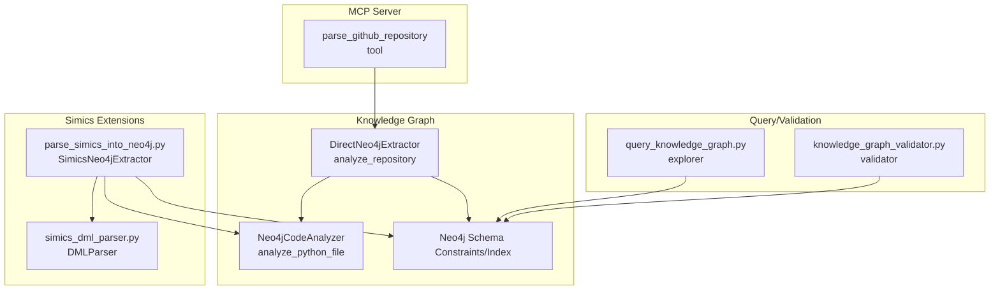
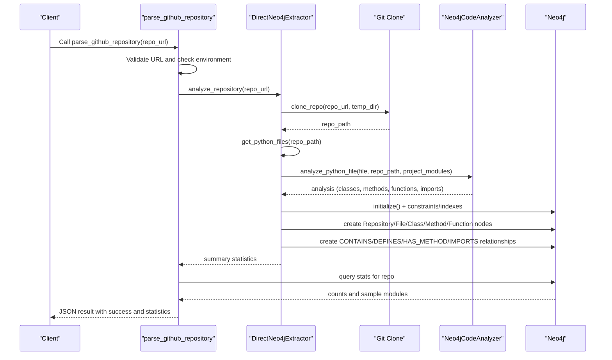
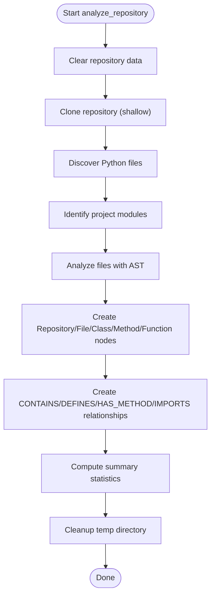
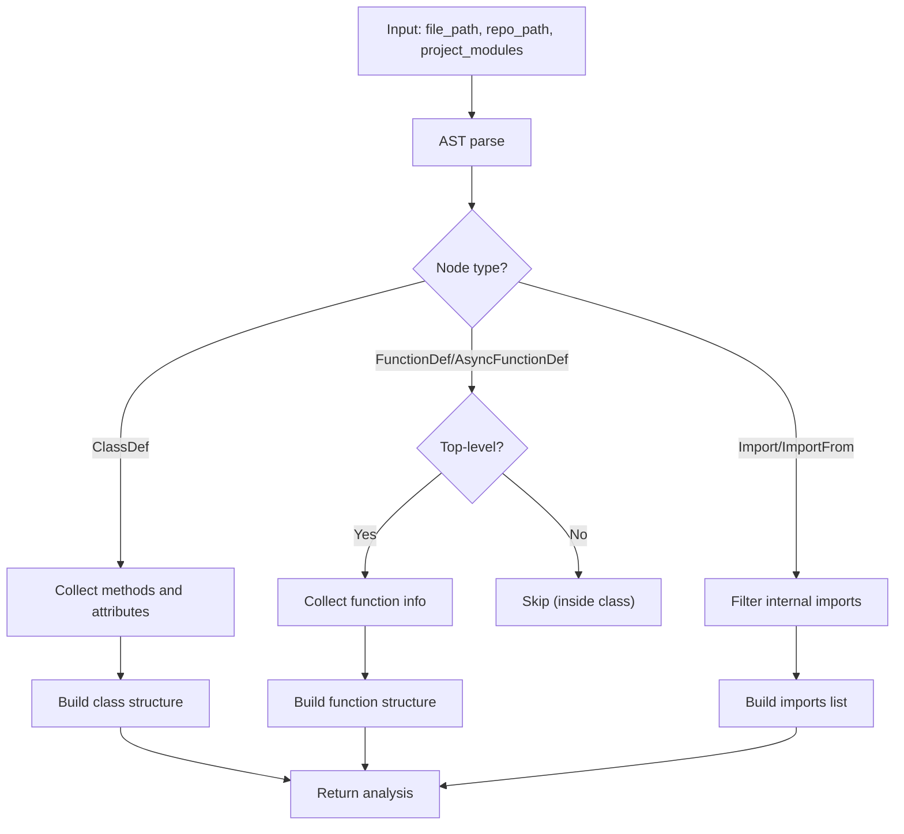
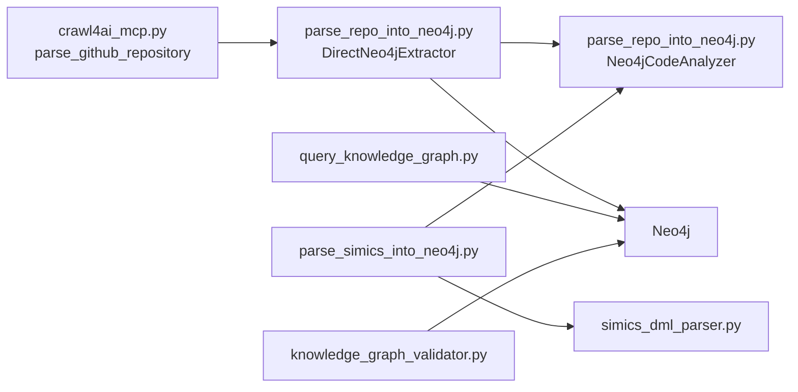

# Repository Parsing

<cite>
**Referenced Files in This Document**
- [parse_repo_into_neo4j.py](file://knowledge_graphs/parse_repo_into_neo4j.py)
- [crawl4ai_mcp.py](file://src/crawl4ai_mcp.py)
- [query_knowledge_graph.py](file://knowledge_graphs/query_knowledge_graph.py)
- [knowledge_graph_validator.py](file://knowledge_graphs/knowledge_graph_validator.py)
- [parse_simics_into_neo4j.py](file://knowledge_graphs/parse_simics_into_neo4j.py)
- [simics_dml_parser.py](file://knowledge_graphs/simics_dml_parser.py)
</cite>

## Table of Contents
1. [Introduction](#introduction)
2. [Project Structure](#project-structure)
3. [Core Components](#core-components)
4. [Architecture Overview](#architecture-overview)
5. [Detailed Component Analysis](#detailed-component-analysis)
6. [Dependency Analysis](#dependency-analysis)
7. [Performance Considerations](#performance-considerations)
8. [Troubleshooting Guide](#troubleshooting-guide)
9. [Conclusion](#conclusion)

## Introduction
This document explains the repository parsing functionality that extracts Python code structure from a GitHub repository and stores it in a Neo4j knowledge graph. It covers the parse_github_repository tool, the Neo4j schema design, the parsing workflow (temporary cloning, AST analysis), module identification, and usage patterns. It also provides troubleshooting guidance for common issues and performance optimization tips for large repositories.

## Project Structure
The repository parsing capability spans several modules:
- Knowledge graph ingestion and querying
- MCP tooling that orchestrates repository parsing
- Simics-specific extensions for DML and test analysis

**Diagram sources**
- [crawl4ai_mcp.py](file://src/crawl4ai_mcp.py#L2057-L2185)
- [parse_repo_into_neo4j.py](file://knowledge_graphs/parse_repo_into_neo4j.py#L529-L858)
- [query_knowledge_graph.py](file://knowledge_graphs/query_knowledge_graph.py#L1-L400)
- [knowledge_graph_validator.py](file://knowledge_graphs/knowledge_graph_validator.py#L1-L1244)
- [parse_simics_into_neo4j.py](file://knowledge_graphs/parse_simics_into_neo4j.py#L1-L717)
- [simics_dml_parser.py](file://knowledge_graphs/simics_dml_parser.py#L1-L467)

**Section sources**
- [crawl4ai_mcp.py](file://src/crawl4ai_mcp.py#L2057-L2185)
- [parse_repo_into_neo4j.py](file://knowledge_graphs/parse_repo_into_neo4j.py#L529-L858)
- [query_knowledge_graph.py](file://knowledge_graphs/query_knowledge_graph.py#L1-L400)
- [knowledge_graph_validator.py](file://knowledge_graphs/knowledge_graph_validator.py#L1-L1244)
- [parse_simics_into_neo4j.py](file://knowledge_graphs/parse_simics_into_neo4j.py#L1-L717)
- [simics_dml_parser.py](file://knowledge_graphs/simics_dml_parser.py#L1-L467)

## Core Components
- parse_github_repository: An MCP tool that validates a GitHub URL, triggers repository analysis, and returns statistics from Neo4j.
- DirectNeo4jExtractor: Orchestrates cloning, file discovery, AST analysis, and Neo4j graph creation.
- Neo4jCodeAnalyzer: Parses Python files with AST to extract classes, methods, functions, and imports; determines module names.
- KnowledgeGraphQuerier: Interactive tool to explore the knowledge graph contents.
- KnowledgeGraphValidator: Validates AI-generated code against the knowledge graph (imports, methods, attributes, parameters).
- SimicsNeo4jExtractor and DMLParser: Extended analyzers for Simics DML and test files.

**Section sources**
- [crawl4ai_mcp.py](file://src/crawl4ai_mcp.py#L2057-L2185)
- [parse_repo_into_neo4j.py](file://knowledge_graphs/parse_repo_into_neo4j.py#L396-L858)
- [query_knowledge_graph.py](file://knowledge_graphs/query_knowledge_graph.py#L1-L400)
- [knowledge_graph_validator.py](file://knowledge_graphs/knowledge_graph_validator.py#L1-L1244)
- [parse_simics_into_neo4j.py](file://knowledge_graphs/parse_simics_into_neo4j.py#L1-L717)
- [simics_dml_parser.py](file://knowledge_graphs/simics_dml_parser.py#L1-L467)

## Architecture Overview
The repository parsing workflow integrates MCP orchestration, Git cloning, AST analysis, and Neo4j persistence.

**Diagram sources**
- [crawl4ai_mcp.py](file://src/crawl4ai_mcp.py#L2057-L2185)
- [parse_repo_into_neo4j.py](file://knowledge_graphs/parse_repo_into_neo4j.py#L529-L858)

## Detailed Component Analysis

### parse_github_repository (MCP Tool)
- Purpose: Validate GitHub URL, trigger repository analysis, and return Neo4j statistics.
- Key steps:
  - Environment checks for knowledge graph enablement.
  - URL validation.
  - Invoke repo extractor’s analyze_repository.
  - Query Neo4j for repository-wide statistics (files, classes, methods, functions, attributes).
- Output: JSON with success flag, repository info, and statistics.

**Section sources**
- [crawl4ai_mcp.py](file://src/crawl4ai_mcp.py#L2057-L2185)

### DirectNeo4jExtractor.analyze_repository
- Purpose: End-to-end repository parsing and Neo4j ingestion.
- Workflow:
  - Clear previous data for the repository.
  - Clone repository (shallow) to a temporary directory.
  - Discover Python files (excluding tests and common non-source dirs).
  - Identify project modules by scanning file paths.
  - Analyze files with AST and collect structure.
  - Create nodes and relationships in Neo4j.
  - Cleanup temporary directory.

**Diagram sources**
- [parse_repo_into_neo4j.py](file://knowledge_graphs/parse_repo_into_neo4j.py#L529-L858)

**Section sources**
- [parse_repo_into_neo4j.py](file://knowledge_graphs/parse_repo_into_neo4j.py#L529-L858)

### Neo4jCodeAnalyzer.analyze_python_file
- Purpose: Parse a single Python file and extract classes, methods, functions, and imports.
- AST processing highlights:
  - Extract public classes and their methods/attributes.
  - Extract top-level public functions.
  - Extract comprehensive parameter information (names, types, kinds, optionality, defaults).
  - Determine module names considering packages and common project roots.
  - Identify internal imports by checking against known project modules and external module blacklist.

**Diagram sources**
- [parse_repo_into_neo4j.py](file://knowledge_graphs/parse_repo_into_neo4j.py#L65-L213)

**Section sources**
- [parse_repo_into_neo4j.py](file://knowledge_graphs/parse_repo_into_neo4j.py#L65-L213)

### Module Name Determination
- Default conversion from file path to module path.
- Detect package boundaries using __init__.py.
- Skip common non-package directories (e.g., src/lib).
- Fallback to default module name.

**Section sources**
- [parse_repo_into_neo4j.py](file://knowledge_graphs/parse_repo_into_neo4j.py#L214-L256)

### Neo4j Schema Design
- Node types:
  - Repository: Root node representing the parsed repository.
  - File: Represents a Python file with name, path, module_name, line_count.
  - Class: Represents a class with name and full_name.
  - Method: Represents a method with name, full_name, args, params_list, params_detailed, return_type.
  - Function: Represents a top-level function with name, full_name, args, params_list, params_detailed, return_type.
  - Attribute: Represents a class attribute with name, full_name, type.
- Relationships:
  - CONTAINS: Repository -> File
  - DEFINES: File -> Class, File -> Function
  - HAS_METHOD: Class -> Method
  - HAS_ATTRIBUTE: Class -> Attribute
  - IMPORTS: File -> File (internal imports)

Constraints and indexes:
- Unique constraints: File.path, Class.full_name.
- Indexes: File.name, Class.name, Method.name.

**Section sources**
- [parse_repo_into_neo4j.py](file://knowledge_graphs/parse_repo_into_neo4j.py#L412-L461)
- [parse_repo_into_neo4j.py](file://knowledge_graphs/parse_repo_into_neo4j.py#L612-L782)

### Repository Parsing Workflow: From GitHub URL to Neo4j Storage
- Temporary cloning: Shallow clone to reduce bandwidth and time.
- File discovery: Walk repository, exclude tests and non-source directories, filter by size and filename.
- Module identification: Build candidate module names from file paths.
- AST analysis: Extract classes, methods, functions, and imports.
- Graph creation: Create nodes and relationships using MERGE to avoid duplicates.
- Querying: Retrieve statistics and sample modules for reporting.

**Section sources**
- [parse_repo_into_neo4j.py](file://knowledge_graphs/parse_repo_into_neo4j.py#L480-L528)
- [parse_repo_into_neo4j.py](file://knowledge_graphs/parse_repo_into_neo4j.py#L529-L782)
- [crawl4ai_mcp.py](file://src/crawl4ai_mcp.py#L2057-L2185)

### Usage Patterns
- Command-line usage of the repository extractor:
  - Initialize, analyze a repository, and run direct Neo4j queries for imports, classes, and methods.
- MCP tool usage:
  - Call parse_github_repository with a GitHub URL; the tool returns statistics and readiness for validation.

**Section sources**
- [parse_repo_into_neo4j.py](file://knowledge_graphs/parse_repo_into_neo4j.py#L814-L858)
- [crawl4ai_mcp.py](file://src/crawl4ai_mcp.py#L2057-L2185)

### Simics Extensions
- SimicsNeo4jExtractor extends the base extractor to support:
  - Local directory analysis.
  - DML parsing and Neo4j creation for devices, interfaces, methods, attributes, registers.
  - Test analysis and linking to DML devices.
  - Additional constraints and indexes for Simics node types.
- DMLParser extracts devices, interfaces, methods, attributes, registers, and imports from DML files.

**Section sources**
- [parse_simics_into_neo4j.py](file://knowledge_graphs/parse_simics_into_neo4j.py#L1-L717)
- [simics_dml_parser.py](file://knowledge_graphs/simics_dml_parser.py#L1-L467)

## Dependency Analysis
- parse_github_repository depends on the repository extractor instance configured in the MCP server context.
- DirectNeo4jExtractor depends on Neo4j driver and uses async sessions for initialization, schema setup, and graph creation.
- Neo4jCodeAnalyzer depends on Python AST and a curated list of external modules to distinguish internal vs external imports.
- KnowledgeGraphQuerier and KnowledgeGraphValidator depend on Neo4j queries to explore and validate the graph.

**Diagram sources**
- [crawl4ai_mcp.py](file://src/crawl4ai_mcp.py#L2057-L2185)
- [parse_repo_into_neo4j.py](file://knowledge_graphs/parse_repo_into_neo4j.py#L396-L858)
- [query_knowledge_graph.py](file://knowledge_graphs/query_knowledge_graph.py#L1-L400)
- [knowledge_graph_validator.py](file://knowledge_graphs/knowledge_graph_validator.py#L1-L1244)
- [parse_simics_into_neo4j.py](file://knowledge_graphs/parse_simics_into_neo4j.py#L1-L717)
- [simics_dml_parser.py](file://knowledge_graphs/simics_dml_parser.py#L1-L467)

**Section sources**
- [crawl4ai_mcp.py](file://src/crawl4ai_mcp.py#L2057-L2185)
- [parse_repo_into_neo4j.py](file://knowledge_graphs/parse_repo_into_neo4j.py#L396-L858)
- [query_knowledge_graph.py](file://knowledge_graphs/query_knowledge_graph.py#L1-L400)
- [knowledge_graph_validator.py](file://knowledge_graphs/knowledge_graph_validator.py#L1-L1244)
- [parse_simics_into_neo4j.py](file://knowledge_graphs/parse_simics_into_neo4j.py#L1-L717)
- [simics_dml_parser.py](file://knowledge_graphs/simics_dml_parser.py#L1-L467)

## Performance Considerations
- Use shallow clone to minimize bandwidth and time for large repositories.
- Filter out non-source directories and large files to reduce analysis overhead.
- Use MERGE for nodes to avoid duplicates and reduce write contention.
- Create indexes on frequently queried labels (File.name, Class.name, Method.name).
- Batch processing and periodic logging to monitor progress for very large repositories.
- Consider limiting concurrency when invoking multiple Neo4j operations if needed.

[No sources needed since this section provides general guidance]

## Troubleshooting Guide
Common issues and resolutions:
- Neo4j connection failures:
  - Verify NEO4J_URI and ensure Neo4j is running.
  - Confirm credentials (NEO4J_USER, NEO4J_PASSWORD).
- Authentication errors:
  - Check NEO4J_USER and NEO4J_PASSWORD.
  - Ensure the database exists and is accessible.
- Schema mismatches:
  - Confirm constraints and indexes exist for File.path and Class.full_name.
  - Re-run initialization to create constraints/indexes.
- Large repository performance:
  - Use shallow clone and exclude non-source directories.
  - Monitor progress logs and adjust filtering criteria.
- Cleanup failures:
  - Temporary directory removal may fail if files are locked; the process continues despite cleanup warnings.

**Section sources**
- [crawl4ai_mcp.py](file://src/crawl4ai_mcp.py#L73-L102)
- [parse_repo_into_neo4j.py](file://knowledge_graphs/parse_repo_into_neo4j.py#L412-L461)
- [parse_repo_into_neo4j.py](file://knowledge_graphs/parse_repo_into_neo4j.py#L594-L611)

## Conclusion
The repository parsing pipeline provides a fast, AST-driven approach to build a Neo4j knowledge graph from GitHub repositories. It supports module-aware import resolution, deduplication via MERGE, and efficient indexing. The MCP tool exposes a simple interface to parse repositories and retrieve statistics, while the Simics extension adds specialized capabilities for DML and test analysis. For robust operation, ensure proper Neo4j configuration, apply schema constraints/indexes, and tune repository filtering for large-scale ingestion.