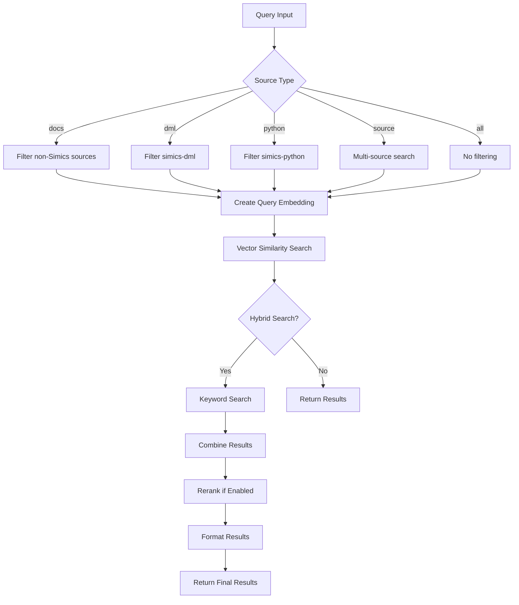
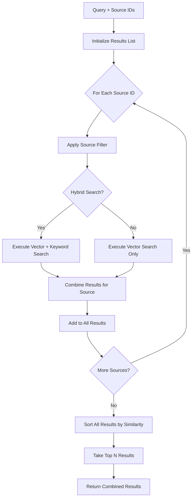
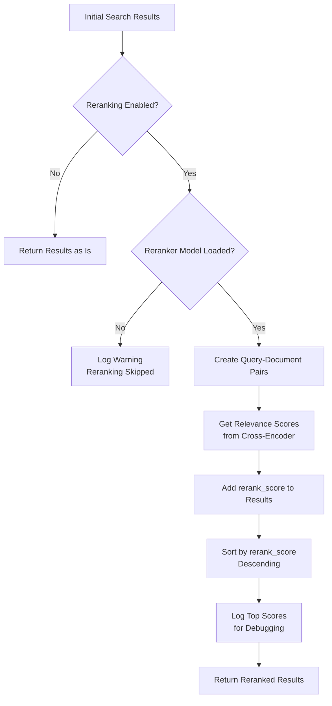

# RAG Search Tools

<cite>
**Referenced Files in This Document**   
- [crawl4ai_mcp.py](file://src/crawl4ai_mcp.py)
- [utils.py](file://src/utils.py)
- [query_rag.py](file://scripts/query_rag.py)
- [crawled_pages.sql](file://crawled_pages.sql)
- [README.md](file://README.md)
- [debug_search.py](file://scripts/debug_search.py)
</cite>

## Table of Contents
1. [Introduction](#introduction)
2. [Core Search Implementation](#core-search-implementation)
3. [Hybrid Search Functionality](#hybrid-search-functionality)
4. [Multi-Source Search Mechanism](#multi-source-search-mechanism)
5. [Reranking Process](#reranking-process)
6. [Search Result Formatting](#search-result-formatting)
7. [Source Filtering](#source-filtering)
8. [Common Issues and Troubleshooting](#common-issues-and-troubleshooting)
9. [Performance Optimization](#performance-optimization)
10. [Conclusion](#conclusion)

## Introduction
The RAG search tools in this system provide a comprehensive framework for retrieving relevant information from crawled content stored in Supabase vector storage. The system implements advanced search capabilities including hybrid search (combining vector and keyword search), multi-source querying, and optional reranking with CrossEncoder models. These tools are designed to support AI agents and coding assistants by providing precise and relevant information retrieval from both documentation and source code repositories. The implementation leverages Supabase's vector database capabilities with pgvector for efficient similarity search, while incorporating multiple optimization strategies to improve result relevance and performance.

**Section sources**
- [README.md](file://README.md#L1-L773)

## Core Search Implementation
The `perform_rag_query` function serves as the primary interface for executing RAG queries against the system's knowledge base. This function orchestrates the entire search process, from query processing to result formatting. It accepts several parameters including the search query, source type filter, match count, and hybrid search flag. The function first determines the appropriate filtering strategy based on the source_type parameter, which can be 'docs', 'dml', 'python', 'source', or 'all'. For 'docs' type, it queries all non-Simics sources by excluding 'simics-dml' and 'simics-python' from the search. For 'dml' and 'python' types, it filters specifically for Simics DML and Python sources respectively. The 'source' type triggers a multi-source search across both Simics DML and Python sources.

The search process begins by creating an embedding for the query text using the configured embedding model (Qwen, Copilot, or OpenAI). This embedding is then used to perform vector similarity search against the Supabase database through the `match_crawled_pages` RPC function. The search can be configured to use hybrid search by setting the `USE_HYBRID_SEARCH` environment variable to "true". The function handles both single-source and multi-source queries, with appropriate filtering applied at the database level to ensure efficient retrieval. Results are returned with similarity scores indicating the semantic relevance of each match to the query.



**Diagram sources**
- [crawl4ai_mcp.py](file://src/crawl4ai_mcp.py#L1180-L1334)
- [utils.py](file://src/utils.py#L549-L586)

**Section sources**
- [crawl4ai_mcp.py](file://src/crawl4ai_mcp.py#L1180-L1334)
- [utils.py](file://src/utils.py#L549-L586)

## Hybrid Search Functionality
The hybrid search functionality combines vector similarity search with traditional keyword search to provide more comprehensive and accurate results. The `combine_hybrid_results` function implements this hybrid approach by intelligently merging results from both search methods. The algorithm prioritizes items that appear in both the vector and keyword search results, recognizing that such items are likely to be highly relevant to the query. When a document appears in both result sets, its similarity score is boosted by a factor of 1.2 (capped at 1.0) to reflect its dual relevance.

The hybrid search process follows a three-step approach: first, it adds documents that appear in both searches (the best matches); second, it adds remaining vector search results (semantic matches without exact keyword matches); and finally, it adds pure keyword matches that weren't found in the vector search. Each keyword-only match is assigned a default similarity score of 0.5 to position it appropriately in the ranking. The results are then sorted by similarity score in descending order, ensuring the most relevant documents appear first.

This hybrid approach addresses the limitations of pure vector search, which might miss documents containing exact keywords but with different semantic representations. It also mitigates the shortcomings of pure keyword search, which lacks semantic understanding and might return irrelevant exact matches. The combination provides a more robust search experience, particularly for technical queries where both semantic understanding and exact term matching are important.

```mermaid
flowchart TD
A[Vector Search Results] --> C{Combine Results}
B[Keyword Search Results] --> C
C --> D{Document in Both?}
D --> |Yes| E[Boost Similarity Score<br>similarity = min(1.0, similarity * 1.2)]
D --> |No| F{Document Only in Vector?}
F --> |Yes| G[Keep Original Similarity]
F --> |No| H[Assign Default Score 0.5]
E --> I[Add to Combined Results]
G --> I
H --> I
I --> J[Sort by Similarity<br>Descending]
J --> K[Return Combined Results]
```

**Diagram sources**
- [utils.py](file://src/utils.py#L1022-L1082)
- [crawl4ai_mcp.py](file://src/crawl4ai_mcp.py#L302-L362)

**Section sources**
- [utils.py](file://src/utils.py#L1022-L1082)
- [crawl4ai_mcp.py](file://src/crawl4ai_mcp.py#L302-L362)

## Multi-Source Search Mechanism
The `execute_multi_source_search` mechanism enables querying across multiple data sources simultaneously and combining the results into a unified response. This function takes a list of source IDs and performs individual searches against each source, then combines and ranks the results. For each source in the provided list, the function applies the appropriate filtering and executes the search using either hybrid or vector-only search based on the configuration. The results from each source are collected in an accumulator list and then sorted by similarity score to produce the final ranked results.

The multi-source search is particularly useful for scenarios like searching across both Simics DML and Python sources simultaneously. When the source_type is set to 'source', the system queries both 'simics-dml' and 'simics-python' sources and combines the results. Similarly, when searching for documentation ('docs' type), the system identifies all non-Simics sources and queries them collectively. This approach ensures comprehensive coverage across relevant sources while maintaining the efficiency of targeted searches.

The implementation includes detailed logging to track the number of results from each source, providing transparency into the search process. After querying all specified sources, the combined results are sorted by similarity score and truncated to the requested match_count. This ensures that the final result set contains the most relevant documents across all queried sources, regardless of which specific source they came from.



**Diagram sources**
- [utils.py](file://src/utils.py#L1084-L1148)
- [crawl4ai_mcp.py](file://src/crawl4ai_mcp.py#L364-L428)

**Section sources**
- [utils.py](file://src/utils.py#L1084-L1148)
- [crawl4ai_mcp.py](file://src/crawl4ai_mcp.py#L364-L428)

## Reranking Process
The reranking process enhances search result relevance by applying a cross-encoder model to re-score and re-rank the initial search results. When the `USE_RERANKING` environment variable is enabled, the system loads a CrossEncoder model (either Qwen/Qwen3-Reranker-0.6B or cross-encoder/ms-marco-MiniLM-L-6-v2) during initialization. The reranking process occurs after the initial vector or hybrid search has returned results, providing a second-pass refinement of the ranking.

The `rerank_results` function takes the initial search results and re-evaluates each document's relevance to the query using the cross-encoder model. It creates pairs of [query, document] for each result and passes them to the model for scoring. The cross-encoder model provides more nuanced relevance scores by considering the full interaction between the query and document text, unlike the initial embedding-based similarity which operates on independent vector representations. The results are then sorted by these rerank scores in descending order, with the highest-scoring documents appearing first.

The system logs detailed information about the reranking process, including the top rerank scores and their relationship to the original similarity scores. This allows for debugging and optimization of the reranking effectiveness. The final results include both the original similarity score and the rerank_score, providing transparency into how the ranking was adjusted. This two-stage approach (initial retrieval followed by reranking) balances efficiency with precision, as the computationally expensive cross-encoder evaluation is only applied to the relatively small set of candidate documents returned by the initial search.



**Diagram sources**
- [crawl4ai_mcp.py](file://src/crawl4ai_mcp.py#L430-L467)
- [utils.py](file://src/utils.py#L1150-L1186)

**Section sources**
- [crawl4ai_mcp.py](file://src/crawl4ai_mcp.py#L430-L467)
- [utils.py](file://src/utils.py#L1150-L1186)

## Search Result Formatting
Search results are formatted to include comprehensive information that supports effective retrieval and usage by AI agents. Each result contains the document URL, content, metadata, similarity score, and optionally a rerank_score when reranking is enabled. The similarity score represents the cosine similarity between the query embedding and document embedding, with higher values indicating greater relevance. When reranking is applied, the rerank_score provides an additional relevance measure from the cross-encoder model.

The system provides detailed logging of the search process, including the final result count, search mode (hybrid or vector-only), and whether reranking was applied. For debugging purposes, the top results display both rerank and similarity scores, allowing developers to understand how the ranking was determined. The results are returned in JSON format with a success flag, ensuring compatibility with various client applications.

The formatting process preserves all relevant metadata from the original documents, including chunk size, word count, headers, and source-specific information. This rich metadata enables AI agents to make informed decisions about which results to use and how to present them. The system also handles edge cases such as empty result sets gracefully, returning an appropriate response rather than failing.

**Section sources**
- [crawl4ai_mcp.py](file://src/crawl4ai_mcp.py#L1314-L1334)
- [query_rag.py](file://scripts/query_rag.py#L186-L211)

## Source Filtering
Source filtering allows queries to be targeted at specific data sources or categories of sources. The system implements source filtering through the source_id field in the database, which categorizes documents by their origin. The filtering mechanism supports several source types: 'docs' (non-Simics documentation sources), 'dml' (Simics DML sources), 'python' (Simics Python sources), 'source' (both Simics DML and Python sources), and 'all' (no filtering).

For the 'docs' type, the system queries the sources table to identify all non-Simics sources by excluding 'simics-dml' and 'simics-python' from the available sources. This approach ensures that documentation searches are focused on general technical documentation rather than Simics-specific implementation details. For 'dml' and 'python' types, filtering is applied directly through the source_id metadata filter, targeting only the relevant Simics sources.

The 'source' type triggers a multi-source search that queries both 'simics-dml' and 'simics-python' sources individually and combines the results. This allows for comprehensive searching across Simics implementation details while maintaining the separation between DML and Python components. The filtering is applied at the database level through the match_crawled_pages function, ensuring efficient query execution and minimizing data transfer.

**Section sources**
- [crawl4ai_mcp.py](file://src/crawl4ai_mcp.py#L1180-L1227)
- [query_rag.py](file://scripts/query_rag.py#L37-L52)

## Common Issues and Troubleshooting
Several common issues may arise when using the RAG search tools, along with corresponding troubleshooting strategies. Empty result sets are typically caused by an empty or improperly populated database, which can be verified using the debug_search.py script. This script checks the database state, verifies that embeddings exist, and tests search functionality directly.

Vector dimension mismatches can occur when the embedding model used for queries doesn't match the dimensions of stored embeddings. The system uses 1536-dimensional embeddings (compatible with text-embedding-3-small), and all embedding providers (Qwen, Copilot, OpenAI) are configured to produce embeddings of this dimension. Performance bottlenecks may manifest as slow search response times, which can be addressed by optimizing the Supabase database with appropriate indexes on the embedding and metadata fields.

Connection errors are often related to incorrect Supabase credentials or network connectivity issues. The system provides detailed error messages to help diagnose these issues. Poor relevance of results can frequently be improved by enabling reranking through the USE_RERANKING=true configuration. The system also includes comprehensive logging to help identify and resolve issues, with clear messages about the search mode, filtering strategy, and result processing steps.

**Section sources**
- [README.md](file://README.md#L767-L773)
- [debug_search.py](file://scripts/debug_search.py#L13-L84)

## Performance Optimization
Several optimization strategies can improve query performance and relevance tuning. Database indexing is critical for performance, with the system creating IVF flat indexes on the embedding column for efficient vector similarity search and GIN indexes on the metadata column for fast filtering. These indexes significantly reduce query execution time, especially for large datasets.

For relevance tuning, enabling hybrid search combines the strengths of semantic and keyword search, while reranking with cross-encoder models provides more nuanced relevance scoring. The system's two-stage approach (initial retrieval followed by reranking) balances efficiency with precision. Caching frequently accessed data and pre-loading models during initialization also contributes to better performance.

Query optimization can be achieved by using appropriate source filtering to reduce the search space, and by adjusting the match_count parameter to retrieve only the necessary number of results. The system's implementation of multi-source search with parallel querying across sources also contributes to overall efficiency. Monitoring and logging provide insights into performance characteristics, enabling further optimization based on actual usage patterns.

**Section sources**
- [crawled_pages.sql](file://crawled_pages.sql#L36-L43)
- [README.md](file://README.md#L373-L407)

## Conclusion
The RAG search tools provide a robust and flexible framework for information retrieval from crawled content. The system's implementation of hybrid search, multi-source querying, and optional reranking delivers high-quality results for both general documentation and specialized technical content. The integration with Supabase vector storage ensures efficient similarity search, while the comprehensive filtering and source management capabilities enable targeted queries. By addressing common issues like empty result sets and performance bottlenecks, and providing optimization strategies for relevance tuning, the system offers a production-ready solution for AI agents and coding assistants requiring precise information retrieval.