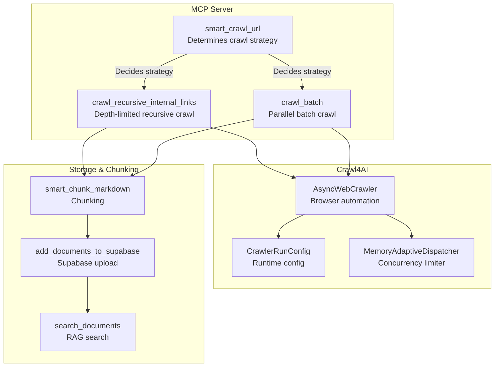
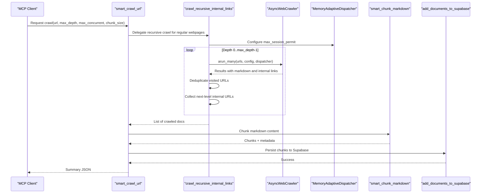
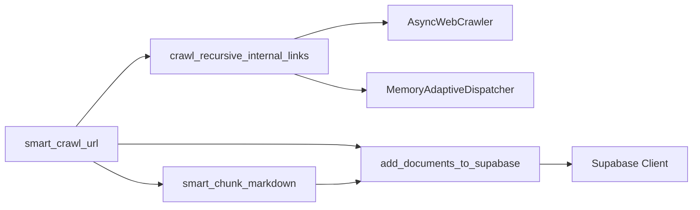

# Recursive Crawling

<cite>
**Referenced Files in This Document**
- [src/crawl4ai_mcp.py](file://src/crawl4ai_mcp.py)
- [src/utils.py](file://src/utils.py)
- [README.md](file://README.md)
- [scripts/Usage.md](file://scripts/Usage.md)
- [scripts/simple_crawl_json.py](file://scripts/simple_crawl_json.py)
- [scripts/crawl_pipeline.py](file://scripts/crawl_pipeline.py)
</cite>

## Table of Contents
1. [Introduction](#introduction)
2. [Project Structure](#project-structure)
3. [Core Components](#core-components)
4. [Architecture Overview](#architecture-overview)
5. [Detailed Component Analysis](#detailed-component-analysis)
6. [Dependency Analysis](#dependency-analysis)
7. [Performance Considerations](#performance-considerations)
8. [Troubleshooting Guide](#troubleshooting-guide)
9. [Conclusion](#conclusion)

## Introduction
This document explains the recursive crawling functionality implemented in the project, focusing on the smart_crawl_url tool’s recursive mode and the underlying crawl_recursive_internal_links implementation. It covers parameters (max_depth, max_concurrent), invocation patterns, internal workflow, URL filtering and deduplication, aggregation of results, and integration with Crawl4AI’s browser automation and the chunking/storage pipeline. It also addresses common issues such as infinite loop prevention, handling of broken links, and performance implications of concurrency settings, with optimization tips for large-scale crawling.

## Project Structure
The recursive crawling logic is centered around the MCP server module and utility functions for storage and chunking. The key files involved are:
- src/crawl4ai_mcp.py: Contains smart_crawl_url, crawl_recursive_internal_links, and the chunking/storage pipeline for recursive crawls.
- src/utils.py: Provides add_documents_to_supabase, search_documents, and related helpers used by the recursive crawl pipeline.
- scripts/*: Supporting scripts for single-page crawling, batch crawling, and pipeline orchestration.

**Diagram sources**
- [src/crawl4ai_mcp.py](file://src/crawl4ai_mcp.py#L833-L1030)
- [src/crawl4ai_mcp.py](file://src/crawl4ai_mcp.py#L2206-L2277)
- [src/utils.py](file://src/utils.py#L383-L548)

**Section sources**
- [src/crawl4ai_mcp.py](file://src/crawl4ai_mcp.py#L833-L1030)
- [src/crawl4ai_mcp.py](file://src/crawl4ai_mcp.py#L2206-L2277)
- [src/utils.py](file://src/utils.py#L383-L548)

## Core Components
- smart_crawl_url: Orchestrates crawling based on URL type. For regular webpages, it delegates to crawl_recursive_internal_links with configurable depth and concurrency.
- crawl_recursive_internal_links: Implements depth-limited recursive crawling, deduplicates visited URLs, and aggregates results.
- Crawl4AI integration: Uses AsyncWebCrawler with CrawlerRunConfig and MemoryAdaptiveDispatcher to manage concurrency and memory thresholds.
- Chunking and storage: Uses smart_chunk_markdown to split content and add_documents_to_supabase to persist chunks to Supabase.

Key parameters:
- max_depth: Maximum recursion depth for internal link traversal.
- max_concurrent: Maximum number of concurrent browser sessions.
- chunk_size: Target chunk size for markdown chunking.
- disable_javascript: Controls whether to crawl static content only.

**Section sources**
- [src/crawl4ai_mcp.py](file://src/crawl4ai_mcp.py#L833-L1030)
- [src/crawl4ai_mcp.py](file://src/crawl4ai_mcp.py#L2206-L2277)
- [src/utils.py](file://src/utils.py#L383-L548)

## Architecture Overview
The recursive crawling architecture integrates the MCP server, Crawl4AI browser automation, and the chunking/storage pipeline. The flow is:
- smart_crawl_url determines the crawl strategy (sitemap, text file, or webpage).
- For webpages, crawl_recursive_internal_links performs depth-limited traversal with concurrency control.
- Each crawled page is chunked and stored via add_documents_to_supabase.
- The same chunking and storage pipeline is reused for single-page crawling.

**Diagram sources**
- [src/crawl4ai_mcp.py](file://src/crawl4ai_mcp.py#L833-L1030)
- [src/crawl4ai_mcp.py](file://src/crawl4ai_mcp.py#L2206-L2277)
- [src/utils.py](file://src/utils.py#L383-L548)

## Detailed Component Analysis

### smart_crawl_url: Recursive Mode Invocation
- Determines crawl strategy based on URL type (sitemap, text file, or webpage).
- For webpages, invokes crawl_recursive_internal_links with max_depth and max_concurrent.
- Applies chunking and storage to all crawled results, aggregating metadata and word counts per source.
- Supports optional disable_javascript flag to force static-only crawling.

Invocation pattern highlights:
- Parameter precedence: disable_javascript can be provided or inferred from environment.
- Results aggregation: iterates over crawl results, chunks markdown, extracts metadata, and prepares batch inserts.

Integration with Crawl4AI:
- Uses AsyncWebCrawler and CrawlerRunConfig for runtime configuration.
- Delegates concurrency control to MemoryAdaptiveDispatcher.

**Section sources**
- [src/crawl4ai_mcp.py](file://src/crawl4ai_mcp.py#L833-L1030)

### crawl_recursive_internal_links: Depth-Limited Traversal
- Accepts start_urls, max_depth, and max_concurrent.
- Maintains a visited set to prevent revisits and deduplicates URLs.
- Normalizes URLs using urldefrag to handle fragments consistently.
- Iteratively crawls current level URLs, collects internal links, and moves to next level until depth exhausted.
- Uses MemoryAdaptiveDispatcher to cap concurrent sessions and monitor memory thresholds.

Concurrency and memory:
- MemoryAdaptiveDispatcher configured with memory_threshold_percent and check_interval.
- max_session_permit controls the maximum number of browser sessions.

URL deduplication:
- visited set ensures each normalized URL is crawled at most once.
- next_level_urls accumulates unique internal links not yet visited.

**Section sources**
- [src/crawl4ai_mcp.py](file://src/crawl4ai_mcp.py#L2206-L2277)

### URL Filtering and Deduplication
- Internal link collection: The crawler returns internal links; the recursive function normalizes and deduplicates them.
- Domain restriction: The current implementation relies on Crawl4AI’s link extraction and does not enforce strict domain filtering. If domain-scoped crawling is required, consider augmenting the link filtering logic to restrict to the same base domain.
- Fragment handling: urldefrag normalization removes fragments to avoid duplicate visits.

Note: The repository does not include explicit domain-based filtering logic in the recursive crawler. If domain isolation is critical, extend the link filtering step to compare normalized URLs against the starting domain.

**Section sources**
- [src/crawl4ai_mcp.py](file://src/crawl4ai_mcp.py#L2206-L2277)

### Results Aggregation and Storage Pipeline
- Aggregation: Iterates over crawl results, chunks markdown content, and builds lists for URLs, chunk numbers, contents, and metadata.
- Metadata enrichment: Extracts section info, assigns source_id, and tracks word counts per source.
- Source summary: Updates source summaries and word counts using ThreadPoolExecutor.
- Storage: Uses add_documents_to_supabase to insert chunks in batches, with retry logic and optional contextual embeddings.

Batching and retries:
- Batch size configurable; default is 20.
- Retry with exponential backoff for database insert failures.
- Optional contextual embeddings when enabled via environment.

**Section sources**
- [src/crawl4ai_mcp.py](file://src/crawl4ai_mcp.py#L900-L1020)
- [src/utils.py](file://src/utils.py#L383-L548)

### Integration with Crawl4AI Browser Automation
- AsyncWebCrawler manages browser sessions asynchronously.
- CrawlerRunConfig sets cache mode, streaming, and waits for body element to ensure content readiness.
- MemoryAdaptiveDispatcher dynamically controls concurrency and memory usage.

Environment considerations:
- CRAWL_STATIC_CONTENT_ONLY can be used globally to prefer static-only crawling.
- disable_javascript parameter overrides environment for specific requests.

**Section sources**
- [src/crawl4ai_mcp.py](file://src/crawl4ai_mcp.py#L833-L1030)
- [README.md](file://README.md#L483-L521)

### Single-Page vs Recursive: Shared Pipeline
- Both single-page and recursive crawls use the same chunking and storage pipeline.
- The recursive mode simply expands the input set of URLs across depths and internal links.

**Section sources**
- [src/crawl4ai_mcp.py](file://src/crawl4ai_mcp.py#L662-L820)
- [src/crawl4ai_mcp.py](file://src/crawl4ai_mcp.py#L833-L1030)

## Dependency Analysis
- smart_crawl_url depends on:
  - crawl_recursive_internal_links for recursive traversal.
  - smart_chunk_markdown for content chunking.
  - add_documents_to_supabase for storage.
- crawl_recursive_internal_links depends on:
  - AsyncWebCrawler and CrawlerRunConfig for crawling.
  - MemoryAdaptiveDispatcher for concurrency control.
  - urllib.parse.urldefrag for URL normalization.
- add_documents_to_supabase depends on:
  - Supabase client for persistence.
  - create_embeddings_batch for vector embeddings.

**Diagram sources**
- [src/crawl4ai_mcp.py](file://src/crawl4ai_mcp.py#L833-L1030)
- [src/crawl4ai_mcp.py](file://src/crawl4ai_mcp.py#L2206-L2277)
- [src/utils.py](file://src/utils.py#L383-L548)

**Section sources**
- [src/crawl4ai_mcp.py](file://src/crawl4ai_mcp.py#L833-L1030)
- [src/crawl4ai_mcp.py](file://src/crawl4ai_mcp.py#L2206-L2277)
- [src/utils.py](file://src/utils.py#L383-L548)

## Performance Considerations
- Concurrency tuning:
  - max_concurrent controls the number of parallel browser sessions. Lower values reduce server load but increase total crawl time; higher values increase throughput but risk rate limits or timeouts.
  - MemoryAdaptiveDispatcher helps manage memory pressure by adjusting session permits.
- Depth impact:
  - Increasing max_depth exponentially increases the number of URLs processed. Use conservative depths for large sites.
- Chunk size:
  - Larger chunk_size reduces the number of database writes but may increase embedding costs and retrieval granularity.
- Static-only crawling:
  - Setting CRAWL_STATIC_CONTENT_ONLY or disable_javascript reduces dynamic content overhead and avoids JavaScript-driven redirects.

Optimization tips:
- Start with moderate max_concurrent (e.g., 5–10) and adjust based on server feedback.
- Limit max_depth to avoid crawling unintended subdomains or deep trees.
- Use batch_size and retry logic to balance throughput and reliability.
- Consider domain filtering if crawling multi-domain sites to reduce irrelevant content.

[No sources needed since this section provides general guidance]

## Troubleshooting Guide
Common issues and mitigations:
- Infinite loops and excessive depth:
  - Prevented by max_depth and visited set deduplication. If encountering unexpected recursion, reduce max_depth or add domain filtering.
- Broken links and missing content:
  - crawl_recursive_internal_links ignores results without markdown; ensure wait_for and delays are adequate. For static-only content, set disable_javascript or CRAWL_STATIC_CONTENT_ONLY.
- Database errors:
  - add_documents_to_supabase includes retry logic with exponential backoff. Verify credentials and network connectivity.
- JavaScript redirects:
  - Use disable_javascript or CRAWL_STATIC_CONTENT_ONLY to avoid dynamic content surprises.

Operational references:
- Static-only crawling guidance and environment options.
- Pipeline usage notes and troubleshooting tips.

**Section sources**
- [src/crawl4ai_mcp.py](file://src/crawl4ai_mcp.py#L833-L1030)
- [README.md](file://README.md#L483-L521)
- [scripts/Usage.md](file://scripts/Usage.md#L292-L338)

## Conclusion
The recursive crawling implementation provides a robust, configurable mechanism for traversing internal links up to a specified depth while controlling concurrency and deduplicating URLs. It leverages Crawl4AI’s browser automation and integrates seamlessly with the chunking and storage pipeline used by both single-page and recursive crawls. By tuning max_depth and max_concurrent, and applying domain filtering where needed, teams can balance crawl speed with server load and data quality for large websites.