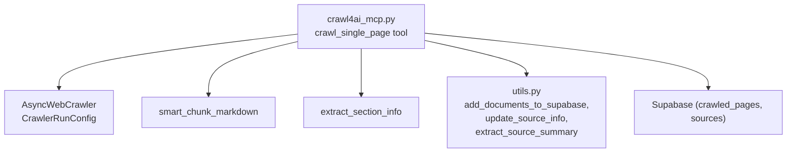
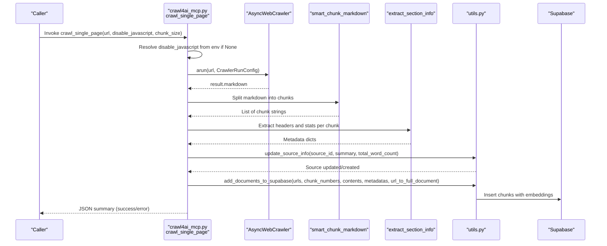
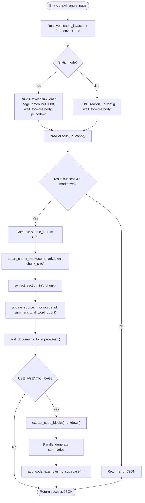
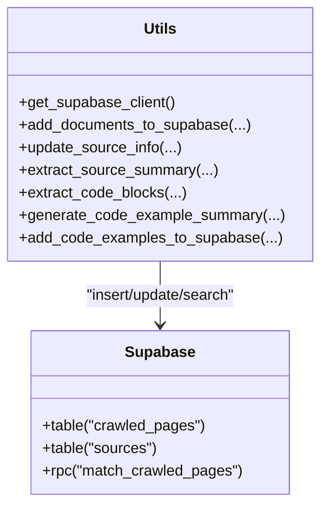
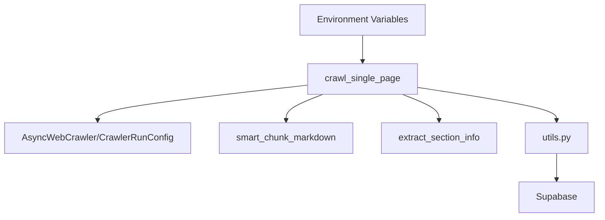

# Single Page Crawling

<cite>
**Referenced Files in This Document**
- [src/crawl4ai_mcp.py](file://src/crawl4ai_mcp.py)
- [src/utils.py](file://src/utils.py)
- [README.md](file://README.md)
- [scripts/Usage.md](file://scripts/Usage.md)
</cite>

## Table of Contents
1. [Introduction](#introduction)
2. [Project Structure](#project-structure)
3. [Core Components](#core-components)
4. [Architecture Overview](#architecture-overview)
5. [Detailed Component Analysis](#detailed-component-analysis)
6. [Dependency Analysis](#dependency-analysis)
7. [Performance Considerations](#performance-considerations)
8. [Troubleshooting Guide](#troubleshooting-guide)
9. [Conclusion](#conclusion)

## Introduction
This document explains the single page crawling feature implemented in the MCP server. It focuses on the crawl_single_page tool, detailing its parameters, invocation patterns, and internal workflow. It also covers how CrawlerRunConfig is configured for static versus dynamic content, how content is segmented using smart_chunk_markdown, how metadata is extracted via extract_section_info, and how processed chunks are stored in Supabase with proper source_id mapping and metadata enrichment. Practical examples from the codebase illustrate integration between crawling, chunking, and storage. Common issues such as timeouts, authentication errors, and environment variable overrides are addressed, along with performance optimization tips and error handling patterns.

## Project Structure
The single page crawling feature is implemented in the MCP server module and integrates with utility functions for storage and metadata operations. The key files involved are:
- src/crawl4ai_mcp.py: Contains the crawl_single_page tool, configuration of CrawlerRunConfig, chunking, metadata extraction, and storage integration.
- src/utils.py: Provides Supabase client creation, document insertion, source summary extraction, and related utilities.
- README.md and scripts/Usage.md: Offer configuration guidance and troubleshooting tips.



**Diagram sources**
- [src/crawl4ai_mcp.py](file://src/crawl4ai_mcp.py#L661-L830)
- [src/utils.py](file://src/utils.py#L106-L120)
- [src/utils.py](file://src/utils.py#L383-L548)
- [src/utils.py](file://src/utils.py#L842-L873)
- [src/utils.py](file://src/utils.py#L875-L916)

**Section sources**
- [src/crawl4ai_mcp.py](file://src/crawl4ai_mcp.py#L661-L830)
- [src/utils.py](file://src/utils.py#L106-L120)

## Core Components
- crawl_single_page: Orchestrates a single-page crawl, configures CrawlerRunConfig, extracts markdown, segments content, enriches metadata, updates source info, and stores chunks and optional code examples.
- CrawlerRunConfig: Configures the AsyncWebCrawler for static or dynamic content, including timeouts and waiting conditions.
- smart_chunk_markdown: Splits markdown into chunks while respecting code blocks and paragraph boundaries.
- extract_section_info: Extracts headers and basic stats from each chunk for metadata.
- Supabase storage: Adds documents to the crawled_pages table and updates the sources table with summaries and word counts.

**Section sources**
- [src/crawl4ai_mcp.py](file://src/crawl4ai_mcp.py#L661-L830)
- [src/crawl4ai_mcp.py](file://src/crawl4ai_mcp.py#L514-L558)
- [src/crawl4ai_mcp.py](file://src/crawl4ai_mcp.py#L628-L646)
- [src/utils.py](file://src/utils.py#L383-L548)
- [src/utils.py](file://src/utils.py#L842-L873)

## Architecture Overview
The single page crawling workflow integrates the MCP server, Crawl4AI’s AsyncWebCrawler, chunking utilities, and Supabase storage.



**Diagram sources**
- [src/crawl4ai_mcp.py](file://src/crawl4ai_mcp.py#L661-L830)
- [src/crawl4ai_mcp.py](file://src/crawl4ai_mcp.py#L514-L558)
- [src/crawl4ai_mcp.py](file://src/crawl4ai_mcp.py#L628-L646)
- [src/utils.py](file://src/utils.py#L383-L548)
- [src/utils.py](file://src/utils.py#L842-L873)

## Detailed Component Analysis

### crawl_single_page: Parameters, Invocation, and Workflow
- Parameters:
  - url: Target page URL.
  - disable_javascript: If True, disables JavaScript for static-only content; if None, falls back to CRAWL_STATIC_CONTENT_ONLY environment variable.
  - chunk_size: Maximum chunk size in characters (default 5000).
- Invocation patterns:
  - Per-request override: pass disable_javascript explicitly.
  - Environment override: leave disable_javascript as None to use CRAWL_STATIC_CONTENT_ONLY.
  - Script override: command-line flags can force static-only behavior in related scripts.
- Internal workflow:
  - Resolve disable_javascript from environment if not provided.
  - Configure CrawlerRunConfig:
    - Static mode: sets page_timeout to 10000 ms, waits for body, and executes no JavaScript.
    - Dynamic mode: waits for body and enables JavaScript.
  - Run crawler.arun and validate result.success and result.markdown.
  - Compute source_id from URL and split markdown into chunks.
  - Enrich metadata per chunk (headers, char/word counts, url, source).
  - Update source summary and word count in the sources table.
  - Insert chunks into crawled_pages with embeddings and metadata.
  - Optionally extract and store code examples if USE_AGENTIC_RAG is enabled.



**Diagram sources**
- [src/crawl4ai_mcp.py](file://src/crawl4ai_mcp.py#L661-L830)
- [src/crawl4ai_mcp.py](file://src/crawl4ai_mcp.py#L514-L558)
- [src/crawl4ai_mcp.py](file://src/crawl4ai_mcp.py#L628-L646)
- [src/utils.py](file://src/utils.py#L383-L548)
- [src/utils.py](file://src/utils.py#L842-L873)
- [src/utils.py](file://src/utils.py#L589-L717)

**Section sources**
- [src/crawl4ai_mcp.py](file://src/crawl4ai_mcp.py#L661-L830)
- [README.md](file://README.md#L483-L521)

### CrawlerRunConfig: Static vs Dynamic Content
- Static-only configuration:
  - page_timeout=10000 ms (10 seconds) to cap load time for static content.
  - wait_for="css:body" ensures the DOM body is present.
  - js_code="" prevents JavaScript execution.
- Dynamic configuration:
  - wait_for="css:body" ensures the DOM body is present.
  - JavaScript execution is enabled by default.

These settings ensure predictable behavior for static content and allow dynamic rendering when needed.

**Section sources**
- [src/crawl4ai_mcp.py](file://src/crawl4ai_mcp.py#L688-L708)

### Content Extraction and Chunking: smart_chunk_markdown
- Purpose: Split markdown into chunks while preserving structure.
- Strategy:
  - Prefer breaking at code fences (```) when present.
  - Otherwise break at paragraph boundaries (\n\n).
  - Otherwise break at sentence boundaries (. ).
  - Enforce a minimum threshold to avoid mid-sentence splits.
- Output: List of chunk strings suitable for downstream processing and storage.

**Section sources**
- [src/crawl4ai_mcp.py](file://src/crawl4ai_mcp.py#L514-L558)

### Metadata Extraction: extract_section_info
- Purpose: Extract structural metadata from each chunk.
- Fields produced:
  - headers: Concatenated header entries from the chunk.
  - char_count: Character count of the chunk.
  - word_count: Word count of the chunk.
- These fields are enriched with url, source, and chunk_index before storage.

**Section sources**
- [src/crawl4ai_mcp.py](file://src/crawl4ai_mcp.py#L628-L646)

### Storage in Supabase: add_documents_to_supabase and Source Updates
- Source summary and word count:
  - update_source_info(source_id, summary, total_word_count) updates or inserts a row in the sources table.
  - extract_source_summary(source_id, content) generates a concise summary for the source.
- Document storage:
  - add_documents_to_supabase(urls, chunk_numbers, contents, metadatas, url_to_full_document) performs:
    - Optional batch deletion of existing records for the same URLs.
    - Optional contextual embedding augmentation when enabled.
    - Batched embedding creation and insertion into crawled_pages.
    - Proper source_id mapping derived from URL if missing.
- Error handling:
  - Retry logic with exponential backoff for batch inserts.
  - Fallback to individual record insertion if batch fails.
  - Upsert behavior controlled by delete_existing flag.



**Diagram sources**
- [src/utils.py](file://src/utils.py#L106-L120)
- [src/utils.py](file://src/utils.py#L383-L548)
- [src/utils.py](file://src/utils.py#L842-L873)
- [src/utils.py](file://src/utils.py#L875-L916)
- [src/utils.py](file://src/utils.py#L589-L717)

**Section sources**
- [src/utils.py](file://src/utils.py#L383-L548)
- [src/utils.py](file://src/utils.py#L842-L873)
- [src/utils.py](file://src/utils.py#L875-L916)

### Integration Examples from src/crawl4ai_mcp.py
- The crawl_single_page function demonstrates:
  - Environment-driven configuration of disable_javascript.
  - CrawlerRunConfig construction for static vs dynamic content.
  - smart_chunk_markdown usage for segmentation.
  - extract_section_info for metadata enrichment.
  - update_source_info and add_documents_to_supabase for storage.
  - Optional code example extraction and storage when enabled.

**Section sources**
- [src/crawl4ai_mcp.py](file://src/crawl4ai_mcp.py#L661-L830)

## Dependency Analysis
- crawl_single_page depends on:
  - AsyncWebCrawler and CrawlerRunConfig for crawling.
  - smart_chunk_markdown for segmentation.
  - extract_section_info for metadata.
  - utils.add_documents_to_supabase and utils.update_source_info for storage.
- Environment variables:
  - CRAWL_STATIC_CONTENT_ONLY controls default disable_javascript behavior.
  - USE_AGENTIC_RAG toggles code example extraction.
  - SUPABASE_URL and SUPABASE_SERVICE_KEY configure Supabase client.
  - USE_CONTEXTUAL_EMBEDDINGS enables contextual embedding augmentation.



**Diagram sources**
- [src/crawl4ai_mcp.py](file://src/crawl4ai_mcp.py#L661-L830)
- [src/utils.py](file://src/utils.py#L106-L120)

**Section sources**
- [src/crawl4ai_mcp.py](file://src/crawl4ai_mcp.py#L661-L830)
- [src/utils.py](file://src/utils.py#L106-L120)

## Performance Considerations
- Static-only crawling reduces overhead and avoids JavaScript redirects, yielding predictable content sizes and faster runs.
- Adjust chunk_size to balance retrieval granularity and storage volume.
- Batched inserts and embeddings reduce network overhead; tune batch_size according to memory and throughput.
- Use contextual embeddings judiciously; they improve retrieval quality but add latency.
- Limit concurrent operations and leverage retries with exponential backoff to handle transient failures.

[No sources needed since this section provides general guidance]

## Troubleshooting Guide
- Timeout handling:
  - Static content uses a 10-second page timeout to avoid long waits.
  - Dynamic content relies on wait_for="css:body" to ensure the DOM is ready.
- Authentication errors:
  - Ensure SUPABASE_URL and SUPABASE_SERVICE_KEY are set correctly in the environment.
  - Verify network connectivity and that the Supabase project is active.
- Environment variable overrides:
  - CRAWL_STATIC_CONTENT_ONLY controls default behavior; pass disable_javascript=None to honor the environment variable.
  - USE_AGENTIC_RAG enables code example extraction and summarization.
- Common issues and remedies:
  - Body tag not found: The crawler waits for css:body; ensure the target page renders a body element.
  - Huge content sizes: Prefer static-only mode or local file crawling for predictable sizes.
  - Database connection errors: Confirm credentials and network availability.

**Section sources**
- [src/crawl4ai_mcp.py](file://src/crawl4ai_mcp.py#L688-L708)
- [src/utils.py](file://src/utils.py#L106-L120)
- [README.md](file://README.md#L483-L521)
- [scripts/Usage.md](file://scripts/Usage.md#L311-L338)

## Conclusion
The single page crawling feature provides a robust, configurable pipeline for extracting, segmenting, and storing web content. By leveraging CrawlerRunConfig for static or dynamic crawling, smart_chunk_markdown for structured segmentation, and comprehensive metadata extraction, the system ensures high-quality RAG-ready chunks. Supabase integration handles deduplication, batching, and embedding generation with resilient error handling. Environment variables offer flexible control over crawling behavior, while practical troubleshooting guidance addresses common pitfalls.