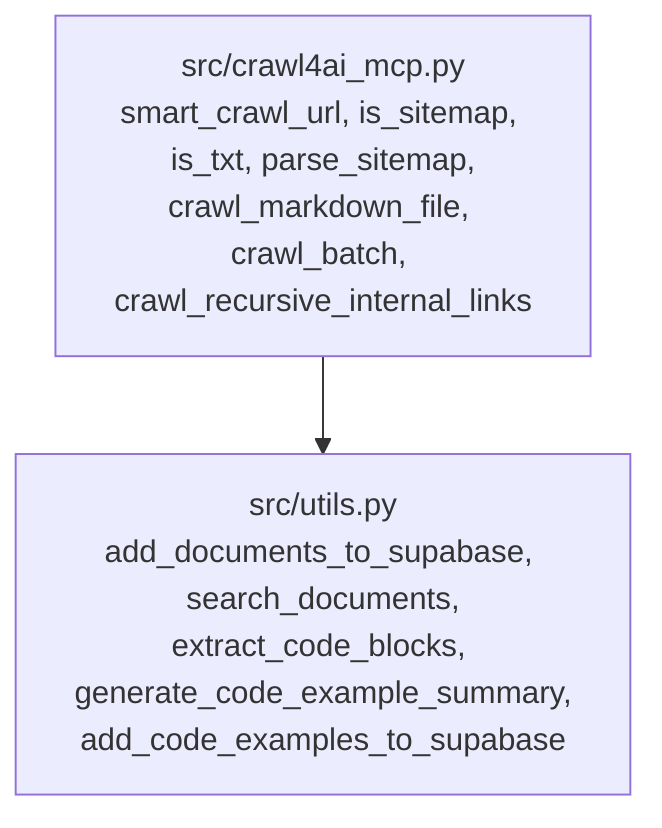
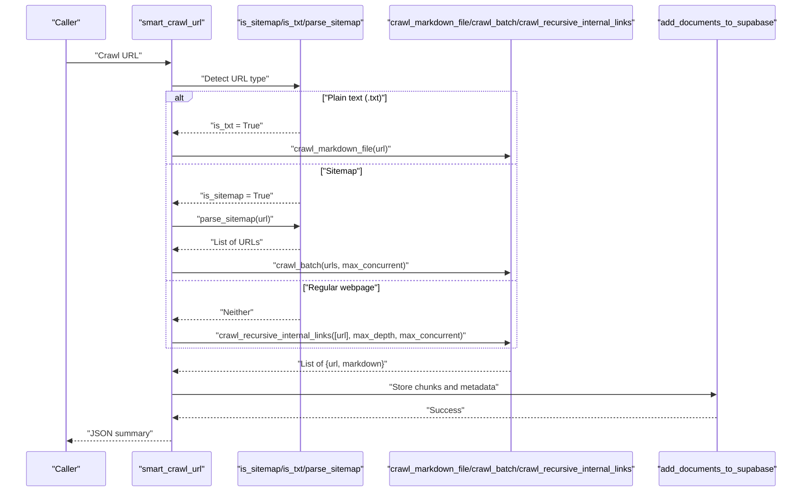
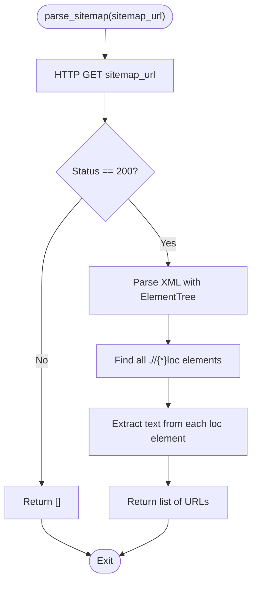
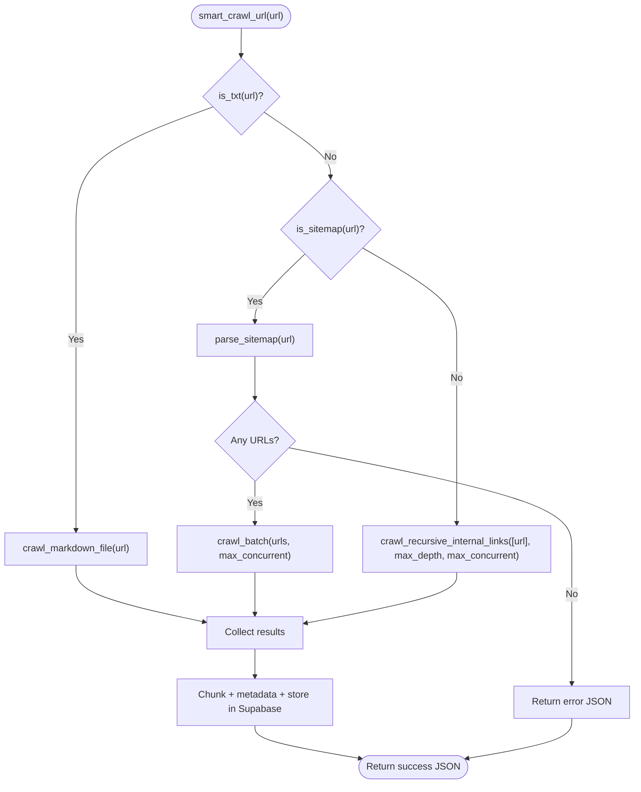
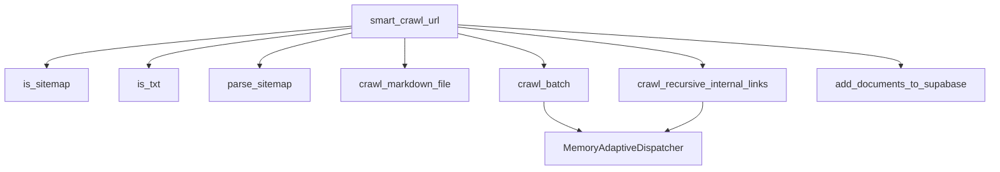

# URL Type Detection

<cite>
**Referenced Files in This Document**
- [crawl4ai_mcp.py](file://src/crawl4ai_mcp.py)
- [utils.py](file://src/utils.py)
</cite>

## Table of Contents
1. [Introduction](#introduction)
2. [Project Structure](#project-structure)
3. [Core Components](#core-components)
4. [Architecture Overview](#architecture-overview)
5. [Detailed Component Analysis](#detailed-component-analysis)
6. [Dependency Analysis](#dependency-analysis)
7. [Performance Considerations](#performance-considerations)
8. [Troubleshooting Guide](#troubleshooting-guide)
9. [Conclusion](#conclusion)
10. [Appendices](#appendices)

## Introduction
This document explains the URL type detection system used by the smart_crawl_url function. It covers how the system distinguishes between sitemaps, plain text files, and regular webpages, and how these detections drive specialized crawling strategies:
- Sitemaps (ending with sitemap.xml or containing sitemap in the path) trigger parallel batch crawling of all extracted URLs.
- Plain text files (.txt) are processed as simple markdown content.
- Regular webpages activate recursive crawling of internal links up to a configurable depth.

It also documents the parse_sitemap function’s XML parsing logic using ElementTree, the conditional routing in smart_crawl_url, and the helper functions is_sitemap and is_txt. Guidance is included for handling malformed sitemap XML, empty sitemap responses, and incorrect file type detection, as well as extending the system with additional URL type detectors.

## Project Structure
The URL type detection logic resides primarily in the MCP server module and utility functions for storage and embeddings.

**Diagram sources**
- [crawl4ai_mcp.py](file://src/crawl4ai_mcp.py#L469-L513)
- [crawl4ai_mcp.py](file://src/crawl4ai_mcp.py#L833-L1030)
- [crawl4ai_mcp.py](file://src/crawl4ai_mcp.py#L2185-L2277)
- [utils.py](file://src/utils.py#L383-L548)
- [utils.py](file://src/utils.py#L589-L717)
- [utils.py](file://src/utils.py#L719-L800)

**Section sources**
- [crawl4ai_mcp.py](file://src/crawl4ai_mcp.py#L469-L513)
- [crawl4ai_mcp.py](file://src/crawl4ai_mcp.py#L833-L1030)
- [crawl4ai_mcp.py](file://src/crawl4ai_mcp.py#L2185-L2277)
- [utils.py](file://src/utils.py#L383-L548)
- [utils.py](file://src/utils.py#L589-L717)
- [utils.py](file://src/utils.py#L719-L800)

## Core Components
- is_sitemap(url): Determines if a URL targets a sitemap by checking the file suffix and path segments.
- is_txt(url): Detects plain text files by suffix.
- parse_sitemap(sitemap_url): Downloads and parses sitemap XML to extract URLs.
- smart_crawl_url(ctx, url, ...): Orchestrates the crawl strategy based on URL type and stores results.
- crawl_markdown_file(crawler, url): Crawls a single text/markdown resource and returns markdown content.
- crawl_batch(crawler, urls, max_concurrent): Parallelizes crawling of multiple URLs.
- crawl_recursive_internal_links(crawler, start_urls, max_depth, max_concurrent): Recursively crawls internal links up to a depth limit.

**Section sources**
- [crawl4ai_mcp.py](file://src/crawl4ai_mcp.py#L469-L513)
- [crawl4ai_mcp.py](file://src/crawl4ai_mcp.py#L833-L1030)
- [crawl4ai_mcp.py](file://src/crawl4ai_mcp.py#L2185-L2277)

## Architecture Overview
The URL type detection system sits at the entry point of the smart_crawl_url function. It selects a specialized crawler based on the URL type and then stores the results in Supabase.

**Diagram sources**
- [crawl4ai_mcp.py](file://src/crawl4ai_mcp.py#L469-L513)
- [crawl4ai_mcp.py](file://src/crawl4ai_mcp.py#L833-L1030)
- [crawl4ai_mcp.py](file://src/crawl4ai_mcp.py#L2185-L2277)
- [utils.py](file://src/utils.py#L383-L548)

## Detailed Component Analysis

### URL Type Detection Functions
- is_sitemap(url)
  - Purpose: Identify sitemap resources by suffix and path segment.
  - Logic: Returns true if the URL ends with sitemap.xml or contains sitemap in the path.
  - Complexity: O(1) time and space.
- is_txt(url)
  - Purpose: Identify plain text files by suffix.
  - Logic: Returns true if the URL ends with .txt.
  - Complexity: O(1) time and space.

These functions are used by smart_crawl_url to route to the appropriate crawler.

**Section sources**
- [crawl4ai_mcp.py](file://src/crawl4ai_mcp.py#L469-L491)

### Sitemap Parsing: parse_sitemap
- Purpose: Download and parse sitemap XML to extract all URLs.
- Logic:
  - Sends an HTTP GET request to the sitemap URL.
  - On success (status 200), parses the XML using ElementTree.
  - Extracts all <loc> elements under any namespace using the wildcard selector.
  - Returns a list of URL strings.
- Error handling:
  - If the HTTP status is not 200, returns an empty list.
  - If XML parsing fails, logs an error and returns an empty list.
- Complexity:
  - Time proportional to XML size; extraction of <loc> entries is linear in the number of entries.
  - Space proportional to the number of extracted URLs.

**Diagram sources**
- [crawl4ai_mcp.py](file://src/crawl4ai_mcp.py#L492-L513)

**Section sources**
- [crawl4ai_mcp.py](file://src/crawl4ai_mcp.py#L492-L513)

### Conditional Routing in smart_crawl_url
- Purpose: Select the appropriate crawling strategy based on URL type.
- Logic:
  - If is_txt(url) is true: crawl_markdown_file(url) is invoked.
  - Else if is_sitemap(url) is true: parse_sitemap(url) is called; if no URLs are found, returns an error JSON; otherwise crawl_batch(urls, max_concurrent) is invoked.
  - Otherwise: crawl_recursive_internal_links([url], max_depth, max_concurrent) is invoked.
- Storage:
  - After collecting results, smart_crawl_url chunks markdown content, extracts metadata, updates source summaries, and stores everything via add_documents_to_supabase.
- Fallback behavior:
  - If no results are produced, returns an error JSON indicating no content found.

**Diagram sources**
- [crawl4ai_mcp.py](file://src/crawl4ai_mcp.py#L833-L1030)
- [crawl4ai_mcp.py](file://src/crawl4ai_mcp.py#L2185-L2277)
- [utils.py](file://src/utils.py#L383-L548)

**Section sources**
- [crawl4ai_mcp.py](file://src/crawl4ai_mcp.py#L833-L1030)
- [crawl4ai_mcp.py](file://src/crawl4ai_mcp.py#L2185-L2277)
- [utils.py](file://src/utils.py#L383-L548)

### Specialized Crawlers
- crawl_markdown_file(crawler, url)
  - Crawls a single URL and returns a list with one entry if successful.
  - Used for .txt and similar text-like resources.
- crawl_batch(crawler, urls, max_concurrent)
  - Uses MemoryAdaptiveDispatcher to constrain concurrency and arun_many to crawl all URLs in parallel.
  - Filters results to include only successful runs with markdown content.
- crawl_recursive_internal_links(crawler, start_urls, max_depth, max_concurrent)
  - Iteratively crawls internal links up to max_depth.
  - Uses normalization to avoid duplicates and tracks visited URLs.
  - Uses MemoryAdaptiveDispatcher to manage concurrency.

**Section sources**
- [crawl4ai_mcp.py](file://src/crawl4ai_mcp.py#L2185-L2277)

### Storage and Post-processing
- smart_crawl_url performs:
  - Chunking markdown content with smart_chunk_markdown.
  - Extracting metadata and computing word counts.
  - Updating source summaries and storing chunks via add_documents_to_supabase.
  - Optional code example extraction and storage via add_code_examples_to_supabase.

**Section sources**
- [crawl4ai_mcp.py](file://src/crawl4ai_mcp.py#L910-L1030)
- [utils.py](file://src/utils.py#L383-L548)
- [utils.py](file://src/utils.py#L589-L717)
- [utils.py](file://src/utils.py#L719-L800)

## Dependency Analysis
- smart_crawl_url depends on:
  - is_sitemap and is_txt for detection.
  - parse_sitemap for extracting URLs from sitemaps.
  - crawl_markdown_file, crawl_batch, crawl_recursive_internal_links for crawling.
  - add_documents_to_supabase for persistence.
- crawl_batch and crawl_recursive_internal_links depend on MemoryAdaptiveDispatcher and AsyncWebCrawler.
- Storage utilities (add_documents_to_supabase, add_code_examples_to_supabase) rely on Supabase client and embedding generation.

**Diagram sources**
- [crawl4ai_mcp.py](file://src/crawl4ai_mcp.py#L469-L513)
- [crawl4ai_mcp.py](file://src/crawl4ai_mcp.py#L833-L1030)
- [crawl4ai_mcp.py](file://src/crawl4ai_mcp.py#L2185-L2277)
- [utils.py](file://src/utils.py#L383-L548)

**Section sources**
- [crawl4ai_mcp.py](file://src/crawl4ai_mcp.py#L469-L513)
- [crawl4ai_mcp.py](file://src/crawl4ai_mcp.py#L833-L1030)
- [crawl4ai_mcp.py](file://src/crawl4ai_mcp.py#L2185-L2277)
- [utils.py](file://src/utils.py#L383-L548)

## Performance Considerations
- Sitemap crawling uses parallel batch processing via arun_many with MemoryAdaptiveDispatcher to cap concurrency and reduce memory pressure.
- Recursive crawling limits depth and avoids revisiting URLs, reducing redundant work.
- Storage batching minimizes database round-trips and improves throughput.
- Embedding creation is batched and retried with exponential backoff to handle transient failures.

[No sources needed since this section provides general guidance]

## Troubleshooting Guide
Common issues and mitigations:
- Malformed sitemap XML
  - Symptom: parse_sitemap logs an error and returns an empty list.
  - Mitigation: Verify sitemap validity and network accessibility; consider adding robustness checks upstream.
- Empty sitemap response
  - Symptom: smart_crawl_url returns an error JSON indicating no URLs found.
  - Mitigation: Validate sitemap URL and content; ensure robots.txt allows access.
- Incorrect file type detection
  - Symptom: .txt files not recognized or sitemap misidentified.
  - Mitigation: Confirm URL suffix and path segment logic; adjust detection rules if needed.
- No content found
  - Symptom: smart_crawl_url returns an error JSON indicating no content found.
  - Mitigation: Check crawler configuration, network connectivity, and target URL correctness.

**Section sources**
- [crawl4ai_mcp.py](file://src/crawl4ai_mcp.py#L492-L513)
- [crawl4ai_mcp.py](file://src/crawl4ai_mcp.py#L868-L897)

## Conclusion
The URL type detection system in smart_crawl_url provides a clear, extensible mechanism for selecting crawling strategies:
- is_sitemap and is_txt offer fast, deterministic detection.
- parse_sitemap enables efficient extraction of URLs from sitemaps.
- Specialized crawlers (crawl_markdown_file, crawl_batch, crawl_recursive_internal_links) apply the right approach for each URL type.
- Robust storage and post-processing ensure results are persisted and searchable.

[No sources needed since this section summarizes without analyzing specific files]

## Appendices

### Extending the System with Additional URL Type Detectors
To support additional content formats:
- Add a new detector function (e.g., is_pdf, is_docx) modeled after is_sitemap and is_txt.
- Extend the conditional logic in smart_crawl_url to route to a dedicated crawler (e.g., crawl_pdf_file).
- Implement the crawler to fetch and convert the resource to markdown or structured content.
- Integrate storage and metadata extraction similar to existing flows.

Guidance:
- Keep detection functions simple and O(1) to minimize overhead.
- Centralize routing logic in smart_crawl_url to maintain clarity.
- Reuse existing storage utilities (add_documents_to_supabase) to keep consistency.

[No sources needed since this section provides general guidance]