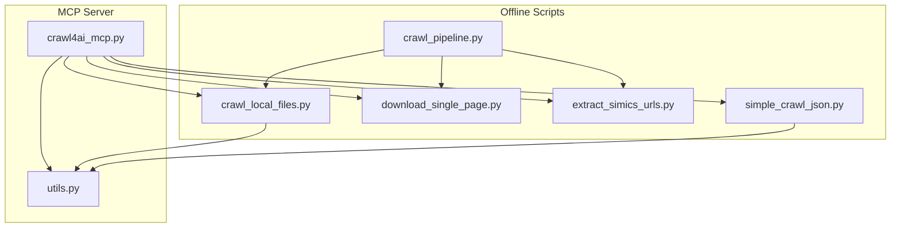
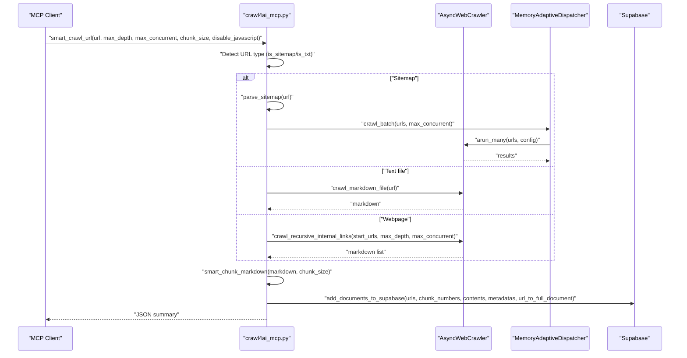
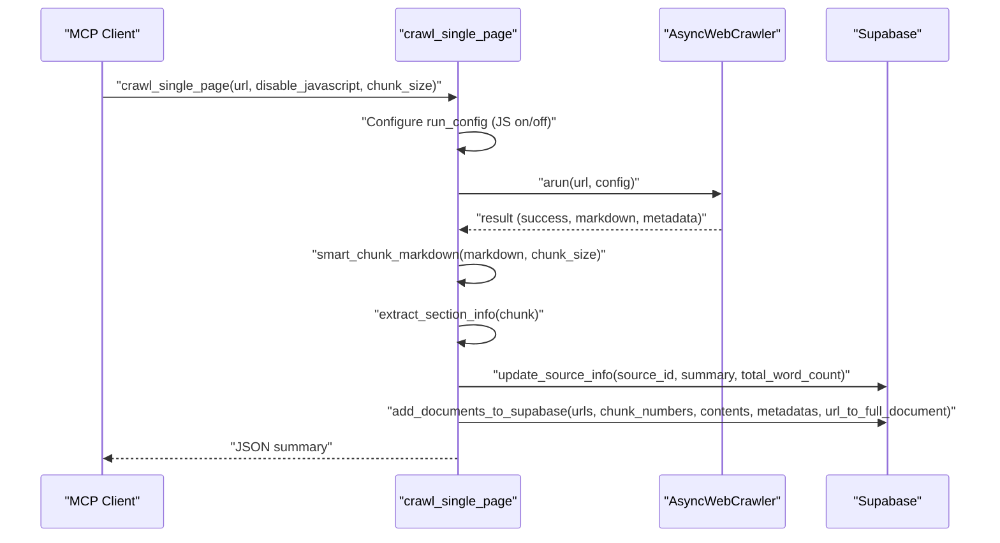
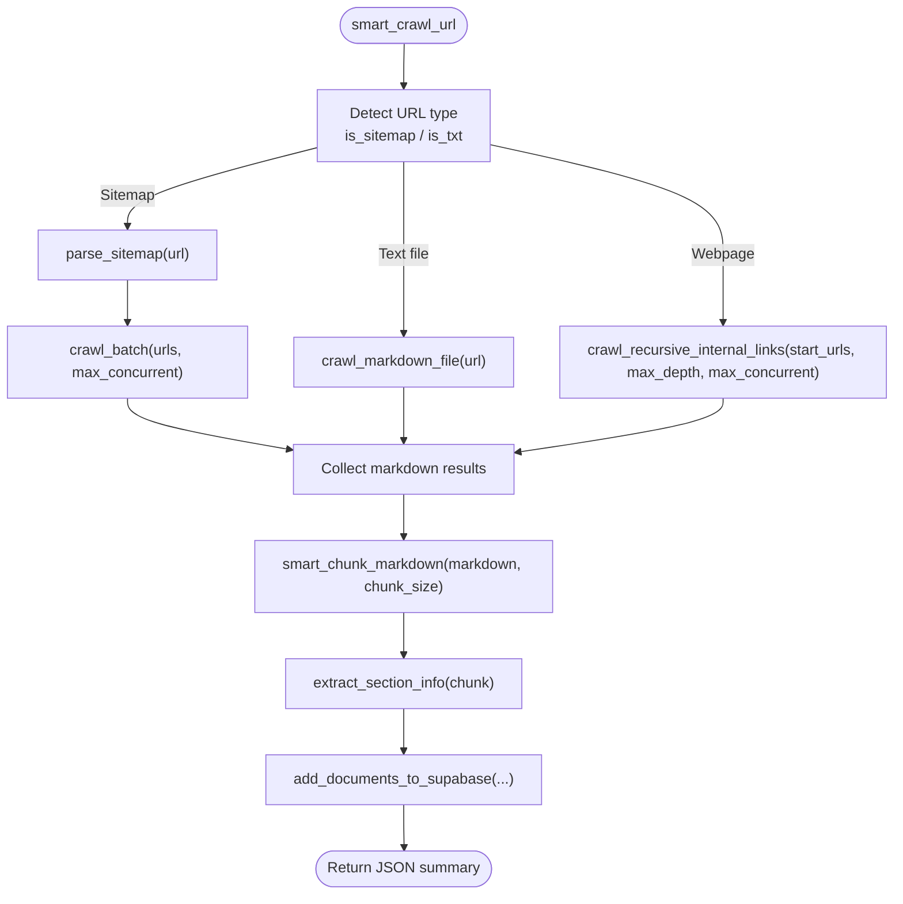
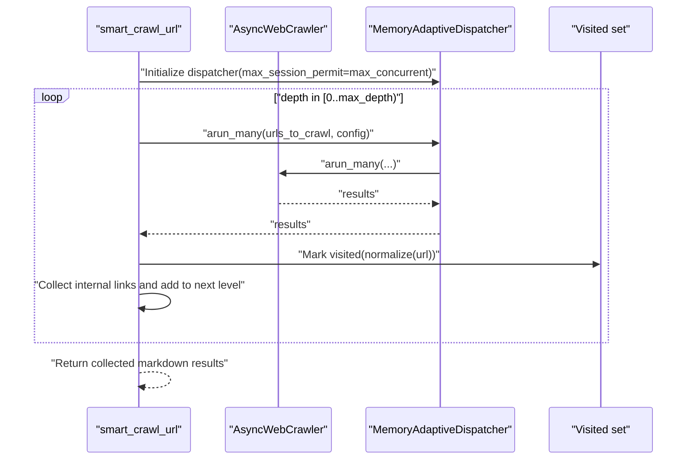
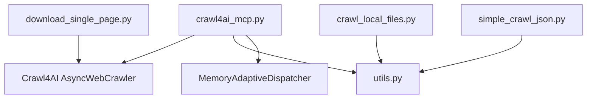

# Web Crawling Tools

<cite>
**Referenced Files in This Document**
- [crawl4ai_mcp.py](file://src/crawl4ai_mcp.py)
- [utils.py](file://src/utils.py)
- [crawl_local_files.py](file://scripts/crawl_local_files.py)
- [download_single_page.py](file://scripts/download_single_page.py)
- [crawl_pipeline.py](file://scripts/crawl_pipeline.py)
- [extract_simics_urls.py](file://scripts/extract_simics_urls.py)
- [simple_crawl_json.py](file://scripts/simple_crawl_json.py)
</cite>

## Table of Contents
1. [Introduction](#introduction)
2. [Project Structure](#project-structure)
3. [Core Components](#core-components)
4. [Architecture Overview](#architecture-overview)
5. [Detailed Component Analysis](#detailed-component-analysis)
6. [Dependency Analysis](#dependency-analysis)
7. [Performance Considerations](#performance-considerations)
8. [Troubleshooting Guide](#troubleshooting-guide)
9. [Conclusion](#conclusion)
10. [Appendices](#appendices)

## Introduction
This document explains the web crawling tools provided by the system, focusing on how crawl_single_page and smart_crawl_url operate, how URL type detection works for sitemaps, text files, and regular webpages, and how recursive crawling integrates with parallel processing and depth control. It also covers JavaScript rendering options, static content crawling mode, integration with Crawl4AI for content extraction, chunking via smart_chunk_markdown, metadata extraction, and common operational issues such as timeouts, authentication errors, and rate limiting. Practical examples are referenced from the codebase to show how these tools are invoked and orchestrated.

## Project Structure
The crawling capabilities are implemented across several modules:
- MCP server entrypoint and tools: [crawl4ai_mcp.py](file://src/crawl4ai_mcp.py)
- Utility functions for storage, embeddings, and code extraction: [utils.py](file://src/utils.py)
- Offline/local crawling and chunking: [crawl_local_files.py](file://scripts/crawl_local_files.py)
- Single-page download and sitemap creation: [download_single_page.py](file://scripts/download_single_page.py)
- End-to-end pipeline orchestration: [crawl_pipeline.py](file://scripts/crawl_pipeline.py)
- URL extraction helpers: [extract_simics_urls.py](file://scripts/extract_simics_urls.py)
- JSON-based bulk crawling: [simple_crawl_json.py](file://scripts/simple_crawl_json.py)



**Diagram sources**
- [crawl4ai_mcp.py](file://src/crawl4ai_mcp.py#L1-L120)
- [utils.py](file://src/utils.py#L1-L120)
- [crawl_local_files.py](file://scripts/crawl_local_files.py#L1-L120)
- [download_single_page.py](file://scripts/download_single_page.py#L1-L120)
- [crawl_pipeline.py](file://scripts/crawl_pipeline.py#L1-L120)
- [extract_simics_urls.py](file://scripts/extract_simics_urls.py#L1-L120)
- [simple_crawl_json.py](file://scripts/simple_crawl_json.py#L1-L120)

**Section sources**
- [crawl4ai_mcp.py](file://src/crawl4ai_mcp.py#L1-L120)
- [crawl_pipeline.py](file://scripts/crawl_pipeline.py#L1-L120)

## Core Components
- crawl_single_page: Crawls a single URL, respects JavaScript rendering settings, chunks content, extracts metadata, and stores results in Supabase. It supports static-only mode via disable_javascript parameter and environment variable.
- smart_crawl_url: Intelligently selects a crawling strategy based on URL type:
  - Sitemap: Parses sitemap.xml and crawls all discovered URLs in parallel.
  - Text file: Directly retrieves and processes .txt/markdown content.
  - Regular webpage: Recursively crawls internal links up to a configurable depth with parallel concurrency control.
- URL type detection: Uses is_sitemap and is_txt helpers to detect sitemap and text files; otherwise treats as a regular webpage.
- Recursive crawling: Implemented by crawl_recursive_internal_links, which traverses internal links up to max_depth and uses MemoryAdaptiveDispatcher for concurrency.
- Parallel batch crawling: Implemented by crawl_batch, which uses arun_many with a dispatcher to crawl multiple URLs concurrently.
- Chunking and metadata: smart_chunk_markdown splits markdown into chunks respecting code blocks and paragraphs; extract_section_info captures headers and counts.
- Static content crawling mode: Controlled by disable_javascript parameter and CRAWL_STATIC_CONTENT_ONLY environment variable; affects wait_for, js_code, and page_timeout configurations.

**Section sources**
- [crawl4ai_mcp.py](file://src/crawl4ai_mcp.py#L662-L831)
- [crawl4ai_mcp.py](file://src/crawl4ai_mcp.py#L833-L1037)
- [crawl4ai_mcp.py](file://src/crawl4ai_mcp.py#L468-L491)
- [crawl4ai_mcp.py](file://src/crawl4ai_mcp.py#L2186-L2278)
- [crawl_local_files.py](file://scripts/crawl_local_files.py#L26-L69)
- [crawl_local_files.py](file://scripts/crawl_local_files.py#L71-L81)

## Architecture Overview
The MCP server initializes a shared AsyncWebCrawler and a Supabase client, then exposes tools that leverage Crawl4AI’s AsyncWebCrawler to fetch pages, convert them to markdown, chunk content, and persist metadata. The offline scripts complement the MCP tools by enabling deterministic, local-first workflows and batch processing.



**Diagram sources**
- [crawl4ai_mcp.py](file://src/crawl4ai_mcp.py#L833-L1037)
- [crawl4ai_mcp.py](file://src/crawl4ai_mcp.py#L2186-L2278)
- [utils.py](file://src/utils.py#L383-L548)

**Section sources**
- [crawl4ai_mcp.py](file://src/crawl4ai_mcp.py#L833-L1037)
- [utils.py](file://src/utils.py#L383-L548)

## Detailed Component Analysis

### crawl_single_page
- Purpose: Quickly crawl a single URL without following external links, suitable for targeted content retrieval.
- Parameters:
  - url: Target URL.
  - disable_javascript: If True, disables JavaScript to crawl static content only.
  - chunk_size: Target chunk size for smart_chunk_markdown.
- Invocation pattern:
  - Called from MCP tool interface with ctx and parameters.
  - Uses environment variable CRAWL_STATIC_CONTENT_ONLY when disable_javascript is not provided.
- Internal workflow:
  - Configures CrawlerRunConfig with cache_mode=BYPASS, stream=False, and waits for body element.
  - If disable_javascript is True, sets page_timeout to 10000 ms and js_code to empty string.
  - Calls crawler.arun(url, config) and validates result.success and result.markdown.
  - Extracts source_id from URL, chunks markdown with smart_chunk_markdown, and prepares metadata.
  - Updates source summary and inserts chunks into Supabase via add_documents_to_supabase.
  - Optionally extracts code examples if USE_AGENTIC_RAG is enabled and processes them in parallel.



**Diagram sources**
- [crawl4ai_mcp.py](file://src/crawl4ai_mcp.py#L662-L831)
- [utils.py](file://src/utils.py#L383-L548)

**Section sources**
- [crawl4ai_mcp.py](file://src/crawl4ai_mcp.py#L662-L831)
- [utils.py](file://src/utils.py#L383-L548)

### smart_crawl_url
- Purpose: Intelligent crawler that adapts to URL type and depth, with parallel processing and depth control.
- Parameters:
  - url: Target URL (sitemap.xml, .txt, or regular webpage).
  - max_depth: Maximum recursion depth for regular webpages.
  - max_concurrent: Maximum concurrent browser sessions.
  - chunk_size: Target chunk size for smart_chunk_markdown.
  - disable_javascript: If True, disables JavaScript for static content crawling.
- URL type detection:
  - is_sitemap(url): Detects sitemap by path or extension.
  - is_txt(url): Detects .txt files.
  - Otherwise, treat as regular webpage.
- Internal workflow:
  - For sitemaps: parse_sitemap(url) to extract URLs, then crawl_batch(urls, max_concurrent) using MemoryAdaptiveDispatcher.
  - For text files: crawl_markdown_file(url) to retrieve content directly.
  - For regular webpages: crawl_recursive_internal_links(start_urls=[url], max_depth, max_concurrent) to traverse internal links.
  - After collecting markdown content, chunk with smart_chunk_markdown, compute metadata, and store via add_documents_to_supabase.
  - Optionally extract code examples if USE_AGENTIC_RAG is enabled.



**Diagram sources**
- [crawl4ai_mcp.py](file://src/crawl4ai_mcp.py#L833-L1037)
- [crawl4ai_mcp.py](file://src/crawl4ai_mcp.py#L2186-L2278)

**Section sources**
- [crawl4ai_mcp.py](file://src/crawl4ai_mcp.py#L833-L1037)
- [crawl4ai_mcp.py](file://src/crawl4ai_mcp.py#L468-L491)
- [crawl4ai_mcp.py](file://src/crawl4ai_mcp.py#L2186-L2278)

### URL Type Detection
- is_sitemap(url): Checks if URL ends with sitemap.xml or contains “sitemap” in path.
- is_txt(url): Checks if URL ends with .txt.
- Behavior:
  - Sitemap: parse_sitemap(url) fetches XML and extracts all <loc> entries.
  - Text file: crawl_markdown_file(url) fetches content directly.
  - Regular webpage: crawl_recursive_internal_links(url, ...) follows internal links.

**Section sources**
- [crawl4ai_mcp.py](file://src/crawl4ai_mcp.py#L468-L491)
- [crawl4ai_mcp.py](file://src/crawl4ai_mcp.py#L2186-L2205)

### Recursive Crawling Mechanism with Parallel Processing and Depth Control
- crawl_recursive_internal_links:
  - Uses MemoryAdaptiveDispatcher to cap concurrent sessions.
  - Iteratively crawls current level URLs, collects internal links, and moves to next level until max_depth reached.
  - Maintains visited set and normalized URLs to avoid duplicates.
- crawl_batch:
  - Uses arun_many with dispatcher to crawl multiple URLs concurrently.
  - Filters successful results with markdown content.



**Diagram sources**
- [crawl4ai_mcp.py](file://src/crawl4ai_mcp.py#L2228-L2278)
- [crawl4ai_mcp.py](file://src/crawl4ai_mcp.py#L2206-L2227)

**Section sources**
- [crawl4ai_mcp.py](file://src/crawl4ai_mcp.py#L2228-L2278)
- [crawl4ai_mcp.py](file://src/crawl4ai_mcp.py#L2206-L2227)

### JavaScript Rendering Options and Static Content Crawling Mode
- Static-only mode:
  - disable_javascript parameter or CRAWL_STATIC_CONTENT_ONLY environment variable triggers:
    - page_timeout increased to 10000 ms.
    - wait_for set to "css:body".
    - js_code set to empty string to disable JS execution.
- Dynamic content mode:
  - wait_for set to "css:body" and JS enabled by default.

**Section sources**
- [crawl4ai_mcp.py](file://src/crawl4ai_mcp.py#L687-L709)
- [crawl4ai_mcp.py](file://src/crawl4ai_mcp.py#L885-L888)
- [simple_crawl_json.py](file://scripts/simple_crawl_json.py#L182-L190)

### Integration with Crawl4AI for Content Extraction
- AsyncWebCrawler is used to fetch pages and produce cleaned HTML/markdown.
- Offline local crawling uses raw content mode:
  - Reads HTML from disk and passes raw content to crawler via a special URL scheme.
  - This avoids file:// URL handling issues in Crawl4AI and ensures consistent markdown extraction.

**Section sources**
- [crawl_local_files.py](file://scripts/crawl_local_files.py#L105-L123)
- [crawl4ai_mcp.py](file://src/crawl4ai_mcp.py#L662-L831)

### Chunking Process Using smart_chunk_markdown and Metadata Extraction
- smart_chunk_markdown:
  - Splits text into chunks respecting code fences (```), paragraph breaks, and sentence boundaries.
  - Respects chunk_size and avoids splitting mid-code or mid-sentence beyond a threshold.
- Metadata extraction:
  - extract_section_info captures headers and word/char counts per chunk.
  - Additional metadata includes chunk_index, url, source, and crawl_time.

**Section sources**
- [crawl_local_files.py](file://scripts/crawl_local_files.py#L26-L69)
- [crawl_local_files.py](file://scripts/crawl_local_files.py#L71-L81)
- [crawl4ai_mcp.py](file://src/crawl4ai_mcp.py#L514-L558)

### Offline Pipeline Orchestration
- crawl_pipeline.py orchestrates:
  - Optional database cleanup.
  - Single-page mode vs. site-mode (URL extraction, local download, local crawling).
  - Local crawling stage writes markdown files and stores chunks to Supabase.
- download_single_page.py:
  - Downloads a single HTML page and creates a minimal sitemap.txt for pipeline compatibility.
- extract_simics_urls.py:
  - Extracts documentation URLs from a Simics DML reference index page and saves to JSON.

**Section sources**
- [crawl_pipeline.py](file://scripts/crawl_pipeline.py#L1-L259)
- [download_single_page.py](file://scripts/download_single_page.py#L1-L229)
- [extract_simics_urls.py](file://scripts/extract_simics_urls.py#L1-L131)

## Dependency Analysis
- crawl4ai_mcp.py depends on:
  - Crawl4AI AsyncWebCrawler and CrawlerRunConfig for page fetching.
  - utils.py for Supabase integration, embeddings, and code extraction.
  - MemoryAdaptiveDispatcher for adaptive concurrency control.
- crawl_local_files.py depends on:
  - utils.py for Supabase operations and code extraction.
  - Uses raw content mode to bypass file:// URL quirks.
- download_single_page.py depends on:
  - Crawl4AI AsyncWebCrawler for HTML retrieval.
  - Creates sitemap.txt for pipeline compatibility.
- simple_crawl_json.py depends on:
  - utils.py for Supabase operations and embeddings.
  - Demonstrates static-only mode via browser extra args.



**Diagram sources**
- [crawl4ai_mcp.py](file://src/crawl4ai_mcp.py#L1-L120)
- [utils.py](file://src/utils.py#L1-L120)
- [crawl_local_files.py](file://scripts/crawl_local_files.py#L1-L120)
- [download_single_page.py](file://scripts/download_single_page.py#L1-L120)
- [simple_crawl_json.py](file://scripts/simple_crawl_json.py#L1-L120)

**Section sources**
- [crawl4ai_mcp.py](file://src/crawl4ai_mcp.py#L1-L120)
- [utils.py](file://src/utils.py#L1-L120)

## Performance Considerations
- Concurrency control:
  - Use max_concurrent to cap browser sessions and reduce memory pressure.
  - MemoryAdaptiveDispatcher dynamically manages permits based on memory thresholds.
- Timeout tuning:
  - Increase page_timeout for static-only mode to accommodate slower servers.
  - For dynamic content, keep reasonable wait_for and delay_before_return_html to balance speed and completeness.
- Chunk sizing:
  - Adjust chunk_size to balance retrieval granularity and embedding costs.
- Batch operations:
  - Use add_documents_to_supabase batch_size and retry/backoff to handle large datasets efficiently.
- Static-only mode:
  - Disable JavaScript to reduce overhead and improve reliability for static content.

[No sources needed since this section provides general guidance]

## Troubleshooting Guide
- Timeout handling:
  - Increase page_timeout for static-only mode.
  - Reduce max_concurrent to lower resource contention.
- Authentication errors:
  - Ensure SUPABASE_URL and SUPABASE_SERVICE_KEY are set for database operations.
  - For knowledge graph tools, verify NEO4J_URI, NEO4J_USER, and NEO4J_PASSWORD.
- Rate limiting:
  - Lower max_concurrent and introduce delays between batches.
  - Use exponential backoff in database insertion retries.
- Sitemap parsing failures:
  - Verify sitemap.xml validity and network accessibility.
- Static content issues:
  - Confirm disable_javascript is set appropriately and browser extra args are passed when needed.

**Section sources**
- [utils.py](file://src/utils.py#L106-L120)
- [crawl4ai_mcp.py](file://src/crawl4ai_mcp.py#L1-L120)
- [simple_crawl_json.py](file://scripts/simple_crawl_json.py#L182-L190)

## Conclusion
The system provides robust, adaptable crawling tools that integrate Crawl4AI with Supabase-backed storage. crawl_single_page offers quick, static-aware retrieval, while smart_crawl_url intelligently adapts to sitemaps, text files, and regular webpages, leveraging parallel processing and depth control. The offline scripts enable deterministic workflows and local-first processing. With careful configuration of concurrency, timeouts, and chunk sizes, the tools support scalable, production-grade content ingestion for downstream RAG applications.

## Appendices
- Example invocations:
  - Single-page crawl with static-only mode: [crawl4ai_mcp.py](file://src/crawl4ai_mcp.py#L662-L831)
  - Smart crawl with sitemap and parallel processing: [crawl4ai_mcp.py](file://src/crawl4ai_mcp.py#L833-L1037)
  - Local crawling and chunking: [crawl_local_files.py](file://scripts/crawl_local_files.py#L95-L183)
  - Single-page download and sitemap creation: [download_single_page.py](file://scripts/download_single_page.py#L70-L133)
  - Pipeline orchestration: [crawl_pipeline.py](file://scripts/crawl_pipeline.py#L125-L204)
  - URL extraction for Simics docs: [extract_simics_urls.py](file://scripts/extract_simics_urls.py#L19-L85)
  - Bulk crawling from JSON: [simple_crawl_json.py](file://scripts/simple_crawl_json.py#L164-L233)