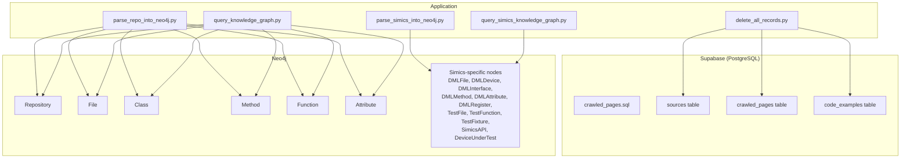
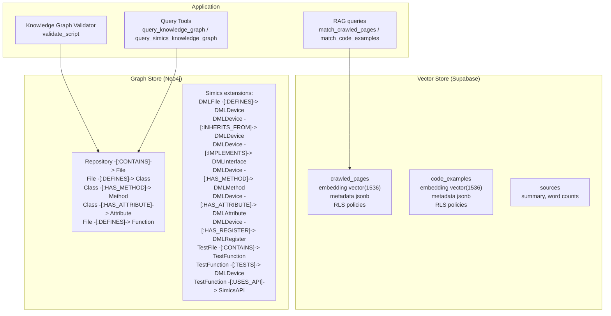
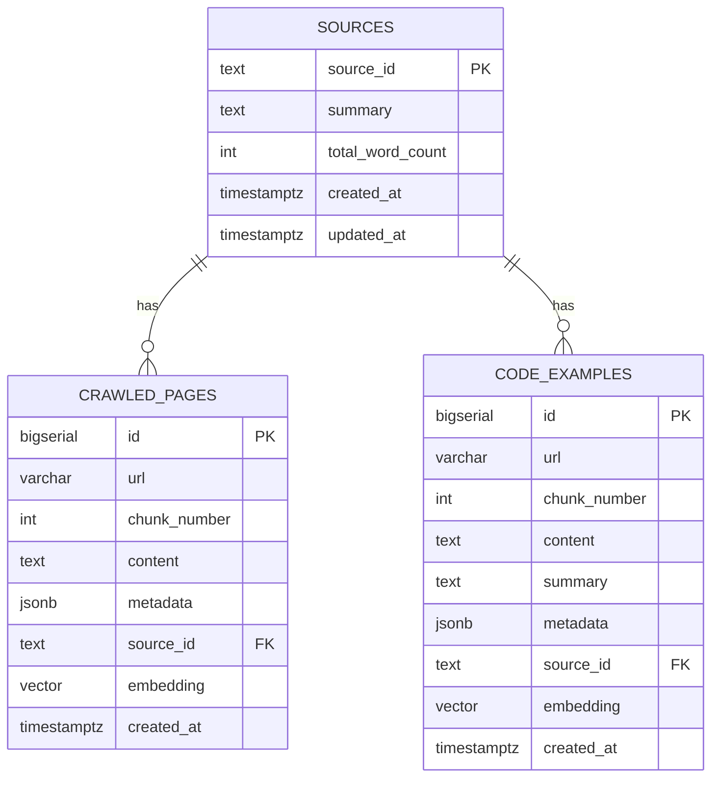
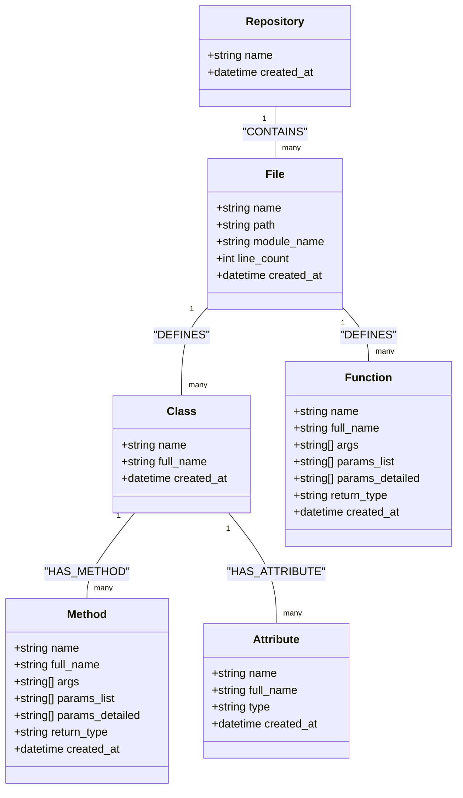
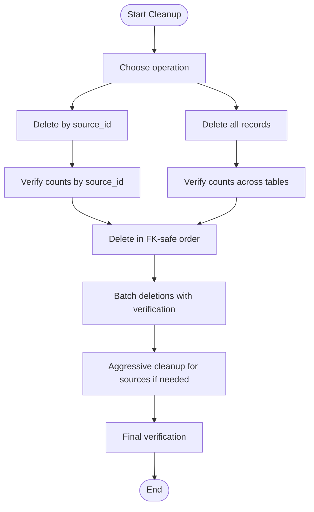
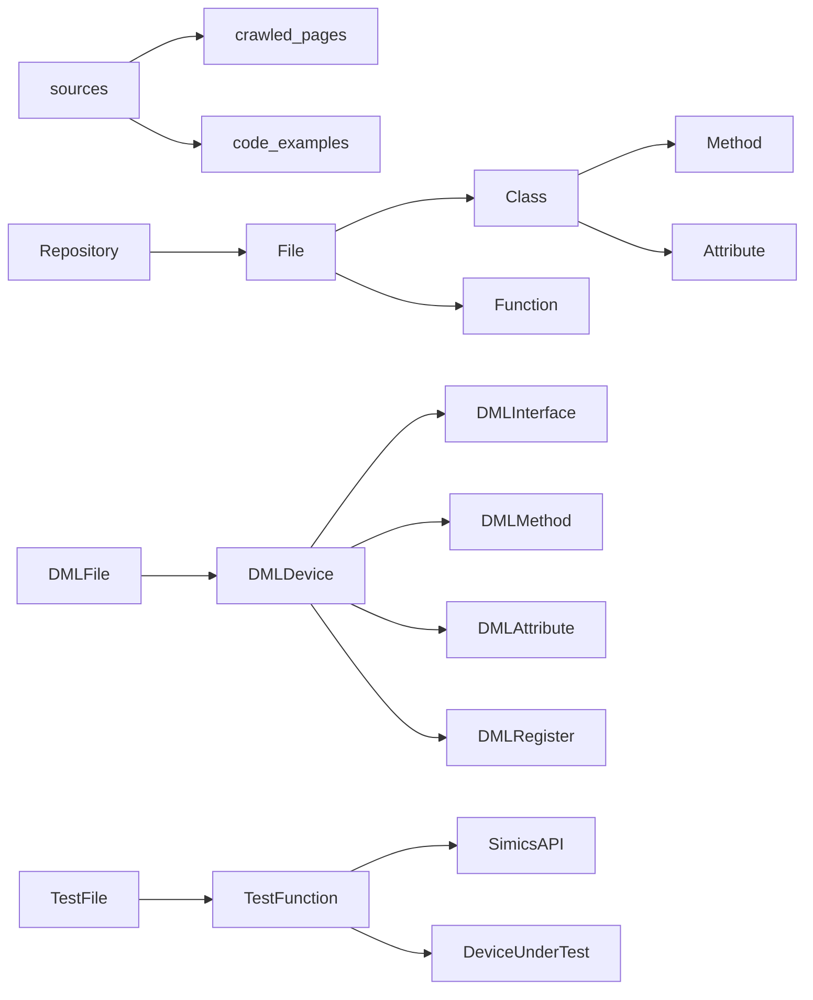

# Database Schema Design

<cite>
**Referenced Files in This Document**
- [crawled_pages.sql](file://crawled_pages.sql)
- [parse_repo_into_neo4j.py](file://knowledge_graphs/parse_repo_into_neo4j.py)
- [parse_simics_into_neo4j.py](file://knowledge_graphs/parse_simics_into_neo4j.py)
- [query_knowledge_graph.py](file://knowledge_graphs/query_knowledge_graph.py)
- [query_simics_knowledge_graph.py](file://knowledge_graphs/query_simics_knowledge_graph.py)
- [delete_all_records.py](file://scripts/delete_all_records.py)
- [README.md](file://README.md)
- [README_Simics.md](file://knowledge_graphs/README_Simics.md)
</cite>

## Table of Contents
1. [Introduction](#introduction)
2. [Project Structure](#project-structure)
3. [Core Components](#core-components)
4. [Architecture Overview](#architecture-overview)
5. [Detailed Component Analysis](#detailed-component-analysis)
6. [Dependency Analysis](#dependency-analysis)
7. [Performance Considerations](#performance-considerations)
8. [Troubleshooting Guide](#troubleshooting-guide)
9. [Conclusion](#conclusion)
10. [Appendices](#appendices)

## Introduction
This document provides comprehensive data model documentation for both Supabase (PostgreSQL with pgvector) and Neo4j schemas used in the project. It covers:
- Supabase schema for crawled documentation and code examples, including table structure, indexing strategies, and query patterns.
- Neo4j schema for Python repositories and Simics-specific extensions, including node labels, relationship types, constraints, and example Cypher queries.
- Data lifecycle considerations, retention strategies, and migration approaches derived from the repository’s scripts and configuration.

## Project Structure
The database-related assets are organized as follows:
- Supabase schema and functions are defined in a single SQL script.
- Neo4j graph population and querying logic resides in the knowledge_graphs module, with Simics-specific extensions.
- Utilities for data lifecycle management (cleanup) are provided in scripts.

**Diagram sources**
- [crawled_pages.sql](file://crawled_pages.sql#L1-L175)
- [parse_repo_into_neo4j.py](file://knowledge_graphs/parse_repo_into_neo4j.py#L420-L800)
- [parse_simics_into_neo4j.py](file://knowledge_graphs/parse_simics_into_neo4j.py#L182-L563)
- [query_knowledge_graph.py](file://knowledge_graphs/query_knowledge_graph.py#L1-L210)
- [query_simics_knowledge_graph.py](file://knowledge_graphs/query_simics_knowledge_graph.py#L1-L294)
- [delete_all_records.py](file://scripts/delete_all_records.py#L1-L120)

**Section sources**
- [crawled_pages.sql](file://crawled_pages.sql#L1-L175)
- [parse_repo_into_neo4j.py](file://knowledge_graphs/parse_repo_into_neo4j.py#L420-L800)
- [parse_simics_into_neo4j.py](file://knowledge_graphs/parse_simics_into_neo4j.py#L182-L563)
- [query_knowledge_graph.py](file://knowledge_graphs/query_knowledge_graph.py#L1-L210)
- [query_simics_knowledge_graph.py](file://knowledge_graphs/query_simics_knowledge_graph.py#L1-L294)
- [delete_all_records.py](file://scripts/delete_all_records.py#L1-L120)
- [README.md](file://README.md#L151-L160)
- [README_Simics.md](file://knowledge_graphs/README_Simics.md#L1-L120)

## Core Components
- Supabase schema: Defines sources and two vector-enabled tables (crawled_pages and code_examples) with JSONB metadata, vector embeddings, and RLS policies.
- Neo4j schema: Standard Python code graph plus Simics-specific nodes and relationships for DML, tests, and APIs.

Key implementation references:
- Supabase schema and functions: [crawled_pages.sql](file://crawled_pages.sql#L1-L175)
- Neo4j constraints and indexes: [parse_repo_into_neo4j.py](file://knowledge_graphs/parse_repo_into_neo4j.py#L420-L436)
- Simics schema setup: [parse_simics_into_neo4j.py](file://knowledge_graphs/parse_simics_into_neo4j.py#L182-L224)
- Neo4j graph creation and relationships: [parse_repo_into_neo4j.py](file://knowledge_graphs/parse_repo_into_neo4j.py#L612-L783), [parse_simics_into_neo4j.py](file://knowledge_graphs/parse_simics_into_neo4j.py#L311-L563)

**Section sources**
- [crawled_pages.sql](file://crawled_pages.sql#L1-L175)
- [parse_repo_into_neo4j.py](file://knowledge_graphs/parse_repo_into_neo4j.py#L420-L436)
- [parse_simics_into_neo4j.py](file://knowledge_graphs/parse_simics_into_neo4j.py#L182-L224)
- [parse_repo_into_neo4j.py](file://knowledge_graphs/parse_repo_into_neo4j.py#L612-L783)
- [parse_simics_into_neo4j.py](file://knowledge_graphs/parse_simics_into_neo4j.py#L311-L563)

## Architecture Overview
The system integrates vector search (Supabase) with knowledge graph validation (Neo4j) to support RAG and hallucination detection.

**Diagram sources**
- [crawled_pages.sql](file://crawled_pages.sql#L1-L175)
- [parse_repo_into_neo4j.py](file://knowledge_graphs/parse_repo_into_neo4j.py#L612-L783)
- [parse_simics_into_neo4j.py](file://knowledge_graphs/parse_simics_into_neo4j.py#L311-L563)
- [query_knowledge_graph.py](file://knowledge_graphs/query_knowledge_graph.py#L1-L210)
- [query_simics_knowledge_graph.py](file://knowledge_graphs/query_simics_knowledge_graph.py#L1-L294)

## Detailed Component Analysis

### Supabase Schema (crawled_pages.sql)
- Tables and fields:
  - sources: source_id (PK), summary, total_word_count, created_at, updated_at.
  - crawled_pages: id (PK), url, chunk_number, content, metadata (JSONB), source_id (FK), embedding (vector), created_at; unique(url, chunk_number); foreign key to sources.
  - code_examples: id (PK), url, chunk_number, content, summary, metadata (JSONB), source_id (FK), embedding (vector), created_at; unique(url, chunk_number); foreign key to sources.
- Indexes:
  - IVFFLAT index on embedding (cosine ops) for vector similarity search.
  - GIN index on metadata for JSONB filtering.
  - B-tree index on source_id for filtering.
- Row Level Security:
  - Policies allow public SELECT on both crawled_pages and sources, and on code_examples.
- Vector search functions:
  - match_crawled_pages(query_embedding, match_count, filter, source_filter) returns id, url, chunk_number, content, metadata, source_id, similarity.
  - match_code_examples(query_embedding, match_count, filter, source_filter) mirrors the above for code_examples.

**Diagram sources**
- [crawled_pages.sql](file://crawled_pages.sql#L1-L175)

**Section sources**
- [crawled_pages.sql](file://crawled_pages.sql#L1-L175)

#### Indexing Strategies and Query Patterns
- Vector similarity:
  - Use IVFFLAT index with cosine distance for approximate nearest neighbor search.
  - Query via match_crawled_pages or match_code_examples with a query embedding and optional filter and source_filter.
- Metadata filtering:
  - GIN index on metadata supports efficient JSONB containment queries (e.g., filter by category or tags).
- Source filtering:
  - B-tree index on source_id enables fast filtering by domain or dataset.
- RLS:
  - Public read policies simplify access for read-only consumers.

**Section sources**
- [crawled_pages.sql](file://crawled_pages.sql#L36-L80)
- [crawled_pages.sql](file://crawled_pages.sql#L120-L166)

### Neo4j Schema (Python and Simics)
- Node labels and properties:
  - Repository: name, created_at.
  - File: name, path (unique), module_name, line_count, created_at.
  - Class: name, full_name (unique), created_at.
  - Method: name, full_name, args, params_list, params_detailed, return_type, created_at (method_id unique).
  - Attribute: name, full_name, type, created_at (attr_id unique).
  - Function: name, full_name, args, params_list, params_detailed, return_type, created_at (func_id unique).
  - Simics extensions (DML/Test/API):
    - DMLFile: file_path (unique), content_length, line_count.
    - DMLDevice: name (unique), file_path, line_number, parent.
    - DMLInterface: name (unique), file_path, line_number.
    - DMLMethod: name, device, file_path, line_number, parameters, return_type.
    - DMLAttribute: name, device, file_path, line_number, type_name.
    - DMLRegister: name, device, file_path, line_number, address, size.
    - TestFile: file_path (unique), file_type, is_simics_test.
    - TestFunction: name, file_path, class_name, line_number, devices_tested, simics_apis_used, fixtures_used.
    - TestFixture: name, file_path, scope, line_number, dependencies.
    - SimicsAPI: name (unique), module.
    - DeviceUnderTest: name (unique).
- Relationships:
  - Repository -[:CONTAINS]-> File
  - File -[:DEFINES]-> Class
  - File -[:DEFINES]-> Function
  - Class -[:HAS_METHOD]-> Method
  - Class -[:HAS_ATTRIBUTE]-> Attribute
  - File -[:IMPORTS]-> File (internal imports)
  - Simics extensions:
    - DMLFile -[:DEFINES]-> DMLDevice
    - DMLDevice -[:INHERITS_FROM]-> DMLDevice
    - DMLDevice -[:IMPLEMENTS]-> DMLInterface
    - DMLDevice -[:HAS_METHOD]-> DMLMethod
    - DMLDevice -[:HAS_ATTRIBUTE]-> DMLAttribute
    - DMLDevice -[:HAS_REGISTER]-> DMLRegister
    - TestFile -[:CONTAINS]-> TestFunction
    - TestFunction -[:TESTS]-> DMLDevice
    - TestFunction -[:USES_API]-> SimicsAPI
    - TestFile -[:CONTAINS]-> TestFixture

**Diagram sources**
- [parse_repo_into_neo4j.py](file://knowledge_graphs/parse_repo_into_neo4j.py#L420-L436)
- [parse_repo_into_neo4j.py](file://knowledge_graphs/parse_repo_into_neo4j.py#L612-L783)

**Section sources**
- [parse_repo_into_neo4j.py](file://knowledge_graphs/parse_repo_into_neo4j.py#L420-L436)
- [parse_repo_into_neo4j.py](file://knowledge_graphs/parse_repo_into_neo4j.py#L612-L783)
- [README_Simics.md](file://knowledge_graphs/README_Simics.md#L1-L120)

#### Cypher Query Examples
- List repositories and explore structure:
  - List repositories: MATCH (r:Repository) RETURN r.name ORDER BY r.name.
  - Explore repository counts: MATCH (r:Repository {name: $repo_name})-[:CONTAINS]->(f:File) RETURN count(f) as file_count.
- Find classes and methods:
  - List classes: MATCH (r:Repository)-[:CONTAINS]->(f:File)-[:DEFINES]->(c:Class) RETURN c.name, c.full_name ORDER BY c.name LIMIT 20.
  - Explore class details: MATCH (c:Class)-[:HAS_METHOD]->(m:Method) WHERE c.name = $class_name RETURN m.name, m.params_list, m.return_type ORDER BY m.name.
- Simics-specific queries:
  - Device hierarchy: MATCH path = (child:DMLDevice)-[:INHERITS_FROM*]->(ancestor:DMLDevice) WHERE child.name = $device_name OR ancestor.name = $device_name RETURN path.
  - Test coverage: MATCH (d:DMLDevice) OPTIONAL MATCH (t:TestFunction)-[:TESTS]->(d) RETURN d.name, collect(t.name) as test_functions, count(t) as test_count ORDER BY test_count DESC.
  - API usage patterns: MATCH (api:SimicsAPI)<-[:USES_API]-(t:TestFunction) RETURN api.name, count(t) as usage_count ORDER BY usage_count DESC LIMIT 20.

**Section sources**
- [query_knowledge_graph.py](file://knowledge_graphs/query_knowledge_graph.py#L39-L116)
- [query_knowledge_graph.py](file://knowledge_graphs/query_knowledge_graph.py#L133-L210)
- [query_simics_knowledge_graph.py](file://knowledge_graphs/query_simics_knowledge_graph.py#L70-L167)
- [query_simics_knowledge_graph.py](file://knowledge_graphs/query_simics_knowledge_graph.py#L168-L294)

### Data Lifecycle, Retention, and Migration
- Data lifecycle:
  - Crawled content is ingested into Supabase tables (crawled_pages and code_examples) with metadata and embeddings. Sources table tracks provenance and word counts.
  - Neo4j graph is populated by parsing repositories (Python) and Simics codebases, establishing nodes and relationships.
- Retention:
  - The repository does not define explicit retention policies. Data can be selectively removed by source_id or fully purged using the cleanup script.
- Migration strategies:
  - Schema evolution for Supabase: The SQL script drops and recreates tables, enabling reruns. For production, prefer incremental migrations (add/drop columns, add indexes) and preserve data where possible.
  - Neo4j: Constraints and indexes are created at initialization. For large-scale updates, use MERGE patterns to avoid duplicates and rebuild indexes after bulk loads.
- Cleanup utilities:
  - delete_all_records.py supports:
    - Deleting by source_id across tables (code_examples -> crawled_pages -> sources).
    - Full table purge with batched deletions and verification.
    - Listing available source_ids for targeted cleanup.

**Diagram sources**
- [delete_all_records.py](file://scripts/delete_all_records.py#L1-L120)
- [delete_all_records.py](file://scripts/delete_all_records.py#L126-L335)

**Section sources**
- [delete_all_records.py](file://scripts/delete_all_records.py#L1-L120)
- [delete_all_records.py](file://scripts/delete_all_records.py#L126-L335)
- [crawled_pages.sql](file://crawled_pages.sql#L1-L10)
- [parse_repo_into_neo4j.py](file://knowledge_graphs/parse_repo_into_neo4j.py#L420-L436)

## Dependency Analysis
- Supabase:
  - crawled_pages and code_examples depend on sources via foreign keys.
  - match_* functions depend on vector indexes and metadata GIN index.
- Neo4j:
  - Python graph depends on MERGE patterns to avoid duplicates and maintain uniqueness constraints.
  - Simics graph extends the Python graph with DML/Test/API nodes and relationships.

**Diagram sources**
- [crawled_pages.sql](file://crawled_pages.sql#L1-L175)
- [parse_repo_into_neo4j.py](file://knowledge_graphs/parse_repo_into_neo4j.py#L612-L783)
- [parse_simics_into_neo4j.py](file://knowledge_graphs/parse_simics_into_neo4j.py#L311-L563)

**Section sources**
- [crawled_pages.sql](file://crawled_pages.sql#L1-L175)
- [parse_repo_into_neo4j.py](file://knowledge_graphs/parse_repo_into_neo4j.py#L612-L783)
- [parse_simics_into_neo4j.py](file://knowledge_graphs/parse_simics_into_neo4j.py#L311-L563)

## Performance Considerations
- Supabase:
  - IVFFLAT index with cosine ops accelerates vector similarity search; tune lists and probes for recall/performance balance.
  - GIN index on metadata enables fast JSONB filtering; keep metadata concise and normalized where possible.
  - B-tree index on source_id supports filtering; consider partitioning for very large datasets.
- Neo4j:
  - Unique constraints and indexes improve lookup performance; create indexes on frequently filtered properties (e.g., File.name, Class.name, Method.name).
  - MERGE patterns prevent duplicates and reduce write amplification.
  - For large imports, batch operations and periodic index rebuilds can improve throughput.

[No sources needed since this section provides general guidance]

## Troubleshooting Guide
- Supabase:
  - If vector similarity returns unexpected results, verify embedding dimensions and ensure the query embedding matches the trained model (1536).
  - If metadata filters do not match, confirm JSONB containment syntax and that the filter keys exist in metadata.
- Neo4j:
  - If queries fail due to missing constraints, ensure constraints/indexes are created before bulk loads.
  - For duplicate nodes, rely on MERGE patterns; verify uniqueness properties (e.g., File.path, Class.full_name, Method.method_id).
- Cleanup:
  - Use delete_all_records.py to purge data by source_id or fully; verify counts afterward and use aggressive cleanup for sources if needed.

**Section sources**
- [crawled_pages.sql](file://crawled_pages.sql#L36-L80)
- [parse_repo_into_neo4j.py](file://knowledge_graphs/parse_repo_into_neo4j.py#L420-L436)
- [delete_all_records.py](file://scripts/delete_all_records.py#L1-L120)
- [delete_all_records.py](file://scripts/delete_all_records.py#L126-L335)

## Conclusion
This document outlined the Supabase and Neo4j schemas used by the project, including table structures, indexes, constraints, and practical query patterns. It also described lifecycle management and migration strategies grounded in the repository’s scripts and configuration. These models support both semantic search over documentation and structured code analysis for hallucination detection.

[No sources needed since this section summarizes without analyzing specific files]

## Appendices
- Database setup steps for Supabase and Neo4j are documented in the project README and Simics documentation.

**Section sources**
- [README.md](file://README.md#L151-L160)
- [README_Simics.md](file://knowledge_graphs/README_Simics.md#L1-L120)