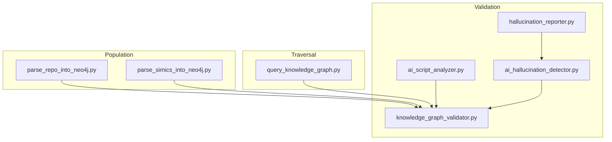
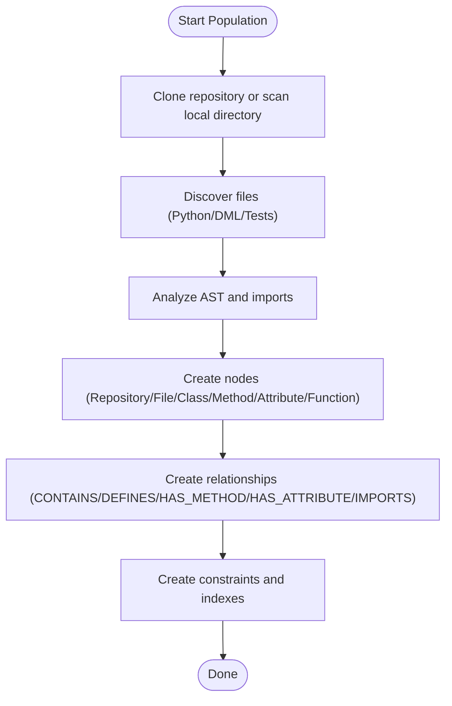
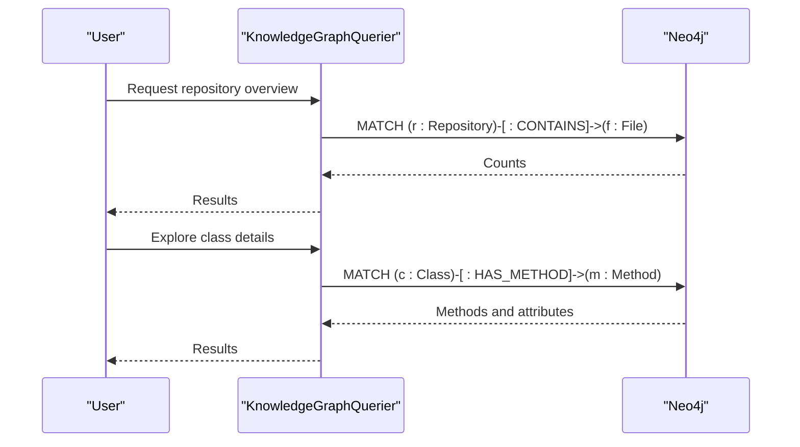
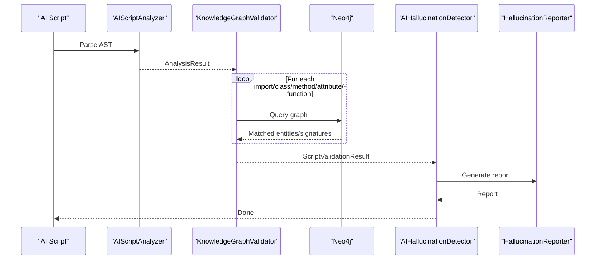
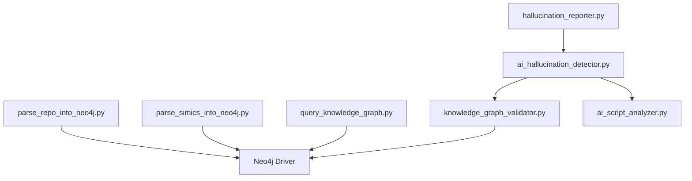

# Neo4j Knowledge Graph Schema

<cite>
**Referenced Files in This Document**
- [parse_repo_into_neo4j.py](file://knowledge_graphs/parse_repo_into_neo4j.py)
- [parse_simics_into_neo4j.py](file://knowledge_graphs/parse_simics_into_neo4j.py)
- [query_knowledge_graph.py](file://knowledge_graphs/query_knowledge_graph.py)
- [knowledge_graph_validator.py](file://knowledge_graphs/knowledge_graph_validator.py)
- [ai_script_analyzer.py](file://knowledge_graphs/ai_script_analyzer.py)
- [ai_hallucination_detector.py](file://knowledge_graphs/ai_hallucination_detector.py)
- [hallucination_reporter.py](file://knowledge_graphs/hallucination_reporter.py)
</cite>

## Table of Contents
1. [Introduction](#introduction)
2. [Project Structure](#project-structure)
3. [Core Components](#core-components)
4. [Architecture Overview](#architecture-overview)
5. [Detailed Component Analysis](#detailed-component-analysis)
6. [Dependency Analysis](#dependency-analysis)
7. [Performance Considerations](#performance-considerations)
8. [Troubleshooting Guide](#troubleshooting-guide)
9. [Conclusion](#conclusion)
10. [Appendices](#appendices)

## Introduction
This document describes the Neo4j knowledge graph schema used by the mcp-crawl4ai-rag project to represent Python codebases and Simics DML artifacts. It covers node labels, key properties, relationship types, constraints and indexes, and how the graph is populated and queried. It also explains how the schema supports AI hallucination detection by validating code relationships and dependencies against the actual repository structure.

## Project Structure
The knowledge graph is built and consumed by several modules:
- Graph population: parse_repo_into_neo4j.py and parse_simics_into_neo4j.py
- Graph traversal and inspection: query_knowledge_graph.py
- Validation and hallucination detection: knowledge_graph_validator.py, ai_script_analyzer.py, ai_hallucination_detector.py, hallucination_reporter.py

**Diagram sources**
- [parse_repo_into_neo4j.py](file://knowledge_graphs/parse_repo_into_neo4j.py#L420-L436)
- [parse_simics_into_neo4j.py](file://knowledge_graphs/parse_simics_into_neo4j.py#L182-L224)
- [query_knowledge_graph.py](file://knowledge_graphs/query_knowledge_graph.py#L39-L93)
- [knowledge_graph_validator.py](file://knowledge_graphs/knowledge_graph_validator.py#L100-L164)
- [ai_script_analyzer.py](file://knowledge_graphs/ai_script_analyzer.py#L85-L133)
- [ai_hallucination_detector.py](file://knowledge_graphs/ai_hallucination_detector.py#L31-L62)
- [hallucination_reporter.py](file://knowledge_graphs/hallucination_reporter.py#L21-L40)

**Section sources**
- [parse_repo_into_neo4j.py](file://knowledge_graphs/parse_repo_into_neo4j.py#L420-L436)
- [parse_simics_into_neo4j.py](file://knowledge_graphs/parse_simics_into_neo4j.py#L182-L224)
- [query_knowledge_graph.py](file://knowledge_graphs/query_knowledge_graph.py#L39-L93)
- [knowledge_graph_validator.py](file://knowledge_graphs/knowledge_graph_validator.py#L100-L164)
- [ai_script_analyzer.py](file://knowledge_graphs/ai_script_analyzer.py#L85-L133)
- [ai_hallucination_detector.py](file://knowledge_graphs/ai_hallucination_detector.py#L31-L62)
- [hallucination_reporter.py](file://knowledge_graphs/hallucination_reporter.py#L21-L40)

## Core Components
- Node labels and properties
  - Repository: name, created_at
  - File: name, path, module_name, line_count, created_at, file_type (Simics)
  - Class: name, full_name, created_at
  - Method: name, full_name, method_id, args, params_list, params_detailed, return_type, created_at
  - Attribute: name, full_name, attr_id, type
  - Function: name, full_name, func_id, args, params_list, params_detailed, return_type
  - DMLDevice, DMLInterface, DMLMethod, DMLAttribute, DMLRegister (Simics)
  - TestFile, TestFunction, TestFixture, SimicsAPI, DeviceUnderTest (Simics)

- Relationship types
  - CONTAINS: Repository → File
  - DEFINES: File → Class, File → Function
  - HAS_METHOD: Class → Method
  - HAS_ATTRIBUTE: Class → Attribute
  - IMPORTS: File → File
  - INHERITS_FROM: DMLDevice → DMLDevice
  - TESTS: TestFunction → DMLDevice
  - USES_API: TestFunction → SimicsAPI
  - CONTAINS: TestFile → TestFunction
  - CONTAINS: File → DMLFile
  - CONTAINS: File → TestFile

- Constraints and indexes
  - Unique constraints: File.path, Class.full_name
  - Indexes: File.name, Class.name, Method.name
  - Additional Simics constraints/indexes for DMLDevice, DMLInterface, DMLFile, TestFunction, TestFixture, SimicsAPI, DeviceUnderTest

**Section sources**
- [parse_repo_into_neo4j.py](file://knowledge_graphs/parse_repo_into_neo4j.py#L420-L436)
- [parse_repo_into_neo4j.py](file://knowledge_graphs/parse_repo_into_neo4j.py#L616-L783)
- [parse_simics_into_neo4j.py](file://knowledge_graphs/parse_simics_into_neo4j.py#L182-L224)
- [parse_simics_into_neo4j.py](file://knowledge_graphs/parse_simics_into_neo4j.py#L311-L397)
- [parse_simics_into_neo4j.py](file://knowledge_graphs/parse_simics_into_neo4j.py#L398-L468)
- [parse_simics_into_neo4j.py](file://knowledge_graphs/parse_simics_into_neo4j.py#L469-L563)

## Architecture Overview
The system builds a knowledge graph from code repositories and Simics installations, then validates AI-generated scripts against the graph to detect hallucinations.

```mermaid
sequenceDiagram
participant Repo as "Repository/Simics Source"
participant Pop as "Populator<br/>parse_repo_into_neo4j.py / parse_simics_into_neo4j.py"
participant DB as "Neo4j"
participant Analyzer as "AST Analyzer<br/>ai_script_analyzer.py"
participant Validator as "KnowledgeGraphValidator"
participant Detector as "AIHallucinationDetector"
participant Reporter as "HallucinationReporter"
Repo->>Pop : Provide code files
Pop->>DB : Create nodes and relationships
Analyzer->>Analyzer : Parse script AST
Analyzer-->>Validator : AnalysisResult
Validator->>DB : Query graph for imports/classes/methods/functions
DB-->>Validator : Matched entities and signatures
Validator-->>Detector : ScriptValidationResult
Detector->>Reporter : Generate comprehensive report
Reporter-->>Detector : Report
Detector-->>Analyzer : Done
```

**Diagram sources**
- [parse_repo_into_neo4j.py](file://knowledge_graphs/parse_repo_into_neo4j.py#L529-L612)
- [parse_simics_into_neo4j.py](file://knowledge_graphs/parse_simics_into_neo4j.py#L98-L121)
- [ai_script_analyzer.py](file://knowledge_graphs/ai_script_analyzer.py#L85-L133)
- [knowledge_graph_validator.py](file://knowledge_graphs/knowledge_graph_validator.py#L129-L164)
- [ai_hallucination_detector.py](file://knowledge_graphs/ai_hallucination_detector.py#L48-L122)
- [hallucination_reporter.py](file://knowledge_graphs/hallucination_reporter.py#L21-L40)

## Detailed Component Analysis

### Nodes and Properties
- Repository
  - Properties: name, created_at
  - Purpose: Top-level container for a codebase
- File
  - Properties: name, path, module_name, line_count, created_at, file_type
  - Purpose: Represents a source file; path is unique
- Class
  - Properties: name, full_name, created_at
  - Purpose: Represents a class; full_name is unique
- Method
  - Properties: name, full_name, method_id, args, params_list, params_detailed, return_type, created_at
  - Purpose: Represents a method; method_id is unique
- Attribute
  - Properties: name, full_name, attr_id, type
  - Purpose: Represents a class attribute; attr_id is unique
- Function
  - Properties: name, full_name, func_id, args, params_list, params_detailed, return_type
  - Purpose: Represents a top-level function; func_id is unique
- Simics nodes
  - DMLFile, DMLDevice, DMLInterface, DMLMethod, DMLAttribute, DMLRegister
  - TestFile, TestFunction, TestFixture, SimicsAPI, DeviceUnderTest
  - Properties vary by type; unique constraints and indexes defined for uniqueness and performance

**Section sources**
- [parse_repo_into_neo4j.py](file://knowledge_graphs/parse_repo_into_neo4j.py#L616-L783)
- [parse_simics_into_neo4j.py](file://knowledge_graphs/parse_simics_into_neo4j.py#L311-L397)
- [parse_simics_into_neo4j.py](file://knowledge_graphs/parse_simics_into_neo4j.py#L398-L468)
- [parse_simics_into_neo4j.py](file://knowledge_graphs/parse_simics_into_neo4j.py#L469-L563)

### Relationships
- CONTAINS: Repository → File
- DEFINES: File → Class, File → Function
- HAS_METHOD: Class → Method
- HAS_ATTRIBUTE: Class → Attribute
- IMPORTS: File → File (internal imports only)
- INHERITS_FROM: DMLDevice → DMLDevice
- TESTS: TestFunction → DMLDevice
- USES_API: TestFunction → SimicsAPI
- CONTAINS: TestFile → TestFunction
- CONTAINS: File → DMLFile
- CONTAINS: File → TestFile

These relationships form a layered graph that connects repositories to files, files to definitions, and definitions to members (classes to methods/attributes, files to functions), plus Simics-specific links between tests, APIs, and devices.

**Section sources**
- [parse_repo_into_neo4j.py](file://knowledge_graphs/parse_repo_into_neo4j.py#L643-L783)
- [parse_simics_into_neo4j.py](file://knowledge_graphs/parse_simics_into_neo4j.py#L311-L397)
- [parse_simics_into_neo4j.py](file://knowledge_graphs/parse_simics_into_neo4j.py#L398-L468)
- [parse_simics_into_neo4j.py](file://knowledge_graphs/parse_simics_into_neo4j.py#L469-L563)

### Constraints and Indexes
- Unique constraints
  - File.path
  - Class.full_name
  - DMLDevice.name, DMLInterface.name, DMLFile.file_path, TestFunction(name,file_path), TestFixture(name,file_path), SimicsAPI.name, DeviceUnderTest.name
- Indexes
  - File.name
  - Class.name
  - Method.name
  - DMLMethod.name, DMLAttribute.name, TestFunction.category, SimicsAPI.module

These ensure referential integrity and accelerate lookups during validation and traversal.

**Section sources**
- [parse_repo_into_neo4j.py](file://knowledge_graphs/parse_repo_into_neo4j.py#L420-L436)
- [parse_simics_into_neo4j.py](file://knowledge_graphs/parse_simics_into_neo4j.py#L182-L224)

### Population Logic
- parse_repo_into_neo4j.py
  - Clones repository (shallow), enumerates Python files, identifies project modules, parses AST to extract classes, methods, functions, and imports, then creates nodes and relationships in Neo4j using MERGE to avoid duplicates.
  - Creates constraints and indexes on initialization.
  - Provides a search helper to find files importing a given module.
- parse_simics_into_neo4j.py
  - Extends the base extractor to support Simics: DML files, test files, and Python files.
  - Sets up Simics-specific constraints and indexes.
  - Creates nodes for DML devices/interfaces/methods/attributes/registers, test functions/fixtures, and Simics APIs.
  - Establishes relationships among Simics elements.

**Diagram sources**
- [parse_repo_into_neo4j.py](file://knowledge_graphs/parse_repo_into_neo4j.py#L529-L612)
- [parse_repo_into_neo4j.py](file://knowledge_graphs/parse_repo_into_neo4j.py#L612-L783)
- [parse_simics_into_neo4j.py](file://knowledge_graphs/parse_simics_into_neo4j.py#L98-L121)
- [parse_simics_into_neo4j.py](file://knowledge_graphs/parse_simics_into_neo4j.py#L182-L224)

**Section sources**
- [parse_repo_into_neo4j.py](file://knowledge_graphs/parse_repo_into_neo4j.py#L529-L612)
- [parse_repo_into_neo4j.py](file://knowledge_graphs/parse_repo_into_neo4j.py#L612-L783)
- [parse_simics_into_neo4j.py](file://knowledge_graphs/parse_simics_into_neo4j.py#L98-L121)
- [parse_simics_into_neo4j.py](file://knowledge_graphs/parse_simics_into_neo4j.py#L182-L224)

### Traversal Patterns
- query_knowledge_graph.py
  - Lists repositories, explores repository counts, lists classes, explores a class’s methods and attributes, searches methods by name, and runs custom Cypher queries.
  - Uses CONTAINS, DEFINES, HAS_METHOD, HAS_ATTRIBUTE relationships to navigate the graph.

**Diagram sources**
- [query_knowledge_graph.py](file://knowledge_graphs/query_knowledge_graph.py#L39-L93)
- [query_knowledge_graph.py](file://knowledge_graphs/query_knowledge_graph.py#L133-L211)

**Section sources**
- [query_knowledge_graph.py](file://knowledge_graphs/query_knowledge_graph.py#L39-L93)
- [query_knowledge_graph.py](file://knowledge_graphs/query_knowledge_graph.py#L133-L211)

### Validation and Hallucination Detection
- ai_script_analyzer.py
  - Parses AI-generated Python scripts to extract imports, class instantiations, method calls, function calls, and attribute accesses.
  - Infers object types for method calls and attribute accesses using variable assignments and context managers.
- knowledge_graph_validator.py
  - Validates imports, classes, methods, attributes, and functions against the knowledge graph.
  - Builds caches for modules, classes, and methods to improve performance.
  - Calculates overall confidence and detects hallucinations (non-existent methods/attributes, invalid parameters).
- ai_hallucination_detector.py
  - Orchestrates the end-to-end process: AST analysis, graph validation, report generation.
- hallucination_reporter.py
  - Generates JSON and Markdown reports summarizing validation results, hallucinations, and recommendations.

**Diagram sources**
- [ai_script_analyzer.py](file://knowledge_graphs/ai_script_analyzer.py#L85-L133)
- [knowledge_graph_validator.py](file://knowledge_graphs/knowledge_graph_validator.py#L129-L164)
- [knowledge_graph_validator.py](file://knowledge_graphs/knowledge_graph_validator.py#L644-L704)
- [knowledge_graph_validator.py](file://knowledge_graphs/knowledge_graph_validator.py#L822-L870)
- [knowledge_graph_validator.py](file://knowledge_graphs/knowledge_graph_validator.py#L871-L942)
- [knowledge_graph_validator.py](file://knowledge_graphs/knowledge_graph_validator.py#L943-L992)
- [knowledge_graph_validator.py](file://knowledge_graphs/knowledge_graph_validator.py#L993-L1053)
- [ai_hallucination_detector.py](file://knowledge_graphs/ai_hallucination_detector.py#L48-L122)
- [hallucination_reporter.py](file://knowledge_graphs/hallucination_reporter.py#L21-L40)

**Section sources**
- [ai_script_analyzer.py](file://knowledge_graphs/ai_script_analyzer.py#L85-L133)
- [knowledge_graph_validator.py](file://knowledge_graphs/knowledge_graph_validator.py#L129-L164)
- [knowledge_graph_validator.py](file://knowledge_graphs/knowledge_graph_validator.py#L644-L704)
- [knowledge_graph_validator.py](file://knowledge_graphs/knowledge_graph_validator.py#L822-L870)
- [knowledge_graph_validator.py](file://knowledge_graphs/knowledge_graph_validator.py#L871-L942)
- [knowledge_graph_validator.py](file://knowledge_graphs/knowledge_graph_validator.py#L943-L992)
- [knowledge_graph_validator.py](file://knowledge_graphs/knowledge_graph_validator.py#L993-L1053)
- [ai_hallucination_detector.py](file://knowledge_graphs/ai_hallucination_detector.py#L48-L122)
- [hallucination_reporter.py](file://knowledge_graphs/hallucination_reporter.py#L21-L40)

## Dependency Analysis
- Coupling
  - knowledge_graph_validator.py depends on Neo4j driver and the AST analysis results from ai_script_analyzer.py.
  - ai_hallucination_detector.py composes ai_script_analyzer, knowledge_graph_validator, and hallucination_reporter.
  - query_knowledge_graph.py depends on Neo4j driver for ad-hoc exploration.
  - parse_repo_into_neo4j.py and parse_simics_into_neo4j.py depend on Neo4j driver and AST parsing.

- Cohesion
  - Each module has a focused responsibility: population, traversal, validation, reporting, and orchestration.

- External dependencies
  - Neo4j driver for asynchronous graph operations.
  - AST parsing for Python code analysis.
  - Environment variables for Neo4j credentials.

**Diagram sources**
- [parse_repo_into_neo4j.py](file://knowledge_graphs/parse_repo_into_neo4j.py#L406-L413)
- [parse_simics_into_neo4j.py](file://knowledge_graphs/parse_simics_into_neo4j.py#L41-L46)
- [query_knowledge_graph.py](file://knowledge_graphs/query_knowledge_graph.py#L20-L38)
- [knowledge_graph_validator.py](file://knowledge_graphs/knowledge_graph_validator.py#L116-L128)
- [ai_script_analyzer.py](file://knowledge_graphs/ai_script_analyzer.py#L85-L133)
- [ai_hallucination_detector.py](file://knowledge_graphs/ai_hallucination_detector.py#L31-L62)
- [hallucination_reporter.py](file://knowledge_graphs/hallucination_reporter.py#L21-L40)

**Section sources**
- [parse_repo_into_neo4j.py](file://knowledge_graphs/parse_repo_into_neo4j.py#L406-L413)
- [parse_simics_into_neo4j.py](file://knowledge_graphs/parse_simics_into_neo4j.py#L41-L46)
- [query_knowledge_graph.py](file://knowledge_graphs/query_knowledge_graph.py#L20-L38)
- [knowledge_graph_validator.py](file://knowledge_graphs/knowledge_graph_validator.py#L116-L128)
- [ai_script_analyzer.py](file://knowledge_graphs/ai_script_analyzer.py#L85-L133)
- [ai_hallucination_detector.py](file://knowledge_graphs/ai_hallucination_detector.py#L31-L62)
- [hallucination_reporter.py](file://knowledge_graphs/hallucination_reporter.py#L21-L40)

## Performance Considerations
- Use MERGE for node creation to avoid duplicates and reduce write overhead.
- Create indexes on frequently queried properties (File.name, Class.name, Method.name) to accelerate lookups.
- Cache lookups for modules, classes, and methods to minimize repeated queries.
- Prefer repository-scoped queries when full names are dotted to narrow search scope.
- Limit result sets with LIMIT clauses in exploratory queries.

[No sources needed since this section provides general guidance]

## Troubleshooting Guide
- Duplicate nodes
  - Ensure MERGE is used for nodes with unique identifiers (e.g., File.path, Class.full_name, Method.method_id, Attribute.attr_id, Function.func_id).
- Missing relationships
  - Verify IMPORTS targets resolve to existing File nodes by module_name; use CONTAINS/DEFINES relationships to connect files to classes/functions.
- Parameter validation failures
  - Confirm that expected parameter lists align with the graph’s stored signatures; detailed parameter formats are parsed and validated comprehensively.
- External library usage
  - Imports not present in the knowledge graph are treated as external; validation skips them to avoid false positives.

**Section sources**
- [parse_repo_into_neo4j.py](file://knowledge_graphs/parse_repo_into_neo4j.py#L616-L783)
- [knowledge_graph_validator.py](file://knowledge_graphs/knowledge_graph_validator.py#L539-L641)
- [knowledge_graph_validator.py](file://knowledge_graphs/knowledge_graph_validator.py#L1194-L1244)

## Conclusion
The Neo4j knowledge graph schema in mcp-crawl4ai-rag captures repository structure and Simics artifacts with robust constraints and indexes. The AST-based validation pipeline compares AI-generated code against the graph to detect hallucinations, leveraging relationships like CONTAINS, DEFINES, HAS_METHOD, HAS_ATTRIBUTE, and IMPORTS. The schema supports efficient traversal and validation, enabling reliable RAG-assisted code verification.

[No sources needed since this section summarizes without analyzing specific files]

## Appendices

### Sample Cypher Queries
- Find all methods in a file
  - MATCH (f:File {path: "<file_path>"})-[:DEFINES]->(c:Class)-[:HAS_METHOD]->(m:Method) RETURN m.name, m.params_list, m.return_type
- Trace function calls
  - MATCH (f:Function {name: "<func_name>"}) RETURN f.name, f.params_list, f.return_type
- Explore a class and its members
  - MATCH (c:Class {name: "<class_name>"})-[:HAS_METHOD]->(m:Method) RETURN m.name, m.params_list, m.return_type
  - MATCH (c:Class {name: "<class_name>"})-[:HAS_ATTRIBUTE]->(a:Attribute) RETURN a.name, a.type
- Find imports
  - MATCH (source:File {path: "<source_path>"})-[:IMPORTS]->(target:File) RETURN target.module_name

**Section sources**
- [query_knowledge_graph.py](file://knowledge_graphs/query_knowledge_graph.py#L133-L211)
- [parse_repo_into_neo4j.py](file://knowledge_graphs/parse_repo_into_neo4j.py#L766-L778)

### How the Graph Integrates with RAG
- The knowledge graph serves as a structured knowledge base for repository structure and Simics domain knowledge.
- AI hallucination detection compares AI-generated code against the graph to ensure imports, classes, methods, attributes, and functions exist and have correct signatures.
- Reports generated by hallucination_reporter.py summarize validation outcomes and suggest corrections.

**Section sources**
- [ai_script_analyzer.py](file://knowledge_graphs/ai_script_analyzer.py#L85-L133)
- [knowledge_graph_validator.py](file://knowledge_graphs/knowledge_graph_validator.py#L129-L164)
- [hallucination_reporter.py](file://knowledge_graphs/hallucination_reporter.py#L21-L40)