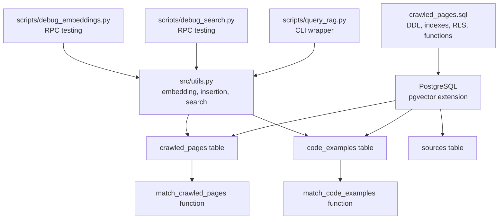
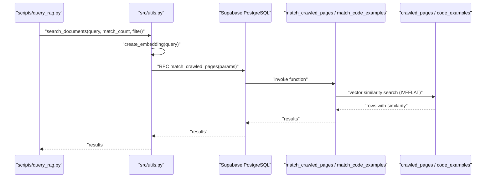
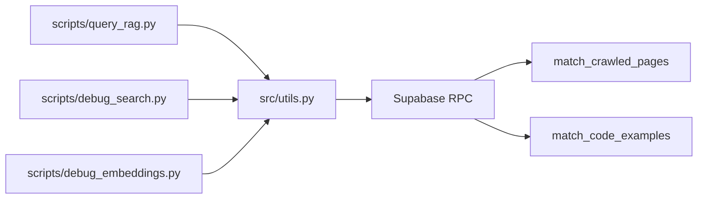

# Supabase Database Schema

<cite>
**Referenced Files in This Document**
- [crawled_pages.sql](file://crawled_pages.sql)
- [utils.py](file://src/utils.py)
- [query_rag.py](file://scripts/query_rag.py)
- [debug_search.py](file://scripts/debug_search.py)
- [debug_embeddings.py](file://scripts/debug_embeddings.py)
- [README.md](file://README.md)
</cite>

## Table of Contents
1. [Introduction](#introduction)
2. [Project Structure](#project-structure)
3. [Core Components](#core-components)
4. [Architecture Overview](#architecture-overview)
5. [Detailed Component Analysis](#detailed-component-analysis)
6. [Dependency Analysis](#dependency-analysis)
7. [Performance Considerations](#performance-considerations)
8. [Troubleshooting Guide](#troubleshooting-guide)
9. [Conclusion](#conclusion)
10. [Appendices](#appendices)

## Introduction
This document provides comprehensive data model documentation for the Supabase schema used in the mcp-crawl4ai-rag project. It focuses on three core tables: sources, crawled_pages, and code_examples. For each table, it documents fields, data types, constraints, indexes, and relationships. It explains the vector(1536) embedding fields and their role in semantic search, describes the match_crawled_pages and match_code_examples functions that enable vector similarity search using cosine distance, and details Row Level Security (RLS) policies that allow public read access. It also covers metadata jsonb fields enabling flexible filtering and the use of GIN indexes for performance, and provides examples of common query patterns and optimization techniques.

## Project Structure
The database schema is defined in a single SQL script and consumed by Python utilities that embed content, insert records, and perform vector similarity searches.

**Diagram sources**
- [crawled_pages.sql](file://crawled_pages.sql#L1-L175)
- [utils.py](file://src/utils.py#L548-L984)
- [query_rag.py](file://scripts/query_rag.py#L1-L348)
- [debug_search.py](file://scripts/debug_search.py#L57-L95)
- [debug_embeddings.py](file://scripts/debug_embeddings.py#L55-L88)

**Section sources**
- [crawled_pages.sql](file://crawled_pages.sql#L1-L175)
- [README.md](file://README.md#L150-L160)

## Core Components
- sources: Stores source metadata (primary key source_id, summary, total_word_count, timestamps).
- crawled_pages: Stores document chunks with embeddings and metadata; enforces unique(url, chunk_number); foreign key to sources.
- code_examples: Stores code examples with embeddings and metadata; enforces unique(url, chunk_number); foreign key to sources.

Key schema elements:
- vector(1536) embedding fields for semantic similarity.
- IVFFLAT index on embedding with vector_cosine_ops for approximate nearest neighbor search.
- GIN index on metadata jsonb for fast filtering.
- RLS enabled with public SELECT policies.

**Section sources**
- [crawled_pages.sql](file://crawled_pages.sql#L10-L118)
- [crawled_pages.sql](file://crawled_pages.sql#L120-L175)

## Architecture Overview
The system uses Supabase PostgreSQL with pgvector to support semantic search. Python utilities embed text, insert records into sources, crawled_pages, and code_examples, and call stored procedures to retrieve semantically similar content. The CLI scripts demonstrate usage patterns and RPC testing.

**Diagram sources**
- [query_rag.py](file://scripts/query_rag.py#L1-L348)
- [utils.py](file://src/utils.py#L548-L587)
- [crawled_pages.sql](file://crawled_pages.sql#L46-L79)

## Detailed Component Analysis

### sources table
Fields:
- source_id (text, primary key)
- summary (text)
- total_word_count (integer, default 0)
- created_at (timestamp with time zone, default UTC now)
- updated_at (timestamp with time zone, default UTC now)

Constraints and indexes:
- Primary key on source_id.

Relationships:
- Referenced by foreign keys in crawled_pages and code_examples.

RLS:
- Enabled with public SELECT policy.

Notes:
- Used to summarize and track source-level statistics.

**Section sources**
- [crawled_pages.sql](file://crawled_pages.sql#L10-L16)
- [crawled_pages.sql](file://crawled_pages.sql#L91-L99)

### crawled_pages table
Fields:
- id (bigserial, primary key)
- url (varchar, not null)
- chunk_number (integer, not null)
- content (text, not null)
- metadata (jsonb, not null, default empty json)
- source_id (text, not null)
- embedding (vector(1536))
- created_at (timestamp with time zone, default UTC now)

Constraints and indexes:
- Unique constraint on (url, chunk_number).
- Foreign key to sources(source_id).
- IVFFLAT index on embedding using vector_cosine_ops.
- GIN index on metadata.
- Index on source_id.

RLS:
- Enabled with public SELECT policy.

Purpose:
- Stores document chunks with embeddings for semantic search.
- Supports filtering via metadata jsonb and source_id.

**Section sources**
- [crawled_pages.sql](file://crawled_pages.sql#L19-L44)
- [crawled_pages.sql](file://crawled_pages.sql#L36-L44)
- [crawled_pages.sql](file://crawled_pages.sql#L81-L89)

### code_examples table
Fields:
- id (bigserial, primary key)
- url (varchar, not null)
- chunk_number (integer, not null)
- content (text, not null)
- summary (text, not null)
- metadata (jsonb, not null, default empty json)
- source_id (text, not null)
- embedding (vector(1536))
- created_at (timestamp with time zone, default UTC now)

Constraints and indexes:
- Unique constraint on (url, chunk_number).
- Foreign key to sources(source_id).
- IVFFLAT index on embedding using vector_cosine_ops.
- GIN index on metadata.
- Index on source_id.

RLS:
- Enabled with public SELECT policy.

Purpose:
- Stores code examples with embeddings for semantic search.
- Supports filtering via metadata jsonb and source_id.

**Section sources**
- [crawled_pages.sql](file://crawled_pages.sql#L101-L118)
- [crawled_pages.sql](file://crawled_pages.sql#L120-L128)
- [crawled_pages.sql](file://crawled_pages.sql#L167-L175)

### match_crawled_pages function
Purpose:
- Performs vector similarity search on crawled_pages using cosine distance.

Parameters:
- query_embedding (vector(1536))
- match_count (integer, default 10)
- filter (jsonb, default empty)
- source_filter (text, default NULL)

Returns:
- id, url, chunk_number, content, metadata, source_id, similarity (float)

Logic highlights:
- Uses 1 - (embedding <=> query_embedding) for cosine distance similarity.
- Filters rows where metadata @> filter and source_filter is null or equals source_id.
- Orders by similarity ascending (cosine distance) and limits results.

**Section sources**
- [crawled_pages.sql](file://crawled_pages.sql#L46-L79)

### match_code_examples function
Purpose:
- Performs vector similarity search on code_examples using cosine distance.

Parameters:
- query_embedding (vector(1536))
- match_count (integer, default 10)
- filter (jsonb, default empty)
- source_filter (text, default NULL)

Returns:
- id, url, chunk_number, content, summary, metadata, source_id, similarity (float)

Logic highlights:
- Uses 1 - (embedding <=> query_embedding) for cosine distance similarity.
- Filters rows where metadata @> filter and source_filter is null or equals source_id.
- Orders by similarity ascending (cosine distance) and limits results.

**Section sources**
- [crawled_pages.sql](file://crawled_pages.sql#L129-L166)

### Relationship and Referential Integrity
- crawled_pages.source_id references sources.source_id.
- code_examples.source_id references sources.source_id.
- Unique constraints on (url, chunk_number) prevent duplicate chunks for the same URL.

**Section sources**
- [crawled_pages.sql](file://crawled_pages.sql#L32-L34)
- [crawled_pages.sql](file://crawled_pages.sql#L113-L117)

### RLS Policies
- crawled_pages: public SELECT allowed.
- sources: public SELECT allowed.
- code_examples: public SELECT allowed.

**Section sources**
- [crawled_pages.sql](file://crawled_pages.sql#L81-L99)
- [crawled_pages.sql](file://crawled_pages.sql#L167-L175)

## Dependency Analysis
- Python utilities depend on Supabase client to call RPC functions and perform inserts/updates.
- CLI scripts orchestrate search and display results.
- Debug scripts validate RPC availability and basic search behavior.

**Diagram sources**
- [utils.py](file://src/utils.py#L548-L587)
- [utils.py](file://src/utils.py#L935-L984)
- [query_rag.py](file://scripts/query_rag.py#L1-L348)
- [debug_search.py](file://scripts/debug_search.py#L57-L95)
- [debug_embeddings.py](file://scripts/debug_embeddings.py#L55-L88)

**Section sources**
- [utils.py](file://src/utils.py#L548-L587)
- [utils.py](file://src/utils.py#L935-L984)
- [query_rag.py](file://scripts/query_rag.py#L1-L348)
- [debug_search.py](file://scripts/debug_search.py#L57-L95)
- [debug_embeddings.py](file://scripts/debug_embeddings.py#L55-L88)

## Performance Considerations
- Vector similarity:
  - IVFFLAT index on embedding with vector_cosine_ops enables efficient approximate nearest neighbor search.
  - Use match_count to limit results and reduce network overhead.
- Metadata filtering:
  - GIN index on metadata jsonb accelerates containment filters like metadata @> filter.
  - Prefer targeted filters to minimize result sets.
- Indexing strategy:
  - Ensure IVFFLAT index exists on embedding for both tables.
  - Maintain indexes on source_id for source-level filtering.
- Embedding dimensionality:
  - Embeddings are vector(1536), aligning with OpenAI/Copilot text-embedding-3-small.
- RLS overhead:
  - RLS is enabled for public reads; keep policies minimal to avoid unnecessary checks.
- Batch operations:
  - Use batch insert/upsert patterns to reduce round trips and improve throughput.

[No sources needed since this section provides general guidance]

## Troubleshooting Guide
Common issues and resolutions:
- pgvector extension missing:
  - Ensure the extension is installed in the database before running the schema script.
- RPC function not found:
  - Verify the schema script executed successfully and the functions exist.
- Zero similarity or unexpected results:
  - Confirm embeddings are non-zero and dimensionally consistent (1536).
  - Validate that metadata filters are correctly structured and match indexed fields.
- Slow queries:
  - Confirm IVFFLAT index on embedding is present and built.
  - Reduce match_count and refine metadata filters.
- Duplicate chunks:
  - Unique constraints on (url, chunk_number) prevent duplicates; ensure consistent chunk numbering.

**Section sources**
- [crawled_pages.sql](file://crawled_pages.sql#L1-L175)
- [debug_search.py](file://scripts/debug_search.py#L57-L95)
- [debug_embeddings.py](file://scripts/debug_embeddings.py#L55-L88)

## Conclusion
The Supabase schema in this project is designed for efficient semantic search over documentation and code examples. The sources table provides source-level metadata, while crawled_pages and code_examples store chunked content with vector embeddings and flexible metadata. IVFFLAT indexes on embeddings and GIN indexes on metadata enable fast similarity and filtering. Public RLS policies allow read access, and Python utilities provide robust embedding, insertion, and search capabilities. Proper indexing, targeted filters, and batch operations are essential for performance.

[No sources needed since this section summarizes without analyzing specific files]

## Appendices

### Field and Constraint Reference
- sources
  - source_id (PK)
  - summary
  - total_word_count
  - created_at, updated_at
- crawled_pages
  - id (PK)
  - url
  - chunk_number
  - content
  - metadata (jsonb)
  - source_id (FK)
  - embedding (vector(1536))
  - created_at
  - Unique(url, chunk_number)
- code_examples
  - id (PK)
  - url
  - chunk_number
  - content
  - summary
  - metadata (jsonb)
  - source_id (FK)
  - embedding (vector(1536))
  - created_at
  - Unique(url, chunk_number)

**Section sources**
- [crawled_pages.sql](file://crawled_pages.sql#L10-L118)

### Vector Embedding Role and Cosine Distance
- Embeddings are vector(1536) aligned with OpenAI/Copilot text-embedding-3-small.
- Similarity computed as 1 - (embedding <=> query_embedding) using cosine distance.
- IVFFLAT index with vector_cosine_ops optimizes ANN search.

**Section sources**
- [crawled_pages.sql](file://crawled_pages.sql#L26-L26)
- [crawled_pages.sql](file://crawled_pages.sql#L110-L110)
- [crawled_pages.sql](file://crawled_pages.sql#L37-L37)
- [crawled_pages.sql](file://crawled_pages.sql#L121-L121)

### Common Query Patterns
- Semantic search with metadata filter:
  - Use match_crawled_pages with filter parameter to restrict results by metadata fields.
- Source-scoped search:
  - Use source_filter to constrain results to a specific source_id.
- Multi-source aggregation:
  - Execute separate searches per source_id and merge results by similarity.
- Public read access:
  - RLS allows public SELECT on sources, crawled_pages, and code_examples.

**Section sources**
- [utils.py](file://src/utils.py#L548-L587)
- [utils.py](file://src/utils.py#L935-L984)
- [query_rag.py](file://scripts/query_rag.py#L1-L348)
- [crawled_pages.sql](file://crawled_pages.sql#L81-L99)
- [crawled_pages.sql](file://crawled_pages.sql#L167-L175)

### Indexing Strategies
- IVFFLAT index on embedding with vector_cosine_ops for both tables.
- GIN index on metadata jsonb for containment filtering.
- Index on source_id for source-level filtering.

**Section sources**
- [crawled_pages.sql](file://crawled_pages.sql#L36-L44)
- [crawled_pages.sql](file://crawled_pages.sql#L120-L128)

### RLS Policies Summary
- sources: public SELECT allowed.
- crawled_pages: public SELECT allowed.
- code_examples: public SELECT allowed.

**Section sources**
- [crawled_pages.sql](file://crawled_pages.sql#L81-L99)
- [crawled_pages.sql](file://crawled_pages.sql#L167-L175)