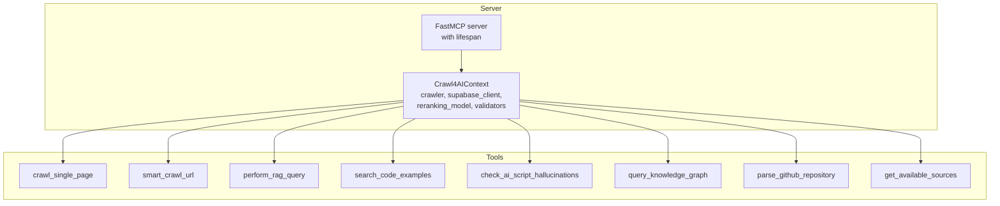
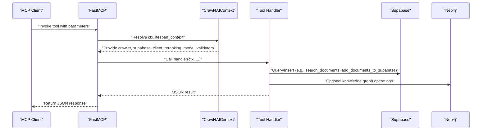
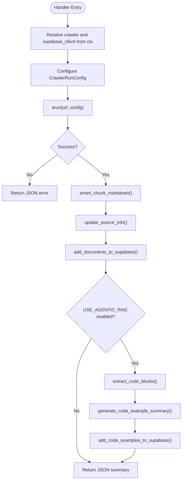
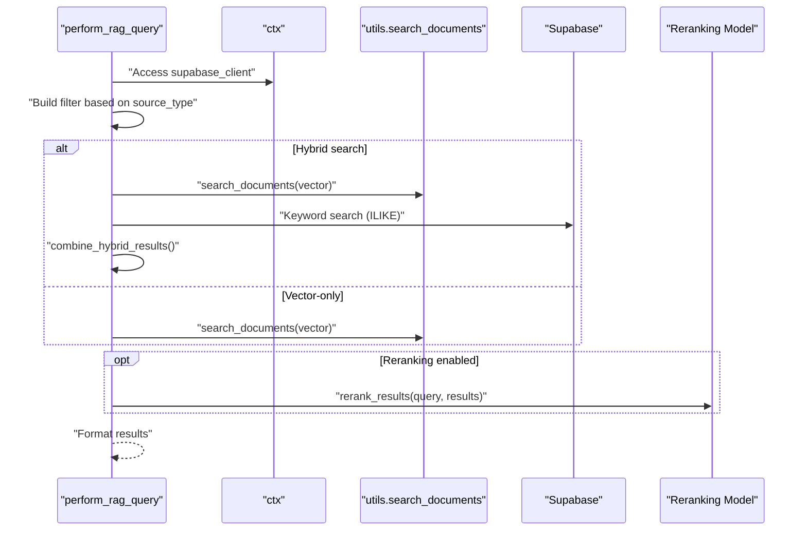
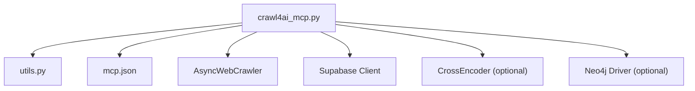

# Building Custom Tools

<cite>
**Referenced Files in This Document**
- [crawl4ai_mcp.py](file://src/crawl4ai_mcp.py)
- [utils.py](file://src/utils.py)
- [mcp.json](file://mcp.json)
- [README.md](file://README.md)
</cite>

## Table of Contents
1. [Introduction](#introduction)
2. [Project Structure](#project-structure)
3. [Core Components](#core-components)
4. [Architecture Overview](#architecture-overview)
5. [Detailed Component Analysis](#detailed-component-analysis)
6. [Dependency Analysis](#dependency-analysis)
7. [Performance Considerations](#performance-considerations)
8. [Troubleshooting Guide](#troubleshooting-guide)
9. [Conclusion](#conclusion)
10. [Appendices](#appendices)

## Introduction
This document explains how to build custom tools for the MCP server in this repository. It focuses on the MCP protocol-compliant tool registration pattern using the @mcp.tool() decorator, handler function signatures, parameter definitions, return value specifications, and error handling. It also covers how tools are exposed to MCP clients via the mcp.json configuration and how to leverage the Context object for dependency injection and lifecycle management. Concrete examples from the existing codebase illustrate best practices for tool design, including the crawl_single_page and perform_rag_query tools.

## Project Structure
The MCP server is implemented in a single module that registers multiple tools and exposes them over SSE. The server’s lifecycle is managed by a lifespan context that initializes shared resources (crawler, Supabase client, optional reranking model, and knowledge graph components). Tool handlers receive a Context parameter that grants access to these resources.

**Diagram sources**
- [crawl4ai_mcp.py](file://src/crawl4ai_mcp.py#L295-L300)
- [crawl4ai_mcp.py](file://src/crawl4ai_mcp.py#L130-L293)
- [crawl4ai_mcp.py](file://src/crawl4ai_mcp.py#L1038-L1087)
- [crawl4ai_mcp.py](file://src/crawl4ai_mcp.py#L1349-L1348)
- [crawl4ai_mcp.py](file://src/crawl4ai_mcp.py#L1349-L1504)
- [crawl4ai_mcp.py](file://src/crawl4ai_mcp.py#L1506-L1601)
- [crawl4ai_mcp.py](file://src/crawl4ai_mcp.py#L1602-L2055)
- [crawl4ai_mcp.py](file://src/crawl4ai_mcp.py#L2057-L2184)

**Section sources**
- [crawl4ai_mcp.py](file://src/crawl4ai_mcp.py#L295-L300)
- [crawl4ai_mcp.py](file://src/crawl4ai_mcp.py#L130-L293)

## Core Components
- FastMCP server with a lifespan context that initializes:
  - AsyncWebCrawler
  - Supabase client
  - Optional reranking model
  - Optional knowledge graph components (validators and extractors)
- Tool handlers decorated with @mcp.tool() that:
  - Accept ctx: Context as the first parameter
  - Accept typed parameters as needed
  - Return a JSON string representation of the result
  - Handle errors gracefully and return structured error responses

Key examples:
- crawl_single_page: single-page crawling and storage
- perform_rag_query: vector search with hybrid and reranking support
- get_available_sources: list available sources for filtering
- search_code_examples: code example search with hybrid support
- check_ai_script_hallucinations: knowledge graph validation of Python scripts
- query_knowledge_graph: Neo4j exploration commands
- parse_github_repository: repository parsing into the knowledge graph

**Section sources**
- [crawl4ai_mcp.py](file://src/crawl4ai_mcp.py#L130-L293)
- [crawl4ai_mcp.py](file://src/crawl4ai_mcp.py#L1038-L1087)
- [crawl4ai_mcp.py](file://src/crawl4ai_mcp.py#L1349-L1504)
- [crawl4ai_mcp.py](file://src/crawl4ai_mcp.py#L1506-L1601)
- [crawl4ai_mcp.py](file://src/crawl4ai_mcp.py#L1602-L2055)
- [crawl4ai_mcp.py](file://src/crawl4ai_mcp.py#L2057-L2184)

## Architecture Overview
The server uses FastMCP with an async lifespan to manage dependencies. Tools are registered via @mcp.tool(), and handlers access dependencies from ctx.request_context.lifespan_context. The server runs over SSE by default, as configured in mcp.json.

**Diagram sources**
- [crawl4ai_mcp.py](file://src/crawl4ai_mcp.py#L295-L300)
- [crawl4ai_mcp.py](file://src/crawl4ai_mcp.py#L130-L293)
- [crawl4ai_mcp.py](file://src/crawl4ai_mcp.py#L1038-L1087)
- [utils.py](file://src/utils.py#L549-L587)

**Section sources**
- [mcp.json](file://mcp.json#L1-L9)
- [crawl4ai_mcp.py](file://src/crawl4ai_mcp.py#L2279-L2289)

## Detailed Component Analysis

### Tool Registration Pattern and Handler Signature
- Decorator: @mcp.tool()
- Signature pattern: async def handler(ctx: Context, ...) -> str
- Return type: JSON string (consistent across tools)
- Error handling: Return a JSON object with success: false and error: "<message>" on failure

Best practices:
- Always read dependencies from ctx.request_context.lifespan_context
- Validate parameters early and return structured errors
- Normalize environment-driven defaults inside the handler
- Keep handlers small and delegate heavy logic to utility functions

**Section sources**
- [crawl4ai_mcp.py](file://src/crawl4ai_mcp.py#L1038-L1087)
- [crawl4ai_mcp.py](file://src/crawl4ai_mcp.py#L1349-L1504)
- [crawl4ai_mcp.py](file://src/crawl4ai_mcp.py#L1506-L1601)
- [crawl4ai_mcp.py](file://src/crawl4ai_mcp.py#L1602-L2055)
- [crawl4ai_mcp.py](file://src/crawl4ai_mcp.py#L2057-L2184)

### Parameter Definitions and Return Value Specifications
- Parameters are defined as typed arguments in the handler signature.
- Return values are JSON strings with a consistent structure:
  - On success: success: true plus tool-specific fields
  - On error: success: false plus error: "<message>"
- Some tools return structured data (e.g., lists of results) embedded in the JSON string.

Examples:
- crawl_single_page: url, disable_javascript, chunk_size; returns summary of operation
- perform_rag_query: query, source_type, match_count; returns results with similarity/rerank_score
- search_code_examples: query, source_id, match_count; returns code examples with summaries
- check_ai_script_hallucinations: script_path; returns validation report
- query_knowledge_graph: command; returns command results and metadata
- parse_github_repository: repo_url; returns statistics and next steps
- get_available_sources: no parameters; returns list of sources

**Section sources**
- [crawl4ai_mcp.py](file://src/crawl4ai_mcp.py#L662-L831)
- [crawl4ai_mcp.py](file://src/crawl4ai_mcp.py#L833-L1037)
- [crawl4ai_mcp.py](file://src/crawl4ai_mcp.py#L1089-L1347)
- [crawl4ai_mcp.py](file://src/crawl4ai_mcp.py#L1349-L1504)
- [crawl4ai_mcp.py](file://src/crawl4ai_mcp.py#L1506-L1601)
- [crawl4ai_mcp.py](file://src/crawl4ai_mcp.py#L1602-L2055)
- [crawl4ai_mcp.py](file://src/crawl4ai_mcp.py#L2057-L2184)

### Error Handling Patterns
- Early validation: validate inputs and environment variables before proceeding
- Structured error responses: return JSON with success: false and error: "<message>"
- Graceful fallbacks: attempt fallback models or strategies (e.g., reranking model loading)
- Logging: print informative messages for debugging and monitoring

Common patterns:
- Environment checks (e.g., USE_KNOWLEDGE_GRAPH, USE_HYBRID_SEARCH, USE_RERANKING)
- Resource availability checks (e.g., supabase_client, reranking_model, knowledge_validator)
- URL/path validation helpers (validate_script_path, validate_github_url)

**Section sources**
- [crawl4ai_mcp.py](file://src/crawl4ai_mcp.py#L62-L118)
- [crawl4ai_mcp.py](file://src/crawl4ai_mcp.py#L1506-L1601)
- [crawl4ai_mcp.py](file://src/crawl4ai_mcp.py#L2057-L2184)

### Async/Await and Context Management
- Handlers are async and use await for I/O-bound operations (web crawling, database queries, embeddings)
- Context object provides access to:
  - ctx.request_context.lifespan_context.crawler
  - ctx.request_context.lifespan_context.supabase_client
  - ctx.request_context.lifespan_context.reranking_model
  - ctx.request_context.lifespan_context.knowledge_validator
  - ctx.request_context.lifespan_context.repo_extractor
- Lifespan manages resource initialization and cleanup

**Section sources**
- [crawl4ai_mcp.py](file://src/crawl4ai_mcp.py#L130-L293)
- [crawl4ai_mcp.py](file://src/crawl4ai_mcp.py#L2279-L2289)

### Concrete Examples

#### crawl_single_page
- Purpose: Crawl a single URL, chunk content, store in Supabase, optionally extract code examples
- Key steps:
  - Resolve crawler and supabase_client from ctx
  - Configure CrawlerRunConfig based on disable_javascript and environment
  - arun() to fetch markdown
  - smart_chunk_markdown() to split content
  - update_source_info() and add_documents_to_supabase()
  - Optional: extract_code_blocks() and add_code_examples_to_supabase()
- Parameters: url, disable_javascript, chunk_size
- Returns: JSON summary of operation

**Diagram sources**
- [crawl4ai_mcp.py](file://src/crawl4ai_mcp.py#L662-L831)
- [utils.py](file://src/utils.py#L383-L548)
- [utils.py](file://src/utils.py#L589-L717)

**Section sources**
- [crawl4ai_mcp.py](file://src/crawl4ai_mcp.py#L662-L831)
- [utils.py](file://src/utils.py#L383-L548)
- [utils.py](file://src/utils.py#L589-L717)

#### perform_rag_query
- Purpose: Vector search with optional hybrid search and reranking
- Key steps:
  - Resolve supabase_client from ctx
  - Build filter based on source_type (all/docs/dml/python/source)
  - Execute vector search or hybrid search (vector + keyword)
  - Optionally rerank with CrossEncoder
  - Format results with similarity or rerank_score
- Parameters: query, source_type, match_count
- Returns: JSON with results and metadata

**Diagram sources**
- [crawl4ai_mcp.py](file://src/crawl4ai_mcp.py#L1089-L1347)
- [utils.py](file://src/utils.py#L549-L587)
- [utils.py](file://src/utils.py#L1022-L1148)
- [utils.py](file://src/utils.py#L1150-L1187)

**Section sources**
- [crawl4ai_mcp.py](file://src/crawl4ai_mcp.py#L1089-L1347)
- [utils.py](file://src/utils.py#L549-L587)
- [utils.py](file://src/utils.py#L1022-L1148)
- [utils.py](file://src/utils.py#L1150-L1187)

### Best Practices for Tool Design
- Naming conventions:
  - Use descriptive names that reflect the tool’s purpose (e.g., crawl_single_page, perform_rag_query)
- Documentation strings:
  - Include parameter descriptions, return value specifications, and usage examples
- Parameter validation:
  - Validate required parameters and return structured errors
- Async patterns:
  - Use async handlers and await I/O-bound operations
- Context usage:
  - Access dependencies via ctx.request_context.lifespan_context
- Error handling:
  - Return JSON with success: false and error: "<message>"
- Environment-driven behavior:
  - Respect environment variables for toggling features (e.g., USE_HYBRID_SEARCH, USE_RERANKING)

**Section sources**
- [crawl4ai_mcp.py](file://src/crawl4ai_mcp.py#L662-L831)
- [crawl4ai_mcp.py](file://src/crawl4ai_mcp.py#L1089-L1347)
- [README.md](file://README.md#L663-L670)

## Dependency Analysis
The server depends on:
- FastMCP runtime and SSE transport
- AsyncWebCrawler for web crawling
- Supabase client for vector search and storage
- Optional reranking model (CrossEncoder)
- Optional Neo4j knowledge graph components

**Diagram sources**
- [crawl4ai_mcp.py](file://src/crawl4ai_mcp.py#L295-L300)
- [crawl4ai_mcp.py](file://src/crawl4ai_mcp.py#L130-L293)
- [utils.py](file://src/utils.py#L106-L119)
- [mcp.json](file://mcp.json#L1-L9)

**Section sources**
- [crawl4ai_mcp.py](file://src/crawl4ai_mcp.py#L295-L300)
- [crawl4ai_mcp.py](file://src/crawl4ai_mcp.py#L130-L293)
- [utils.py](file://src/utils.py#L106-L119)
- [mcp.json](file://mcp.json#L1-L9)

## Performance Considerations
- Concurrency:
  - Use MemoryAdaptiveDispatcher for parallel crawling
  - Use ThreadPoolExecutor for CPU-bound tasks (e.g., code example summarization)
- Batch operations:
  - Insert documents and code examples in batches to reduce overhead
- Embeddings:
  - Prefer batch embedding creation to minimize API calls
- Reranking:
  - Enable reranking only when beneficial; models can be expensive
- Filtering:
  - Use database-level filters to reduce result sets before reranking

**Section sources**
- [crawl4ai_mcp.py](file://src/crawl4ai_mcp.py#L2206-L2277)
- [utils.py](file://src/utils.py#L383-L548)
- [utils.py](file://src/utils.py#L719-L839)

## Troubleshooting Guide
Common issues and resolutions:
- Server not reachable:
  - Verify mcp.json transport and URL
  - Confirm server runs with the expected transport
- Missing environment variables:
  - Ensure SUPABASE_URL, SUPABASE_SERVICE_KEY, and other provider keys are set
  - For knowledge graph tools, set USE_KNOWLEDGE_GRAPH and Neo4j credentials
- Reranking model loading failures:
  - The server attempts fallback models; if both fail, reranking is disabled
- Knowledge graph tools unavailable:
  - Ensure USE_KNOWLEDGE_GRAPH is enabled and Neo4j credentials are valid
- Tool returns error:
  - Inspect the JSON error field for details
  - Check logs printed by the server for additional context

**Section sources**
- [mcp.json](file://mcp.json#L1-L9)
- [crawl4ai_mcp.py](file://src/crawl4ai_mcp.py#L130-L293)
- [crawl4ai_mcp.py](file://src/crawl4ai_mcp.py#L1506-L1601)
- [crawl4ai_mcp.py](file://src/crawl4ai_mcp.py#L2057-L2184)

## Conclusion
To build custom tools for the MCP server:
- Decorate handlers with @mcp.tool()
- Use async handlers that accept ctx: Context and typed parameters
- Access dependencies via ctx.request_context.lifespan_context
- Return JSON strings with success and error fields
- Leverage environment variables for configuration
- Follow the patterns demonstrated by crawl_single_page and perform_rag_query

These patterns ensure robust, maintainable tools that integrate seamlessly with the server’s lifecycle and external systems.

## Appendices

### How Tools Are Exposed to Clients
- The server runs over SSE by default and is configured in mcp.json
- Clients connect using the configured transport and URL

**Section sources**
- [mcp.json](file://mcp.json#L1-L9)
- [crawl4ai_mcp.py](file://src/crawl4ai_mcp.py#L2279-L2289)

### Building Your Own Server
- Add tools with @mcp.tool()
- Create a custom lifespan to inject dependencies
- Extend utils.py with helper functions
- Add specialized crawlers as needed

**Section sources**
- [README.md](file://README.md#L663-L670)