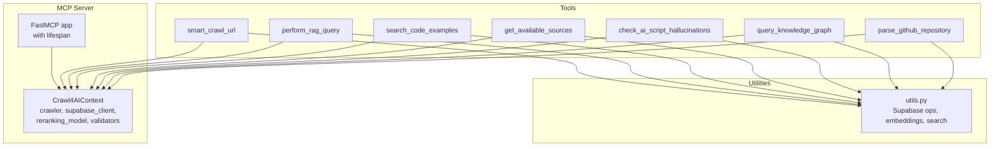
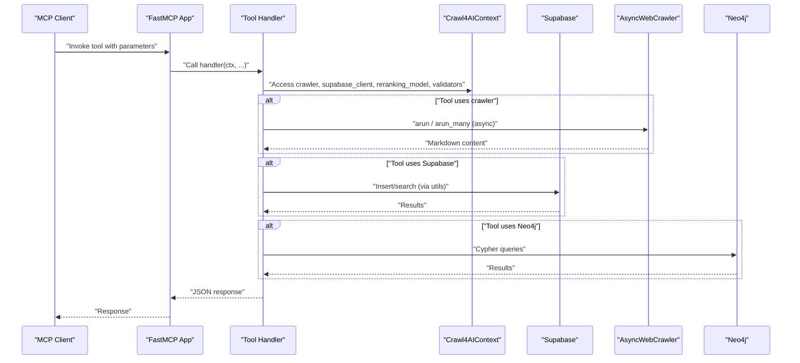
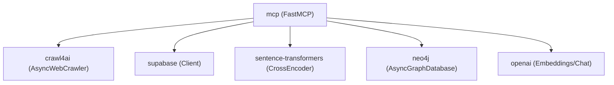

# Tool Implementation

<cite>
**Referenced Files in This Document**
- [crawl4ai_mcp.py](file://src/crawl4ai_mcp.py)
- [utils.py](file://src/utils.py)
- [mcp.json](file://mcp.json)
- [uv.lock](file://uv.lock)
- [query_knowledge_graph.py](file://knowledge_graphs/query_knowledge_graph.py)
- [parse_repo_into_neo4j.py](file://knowledge_graphs/parse_repo_into_neo4j.py)
</cite>

## Table of Contents
1. [Introduction](#introduction)
2. [Project Structure](#project-structure)
3. [Core Components](#core-components)
4. [Architecture Overview](#architecture-overview)
5. [Detailed Component Analysis](#detailed-component-analysis)
6. [Dependency Analysis](#dependency-analysis)
7. [Performance Considerations](#performance-considerations)
8. [Troubleshooting Guide](#troubleshooting-guide)
9. [Conclusion](#conclusion)
10. [Appendices](#appendices)

## Introduction
This document explains how to implement custom tools in the MCP server that integrates Crawl4AI with Supabase-backed RAG and optional Neo4j knowledge graph capabilities. It focuses on:
- Creating handler functions that receive the Context object and access the shared Crawl4AIContext
- Using async/await patterns for non-blocking operations
- Proper error handling with try/catch blocks
- Leveraging utilities from utils.py for database operations, embeddings, and search
- Managing state, timeouts, resource cleanup, and thread safety in asynchronous operations

The guide references concrete examples from existing tools such as smart_crawl_url and perform_rag_query to demonstrate best practices.

## Project Structure
The MCP server is implemented in a single module that defines:
- A FastMCP application with a lifespan context that initializes the crawler, Supabase client, optional reranking model, and optional Neo4j components
- Multiple tools exposed via decorators, including crawling, RAG querying, code example search, and knowledge graph utilities

**Diagram sources**
- [crawl4ai_mcp.py](file://src/crawl4ai_mcp.py#L120-L293)
- [crawl4ai_mcp.py](file://src/crawl4ai_mcp.py#L832-L1037)
- [crawl4ai_mcp.py](file://src/crawl4ai_mcp.py#L1090-L1347)
- [crawl4ai_mcp.py](file://src/crawl4ai_mcp.py#L1349-L1499)
- [crawl4ai_mcp.py](file://src/crawl4ai_mcp.py#L1038-L1087)
- [crawl4ai_mcp.py](file://src/crawl4ai_mcp.py#L1506-L1601)
- [crawl4ai_mcp.py](file://src/crawl4ai_mcp.py#L1602-L1753)
- [crawl4ai_mcp.py](file://src/crawl4ai_mcp.py#L2057-L2185)
- [utils.py](file://src/utils.py#L106-L119)
- [utils.py](file://src/utils.py#L121-L197)
- [utils.py](file://src/utils.py#L548-L587)
- [utils.py](file://src/utils.py#L671-L717)
- [utils.py](file://src/utils.py#L719-L800)

**Section sources**
- [crawl4ai_mcp.py](file://src/crawl4ai_mcp.py#L120-L293)
- [mcp.json](file://mcp.json#L1-L9)

## Core Components
- Crawl4AIContext: Holds the crawler, Supabase client, optional reranking model, and optional knowledge graph components. Created and managed by the lifespan context manager.
- FastMCP app: Initializes the server with host/port from environment variables and registers tools.
- Tools: Asynchronous handlers decorated with @mcp.tool(), receiving a Context parameter and accessing the shared Crawl4AIContext via ctx.request_context.lifespan_context.

Key responsibilities:
- smart_crawl_url: Intelligent crawling based on URL type (sitemap, txt, or webpage), storing results in Supabase
- perform_rag_query: Vector and/or hybrid search with optional reranking and source-type filtering
- search_code_examples: Vector and/or hybrid search for code examples with optional source filtering
- get_available_sources: Lists available sources for filtering queries
- check_ai_script_hallucinations: Validates Python scripts against Neo4j knowledge graph
- query_knowledge_graph: Interactive Cypher queries and exploration
- parse_github_repository: Parses a GitHub repository into Neo4j

**Section sources**
- [crawl4ai_mcp.py](file://src/crawl4ai_mcp.py#L120-L293)
- [crawl4ai_mcp.py](file://src/crawl4ai_mcp.py#L832-L1037)
- [crawl4ai_mcp.py](file://src/crawl4ai_mcp.py#L1090-L1347)
- [crawl4ai_mcp.py](file://src/crawl4ai_mcp.py#L1349-L1499)
- [crawl4ai_mcp.py](file://src/crawl4ai_mcp.py#L1038-L1087)
- [crawl4ai_mcp.py](file://src/crawl4ai_mcp.py#L1506-L1601)
- [crawl4ai_mcp.py](file://src/crawl4ai_mcp.py#L1602-L1753)
- [crawl4ai_mcp.py](file://src/crawl4ai_mcp.py#L2057-L2185)

## Architecture Overview
The MCP server lifecycle:
- Lifespan context initializes the crawler, Supabase client, optional reranking model, and optional Neo4j components
- Tools access these dependencies via ctx.request_context.lifespan_context
- Utilities encapsulate database operations, embeddings, and search logic

**Diagram sources**
- [crawl4ai_mcp.py](file://src/crawl4ai_mcp.py#L120-L293)
- [crawl4ai_mcp.py](file://src/crawl4ai_mcp.py#L832-L1037)
- [crawl4ai_mcp.py](file://src/crawl4ai_mcp.py#L1090-L1347)
- [utils.py](file://src/utils.py#L383-L547)
- [utils.py](file://src/utils.py#L548-L587)
- [utils.py](file://src/utils.py#L671-L717)
- [utils.py](file://src/utils.py#L719-L800)

## Detailed Component Analysis

### Crawl4AIContext and Lifespan
- Crawl4AIContext holds:
  - crawler: AsyncWebCrawler instance
  - supabase_client: Supabase client
  - reranking_model: Optional CrossEncoder model
  - knowledge_validator and repo_extractor: Optional Neo4j components
- The lifespan context:
  - Creates BrowserConfig and AsyncWebCrawler
  - Initializes Supabase client via utils.get_supabase_client
  - Loads optional reranking model based on environment flags
  - Initializes optional Neo4j components if configured
  - Prints configuration summary and readiness message
  - Cleans up resources in the finally block

Implementation highlights:
- Access to crawler and supabase_client from ctx.request_context.lifespan_context in tool handlers
- Optional knowledge graph components guarded by environment flags and validated early

**Section sources**
- [crawl4ai_mcp.py](file://src/crawl4ai_mcp.py#L120-L293)
- [utils.py](file://src/utils.py#L106-L119)

### Tool: smart_crawl_url
Purpose:
- Intelligently crawl a URL based on its type and store content in Supabase

Key steps:
- Detect URL type: txt file, sitemap, or webpage
- Choose crawl strategy:
  - Text file: crawl_markdown_file
  - Sitemap: parse_sitemap and crawl_batch
  - Webpage: crawl_recursive_internal_links
- Chunk markdown content and compute metadata
- Update source summaries and store chunks to Supabase
- Optionally extract code examples and store them separately
- Return structured JSON summary

Asynchronous patterns:
- Uses arun/arun_many for non-blocking crawling
- Uses MemoryAdaptiveDispatcher to control concurrency
- Uses ThreadPoolExecutor for parallel processing of source summaries and code example summaries

Error handling:
- Try/catch around the entire tool logic
- Returns JSON with success flag and error details on failure

Timeouts and resource management:
- Crawler run configurations include timeouts and waits for body element
- Lifespan ensures crawler and Neo4j components are closed on exit

**Section sources**
- [crawl4ai_mcp.py](file://src/crawl4ai_mcp.py#L832-L1037)
- [crawl4ai_mcp.py](file://src/crawl4ai_mcp.py#L2186-L2277)
- [crawl4ai_mcp.py](file://src/crawl4ai_mcp.py#L2206-L2277)

### Tool: perform_rag_query
Purpose:
- Perform a RAG query on stored content with flexible filtering and optional reranking

Key steps:
- Determine source_type filter (all, docs, dml, python, source)
- Build filter metadata or list of source IDs to query
- Execute search:
  - Hybrid search: combine vector and keyword results
  - Vector-only search
  - Multi-source search across multiple source IDs
- Apply optional reranking with CrossEncoder
- Format results with similarity/rerank scores

Asynchronous patterns:
- Uses utils.search_documents for vector search
- Uses utils.execute_multi_source_search for multi-source queries
- Uses utils.rerank_results for reranking

Error handling:
- Try/catch around the tool logic
- Returns JSON with success flag and error details on failure

Filtering and hybrid search:
- Uses environment flags for hybrid search and reranking
- Applies database-level filters or post-filters depending on source_type

**Section sources**
- [crawl4ai_mcp.py](file://src/crawl4ai_mcp.py#L1090-L1347)
- [utils.py](file://src/utils.py#L548-L587)
- [utils.py](file://src/utils.py#L302-L366)

### Tool: search_code_examples
Purpose:
- Search for code examples relevant to a query with optional source filtering

Key steps:
- Validate that code example extraction is enabled
- Build filter metadata if source_id provided
- Execute search:
  - Hybrid search combining vector and keyword results
  - Vector-only search
- Apply optional reranking with CrossEncoder
- Format results with code and summary

Asynchronous patterns:
- Uses utils.search_code_examples for vector search
- Uses utils.rerank_results for reranking

Error handling:
- Try/catch around the tool logic
- Returns JSON with success flag and error details on failure

**Section sources**
- [crawl4ai_mcp.py](file://src/crawl4ai_mcp.py#L1349-L1499)
- [utils.py](file://src/utils.py#L671-L717)
- [utils.py](file://src/utils.py#L719-L800)

### Tool: get_available_sources
Purpose:
- List available sources in the database for filtering queries

Key steps:
- Query the sources table and return a structured list

Asynchronous patterns:
- Uses Supabase client directly

Error handling:
- Try/catch around the tool logic
- Returns JSON with success flag and error details on failure

**Section sources**
- [crawl4ai_mcp.py](file://src/crawl4ai_mcp.py#L1038-L1087)

### Tool: check_ai_script_hallucinations
Purpose:
- Validate a Python script against a Neo4j knowledge graph to detect hallucinations

Key steps:
- Validate knowledge graph is enabled and components are available
- Validate script path
- Analyze script structure and validate against knowledge graph
- Generate comprehensive report

Asynchronous patterns:
- Uses knowledge graph components initialized in lifespan

Error handling:
- Try/catch around the tool logic
- Returns JSON with success flag and error details on failure

**Section sources**
- [crawl4ai_mcp.py](file://src/crawl4ai_mcp.py#L1506-L1601)

### Tool: query_knowledge_graph
Purpose:
- Interactive Cypher queries and exploration of the Neo4j knowledge graph

Key steps:
- Route commands to handlers (_handle_* functions)
- Execute Cypher queries with limits to avoid overwhelming responses
- Return structured results

Asynchronous patterns:
- Uses Neo4j driver session for async queries

Error handling:
- Try/catch around the tool logic
- Returns JSON with success flag and error details on failure

**Section sources**
- [crawl4ai_mcp.py](file://src/crawl4ai_mcp.py#L1602-L1753)
- [query_knowledge_graph.py](file://knowledge_graphs/query_knowledge_graph.py#L1-L400)

### Tool: parse_github_repository
Purpose:
- Parse a GitHub repository into the Neo4j knowledge graph

Key steps:
- Validate knowledge graph is enabled and components are available
- Validate repository URL
- Clone repository and analyze Python files
- Store nodes and relationships in Neo4j
- Return statistics and next steps

Asynchronous patterns:
- Uses Neo4j driver session for async operations
- Uses DirectNeo4jExtractor for analysis and insertion

Error handling:
- Try/catch around the tool logic
- Returns JSON with success flag and error details on failure

**Section sources**
- [crawl4ai_mcp.py](file://src/crawl4ai_mcp.py#L2057-L2185)
- [parse_repo_into_neo4j.py](file://knowledge_graphs/parse_repo_into_neo4j.py#L1-L858)

### Utility Functions from utils.py
Common utilities used by tools:
- get_supabase_client: Create Supabase client from environment
- add_documents_to_supabase: Batch insert chunks with optional contextual embeddings
- search_documents: Vector search with optional metadata filter
- create_embeddings_batch/create_embedding: Embedding creation with fallbacks
- create_chat_completion: Chat completions with provider selection
- generate_code_example_summary: Summarize code examples
- add_code_examples_to_supabase: Batch insert code examples
- extract_code_blocks: Extract code blocks from markdown
- execute_multi_source_search: Multi-source search orchestration
- rerank_results: Cross-encoder reranking

Asynchronous patterns:
- Batch operations with retries and exponential backoff
- Parallel processing with ThreadPoolExecutor for CPU-bound tasks
- Contextual embeddings computed in parallel

Error handling:
- Robust try/catch with fallbacks and retries
- Graceful degradation when providers are unavailable

**Section sources**
- [utils.py](file://src/utils.py#L106-L119)
- [utils.py](file://src/utils.py#L121-L197)
- [utils.py](file://src/utils.py#L198-L277)
- [utils.py](file://src/utils.py#L279-L317)
- [utils.py](file://src/utils.py#L318-L366)
- [utils.py](file://src/utils.py#L383-L547)
- [utils.py](file://src/utils.py#L548-L587)
- [utils.py](file://src/utils.py#L588-L670)
- [utils.py](file://src/utils.py#L671-L717)
- [utils.py](file://src/utils.py#L719-L800)

## Dependency Analysis
External dependencies and integrations:
- mcp: FastMCP framework for SSE/stdio transports
- crawl4ai: AsyncWebCrawler for web crawling
- supabase: Python client for PostgreSQL vector store
- sentence-transformers: CrossEncoder for reranking
- neo4j: Async driver for knowledge graph
- openai: Embeddings and chat completions
- concurrent.futures: ThreadPoolExecutor for parallel processing

**Diagram sources**
- [uv.lock](file://uv.lock#L923-L946)
- [crawl4ai_mcp.py](file://src/crawl4ai_mcp.py#L120-L293)
- [utils.py](file://src/utils.py#L106-L119)
- [utils.py](file://src/utils.py#L121-L197)

**Section sources**
- [uv.lock](file://uv.lock#L923-L946)
- [crawl4ai_mcp.py](file://src/crawl4ai_mcp.py#L120-L293)

## Performance Considerations
- Concurrency control:
  - MemoryAdaptiveDispatcher controls max concurrent browser sessions for crawling
  - ThreadPoolExecutor limits parallelism for summarization and contextual embeddings
- Batch operations:
  - add_documents_to_supabase and add_code_examples_to_supabase use batching to reduce overhead
  - create_embeddings_batch computes embeddings in bulk
- Retries and backoff:
  - Supabase insertions and embeddings use exponential backoff on failures
- Reranking:
  - Optional CrossEncoder reranking improves result quality but adds latency; controlled by environment flags
- Resource cleanup:
  - Lifespan context ensures crawler and Neo4j components are closed on exit

[No sources needed since this section provides general guidance]

## Troubleshooting Guide
Common issues and resolutions:
- Database connectivity:
  - Ensure SUPABASE_URL and SUPABASE_SERVICE_KEY are set; utils.get_supabase_client raises if missing
- Provider availability:
  - If OpenAI fails, utils falls back to GitHub Copilot or local Qwen embeddings; verify environment flags
- Knowledge graph configuration:
  - Set USE_KNOWLEDGE_GRAPH=true and configure NEO4J_URI, NEO4J_USER, NEO4J_PASSWORD
  - If model loading fails, reranking is disabled gracefully
- Timeout handling:
  - Crawler run configs include waits and delays; adjust environment flags for static content crawling
- Resource cleanup:
  - Lifespan context closes crawler and Neo4j components; ensure server exits cleanly

**Section sources**
- [utils.py](file://src/utils.py#L106-L119)
- [utils.py](file://src/utils.py#L121-L197)
- [crawl4ai_mcp.py](file://src/crawl4ai_mcp.py#L120-L293)

## Conclusion
To implement custom tools in the MCP server:
- Define an async handler decorated with @mcp.tool() that accepts ctx as the first parameter
- Access dependencies from ctx.request_context.lifespan_context (crawler, supabase_client, optional reranking model, knowledge graph components)
- Use async/await for non-blocking operations and ThreadPoolExecutor for CPU-bound tasks
- Wrap logic in try/catch blocks and return JSON with success/error fields
- Leverage utilities from utils.py for database operations, embeddings, and search
- Manage timeouts, concurrency, and resource cleanup thoughtfully

[No sources needed since this section summarizes without analyzing specific files]

## Appendices

### How to Implement a New Tool
Steps:
1. Define an async function with signature async def my_tool(ctx: Context, ...) -> str
2. Access dependencies from ctx.request_context.lifespan_context
3. Implement logic using async/await and utilities from utils.py
4. Add try/catch and return JSON with success flag and details
5. Register the tool with @mcp.tool()

Example references:
- [smart_crawl_url](file://src/crawl4ai_mcp.py#L832-L1037)
- [perform_rag_query](file://src/crawl4ai_mcp.py#L1090-L1347)
- [search_code_examples](file://src/crawl4ai_mcp.py#L1349-L1499)

**Section sources**
- [crawl4ai_mcp.py](file://src/crawl4ai_mcp.py#L832-L1037)
- [crawl4ai_mcp.py](file://src/crawl4ai_mcp.py#L1090-L1347)
- [crawl4ai_mcp.py](file://src/crawl4ai_mcp.py#L1349-L1499)