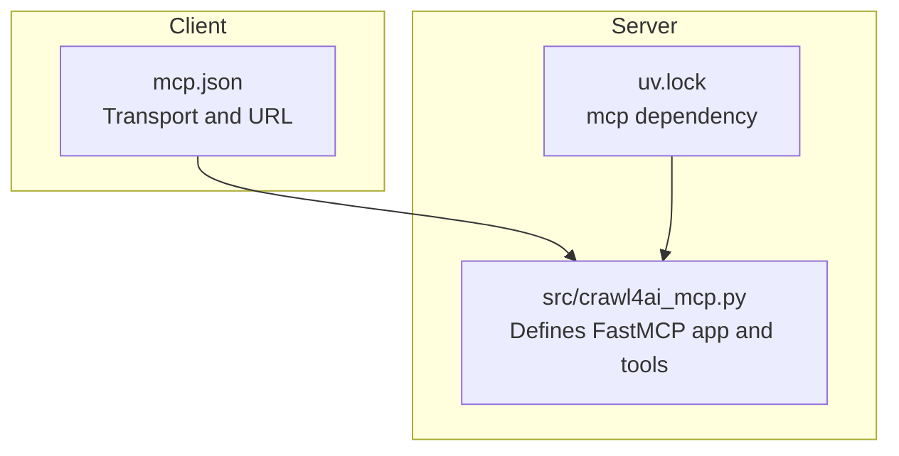
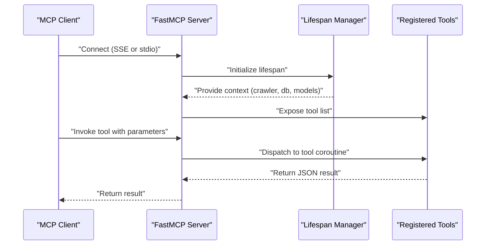
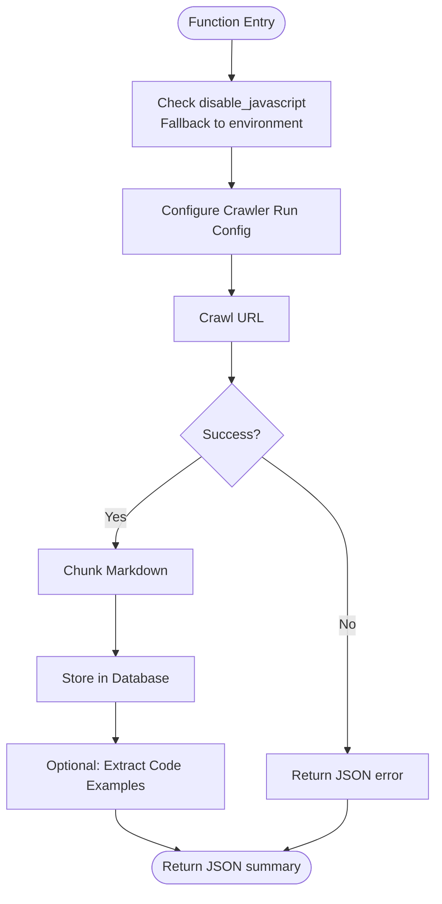
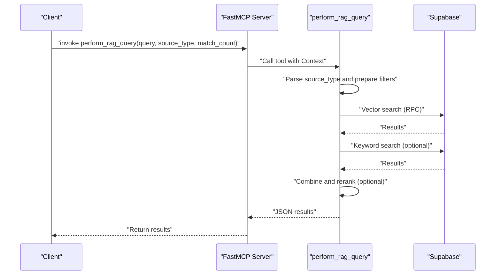
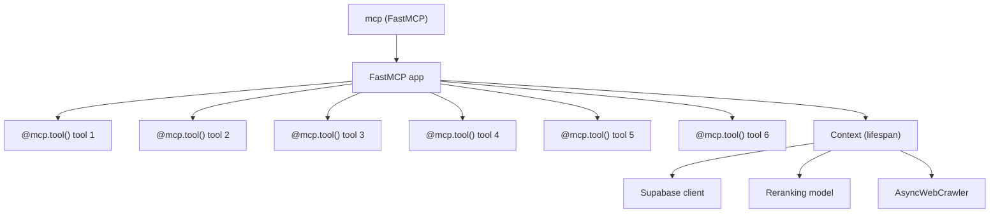

# Tool Registration

<cite>
**Referenced Files in This Document**
- [src/crawl4ai_mcp.py](file://src/crawl4ai_mcp.py)
- [mcp.json](file://mcp.json)
- [README.md](file://README.md)
- [uv.lock](file://uv.lock)
</cite>

## Table of Contents
1. [Introduction](#introduction)
2. [Project Structure](#project-structure)
3. [Core Components](#core-components)
4. [Architecture Overview](#architecture-overview)
5. [Detailed Component Analysis](#detailed-component-analysis)
6. [Dependency Analysis](#dependency-analysis)
7. [Performance Considerations](#performance-considerations)
8. [Troubleshooting Guide](#troubleshooting-guide)
9. [Conclusion](#conclusion)

## Introduction
This document explains how to register tools in the MCP server implemented in this repository. It focuses on the @mcp.tool() decorator pattern, how to define parameters with type hints and descriptions, how tools are added to the FastMCP server instance, and how the server exposes tool specifications in the MCP protocol format. It also covers examples from the codebase, including crawl_single_page and perform_rag_query, and addresses common issues around parameter validation, required vs optional parameters, and documentation string formatting.

## Project Structure
The MCP server is implemented as a FastMCP application with a primary module that defines tools and a server entrypoint. The mcp.json file configures the client-side transport and URL for connecting to the server.

**Diagram sources**
- [src/crawl4ai_mcp.py](file://src/crawl4ai_mcp.py#L295-L300)
- [mcp.json](file://mcp.json#L1-L9)
- [uv.lock](file://uv.lock#L923-L946)

**Section sources**
- [src/crawl4ai_mcp.py](file://src/crawl4ai_mcp.py#L295-L300)
- [mcp.json](file://mcp.json#L1-L9)
- [uv.lock](file://uv.lock#L923-L946)

## Core Components
- FastMCP application: Created with FastMCP(...) and configured with lifespan and host/port.
- Tool decorators: @mcp.tool() marks coroutines as MCP tools.
- Tool functions: Defined with typed parameters and return values; they receive a Context parameter and may use environment variables for defaults.
- Server runtime: The main() function selects SSE or stdio transport based on environment.

Key references:
- FastMCP creation and lifespan: [src/crawl4ai_mcp.py](file://src/crawl4ai_mcp.py#L295-L300)
- Tool registration with @mcp.tool(): [src/crawl4ai_mcp.py](file://src/crawl4ai_mcp.py#L1037-L1038), [src/crawl4ai_mcp.py](file://src/crawl4ai_mcp.py#L1088-L1089), [src/crawl4ai_mcp.py](file://src/crawl4ai_mcp.py#L1349-L1350), [src/crawl4ai_mcp.py](file://src/crawl4ai_mcp.py#L1505-L1506), [src/crawl4ai_mcp.py](file://src/crawl4ai_mcp.py#L1601-L1602), [src/crawl4ai_mcp.py](file://src/crawl4ai_mcp.py#L2056-L2057)
- Tool signatures and return types: [src/crawl4ai_mcp.py](file://src/crawl4ai_mcp.py#L1088-L1161), [src/crawl4ai_mcp.py](file://src/crawl4ai_mcp.py#L1349-L1499), [src/crawl4ai_mcp.py](file://src/crawl4ai_mcp.py#L1505-L1599), [src/crawl4ai_mcp.py](file://src/crawl4ai_mcp.py#L1601-L1752), [src/crawl4ai_mcp.py](file://src/crawl4ai_mcp.py#L2056-L2184)
- Transport selection: [src/crawl4ai_mcp.py](file://src/crawl4ai_mcp.py#L2279-L2289)

**Section sources**
- [src/crawl4ai_mcp.py](file://src/crawl4ai_mcp.py#L295-L300)
- [src/crawl4ai_mcp.py](file://src/crawl4ai_mcp.py#L1037-L1038)
- [src/crawl4ai_mcp.py](file://src/crawl4ai_mcp.py#L1088-L1161)
- [src/crawl4ai_mcp.py](file://src/crawl4ai_mcp.py#L1349-L1499)
- [src/crawl4ai_mcp.py](file://src/crawl4ai_mcp.py#L1505-L1599)
- [src/crawl4ai_mcp.py](file://src/crawl4ai_mcp.py#L1601-L1752)
- [src/crawl4ai_mcp.py](file://src/crawl4ai_mcp.py#L2056-L2184)
- [src/crawl4ai_mcp.py](file://src/crawl4ai_mcp.py#L2279-L2289)

## Architecture Overview
The MCP server initializes a FastMCP instance with a lifespan manager that sets up the crawler, database clients, and optional knowledge graph components. Tools are decorated with @mcp.tool(), which registers them with the server. The server exposes these tools to clients via the MCP protocol. The client configuration (mcp.json) defines transport and URL.

**Diagram sources**
- [src/crawl4ai_mcp.py](file://src/crawl4ai_mcp.py#L295-L300)
- [src/crawl4ai_mcp.py](file://src/crawl4ai_mcp.py#L1037-L1038)
- [src/crawl4ai_mcp.py](file://src/crawl4ai_mcp.py#L1088-L1161)
- [mcp.json](file://mcp.json#L1-L9)

**Section sources**
- [src/crawl4ai_mcp.py](file://src/crawl4ai_mcp.py#L295-L300)
- [src/crawl4ai_mcp.py](file://src/crawl4ai_mcp.py#L1037-L1038)
- [src/crawl4ai_mcp.py](file://src/crawl4ai_mcp.py#L1088-L1161)
- [mcp.json](file://mcp.json#L1-L9)

## Detailed Component Analysis

### Tool Registration Pattern with @mcp.tool()
- Decorator placement: Tools are declared with @mcp.tool() immediately before the async function signature.
- Parameter typing: Functions use type hints for parameters and return values. The return type annotation is typically str for JSON-formatted results.
- Context injection: Each tool receives a Context parameter that provides access to the server’s lifespan context (crawler, database client, models).
- Environment integration: Tools commonly read environment variables to configure behavior (e.g., feature flags, model choices).

References:
- Decorator usage: [src/crawl4ai_mcp.py](file://src/crawl4ai_mcp.py#L1037-L1038), [src/crawl4ai_mcp.py](file://src/crawl4ai_mcp.py#L1088-L1089), [src/crawl4ai_mcp.py](file://src/crawl4ai_mcp.py#L1349-L1350), [src/crawl4ai_mcp.py](file://src/crawl4ai_mcp.py#L1505-L1506), [src/crawl4ai_mcp.py](file://src/crawl4ai_mcp.py#L1601-L1602), [src/crawl4ai_mcp.py](file://src/crawl4ai_mcp.py#L2056-L2057)
- Context parameter: [src/crawl4ai_mcp.py](file://src/crawl4ai_mcp.py#L1088-L1161), [src/crawl4ai_mcp.py](file://src/crawl4ai_mcp.py#L1349-L1499), [src/crawl4ai_mcp.py](file://src/crawl4ai_mcp.py#L1505-L1599), [src/crawl4ai_mcp.py](file://src/crawl4ai_mcp.py#L1601-L1752), [src/crawl4ai_mcp.py](file://src/crawl4ai_mcp.py#L2056-L2184)
- Return type annotations: [src/crawl4ai_mcp.py](file://src/crawl4ai_mcp.py#L1088-L1161), [src/crawl4ai_mcp.py](file://src/crawl4ai_mcp.py#L1349-L1499), [src/crawl4ai_mcp.py](file://src/crawl4ai_mcp.py#L1505-L1599), [src/crawl4ai_mcp.py](file://src/crawl4ai_mcp.py#L1601-L1752), [src/crawl4ai_mcp.py](file://src/crawl4ai_mcp.py#L2056-L2184)

**Section sources**
- [src/crawl4ai_mcp.py](file://src/crawl4ai_mcp.py#L1037-L1038)
- [src/crawl4ai_mcp.py](file://src/crawl4ai_mcp.py#L1088-L1161)
- [src/crawl4ai_mcp.py](file://src/crawl4ai_mcp.py#L1349-L1499)
- [src/crawl4ai_mcp.py](file://src/crawl4ai_mcp.py#L1505-L1599)
- [src/crawl4ai_mcp.py](file://src/crawl4ai_mcp.py#L1601-L1752)
- [src/crawl4ai_mcp.py](file://src/crawl4ai_mcp.py#L2056-L2184)

### Example: crawl_single_page
- Purpose: Crawl a single URL and store content in the vector database.
- Parameters:
  - ctx: Context (injected by the server)
  - url: str (required)
  - disable_javascript: bool | None (optional; falls back to environment)
  - chunk_size: int (optional)
- Return type: str (JSON string)
- Behavior highlights:
  - Uses environment variable to decide static vs dynamic crawling.
  - Splits content into chunks and stores metadata.
  - Optionally extracts code examples when enabled.

References:
- Definition and docstring: [src/crawl4ai_mcp.py](file://src/crawl4ai_mcp.py#L662-L831)
- Decorator: [src/crawl4ai_mcp.py](file://src/crawl4ai_mcp.py#L662-L662)

**Diagram sources**
- [src/crawl4ai_mcp.py](file://src/crawl4ai_mcp.py#L662-L831)

**Section sources**
- [src/crawl4ai_mcp.py](file://src/crawl4ai_mcp.py#L662-L831)

### Example: perform_rag_query
- Purpose: Perform a RAG query against stored content with optional source filtering and reranking.
- Parameters:
  - ctx: Context (injected by the server)
  - query: str (required)
  - source_type: str (optional; default "all")
  - match_count: int (optional)
- Return type: str (JSON string)
- Behavior highlights:
  - Supports hybrid search and reranking based on environment flags.
  - Filters by source type (all, docs, dml, python, source).
  - Combines vector and keyword search results when enabled.

References:
- Definition and docstring: [src/crawl4ai_mcp.py](file://src/crawl4ai_mcp.py#L1088-L1161)
- Implementation: [src/crawl4ai_mcp.py](file://src/crawl4ai_mcp.py#L1162-L1341)
- Decorator: [src/crawl4ai_mcp.py](file://src/crawl4ai_mcp.py#L1088-L1089)

**Diagram sources**
- [src/crawl4ai_mcp.py](file://src/crawl4ai_mcp.py#L1088-L1161)
- [src/crawl4ai_mcp.py](file://src/crawl4ai_mcp.py#L1162-L1341)

**Section sources**
- [src/crawl4ai_mcp.py](file://src/crawl4ai_mcp.py#L1088-L1161)
- [src/crawl4ai_mcp.py](file://src/crawl4ai_mcp.py#L1162-L1341)

### How Tools Are Added to the FastMCP Server Instance
- The FastMCP instance is created with a lifespan and host/port configuration.
- Tools are registered implicitly by applying the @mcp.tool() decorator to async functions.
- The server exposes tool specifications automatically based on the function signatures and docstrings.

References:
- FastMCP creation: [src/crawl4ai_mcp.py](file://src/crawl4ai_mcp.py#L295-L300)
- Tool decorators: [src/crawl4ai_mcp.py](file://src/crawl4ai_mcp.py#L1037-L1038), [src/crawl4ai_mcp.py](file://src/crawl4ai_mcp.py#L1088-L1089), [src/crawl4ai_mcp.py](file://src/crawl4ai_mcp.py#L1349-L1350), [src/crawl4ai_mcp.py](file://src/crawl4ai_mcp.py#L1505-L1506), [src/crawl4ai_mcp.py](file://src/crawl4ai_mcp.py#L1601-L1602), [src/crawl4ai_mcp.py](file://src/crawl4ai_mcp.py#L2056-L2057)

**Section sources**
- [src/crawl4ai_mcp.py](file://src/crawl4ai_mcp.py#L295-L300)
- [src/crawl4ai_mcp.py](file://src/crawl4ai_mcp.py#L1037-L1038)
- [src/crawl4ai_mcp.py](file://src/crawl4ai_mcp.py#L1088-L1089)
- [src/crawl4ai_mcp.py](file://src/crawl4ai_mcp.py#L1349-L1350)
- [src/crawl4ai_mcp.py](file://src/crawl4ai_mcp.py#L1505-L1506)
- [src/crawl4ai_mcp.py](file://src/crawl4ai_mcp.py#L1601-L1602)
- [src/crawl4ai_mcp.py](file://src/crawl4ai_mcp.py#L2056-L2057)

### How the Server Exposes Tool Specifications in MCP Protocol Format
- The server automatically generates tool specifications from the @mcp.tool() decorated functions and their docstrings.
- Clients discover available tools and their parameter schemas via the MCP protocol.
- The mcp.json file configures the client transport and URL to connect to the running server.

References:
- Automatic specification generation: [README.md](file://README.md#L666-L670)
- Client configuration: [mcp.json](file://mcp.json#L1-L9)

**Section sources**
- [README.md](file://README.md#L666-L670)
- [mcp.json](file://mcp.json#L1-L9)

### Parameter Validation and Documentation String Formatting
- Required vs optional parameters:
  - Optional parameters often have default values in the function signature (e.g., disable_javascript=None, chunk_size=5000).
  - Optional parameters may be resolved from environment variables inside the function body.
- Validation patterns:
  - Validate inputs early and return structured JSON error responses.
  - Guard against disabled features (e.g., knowledge graph or code example extraction) and return informative messages.
- Documentation strings:
  - Use clear docstrings with Args and Returns sections.
  - Include examples and usage notes where helpful.

References:
- Optional parameters and environment fallbacks: [src/crawl4ai_mcp.py](file://src/crawl4ai_mcp.py#L662-L831), [src/crawl4ai_mcp.py](file://src/crawl4ai_mcp.py#L1088-L1161)
- Validation and guards: [src/crawl4ai_mcp.py](file://src/crawl4ai_mcp.py#L1505-L1599), [src/crawl4ai_mcp.py](file://src/crawl4ai_mcp.py#L1601-L1752), [src/crawl4ai_mcp.py](file://src/crawl4ai_mcp.py#L2056-L2184)
- Docstring structure: [src/crawl4ai_mcp.py](file://src/crawl4ai_mcp.py#L1088-L1161), [src/crawl4ai_mcp.py](file://src/crawl4ai_mcp.py#L1349-L1499), [src/crawl4ai_mcp.py](file://src/crawl4ai_mcp.py#L1505-L1599), [src/crawl4ai_mcp.py](file://src/crawl4ai_mcp.py#L1601-L1752), [src/crawl4ai_mcp.py](file://src/crawl4ai_mcp.py#L2056-L2184)

**Section sources**
- [src/crawl4ai_mcp.py](file://src/crawl4ai_mcp.py#L662-L831)
- [src/crawl4ai_mcp.py](file://src/crawl4ai_mcp.py#L1088-L1161)
- [src/crawl4ai_mcp.py](file://src/crawl4ai_mcp.py#L1349-L1499)
- [src/crawl4ai_mcp.py](file://src/crawl4ai_mcp.py#L1505-L1599)
- [src/crawl4ai_mcp.py](file://src/crawl4ai_mcp.py#L1601-L1752)
- [src/crawl4ai_mcp.py](file://src/crawl4ai_mcp.py#L2056-L2184)

## Dependency Analysis
- The server depends on the mcp package for FastMCP functionality.
- Tools depend on the lifespan context for database clients, models, and crawler instances.
- Environment variables control feature toggles and model choices.

**Diagram sources**
- [src/crawl4ai_mcp.py](file://src/crawl4ai_mcp.py#L295-L300)
- [src/crawl4ai_mcp.py](file://src/crawl4ai_mcp.py#L1037-L1038)
- [src/crawl4ai_mcp.py](file://src/crawl4ai_mcp.py#L1088-L1089)
- [src/crawl4ai_mcp.py](file://src/crawl4ai_mcp.py#L1349-L1350)
- [src/crawl4ai_mcp.py](file://src/crawl4ai_mcp.py#L1505-L1506)
- [src/crawl4ai_mcp.py](file://src/crawl4ai_mcp.py#L1601-L1602)
- [src/crawl4ai_mcp.py](file://src/crawl4ai_mcp.py#L2056-L2057)
- [uv.lock](file://uv.lock#L923-L946)

**Section sources**
- [src/crawl4ai_mcp.py](file://src/crawl4ai_mcp.py#L295-L300)
- [src/crawl4ai_mcp.py](file://src/crawl4ai_mcp.py#L1037-L1038)
- [src/crawl4ai_mcp.py](file://src/crawl4ai_mcp.py#L1088-L1089)
- [src/crawl4ai_mcp.py](file://src/crawl4ai_mcp.py#L1349-L1350)
- [src/crawl4ai_mcp.py](file://src/crawl4ai_mcp.py#L1505-L1506)
- [src/crawl4ai_mcp.py](file://src/crawl4ai_mcp.py#L1601-L1602)
- [src/crawl4ai_mcp.py](file://src/crawl4ai_mcp.py#L2056-L2057)
- [uv.lock](file://uv.lock#L923-L946)

## Performance Considerations
- Parallel crawling and batching: Tools use concurrency and batched operations to manage throughput and memory usage.
- Optional features: Feature flags (e.g., USE_RERANKING, USE_HYBRID_SEARCH, USE_AGENTIC_RAG) allow tuning performance and accuracy trade-offs.
- Transport selection: SSE vs stdio can impact latency and stability depending on client environments.

[No sources needed since this section provides general guidance]

## Troubleshooting Guide
Common issues and resolutions:
- Missing environment variables: Ensure required variables (e.g., SUPABASE_URL, SUPABASE_SERVICE_KEY, NEO4J_URI, NEO4J_USER, NEO4J_PASSWORD) are set before starting the server.
- Knowledge graph disabled: Some tools require USE_KNOWLEDGE_GRAPH=true; otherwise they return informative errors.
- Rate limiting: Adjust COPILOT_REQUESTS_PER_MINUTE to avoid throttling when using Copilot.
- Startup readiness: Wait for the “Server is ready to accept connections!” message before connecting clients.

**Section sources**
- [src/crawl4ai_mcp.py](file://src/crawl4ai_mcp.py#L1505-L1599)
- [src/crawl4ai_mcp.py](file://src/crawl4ai_mcp.py#L1601-L1752)
- [README.md](file://README.md#L425-L449)
- [README.md](file://README.md#L706-L733)

## Conclusion
The MCP server in this repository registers tools using the @mcp.tool() decorator and exposes them automatically via the MCP protocol. Tools are defined with typed parameters and return values, receive a Context parameter for accessing server resources, and leverage environment variables for configuration. The examples crawl_single_page and perform_rag_query illustrate parameter handling, validation, and structured JSON responses. The mcp.json file configures client transport and URL, while the server runtime selects SSE or stdio transport based on environment.