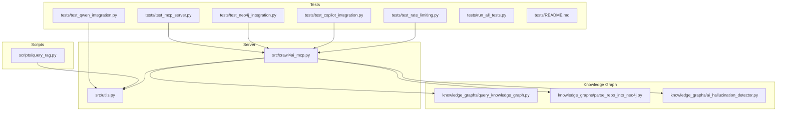
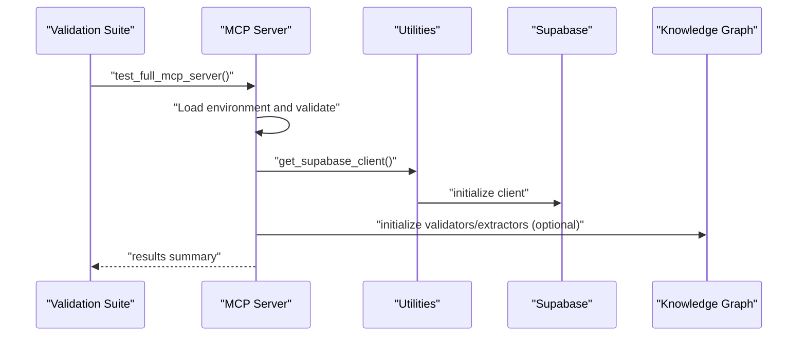
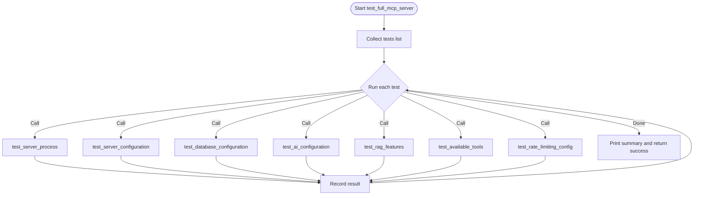
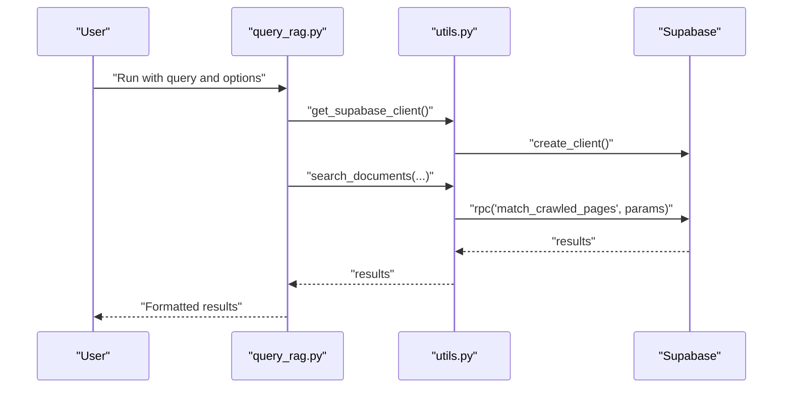
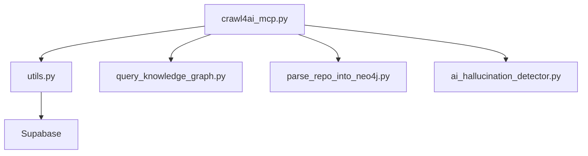

# Tool Testing

<cite>
**Referenced Files in This Document**
- [tests/test_mcp_server.py](file://tests/test_mcp_server.py)
- [scripts/query_rag.py](file://scripts/query_rag.py)
- [tests/run_all_tests.py](file://tests/run_all_tests.py)
- [tests/README.md](file://tests/README.md)
- [tests/test_neo4j_integration.py](file://tests/test_neo4j_integration.py)
- [tests/test_copilot_integration.py](file://tests/test_copilot_integration.py)
- [tests/test_qwen_integration.py](file://tests/test_qwen_integration.py)
- [tests/test_rate_limiting.py](file://tests/test_rate_limiting.py)
- [src/utils.py](file://src/utils.py)
- [src/crawl4ai_mcp.py](file://src/crawl4ai_mcp.py)
- [knowledge_graphs/query_knowledge_graph.py](file://knowledge_graphs/query_knowledge_graph.py)
- [knowledge_graphs/parse_repo_into_neo4j.py](file://knowledge_graphs/parse_repo_into_neo4j.py)
- [knowledge_graphs/ai_hallucination_detector.py](file://knowledge_graphs/ai_hallucination_detector.py)
</cite>

## Table of Contents
1. [Introduction](#introduction)
2. [Project Structure](#project-structure)
3. [Core Components](#core-components)
4. [Architecture Overview](#architecture-overview)
5. [Detailed Component Analysis](#detailed-component-analysis)
6. [Dependency Analysis](#dependency-analysis)
7. [Performance Considerations](#performance-considerations)
8. [Troubleshooting Guide](#troubleshooting-guide)
9. [Conclusion](#conclusion)
10. [Appendices](#appendices)

## Introduction
This document explains how to test custom tools in the MCP server. It covers:
- Creating unit tests for new tools using the pytest framework, including fixtures and mocking.
- Using the test_full_mcp_server function as a validation suite for tool availability and server configuration.
- Manually validating tool functionality with query_rag.py by sending requests to the server and verifying responses.
- Validating tool parameters, return values, and external service interactions (Supabase and Neo4j).
- Handling test environment setup, asynchronous tests, and debugging failed tool invocations.

## Project Structure
The repository organizes tests under the tests/ directory and provides a dedicated script for manual validation. The MCP server implementation lives under src/, and knowledge graph tools live under knowledge_graphs/.

**Diagram sources**
- [tests/test_mcp_server.py](file://tests/test_mcp_server.py#L1-L273)
- [scripts/query_rag.py](file://scripts/query_rag.py#L1-L348)
- [tests/run_all_tests.py](file://tests/run_all_tests.py#L1-L233)
- [src/crawl4ai_mcp.py](file://src/crawl4ai_mcp.py#L1-L300)
- [src/utils.py](file://src/utils.py#L1-L200)
- [knowledge_graphs/query_knowledge_graph.py](file://knowledge_graphs/query_knowledge_graph.py#L1-L200)
- [knowledge_graphs/parse_repo_into_neo4j.py](file://knowledge_graphs/parse_repo_into_neo4j.py#L1-L200)
- [knowledge_graphs/ai_hallucination_detector.py](file://knowledge_graphs/ai_hallucination_detector.py#L1-L200)

**Section sources**
- [tests/README.md](file://tests/README.md#L1-L120)
- [tests/test_mcp_server.py](file://tests/test_mcp_server.py#L1-L120)
- [scripts/query_rag.py](file://scripts/query_rag.py#L1-L120)

## Core Components
- MCP server validation suite: Validates server process, configuration, database, AI providers, RAG features, tool availability, and rate limiting.
- Manual query tool: Provides a CLI to query the RAG system against Supabase-backed data and display results.
- Utilities: Centralized embedding, search, and database operations used by tools.
- Knowledge graph tools: Query, parse, and validate knowledge graph functionality.

Key responsibilities:
- tests/test_mcp_server.py: Orchestrates a full validation of the MCP server’s runtime and configuration.
- scripts/query_rag.py: Enables manual testing of search and retrieval capabilities.
- src/utils.py: Implements Supabase client creation, embedding generation, search, and batch operations.
- src/crawl4ai_mcp.py: Defines MCP tools and integrates utilities and knowledge graph modules.

**Section sources**
- [tests/test_mcp_server.py](file://tests/test_mcp_server.py#L1-L273)
- [scripts/query_rag.py](file://scripts/query_rag.py#L1-L348)
- [src/utils.py](file://src/utils.py#L1-L200)
- [src/crawl4ai_mcp.py](file://src/crawl4ai_mcp.py#L1-L300)

## Architecture Overview
The MCP server exposes tools that rely on utilities for embeddings and database operations, and on knowledge graph modules for graph-related features. The validation suite checks environment configuration and expected tool availability.

**Diagram sources**
- [tests/test_mcp_server.py](file://tests/test_mcp_server.py#L215-L269)
- [src/crawl4ai_mcp.py](file://src/crawl4ai_mcp.py#L120-L293)
- [src/utils.py](file://src/utils.py#L106-L120)

## Detailed Component Analysis

### MCP Server Validation Suite
The validation suite aggregates multiple checks:
- Server process detection
- Transport/host/port configuration
- Database configuration (Supabase and Neo4j)
- AI provider configuration (GitHub Copilot/OpenAI)
- RAG feature flags
- Tool availability list
- Rate limiting configuration

It runs all checks and prints a summary, returning success only if all tests pass.

**Diagram sources**
- [tests/test_mcp_server.py](file://tests/test_mcp_server.py#L215-L269)

**Section sources**
- [tests/test_mcp_server.py](file://tests/test_mcp_server.py#L1-L273)

### Unit Testing New Tools with pytest
Recommended patterns:
- Fixtures: Use autouse fixtures to temporarily set environment variables for embedding providers and feature toggles.
- Mocking: Mock external clients (e.g., Supabase) to isolate tool logic and avoid network calls.
- Parameterization: Use parametrize to test multiple inputs and edge cases.
- Async tests: Use pytest-asyncio markers for async tool functions.
- Integration markers: Mark heavy tests with @pytest.mark.integration to separate unit vs integration runs.

Examples of patterns in the repository:
- Environment fixtures and teardown in test_qwen_integration.py.
- Async tests with @pytest.mark.asyncio in test_copilot_integration.py.
- Integration tests with @pytest.mark.integration in test_neo4j_integration.py.

Guidance:
- Create a test file named test_<tool>.py under tests/.
- Add a class Test<ToolName> to group tests.
- Use @pytest.fixture(autouse=True) to set environment variables needed by the tool.
- Mock external dependencies (Supabase, Neo4j) using unittest.mock.
- Assert on return values and side effects (e.g., RPC calls, inserts).
- For async tools, run with pytest-asyncio plugin and use asyncio.run in main if needed.

**Section sources**
- [tests/test_qwen_integration.py](file://tests/test_qwen_integration.py#L1-L249)
- [tests/test_copilot_integration.py](file://tests/test_copilot_integration.py#L1-L263)
- [tests/test_neo4j_integration.py](file://tests/test_neo4j_integration.py#L1-L269)
- [tests/README.md](file://tests/README.md#L196-L212)

### Manual Validation with query_rag.py
Use this script to send queries to the RAG system and inspect results:
- Configure environment variables for Supabase and optional hybrid search.
- Run the script with a query and filters (source type, match count, hybrid search).
- Inspect printed results and metadata.

Validation steps:
- Confirm Supabase connectivity and available sources.
- Test different source types (docs, dml, python, source, all).
- Verify that results include expected fields (URL, similarity, metadata).
- Compare counts and rerank scores when enabling reranking.

**Diagram sources**
- [scripts/query_rag.py](file://scripts/query_rag.py#L1-L200)
- [src/utils.py](file://src/utils.py#L548-L587)

**Section sources**
- [scripts/query_rag.py](file://scripts/query_rag.py#L1-L348)
- [src/utils.py](file://src/utils.py#L106-L120)
- [src/utils.py](file://src/utils.py#L548-L587)

### Validating Tool Parameters and Return Values
- Tool parameters: Ensure inputs are validated (e.g., URLs, source filters, match counts).
- Return values: Verify presence of required fields (e.g., URL, similarity, metadata).
- External service interactions:
  - Supabase: Confirm RPC calls and table operations are invoked with expected parameters.
  - Neo4j: Validate that knowledge graph tools are initialized only when enabled and credentials are present.

**Section sources**
- [src/crawl4ai_mcp.py](file://src/crawl4ai_mcp.py#L120-L293)
- [src/utils.py](file://src/utils.py#L548-L587)
- [tests/test_mcp_server.py](file://tests/test_mcp_server.py#L80-L112)

### Asynchronous Tests and Rate Limiting
- Asynchronous tests: Use pytest-asyncio to run async tool tests. See test_copilot_integration.py for examples.
- Rate limiting: The rate limiting tests demonstrate backoff and burst protection. Configure COPILOT_REQUESTS_PER_MINUTE and observe behavior.

**Section sources**
- [tests/test_copilot_integration.py](file://tests/test_copilot_integration.py#L1-L263)
- [tests/test_rate_limiting.py](file://tests/test_rate_limiting.py#L1-L172)

### Knowledge Graph Tool Validation
- Query operations: Validate that queries return results and that write/delete operations work.
- Repository parsing: Ensure the extractor can be instantiated and used with a known repository.
- Hallucination detection: Use the analyzer and reporter to validate script analysis.

**Section sources**
- [tests/test_neo4j_integration.py](file://tests/test_neo4j_integration.py#L1-L269)
- [knowledge_graphs/query_knowledge_graph.py](file://knowledge_graphs/query_knowledge_graph.py#L1-L200)
- [knowledge_graphs/parse_repo_into_neo4j.py](file://knowledge_graphs/parse_repo_into_neo4j.py#L1-L200)
- [knowledge_graphs/ai_hallucination_detector.py](file://knowledge_graphs/ai_hallucination_detector.py#L1-L200)

## Dependency Analysis
The MCP server depends on utilities for embeddings and database operations, and on knowledge graph modules when enabled. The validation suite orchestrates checks across these dependencies.

**Diagram sources**
- [src/crawl4ai_mcp.py](file://src/crawl4ai_mcp.py#L1-L300)
- [src/utils.py](file://src/utils.py#L1-L200)
- [knowledge_graphs/query_knowledge_graph.py](file://knowledge_graphs/query_knowledge_graph.py#L1-L200)
- [knowledge_graphs/parse_repo_into_neo4j.py](file://knowledge_graphs/parse_repo_into_neo4j.py#L1-L200)
- [knowledge_graphs/ai_hallucination_detector.py](file://knowledge_graphs/ai_hallucination_detector.py#L1-L200)

**Section sources**
- [src/crawl4ai_mcp.py](file://src/crawl4ai_mcp.py#L1-L300)
- [src/utils.py](file://src/utils.py#L1-L200)

## Performance Considerations
- Batch embeddings: Prefer batch operations for efficiency when testing embedding-heavy tools.
- Concurrency: Use thread pools or async concurrency judiciously to avoid overwhelming external services.
- Retries and backoff: Implement exponential backoff for transient failures (as shown in rate limiting tests).
- Reranking: Enable reranking selectively to balance quality and latency.

[No sources needed since this section provides general guidance]

## Troubleshooting Guide
Common issues and resolutions:
- Environment variables missing: Ensure .env is loaded and required variables are set (Supabase, Neo4j, AI providers).
- Server not running: The validation suite checks for the MCP server process; start the server before running tests.
- Supabase connectivity: Verify URL and service key; confirm RPC functions exist.
- Neo4j connectivity: Confirm URI, user, and password; enable USE_KNOWLEDGE_GRAPH appropriately.
- AI provider configuration: Set GITHUB_TOKEN or OPENAI_API_KEY depending on desired provider.
- Asynchronous tests: Install pytest-asyncio and run with appropriate markers.
- Rate limiting: Adjust COPILOT_REQUESTS_PER_MINUTE and monitor backoff behavior.

**Section sources**
- [tests/README.md](file://tests/README.md#L1-L120)
- [tests/test_mcp_server.py](file://tests/test_mcp_server.py#L1-L120)
- [tests/test_rate_limiting.py](file://tests/test_rate_limiting.py#L1-L172)

## Conclusion
By combining the MCP server validation suite, manual query scripts, and targeted unit/integration tests, you can comprehensively validate custom tools. Use fixtures and mocks to isolate dependencies, verify parameters and return values, and ensure robust interactions with external services like Supabase and Neo4j.

[No sources needed since this section summarizes without analyzing specific files]

## Appendices

### Appendix A: Running the Validation Suite
- Run the MCP server validation suite via the test runner, which loads environment variables and executes all suites in order.

**Section sources**
- [tests/run_all_tests.py](file://tests/run_all_tests.py#L1-L233)
- [tests/test_mcp_server.py](file://tests/test_mcp_server.py#L215-L269)

### Appendix B: Adding a New Tool Test
- Create a new test file under tests/ with a descriptive name.
- Use fixtures to set environment variables and mock external dependencies.
- Assert on return values and side effects.
- Mark integration tests with @pytest.mark.integration.
- Update tests/README.md with descriptions of new tests.

**Section sources**
- [tests/README.md](file://tests/README.md#L196-L212)
- [tests/test_qwen_integration.py](file://tests/test_qwen_integration.py#L1-L249)