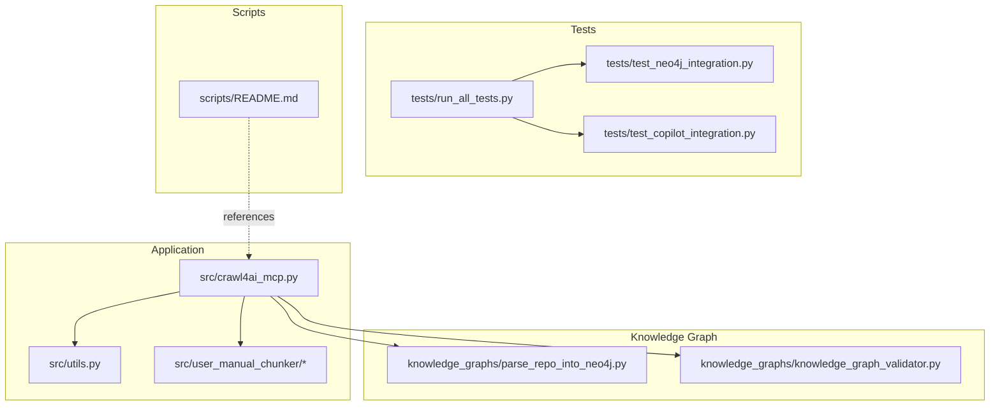
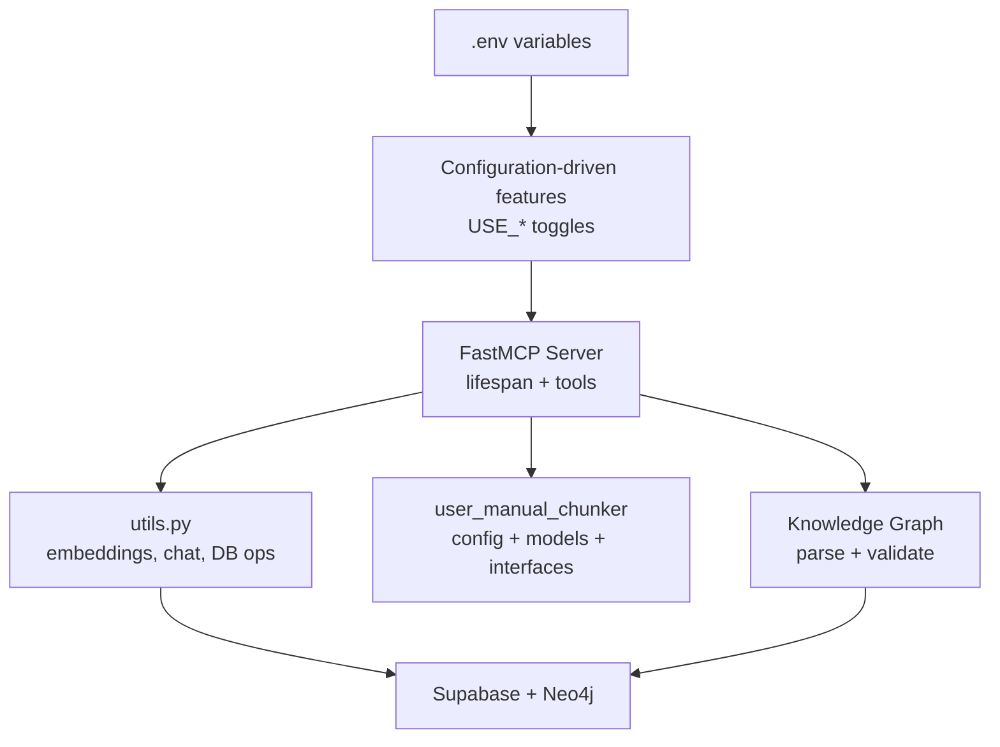
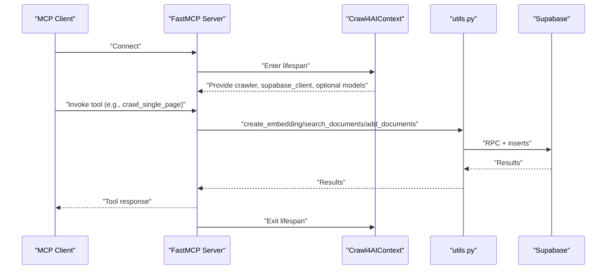
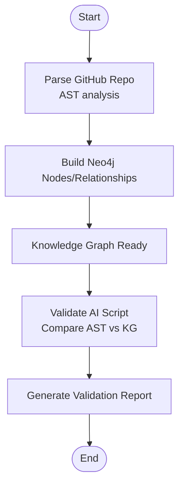
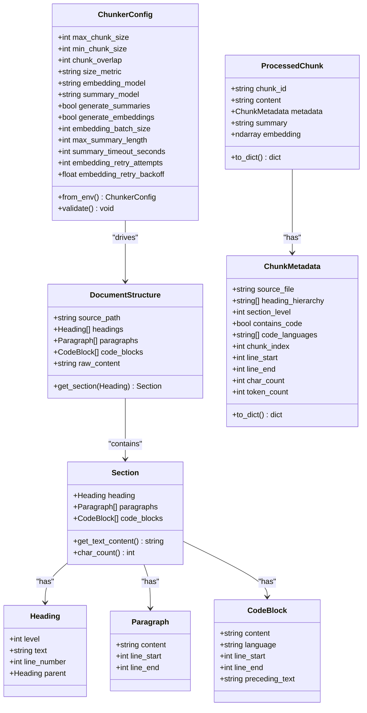
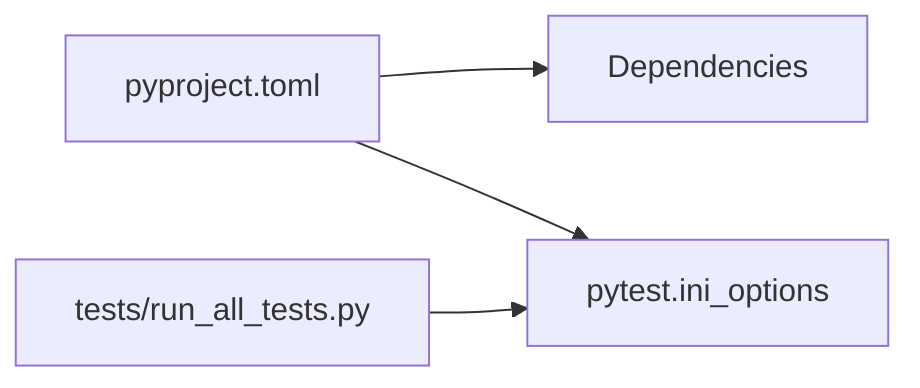
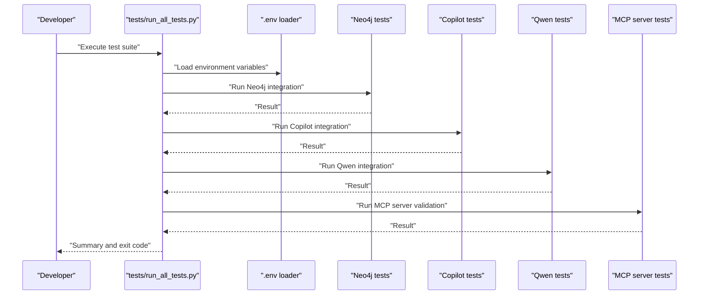

# Contributing to the Project

<cite>
**Referenced Files in This Document**
- [README.md](file://README.md)
- [pyproject.toml](file://pyproject.toml)
- [tests/README.md](file://tests/README.md)
- [tests/run_all_tests.py](file://tests/run_all_tests.py)
- [tests/test_neo4j_integration.py](file://tests/test_neo4j_integration.py)
- [tests/test_copilot_integration.py](file://tests/test_copilot_integration.py)
- [src/crawl4ai_mcp.py](file://src/crawl4ai_mcp.py)
- [src/utils.py](file://src/utils.py)
- [src/user_manual_chunker/__init__.py](file://src/user_manual_chunker/__init__.py)
- [src/user_manual_chunker/config.py](file://src/user_manual_chunker/config.py)
- [src/user_manual_chunker/data_models.py](file://src/user_manual_chunker/data_models.py)
- [src/user_manual_chunker/interfaces.py](file://src/user_manual_chunker/interfaces.py)
- [knowledge_graphs/parse_repo_into_neo4j.py](file://knowledge_graphs/parse_repo_into_neo4j.py)
- [knowledge_graphs/knowledge_graph_validator.py](file://knowledge_graphs/knowledge_graph_validator.py)
- [scripts/README.md](file://scripts/README.md)
</cite>

## Table of Contents
1. [Introduction](#introduction)
2. [Project Structure](#project-structure)
3. [Core Components](#core-components)
4. [Architecture Overview](#architecture-overview)
5. [Detailed Component Analysis](#detailed-component-analysis)
6. [Dependency Analysis](#dependency-analysis)
7. [Performance Considerations](#performance-considerations)
8. [Troubleshooting Guide](#troubleshooting-guide)
9. [Contribution Guidelines](#contribution-guidelines)
10. [Pull Request Workflow](#pull-request-workflow)
11. [Testing Requirements](#testing-requirements)
12. [Code Style and Documentation Standards](#code-style-and-documentation-standards)
13. [Dependency Management](#dependency-management)
14. [Conclusion](#conclusion)

## Introduction
This document provides a comprehensive guide for contributing to the project. It covers code style expectations, testing requirements, the pull request workflow, architectural principles to maintain, and guidance for updating dependencies while preserving backward compatibility for public interfaces.

## Project Structure
The repository is organized around a modular Python package with clear separation of concerns:
- src/: Main application code, including the MCP server entry point and utility modules
- tests/: Integration tests and a test runner
- scripts/: Utility scripts for model downloads and RAG testing
- knowledge_graphs/: Knowledge graph tools for repository parsing and hallucination detection
- src/user_manual_chunker/: Modular chunking pipeline with configuration and data models
- Root configuration: pyproject.toml defines project metadata and test configuration

**Diagram sources**
- [src/crawl4ai_mcp.py](file://src/crawl4ai_mcp.py#L1-L120)
- [src/utils.py](file://src/utils.py#L1-L120)
- [src/user_manual_chunker/__init__.py](file://src/user_manual_chunker/__init__.py#L1-L67)
- [tests/run_all_tests.py](file://tests/run_all_tests.py#L1-L120)
- [tests/test_neo4j_integration.py](file://tests/test_neo4j_integration.py#L1-L120)
- [tests/test_copilot_integration.py](file://tests/test_copilot_integration.py#L1-L120)
- [knowledge_graphs/parse_repo_into_neo4j.py](file://knowledge_graphs/parse_repo_into_neo4j.py#L1-L120)
- [knowledge_graphs/knowledge_graph_validator.py](file://knowledge_graphs/knowledge_graph_validator.py#L1-L120)
- [scripts/README.md](file://scripts/README.md#L1-L80)

**Section sources**
- [README.md](file://README.md#L1-L120)
- [pyproject.toml](file://pyproject.toml#L1-L40)

## Core Components
- MCP Server entry point: Defines the FastMCP server, tool registration, and lifecycle management. See [src/crawl4ai_mcp.py](file://src/crawl4ai_mcp.py#L295-L301).
- Utilities: Centralized embedding generation, chat completion, Supabase operations, and RAG helpers. See [src/utils.py](file://src/utils.py#L121-L200).
- User Manual Chunker: A modular chunking pipeline with configuration, data models, and interfaces. See [src/user_manual_chunker/config.py](file://src/user_manual_chunker/config.py#L1-L116), [src/user_manual_chunker/data_models.py](file://src/user_manual_chunker/data_models.py#L1-L155), [src/user_manual_chunker/interfaces.py](file://src/user_manual_chunker/interfaces.py#L1-L162).
- Knowledge Graph Tools: Repository parsing and validation for hallucination detection. See [knowledge_graphs/parse_repo_into_neo4j.py](file://knowledge_graphs/parse_repo_into_neo4j.py#L1-L120), [knowledge_graphs/knowledge_graph_validator.py](file://knowledge_graphs/knowledge_graph_validator.py#L100-L200).
- Test Runner: Orchestrates environment loading, test execution, and summary reporting. See [tests/run_all_tests.py](file://tests/run_all_tests.py#L1-L120).

**Section sources**
- [src/crawl4ai_mcp.py](file://src/crawl4ai_mcp.py#L295-L301)
- [src/utils.py](file://src/utils.py#L121-L200)
- [src/user_manual_chunker/config.py](file://src/user_manual_chunker/config.py#L1-L116)
- [src/user_manual_chunker/data_models.py](file://src/user_manual_chunker/data_models.py#L1-L155)
- [src/user_manual_chunker/interfaces.py](file://src/user_manual_chunker/interfaces.py#L1-L162)
- [knowledge_graphs/parse_repo_into_neo4j.py](file://knowledge_graphs/parse_repo_into_neo4j.py#L1-L120)
- [knowledge_graphs/knowledge_graph_validator.py](file://knowledge_graphs/knowledge_graph_validator.py#L100-L200)
- [tests/run_all_tests.py](file://tests/run_all_tests.py#L1-L120)

## Architecture Overview
The system follows a configuration-driven, modular architecture:
- Configuration via environment variables controls provider selection (OpenAI, GitHub Copilot, local Qwen), RAG strategies, and feature toggles.
- Lifecycle management centralizes resource initialization and teardown.
- Feature modules (RAG, Knowledge Graph, chunking) are integrated through explicit imports and tool registration.

**Diagram sources**
- [src/crawl4ai_mcp.py](file://src/crawl4ai_mcp.py#L130-L220)
- [src/utils.py](file://src/utils.py#L121-L200)
- [src/user_manual_chunker/config.py](file://src/user_manual_chunker/config.py#L42-L70)
- [knowledge_graphs/parse_repo_into_neo4j.py](file://knowledge_graphs/parse_repo_into_neo4j.py#L1-L120)
- [knowledge_graphs/knowledge_graph_validator.py](file://knowledge_graphs/knowledge_graph_validator.py#L116-L164)

## Detailed Component Analysis

### MCP Server Lifecycle and Tools
- Lifespan manages crawler, Supabase client, optional reranking model, and knowledge graph components.
- Tools are registered via decorators and leverage shared utilities for embeddings, search, and database operations.

**Diagram sources**
- [src/crawl4ai_mcp.py](file://src/crawl4ai_mcp.py#L130-L220)
- [src/utils.py](file://src/utils.py#L549-L587)

**Section sources**
- [src/crawl4ai_mcp.py](file://src/crawl4ai_mcp.py#L130-L220)
- [src/utils.py](file://src/utils.py#L549-L587)

### Knowledge Graph Pipeline
- Repository parsing uses AST to extract classes, methods, functions, and imports; writes directly to Neo4j.
- Validation compares AI-generated code against the knowledge graph to detect hallucinations.

**Diagram sources**
- [knowledge_graphs/parse_repo_into_neo4j.py](file://knowledge_graphs/parse_repo_into_neo4j.py#L1-L120)
- [knowledge_graphs/knowledge_graph_validator.py](file://knowledge_graphs/knowledge_graph_validator.py#L100-L200)

**Section sources**
- [knowledge_graphs/parse_repo_into_neo4j.py](file://knowledge_graphs/parse_repo_into_neo4j.py#L1-L120)
- [knowledge_graphs/knowledge_graph_validator.py](file://knowledge_graphs/knowledge_graph_validator.py#L100-L200)

### User Manual Chunker
- Configuration supports environment-based tuning of chunk sizes, model choices, and processing options.
- Data models define structured representations for headings, paragraphs, code blocks, and processed chunks.
- Interfaces define extensible abstractions for parsers, chunkers, and metadata extractors.

**Diagram sources**
- [src/user_manual_chunker/config.py](file://src/user_manual_chunker/config.py#L1-L116)
- [src/user_manual_chunker/data_models.py](file://src/user_manual_chunker/data_models.py#L1-L155)
- [src/user_manual_chunker/interfaces.py](file://src/user_manual_chunker/interfaces.py#L1-L162)

**Section sources**
- [src/user_manual_chunker/config.py](file://src/user_manual_chunker/config.py#L1-L116)
- [src/user_manual_chunker/data_models.py](file://src/user_manual_chunker/data_models.py#L1-L155)
- [src/user_manual_chunker/interfaces.py](file://src/user_manual_chunker/interfaces.py#L1-L162)

## Dependency Analysis
- Project dependencies are declared in [pyproject.toml](file://pyproject.toml#L1-L40), including crawl4ai, mcp, supabase, openai, sentence-transformers, neo4j, httpx, aiofiles, pytest, pytest-asyncio, protobuf, and litellm.
- Test configuration is defined under [tool.pytest.ini_options](file://pyproject.toml#L30-L40), including asyncio mode, markers, and test paths.

**Diagram sources**
- [pyproject.toml](file://pyproject.toml#L1-L40)
- [tests/run_all_tests.py](file://tests/run_all_tests.py#L1-L120)

**Section sources**
- [pyproject.toml](file://pyproject.toml#L1-L40)
- [tests/run_all_tests.py](file://tests/run_all_tests.py#L1-L120)

## Performance Considerations
- Startup latency is primarily due to model downloads and loading; subsequent runs benefit from caching.
- Use SSE transport for reliable connections during initialization.
- Disable unused features (e.g., reranking, knowledge graph) to reduce startup time.
- Prefer static content crawling when JavaScript redirects cause unexpected content expansion.

**Section sources**
- [README.md](file://README.md#L447-L482)

## Troubleshooting Guide
- Environment configuration: Ensure required variables (Neo4j, AI provider credentials) are present before running tests or the server.
- Test runner diagnostics: The runner prints environment checks and per-suite results; failures indicate missing prerequisites or misconfiguration.
- Knowledge Graph: Confirm Neo4j is reachable and credentials are correct; verify repository parsing availability and write permissions.

**Section sources**
- [tests/run_all_tests.py](file://tests/run_all_tests.py#L140-L210)
- [tests/README.md](file://tests/README.md#L1-L120)
- [tests/test_neo4j_integration.py](file://tests/test_neo4j_integration.py#L1-L120)

## Contribution Guidelines
This project emphasizes:
- Configuration-driven design: Feature toggles and environment variables control behavior.
- Modular architecture: Separate modules for chunking, knowledge graph, and utilities.
- Backward compatibility: Public interfaces should remain stable; deprecations should be documented and phased.
- Extensibility: New tools and strategies should integrate cleanly with the existing MCP server and utilities.

[No sources needed since this section provides general guidance]

## Pull Request Workflow
Branch naming and commit message standards:
- Branch naming: Use descriptive names prefixed with feature/, fix/, chore/, or refactor/ as appropriate.
- Commit messages: Follow a concise imperative style with a short subject line, optional body with rationale, and references to issues if applicable.

Review process:
- Open a pull request targeting the default branch.
- Ensure tests pass locally and in CI.
- Request reviews from maintainers; address feedback promptly.

[No sources needed since this section provides general guidance]

## Testing Requirements
Run the test suite using the provided runner:
- From the project root, run the test runner to auto-load environment variables from .env and execute all suites.
- Individual tests can be run directly or via pytest with markers for integration and asyncio.

**Diagram sources**
- [tests/run_all_tests.py](file://tests/run_all_tests.py#L1-L120)
- [tests/README.md](file://tests/README.md#L50-L120)

**Section sources**
- [tests/run_all_tests.py](file://tests/run_all_tests.py#L1-L120)
- [tests/README.md](file://tests/README.md#L50-L120)

## Code Style and Documentation Standards
- Type hints: Use type hints consistently for function signatures and return types to improve readability and maintainability.
- Docstrings: Follow a concise style that describes the purpose, parameters, and return values of functions and classes.
- Imports: Group standard library, third-party, and local imports; keep imports at the top of files.
- Naming: Use descriptive names for functions, classes, and variables; adhere to snake_case for functions and variables, PascalCase for classes.
- Error handling: Provide clear error messages and handle exceptions gracefully; avoid silent failures.
- Logging: Use structured logs for critical operations and errors; avoid excessive verbosity in normal operation.

[No sources needed since this section provides general guidance]

## Dependency Management
Updating dependencies:
- Edit pyproject.toml to modify dependencies or versions.
- Reinstall dependencies using the project’s development workflow.
- Validate that tests still pass after updates.

Backward compatibility:
- Maintain stable public APIs; avoid breaking changes to tool signatures and configuration keys.
- Provide migration notes for significant changes and deprecations.

[No sources needed since this section provides general guidance]

## Conclusion
By following the contribution guidelines, adhering to the architectural principles, and maintaining rigorous testing and documentation standards, contributors can help evolve the project safely and effectively. Use the provided tools and scripts to streamline development, testing, and deployment.

[No sources needed since this section summarizes without analyzing specific files]