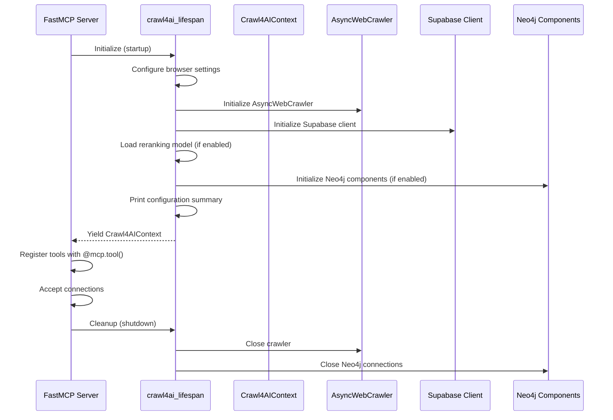
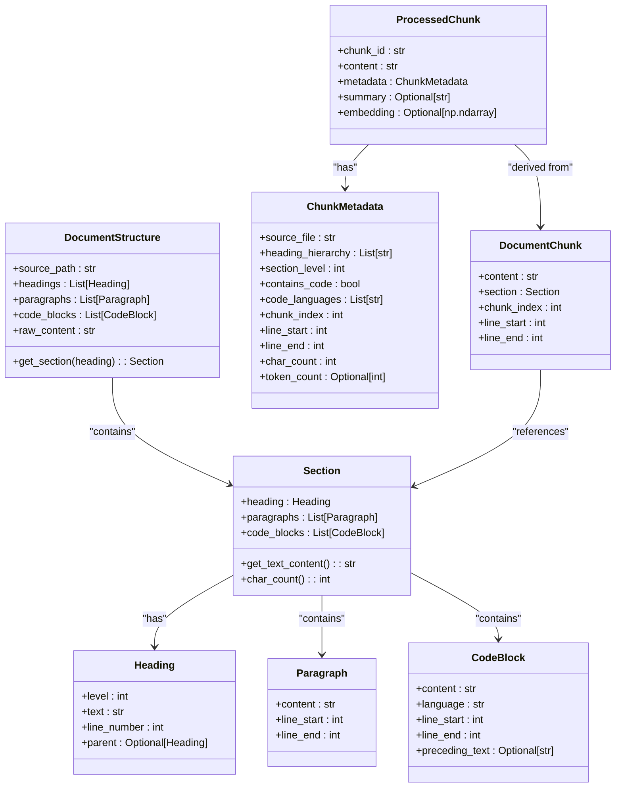
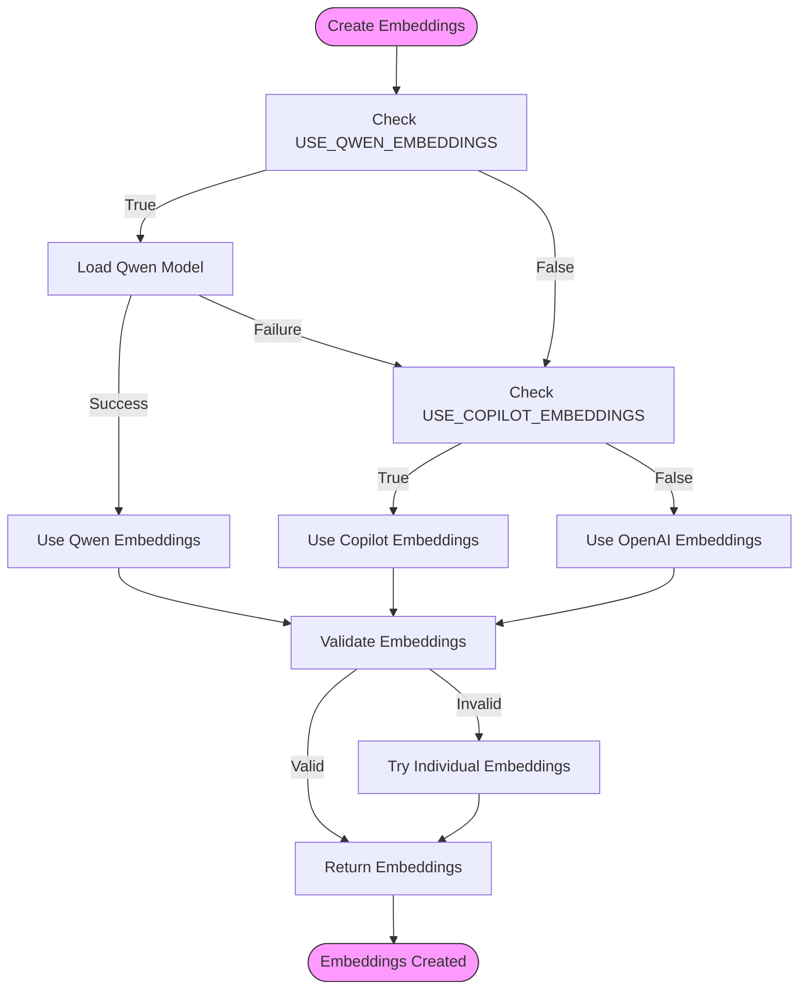
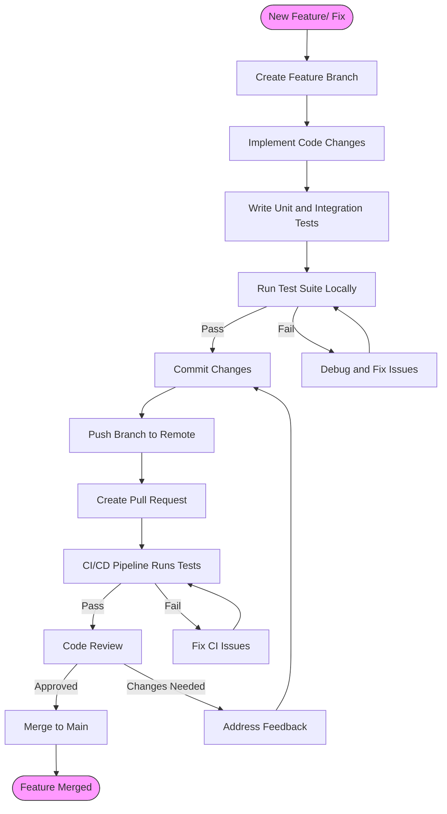

# Developer Guide

<cite>
**Referenced Files in This Document**   
- [crawl4ai_mcp.py](file://src/crawl4ai_mcp.py)
- [utils.py](file://src/utils.py)
- [interfaces.py](file://src/user_manual_chunker/interfaces.py)
- [data_models.py](file://src/user_manual_chunker/data_models.py)
- [embedding_generator.py](file://src/user_manual_chunker/embedding_generator.py)
- [knowledge_graph_validator.py](file://knowledge_graphs/knowledge_graph_validator.py)
- [parse_repo_into_neo4j.py](file://knowledge_graphs/parse_repo_into_neo4j.py)
- [ai_script_analyzer.py](file://knowledge_graphs/ai_script_analyzer.py)
- [hallucination_reporter.py](file://knowledge_graphs/hallucination_reporter.py)
- [pyproject.toml](file://pyproject.toml)
- [test_mcp_server.py](file://tests/test_mcp_server.py)
</cite>

## Table of Contents
1. [Introduction](#introduction)
2. [Tool Registration and Lifecycle Management](#tool-registration-and-lifecycle-management)
3. [Custom Chunking Strategies](#custom-chunking-strategies)
4. [Embedding Providers](#embedding-providers)
5. [Knowledge Graph Analyzers](#knowledge-graph-analyzers)
6. [Contribution Guidelines](#contribution-guidelines)
7. [Architectural Principles](#architectural-principles)
8. [Backward Compatibility and Versioning](#backward-compatibility-and-versioning)

## Introduction
This developer guide provides comprehensive documentation for extending the Crawl4AI MCP server. The system enables AI agents and coding assistants to perform web crawling, content extraction, and retrieval-augmented generation (RAG) with advanced capabilities including knowledge graph integration for hallucination detection. This guide covers the extension points for building custom tools, implementing chunking strategies, integrating embedding providers, and developing knowledge graph analyzers. The documentation also includes contribution guidelines, architectural principles, and versioning considerations to ensure consistent and maintainable codebase evolution.

## Tool Registration and Lifecycle Management

The Crawl4AI MCP server uses the FastMCP framework to manage tool registration and lifecycle. Custom tools are registered using the `@mcp.tool()` decorator pattern, which exposes functions as callable endpoints for AI agents. The server's lifecycle is managed through the `crawl4ai_lifespan` async context manager, which handles initialization and cleanup of all components.

The `crawl4ai_lifespan` function initializes critical components including the AsyncWebCrawler, Supabase client, reranking models, and Neo4j knowledge graph components. It follows a structured initialization sequence that ensures all dependencies are properly configured before the server becomes available. During initialization, the server validates environment variables, establishes database connections, loads machine learning models, and prints a comprehensive configuration summary.

When registering custom tools, developers should follow the pattern established in the codebase by defining functions with appropriate parameters and return types. The tool functions receive a `Context` object that provides access to the application context, including the crawler, Supabase client, and other initialized components. Error handling should be implemented within each tool function to provide meaningful feedback to calling agents.



**Diagram sources**
- [crawl4ai_mcp.py](file://src/crawl4ai_mcp.py#L129-L293)

**Section sources**
- [crawl4ai_mcp.py](file://src/crawl4ai_mcp.py#L129-L293)

## Custom Chunking Strategies

The system provides extensible chunking capabilities through the user_manual_chunker package, which implements a plugin architecture for different document types and chunking strategies. The core interface for custom chunking is defined in `interfaces.py`, which specifies abstract base classes for document parsers, semantic chunkers, and metadata extractors.

To implement a custom chunking strategy, developers should create a class that inherits from the `SemanticChunker` abstract base class and implement the required methods: `chunk_document`, `should_split_section`, and `split_at_paragraph_boundary`. The chunking process begins with document parsing, where the content is transformed into a structured representation using the `DocumentParser` interface. This structured representation includes headings, paragraphs, and code blocks with their positional metadata.

The `DocumentStructure` class serves as the unified representation of a parsed document, containing all elements with their hierarchical relationships. When a section exceeds the configured size limits, the `should_split_section` method determines whether splitting is necessary, and the `split_at_paragraph_boundary` method performs the actual splitting while preserving semantic boundaries. This approach ensures that chunks maintain contextual integrity and do not break mid-sentence or mid-code block.



**Diagram sources**
- [data_models.py](file://src/user_manual_chunker/data_models.py#L12-L154)

**Section sources**
- [interfaces.py](file://src/user_manual_chunker/interfaces.py#L19-L161)
- [data_models.py](file://src/user_manual_chunker/data_models.py#L12-L154)

## Embedding Providers

The system supports multiple embedding providers through a configurable fallback mechanism implemented in `utils.py`. The primary embedding providers are OpenAI, GitHub Copilot, and local Qwen models, with configuration controlled by environment variables. The `create_embeddings_batch` function implements the provider selection logic, checking the `USE_QWEN_EMBEDDINGS` and `USE_COPILOT_EMBEDDINGS` environment variables to determine the preferred provider.

When using the Qwen embedding model, the system employs lazy loading through the `get_qwen_embedding_model` function, which initializes the SentenceTransformer model only when first needed. This approach conserves memory and reduces startup time for configurations that don't use local embeddings. The Copilot integration uses the `create_embeddings_batch_copilot` function from the copilot_client module, which handles authentication, rate limiting, and error recovery.

The embedding system includes comprehensive error handling and fallback mechanisms. If the primary provider fails, the system automatically attempts the next available provider in the configured order. For OpenAI embeddings, the implementation includes retry logic with exponential backoff to handle rate limiting and transient errors. All embedding operations are performed in batches to improve efficiency, with configurable batch sizes to balance memory usage and performance.



**Diagram sources**
- [utils.py](file://src/utils.py#L121-L197)

**Section sources**
- [utils.py](file://src/utils.py#L121-L197)
- [embedding_generator.py](file://src/user_manual_chunker/embedding_generator.py#L21-L213)

## Knowledge Graph Analyzers

The knowledge graph system provides advanced capabilities for AI hallucination detection and repository analysis through Neo4j integration. The core components are implemented in the knowledge_graphs directory, with key modules including `knowledge_graph_validator.py`, `parse_repo_into_neo4j.py`, `ai_script_analyzer.py`, and `hallucination_reporter.py`.

The knowledge graph architecture follows a node-relationship model where repositories, files, classes, methods, and functions are represented as nodes with appropriate relationships. The `parse_repo_into_neo4j.py` module clones GitHub repositories and analyzes their code structure using AST parsing, creating nodes for each code element and relationships that represent containment and usage patterns. This structured representation enables sophisticated queries to validate AI-generated code against actual repository contents.

The `ai_script_analyzer.py` module parses Python scripts using Abstract Syntax Tree (AST) analysis to extract imports, class instantiations, method calls, and function usage. This information is then validated against the knowledge graph by `knowledge_graph_validator.py`, which checks for non-existent methods, incorrect parameter usage, and other potential hallucinations. The validation process returns confidence scores and detailed reports through `hallucination_reporter.py`, providing actionable feedback for code correction.

```mermaid
erDiagram
Repository ||--o{ File : contains
File ||--o{ Class : defines
File ||--o{ Function : defines
Class ||--o{ Method : has
Class ||--o{ Attribute : has
Method ||--o{ Parameter : has
Repository {
string name PK
string url
string description
timestamp created_at
timestamp updated_at
}
File {
string path PK
string name
string extension
int line_count
timestamp last_modified
}
Class {
string name PK
string full_name
string docstring
int line_start
int line_end
}
Method {
string name PK
string signature
string return_type
string docstring
int line_start
int line_end
}
Function {
string name PK
string signature
string return_type
string docstring
int line_start
int line_end
}
Attribute {
string name PK
string type
string default_value
}
Parameter {
string name PK
string type
string default_value
int position
}
```

**Diagram sources**
- [parse_repo_into_neo4j.py](file://knowledge_graphs/parse_repo_into_neo4j.py)
- [ai_script_analyzer.py](file://knowledge_graphs/ai_script_analyzer.py)
- [knowledge_graph_validator.py](file://knowledge_graphs/knowledge_graph_validator.py)

**Section sources**
- [knowledge_graph_validator.py](file://knowledge_graphs/knowledge_graph_validator.py)
- [parse_repo_into_neo4j.py](file://knowledge_graphs/parse_repo_into_neo4j.py)
- [ai_script_analyzer.py](file://knowledge_graphs/ai_script_analyzer.py)
- [hallucination_reporter.py](file://knowledge_graphs/hallucination_reporter.py)

## Contribution Guidelines

Contributions to the project should follow established code style, testing requirements, and pull request workflow. The codebase uses standard Python formatting with type hints and comprehensive docstrings following Google style documentation. All new code should include appropriate type annotations and detailed function documentation that explains parameters, return values, and exceptions.

Testing is implemented using pytest with async support, following the structure in the tests directory. New features should include both unit tests and integration tests, with appropriate pytest markers (`@pytest.mark.integration`). The test suite includes comprehensive validation of MCP server configuration, database connectivity, AI provider integration, and tool availability. The `test_mcp_server.py` file provides a complete validation suite that checks server process status, configuration, database connections, AI provider setup, RAG features, and available tools.

The pull request workflow requires that all changes pass the test suite and follow the project's architectural principles. Contributors should create feature branches from the main branch, implement their changes with comprehensive tests, and submit pull requests with detailed descriptions of the changes and their rationale. The CI/CD pipeline automatically runs the test suite and performs code quality checks before merging.



**Diagram sources**
- [test_mcp_server.py](file://tests/test_mcp_server.py#L215-L273)
- [pyproject.toml](file://pyproject.toml#L30-L40)

**Section sources**
- [test_mcp_server.py](file://tests/test_mcp_server.py#L215-L273)
- [pyproject.toml](file://pyproject.toml#L30-L40)
- [README.md](file://README.md#L194-L212)

## Architectural Principles

The system follows several key architectural principles to maintain consistency and extensibility when adding new features. The primary principle is separation of concerns, with distinct modules handling web crawling, data storage, embedding generation, and knowledge graph analysis. This modular design allows components to be developed and tested independently while maintaining clear interfaces between them.

The server follows the dependency inversion principle, with high-level modules depending on abstractions rather than concrete implementations. This is evident in the use of abstract base classes for document parsers, chunkers, and metadata extractors, which enables plugin-style extensions without modifying core functionality. The configuration system uses environment variables for all runtime settings, allowing deployment-specific configuration without code changes.

Performance and reliability are prioritized through asynchronous processing, batch operations, and comprehensive error handling. The system uses async/await patterns throughout to maximize concurrency and responsiveness. Critical operations include retry logic with exponential backoff to handle transient failures, and fallback mechanisms to ensure service availability even when individual components fail. Resource management is handled through context managers and proper cleanup in the lifespan function.

## Backward Compatibility and Versioning

The system maintains backward compatibility for public interfaces through careful versioning and deprecation practices. When modifying existing APIs, deprecated parameters or functions should be maintained with warning messages for at least one major version before removal. New features should be added as optional parameters or separate functions rather than modifying existing behavior.

Versioning follows semantic versioning principles, with major version increments for breaking changes, minor versions for new features, and patch versions for bug fixes. The `pyproject.toml` file specifies the current version and dependency requirements, with careful attention to version ranges that balance stability and security updates.

Public interfaces, including MCP tool signatures and configuration environment variables, should maintain backward compatibility across minor and patch versions. When breaking changes are necessary, they should be accompanied by comprehensive migration guides and deprecation warnings in the previous version. The test suite includes validation of backward compatibility by testing existing functionality with new changes to ensure no regressions are introduced.