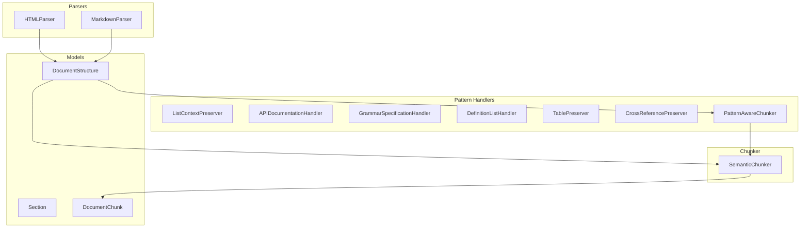
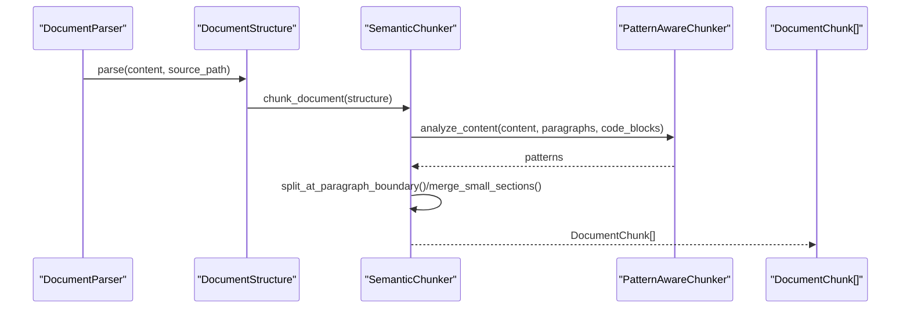
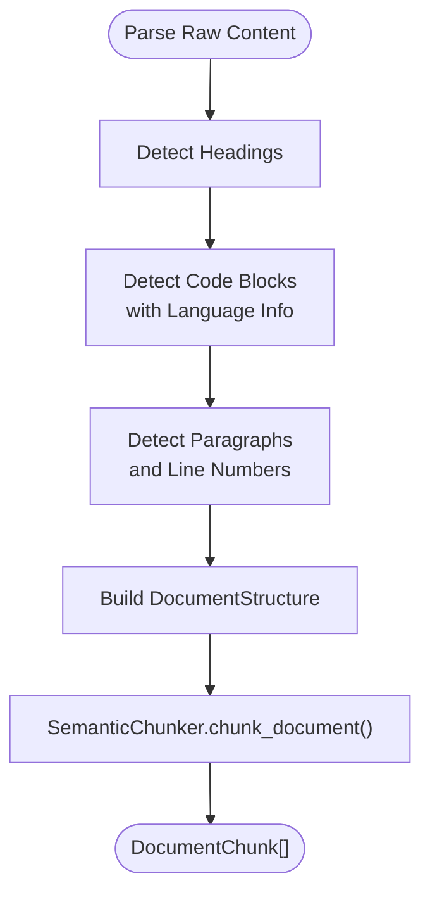
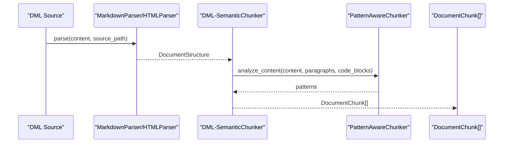
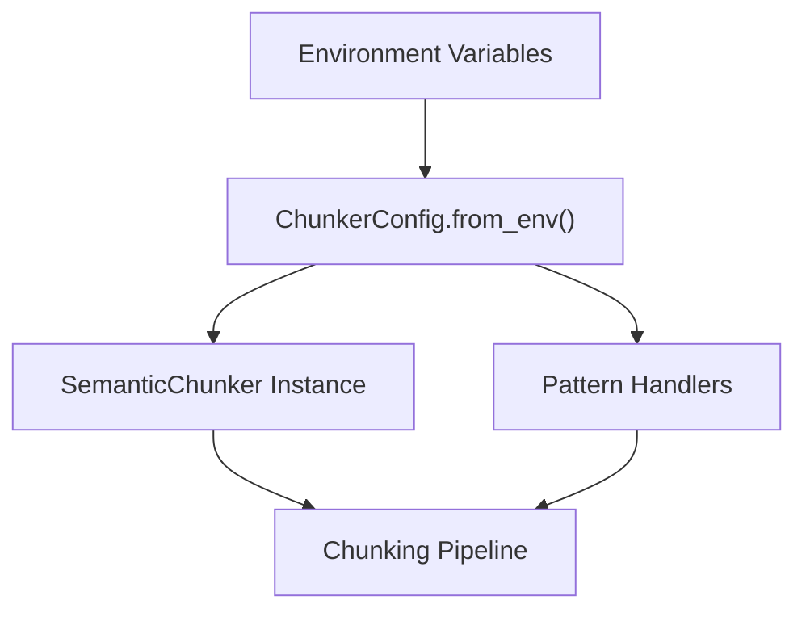
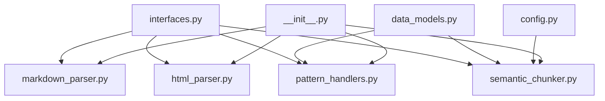

```mermaid
classDiagram
class PatternAwareChunker {
+analyze_content(content, paragraphs, code_blocks) Dict
+should_keep_together(line_start, line_end, patterns, max_size) bool
}
class ListContextPreserver {
+detect_lists(content) List
+should_keep_list_together(list_items, max_size) bool
}
class APIDocumentationHandler {
+detect_api_patterns(paragraphs, code_blocks) List
+should_keep_api_doc_together(pattern, max_size) bool
}
class GrammarSpecificationHandler {
+detect_grammar_rules(content) List
+should_keep_grammar_together(rule, max_size) bool
}
class DefinitionListHandler {
+detect_definition_lists(content) List
+should_keep_definition_together(item, max_size) bool
}
class TablePreserver {
+detect_tables(content) List
+should_keep_table_together(table, max_size) bool
}
class CrossReferencePreserver {
+detect_cross_references(content) List
+preserve_references_in_chunk(chunk_content) str
}
PatternAwareChunker --> ListContextPreserver : "uses"
PatternAwareChunker --> APIDocumentationHandler : "uses"
PatternAwareChunker --> GrammarSpecificationHandler : "uses"
PatternAwareChunker --> DefinitionListHandler : "uses"
PatternAwareChunker --> TablePreserver : "uses"
PatternAwareChunker --> CrossReferencePreserver : "uses"
```

# Custom Chunking Strategies

<cite>
**Referenced Files in This Document**
- [semantic_chunker.py](file://src/user_manual_chunker/semantic_chunker.py)
- [pattern_handlers.py](file://src/user_manual_chunker/pattern_handlers.py)
- [html_parser.py](file://src/user_manual_chunker/html_parser.py)
- [markdown_parser.py](file://src/user_manual_chunker/markdown_parser.py)
- [interfaces.py](file://src/user_manual_chunker/interfaces.py)
- [data_models.py](file://src/user_manual_chunker/data_models.py)
- [config.py](file://src/user_manual_chunker/config.py)
- [__init__.py](file://src/user_manual_chunker/__init__.py)
- [test_semantic_chunker_comprehensive.py](file://test_semantic_chunker_comprehensive.py)
- [test_pattern_handlers.py](file://test_pattern_handlers.py)
- [demo_dml_chunking.py](file://demo_dml_chunking.py)
- [crawl4ai_mcp.py](file://src/crawl4ai_mcp.py)
</cite>

## Table of Contents
1. [Introduction](#introduction)
2. [Project Structure](#project-structure)
3. [Core Components](#core-components)
4. [Architecture Overview](#architecture-overview)
5. [Detailed Component Analysis](#detailed-component-analysis)
6. [Dependency Analysis](#dependency-analysis)
7. [Performance Considerations](#performance-considerations)
8. [Troubleshooting Guide](#troubleshooting-guide)
9. [Conclusion](#conclusion)
10. [Appendices](#appendices)

## Introduction
This document explains how to implement custom chunking strategies using the user_manual_chunker module. It covers extending the SemanticChunker class to create domain-specific segmentation logic, implementing new PatternHandler classes to detect and preserve specialized content patterns, and integrating parsers into the chunking pipeline. It also describes how to register new chunkers and handlers through configuration and the dependency injection system in crawl4ai_lifespan, and provides practical examples for a DML-specific chunker for Simics documentation.

## Project Structure
The user_manual_chunker package provides a modular chunking pipeline:
- Parsers convert raw HTML or Markdown into a unified DocumentStructure.
- SemanticChunker segments content while preserving semantic boundaries and code integrity.
- Pattern handlers detect and preserve special structures (lists, API docs, grammar rules, definitions, tables, cross-references).
- Configuration and data models define runtime parameters and shared data structures.
- Tests and demos illustrate usage and validate behavior.

**Diagram sources**
- [html_parser.py](file://src/user_manual_chunker/html_parser.py#L1-L314)
- [markdown_parser.py](file://src/user_manual_chunker/markdown_parser.py#L1-L344)
- [semantic_chunker.py](file://src/user_manual_chunker/semantic_chunker.py#L1-L572)
- [pattern_handlers.py](file://src/user_manual_chunker/pattern_handlers.py#L1-L639)
- [data_models.py](file://src/user_manual_chunker/data_models.py#L1-L155)

**Section sources**
- [__init__.py](file://src/user_manual_chunker/__init__.py#L1-L67)
- [interfaces.py](file://src/user_manual_chunker/interfaces.py#L1-L162)
- [data_models.py](file://src/user_manual_chunker/data_models.py#L1-L155)

## Core Components
- DocumentParser: Abstract interface for parsing raw content into DocumentStructure.
- SemanticChunker: Implements chunking with size metrics, overlap, and semantic boundary preservation.
- Pattern handlers: Specialized detectors for lists, API docs, grammar rules, definitions, tables, and cross-references.
- Data models: Unified structures for headings, paragraphs, code blocks, sections, and chunks.
- Configuration: Centralized settings with environment variable support.

Key responsibilities:
- Parsers extract headings, paragraphs, and code blocks with line numbers and context.
- SemanticChunker splits at paragraph boundaries, merges small sections, applies overlap, and preserves code integrity.
- PatternAwareChunker coordinates pattern detection and decisions about keeping content together.

**Section sources**
- [interfaces.py](file://src/user_manual_chunker/interfaces.py#L1-L162)
- [semantic_chunker.py](file://src/user_manual_chunker/semantic_chunker.py#L1-L572)
- [pattern_handlers.py](file://src/user_manual_chunker/pattern_handlers.py#L1-L639)
- [data_models.py](file://src/user_manual_chunker/data_models.py#L1-L155)
- [config.py](file://src/user_manual_chunker/config.py#L1-L116)

## Architecture Overview
The chunking pipeline integrates parsers, chunkers, and pattern handlers into a cohesive workflow. Parsers produce a DocumentStructure; SemanticChunker transforms it into DocumentChunk objects; PatternAwareChunker can influence chunk boundaries by detecting special content patterns.

**Diagram sources**
- [interfaces.py](file://src/user_manual_chunker/interfaces.py#L1-L162)
- [semantic_chunker.py](file://src/user_manual_chunker/semantic_chunker.py#L1-L572)
- [pattern_handlers.py](file://src/user_manual_chunker/pattern_handlers.py#L1-L639)
- [html_parser.py](file://src/user_manual_chunker/html_parser.py#L1-L314)
- [markdown_parser.py](file://src/user_manual_chunker/markdown_parser.py#L1-L344)

## Detailed Component Analysis

### Extending SemanticChunker for Domain-Specific Logic
To create a domain-specific chunker:
- Inherit from the SemanticChunker interface and implement chunk_document, should_split_section, and split_at_paragraph_boundary.
- Override split_text to customize segmentation beyond paragraph boundaries (e.g., preserving DML constructs).
- Use calculate_size to enforce size limits in characters or tokens.
- Leverage DocumentStructure and Section to interleave paragraphs and code blocks while maintaining line numbers.

Implementation patterns:
- Respect code block integrity by never splitting inside code fences.
- Preserve semantic boundaries (headings) and merge small sections appropriately.
- Apply overlap to adjacent chunks to maintain continuity.

Practical example references:
- [semantic_chunker.py](file://src/user_manual_chunker/semantic_chunker.py#L1-L572)
- [interfaces.py](file://src/user_manual_chunker/interfaces.py#L63-L105)
- [data_models.py](file://src/user_manual_chunker/data_models.py#L52-L116)

**Section sources**
- [semantic_chunker.py](file://src/user_manual_chunker/semantic_chunker.py#L1-L572)
- [interfaces.py](file://src/user_manual_chunker/interfaces.py#L63-L105)
- [data_models.py](file://src/user_manual_chunker/data_models.py#L52-L116)

### Implementing PatternHandler Classes
Pattern handlers encapsulate detection and preservation logic for specialized content:
- ListContextPreserver: Detects ordered/unordered lists and keeps them together.
- APIDocumentationHandler: Identifies function signatures and surrounding descriptions.
- GrammarSpecificationHandler: Detects grammar rules and examples.
- DefinitionListHandler: Recognizes term-definition pairs.
- TablePreserver: Detects tables in markdown and HTML formats.
- CrossReferencePreserver: Detects links and ensures they remain intact.
- PatternAwareChunker: Coordinates all handlers and decides whether a line range should be kept together.

Implementation patterns:
- Use regex patterns to scan content and extract structured data.
- Track line numbers to map detections back to DocumentStructure.
- Provide should_keep_* methods to inform chunking decisions.

Practical example references:
- [pattern_handlers.py](file://src/user_manual_chunker/pattern_handlers.py#L1-L639)
- [test_pattern_handlers.py](file://test_pattern_handlers.py#L1-L218)

**Diagram sources**
- [pattern_handlers.py](file://src/user_manual_chunker/pattern_handlers.py#L1-L639)

**Section sources**
- [pattern_handlers.py](file://src/user_manual_chunker/pattern_handlers.py#L1-L639)
- [test_pattern_handlers.py](file://test_pattern_handlers.py#L1-L218)

### Integrating Parsers with the Chunking Pipeline
Parsers convert raw content into a unified DocumentStructure:
- HTMLParser: Uses BeautifulSoup to extract headings, paragraphs, and code blocks, including language detection and preceding text.
- MarkdownParser: Uses regex to extract headings, fenced and indented code blocks, and paragraphs, tracking line numbers.

Integration flow:
- Parsers populate DocumentStructure with headings, paragraphs, and code blocks.
- SemanticChunker consumes DocumentStructure to produce DocumentChunk objects.
- PatternAwareChunker can analyze content and advise chunking decisions.

Practical example references:
- [html_parser.py](file://src/user_manual_chunker/html_parser.py#L1-L314)
- [markdown_parser.py](file://src/user_manual_chunker/markdown_parser.py#L1-L344)
- [test_semantic_chunker_comprehensive.py](file://test_semantic_chunker_comprehensive.py#L1-L284)

**Diagram sources**
- [html_parser.py](file://src/user_manual_chunker/html_parser.py#L1-L314)
- [markdown_parser.py](file://src/user_manual_chunker/markdown_parser.py#L1-L344)
- [semantic_chunker.py](file://src/user_manual_chunker/semantic_chunker.py#L1-L572)

**Section sources**
- [html_parser.py](file://src/user_manual_chunker/html_parser.py#L1-L314)
- [markdown_parser.py](file://src/user_manual_chunker/markdown_parser.py#L1-L344)
- [test_semantic_chunker_comprehensive.py](file://test_semantic_chunker_comprehensive.py#L1-L284)

### Creating a DML-Specific Chunker for Simics Documentation
A DML-specific chunker can be implemented by:
- Extending the SemanticChunker interface to override split_at_paragraph_boundary and/or split_text to respect DML constructs (templates, registers, methods, fields).
- Leveraging Pattern handlers to keep API-like constructs together and preserve grammar-like structures.
- Using configuration to tune max_chunk_size, min_chunk_size, and chunk_overlap for DML content density.

Practical example references:
- [demo_dml_chunking.py](file://demo_dml_chunking.py#L1-L277)
- [semantic_chunker.py](file://src/user_manual_chunker/semantic_chunker.py#L1-L572)
- [pattern_handlers.py](file://src/user_manual_chunker/pattern_handlers.py#L1-L639)

**Diagram sources**
- [demo_dml_chunking.py](file://demo_dml_chunking.py#L1-L277)
- [semantic_chunker.py](file://src/user_manual_chunker/semantic_chunker.py#L1-L572)
- [pattern_handlers.py](file://src/user_manual_chunker/pattern_handlers.py#L1-L639)

**Section sources**
- [demo_dml_chunking.py](file://demo_dml_chunking.py#L1-L277)
- [semantic_chunker.py](file://src/user_manual_chunker/semantic_chunker.py#L1-L572)
- [pattern_handlers.py](file://src/user_manual_chunker/pattern_handlers.py#L1-L639)

### Registering New Chunkers and Handlers via Configuration and Dependency Injection
Configuration:
- ChunkerConfig centralizes parameters (max_chunk_size, min_chunk_size, chunk_overlap, size_metric, embedding_model, summary_model, etc.) and supports environment variable overrides.

Dependency injection:
- The crawl4ai_mcp.py module manages the server lifecycle and can be extended to inject custom chunkers and handlers into the pipeline. While the user_manual_chunker package exposes its components via __init__.py, the MCP server’s crawl4ai_lifespan can wire them into the crawling and chunking workflow.

Practical example references:
- [config.py](file://src/user_manual_chunker/config.py#L1-L116)
- [__init__.py](file://src/user_manual_chunker/__init__.py#L1-L67)
- [crawl4ai_mcp.py](file://src/crawl4ai_mcp.py#L130-L2277)

**Diagram sources**
- [config.py](file://src/user_manual_chunker/config.py#L1-L116)
- [__init__.py](file://src/user_manual_chunker/__init__.py#L1-L67)
- [crawl4ai_mcp.py](file://src/crawl4ai_mcp.py#L130-L2277)

**Section sources**
- [config.py](file://src/user_manual_chunker/config.py#L1-L116)
- [__init__.py](file://src/user_manual_chunker/__init__.py#L1-L67)
- [crawl4ai_mcp.py](file://src/crawl4ai_mcp.py#L130-L2277)

## Dependency Analysis
The chunking pipeline exhibits low coupling and high cohesion:
- Parsers depend on DocumentParser interface and produce DocumentStructure.
- SemanticChunker depends on DocumentStructure and data models.
- Pattern handlers are loosely coupled and coordinated by PatternAwareChunker.
- Configuration is decoupled and injected via ChunkerConfig.

**Diagram sources**
- [interfaces.py](file://src/user_manual_chunker/interfaces.py#L1-L162)
- [semantic_chunker.py](file://src/user_manual_chunker/semantic_chunker.py#L1-L572)
- [pattern_handlers.py](file://src/user_manual_chunker/pattern_handlers.py#L1-L639)
- [html_parser.py](file://src/user_manual_chunker/html_parser.py#L1-L314)
- [markdown_parser.py](file://src/user_manual_chunker/markdown_parser.py#L1-L344)
- [data_models.py](file://src/user_manual_chunker/data_models.py#L1-L155)
- [config.py](file://src/user_manual_chunker/config.py#L1-L116)
- [__init__.py](file://src/user_manual_chunker/__init__.py#L1-L67)

**Section sources**
- [interfaces.py](file://src/user_manual_chunker/interfaces.py#L1-L162)
- [semantic_chunker.py](file://src/user_manual_chunker/semantic_chunker.py#L1-L572)
- [pattern_handlers.py](file://src/user_manual_chunker/pattern_handlers.py#L1-L639)
- [html_parser.py](file://src/user_manual_chunker/html_parser.py#L1-L314)
- [markdown_parser.py](file://src/user_manual_chunker/markdown_parser.py#L1-L344)
- [data_models.py](file://src/user_manual_chunker/data_models.py#L1-L155)
- [config.py](file://src/user_manual_chunker/config.py#L1-L116)
- [__init__.py](file://src/user_manual_chunker/__init__.py#L1-L67)

## Performance Considerations
- Token-based sizing: Enabling token-based chunking improves semantic alignment but adds tokenizer overhead. Use tiktoken when size_metric is set to tokens.
- Regex-heavy pattern detection: Pattern handlers rely on regex scanning; keep patterns efficient and avoid catastrophic backtracking.
- Overlap computation: Overlap trimming ensures sentence boundaries and avoids breaking code fences, which may require additional text processing.
- Large code blocks: Code blocks are kept intact; very large code blocks may exceed max_chunk_size and require careful handling.
- Parallel processing: When integrating with the MCP server, consider concurrent crawling and chunking to improve throughput.

[No sources needed since this section provides general guidance]

## Troubleshooting Guide
Common issues and resolutions:
- Missing dependencies:
  - BeautifulSoup4/lxml for HTML parsing.
  - tiktoken for token-based sizing.
- Invalid configuration:
  - Validate ChunkerConfig parameters (e.g., max_chunk_size, min_chunk_size, chunk_overlap).
- Parser errors:
  - HTMLParser raises ImportError if BeautifulSoup is unavailable.
  - Line number calculations are approximations; verify offsets when debugging.
- Pattern handler false positives:
  - Adjust regex patterns and thresholds (e.g., definition length limits).
- Overlap anomalies:
  - Ensure sentence boundary trimming does not inadvertently remove context.

Validation references:
- [html_parser.py](file://src/user_manual_chunker/html_parser.py#L1-L314)
- [semantic_chunker.py](file://src/user_manual_chunker/semantic_chunker.py#L1-L572)
- [pattern_handlers.py](file://src/user_manual_chunker/pattern_handlers.py#L1-L639)
- [config.py](file://src/user_manual_chunker/config.py#L71-L116)
- [test_pattern_handlers.py](file://test_pattern_handlers.py#L1-L218)
- [test_semantic_chunker_comprehensive.py](file://test_semantic_chunker_comprehensive.py#L1-L284)

**Section sources**
- [html_parser.py](file://src/user_manual_chunker/html_parser.py#L1-L314)
- [semantic_chunker.py](file://src/user_manual_chunker/semantic_chunker.py#L1-L572)
- [pattern_handlers.py](file://src/user_manual_chunker/pattern_handlers.py#L1-L639)
- [config.py](file://src/user_manual_chunker/config.py#L71-L116)
- [test_pattern_handlers.py](file://test_pattern_handlers.py#L1-L218)
- [test_semantic_chunker_comprehensive.py](file://test_semantic_chunker_comprehensive.py#L1-L284)

## Conclusion
The user_manual_chunker module provides a flexible foundation for building custom chunking strategies. By extending SemanticChunker, implementing Pattern handlers, and integrating parsers, you can tailor chunking to domain-specific needs such as DML documentation. Configuration and dependency injection enable scalable deployment, while tests and demos validate correctness and performance.

[No sources needed since this section summarizes without analyzing specific files]

## Appendices

### Practical Implementation Checklist
- Define domain-specific segmentation rules in a custom SemanticChunker subclass.
- Implement Pattern handlers for recurring structures (lists, API docs, grammar rules, definitions, tables, cross-references).
- Integrate parsers to produce DocumentStructure with accurate line numbers and language detection.
- Configure ChunkerConfig for desired size metrics and chunk sizes.
- Wire components into the MCP server lifecycle via crawl4ai_lifespan.

References:
- [semantic_chunker.py](file://src/user_manual_chunker/semantic_chunker.py#L1-L572)
- [pattern_handlers.py](file://src/user_manual_chunker/pattern_handlers.py#L1-L639)
- [html_parser.py](file://src/user_manual_chunker/html_parser.py#L1-L314)
- [markdown_parser.py](file://src/user_manual_chunker/markdown_parser.py#L1-L344)
- [config.py](file://src/user_manual_chunker/config.py#L1-L116)
- [crawl4ai_mcp.py](file://src/crawl4ai_mcp.py#L130-L2277)

**Section sources**
- [semantic_chunker.py](file://src/user_manual_chunker/semantic_chunker.py#L1-L572)
- [pattern_handlers.py](file://src/user_manual_chunker/pattern_handlers.py#L1-L639)
- [html_parser.py](file://src/user_manual_chunker/html_parser.py#L1-L314)
- [markdown_parser.py](file://src/user_manual_chunker/markdown_parser.py#L1-L344)
- [config.py](file://src/user_manual_chunker/config.py#L1-L116)
- [crawl4ai_mcp.py](file://src/crawl4ai_mcp.py#L130-L2277)