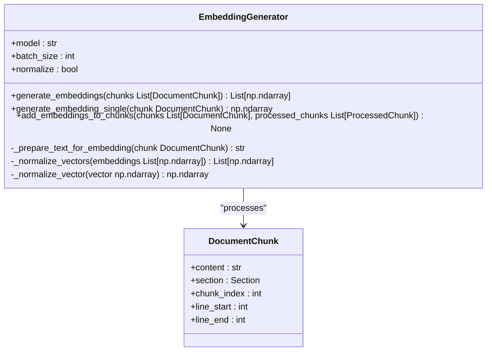
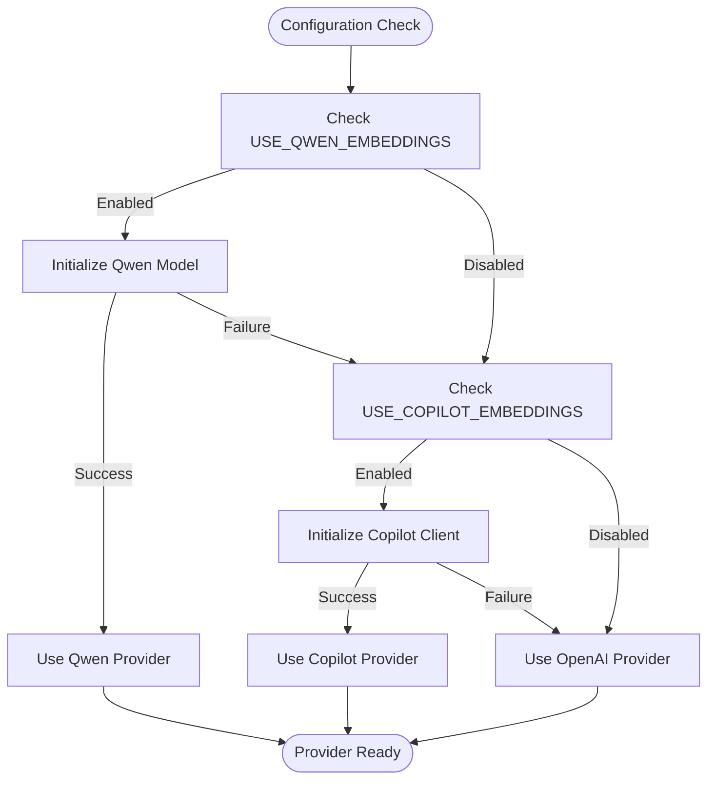
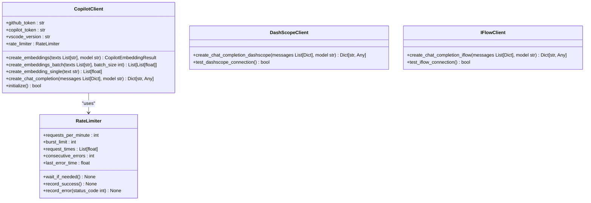
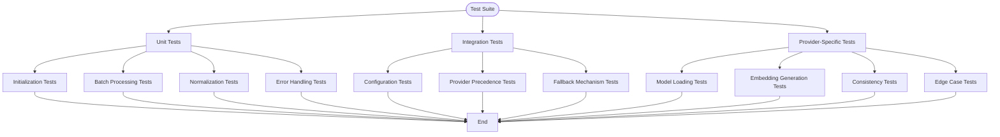
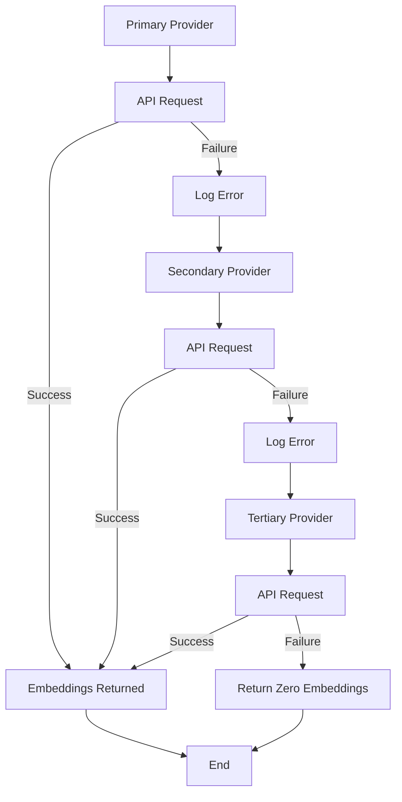

# Embedding Provider Integration

<cite>
**Referenced Files in This Document**   
- [embedding_generator.py](file://src/user_manual_chunker/embedding_generator.py)
- [interfaces.py](file://src/user_manual_chunker/interfaces.py)
- [copilot_client.py](file://src/copilot_client.py)
- [dashscope_client.py](file://src/dashscope_client.py)
- [iflow_client.py](file://src/iflow_client.py)
- [crawl4ai_mcp.py](file://src/crawl4ai_mcp.py)
- [utils.py](file://src/utils.py)
- [test_embedding_generator.py](file://test_embedding_generator.py)
</cite>

## Table of Contents
1. [Introduction](#introduction)
2. [Embedding Provider Interface](#embedding-provider-interface)
3. [Configuration and Provider Selection](#configuration-and-provider-selection)
4. [Provider Implementation Examples](#provider-implementation-examples)
5. [Creating a New Provider](#creating-a-new-provider)
6. [Testing and Validation](#testing-and-validation)
7. [Local vs. Cloud Providers](#local-vs-cloud-providers)
8. [Conclusion](#conclusion)

## Introduction
This document provides comprehensive guidance on integrating new embedding providers into the system. The architecture supports multiple embedding providers through a flexible configuration system that allows selection between different services via environment variables. The core functionality is centered around the `EmbeddingGenerator` class which interfaces with various providers through a unified API. The system supports both cloud-based providers like GitHub Copilot and local models like Qwen, with fallback mechanisms and error recovery built into the design. This documentation explains how to extend the system with new providers, configure provider selection, and ensure compatibility with the Supabase vector storage schema.

## Embedding Provider Interface

The system uses a provider-based architecture for generating embeddings, with the core functionality defined in the `EmbeddingGenerator` class. This class serves as the primary interface between the application and various embedding providers, handling batch processing, normalization, and error management.

The `EmbeddingGenerator` class provides several key methods for embedding generation:

- `generate_embeddings()`: Processes a list of document chunks in batches, preserving code syntax and normalizing vectors for cosine similarity
- `generate_embedding_single()`: Generates embeddings for individual chunks
- `add_embeddings_to_chunks()`: A convenience method that generates embeddings and updates `ProcessedChunk` objects in-place

The generator works with `DocumentChunk` objects defined in the interfaces module, which contain the content to be embedded along with metadata about the chunk's position in the original document. The generator extracts text content from these chunks and passes it to the appropriate provider based on configuration.

The system implements vector normalization to ensure consistent cosine similarity calculations across different providers. This normalization converts embedding vectors to unit length (L2 norm = 1.0), which is essential for reliable similarity comparisons in the retrieval system.



**Diagram sources**
- [embedding_generator.py](file://src/user_manual_chunker/embedding_generator.py#L21-L213)
- [interfaces.py](file://src/user_manual_chunker/interfaces.py#L154-L162)

**Section sources**
- [embedding_generator.py](file://src/user_manual_chunker/embedding_generator.py#L21-L213)

## Configuration and Provider Selection

The system uses environment variables to control provider selection and configuration, with a clear precedence hierarchy that determines which provider is used for embedding generation. The primary configuration variables are `USE_QWEN_EMBEDDINGS` and `USE_COPILOT_EMBEDDINGS`, which are evaluated in a specific order during the `crawl4ai_lifespan` initialization process.

The provider selection logic follows a cascading priority system implemented in the `create_embeddings_batch` function in `utils.py`. The system first checks for Qwen embeddings, then GitHub Copilot, and finally falls back to OpenAI if neither is configured. This precedence ensures that local models are preferred when available, reducing dependency on external services.

```python
# Provider selection logic from utils.py
use_qwen = os.getenv("USE_QWEN_EMBEDDINGS", "false").lower() == "true"
use_copilot = os.getenv("USE_COPILOT_EMBEDDINGS", "false").lower() == "true"

if use_qwen:
    return create_embeddings_batch_qwen(texts)
elif use_copilot:
    return create_embeddings_batch_copilot(texts)
else:
    return openai.embeddings.create(...)
```

During server initialization in `crawl4ai_lifespan`, the system prints a configuration summary that shows the active embedding provider, model, and other relevant settings. This provides immediate feedback on which provider is being used and helps with debugging configuration issues.

The configuration system also supports fallback mechanisms when primary providers fail. Each provider implementation includes error handling that allows the system to continue operation with degraded functionality or switch to alternative providers. For example, if the Qwen model fails to load, the system will fall back to the next available provider in the hierarchy.



**Diagram sources**
- [crawl4ai_mcp.py](file://src/crawl4ai_mcp.py#L227-L236)
- [utils.py](file://src/utils.py#L135-L156)

**Section sources**
- [crawl4ai_mcp.py](file://src/crawl4ai_mcp.py#L227-L236)
- [utils.py](file://src/utils.py#L135-L156)

## Provider Implementation Examples

The system includes several concrete implementations of embedding providers, each demonstrating different approaches to API integration and client design. These implementations serve as templates for creating new providers and illustrate best practices for authentication, rate limiting, and error recovery.

### GitHub Copilot Client

The `CopilotClient` class in `copilot_client.py` provides integration with GitHub Copilot's embedding API. This implementation uses asynchronous HTTP requests with the `httpx` library and includes comprehensive rate limiting with exponential backoff. The client handles authentication by obtaining a temporary token from the GitHub API using a personal access token.

Key features of the Copilot client include:
- Asynchronous request handling for improved performance
- Rate limiting with burst control and exponential backoff
- Automatic token refresh when authentication expires
- Fallback mechanisms for handling API errors
- Synchronous wrapper functions for compatibility with existing code

The client uses a global instance pattern with lazy initialization, ensuring that the client is only created when needed and that authentication is handled transparently.

### DashScope Client

The `dashscope_client.py` file implements a client for Alibaba Cloud's Qwen models through the DashScope API. This implementation is simpler than the Copilot client, using synchronous requests with the `requests` library. It requires a `DASHSCOPE_API_KEY` environment variable for authentication and sends requests to the DashScope API endpoint.

The DashScope client demonstrates a straightforward approach to API integration with proper error handling and response parsing. It returns results in an OpenAI-compatible format, ensuring consistency across different providers.

### iFlow Client

The `iflow_client.py` provides integration with Qwen models through LiteLLM, demonstrating how to use a unified interface for multiple LLM providers. This implementation uses LiteLLM's abstraction layer to route requests to the appropriate backend, in this case converting `iflow/` prefixed models to `dashscope/` format.

The iFlow client includes a rate limiter similar to the Copilot client but implemented synchronously using the `time` module instead of `asyncio`. It also demonstrates how to handle API key configuration and base URL customization through environment variables.



**Diagram sources**
- [copilot_client.py](file://src/copilot_client.py#L108-L560)
- [dashscope_client.py](file://src/dashscope_client.py#L10-L111)
- [iflow_client.py](file://src/iflow_client.py#L106-L215)

**Section sources**
- [copilot_client.py](file://src/copilot_client.py#L108-L560)
- [dashscope_client.py](file://src/dashscope_client.py#L10-L111)
- [iflow_client.py](file://src/iflow_client.py#L106-L215)

## Creating a New Provider

To add support for a new embedding provider, you need to create a client class that handles the specific API integration requirements of the provider. The process involves several key steps: authentication setup, API request handling, error recovery, and integration with the existing system.

### Client Class Structure

Create a new Python file for your provider client (e.g., `myprovider_client.py`) with the following structure:

```python
"""
MyProvider client for embedding generation.
Provides integration with MyProvider's embedding API.
"""

import os
import requests
from typing import List, Dict, Any
from dataclasses import dataclass

@dataclass
class MyProviderEmbeddingResult:
    """Result from MyProvider embedding operation."""
    embeddings: List[List[float]]
    model: str
    usage: Dict[str, int]
    texts: List[str]

class RateLimiter:
    """Rate limiter for API requests with exponential backoff."""
    def __init__(self, requests_per_minute: int = 60, burst_limit: int = 10):
        # Implementation similar to existing rate limiters
        pass
    
    def wait_if_needed(self) -> None:
        # Wait if rate limit would be exceeded
        pass
    
    def record_success(self) -> None:
        # Record a successful request
        pass
    
    def record_error(self, error: Exception) -> None:
        # Record an error and determine backoff
        pass

class MyProviderClient:
    """Client for MyProvider embedding API."""
    
    def __init__(self, api_key: str = None, requests_per_minute: int = 60):
        """
        Initialize the MyProvider client.
        
        Args:
            api_key: MyProvider API key. If None, will try to load from environment.
            requests_per_minute: Rate limit for API requests.
        """
        self.api_key = api_key or os.getenv("MYPROVIDER_API_KEY")
        if not self.api_key:
            raise ValueError("MYPROVIDER_API_KEY environment variable must be set")
        
        self.rate_limiter = RateLimiter(requests_per_minute=requests_per_minute)
    
    def create_embeddings(self, texts: List[str], model: str = "default-model") -> MyProviderEmbeddingResult:
        """
        Create embeddings for the given texts.
        
        Args:
            texts: List of text strings to embed
            model: Embedding model to use
            
        Returns:
            MyProviderEmbeddingResult with embeddings and metadata
        """
        # Implement API request with rate limiting and error handling
        pass
    
    def create_embeddings_batch(self, texts: List[str], batch_size: int = 20) -> List[List[float]]:
        """
        Create embeddings for multiple texts in batches.
        
        Args:
            texts: List of texts to embed
            batch_size: Size of each batch
            
        Returns:
            List of embeddings
        """
        # Implement batch processing with the create_embeddings method
        pass
```

### Authentication and Configuration

Set up authentication by defining the required environment variables and implementing validation in the client initialization. Most providers require an API key, which should be retrieved from environment variables with appropriate error handling:

```python
def __init__(self, api_key: str = None):
    self.api_key = api_key or os.getenv("MYPROVIDER_API_KEY")
    if not self.api_key:
        raise ValueError("MYPROVIDER_API_KEY environment variable must be set")
```

### Rate Limiting and Error Recovery

Implement robust rate limiting and error recovery mechanisms similar to the existing providers. The rate limiter should handle both rate limit errors (HTTP 429) and server errors (HTTP 5xx) with exponential backoff:

```python
async def wait_if_needed(self) -> None:
    """Wait if rate limit would be exceeded."""
    now = time.time()
    
    # Remove requests older than 1 minute
    self.request_times = [t for t in self.request_times if now - t < 60]
    
    # Check if we need to wait for rate limit
    if len(self.request_times) >= self.requests_per_minute:
        oldest_request = min(self.request_times)
        sleep_time = 60 - (now - oldest_request)
        if sleep_time > 0:
            await asyncio.sleep(sleep_time)
            return await self.wait_if_needed()
    
    # Exponential backoff for consecutive errors
    if self.consecutive_errors > 0:
        backoff_time = min(2 ** self.consecutive_errors, 30)  # Max 30 seconds
        if now - self.last_error_time < backoff_time:
            sleep_time = backoff_time - (now - self.last_error_time)
            await asyncio.sleep(sleep_time)
```

### Integration with the System

To integrate your new provider with the system, you need to add it to the provider selection logic in `utils.py`. Add a new environment variable check and implementation function:

```python
def create_embeddings_batch(texts: List[str]) -> List[List[float]]:
    """Create embeddings for multiple texts."""
    
    # Check embedding preference order: NewProvider -> Qwen -> Copilot -> OpenAI
    use_newprovider = os.getenv("USE_NEWPROVIDER_EMBEDDINGS", "false").lower() == "true"
    use_qwen = os.getenv("USE_QWEN_EMBEDDINGS", "false").lower() == "true"
    use_copilot = os.getenv("USE_COPILOT_EMBEDDINGS", "false").lower() == "true"
    
    if use_newprovider:
        print("Using MyProvider for embeddings...")
        try:
            return create_embeddings_batch_newprovider(texts)
        except Exception as e:
            print(f"Error using MyProvider embeddings: {e}")
            print("Falling back to next available option...")
    
    # Continue with existing provider checks...
```

Create wrapper functions similar to the existing ones to provide a consistent interface:

```python
def create_embeddings_batch_newprovider(texts: List[str]) -> List[List[float]]:
    """Create embeddings using MyProvider."""
    if not texts:
        return []
    
    client = MyProviderClient()
    try:
        result = client.create_embeddings_batch(texts)
        return result.embeddings
    except Exception as e:
        print(f"Error creating MyProvider embeddings: {e}")
        return [[0.0] * 1536 for _ in texts]  # Return fallback embeddings
```

Update the `crawl4ai_lifespan` function to include your provider in the configuration summary:

```python
# In crawl4ai_mcp.py
if os.getenv("USE_NEWPROVIDER_EMBEDDINGS", "false").lower() == "true":
    embedding_provider = "MyProvider"
    embedding_model = "myprovider-model-name"
```

**Section sources**
- [copilot_client.py](file://src/copilot_client.py#L108-L560)
- [utils.py](file://src/utils.py#L121-L197)
- [crawl4ai_mcp.py](file://src/crawl4ai_mcp.py#L227-L236)

## Testing and Validation

The system includes a comprehensive test suite for validating embedding provider functionality, with tests focused on correctness, performance, and error handling. The primary test file is `test_embedding_generator.py`, which contains unit tests for the `EmbeddingGenerator` class and its integration with different providers.

### Unit Testing

The unit tests verify the core functionality of the embedding generator, including:

- Initialization with different parameters
- Batch processing and batching logic
- Vector normalization
- Error handling for API failures
- Code syntax preservation in embedded content

The tests use mocking to isolate the embedding generation logic from actual API calls, allowing for reliable testing without requiring API keys or network connectivity:

```python
@patch('user_manual_chunker.embedding_generator.create_embeddings_batch_copilot')
def test_generate_embeddings_batch(self, mock_batch_embed):
    """Test batch embedding generation."""
    # Mock embedding responses
    mock_embeddings = [[0.1, 0.2, 0.3, 0.4]]
    mock_batch_embed.return_value = mock_embeddings
    
    embeddings = self.generator.generate_embeddings(self.mock_chunks)
    
    # Verify batch function was called
    mock_batch_embed.assert_called_once()
```

### Integration Testing

Integration tests verify that the embedding providers work correctly with the full system stack. The `test_qwen_integration.py` file contains tests that validate end-to-end functionality when Qwen embeddings are enabled:

```python
def test_environment_variable_precedence(self):
    """Test that Qwen takes precedence over other embedding methods."""
    with patch.dict(os.environ, {
        "USE_QWEN_EMBEDDINGS": "true",
        "USE_COPILOT_EMBEDDINGS": "true",
    }):
        with patch('utils.create_embeddings_batch_qwen') as mock_qwen:
            mock_qwen.return_value = [[0.1, 0.2, 0.3]]
            
            result = create_embeddings_batch(["test"])
            
            # Qwen should be called, not Copilot
            mock_qwen.assert_called_once_with(["test"])
```

### Provider-Specific Testing

Each provider should have its own test file to validate specific functionality. For example, `test_qwen_embeddings.py` contains tests for the Qwen embedding model:

```python
def test_qwen_embedding_similarity(self):
    """Test that similar texts produce similar embeddings."""
    similar_texts = ["Hello world", "Hi there world"]
    embeddings = create_embeddings_batch_qwen(similar_texts)
    
    # Calculate cosine similarity
    similarity = np.dot(embeddings[0], embeddings[1]) / (np.linalg.norm(embeddings[0]) * np.linalg.norm(embeddings[1]))
    assert similarity > 0.5  # Similar texts should have high similarity
```

### Testing New Providers

When adding a new provider, create a test file following the pattern of existing provider tests. The test should verify:

1. Model loading and initialization
2. Successful embedding generation
3. Error handling for API failures
4. Consistency of embeddings for the same input
5. Proper handling of empty inputs
6. Batch vs. single embedding consistency

Use the existing test files as templates, ensuring that your tests cover both success and failure scenarios. The tests should be able to run without requiring actual API keys by using mocking where appropriate.



**Diagram sources**
- [test_embedding_generator.py](file://test_embedding_generator.py#L50-L480)
- [test_qwen_integration.py](file://tests/test_qwen_integration.py#L16-L249)
- [test_qwen_embeddings.py](file://tests/test_qwen_embeddings.py#L14-L185)

**Section sources**
- [test_embedding_generator.py](file://test_embedding_generator.py#L50-L480)
- [test_qwen_integration.py](file://tests/test_qwen_integration.py#L16-L249)
- [test_qwen_embeddings.py](file://tests/test_qwen_embeddings.py#L14-L185)

## Local vs. Cloud Providers

The system supports both local and cloud-based embedding providers, each with different considerations for deployment, performance, and resource utilization. Understanding these differences is crucial for selecting the appropriate provider for your use case.

### Local Providers (Qwen)

Local providers like the Qwen embedding model offer several advantages:

- **Privacy**: Data remains within your infrastructure
- **Cost**: No per-request fees after initial setup
- **Latency**: Potentially lower latency for internal requests
- **Reliability**: Not dependent on external service availability

However, local providers also have challenges:

- **Resource Requirements**: Significant GPU/CPU and memory requirements
- **Model Loading**: Time required to load large models into memory
- **Optimization**: Need for careful optimization of inference performance
- **Maintenance**: Responsibility for model updates and security patches

The Qwen implementation in the system loads the model on CPU by default, which makes it accessible but potentially slower than GPU-accelerated inference. The model is loaded lazily using the `get_qwen_embedding_model()` function, which ensures that the model is only loaded when needed.

```python
def get_qwen_embedding_model():
    """Get the Qwen embedding model (lazy loading)."""
    global _qwen_embedding_model
    
    if _qwen_embedding_model is None:
        try:
            from sentence_transformers import SentenceTransformer
            import torch
            
            # Force CPU usage
            device = "cpu"
            print(f"Loading Qwen embedding model on {device}...")
            
            # Load the model
            _qwen_embedding_model = SentenceTransformer(
                "Qwen/Qwen3-Embedding-0.6B",
                device=device,
                trust_remote_code=True
            )
            print("✓ Qwen embedding model loaded successfully")
        except Exception as e:
            print(f"Failed to load Qwen embedding model: {e}")
            _qwen_embedding_model = "failed"
    
    return _qwen_embedding_model if _qwen_embedding_model != "failed" else None
```

### Cloud Providers (Copilot, DashScope)

Cloud providers offer different trade-offs:

- **Scalability**: Automatic scaling to handle variable loads
- **Maintenance**: Provider handles model updates and infrastructure
- **Advanced Features**: Access to the latest models and features
- **Global Availability**: Consistent performance regardless of location

Challenges with cloud providers include:

- **Cost**: Per-request pricing that can become expensive at scale
- **Latency**: Network round-trip time for API calls
- **Privacy**: Data sent to external services
- **Reliability**: Dependency on external service uptime

The Copilot client implementation demonstrates best practices for cloud provider integration, including rate limiting, token refresh, and error recovery.

### Fallback Mechanisms

The system implements a robust fallback mechanism that allows it to continue functioning even when primary providers fail. This is achieved through the cascading provider selection logic and comprehensive error handling in each provider implementation.

When a provider fails, the system logs the error and falls back to the next available provider in the hierarchy. If all providers fail, the system returns zero embeddings as a fallback, allowing the application to continue with degraded functionality rather than failing completely.



**Diagram sources**
- [utils.py](file://src/utils.py#L135-L156)
- [copilot_client.py](file://src/copilot_client.py#L224-L246)
- [iflow_client.py](file://src/iflow_client.py#L180-L183)

**Section sources**
- [utils.py](file://src/utils.py#L135-L156)
- [copilot_client.py](file://src/copilot_client.py#L224-L246)
- [iflow_client.py](file://src/iflow_client.py#L180-L183)

## Conclusion

The embedding provider system in this project is designed to be flexible, extensible, and robust. By following the patterns established in the existing implementations, you can integrate new providers while maintaining compatibility with the overall architecture.

Key takeaways for integrating new providers:

1. **Follow the provider pattern**: Create a client class that handles authentication, API requests, and error recovery
2. **Implement comprehensive error handling**: Include rate limiting, retry logic, and fallback mechanisms
3. **Maintain interface consistency**: Ensure your provider returns results in a format compatible with the existing system
4. **Add proper configuration**: Use environment variables to control provider selection and settings
5. **Write comprehensive tests**: Validate both success and failure scenarios
6. **Consider performance implications**: Optimize for your specific deployment scenario (local vs. cloud)

The system's cascading provider selection and fallback mechanisms ensure high availability and reliability, while the modular design makes it easy to add or remove providers as needed. By following these guidelines, you can extend the system's capabilities while maintaining its stability and performance.

**Section sources**
- [embedding_generator.py](file://src/user_manual_chunker/embedding_generator.py#L21-L213)
- [utils.py](file://src/utils.py#L121-L317)
- [crawl4ai_mcp.py](file://src/crawl4ai_mcp.py#L130-L293)