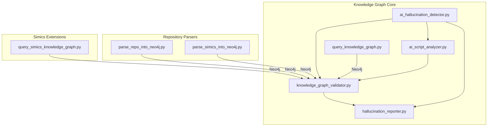
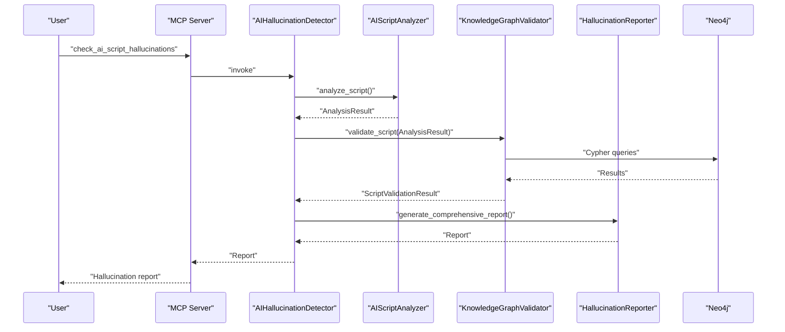
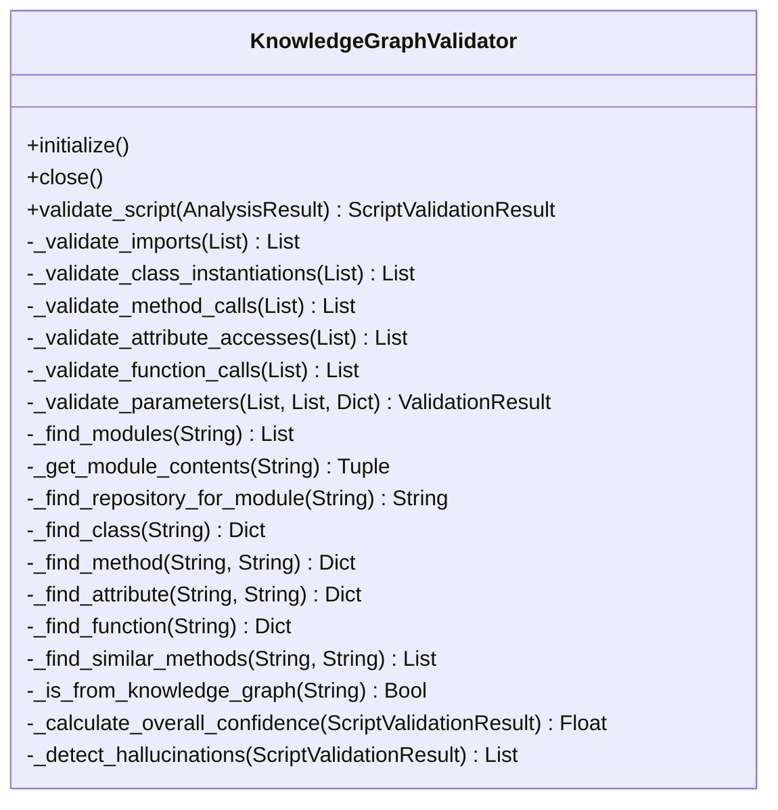
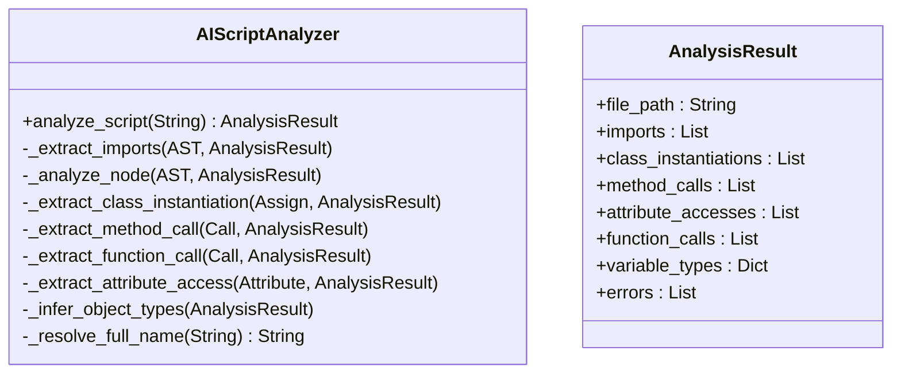
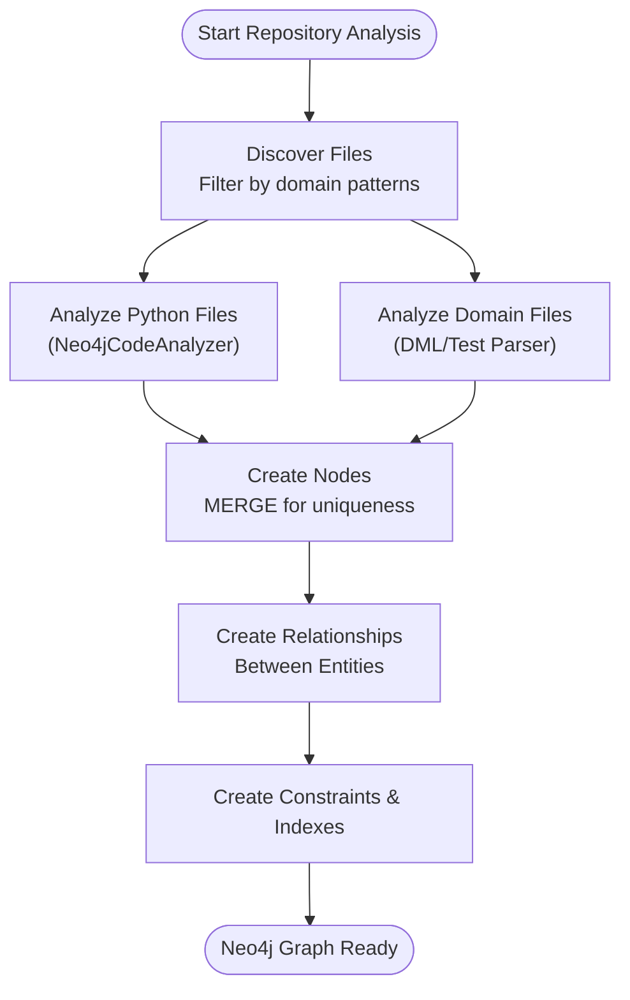
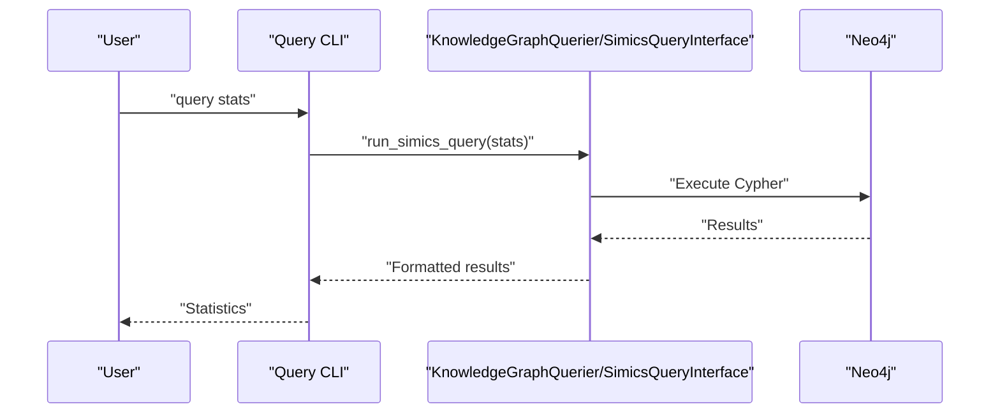
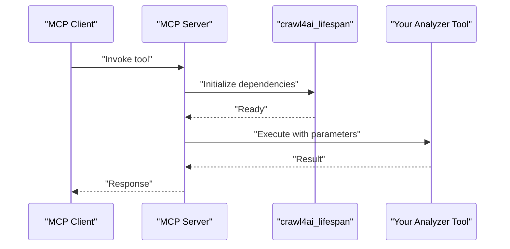
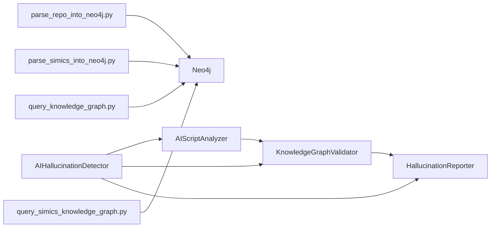

# Knowledge Graph Analyzer Extensions

<cite>
**Referenced Files in This Document**
- [README.md](file://README.md)
- [mcp.json](file://mcp.json)
- [knowledge_graphs/README_Simics.md](file://knowledge_graphs/README_Simics.md)
- [knowledge_graphs/knowledge_graph_validator.py](file://knowledge_graphs/knowledge_graph_validator.py)
- [knowledge_graphs/ai_script_analyzer.py](file://knowledge_graphs/ai_script_analyzer.py)
- [knowledge_graphs/ai_hallucination_detector.py](file://knowledge_graphs/ai_hallucination_detector.py)
- [knowledge_graphs/hallucination_reporter.py](file://knowledge_graphs/hallucination_reporter.py)
- [knowledge_graphs/query_knowledge_graph.py](file://knowledge_graphs/query_knowledge_graph.py)
- [knowledge_graphs/parse_repo_into_neo4j.py](file://knowledge_graphs/parse_repo_into_neo4j.py)
- [knowledge_graphs/parse_simics_into_neo4j.py](file://knowledge_graphs/parse_simics_into_neo4j.py)
- [knowledge_graphs/query_simics_knowledge_graph.py](file://knowledge_graphs/query_simics_knowledge_graph.py)
</cite>

## Table of Contents
1. [Introduction](#introduction)
2. [Project Structure](#project-structure)
3. [Core Components](#core-components)
4. [Architecture Overview](#architecture-overview)
5. [Detailed Component Analysis](#detailed-component-analysis)
6. [Dependency Analysis](#dependency-analysis)
7. [Performance Considerations](#performance-considerations)
8. [Troubleshooting Guide](#troubleshooting-guide)
9. [Conclusion](#conclusion)
10. [Appendices](#appendices)

## Introduction
This document explains how to extend the knowledge graph analyzer functionality to support custom analyzers, new repository parsers, and domain-specific graph schemas. It covers:
- Extending the KnowledgeGraphValidator class to implement new validation rules (e.g., architectural anti-patterns, coding standards).
- Creating new repository parsers that extract domain-specific entities and relationships into Neo4j, including node labels, relationship types, and property constraints.
- Querying the knowledge graph for specific patterns and generating actionable reports, using examples from ai_hallucination_detector.py.
- Registering new analyzers through the crawl4ai_lifespan dependency injection system and exposing them as MCP tools.
- Performance optimization strategies for large repositories, including indexing, query optimization, and incremental parsing.
- Extending the graph schema while maintaining backward compatibility with existing queries and tools.

## Project Structure
The knowledge graph analyzer lives primarily under the knowledge_graphs/ directory and integrates with the broader MCP server described in the repository’s README. The Simics-specific extensions demonstrate how to add domain-specific nodes and relationships.

**Diagram sources**
- [knowledge_graphs/ai_script_analyzer.py](file://knowledge_graphs/ai_script_analyzer.py#L1-L120)
- [knowledge_graphs/knowledge_graph_validator.py](file://knowledge_graphs/knowledge_graph_validator.py#L1-L120)
- [knowledge_graphs/hallucination_reporter.py](file://knowledge_graphs/hallucination_reporter.py#L1-L120)
- [knowledge_graphs/ai_hallucination_detector.py](file://knowledge_graphs/ai_hallucination_detector.py#L1-L120)
- [knowledge_graphs/query_knowledge_graph.py](file://knowledge_graphs/query_knowledge_graph.py#L1-L120)
- [knowledge_graphs/parse_repo_into_neo4j.py](file://knowledge_graphs/parse_repo_into_neo4j.py#L1-L120)
- [knowledge_graphs/parse_simics_into_neo4j.py](file://knowledge_graphs/parse_simics_into_neo4j.py#L1-L120)
- [knowledge_graphs/query_simics_knowledge_graph.py](file://knowledge_graphs/query_simics_knowledge_graph.py#L1-L120)

**Section sources**
- [README.md](file://README.md#L626-L773)
- [knowledge_graphs/README_Simics.md](file://knowledge_graphs/README_Simics.md#L1-L120)

## Core Components
- ai_script_analyzer.py: Extracts imports, class instantiations, method calls, function calls, and attribute accesses from Python scripts using AST.
- knowledge_graph_validator.py: Validates AST-extracted usage against Neo4j to detect hallucinations and enforce parameter correctness.
- hallucination_reporter.py: Generates comprehensive JSON and Markdown reports from validation results.
- ai_hallucination_detector.py: Orchestrates AST analysis, knowledge graph validation, and report generation.
- query_knowledge_graph.py: Interactive CLI to explore the knowledge graph (now integrated into MCP tools).
- parse_repo_into_neo4j.py: Repository parser that clones and analyzes Python repositories, inserting nodes and relationships into Neo4j.
- parse_simics_into_neo4j.py: Extends the base parser for Simics DML and test files, adding domain-specific nodes and relationships.
- query_simics_knowledge_graph.py: Pre-built queries and interactive interface for Simics-specific analysis.

**Section sources**
- [knowledge_graphs/ai_script_analyzer.py](file://knowledge_graphs/ai_script_analyzer.py#L1-L120)
- [knowledge_graphs/knowledge_graph_validator.py](file://knowledge_graphs/knowledge_graph_validator.py#L1-L120)
- [knowledge_graphs/hallucination_reporter.py](file://knowledge_graphs/hallucination_reporter.py#L1-L120)
- [knowledge_graphs/ai_hallucination_detector.py](file://knowledge_graphs/ai_hallucination_detector.py#L1-L120)
- [knowledge_graphs/query_knowledge_graph.py](file://knowledge_graphs/query_knowledge_graph.py#L1-L120)
- [knowledge_graphs/parse_repo_into_neo4j.py](file://knowledge_graphs/parse_repo_into_neo4j.py#L1-L120)
- [knowledge_graphs/parse_simics_into_neo4j.py](file://knowledge_graphs/parse_simics_into_neo4j.py#L1-L120)
- [knowledge_graphs/query_simics_knowledge_graph.py](file://knowledge_graphs/query_simics_knowledge_graph.py#L1-L120)

## Architecture Overview
The knowledge graph analyzer follows a layered architecture:
- AST-based script analysis feeds structured usage data.
- KnowledgeGraphValidator queries Neo4j to validate usage against repository structure.
- Reports summarize validation outcomes and recommendations.
- Repository parsers populate Neo4j with nodes and relationships.
- Simics extensions add domain-specific nodes and relationships.

**Diagram sources**
- [knowledge_graphs/ai_hallucination_detector.py](file://knowledge_graphs/ai_hallucination_detector.py#L1-L200)
- [knowledge_graphs/ai_script_analyzer.py](file://knowledge_graphs/ai_script_analyzer.py#L1-L120)
- [knowledge_graphs/knowledge_graph_validator.py](file://knowledge_graphs/knowledge_graph_validator.py#L1-L200)
- [knowledge_graphs/hallucination_reporter.py](file://knowledge_graphs/hallucination_reporter.py#L1-L120)

## Detailed Component Analysis

### Extending KnowledgeGraphValidator for New Validation Rules
To implement new validation rules (e.g., architectural anti-patterns or coding standards):
- Add new validation methods mirroring the existing patterns in KnowledgeGraphValidator (e.g., _validate_* methods).
- Use Neo4j queries to fetch graph data and compute rule violations.
- Return ValidationResult objects with appropriate status, confidence, message, details, and suggestions.
- Update the orchestration in validate_script to call your new methods and incorporate results into overall_confidence and hallucinations_detected.

**Diagram sources**
- [knowledge_graphs/knowledge_graph_validator.py](file://knowledge_graphs/knowledge_graph_validator.py#L1-L200)

**Section sources**
- [knowledge_graphs/knowledge_graph_validator.py](file://knowledge_graphs/knowledge_graph_validator.py#L129-L200)
- [knowledge_graphs/knowledge_graph_validator.py](file://knowledge_graphs/knowledge_graph_validator.py#L539-L641)

### Building Custom Analyzers with ai_script_analyzer.py
Extend AIScriptAnalyzer to extract additional usage patterns or metadata for custom validators:
- Add new AST visitor logic to capture domain-specific constructs.
- Emit new dataclasses and lists in AnalysisResult to carry extra information.
- Ensure type inference and variable tracking remain consistent for downstream validation.

**Diagram sources**
- [knowledge_graphs/ai_script_analyzer.py](file://knowledge_graphs/ai_script_analyzer.py#L1-L120)
- [knowledge_graphs/ai_script_analyzer.py](file://knowledge_graphs/ai_script_analyzer.py#L72-L120)

**Section sources**
- [knowledge_graphs/ai_script_analyzer.py](file://knowledge_graphs/ai_script_analyzer.py#L93-L126)
- [knowledge_graphs/ai_script_analyzer.py](file://knowledge_graphs/ai_script_analyzer.py#L174-L232)

### Creating Domain-Specific Parsers (e.g., parse_simics_into_neo4j.py)
To add a new repository parser for a domain:
- Derive from DirectNeo4jExtractor or reuse Neo4jCodeAnalyzer for Python parsing.
- Define domain-specific nodes and relationships (e.g., DMLDevice, DMLInterface, TestFunction).
- Implement schema constraints and indexes tailored to your domain.
- Add relationship creation logic to connect domain entities to each other and to Python code.
- Provide pre-defined queries and an interactive interface similar to query_simics_knowledge_graph.py.

**Diagram sources**
- [knowledge_graphs/parse_simics_into_neo4j.py](file://knowledge_graphs/parse_simics_into_neo4j.py#L1-L120)
- [knowledge_graphs/parse_simics_into_neo4j.py](file://knowledge_graphs/parse_simics_into_neo4j.py#L182-L224)
- [knowledge_graphs/parse_simics_into_neo4j.py](file://knowledge_graphs/parse_simics_into_neo4j.py#L311-L397)
- [knowledge_graphs/parse_simics_into_neo4j.py](file://knowledge_graphs/parse_simics_into_neo4j.py#L398-L563)

**Section sources**
- [knowledge_graphs/parse_simics_into_neo4j.py](file://knowledge_graphs/parse_simics_into_neo4j.py#L182-L224)
- [knowledge_graphs/parse_simics_into_neo4j.py](file://knowledge_graphs/parse_simics_into_neo4j.py#L311-L397)
- [knowledge_graphs/parse_simics_into_neo4j.py](file://knowledge_graphs/parse_simics_into_neo4j.py#L398-L563)

### Querying the Knowledge Graph for Actionable Reports
Use query_knowledge_graph.py or query_simics_knowledge_graph.py to explore the graph and generate insights:
- List repositories, classes, and methods.
- Search for specific patterns (e.g., method usage, device hierarchies).
- Run custom Cypher queries for ad-hoc analysis.
- Integrate results into reports for stakeholders.

**Diagram sources**
- [knowledge_graphs/query_knowledge_graph.py](file://knowledge_graphs/query_knowledge_graph.py#L1-L120)
- [knowledge_graphs/query_simics_knowledge_graph.py](file://knowledge_graphs/query_simics_knowledge_graph.py#L1-L120)

**Section sources**
- [knowledge_graphs/query_knowledge_graph.py](file://knowledge_graphs/query_knowledge_graph.py#L1-L120)
- [knowledge_graphs/query_simics_knowledge_graph.py](file://knowledge_graphs/query_simics_knowledge_graph.py#L1-L120)

### Registering Analyzers Through crawl4ai_lifespan and Exposing as MCP Tools
To integrate analyzers into the MCP server:
- Add your analyzer class and any dependencies to the server’s lifespan function.
- Decorate your tool methods with the MCP tool decorator and define input/output schemas.
- Expose the tool via the MCP server so clients can invoke it programmatically.
- Ensure environment variables (e.g., Neo4j credentials) are available to the server.

**Diagram sources**
- [README.md](file://README.md#L534-L593)

**Section sources**
- [README.md](file://README.md#L534-L593)
- [mcp.json](file://mcp.json#L1-L9)

## Dependency Analysis
The knowledge graph analyzer components depend on each other in a clear pipeline. The following diagram shows key dependencies and relationships.

**Diagram sources**
- [knowledge_graphs/ai_script_analyzer.py](file://knowledge_graphs/ai_script_analyzer.py#L1-L120)
- [knowledge_graphs/knowledge_graph_validator.py](file://knowledge_graphs/knowledge_graph_validator.py#L1-L120)
- [knowledge_graphs/hallucination_reporter.py](file://knowledge_graphs/hallucination_reporter.py#L1-L120)
- [knowledge_graphs/ai_hallucination_detector.py](file://knowledge_graphs/ai_hallucination_detector.py#L1-L120)
- [knowledge_graphs/parse_repo_into_neo4j.py](file://knowledge_graphs/parse_repo_into_neo4j.py#L1-L120)
- [knowledge_graphs/parse_simics_into_neo4j.py](file://knowledge_graphs/parse_simics_into_neo4j.py#L1-L120)
- [knowledge_graphs/query_knowledge_graph.py](file://knowledge_graphs/query_knowledge_graph.py#L1-L120)
- [knowledge_graphs/query_simics_knowledge_graph.py](file://knowledge_graphs/query_simics_knowledge_graph.py#L1-L120)

**Section sources**
- [knowledge_graphs/ai_script_analyzer.py](file://knowledge_graphs/ai_script_analyzer.py#L1-L120)
- [knowledge_graphs/knowledge_graph_validator.py](file://knowledge_graphs/knowledge_graph_validator.py#L1-L120)
- [knowledge_graphs/hallucination_reporter.py](file://knowledge_graphs/hallucination_reporter.py#L1-L120)
- [knowledge_graphs/ai_hallucination_detector.py](file://knowledge_graphs/ai_hallucination_detector.py#L1-L120)
- [knowledge_graphs/parse_repo_into_neo4j.py](file://knowledge_graphs/parse_repo_into_neo4j.py#L1-L120)
- [knowledge_graphs/parse_simics_into_neo4j.py](file://knowledge_graphs/parse_simics_into_neo4j.py#L1-L120)
- [knowledge_graphs/query_knowledge_graph.py](file://knowledge_graphs/query_knowledge_graph.py#L1-L120)
- [knowledge_graphs/query_simics_knowledge_graph.py](file://knowledge_graphs/query_simics_knowledge_graph.py#L1-L120)

## Performance Considerations
- Indexing and Constraints:
  - Create indexes on frequently queried properties (e.g., File.name, Class.name, Method.name).
  - Use constraints to ensure uniqueness for nodes that must be unique (e.g., DMLDevice.name).
- Query Optimization:
  - Prefer MATCH clauses with specific labels and filters to reduce result sets.
  - Use LIMIT clauses for exploratory queries.
  - Avoid N+1 queries; batch operations where possible.
- Incremental Parsing:
  - For large repositories, process files incrementally and merge results using MERGE semantics.
  - Clear only affected subtrees when updating (e.g., delete methods/attributes before classes).
- Caching:
  - Reuse caches for module/class/method lookups to minimize repeated queries.
- Parallelism:
  - Analyze files in parallel batches to improve throughput.
- Neo4j Tuning:
  - Configure heap and page cache appropriately for your dataset size.
  - Monitor query plans and adjust indexes accordingly.

[No sources needed since this section provides general guidance]

## Troubleshooting Guide
- Neo4j Connection Issues:
  - Verify NEO4J_URI, NEO4J_USER, and NEO4J_PASSWORD are set correctly.
  - Ensure Neo4j is running and reachable from the host.
- Slow Queries:
  - Add missing indexes for commonly filtered properties.
  - Simplify Cypher queries and avoid unnecessary traversals.
- Duplicate Nodes:
  - Use MERGE semantics when creating nodes to prevent duplicates.
- Schema Mismatch:
  - Align new node labels and relationship types with existing queries.
  - Maintain backward-compatible property names and types.

**Section sources**
- [README.md](file://README.md#L161-L203)
- [knowledge_graphs/parse_repo_into_neo4j.py](file://knowledge_graphs/parse_repo_into_neo4j.py#L420-L436)
- [knowledge_graphs/parse_simics_into_neo4j.py](file://knowledge_graphs/parse_simics_into_neo4j.py#L182-L224)

## Conclusion
By extending KnowledgeGraphValidator with new validation rules, building domain-specific parsers, and leveraging the MCP server’s dependency injection system, you can create a robust knowledge graph analyzer that enforces coding standards, detects architectural anti-patterns, and generates actionable reports. Use indexing, query optimization, and incremental parsing to scale to large repositories while maintaining backward compatibility.

[No sources needed since this section summarizes without analyzing specific files]

## Appendices

### Appendix A: Example Workflows
- Detect AI hallucinations in a script:
  - Use ai_hallucination_detector.py to analyze and validate a Python script against the knowledge graph.
- Explore the knowledge graph:
  - Use query_knowledge_graph.py or query_simics_knowledge_graph.py to list repositories, classes, and methods, and run custom queries.
- Parse a repository:
  - Use parse_repo_into_neo4j.py or parse_simics_into_neo4j.py to populate Neo4j with domain-specific entities and relationships.

**Section sources**
- [knowledge_graphs/ai_hallucination_detector.py](file://knowledge_graphs/ai_hallucination_detector.py#L1-L120)
- [knowledge_graphs/query_knowledge_graph.py](file://knowledge_graphs/query_knowledge_graph.py#L1-L120)
- [knowledge_graphs/parse_repo_into_neo4j.py](file://knowledge_graphs/parse_repo_into_neo4j.py#L1-L120)
- [knowledge_graphs/parse_simics_into_neo4j.py](file://knowledge_graphs/parse_simics_into_neo4j.py#L1-L120)