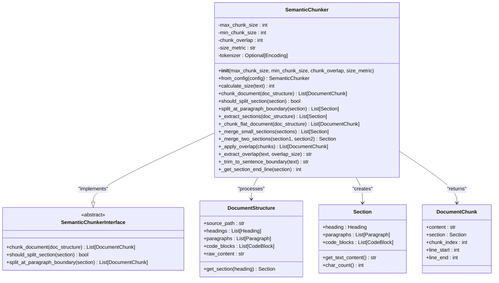
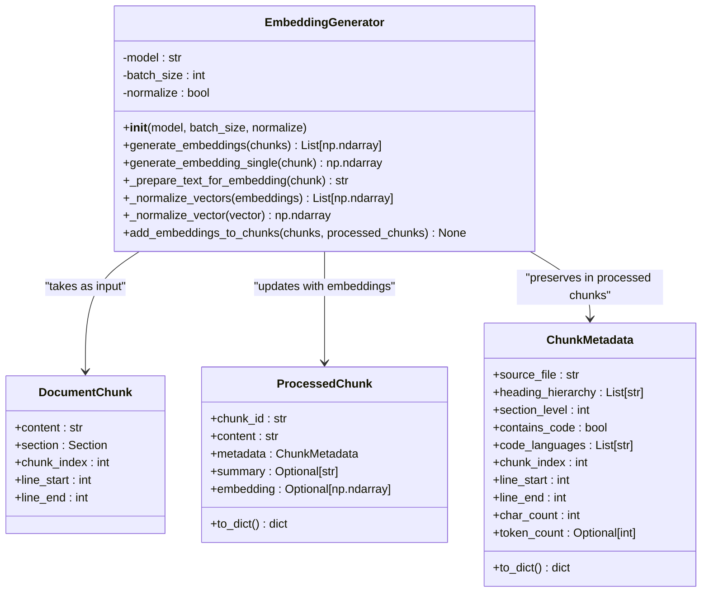
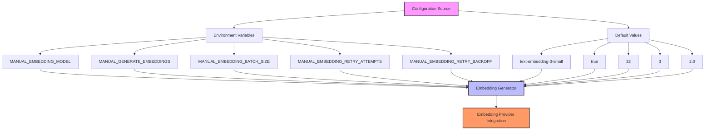
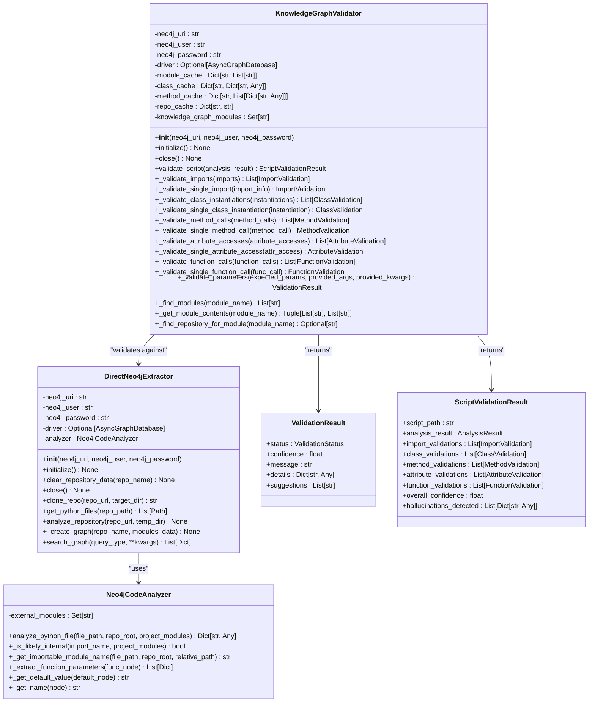
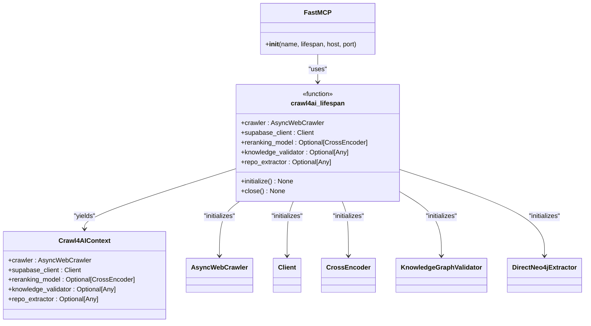

# System Extension Points

<cite>
**Referenced Files in This Document**   
- [interfaces.py](file://src/user_manual_chunker/interfaces.py)
- [pattern_handlers.py](file://src/user_manual_chunker/pattern_handlers.py)
- [semantic_chunker.py](file://src/user_manual_chunker/semantic_chunker.py)
- [embedding_generator.py](file://src/user_manual_chunker/embedding_generator.py)
- [config.py](file://src/user_manual_chunker/config.py)
- [data_models.py](file://src/user_manual_chunker/data_models.py)
- [crawl4ai_mcp.py](file://src/crawl4ai_mcp.py)
- [parse_repo_into_neo4j.py](file://knowledge_graphs/parse_repo_into_neo4j.py)
- [knowledge_graph_validator.py](file://knowledge_graphs/knowledge_graph_validator.py)
</cite>

## Table of Contents
1. [Introduction](#introduction)
2. [Custom Chunking Strategies](#custom-chunking-strategies)
3. [Embedding Provider Integration](#embedding-provider-integration)
4. [Knowledge Graph Analyzer Extensions](#knowledge-graph-analyzer-extensions)
5. [Configuration and Dependency Injection](#configuration-and-dependency-injection)
6. [Backward Compatibility and Performance](#backward-compatibility-and-performance)

## Introduction
This document details the extension points available in the system, focusing on three primary areas: custom chunking strategies, embedding provider integration, and knowledge graph analyzer extensions. The system is designed with a plugin architecture that allows developers to extend functionality through well-defined interfaces and configuration mechanisms. Extension points are implemented using abstract base classes, dependency injection through the crawl4ai_lifespan system, and environment variable configuration. This documentation provides implementation guidance, interface requirements, and best practices for creating custom extensions that maintain system integrity and performance.

## Custom Chunking Strategies

The system provides extensibility for document chunking through the user_manual_chunker module. Custom chunking strategies can be implemented by extending the pattern handlers and semantic chunker components. The architecture separates pattern detection from chunking logic, allowing developers to create specialized handlers for different documentation structures while maintaining a consistent chunking interface.

### Pattern Handlers Implementation
Pattern handlers detect and preserve special documentation structures during the chunking process. The system includes built-in handlers for lists, API documentation, grammar specifications, definition lists, tables, and cross-references. Developers can create new pattern handlers by following the existing pattern handler classes in pattern_handlers.py.

The PatternAwareChunker class coordinates all pattern handlers and makes chunking decisions based on detected patterns. When implementing new pattern handlers, developers should:

1. Create a new handler class that follows the pattern of existing handlers (e.g., ListContextPreserver, APIDocumentationHandler)
2. Implement detection methods using regular expressions or other parsing techniques
3. Provide methods to determine if detected patterns should be kept together based on size constraints
4. Integrate the new handler into the PatternAwareChunker initialization

```mermaid
classDiagram
class PatternAwareChunker {
+list_handler : ListContextPreserver
+api_handler : APIDocumentationHandler
+grammar_handler : GrammarSpecificationHandler
+definition_handler : DefinitionListHandler
+table_handler : TablePreserver
+reference_handler : CrossReferencePreserver
+analyze_content(content, paragraphs, code_blocks) Dict[str, List]
+should_keep_together(line_start, line_end, patterns, max_size) bool
}
class ListContextPreserver {
+UNORDERED_LIST_PATTERN : Regex
+ORDERED_LIST_PATTERN : Regex
+detect_lists(content) List[ListItem]
+should_keep_list_together(list_items, max_size) bool
+extract_parent_context(content, list_start_line) Optional[str]
}
class APIDocumentationHandler {
+FUNCTION_SIGNATURE_PATTERNS : List[Regex]
+detect_api_patterns(paragraphs, code_blocks) List[APIDocPattern]
+should_keep_api_doc_together(api_pattern, max_size) bool
}
class GrammarSpecificationHandler {
+GRAMMAR_RULE_PATTERN : Regex
+detect_grammar_rules(content) List[GrammarRule]
+should_keep_grammar_together(grammar_rule, max_size) bool
}
class DefinitionListHandler {
+MARKDOWN_DEF_PATTERN : Regex
+detect_definition_lists(content) List[DefinitionItem]
+should_keep_definition_together(definition, max_size) bool
}
class TablePreserver {
+MARKDOWN_TABLE_PATTERN : Regex
+detect_tables(content) List[TableStructure]
+should_keep_table_together(table, max_size) bool
}
class CrossReferencePreserver {
+MARKDOWN_LINK_PATTERN : Regex
+HTML_LINK_PATTERN : Regex
+detect_cross_references(content) List[CrossReference]
+preserve_references_in_chunk(chunk_content) str
}
PatternAwareChunker --> ListContextPreserver : "uses"
PatternAwareChunker --> APIDocumentationHandler : "uses"
PatternAwareChunker --> GrammarSpecificationHandler : "uses"
PatternAwareChunker --> DefinitionListHandler : "uses"
PatternAwareChunker --> TablePreserver : "uses"
PatternAwareChunker --> CrossReferencePreserver : "uses"
```

**Diagram sources**
- [pattern_handlers.py](file://src/user_manual_chunker/pattern_handlers.py#L75-L639)

**Section sources**
- [pattern_handlers.py](file://src/user_manual_chunker/pattern_handlers.py#L1-L639)

### Semantic Chunker Extension
The semantic chunking strategy is implemented through the SemanticChunker class, which respects document structure and code boundaries. Custom semantic chunkers can be created by extending the abstract base class defined in interfaces.py. The interface requires implementation of three key methods:

1. chunk_document: Main method that processes a DocumentStructure into chunks
2. should_split_section: Determines if a section exceeds size limits
3. split_at_paragraph_boundary: Splits large sections at paragraph boundaries

When implementing a custom semantic chunker, developers should consider the following requirements:
- Preserve code block integrity by never splitting within code blocks
- Maintain context by including section headings in each split
- Handle flat documents (without headings) by chunking at paragraph boundaries
- Implement overlap between chunks to preserve context at boundaries
- Respect the size_metric configuration (characters or tokens)

**Diagram sources**
- [semantic_chunker.py](file://src/user_manual_chunker/semantic_chunker.py#L15-L572)
- [interfaces.py](file://src/user_manual_chunker/interfaces.py#L63-L103)
- [data_models.py](file://src/user_manual_chunker/data_models.py#L51-L112)

**Section sources**
- [semantic_chunker.py](file://src/user_manual_chunker/semantic_chunker.py#L1-L572)
- [interfaces.py](file://src/user_manual_chunker/interfaces.py#L63-L103)

## Embedding Provider Integration

The system supports integration of new embedding providers through the embedding_generator.py module. The EmbeddingGenerator class provides a standardized interface for generating vector embeddings from document chunks, with support for batch processing, normalization, and error handling. New embedding providers can be integrated by modifying the embedding generator and configuring them through environment variables.

### Embedding Generator Architecture
The EmbeddingGenerator class is responsible for generating embeddings for document chunks. It integrates with existing embedding infrastructure (currently Copilot API) and implements several key features:

1. Batch processing for efficiency
2. Text preparation that preserves code syntax
3. Vector normalization for cosine similarity
4. Error handling with retry mechanisms
5. Configuration through parameters and environment variables

When implementing a new embedding provider, developers should extend the existing EmbeddingGenerator class or create a compatible implementation that adheres to the same interface. The key methods that must be implemented are:

1. generate_embeddings: Generates embeddings for a list of chunks in batches
2. generate_embedding_single: Generates embedding for a single chunk
3. _prepare_text_for_embedding: Prepares chunk text for embedding while preserving code syntax
4. _normalize_vectors: Normalizes embedding vectors for cosine similarity
5. add_embeddings_to_chunks: Generates embeddings and adds them to ProcessedChunk objects

**Diagram sources**
- [embedding_generator.py](file://src/user_manual_chunker/embedding_generator.py#L21-L213)
- [data_models.py](file://src/user_manual_chunker/data_models.py#L118-L155)

**Section sources**
- [embedding_generator.py](file://src/user_manual_chunker/embedding_generator.py#L1-L213)

### Configuration Through Environment Variables
Embedding providers are configured through environment variables that are read by the ChunkerConfig class. The configuration system supports both default values and environment variable overrides, allowing for flexible deployment across different environments.

The following environment variables control embedding configuration:
- MANUAL_EMBEDDING_MODEL: Specifies the embedding model name (default: text-embedding-3-small)
- MANUAL_GENERATE_EMBEDDINGS: Determines whether embeddings are generated (default: true)
- MANUAL_EMBEDDING_BATCH_SIZE: Sets the batch size for embedding generation (default: 32)
- MANUAL_EMBEDDING_RETRY_ATTEMPTS: Number of retry attempts for failed embedding requests (default: 3)
- MANUAL_EMBEDDING_RETRY_BACKOFF: Exponential backoff multiplier for retries (default: 2.0)

When integrating a new embedding provider, developers should:
1. Add support for the new provider in the EmbeddingGenerator class
2. Update the configuration defaults in ChunkerConfig
3. Document the required environment variables
4. Implement error handling specific to the new provider
5. Test with both environment variable configuration and direct parameter passing

**Diagram sources**
- [config.py](file://src/user_manual_chunker/config.py#L14-L116)

**Section sources**
- [config.py](file://src/user_manual_chunker/config.py#L1-L116)

## Knowledge Graph Analyzer Extensions

The system provides extensibility for knowledge graph analyzers through the Neo4j integration in the knowledge_graphs folder. The architecture separates analysis logic from Neo4j operations, allowing developers to build on the existing integration to create specialized analyzers for different codebases and documentation types.

### Neo4j Integration Architecture
The knowledge graph integration is implemented through several key components:

1. DirectNeo4jExtractor: Creates nodes and relationships directly in Neo4j from code repositories
2. KnowledgeGraphValidator: Validates AI-generated code against the knowledge graph
3. Neo4jCodeAnalyzer: Analyzes code for direct Neo4j insertion
4. Query tools: Interactive tools for exploring the knowledge graph

When extending the knowledge graph analyzers, developers should follow the existing pattern of separating analysis logic from Neo4j operations. The DirectNeo4jExtractor class provides a template for creating new extractors, with methods for:

1. Initializing the Neo4j connection
2. Clearing existing data for a repository
3. Cloning repositories
4. Analyzing files and collecting data
5. Creating nodes and relationships in Neo4j
6. Closing the connection

**Diagram sources**
- [parse_repo_into_neo4j.py](file://knowledge_graphs/parse_repo_into_neo4j.py#L36-L858)
- [knowledge_graph_validator.py](file://knowledge_graphs/knowledge_graph_validator.py#L100-L800)

**Section sources**
- [parse_repo_into_neo4j.py](file://knowledge_graphs/parse_repo_into_neo4j.py#L1-L858)
- [knowledge_graph_validator.py](file://knowledge_graphs/knowledge_graph_validator.py#L1-L800)

### Extension Guidelines
When extending the knowledge graph analyzers, developers should:

1. Create new analyzer classes that follow the pattern of Neo4jCodeAnalyzer
2. Implement language-specific analysis methods for new programming languages
3. Extend the DirectNeo4jExtractor to handle new repository types
4. Update the KnowledgeGraphValidator to support new validation rules
5. Use the existing query tools as a template for new exploration interfaces

The system is designed to support multiple knowledge graphs and analyzers, with the crawl4ai_lifespan dependency injection system managing the lifecycle of these components. When creating new analyzers, developers should ensure compatibility with the existing dependency injection system and follow the same initialization and cleanup patterns.

## Configuration and Dependency Injection

The system uses a comprehensive configuration and dependency injection system centered around the crawl4ai_lifespan function. This system manages the lifecycle of key components, including the crawler, Supabase client, reranking model, knowledge graph validator, and repository extractor. Configuration is handled through environment variables with sensible defaults, allowing for flexible deployment across different environments.

### Configuration Management
Configuration is managed through the ChunkerConfig class, which provides centralized configuration with environment variable support and sensible defaults. The configuration system supports:

1. Chunking parameters (max_chunk_size, min_chunk_size, chunk_overlap, size_metric)
2. Model configuration (embedding_model, summary_model)
3. Processing options (generate_summaries, generate_embeddings)
4. Batch processing settings (embedding_batch_size)
5. Summary configuration (max_summary_length, summary_timeout_seconds)
6. Error handling (embedding_retry_attempts, embedding_retry_backoff)

The configuration system uses environment variables with the MANUAL_ prefix to allow for easy override of defaults. This approach enables environment-specific configuration without code changes, supporting development, testing, and production deployments with different settings.

```mermaid
flowchart TD
A["Configuration Sources"] --> B["Environment Variables"]
A --> C["Default Values"]
B --> D["MANUAL_MAX_CHUNK_SIZE"]
B --> E["MANUAL_MIN_CHUNK_SIZE"]
B --> F["MANUAL_CHUNK_OVERLAP"]
B --> G["MANUAL_SIZE_METRIC"]
B --> H["MANUAL_EMBEDDING_MODEL"]
B --> I["MANUAL_SUMMARY_MODEL"]
B --> J["MANUAL_GENERATE_SUMMARIES"]
B --> K["MANUAL_GENERATE_EMBEDDINGS"]
B --> L["MANUAL_EMBEDDING_BATCH_SIZE"]
B --> M["MANUAL_MAX_SUMMARY_LENGTH"]
B --> N["MANUAL_SUMMARY_TIMEOUT_SECONDS"]
B --> O["MANUAL_EMBEDDING_RETRY_ATTEMPTS"]
B --> P["MANUAL_EMBEDDING_RETRY_BACKOFF"]
C --> Q["1000"]
C --> R["100"]
C --> S["50"]
C --> T["characters"]
C --> U["text-embedding-3-small"]
C --> V["iflow/qwen3-coder-plus"]
C --> W["true"]
C --> X["true"]
C --> Y["32"]
C --> Z["150"]
C --> AA["30"]
C --> AB["3"]
C --> AC["2.0"]
D --> AD["ChunkerConfig"]
E --> AD
F --> AD
G --> AD
H --> AD
I --> AD
J --> AD
K --> AD
L --> AD
M --> AD
N --> AD
O --> AD
P --> AD
Q --> AD
R --> AD
S --> AD
T --> AD
U --> AD
V --> AD
W --> AD
X --> AD
Y --> AD
Z --> AD
AA --> AD
AB --> AD
AC --> AD
AD --> AE["System Components"]
style A fill:#f9f,stroke:#333,stroke-width:2px
style AD fill:#bbf,stroke:#333,stroke-width:2px
style AE fill:#f96,stroke:#333,stroke-width:2px
```

**Diagram sources**
- [config.py](file://src/user_manual_chunker/config.py#L14-L116)

**Section sources**
- [config.py](file://src/user_manual_chunker/config.py#L1-L116)

### Dependency Injection System
The crawl4ai_lifespan function manages the lifecycle of system components through dependency injection. This async context manager initializes components at startup and cleans them up at shutdown, ensuring proper resource management. The system components managed by the dependency injection system include:

1. AsyncWebCrawler: For web crawling operations
2. Supabase client: For database operations
3. Reranking model: For search result reranking
4. Knowledge graph validator: For AI hallucination detection
5. Repository extractor: For code repository parsing

When extending the system, developers should integrate new components through the crawl4ai_lifespan function, ensuring proper initialization and cleanup. The dependency injection system follows the principle of single responsibility, with each component having a well-defined interface and lifecycle.

**Diagram sources**
- [crawl4ai_mcp.py](file://src/crawl4ai_mcp.py#L120-L293)

**Section sources**
- [crawl4ai_mcp.py](file://src/crawl4ai_mcp.py#L1-L293)

## Backward Compatibility and Performance

When extending the system, developers must consider backward compatibility and performance implications. The system is designed with extensibility in mind, but certain guidelines should be followed to ensure that custom extensions do not break existing functionality or degrade performance.

### Backward Compatibility Considerations
To maintain backward compatibility when creating extensions:

1. Adhere strictly to the defined interfaces in interfaces.py
2. Preserve existing configuration options and defaults
3. Avoid breaking changes to data models in data_models.py
4. Use optional parameters for new functionality
5. Provide migration paths for configuration changes
6. Document any breaking changes clearly

The system uses dataclasses for data models, which provide some protection against breaking changes through the use of default values and field ordering. When extending data models, developers should add new fields at the end and provide default values to maintain compatibility with existing code.

### Performance Implications
Custom extensions can have significant performance implications, particularly in the following areas:

1. Chunking strategy: Complex pattern detection can increase processing time
2. Embedding generation: Network calls to embedding providers can create bottlenecks
3. Knowledge graph operations: Large-scale Neo4j operations can impact performance
4. Memory usage: Large documents and numerous chunks can increase memory consumption

To mitigate performance issues:

1. Optimize pattern detection with efficient regular expressions
2. Implement batching for network operations
3. Use appropriate indexing in Neo4j
4. Monitor memory usage and implement streaming where possible
5. Use asynchronous operations for I/O-bound tasks
6. Implement caching for repeated operations

The system includes several performance-related configuration options that can be tuned for specific use cases:

- max_chunk_size and min_chunk_size: Control the size of document chunks
- chunk_overlap: Controls the amount of overlap between chunks
- embedding_batch_size: Controls the number of embeddings generated in each batch
- size_metric: Determines whether chunking is based on characters or tokens

When creating custom extensions, developers should measure performance impact and provide guidance on optimal configuration settings for different use cases.