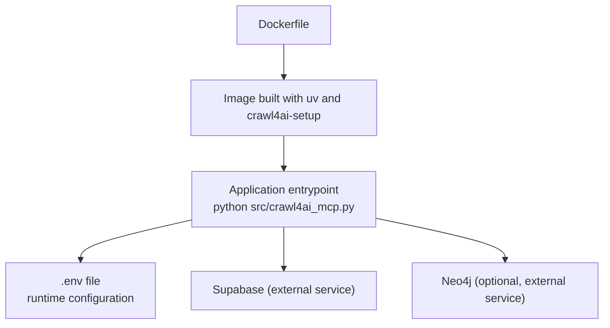
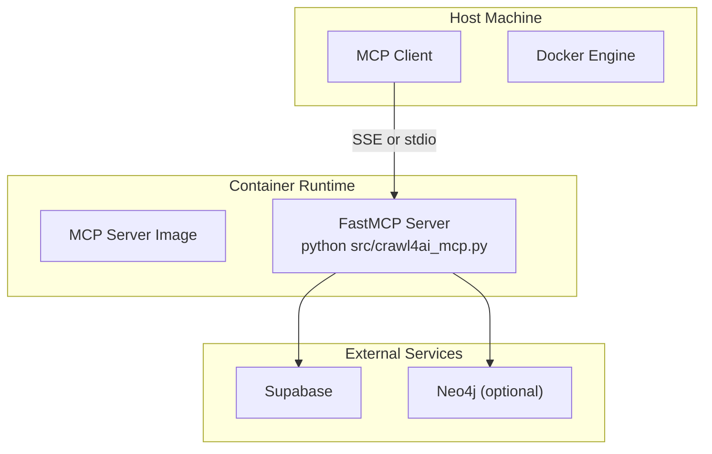
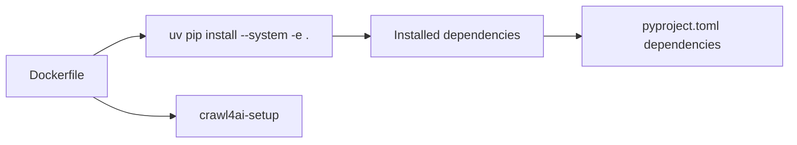

# Docker Deployment

<cite>
**Referenced Files in This Document**
- [Dockerfile](file://Dockerfile)
- [pyproject.toml](file://pyproject.toml)
- [README.md](file://README.md)
- [src/crawl4ai_mcp.py](file://src/crawl4ai_mcp.py)
- [supabase/instruction.sh](file://supabase/instruction.sh)
- [supabase/0001-Add-fixes-from-warp.patch](file://supabase/0001-Add-fixes-from-warp.patch)
- [install_deps_without_sudo.py](file://install_deps_without_sudo.py)
</cite>

## Table of Contents
1. [Introduction](#introduction)
2. [Project Structure](#project-structure)
3. [Core Components](#core-components)
4. [Architecture Overview](#architecture-overview)
5. [Detailed Component Analysis](#detailed-component-analysis)
6. [Dependency Analysis](#dependency-analysis)
7. [Performance Considerations](#performance-considerations)
8. [Troubleshooting Guide](#troubleshooting-guide)
9. [Conclusion](#conclusion)
10. [Appendices](#appendices)

## Introduction
This document provides comprehensive guidance for deploying the MCP server with Crawl4AI and RAG capabilities using Docker. It covers:
- Standalone Docker build and run commands with environment injection, port mapping, and volume mounting
- Docker Compose setup for orchestrating the MCP server with Supabase and optional Neo4j
- Explanation of each instruction in the Dockerfile, including uv dependency management and the crawl4ai-setup command
- Production considerations such as container orchestration, logging, and health checks
- Troubleshooting common startup and dependency issues

## Project Structure
The repository includes a Dockerfile for building the MCP server image and a README with Docker usage instructions. The server loads configuration from a .env file and exposes runtime configuration via environment variables. Optional external services (Supabase and Neo4j) are referenced in the README and Dockerfile.

**Diagram sources**
- [Dockerfile](file://Dockerfile#L1-L22)
- [src/crawl4ai_mcp.py](file://src/crawl4ai_mcp.py#L55-L61)
- [README.md](file://README.md#L205-L243)

**Section sources**
- [Dockerfile](file://Dockerfile#L1-L22)
- [README.md](file://README.md#L411-L423)

## Core Components
- Dockerfile defines the base image, build arguments, dependency installation with uv, and the server command.
- pyproject.toml lists project dependencies and build metadata.
- src/crawl4ai_mcp.py loads environment variables from a .env file and starts the FastMCP server with configurable behavior.
- README.md provides Docker build and run instructions and environment variable configuration.

**Section sources**
- [Dockerfile](file://Dockerfile#L1-L22)
- [pyproject.toml](file://pyproject.toml#L1-L40)
- [src/crawl4ai_mcp.py](file://src/crawl4ai_mcp.py#L55-L61)
- [README.md](file://README.md#L411-L423)

## Architecture Overview
The MCP server runs inside a Docker container and connects to external services (Supabase and optionally Neo4j). The README describes how to run the server via Docker and how to connect clients using SSE or stdio transports.

**Diagram sources**
- [README.md](file://README.md#L411-L423)
- [src/crawl4ai_mcp.py](file://src/crawl4ai_mcp.py#L295-L300)

## Detailed Component Analysis

### Standalone Docker Deployment
- Build the image with a build argument for the server port.
- Run the container with environment variables injected via an env file, port mapping, and optional volume mounts for persistent data or logs.

Build command
- Use the build argument PORT to customize the exposed port at build time.
- Reference: [Docker build instruction](file://README.md#L95-L100)

Run command
- Use an env file to inject runtime configuration.
- Map the published port to the container’s PORT.
- Reference: [Docker run instruction](file://README.md#L411-L416)

Volume mounting examples
- Mount a host directory to persist logs or downloaded artifacts.
- Mount a host directory to share configuration files with the container.
- Reference: [Docker run instruction](file://README.md#L411-L416)

Purpose of Dockerfile instructions
- FROM python:3.12-slim: Establishes the base image.
- ARG PORT=8051: Defines the build argument for the server port.
- WORKDIR /app: Sets the working directory inside the container.
- RUN pip install uv: Installs uv for dependency management.
- COPY . .: Copies project files into the container.
- RUN uv pip install --system -e . && crawl4ai-setup: Installs project dependencies system-wide and runs crawl4ai setup.
- EXPOSE ${PORT}: Exposes the server port.
- CMD ["python", "src/crawl4ai_mcp.py"]: Starts the server entrypoint.

Why uv is used
- uv is used for fast, modern Python dependency management and installation. It replaces pip and venv in this project’s Docker build.

Why crawl4ai-setup is run
- crawl4ai-setup initializes browser dependencies and prepares the local environment for Crawl4AI.

Why CMD is used
- CMD specifies the default command to run the server when the container starts.

**Section sources**
- [Dockerfile](file://Dockerfile#L1-L22)
- [README.md](file://README.md#L95-L100)
- [README.md](file://README.md#L411-L416)

### Docker Compose Deployment
Compose is recommended for orchestrating the MCP server with Supabase and optional Neo4j. The repository includes a script to bootstrap a Supabase Docker Compose stack and a patch that demonstrates health check fixes for proxy-related issues.

Compose example outline
- Define a service for the MCP server image.
- Define environment variables for HOST, PORT, TRANSPORT, and provider credentials.
- Define networks for inter-service communication.
- Optionally define volumes for persistent data.
- Reference: [Supabase instruction script](file://supabase/instruction.sh#L1-L28)

Health checks and proxy considerations
- The patch demonstrates health check command patterns and environment variable adjustments to handle proxy inheritance issues in Docker Compose.
- References:
  - [Proxy fix documentation](file://supabase/0001-Add-fixes-from-warp.patch#L1-L447)
  - [Supabase compose healthcheck pattern](file://supabase/0001-Add-fixes-from-warp.patch#L318-L346)

Network setup
- Use a custom network to allow the MCP server to communicate with Supabase and Neo4j by name.
- Reference: [Supabase instruction script](file://supabase/instruction.sh#L1-L28)

**Section sources**
- [supabase/instruction.sh](file://supabase/instruction.sh#L1-L28)
- [supabase/0001-Add-fixes-from-warp.patch](file://supabase/0001-Add-fixes-from-warp.patch#L1-L447)

### Environment Variables and Configuration
The server loads configuration from a .env file located at the project root. Key variables include HOST, PORT, TRANSPORT, provider credentials, and feature flags.

- Location of .env loading: [Environment loading](file://src/crawl4ai_mcp.py#L55-L61)
- Configuration variables: [Environment variables](file://README.md#L205-L243)

Transport options
- SSE and stdio transports are supported. The README provides client configuration examples for both.

**Section sources**
- [src/crawl4ai_mcp.py](file://src/crawl4ai_mcp.py#L55-L61)
- [README.md](file://README.md#L205-L243)
- [README.md](file://README.md#L533-L593)

### Application Lifecycle and Startup
The server prints a readiness message after initializing components. The README emphasizes waiting for the “Server is ready to accept connections!” message before connecting clients.

- Readiness message and initialization summary: [Startup summary](file://src/crawl4ai_mcp.py#L221-L269)
- Startup timing and tips: [Startup guidance](file://README.md#L425-L482)

**Section sources**
- [src/crawl4ai_mcp.py](file://src/crawl4ai_mcp.py#L221-L269)
- [README.md](file://README.md#L425-L482)

## Dependency Analysis
The Dockerfile installs dependencies using uv and runs crawl4ai-setup. The pyproject.toml lists the project dependencies and build metadata.

**Diagram sources**
- [Dockerfile](file://Dockerfile#L13-L17)
- [pyproject.toml](file://pyproject.toml#L1-L40)

**Section sources**
- [Dockerfile](file://Dockerfile#L13-L17)
- [pyproject.toml](file://pyproject.toml#L1-L40)

## Performance Considerations
- Model downloads and loading can significantly impact startup time. The README outlines model sizes and caching behavior.
- Disable unused features (e.g., knowledge graph, reranking) to reduce startup duration.
- Use SSE transport for more reliable connections during startup.

**Section sources**
- [README.md](file://README.md#L447-L482)

## Troubleshooting Guide
Common startup and dependency issues
- Dependency installation without sudo: Use the provided script to install dependencies and Playwright browsers without requiring sudo.
  - Reference: [Install script](file://install_deps_without_sudo.py#L1-L42)
- Proxy-related health check failures in Docker Compose: The patch demonstrates health check command patterns and environment variable adjustments to resolve proxy inheritance issues.
  - Reference: [Proxy fix documentation](file://supabase/0001-Add-fixes-from-warp.patch#L1-L447)
- Knowledge graph in Docker: The README notes that knowledge graph functionality is not fully compatible with Docker yet and recommends running through uv for full functionality.
  - Reference: [Knowledge graph note](file://README.md#L161-L166)

**Section sources**
- [install_deps_without_sudo.py](file://install_deps_without_sudo.py#L1-L42)
- [supabase/0001-Add-fixes-from-warp.patch](file://supabase/0001-Add-fixes-from-warp.patch#L1-L447)
- [README.md](file://README.md#L161-L166)

## Conclusion
This guide provides practical steps to deploy the MCP server with Crawl4AI and RAG using Docker. It explains the Dockerfile instructions, environment configuration, and production considerations such as orchestration, logging, and health checks. It also highlights common issues and their resolutions, including dependency installation without sudo and proxy-related health check failures in Docker Compose.

## Appendices

### Dockerfile Instruction-by-Instruction
- FROM python:3.12-slim: Base image for the container.
- ARG PORT=8051: Build argument for the server port.
- WORKDIR /app: Working directory inside the container.
- RUN pip install uv: Installs uv for dependency management.
- COPY . .: Copies project files into the container.
- RUN uv pip install --system -e . && crawl4ai-setup: Installs project dependencies system-wide and runs crawl4ai setup.
- EXPOSE ${PORT}: Exposes the server port.
- CMD ["python", "src/crawl4ai_mcp.py"]: Starts the server entrypoint.

**Section sources**
- [Dockerfile](file://Dockerfile#L1-L22)

### Docker Compose Example Outline
- Service: Define the MCP server image, environment variables, and network.
- Networks: Create a custom network for inter-service communication.
- Volumes: Mount directories for persistence and configuration sharing.
- Health checks: Use explicit IPv4 addresses and unset proxy variables in health check commands to avoid proxy inheritance issues.
- References:
  - [Supabase instruction script](file://supabase/instruction.sh#L1-L28)
  - [Proxy fix documentation](file://supabase/0001-Add-fixes-from-warp.patch#L1-L447)

**Section sources**
- [supabase/instruction.sh](file://supabase/instruction.sh#L1-L28)
- [supabase/0001-Add-fixes-from-warp.patch](file://supabase/0001-Add-fixes-from-warp.patch#L1-L447)