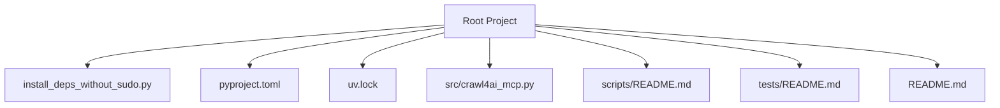
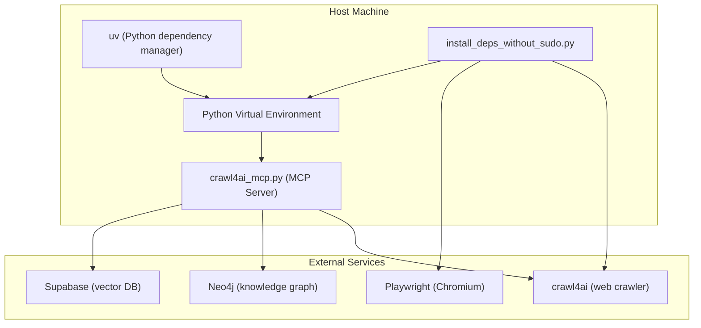
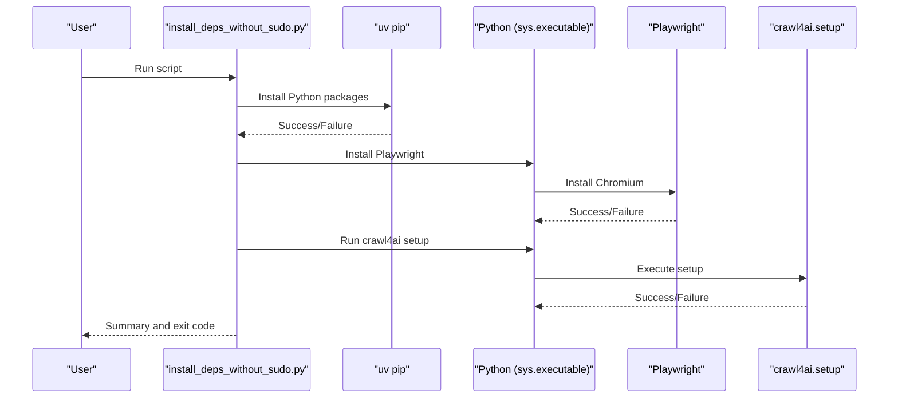
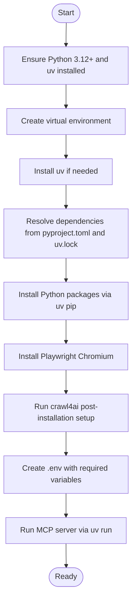
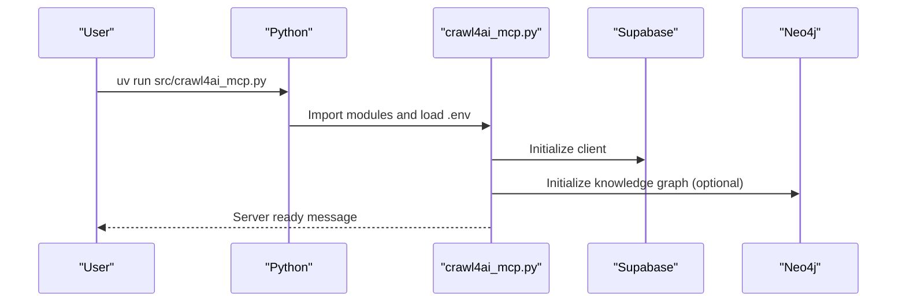
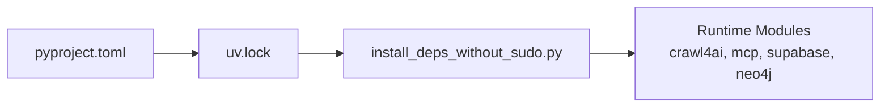

# Native Python Deployment

<cite>
**Referenced Files in This Document**
- [install_deps_without_sudo.py](file://install_deps_without_sudo.py)
- [pyproject.toml](file://pyproject.toml)
- [uv.lock](file://uv.lock)
- [README.md](file://README.md)
- [src/crawl4ai_mcp.py](file://src/crawl4ai_mcp.py)
- [scripts/README.md](file://scripts/README.md)
- [tests/README.md](file://tests/README.md)
</cite>

## Table of Contents
1. [Introduction](#introduction)
2. [Project Structure](#project-structure)
3. [Core Components](#core-components)
4. [Architecture Overview](#architecture-overview)
5. [Detailed Component Analysis](#detailed-component-analysis)
6. [Dependency Analysis](#dependency-analysis)
7. [Performance Considerations](#performance-considerations)
8. [Troubleshooting Guide](#troubleshooting-guide)
9. [Conclusion](#conclusion)

## Introduction
This document explains how to deploy the project natively in Python without Docker. It focuses on:
- Using uv for dependency management and installation
- Installing Python packages directly from pyproject.toml
- Setting up the environment, system-level dependencies, and running the installation script install_deps_without_sudo.py
- Understanding the purpose of each dependency in the installation script (crawl4ai, mcp, supabase, and neo4j)
- Following the three-step installation process: Python package installation, Playwright browser installation, and crawl4ai setup execution
- Handling common issues such as missing system dependencies for Playwright and permission errors during installation
- Addressing platform-specific considerations across operating systems

## Project Structure
The repository organizes deployment-related assets and runtime code as follows:
- Dependency and installation automation: install_deps_without_sudo.py
- Project metadata and dependencies: pyproject.toml and uv.lock
- Runtime server entry point: src/crawl4ai_mcp.py
- Supporting scripts and tests: scripts/README.md and tests/README.md
- Top-level deployment and usage guidance: README.md

**Diagram sources**
- [install_deps_without_sudo.py](file://install_deps_without_sudo.py#L1-L117)
- [pyproject.toml](file://pyproject.toml#L1-L40)
- [uv.lock](file://uv.lock#L1-L200)
- [src/crawl4ai_mcp.py](file://src/crawl4ai_mcp.py#L1-L120)
- [scripts/README.md](file://scripts/README.md#L1-L132)
- [tests/README.md](file://tests/README.md#L1-L212)
- [README.md](file://README.md#L1-L160)

**Section sources**
- [install_deps_without_sudo.py](file://install_deps_without_sudo.py#L1-L117)
- [pyproject.toml](file://pyproject.toml#L1-L40)
- [uv.lock](file://uv.lock#L1-L200)
- [README.md](file://README.md#L1-L160)

## Core Components
- install_deps_without_sudo.py: Orchestrates a three-step installation without requiring sudo privileges:
  - Step 1: Install Python packages using uv pip
  - Step 2: Install Playwright Chromium browser
  - Step 3: Run crawl4ai post-installation setup
- pyproject.toml: Declares project metadata and dependencies used by uv for installation and development.
- uv.lock: Locks dependency versions for deterministic builds.
- src/crawl4ai_mcp.py: The MCP server entry point that initializes crawlers, databases, and optional knowledge graph components.
- scripts/README.md and tests/README.md: Provide guidance for model downloads, testing, and environment configuration.

**Section sources**
- [install_deps_without_sudo.py](file://install_deps_without_sudo.py#L1-L117)
- [pyproject.toml](file://pyproject.toml#L1-L40)
- [uv.lock](file://uv.lock#L1-L200)
- [src/crawl4ai_mcp.py](file://src/crawl4ai_mcp.py#L1-L120)
- [scripts/README.md](file://scripts/README.md#L1-L132)
- [tests/README.md](file://tests/README.md#L1-L212)

## Architecture Overview
The native deployment architecture centers on uv managing Python dependencies, Playwright providing headless Chromium for crawling, and crawl4ai performing web scraping and content processing. The MCP server integrates with Supabase for vector storage and optionally Neo4j for knowledge graph features.

**Diagram sources**
- [install_deps_without_sudo.py](file://install_deps_without_sudo.py#L1-L117)
- [src/crawl4ai_mcp.py](file://src/crawl4ai_mcp.py#L1-L120)
- [README.md](file://README.md#L1-L160)

## Detailed Component Analysis

### install_deps_without_sudo.py: Three-Step Installation
This script automates installation without sudo:
- Step 1: Python package installation using uv pip
- Step 2: Playwright browser installation (Chromium) via uv’s Python module invocation
- Step 3: crawl4ai post-installation setup via uv’s Python module invocation

**Diagram sources**
- [install_deps_without_sudo.py](file://install_deps_without_sudo.py#L1-L117)

**Section sources**
- [install_deps_without_sudo.py](file://install_deps_without_sudo.py#L1-L117)

### Purpose of Dependencies in the Installation Script
- crawl4ai: Web crawling and content processing engine; requires setup to initialize caches and browser dependencies.
- mcp: Model Context Protocol server framework used by the MCP server entry point.
- supabase: Vector database client for storing and retrieving embeddings.
- neo4j: Optional knowledge graph client for hallucination detection and repository analysis.

These dependencies are declared in pyproject.toml and installed via uv in the first step of the script.

**Section sources**
- [install_deps_without_sudo.py](file://install_deps_without_sudo.py#L1-L117)
- [pyproject.toml](file://pyproject.toml#L1-L40)

### Dependency Management with uv and pip
- uv is used to manage Python environments and install dependencies.
- The project declares dependencies in pyproject.toml and resolves versions via uv.lock.
- The installation script uses uv pip to install packages without sudo.
- The MCP server entry point imports crawl4ai, mcp, supabase, and neo4j modules.

**Diagram sources**
- [install_deps_without_sudo.py](file://install_deps_without_sudo.py#L1-L117)
- [pyproject.toml](file://pyproject.toml#L1-L40)
- [uv.lock](file://uv.lock#L1-L200)
- [README.md](file://README.md#L100-L160)

**Section sources**
- [install_deps_without_sudo.py](file://install_deps_without_sudo.py#L1-L117)
- [pyproject.toml](file://pyproject.toml#L1-L40)
- [uv.lock](file://uv.lock#L1-L200)
- [README.md](file://README.md#L100-L160)

### Running the MCP Server
- The MCP server entry point is src/crawl4ai_mcp.py.
- The server initializes crawlers, Supabase client, optional reranking model, and optional Neo4j components.
- The README describes how to run the server using uv run.

**Diagram sources**
- [src/crawl4ai_mcp.py](file://src/crawl4ai_mcp.py#L1-L120)
- [README.md](file://README.md#L410-L480)

**Section sources**
- [src/crawl4ai_mcp.py](file://src/crawl4ai_mcp.py#L1-L120)
- [README.md](file://README.md#L410-L480)

## Dependency Analysis
- Python version requirement: Python 3.12+ as declared in pyproject.toml.
- Core runtime dependencies include crawl4ai, mcp, supabase, openai, dotenv, sentence-transformers, neo4j, httpx, aiofiles, pytest, pytest-asyncio, protobuf, litellm.
- The installation script explicitly lists the packages to install via uv pip.
- uv.lock ensures reproducible dependency resolution across environments.

**Diagram sources**
- [pyproject.toml](file://pyproject.toml#L1-L40)
- [uv.lock](file://uv.lock#L1-L200)
- [install_deps_without_sudo.py](file://install_deps_without_sudo.py#L1-L117)

**Section sources**
- [pyproject.toml](file://pyproject.toml#L1-L40)
- [uv.lock](file://uv.lock#L1-L200)
- [install_deps_without_sudo.py](file://install_deps_without_sudo.py#L1-L117)

## Performance Considerations
- Model downloads and loading: The MCP server may download and load large models (e.g., Qwen embedding and reranker models). These are cached locally after first download.
- Startup time: Expect 30 seconds to several minutes for full initialization, depending on enabled features and model availability.
- Recommendations:
  - Disable unused features (e.g., knowledge graph, reranking) to reduce startup time.
  - Use SSE transport for better connection reliability during startup.
  - Ensure adequate RAM for model loading.

[No sources needed since this section provides general guidance]

## Troubleshooting Guide

### Missing System Dependencies for Playwright
- Symptom: Errors indicating missing system libraries (e.g., shared object file not found).
- Cause: The installation script installs Playwright and Chromium but does not install system-level dependencies that require sudo.
- Resolution:
  - Request your system administrator to install Playwright system dependencies:
    - sudo .venv/bin/python -m playwright install-deps chromium
  - Alternatively, use Docker for a fully isolated environment without host-level dependencies.

**Section sources**
- [install_deps_without_sudo.py](file://install_deps_without_sudo.py#L38-L75)
- [README.md](file://README.md#L674-L710)

### Permission Errors During Installation
- Symptom: Failures when trying to install system-level packages or dependencies.
- Cause: Restricted environments without sudo access.
- Resolution:
  - Use the provided installation script to install Python packages and browsers without sudo.
  - If browser-related issues persist, ask your administrator to install system dependencies as described above.

**Section sources**
- [install_deps_without_sudo.py](file://install_deps_without_sudo.py#L1-L117)
- [README.md](file://README.md#L674-L710)

### Platform-Specific Considerations
- macOS:
  - Ensure Xcode command-line tools are installed if compiling certain packages.
  - Homebrew can help install missing system dependencies if needed.
- Linux:
  - Install Playwright system dependencies using your distribution’s package manager if you encounter missing libraries.
  - Ensure Python 3.12+ is available and uv is installed.
- Windows:
  - Use a recent Windows version with Python 3.12+.
  - If Playwright fails, install the required Visual C++ runtime libraries and run the system dependency installer as described above.

**Section sources**
- [install_deps_without_sudo.py](file://install_deps_without_sudo.py#L38-L75)
- [README.md](file://README.md#L674-L710)

### Environment Variables and Configuration
- Create a .env file with required variables for Supabase, Neo4j, and AI provider settings.
- The MCP server expects environment variables to be loaded at startup.

**Section sources**
- [README.md](file://README.md#L200-L245)
- [src/crawl4ai_mcp.py](file://src/crawl4ai_mcp.py#L55-L65)

### Testing Your Setup
- Use the provided scripts and tests to validate your installation and environment.
- The scripts README describes model downloads and query tools.
- The tests README describes running integration tests and expected outputs.

**Section sources**
- [scripts/README.md](file://scripts/README.md#L1-L132)
- [tests/README.md](file://tests/README.md#L1-L212)

## Conclusion
Deploying this project natively in Python relies on uv for deterministic dependency management, a three-step installation script to handle Python packages, Playwright, and crawl4ai setup, and proper environment configuration. By following the steps outlined above and addressing common issues such as missing system dependencies and permission restrictions, you can successfully run the MCP server locally without Docker. For production or restricted environments, consider using Docker to avoid host-level dependency challenges.