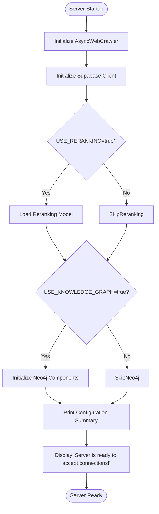
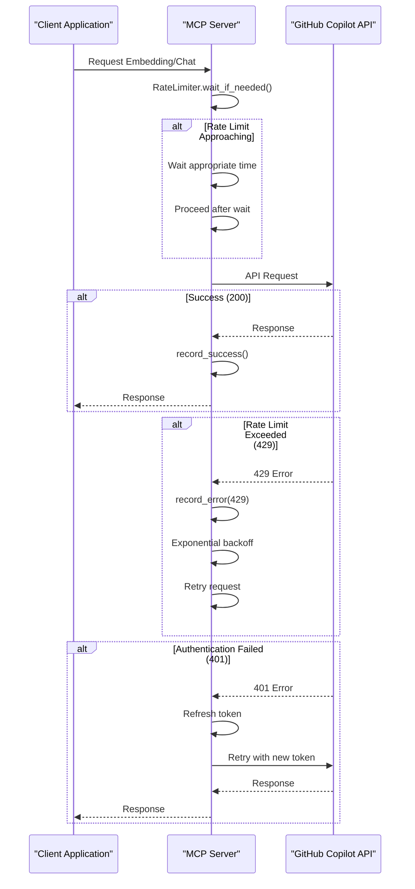
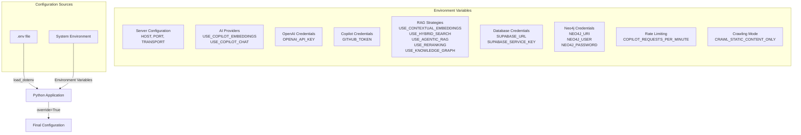
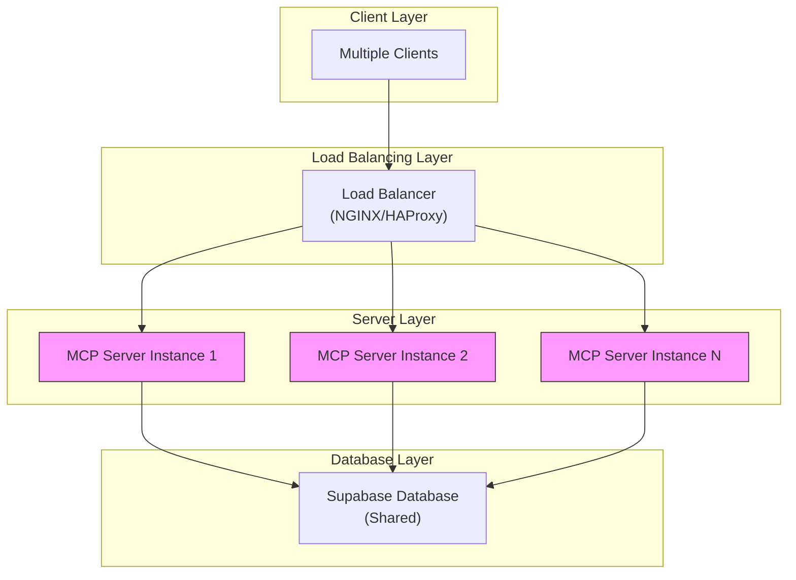
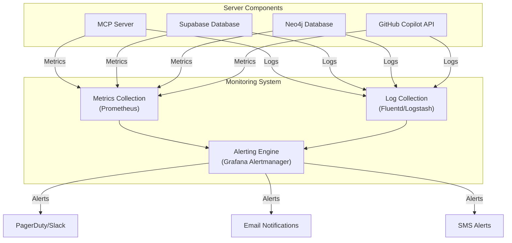
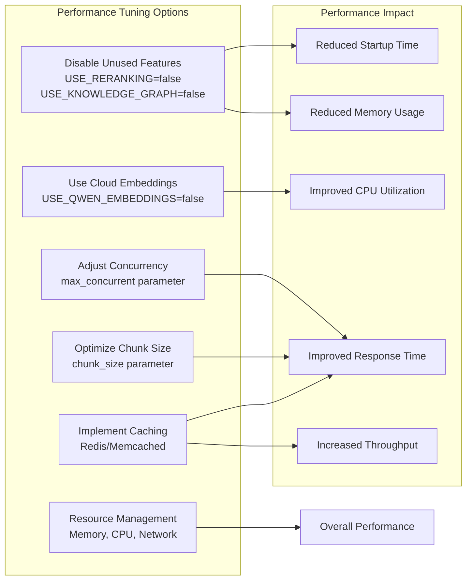
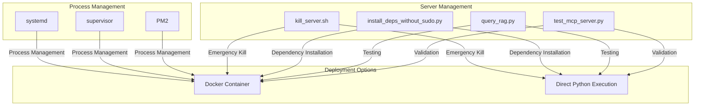
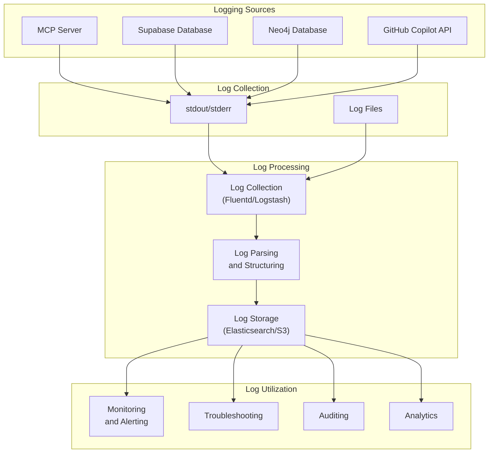
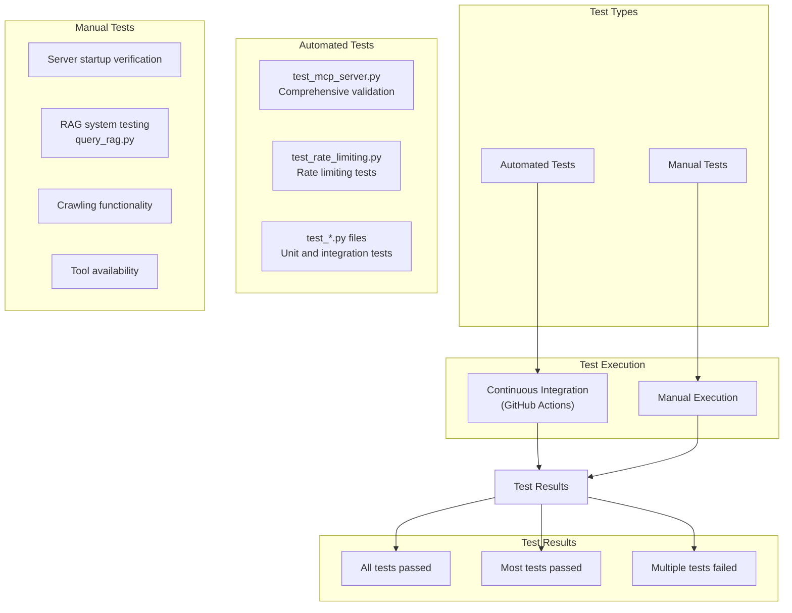

# Production Configuration

<cite>
**Referenced Files in This Document**   
- [README.md](file://README.md)
- [src/crawl4ai_mcp.py](file://src/crawl4ai_mcp.py)
- [src/copilot_client.py](file://src/copilot_client.py)
- [src/utils.py](file://src/utils.py)
- [tests/test_mcp_server.py](file://tests/test_mcp_server.py)
- [tests/test_rate_limiting.py](file://tests/test_rate_limiting.py)
- [Dockerfile](file://Dockerfile)
- [pyproject.toml](file://pyproject.toml)
- [crawled_pages.sql](file://crawled_pages.sql)
- [scripts/kill_server.sh](file://scripts/kill_server.sh)
- [install_deps_without_sudo.py](file://install_deps_without_sudo.py)
</cite>

## Table of Contents
1. [Introduction](#introduction)
2. [Server Initialization Process](#server-initialization-process)
3. [Rate Limiting Configuration](#rate-limiting-configuration)
4. [Environment Variable Management](#environment-variable-management)
5. [Connection Pooling and Database Configuration](#connection-pooling-and-database-configuration)
6. [Scalability Considerations](#scalability-considerations)
7. [Monitoring and Alerting](#monitoring-and-alerting)
8. [Performance Tuning for High-Traffic Scenarios](#performance-tuning-for-high-traffic-scenarios)
9. [Process Monitoring and Server Management](#process-monitoring-and-server-management)
10. [Logging Strategies](#logging-strategies)
11. [Validation and Testing Procedures](#validation-and-testing-procedures)
12. [Conclusion](#conclusion)

## Introduction
This document provides comprehensive guidance for configuring the Crawl4AI RAG MCP server for production deployment. The server enables AI agents and coding assistants to perform web crawling and retrieval-augmented generation (RAG) operations with advanced features including contextual embeddings, hybrid search, agentic RAG, reranking, and knowledge graph integration for AI hallucination detection. The configuration covers critical aspects such as process monitoring, logging strategies, performance tuning for high-traffic scenarios, rate limiting, server initialization, environment variable management, secure credential storage, connection pooling, scalability considerations, and monitoring for critical failures.

**Section sources**
- [README.md](file://README.md#L1-L773)

## Server Initialization Process
The server initialization process is critical for ensuring stable operation in production environments. The server requires a significant initialization period due to multiple components that must be loaded and verified before the server becomes operational.

The initialization sequence begins with the creation of the browser configuration and crawler instance, followed by the establishment of the Supabase client connection. If enabled, the server initializes the reranking model, which may involve downloading and loading large models (1.2GB for Qwen3-Embedding-0.6B and Qwen3-Reranker-0.6B). When the knowledge graph functionality is enabled, the server establishes connections to Neo4j and initializes the knowledge graph validator and repository extractor components.

The server initialization completes only after all components have been successfully initialized, at which point the server displays the "Server is ready to accept connections!" message. This message is crucial as it indicates that the server has completed all startup procedures and is prepared to handle client requests. Attempting to connect clients before this message appears may result in connection failures or unstable behavior.

The initialization time varies significantly based on configuration, ranging from 30 seconds to over 2 minutes. Factors affecting initialization time include model downloads (first-time initialization), model loading into memory, database connection verification, and external service validation (GitHub Copilot token validation and rate limit setup). Subsequent startups are faster once models are cached locally.



**Diagram sources**
- [src/crawl4ai_mcp.py](file://src/crawl4ai_mcp.py#L140-L268)

**Section sources**
- [README.md](file://README.md#L425-L482)
- [src/crawl4ai_mcp.py](file://src/crawl4ai_mcp.py#L140-L268)

## Rate Limiting Configuration
The server implements comprehensive rate limiting for GitHub Copilot integration through the `COPILOT_REQUESTS_PER_MINUTE` environment variable. This configuration is critical for preventing API abuse and ensuring stable operation in production environments.

The rate limiting system is implemented in the `RateLimiter` class within `copilot_client.py`, which provides automatic rate limiting, burst protection, exponential backoff on errors, and token refresh capabilities. The `COPILOT_REQUESTS_PER_MINUTE` environment variable configures the maximum number of requests allowed per minute, with a default value of 60. This value can be adjusted based on usage patterns and subscription limits.

The rate limiting system includes several key features:
- **Automatic rate limiting**: Configurable via `COPILOT_REQUESTS_PER_MINUTE`
- **Burst protection**: Maximum of 10 requests per 10 seconds
- **Smart throttling**: Automatically waits when limits are approached
- **Exponential backoff**: On 429 rate limit and 5xx server errors
- **Token refresh**: Automatic refresh on 401 authentication errors
- **Retry logic**: Smart retry with rate limiting for failed requests
- **Max backoff**: 30 seconds maximum wait time

The system validates the rate limiting configuration through the `test_rate_limiting_config` function in `test_mcp_server.py`, which checks that the `COPILOT_REQUESTS_PER_MINUTE` value is an integer between 1 and 1000. Values outside this range are considered invalid and may cause operational issues.



**Diagram sources**
- [src/copilot_client.py](file://src/copilot_client.py#L19-L88)
- [tests/test_mcp_server.py](file://tests/test_mcp_server.py#L196-L212)

**Section sources**
- [README.md](file://README.md#L297-L316)
- [src/copilot_client.py](file://src/copilot_client.py#L19-L88)
- [tests/test_mcp_server.py](file://tests/test_mcp_server.py#L196-L212)

## Environment Variable Management
Proper environment variable management is essential for secure and reliable production deployment. The server uses a comprehensive set of environment variables to configure its behavior, which are loaded from the `.env` file using the `python-dotenv` package.

The primary configuration variables include:
- **Server Configuration**: `HOST`, `PORT`, `TRANSPORT`
- **AI Provider Configuration**: `USE_COPILOT_EMBEDDINGS`, `USE_COPILOT_CHAT`
- **OpenAI Configuration**: `OPENAI_API_KEY`
- **GitHub Copilot Configuration**: `GITHUB_TOKEN`
- **LLM Configuration**: `MODEL_CHOICE`
- **RAG Strategies**: `USE_CONTEXTUAL_EMBEDDINGS`, `USE_HYBRID_SEARCH`, `USE_AGENTIC_RAG`, `USE_RERANKING`, `USE_KNOWLEDGE_GRAPH`
- **Supabase Configuration**: `SUPABASE_URL`, `SUPABASE_SERVICE_KEY`
- **Neo4j Configuration**: `NEO4J_URI`, `NEO4J_USER`, `NEO4J_PASSWORD`
- **Rate Limiting**: `COPILOT_REQUESTS_PER_MINUTE`
- **Crawling Mode**: `CRAWL_STATIC_CONTENT_ONLY`

Secure credential storage is critical for production deployments. API keys and tokens should never be hardcoded in the source code or committed to version control. The `.env` file should be added to `.gitignore` to prevent accidental exposure. For containerized deployments, environment variables should be passed through Docker's `--env-file` option or Kubernetes secrets rather than being embedded in the image.

The server loads environment variables with the `override=True` parameter in `load_dotenv()`, ensuring that environment variables set in the system take precedence over those in the `.env` file. This allows for flexible configuration across different environments (development, staging, production) without modifying the `.env` file.



**Diagram sources**
- [README.md](file://README.md#L206-L242)
- [src/crawl4ai_mcp.py](file://src/crawl4ai_mcp.py#L56-L60)

**Section sources**
- [README.md](file://README.md#L206-L242)
- [src/crawl4ai_mcp.py](file://src/crawl4ai_mcp.py#L56-L60)

## Connection Pooling and Database Configuration
The server utilizes Supabase as its vector database for RAG operations, with connection pooling and configuration managed through the Supabase Python client. The database schema is defined in `crawled_pages.sql`, which creates the necessary tables and indexes for efficient retrieval operations.

The database configuration includes three primary tables:
- **sources**: Stores information about crawled sources with a primary key on `source_id`
- **crawled_pages**: Stores documentation chunks with vector embeddings (1536 dimensions) and metadata
- **code_examples**: Stores code examples with summaries and vector embeddings

Connection pooling is handled automatically by the Supabase client, which manages the underlying HTTP connections to the database. The `get_supabase_client()` function in `utils.py` creates a client instance using the `SUPABASE_URL` and `SUPABASE_SERVICE_KEY` environment variables. This client is then used throughout the application for database operations.

The database schema includes several performance optimizations:
- **Vector index**: Created using `ivfflat` on the embedding column with `vector_cosine_ops` for efficient similarity search
- **Metadata index**: GIN index on the metadata JSONB column for fast filtering
- **Source ID index**: B-tree index on the source_id column for source-based filtering
- **Unique constraints**: Prevent duplicate chunks for the same URL
- **Foreign key constraints**: Ensure referential integrity between tables
- **Row Level Security (RLS)**: Policies allow public read access to all tables

The server implements robust error handling for database operations, including retry logic with exponential backoff for failed insertions. When adding documents to Supabase, the server first deletes existing records with the same URLs to prevent duplicates, then inserts the new data in batches with retry logic.

```mermaid
erDiagram
sources {
text source_id PK
text summary
integer total_word_count
timestamp with time zone created_at
timestamp with time zone updated_at
}
crawled_pages {
bigserial id PK
varchar url
integer chunk_number
text content
jsonb metadata
text source_id FK
vector embedding
timestamp with time zone created_at
}
code_examples {
bigserial id PK
varchar url
integer chunk_number
text content
text summary
jsonb metadata
text source_id FK
vector embedding
timestamp with time zone created_at
}
sources ||--o{ crawled_pages : contains
sources ||--o{ code_examples : contains
```

**Diagram sources**
- [crawled_pages.sql](file://crawled_pages.sql#L9-L175)

**Section sources**
- [crawled_pages.sql](file://crawled_pages.sql#L9-L175)
- [src/utils.py](file://src/utils.py#L106-L119)

## Scalability Considerations
The server architecture supports several scalability strategies for handling high-traffic scenarios and CPU-intensive operations like embedding generation.

### Horizontal Scaling
The server can be horizontally scaled by deploying multiple instances behind a load balancer. Each instance operates independently with its own connection to the shared Supabase database. This approach allows for linear scaling of request handling capacity. The stateless nature of the server (aside from the database connection) makes it well-suited for horizontal scaling.

### Load Balancing
Load balancing can be implemented using standard solutions like NGINX, HAProxy, or cloud provider load balancers. The load balancer distributes incoming requests across multiple server instances, improving availability and performance. Health checks should be configured to ensure traffic is only routed to healthy instances.

### Resource Allocation for CPU-Intensive Operations
Embedding generation is a CPU-intensive operation that can benefit from optimized resource allocation. The server supports multiple embedding providers:
- **OpenAI embeddings**: Offloads computation to OpenAI's infrastructure
- **GitHub Copilot embeddings**: Uses Copilot's embedding API
- **Local Qwen embeddings**: Runs locally on the server (Qwen/Qwen3-Embedding-0.6B)

For local embedding models, adequate CPU and memory resources must be allocated. The server is configured to use CPU for model inference, making it suitable for deployment on machines without GPUs. However, for high-throughput scenarios, instances with multiple CPU cores will provide better performance.

The server implements connection pooling through the Supabase client and uses asynchronous operations to maximize resource utilization. The crawler uses parallel processing to efficiently crawl multiple pages simultaneously, with configurable concurrency limits to prevent resource exhaustion.



**Section sources**
- [README.md](file://README.md#L45-L46)
- [src/utils.py](file://src/utils.py#L121-L197)

## Monitoring and Alerting
Effective monitoring and alerting are essential for maintaining server health and quickly identifying critical failures. The server provides several mechanisms for monitoring its status and performance.

### Server Health Monitoring
The server's health can be monitored through several indicators:
- **Process status**: The server process should be running and responsive
- **Initialization completion**: The "Server is ready to accept connections!" message indicates successful startup
- **Component status**: Embedding provider, database connections, and knowledge graph components should be operational
- **Rate limiting**: Monitor rate limit usage to prevent API exhaustion

The `test_mcp_server.py` script provides a comprehensive validation test that checks the server process, configuration, database connections, AI provider configuration, RAG features, available tools, and rate limiting configuration. This script can be used as a health check endpoint or integrated into monitoring systems.

### Alerting for Critical Failures
Critical failures that require immediate attention include:
- **Server process termination**: The server process has stopped unexpectedly
- **Database connection failure**: Unable to connect to Supabase or Neo4j
- **Authentication failure**: GitHub Copilot token validation fails
- **Rate limit exhaustion**: API rate limits are consistently being reached
- **Model loading failure**: Required models cannot be loaded

Alerting can be implemented using standard monitoring tools like Prometheus, Grafana, or cloud provider monitoring services. Custom alerts should be configured for the critical failure scenarios mentioned above. Additionally, log-based alerting can be implemented to detect error patterns in the server logs.

The server's logging strategy (detailed in the next section) provides valuable information for monitoring and troubleshooting. Log entries include timestamps, severity levels, and contextual information that can be used to identify and diagnose issues.



**Section sources**
- [tests/test_mcp_server.py](file://tests/test_mcp_server.py#L36-L272)
- [README.md](file://README.md#L672-L712)

## Performance Tuning for High-Traffic Scenarios
Optimizing server performance is critical for handling high-traffic scenarios and ensuring responsive service. Several configuration options and best practices can improve performance.

### Configuration-Based Performance Optimization
The server provides several configuration options to optimize performance:
- **Disable unused features**: Disabling unused RAG strategies reduces startup time and memory usage
- **Use cloud embeddings**: Using OpenAI or Copilot embeddings instead of local Qwen models reduces CPU load
- **Adjust concurrency settings**: The `max_concurrent` parameter in `smart_crawl_url` can be reduced to prevent memory errors
- **Optimize chunk size**: Adjusting the `chunk_size` parameter can balance retrieval accuracy and performance

The server's performance can be tuned by disabling unused features during startup. For example, setting `USE_RERANKING=false` skips reranker model loading, `USE_KNOWLEDGE_GRAPH=false` skips Neo4j setup, and `USE_QWEN_EMBEDDINGS=false` uses faster cloud embeddings instead of local models.

### Caching Strategies
The server implements several caching mechanisms:
- **Model caching**: Downloaded models are cached locally after the first download
- **Database query caching**: Supabase may cache query results
- **Embedding caching**: Embeddings are stored in the database and reused

For high-traffic scenarios, additional caching layers can be implemented, such as Redis or Memcached, to cache frequently accessed data and reduce database load.

### Resource Management
Effective resource management is essential for maintaining performance under load:
- **Memory management**: Monitor memory usage and adjust concurrency settings if memory errors occur
- **CPU utilization**: Ensure adequate CPU resources for embedding generation and model inference
- **Network bandwidth**: Ensure sufficient bandwidth for crawling operations and API requests

The server's asynchronous architecture maximizes resource utilization by allowing concurrent processing of multiple requests. The use of `asyncio` and asynchronous database operations enables efficient handling of I/O-bound operations.



**Section sources**
- [README.md](file://README.md#L470-L478)
- [src/utils.py](file://src/utils.py#L121-L197)

## Process Monitoring and Server Management
Effective process monitoring and server management are essential for maintaining reliable production operations. The server provides several tools and scripts for managing its lifecycle and monitoring its status.

### Process Management
The server process can be managed using standard process management tools. The `kill_server.sh` script provides an emergency kill mechanism for terminating server processes when standard termination methods fail. This script identifies processes running the `crawl4ai_mcp.py` script and terminates them using `kill -9`.

For production deployments, process managers like systemd, supervisor, or PM2 should be used to ensure the server process is automatically restarted in case of failure. These tools also provide logging, monitoring, and management capabilities.

### Server Management Scripts
The repository includes several scripts for server management:
- **kill_server.sh**: Emergency script to terminate server processes
- **install_deps_without_sudo.py**: Installation script for environments without sudo access
- **query_rag.py**: Script for testing and verifying the RAG system
- **test_mcp_server.py**: Comprehensive validation test for server configuration

The `install_deps_without_sudo.py` script is particularly useful for restricted environments where sudo access is not available. It installs Python dependencies using `uv pip`, installs Playwright browsers, and runs the crawl4ai setup automatically.

### Containerized Deployment
The server can be deployed using Docker, which provides process isolation, dependency management, and consistent deployment across environments. The Dockerfile specifies a Python 3.12-slim base image, installs dependencies using uv, and exposes the configured port. Containerized deployment simplifies process management and ensures consistent behavior across different environments.



**Section sources**
- [scripts/kill_server.sh](file://scripts/kill_server.sh#L1-L25)
- [install_deps_without_sudo.py](file://install_deps_without_sudo.py#L1-L117)
- [Dockerfile](file://Dockerfile#L1-L22)

## Logging Strategies
The server implements a comprehensive logging strategy that provides visibility into its operations and aids in troubleshooting and monitoring.

### Logging Implementation
The server uses Python's built-in `print()` function for logging, which outputs messages to stdout. This approach is suitable for containerized deployments where stdout is captured by the container runtime and can be forwarded to logging systems.

The logging strategy includes several types of log messages:
- **Informational messages**: Status updates and progress indicators
- **Configuration summary**: Display of active configuration at startup
- **Error messages**: Error conditions with descriptive messages
- **Rate limiting actions**: Notifications when rate limits are approached or exceeded
- **Component initialization**: Status of component initialization

The server's startup sequence includes a detailed configuration summary that displays the active configuration, including the embedding provider, chat model provider, reranking model status, crawling mode, RAG features, and database connections. This information is invaluable for verifying the server's configuration and diagnosing issues.

### Log-Based Monitoring
The log output can be used for monitoring and alerting by integrating with log management systems like ELK Stack (Elasticsearch, Logstash, Kibana), Splunk, or cloud provider logging services. These systems can parse log messages, extract structured data, and create dashboards and alerts based on log content.

For example, the "Server is ready to accept connections!" message can be used as a health check indicator, while error messages can trigger alerts. Rate limiting messages can be used to monitor API usage and plan capacity.

### Log Retention and Rotation
In production environments, log retention and rotation policies should be implemented to prevent disk space exhaustion. This can be achieved using log rotation tools like logrotate or through the container runtime's log management capabilities.



**Section sources**
- [src/crawl4ai_mcp.py](file://src/crawl4ai_mcp.py#L222-L268)
- [src/copilot_client.py](file://src/copilot_client.py#L48-L68)

## Validation and Testing Procedures
Comprehensive validation and testing procedures are essential for ensuring the server is correctly configured and functioning properly in production.

### Automated Testing
The repository includes several automated tests:
- **test_mcp_server.py**: Comprehensive validation test that checks server process, configuration, database connections, AI provider configuration, RAG features, available tools, and rate limiting configuration
- **test_rate_limiting.py**: Tests rate limiting functionality, exponential backoff, and burst protection
- **Various test_*.py files**: Test specific components and functionality

The `test_mcp_server.py` script provides a complete validation of the server's configuration and connectivity. It checks that the MCP server process is running, verifies server configuration from environment variables, tests database connection configuration, validates AI provider configuration, tests RAG feature configuration, verifies available tools, and tests rate limiting configuration.

### Manual Testing
Manual testing procedures include:
- **Server startup verification**: Confirming the "Server is ready to accept connections!" message appears
- **RAG system testing**: Using the `query_rag.py` script to test the RAG database
- **Crawling functionality**: Testing crawling operations with different URL types
- **Tool availability**: Verifying all expected tools are available

The `query_rag.py` script provides a command-line interface to test the RAG database and ensure everything is working correctly. It supports basic search, listing available sources, searching with specific filtering, and testing advanced features like hybrid search and reranking.

### Continuous Integration
The `pyproject.toml` file specifies test dependencies and configuration, indicating that the project supports automated testing through pytest. This enables integration with continuous integration systems to automatically run tests on code changes.



**Section sources**
- [tests/test_mcp_server.py](file://tests/test_mcp_server.py#L1-L273)
- [tests/test_rate_limiting.py](file://tests/test_rate_limiting.py#L1-L172)
- [scripts/query_rag.py](file://scripts/query_rag.py)
- [pyproject.toml](file://pyproject.toml#L30-L39)

## Conclusion
This document has provided comprehensive guidance for configuring the Crawl4AI RAG MCP server for production deployment. Key considerations include proper server initialization, rate limiting configuration using the `COPILOT_REQUESTS_PER_MINUTE` environment variable, secure environment variable management, connection pooling and database configuration, scalability considerations for high-traffic scenarios, monitoring and alerting for critical failures, performance tuning, process monitoring, and validation procedures.

The server's architecture supports various deployment models, from direct Python execution to containerized deployment using Docker. Its modular design allows for flexible configuration of RAG strategies and AI providers based on specific use cases and requirements.

For production deployments, it is recommended to:
1. Implement comprehensive monitoring and alerting
2. Use secure credential storage practices
3. Configure appropriate rate limiting based on usage patterns
4. Optimize performance by disabling unused features
5. Implement proper process management and restart policies
6. Regularly validate server configuration and functionality
7. Monitor resource utilization and scale horizontally as needed

By following these guidelines, organizations can deploy the Crawl4AI RAG MCP server in a reliable, secure, and scalable manner that meets the demands of high-traffic production environments.

[No sources needed since this section summarizes without analyzing specific source files]