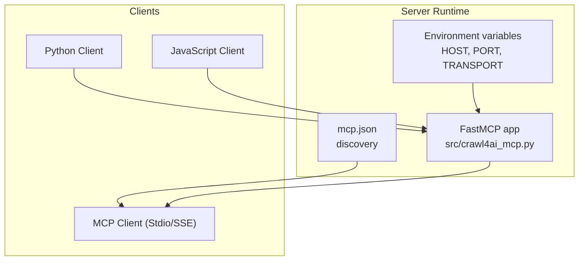
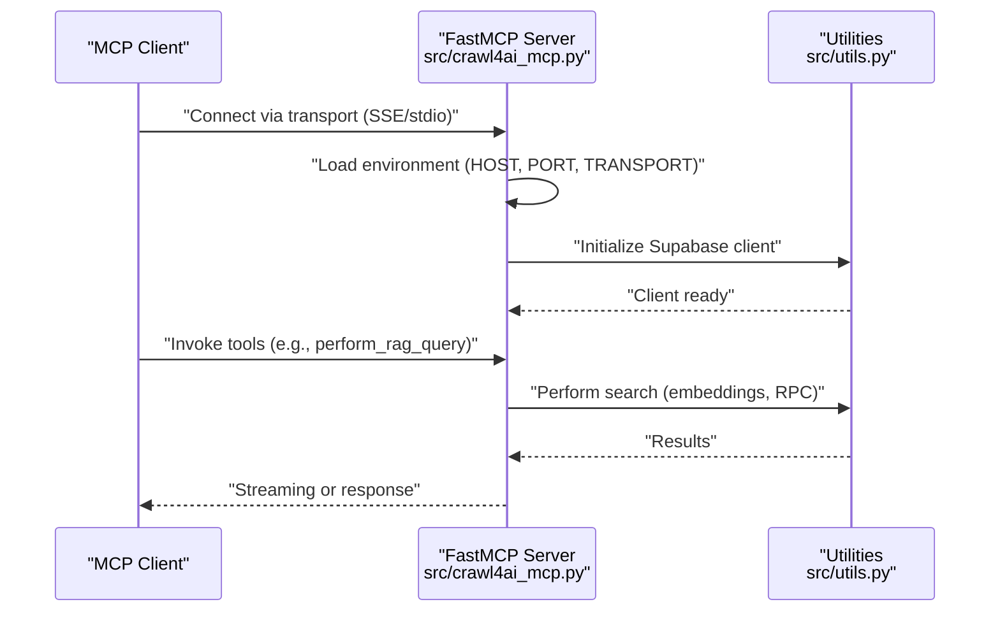
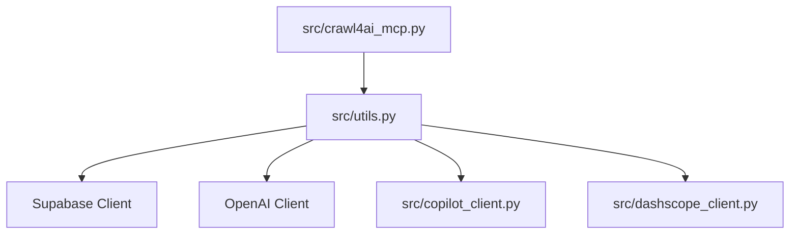

# Client Configuration Examples

<cite>
**Referenced Files in This Document**
- [mcp.json](file://mcp.json)
- [README.md](file://README.md)
- [Dockerfile](file://Dockerfile)
- [pyproject.toml](file://pyproject.toml)
- [src/crawl4ai_mcp.py](file://src/crawl4ai_mcp.py)
- [src/utils.py](file://src/utils.py)
- [src/copilot_client.py](file://src/copilot_client.py)
- [src/dashscope_client.py](file://src/dashscope_client.py)
- [scripts/query_rag.py](file://scripts/query_rag.py)
</cite>

## Table of Contents
1. [Introduction](#introduction)
2. [Project Structure](#project-structure)
3. [Core Components](#core-components)
4. [Architecture Overview](#architecture-overview)
5. [Detailed Component Analysis](#detailed-component-analysis)
6. [Dependency Analysis](#dependency-analysis)
7. [Performance Considerations](#performance-considerations)
8. [Troubleshooting Guide](#troubleshooting-guide)
9. [Conclusion](#conclusion)
10. [Appendices](#appendices)

## Introduction
This document provides practical, code-level guidance for configuring popular MCP clients and AI frameworks to integrate with the server. It focuses on:
- Registering the server as a tool provider using the mcp.json discovery mechanism
- Auto-discovering the server endpoint and transport method from mcp.json
- Configuring clients for local development, Docker containers, and cloud deployments
- Handling streaming responses, timeouts, and propagating authentication tokens
- Demonstrating Python-based client usage for RAG queries

The examples reference concrete files in the repository to ensure accuracy and reproducibility.

## Project Structure
The repository exposes an MCP server that listens on a configurable host/port and transport. The server’s transport and endpoint are defined in the environment and can be discovered via mcp.json. The server is packaged and run via Docker or Python.

**Diagram sources**
- [src/crawl4ai_mcp.py](file://src/crawl4ai_mcp.py#L295-L300)
- [mcp.json](file://mcp.json#L1-L9)

**Section sources**
- [mcp.json](file://mcp.json#L1-L9)
- [README.md](file://README.md#L533-L592)
- [Dockerfile](file://Dockerfile#L1-L22)
- [src/crawl4ai_mcp.py](file://src/crawl4ai_mcp.py#L295-L300)

## Core Components
- Server transport and endpoint:
  - Host/port are read from environment variables and passed to the FastMCP server instance.
  - Transport is selected via environment variable and toggles SSE or stdio.
- Discovery file:
  - mcp.json defines the server transport and URL for clients to auto-register.
- Utilities:
  - Environment-driven embedding and chat providers, Supabase client, and RAG helpers.
- Client examples:
  - Python RAG query script demonstrates how to search and display results.
  - Copilot and DashScope clients show how to propagate tokens and manage timeouts.

**Section sources**
- [src/crawl4ai_mcp.py](file://src/crawl4ai_mcp.py#L295-L300)
- [src/utils.py](file://src/utils.py#L106-L119)
- [src/copilot_client.py](file://src/copilot_client.py#L108-L181)
- [src/dashscope_client.py](file://src/dashscope_client.py#L10-L20)
- [scripts/query_rag.py](file://scripts/query_rag.py#L1-L60)

## Architecture Overview
The server exposes an MCP interface with tools for crawling and RAG. Clients can connect via SSE or stdio. The discovery file simplifies client configuration.

**Diagram sources**
- [src/crawl4ai_mcp.py](file://src/crawl4ai_mcp.py#L295-L300)
- [src/utils.py](file://src/utils.py#L549-L587)

## Detailed Component Analysis

### Auto-Discovery via mcp.json
- mcp.json declares the server identity, transport, and URL.
- Clients can read this file to auto-register the server without hardcoding endpoints.
- Notes for specific clients:
  - Windsurf uses serverUrl instead of url.
  - Docker users should use host.docker.internal for URLs when the client is in a different container.

**Section sources**
- [mcp.json](file://mcp.json#L1-L9)
- [README.md](file://README.md#L533-L568)

### SSE Transport Configuration
- The server reads TRANSPORT from environment and runs SSE when set to sse.
- The discovery URL points to /sse.
- For Docker, clients should target host.docker.internal to reach the host-bound server.

**Section sources**
- [src/crawl4ai_mcp.py](file://src/crawl4ai_mcp.py#L2280-L2289)
- [README.md](file://README.md#L533-L568)

### Stdio Transport Configuration
- Stdio transport is supported and can be configured via environment variables.
- The discovery file can also define a command-based server entry for clients that spawn the server process.

**Section sources**
- [src/crawl4ai_mcp.py](file://src/crawl4ai_mcp.py#L2280-L2289)
- [README.md](file://README.md#L569-L624)

### Python Client Implementation for RAG Queries
The scripts/query_rag.py demonstrates:
- Building a Supabase client from environment variables
- Performing vector search with optional hybrid and reranking
- Filtering by source type and combining multi-source results
- Displaying results with similarity scores and metadata

Key behaviors:
- Environment-driven embedding provider selection
- Optional hybrid search combining vector and keyword results
- Optional reranking using cross-encoder models
- Multi-source aggregation and sorting

**Section sources**
- [scripts/query_rag.py](file://scripts/query_rag.py#L1-L120)
- [scripts/query_rag.py](file://scripts/query_rag.py#L121-L210)
- [scripts/query_rag.py](file://scripts/query_rag.py#L211-L348)
- [src/utils.py](file://src/utils.py#L106-L119)
- [src/utils.py](file://src/utils.py#L121-L197)
- [src/utils.py](file://src/utils.py#L430-L470)

### Streaming Responses and Timeouts
- SSE streaming is used by the server for transport.
- Client libraries commonly rely on HTTPX and SSE support for streaming.
- Timeouts:
  - Copilot client sets explicit timeouts for embeddings and chat completion.
  - DashScope client sets a request timeout for chat completion.
- Propagating authentication tokens:
  - Copilot client constructs Authorization headers with bearer tokens.
  - DashScope client adds Authorization headers with Bearer tokens.

Best practices:
- Configure client timeouts to exceed server-side processing time.
- Implement retries with exponential backoff for transient failures.
- Respect rate limits and backoff policies.

**Section sources**
- [src/copilot_client.py](file://src/copilot_client.py#L183-L245)
- [src/copilot_client.py](file://src/copilot_client.py#L314-L385)
- [src/dashscope_client.py](file://src/dashscope_client.py#L10-L20)
- [src/dashscope_client.py](file://src/dashscope_client.py#L55-L86)

### Environment and Transport Configuration
- Host/port are read from environment variables and passed to the FastMCP server.
- Transport is selected via environment variable and toggles SSE or stdio.
- Dockerfile exposes the configured port and runs the server entrypoint.

**Section sources**
- [src/crawl4ai_mcp.py](file://src/crawl4ai_mcp.py#L295-L300)
- [Dockerfile](file://Dockerfile#L1-L22)

### Authentication and Secrets Management
- Supabase credentials are loaded from environment variables.
- Copilot client expects a GitHub token and obtains a Copilot token via an API call.
- DashScope client expects an API key in environment variables.

**Section sources**
- [src/utils.py](file://src/utils.py#L106-L119)
- [src/copilot_client.py](file://src/copilot_client.py#L111-L161)
- [src/dashscope_client.py](file://src/dashscope_client.py#L33-L44)

## Dependency Analysis
The server depends on MCP, Supabase, OpenAI/Copilot, and optional reranking models. The client utilities encapsulate provider selection and error handling.

**Diagram sources**
- [pyproject.toml](file://pyproject.toml#L11-L25)
- [src/utils.py](file://src/utils.py#L1-L40)
- [src/copilot_client.py](file://src/copilot_client.py#L1-L40)
- [src/dashscope_client.py](file://src/dashscope_client.py#L1-L20)

**Section sources**
- [pyproject.toml](file://pyproject.toml#L11-L25)
- [src/utils.py](file://src/utils.py#L1-L40)

## Performance Considerations
- Model downloads and loading impact startup time; subsequent runs are faster.
- Disable unused features (reranking, knowledge graph) to reduce startup time.
- Use SSE transport for better connection reliability during startup.
- Batch operations and parallel processing are used for embeddings and code example extraction.

[No sources needed since this section provides general guidance]

## Troubleshooting Guide
Common issues and resolutions:
- Server not ready: Wait for the “Server is ready to accept connections!” message before connecting clients.
- Rate limiting: Adjust COPILOT_REQUESTS_PER_MINUTE and respect backoff policies.
- Neo4j connection errors: Ensure Neo4j is running and credentials are correct.
- Supabase connection errors: Verify SUPABASE_URL and SUPABASE_SERVICE_KEY.
- Docker networking: Use host.docker.internal for URLs when the client is in a different container.

**Section sources**
- [README.md](file://README.md#L425-L482)
- [README.md](file://README.md#L706-L714)
- [README.md](file://README.md#L562-L568)

## Conclusion
By leveraging mcp.json for discovery, environment variables for transport and credentials, and the provided client utilities, you can reliably configure MCP clients and AI frameworks to integrate with the server. Use SSE for production, manage timeouts and rate limits, and propagate authentication tokens securely. The Python RAG query script offers a practical example of performing vector search and displaying results.

[No sources needed since this section summarizes without analyzing specific files]

## Appendices

### A. Client Configuration Recipes

- SSE Registration (JSON)
  - Use mcp.json to declare the server identity, transport, and URL.
  - Windsurf users should use serverUrl instead of url.
  - Docker users should use host.docker.internal for URLs when the client is in a different container.

  **Section sources**
  - [mcp.json](file://mcp.json#L1-L9)
  - [README.md](file://README.md#L533-L568)

- Stdio Registration (JSON)
  - Define a command-based server entry with environment variables for transport and credentials.

  **Section sources**
  - [README.md](file://README.md#L569-L624)

- Docker Deployment
  - Build the image with the desired PORT and run with an env-file.
  - Expose the port and ensure the client targets host.docker.internal.

  **Section sources**
  - [Dockerfile](file://Dockerfile#L1-L22)
  - [README.md](file://README.md#L411-L423)

- Local Development
  - Set HOST, PORT, and TRANSPORT in the environment.
  - Run the server directly with uv.

  **Section sources**
  - [src/crawl4ai_mcp.py](file://src/crawl4ai_mcp.py#L295-L300)
  - [README.md](file://README.md#L417-L423)

### B. Python RAG Client Patterns
- Build a Supabase client from environment variables.
- Perform vector search with optional hybrid and reranking.
- Filter by source type and aggregate multi-source results.

**Section sources**
- [scripts/query_rag.py](file://scripts/query_rag.py#L1-L120)
- [scripts/query_rag.py](file://scripts/query_rag.py#L121-L210)
- [scripts/query_rag.py](file://scripts/query_rag.py#L211-L348)
- [src/utils.py](file://src/utils.py#L549-L587)

### C. Streaming and Timeouts
- SSE streaming is used by the server transport.
- Client libraries set explicit timeouts for embeddings and chat completion.
- Propagate tokens via Authorization headers.

**Section sources**
- [src/copilot_client.py](file://src/copilot_client.py#L183-L245)
- [src/copilot_client.py](file://src/copilot_client.py#L314-L385)
- [src/dashscope_client.py](file://src/dashscope_client.py#L33-L44)
- [src/dashscope_client.py](file://src/dashscope_client.py#L55-L86)