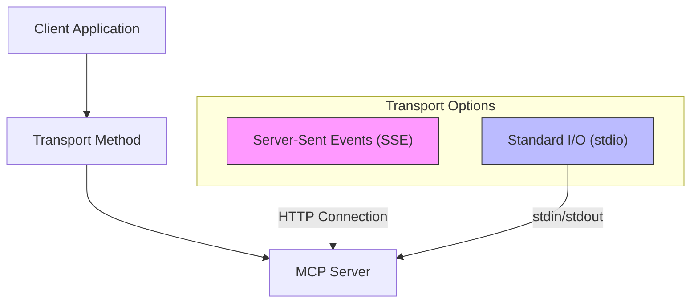
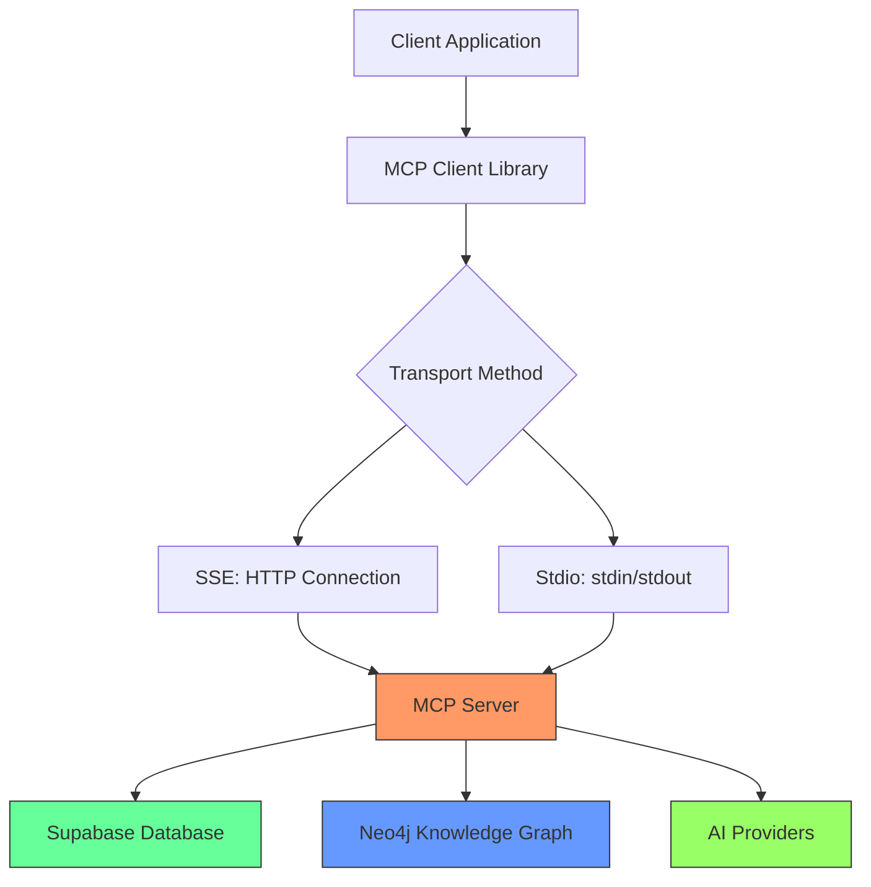

# Integration with MCP Clients

<cite>
**Referenced Files in This Document**   
- [mcp.json](file://mcp.json)
- [src/crawl4ai_mcp.py](file://src/crawl4ai_mcp.py)
- [scripts/query_rag.py](file://scripts/query_rag.py)
- [tests/test_mcp_server.py](file://tests/test_mcp_server.py)
- [README.md](file://README.md)
- [pyproject.toml](file://pyproject.toml)
</cite>

## Table of Contents
1. [Introduction](#introduction)
2. [Transport Methods](#transport-methods)
3. [Configuration and Discovery](#configuration-and-discovery)
4. [Client Integration Examples](#client-integration-examples)
5. [Tool Registration and Invocation](#tool-registration-and-invocation)
6. [Client-Specific Considerations](#client-specific-considerations)
7. [Testing and Validation](#testing-and-validation)
8. [Conclusion](#conclusion)

## Introduction
This document provides comprehensive guidance for integrating with MCP (Model Context Protocol) clients using the Crawl4AI RAG server. The server enables AI agents and coding assistants to perform web crawling, content extraction, and retrieval-augmented generation (RAG) operations through standardized MCP interfaces. The integration supports two primary transport methods: Server-Sent Events (SSE) and standard input/output (stdio), allowing flexible deployment across different client environments and use cases.

The MCP server exposes a suite of tools for web crawling, knowledge graph querying, hallucination detection, and code example search, making it suitable for AI development workflows, documentation retrieval, and code validation scenarios. This documentation covers configuration, client setup, tool invocation patterns, and best practices for successful integration.

**Section sources**
- [src/crawl4ai_mcp.py](file://src/crawl4ai_mcp.py#L1-L2289)
- [README.md](file://README.md#L533-L729)

## Transport Methods
The MCP server supports two transport methods for client communication: Server-Sent Events (SSE) and standard input/output (stdio). Each method has distinct advantages depending on the deployment scenario and client requirements.

### Server-Sent Events (SSE)
SSE provides a persistent HTTP connection that enables real-time, bidirectional communication between the MCP server and clients. This transport method is ideal for web-based clients, cloud deployments, and scenarios requiring low-latency interactions. The server streams responses as they become available, supporting streaming responses for large content retrieval and progressive result delivery.

The SSE endpoint is configured through environment variables, with default settings pointing to `http://localhost:8051/sse`. Clients establish a connection to this endpoint and maintain it for the duration of the session, allowing for efficient multiplexing of multiple tool calls over a single connection.

### Standard Input/Output (stdio)
The stdio transport method uses standard input and output streams for communication, making it suitable for local execution, containerized environments, and command-line tools. This approach is particularly effective for desktop applications, Docker deployments, and scenarios where HTTP connectivity might be restricted or unnecessary.

With stdio transport, the MCP server runs as a long-lived process that reads JSON-RPC messages from stdin and writes responses to stdout. This method eliminates HTTP overhead and simplifies integration with clients that can spawn subprocesses, providing a lightweight and efficient communication channel.



**Diagram sources**
- [src/crawl4ai_mcp.py](file://src/crawl4ai_mcp.py#L2279-L2289)
- [README.md](file://README.md#L535-L568)

**Section sources**
- [src/crawl4ai_mcp.py](file://src/crawl4ai_mcp.py#L2279-L2289)
- [README.md](file://README.md#L535-L568)

## Configuration and Discovery
The MCP client integration relies on proper configuration and service discovery mechanisms to establish connections with the server. The primary discovery mechanism is the `mcp.json` file, which contains server endpoint information and transport configuration.

### mcp.json Discovery Mechanism
The `mcp.json` file serves as the service advertisement mechanism, providing clients with the necessary connection details to interact with the MCP server. This JSON configuration file specifies the transport method, server URL, and other connection parameters required for client initialization.

```json
{
  "mcpServers": {
    "crawl4ai-rag": {
      "transport": "sse",
      "url": "http://localhost:8051/sse"
    }
  }
}
```

The configuration includes:
- **mcpServers**: Object containing server definitions
- **crawl4ai-rag**: Server identifier used by clients to reference this service
- **transport**: Specifies the communication protocol ("sse" or "stdio")
- **url**: Endpoint URL for SSE connections

For stdio transport, the configuration uses command and arguments instead of a URL:

```json
{
  "mcpServers": {
    "crawl4ai-rag": {
      "command": "python",
      "args": ["path/to/crawl4ai-mcp/src/crawl4ai_mcp.py"],
      "env": {
        "TRANSPORT": "stdio",
        "OPENAI_API_KEY": "your_openai_api_key",
        "SUPABASE_URL": "your_supabase_url",
        "SUPABASE_SERVICE_KEY": "your_supabase_service_key"
      }
    }
  }
}
```

### Environment Variable Configuration
The server behavior is controlled through environment variables that configure transport, database connections, AI providers, and feature flags. Key configuration variables include:

- **TRANSPORT**: Sets the transport method ("sse" or "stdio")
- **HOST**: Server host address (default: "0.0.0.0")
- **PORT**: Server port (default: "8051")
- **SUPABASE_URL** and **SUPABASE_SERVICE_KEY**: Supabase database credentials
- **USE_KNOWLEDGE_GRAPH**: Enables/disables Neo4j knowledge graph functionality
- **NEO4J_URI**, **NEO4J_USER**, **NEO4J_PASSWORD**: Neo4j database connection details

The server reads these variables during initialization and validates their configuration, providing feedback on the active settings and connectivity status.

**Section sources**
- [mcp.json](file://mcp.json#L1-L9)
- [src/crawl4ai_mcp.py](file://src/crawl4ai_mcp.py#L295-L300)
- [README.md](file://README.md#L535-L623)

## Client Integration Examples
This section provides configuration examples for popular MCP clients and AI frameworks, demonstrating how to connect to the Crawl4AI RAG server using both SSE and stdio transport methods.

### Windsurf Configuration
For Windsurf users, the configuration requires using `serverUrl` instead of `url` in the mcp.json file:

```json
{
  "mcpServers": {
    "crawl4ai-rag": {
      "transport": "sse",
      "serverUrl": "http://localhost:8051/sse"
    }
  }
}
```

### Claude Code Configuration
Claude Code users can add the server configuration using the command-line interface:

```bash
claude mcp add-json crawl4ai-rag '{"type":"http","url":"http://localhost:8051/sse"}' --scope user
```

### Docker with Stdio Configuration
When running the client in a Docker container, use the following configuration to connect to a host-based MCP server:

```json
{
  "mcpServers": {
    "crawl4ai-rag": {
      "command": "docker",
      "args": ["run", "--rm", "-i", 
               "-e", "TRANSPORT", 
               "-e", "OPENAI_API_KEY", 
               "-e", "SUPABASE_URL", 
               "-e", "SUPABASE_SERVICE_KEY",
               "-e", "USE_KNOWLEDGE_GRAPH",
               "-e", "NEO4J_URI",
               "-e", "NEO4J_USER",
               "-e", "NEO4J_PASSWORD",
               "mcp/crawl4ai"],
      "env": {
        "TRANSPORT": "stdio",
        "OPENAI_API_KEY": "your_openai_api_key",
        "SUPABASE_URL": "your_supabase_url",
        "SUPABASE_SERVICE_KEY": "your_supabase_service_key",
        "USE_KNOWLEDGE_GRAPH": "false",
        "NEO4J_URI": "bolt://localhost:7687",
        "NEO4J_USER": "neo4j",
        "NEO4J_PASSWORD": "your_neo4j_password"
      }
    }
  }
}
```

Note the use of `host.docker.internal` instead of `localhost` when the client runs in a different container than the server.

### Python Client Integration
Python applications can integrate with the MCP server using the official MCP client library:

```python
from mcp import StdioClient, HttpClient

# SSE client configuration
sse_client = HttpClient(
    url="http://localhost:8051/sse",
    headers={"Authorization": "Bearer your-token"}
)

# Stdio client configuration
stdio_client = StdioClient(
    command="python",
    args=["path/to/crawl4ai-mcp/src/crawl4ai_mcp.py"],
    env={
        "TRANSPORT": "stdio",
        "OPENAI_API_KEY": os.getenv("OPENAI_API_KEY"),
        "SUPABASE_URL": os.getenv("SUPABASE_URL"),
        "SUPABASE_SERVICE_KEY": os.getenv("SUPABASE_SERVICE_KEY")
    }
)
```

**Section sources**
- [README.md](file://README.md#L535-L623)
- [pyproject.toml](file://pyproject.toml#L11-L25)

## Tool Registration and Invocation
The MCP server exposes several tools that clients can invoke for various operations. These tools are registered using the `@mcp.tool()` decorator and follow standardized invocation patterns.

### Available Tools
The server provides the following tools for client invocation:

- **get_available_sources**: Retrieves a list of available sources in the database
- **perform_rag_query**: Performs RAG queries on stored content with source type filtering
- **search_code_examples**: Searches for code examples with optional source filtering
- **check_ai_script_hallucinations**: Validates AI-generated Python scripts against knowledge graph
- **query_knowledge_graph**: Explores the Neo4j knowledge graph for repository data
- **parse_github_repository**: Parses GitHub repositories into the knowledge graph

### Python Code Example
The following Python example demonstrates how to register the server as a tool provider and invoke its capabilities:

```python
import asyncio
from mcp import StdioClient
from mcp.types import ToolCall

async def main():
    # Initialize stdio client
    client = StdioClient(
        command="python",
        args=["src/crawl4ai_mcp.py"],
        env={"TRANSPORT": "stdio"}
    )
    
    try:
        # Connect to server
        await client.connect()
        
        # List available tools
        tools = await client.list_tools()
        print(f"Available tools: {tools}")
        
        # Perform RAG query
        tool_call = ToolCall(
            tool_name="perform_rag_query",
            arguments={
                "query": "Simics device modeling best practices",
                "source_type": "docs",
                "match_count": 5
            }
        )
        
        response = await client.call_tool(tool_call)
        print(f"RAG results: {response}")
        
        # Check for AI script hallucinations
        tool_call = ToolCall(
            tool_name="check_ai_script_hallucinations",
            arguments={"script_path": "/path/to/ai_generated_script.py"}
        )
        
        response = await client.call_tool(tool_call)
        print(f"Hallucination check: {response}")
        
    finally:
        await client.disconnect()

if __name__ == "__main__":
    asyncio.run(main())
```

### Other Language Examples
Other languages can integrate with the MCP server using appropriate HTTP or stdio libraries. For example, a Node.js client using SSE:

```javascript
const axios = require('axios');
const EventSource = require('eventsource');

// SSE client for streaming responses
const eventSource = new EventSource('http://localhost:8051/sse');

eventSource.onmessage = (event) => {
    const data = JSON.parse(event.data);
    console.log('Received:', data);
};

// HTTP client for request-response pattern
const httpClient = axios.create({
    baseURL: 'http://localhost:8051',
    headers: {'Content-Type': 'application/json'}
});

async function performRagQuery(query) {
    const response = await httpClient.post('/tool/perform_rag_query', {
        query: query,
        source_type: 'all',
        match_count: 5
    });
    return response.data;
}
```

**Section sources**
- [src/crawl4ai_mcp.py](file://src/crawl4ai_mcp.py#L1038-L1602)
- [scripts/query_rag.py](file://scripts/query_rag.py#L15-L113)

## Client-Specific Considerations
When integrating with MCP clients, several considerations must be addressed to ensure reliable and efficient operation.

### Streaming Response Handling
For SSE transport, clients should implement proper streaming response handling to process partial results as they arrive. This is particularly important for long-running operations like web crawling or knowledge graph queries that may return large result sets.

Clients should:
- Handle chunked responses incrementally
- Implement timeout mechanisms for stalled streams
- Support reconnection logic for dropped connections
- Buffer responses appropriately to avoid memory issues

### Error Propagation
The MCP server follows standardized error reporting patterns, returning JSON responses with success/failure status and error messages. Clients should implement comprehensive error handling to provide meaningful feedback to end users.

Error response structure:
```json
{
    "success": false,
    "error": "Descriptive error message",
    "tool_name": "optional_tool_name"
}
```

Common error scenarios include:
- Invalid tool parameters
- Authentication failures
- Database connectivity issues
- Rate limiting
- Resource constraints

### Session Management
The MCP server maintains state through its lifespan context, which includes database connections, AI models, and knowledge graph validators. Clients should manage sessions appropriately:

- For SSE: Maintain the connection for the duration of related operations
- For stdio: Keep the subprocess alive for multiple tool calls
- Implement proper cleanup and disconnection procedures
- Handle server restarts and reconnection scenarios

### Rate Limiting
The server implements rate limiting based on the COPILOT_REQUESTS_PER_MINUTE environment variable. Clients should respect these limits and implement retry logic with exponential backoff when encountering rate limit errors.

```python
import time
import asyncio

async def call_with_retry(tool_call, max_retries=3):
    for attempt in range(max_retries):
        try:
            response = await client.call_tool(tool_call)
            return response
        except RateLimitError:
            if attempt < max_retries - 1:
                wait_time = 2 ** attempt  # Exponential backoff
                await asyncio.sleep(wait_time)
            else:
                raise
```

**Section sources**
- [src/crawl4ai_mcp.py](file://src/crawl4ai_mcp.py#L294-L298)
- [tests/test_mcp_server.py](file://tests/test_mcp_server.py#L196-L212)

## Testing and Validation
The repository includes comprehensive testing tools to validate MCP server functionality and client integration.

### Server Validation Test
The `test_mcp_server.py` script provides a complete validation suite that checks:

- Server process status
- Configuration settings
- Database connectivity
- AI provider configuration
- RAG feature status
- Available tools
- Rate limiting configuration

```python
# Run server validation
python tests/test_mcp_server.py
```

The test outputs a detailed summary of the server's readiness, indicating whether all tests passed or if configuration issues need to be addressed.

### RAG Testing Script
The `query_rag.py` script allows manual testing of the RAG system:

```bash
# List available sources
python scripts/query_rag.py --list-sources

# Perform document search
python scripts/query_rag.py "Simics device modeling" --type docs --count 3

# Search code examples
python scripts/query_rag.py "DML syntax example" --type code --source-type dml
```

This script demonstrates the same query patterns used by MCP clients and helps verify that content has been properly indexed and is retrievable.



**Diagram sources**
- [src/crawl4ai_mcp.py](file://src/crawl4ai_mcp.py#L130-L293)
- [tests/test_mcp_server.py](file://tests/test_mcp_server.py#L215-L268)

**Section sources**
- [tests/test_mcp_server.py](file://tests/test_mcp_server.py#L215-L268)
- [scripts/query_rag.py](file://scripts/query_rag.py#L272-L347)

## Conclusion
Integrating with the Crawl4AI RAG MCP server provides powerful capabilities for web crawling, content retrieval, and AI-assisted development. By leveraging the two transport methods—SSE and stdio—clients can choose the most appropriate communication pattern for their deployment scenario.

The mcp.json discovery mechanism simplifies client configuration, while the comprehensive tool set enables sophisticated RAG operations, knowledge graph exploration, and AI hallucination detection. Proper implementation of streaming response handling, error propagation, and session management ensures reliable client-server interactions.

The provided configuration examples for popular MCP clients and AI frameworks demonstrate the flexibility of the integration approach, while the testing tools help validate server functionality and client connectivity. By following the patterns outlined in this documentation, developers can successfully integrate the Crawl4AI RAG server into their AI agent workflows and coding assistant applications.

**Section sources**
- [src/crawl4ai_mcp.py](file://src/crawl4ai_mcp.py#L1-L2289)
- [README.md](file://README.md#L533-L729)