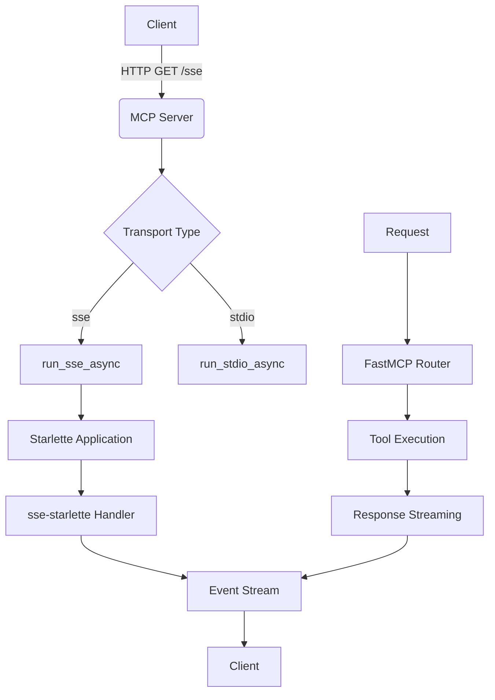
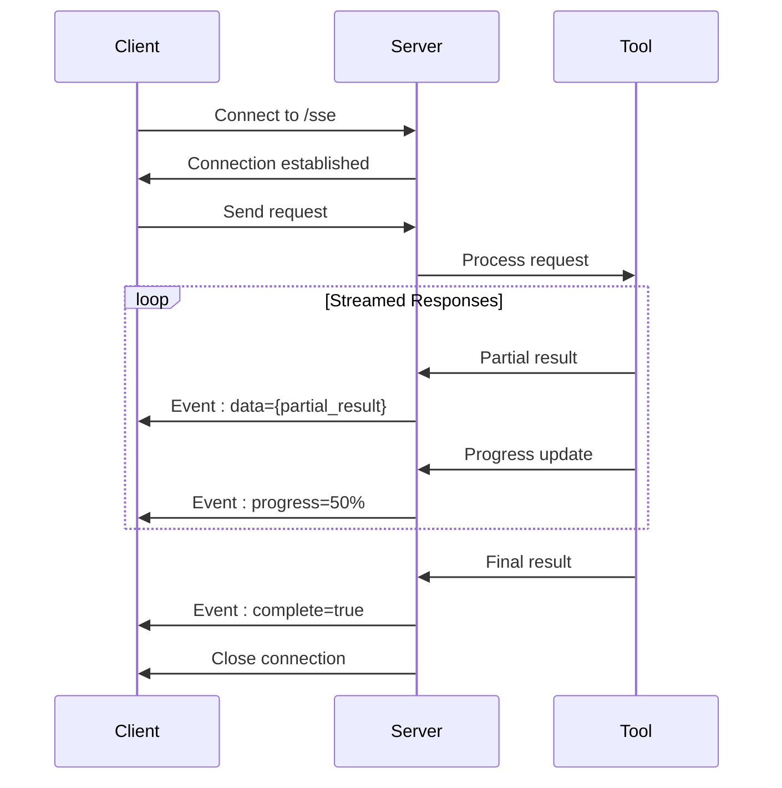

# SSE Integration

<cite>
**Referenced Files in This Document**   
- [mcp.json](file://mcp.json)
- [src/crawl4ai_mcp.py](file://src/crawl4ai_mcp.py)
- [scripts/query_rag.py](file://scripts/query_rag.py)
- [pyproject.toml](file://pyproject.toml)
- [README.md](file://README.md)
</cite>

## Table of Contents
1. [Introduction](#introduction)
2. [SSE Configuration](#sse-configuration)
3. [Server-Side Implementation](#server-side-implementation)
4. [Client-Side Integration](#client-side-integration)
5. [Event Streaming and Response Formatting](#event-streaming-and-response-formatting)
6. [Session Management and Reconnection](#session-management-and-reconnection)
7. [Error Handling](#error-handling)
8. [Troubleshooting Common Issues](#troubleshooting-common-issues)
9. [Conclusion](#conclusion)

## Introduction
This document provides comprehensive guidance for integrating with MCP clients using Server-Sent Events (SSE) transport. The MCP server in this repository implements SSE as the default transport mechanism for real-time communication between the server and clients. SSE enables efficient, one-way streaming of events from the server to the client over HTTP, making it ideal for applications requiring live updates such as RAG (Retrieval-Augmented Generation) systems, web crawling status updates, and knowledge graph queries. The implementation leverages the FastMCP framework with sse-starlette to handle SSE connections, providing a robust foundation for streaming responses. This documentation covers the complete integration process, from configuration and server implementation to client-side handling and error management.

## SSE Configuration
The SSE transport configuration is defined in the mcp.json file, which specifies the transport type and endpoint URL for the MCP server. The configuration uses "sse" as the transport type with the URL pointing to the SSE endpoint at http://localhost:8051/sse. This configuration is automatically loaded by MCP clients to establish connections with the server. The server's transport mode can be controlled via the TRANSPORT environment variable, with "sse" as the default value. When running the server, it checks this environment variable and invokes run_sse_async() if the transport is set to "sse", otherwise falling back to stdio transport. The pyproject.toml file lists the required dependencies, including the mcp package that provides the FastMCP server implementation with SSE support. For Docker deployments, the localhost reference should be replaced with host.docker.internal to ensure proper connectivity between containers. Different MCP client implementations may require slight variations in the configuration format, such as using serverUrl instead of url for certain clients like Windsurf.

**Section sources**
- [mcp.json](file://mcp.json#L1-L9)
- [src/crawl4ai_mcp.py](file://src/crawl4ai_mcp.py#L2280-L2283)
- [pyproject.toml](file://pyproject.toml#L1-L40)
- [README.md](file://README.md#L533-L567)

## Server-Side Implementation
The MCP server implementation in src/crawl4ai_mcp.py uses the FastMCP framework to handle SSE connections. The server is initialized with a lifespan context manager that sets up the crawler, Supabase client, and optional components like reranking models and Neo4j knowledge graph validators. The main entry point checks the TRANSPORT environment variable and calls run_sse_async() to start the server with SSE transport. This method leverages the underlying FastMCP implementation which uses Starlette and sse-starlette to handle the SSE protocol. The server maintains persistent connections with clients and streams responses as Server-Sent Events. The event loop processes incoming requests and sends responses incrementally, which is particularly useful for long-running operations like web crawling or complex RAG queries. The server also handles connection lifecycle events, including connection establishment, keep-alive mechanisms, and proper cleanup when connections are terminated. Error handling is implemented at multiple levels to ensure robust operation even when individual requests fail.

**Diagram sources **
- [src/crawl4ai_mcp.py](file://src/crawl4ai_mcp.py#L2279-L2289)
- [pyproject.toml](file://pyproject.toml#L13)

**Section sources**
- [src/crawl4ai_mcp.py](file://src/crawl4ai_mcp.py#L1-L2289)

## Client-Side Integration
Client-side integration with the SSE transport involves configuring the MCP client to connect to the server's SSE endpoint. The configuration in mcp.json specifies the transport type as "sse" and the URL as "http://localhost:8051/sse". Clients establish a persistent HTTP connection to this endpoint and receive events as they occur on the server. The scripts/query_rag.py file demonstrates how to interact with the RAG system, though it uses direct Supabase queries rather than the MCP interface. For proper MCP client integration, applications should use the MCP client libraries that support SSE transport. These libraries handle the low-level details of maintaining the SSE connection, parsing event data, and managing reconnection logic. When the connection is established, the client can send requests to the server's available tools, and the server streams responses back as events. The client must be able to handle various event types, including progress updates, partial results, and completion messages. For web-based clients, the native EventSource API can be used, while other platforms may require specific MCP client implementations that support SSE.

**Section sources**
- [mcp.json](file://mcp.json#L1-L9)
- [scripts/query_rag.py](file://scripts/query_rag.py#L1-L348)
- [README.md](file://README.md#L533-L567)

## Event Streaming and Response Formatting
The MCP server streams responses using the Server-Sent Events protocol, which formats messages with specific event types and data fields. Each event is sent as a text message with headers that define the event type, identifier, and data payload. The sse-starlette library handles the low-level formatting, ensuring compliance with the SSE specification. Events are streamed incrementally as data becomes available, allowing clients to process results in real-time rather than waiting for complete responses. This is particularly valuable for operations like web crawling or RAG queries that may take significant time to complete. The server can send different types of events, such as progress updates, partial results, warnings, and completion notifications. Each event includes a data field containing JSON-encoded content that clients can parse and process. The streaming approach reduces latency and improves user experience by providing immediate feedback. The FastMCP framework manages the event loop and ensures that responses are properly formatted and delivered to connected clients.

**Diagram sources **
- [src/crawl4ai_mcp.py](file://src/crawl4ai_mcp.py#L2283)
- [pyproject.toml](file://pyproject.toml#L13)

**Section sources**
- [src/crawl4ai_mcp.py](file://src/crawl4ai_mcp.py#L2283)

## Session Management and Reconnection
The SSE implementation includes mechanisms for session management and reconnection to ensure reliable communication between clients and the MCP server. When a client connects to the SSE endpoint, the server establishes a persistent connection that remains open for the duration of the session. The server uses keep-alive messages to maintain the connection and detect when clients disconnect. For reconnection, clients should implement logic to automatically reconnect when the connection is lost, using exponential backoff to avoid overwhelming the server. The EventSource API in web browsers provides built-in reconnection capabilities, automatically attempting to reconnect when the connection drops. Clients should also handle the Last-Event-ID header, which allows the server to resume streaming from the point of disconnection when supported. For long-running operations, the server may include checkpoint information in events, enabling clients to resume processing from the last received event after reconnection. Proper session management ensures that clients can maintain continuous access to the MCP server's capabilities even in unstable network conditions.

**Section sources**
- [src/crawl4ai_mcp.py](file://src/crawl4ai_mcp.py#L2283)
- [README.md](file://README.md#L533-L567)

## Error Handling
The MCP server implements comprehensive error handling for SSE connections to ensure robust operation. When errors occur during request processing, the server sends error events to clients with detailed information about the failure. The FastMCP framework catches exceptions at multiple levels, preventing unhandled errors from terminating the server process. For SSE-specific errors, such as connection timeouts or network issues, the server gracefully closes connections and logs diagnostic information. Client-side error handling should include timeouts for connection establishment and response receipt, as well as retry logic for transient failures. The server also handles resource constraints, such as memory limits and rate limiting, to prevent denial-of-service conditions. When processing individual tools, errors are caught and formatted as structured error responses that clients can parse and display to users. The logging system provides detailed information about errors, including stack traces and context, which aids in debugging and troubleshooting. Proper error handling ensures that both server and client can recover from failures and maintain system stability.

**Section sources**
- [src/crawl4ai_mcp.py](file://src/crawl4ai_mcp.py#L1-L2289)

## Troubleshooting Common Issues
Common issues with SSE integration include connection timeouts, CORS policies, and payload size limits. Connection timeouts can occur when the server takes too long to respond or when network conditions are poor; these can be mitigated by adjusting timeout settings on both client and server. CORS (Cross-Origin Resource Sharing) policies may prevent browser-based clients from connecting to the server; this can be resolved by configuring the server to include appropriate CORS headers in responses. Payload size limits can cause issues when streaming large responses; the server should implement chunking or pagination to handle large datasets. For Docker deployments, connectivity issues may arise when clients run in separate containers; using host.docker.internal instead of localhost resolves this. Authentication issues can occur if the server requires credentials; ensuring proper configuration of environment variables and authentication tokens is essential. Monitoring logs from both client and server helps identify the root cause of connectivity problems. Testing with simple requests first and gradually increasing complexity can help isolate issues in the integration process.

**Section sources**
- [README.md](file://README.md#L562-L563)
- [src/crawl4ai_mcp.py](file://src/crawl4ai_mcp.py#L2280-L2283)

## Conclusion
The SSE integration in this MCP server provides a robust foundation for real-time communication between clients and the RAG system. By leveraging the FastMCP framework with sse-starlette, the implementation offers efficient, one-way streaming of events from server to client. The configuration in mcp.json makes it easy for clients to connect to the server, while the server-side implementation ensures reliable handling of connections and streaming responses. Client applications can benefit from real-time updates and incremental results, improving user experience for long-running operations. Proper implementation of session management, reconnection logic, and error handling ensures reliable operation even in challenging network conditions. The documented troubleshooting tips help resolve common issues related to connectivity, CORS, and payload sizes. This SSE integration enables seamless interaction with the MCP server's capabilities, supporting advanced use cases like real-time web crawling status updates and streaming RAG query results.