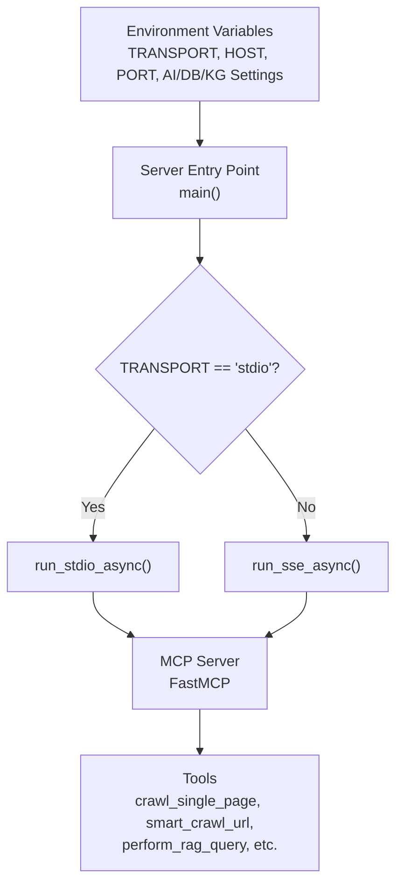
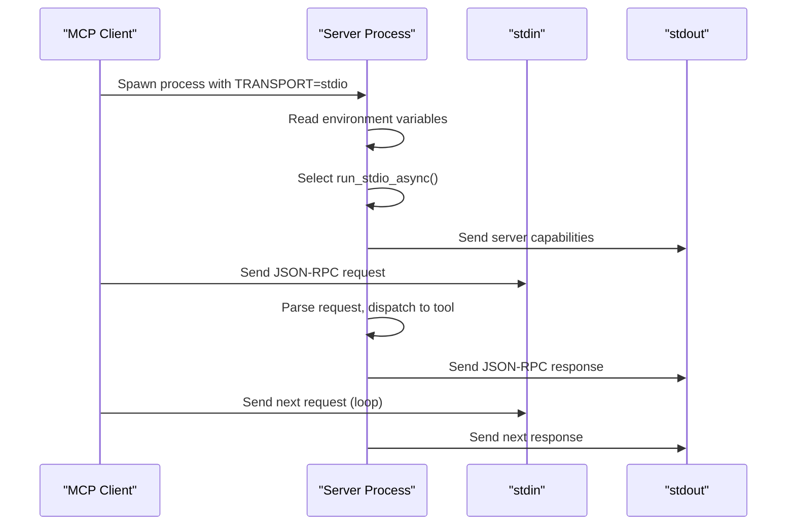
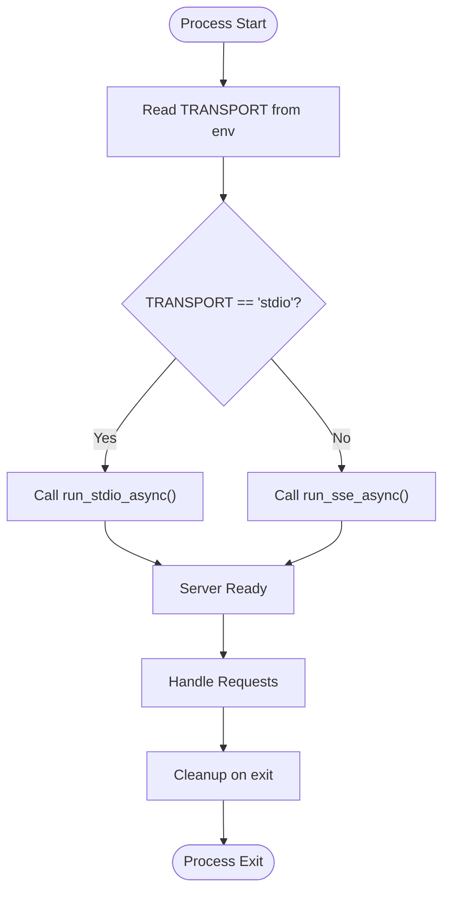
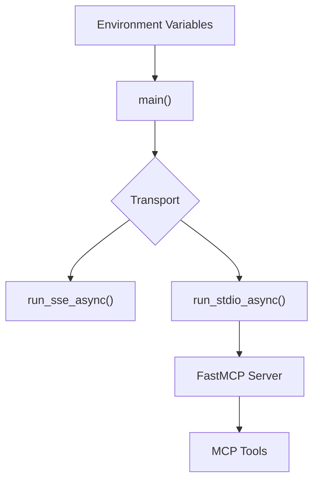

# Stdio Integration

<cite>
**Referenced Files in This Document**
- [src/crawl4ai_mcp.py](file://src/crawl4ai_mcp.py)
- [tests/test_mcp_server.py](file://tests/test_mcp_server.py)
- [README.md](file://README.md)
</cite>

## Table of Contents
1. [Introduction](#introduction)
2. [Project Structure](#project-structure)
3. [Core Components](#core-components)
4. [Architecture Overview](#architecture-overview)
5. [Detailed Component Analysis](#detailed-component-analysis)
6. [Dependency Analysis](#dependency-analysis)
7. [Performance Considerations](#performance-considerations)
8. [Troubleshooting Guide](#troubleshooting-guide)
9. [Conclusion](#conclusion)
10. [Appendices](#appendices)

## Introduction
This document explains how to integrate MCP clients with the server using stdio (standard input/output) transport. It covers how the server selects stdio transport, how JSON-RPC messages are exchanged over stdin/stdout, and how to configure the server for stdio. It also describes practical use cases (local tool execution, CLI integrations, containerized environments), error propagation, process lifecycle management, and buffering considerations.

## Project Structure
The stdio integration centers around a single entry point that conditionally starts the server with stdio transport when configured. The repository also includes tests that validate transport selection and environment configuration.

**Diagram sources**
- [src/crawl4ai_mcp.py](file://src/crawl4ai_mcp.py#L2279-L2289)
- [README.md](file://README.md#L569-L624)

**Section sources**
- [src/crawl4ai_mcp.py](file://src/crawl4ai_mcp.py#L2279-L2289)
- [tests/test_mcp_server.py](file://tests/test_mcp_server.py#L63-L78)
- [README.md](file://README.md#L569-L624)

## Core Components
- Transport selection: The server reads the TRANSPORT environment variable and calls the appropriate FastMCP runner. When TRANSPORT is not "sse", stdio is used.
- Stdio transport: The server uses FastMCP’s stdio runner to communicate over stdin/stdout.
- Tools: The server exposes multiple MCP tools (e.g., crawling, RAG, knowledge graph) that are invoked by clients over the transport.

Key implementation references:
- Transport selection and stdio runner invocation
- Stdio transport usage in the server entry point
- Tool definitions and JSON responses

**Section sources**
- [src/crawl4ai_mcp.py](file://src/crawl4ai_mcp.py#L2279-L2289)

## Architecture Overview
The stdio transport architecture is a simple bidirectional pipe between the MCP client and the server process. The client spawns the server process and communicates via JSON-RPC over stdin/stdout. The server listens for requests and responds with JSON.

**Diagram sources**
- [src/crawl4ai_mcp.py](file://src/crawl4ai_mcp.py#L2279-L2289)
- [README.md](file://README.md#L569-L624)

## Detailed Component Analysis

### Stdio Transport Selection and Lifecycle
- The server reads TRANSPORT from environment variables and chooses the stdio runner when TRANSPORT is not "sse".
- The server lifecycle is managed by FastMCP’s lifespan manager, which initializes resources (crawler, Supabase client, optional knowledge graph components) and ensures cleanup on exit.

**Diagram sources**
- [src/crawl4ai_mcp.py](file://src/crawl4ai_mcp.py#L2279-L2289)
- [src/crawl4ai_mcp.py](file://src/crawl4ai_mcp.py#L130-L293)

**Section sources**
- [src/crawl4ai_mcp.py](file://src/crawl4ai_mcp.py#L2279-L2289)
- [src/crawl4ai_mcp.py](file://src/crawl4ai_mcp.py#L130-L293)

### JSON-RPC over Stdio
- The server uses FastMCP’s stdio transport under the hood. While the exact framing details are handled by the FastMCP runtime, the server expects standard JSON-RPC messages over stdin and writes JSON-RPC responses to stdout.
- Tools return JSON-formatted strings as their results. Clients should treat these as opaque JSON payloads and not expect raw text.

Practical implications:
- Clients must send valid JSON-RPC requests to stdin.
- Responses are JSON-RPC responses containing the tool result as a JSON string payload.
- Errors from tools are returned as JSON with a success flag and error details.

**Section sources**
- [src/crawl4ai_mcp.py](file://src/crawl4ai_mcp.py#L800-L831)
- [src/crawl4ai_mcp.py](file://src/crawl4ai_mcp.py#L1021-L1036)
- [src/crawl4ai_mcp.py](file://src/crawl4ai_mcp.py#L1333-L1347)

### Configuration for Stdio Transport
- Set TRANSPORT=stdio in the environment.
- Provide other required environment variables for AI providers, database, and optional knowledge graph.
- The tests validate that TRANSPORT accepts "stdio" and that other configuration checks pass.

Environment variables validated by tests:
- TRANSPORT must be "sse" or "stdio"
- Database and AI provider configurations are checked
- Knowledge graph configuration is validated when enabled

**Section sources**
- [tests/test_mcp_server.py](file://tests/test_mcp_server.py#L63-L78)
- [tests/test_mcp_server.py](file://tests/test_mcp_server.py#L80-L111)
- [tests/test_mcp_server.py](file://tests/test_mcp_server.py#L114-L149)
- [tests/test_mcp_server.py](file://tests/test_mcp_server.py#L151-L171)
- [tests/test_mcp_server.py](file://tests/test_mcp_server.py#L174-L193)
- [tests/test_mcp_server.py](file://tests/test_mcp_server.py#L196-L213)
- [README.md](file://README.md#L206-L242)

### Use Cases
- Local tool execution: Run the server locally and connect MCP clients (e.g., Claude Desktop, Windsurf) via stdio.
- CLI integrations: Use shell scripts to launch the server with stdio and pipe requests/responses.
- Containerized environments: Use Docker to run the server with stdio transport, passing environment variables via the container runtime.

The README demonstrates stdio configuration for both direct Python execution and Docker-based scenarios.

**Section sources**
- [README.md](file://README.md#L569-L624)

### Error Propagation
- Tool functions catch exceptions and return JSON with a success flag and an error field.
- Clients should inspect the success field and error message to handle failures gracefully.
- The lifespan manager logs errors during initialization and cleanup.

**Section sources**
- [src/crawl4ai_mcp.py](file://src/crawl4ai_mcp.py#L825-L830)
- [src/crawl4ai_mcp.py](file://src/crawl4ai_mcp.py#L1031-L1036)
- [src/crawl4ai_mcp.py](file://src/crawl4ai_mcp.py#L130-L293)

### Process Lifecycle Management
- The server process is started by the client with TRANSPORT=stdio.
- The server initializes dependencies (crawler, Supabase client, optional knowledge graph) and prints a readiness message.
- The server exits cleanly, closing resources in the lifespan manager.

**Section sources**
- [src/crawl4ai_mcp.py](file://src/crawl4ai_mcp.py#L130-L293)
- [README.md](file://README.md#L425-L446)

### Buffering Considerations
- The server writes JSON responses to stdout and reads requests from stdin.
- Ensure clients flush stdout and handle partial reads/writes appropriately.
- The server does not implement custom framing; rely on the FastMCP stdio transport for correct message boundaries.

**Section sources**
- [src/crawl4ai_mcp.py](file://src/crawl4ai_mcp.py#L2279-L2289)

## Dependency Analysis
The stdio integration depends on FastMCP’s stdio transport and the server’s environment-driven configuration.

**Diagram sources**
- [src/crawl4ai_mcp.py](file://src/crawl4ai_mcp.py#L2279-L2289)

**Section sources**
- [src/crawl4ai_mcp.py](file://src/crawl4ai_mcp.py#L2279-L2289)

## Performance Considerations
- Startup time: The server initializes models and external services; wait for the readiness message before connecting clients.
- Concurrency: Crawling and search operations can be resource-intensive; tune environment variables and tool parameters accordingly.
- Transport overhead: Stdio is efficient for local or containerized setups; network transports may offer benefits in distributed environments.

[No sources needed since this section provides general guidance]

## Troubleshooting Guide
Common issues and resolutions:
- Transport misconfiguration: Ensure TRANSPORT is set to "stdio" for stdio mode.
- Missing environment variables: Provide AI provider keys, database credentials, and optional knowledge graph settings.
- Client connects too early: Wait for the readiness message before sending requests.
- Tool errors: Inspect the success flag and error message in tool responses.

**Section sources**
- [tests/test_mcp_server.py](file://tests/test_mcp_server.py#L63-L78)
- [tests/test_mcp_server.py](file://tests/test_mcp_server.py#L80-L111)
- [README.md](file://README.md#L425-L446)

## Conclusion
The stdio transport enables straightforward integration with MCP clients by launching the server process with TRANSPORT=stdio and communicating via JSON-RPC over stdin/stdout. The server’s environment-driven configuration and lifecycle management make it suitable for local, CLI, and containerized deployments. Use the provided configuration examples and error-handling patterns to build reliable integrations.

[No sources needed since this section summarizes without analyzing specific files]

## Appendices

### Stdio Configuration Examples
- Direct Python execution with stdio transport and environment variables.
- Docker-based stdio transport with environment variable propagation.

**Section sources**
- [README.md](file://README.md#L569-L624)