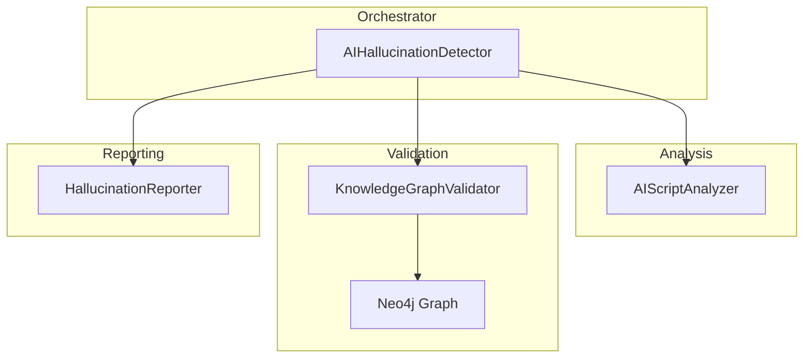
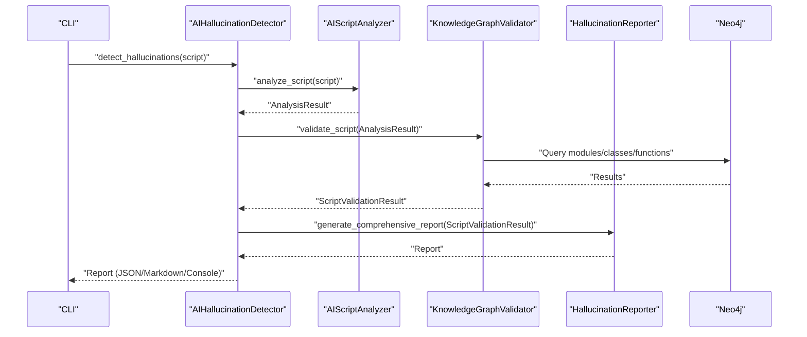
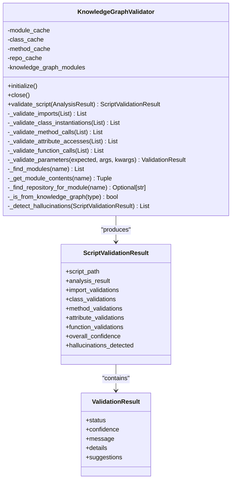
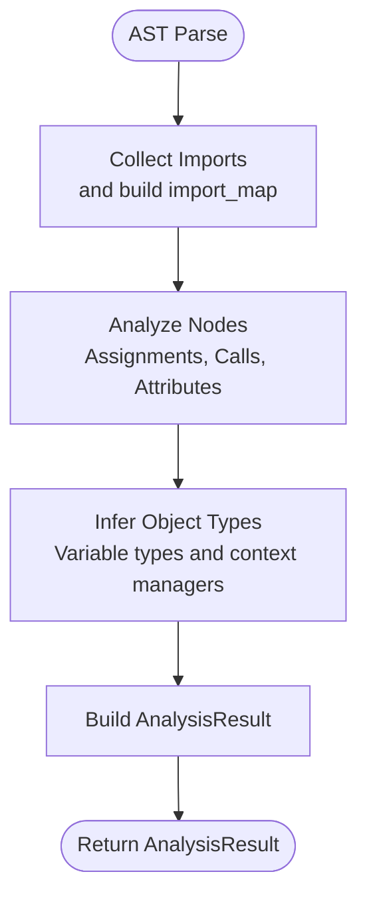
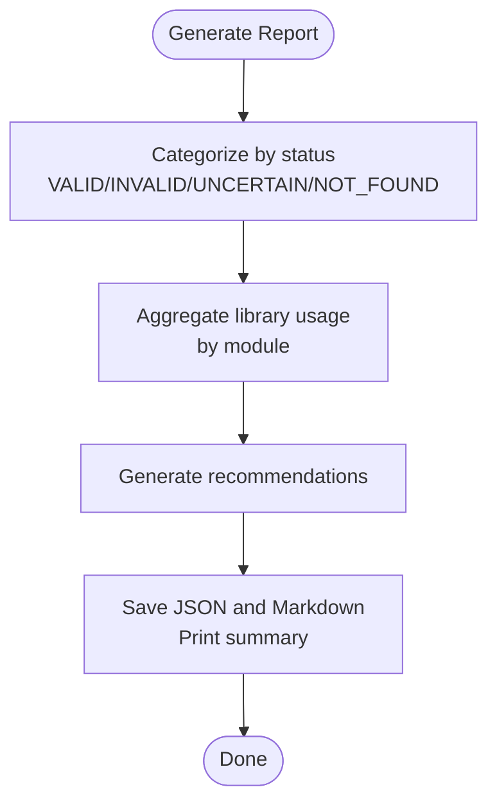
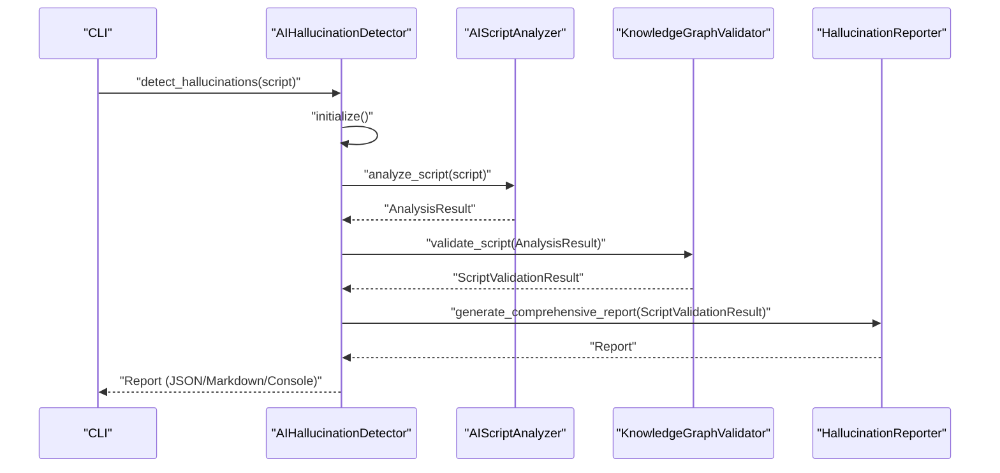
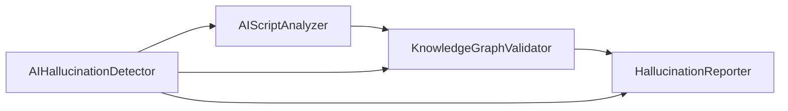
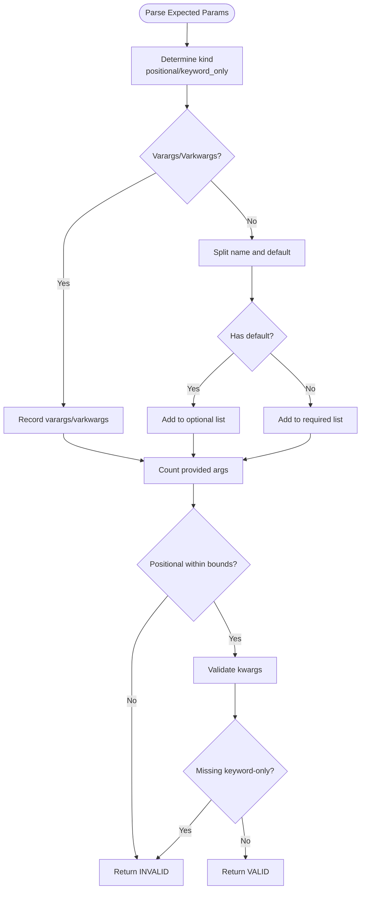

# Graph Validation and AI Hallucination Detection

<cite>
**Referenced Files in This Document**
- [knowledge_graph_validator.py](file://knowledge_graphs/knowledge_graph_validator.py)
- [ai_hallucination_detector.py](file://knowledge_graphs/ai_hallucination_detector.py)
- [ai_script_analyzer.py](file://knowledge_graphs/ai_script_analyzer.py)
- [hallucination_reporter.py](file://knowledge_graphs/hallucination_reporter.py)
- [demo_simics_analysis.py](file://knowledge_graphs/demo_simics_analysis.py)
- [test_script.py](file://knowledge_graphs/test_script.py)
</cite>

## Table of Contents
1. [Introduction](#introduction)
2. [Project Structure](#project-structure)
3. [Core Components](#core-components)
4. [Architecture Overview](#architecture-overview)
5. [Detailed Component Analysis](#detailed-component-analysis)
6. [Dependency Analysis](#dependency-analysis)
7. [Performance Considerations](#performance-considerations)
8. [Troubleshooting Guide](#troubleshooting-guide)
9. [Conclusion](#conclusion)
10. [Appendices](#appendices)

## Introduction
This document explains the knowledge graph validation and AI hallucination detection system. It covers how the system validates AI-generated Python scripts against a Neo4j-backed knowledge graph, detects structural and semantic inconsistencies, and produces actionable reports with confidence scores and evidence traces. It also describes the integration points with CI/CD pipelines and developer feedback loops, along with techniques to reduce false positives and optimize performance for real-time validation.

## Project Structure
The system is organized around four primary modules:
- ai_script_analyzer.py: Parses Python scripts and extracts syntactic and contextual usage patterns.
- knowledge_graph_validator.py: Validates parsed usage against a Neo4j knowledge graph, computing confidence and detecting hallucinations.
- hallucination_reporter.py: Generates structured reports and summaries from validation results.
- ai_hallucination_detector.py: Orchestrates the end-to-end workflow, coordinating analyzer, validator, and reporter.

**Diagram sources**
- [ai_hallucination_detector.py](file://knowledge_graphs/ai_hallucination_detector.py#L31-L121)
- [ai_script_analyzer.py](file://knowledge_graphs/ai_script_analyzer.py#L85-L133)
- [knowledge_graph_validator.py](file://knowledge_graphs/knowledge_graph_validator.py#L100-L164)
- [hallucination_reporter.py](file://knowledge_graphs/hallucination_reporter.py#L21-L45)

**Section sources**
- [ai_hallucination_detector.py](file://knowledge_graphs/ai_hallucination_detector.py#L31-L121)
- [ai_script_analyzer.py](file://knowledge_graphs/ai_script_analyzer.py#L85-L133)
- [knowledge_graph_validator.py](file://knowledge_graphs/knowledge_graph_validator.py#L100-L164)
- [hallucination_reporter.py](file://knowledge_graphs/hallucination_reporter.py#L21-L45)

## Core Components
- AIScriptAnalyzer: Extracts imports, class instantiations, method calls, attribute accesses, function calls, and variable type information from Python scripts using AST.
- KnowledgeGraphValidator: Connects to Neo4j, queries for modules/classes/functions, validates usage patterns, computes confidence, and detects hallucinations.
- HallucinationReporter: Transforms validation results into JSON and Markdown reports, aggregates statistics, and prints summaries.
- AIHallucinationDetector: Coordinates the full pipeline, handles CLI, and manages batch processing.

**Section sources**
- [ai_script_analyzer.py](file://knowledge_graphs/ai_script_analyzer.py#L85-L133)
- [knowledge_graph_validator.py](file://knowledge_graphs/knowledge_graph_validator.py#L100-L164)
- [hallucination_reporter.py](file://knowledge_graphs/hallucination_reporter.py#L21-L45)
- [ai_hallucination_detector.py](file://knowledge_graphs/ai_hallucination_detector.py#L31-L121)

## Architecture Overview
The system follows a staged pipeline:
1. Script parsing: AIScriptAnalyzer builds an AnalysisResult.
2. Knowledge graph validation: KnowledgeGraphValidator queries Neo4j and validates each usage pattern.
3. Hallucination detection: KnowledgeGraphValidator identifies hallucinations and updates ScriptValidationResult.
4. Reporting: HallucinationReporter generates JSON and Markdown reports and prints summaries.

**Diagram sources**
- [ai_hallucination_detector.py](file://knowledge_graphs/ai_hallucination_detector.py#L81-L121)
- [ai_script_analyzer.py](file://knowledge_graphs/ai_script_analyzer.py#L93-L133)
- [knowledge_graph_validator.py](file://knowledge_graphs/knowledge_graph_validator.py#L129-L164)
- [hallucination_reporter.py](file://knowledge_graphs/hallucination_reporter.py#L27-L45)

## Detailed Component Analysis

### Knowledge Graph Validator
Responsibilities:
- Initialize and close Neo4j driver.
- Validate imports, class instantiations, method calls, attribute accesses, and function calls.
- Compute parameter validity with support for positional, optional, keyword-only, varargs, and varkwargs.
- Compute overall confidence from knowledge graph validations.
- Detect hallucinations by aggregating NOT_FOUND and INVALID parameter results for knowledge graph items.

Key implementation highlights:
- Caching: module_cache, class_cache, method_cache, repo_cache, and knowledge_graph_modules to minimize repeated queries.
- Knowledge graph queries: find modules by module name or repository name, get module contents (classes/functions), and resolve repositories for modules.
- Validation statuses: VALID, INVALID, UNCERTAIN, NOT_FOUND with confidence scores and suggestions.
- Hallucination detection: tracks reported items to avoid duplicates and records METHOD_NOT_FOUND, ATTRIBUTE_NOT_FOUND, and INVALID_PARAMETERS.

**Diagram sources**
- [knowledge_graph_validator.py](file://knowledge_graphs/knowledge_graph_validator.py#L100-L164)
- [knowledge_graph_validator.py](file://knowledge_graphs/knowledge_graph_validator.py#L1194-L1244)

**Section sources**
- [knowledge_graph_validator.py](file://knowledge_graphs/knowledge_graph_validator.py#L100-L164)
- [knowledge_graph_validator.py](file://knowledge_graphs/knowledge_graph_validator.py#L1194-L1244)

### AI Script Analyzer
Responsibilities:
- Parse Python scripts with AST.
- Extract imports, class instantiations, method calls, attribute accesses, and function calls.
- Infer object types for method calls and attribute accesses using variable assignments and context managers.
- Build import_map and variable_types to resolve full names and infer types.

Key implementation highlights:
- Two-pass AST traversal: collect imports and then analyze usage.
- Context-aware type inference using context managers and assignment tracking.
- Argument representation for parameters to keep traces of usage.

**Diagram sources**
- [ai_script_analyzer.py](file://knowledge_graphs/ai_script_analyzer.py#L93-L133)
- [ai_script_analyzer.py](file://knowledge_graphs/ai_script_analyzer.py#L174-L229)
- [ai_script_analyzer.py](file://knowledge_graphs/ai_script_analyzer.py#L333-L352)

**Section sources**
- [ai_script_analyzer.py](file://knowledge_graphs/ai_script_analyzer.py#L93-L133)
- [ai_script_analyzer.py](file://knowledge_graphs/ai_script_analyzer.py#L174-L229)
- [ai_script_analyzer.py](file://knowledge_graphs/ai_script_analyzer.py#L333-L352)

### Hallucination Reporter
Responsibilities:
- Generate comprehensive JSON and Markdown reports.
- Categorize validations by status and compute summary statistics.
- Provide recommendations based on detected hallucinations and overall confidence.
- Print concise console summaries.

Key implementation highlights:
- Library summary aggregation by module.
- Serialization of validation results for JSON output.
- Duplicate suppression for items reported as both method and attribute.

**Diagram sources**
- [hallucination_reporter.py](file://knowledge_graphs/hallucination_reporter.py#L27-L45)
- [hallucination_reporter.py](file://knowledge_graphs/hallucination_reporter.py#L155-L189)
- [hallucination_reporter.py](file://knowledge_graphs/hallucination_reporter.py#L323-L364)

**Section sources**
- [hallucination_reporter.py](file://knowledge_graphs/hallucination_reporter.py#L27-L45)
- [hallucination_reporter.py](file://knowledge_graphs/hallucination_reporter.py#L155-L189)
- [hallucination_reporter.py](file://knowledge_graphs/hallucination_reporter.py#L323-L364)

### AI Hallucination Detector
Responsibilities:
- Orchestrate the end-to-end pipeline.
- Initialize and close Neo4j connections.
- Support single-script and batch processing.
- CLI integration with configurable output formats and verbosity.

Key implementation highlights:
- Stepwise processing: analyze → validate → report → save → print.
- Batch mode with aggregated summaries.
- Environment-driven Neo4j configuration.

**Diagram sources**
- [ai_hallucination_detector.py](file://knowledge_graphs/ai_hallucination_detector.py#L81-L121)
- [ai_hallucination_detector.py](file://knowledge_graphs/ai_hallucination_detector.py#L127-L202)

**Section sources**
- [ai_hallucination_detector.py](file://knowledge_graphs/ai_hallucination_detector.py#L31-L121)
- [ai_hallucination_detector.py](file://knowledge_graphs/ai_hallucination_detector.py#L127-L202)

## Dependency Analysis
- AIScriptAnalyzer depends on Python’s AST and typing constructs to extract usage patterns.
- KnowledgeGraphValidator depends on Neo4j driver and imports AnalysisResult from AIScriptAnalyzer.
- HallucinationReporter consumes ScriptValidationResult and ValidationStatus enums.
- AIHallucinationDetector composes the three components and exposes CLI entry points.

**Diagram sources**
- [ai_hallucination_detector.py](file://knowledge_graphs/ai_hallucination_detector.py#L31-L60)
- [ai_script_analyzer.py](file://knowledge_graphs/ai_script_analyzer.py#L12-L20)
- [hallucination_reporter.py](file://knowledge_graphs/hallucination_reporter.py#L14-L17)
- [knowledge_graph_validator.py](file://knowledge_graphs/knowledge_graph_validator.py#L15-L20)

**Section sources**
- [ai_hallucination_detector.py](file://knowledge_graphs/ai_hallucination_detector.py#L31-L60)
- [ai_script_analyzer.py](file://knowledge_graphs/ai_script_analyzer.py#L12-L20)
- [hallucination_reporter.py](file://knowledge_graphs/hallucination_reporter.py#L14-L17)
- [knowledge_graph_validator.py](file://knowledge_graphs/knowledge_graph_validator.py#L15-L20)

## Performance Considerations
- Caching: KnowledgeGraphValidator caches module, class, method, and repository lookups to reduce Neo4j round trips.
- Early exits: Validation skips external libraries and uncertain cases to minimize unnecessary queries.
- Parameter validation: Comprehensive parameter parsing avoids expensive retries by providing precise suggestions.
- Asynchronous I/O: Uses async Neo4j driver and async orchestration to keep the pipeline responsive.
- Batch processing: AIHallucinationDetector supports batch mode to amortize overhead across multiple scripts.

[No sources needed since this section provides general guidance]

## Troubleshooting Guide
Common issues and resolutions:
- Neo4j connectivity: Ensure NEO4J_URI, NEO4J_USER, and NEO4J_PASSWORD are configured. The CLI enforces a non-default password.
- Script parsing errors: AIScriptAnalyzer captures exceptions and adds them to AnalysisResult.errors; inspect the errors list for details.
- External library usage: KnowledgeGraphValidator marks external modules as UNCERTAIN; hallucinations are only reported for knowledge graph items.
- Duplicate hallucinations: Reporter suppresses duplicates when an item is reported as both method and attribute.
- Low confidence: Overall confidence reflects knowledge graph validations; if most validations are external, confidence may be lower.

**Section sources**
- [ai_hallucination_detector.py](file://knowledge_graphs/ai_hallucination_detector.py#L287-L332)
- [ai_script_analyzer.py](file://knowledge_graphs/ai_script_analyzer.py#L127-L133)
- [hallucination_reporter.py](file://knowledge_graphs/hallucination_reporter.py#L191-L210)

## Conclusion
The system provides a robust framework for validating AI-generated Python scripts against a Neo4j knowledge graph. By combining AST-based analysis, targeted knowledge graph queries, and structured reporting, it detects structural and semantic hallucinations with confidence scores and actionable recommendations. The modular design enables easy integration into CI/CD pipelines and developer feedback loops, while caching and asynchronous processing support real-time validation at scale.

[No sources needed since this section summarizes without analyzing specific files]

## Appendices

### Real-World Examples and Mitigation Strategies
- Method not found: Detected when a method does not exist on a knowledge graph class. Mitigation: Use suggested similar methods and verify against class documentation.
- Attribute not found: Detected when an attribute does not exist on a knowledge graph class. Mitigation: Confirm attribute names against class documentation; note that methods used as decorators may appear as attributes.
- Invalid parameters: Detected when provided arguments do not match expected signatures. Mitigation: Align positional/keyword-only arguments and types with the function signature.

**Section sources**
- [knowledge_graph_validator.py](file://knowledge_graphs/knowledge_graph_validator.py#L1194-L1244)
- [hallucination_reporter.py](file://knowledge_graphs/hallucination_reporter.py#L323-L364)

### Integration with CI/CD Pipelines and Developer Feedback Loops
- CLI usage: The detector supports single and batch modes, JSON and Markdown report generation, and console summaries.
- Environment configuration: Credentials are loaded from environment variables or CLI arguments.
- Simics integration: Demo scripts illustrate parsing DML and integrating with Neo4j for Simics-related knowledge graphs.

**Section sources**
- [ai_hallucination_detector.py](file://knowledge_graphs/ai_hallucination_detector.py#L204-L335)
- [demo_simics_analysis.py](file://knowledge_graphs/demo_simics_analysis.py#L447-L506)
- [test_script.py](file://knowledge_graphs/test_script.py#L99-L114)

### False Positive Reduction Techniques
- Knowledge graph scope filtering: Only report hallucinations for items from modules present in the knowledge graph.
- Duplicate suppression: Avoid double-reporting items that are both methods and attributes.
- Context-aware type inference: Improve accuracy by inferring types from assignments and context managers.
- Parameter validation precision: Provide suggestions for invalid parameters to reduce misclassification.

**Section sources**
- [hallucination_reporter.py](file://knowledge_graphs/hallucination_reporter.py#L191-L210)
- [ai_script_analyzer.py](file://knowledge_graphs/ai_script_analyzer.py#L333-L352)
- [knowledge_graph_validator.py](file://knowledge_graphs/knowledge_graph_validator.py#L539-L641)

### Parameter Validation Algorithm
The validator parses expected parameter signatures and compares them to provided arguments:
- Supports positional, optional positional, keyword-only required/optional, varargs, and varkwargs.
- Enforces limits for positional arguments and checks keyword-only requirements.
- Provides suggestions for valid parameters when invalid kwargs are detected.

**Diagram sources**
- [knowledge_graph_validator.py](file://knowledge_graphs/knowledge_graph_validator.py#L539-L641)