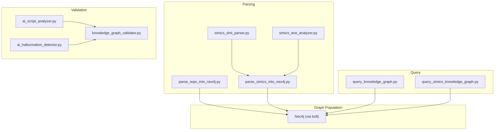
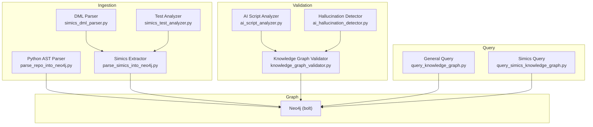
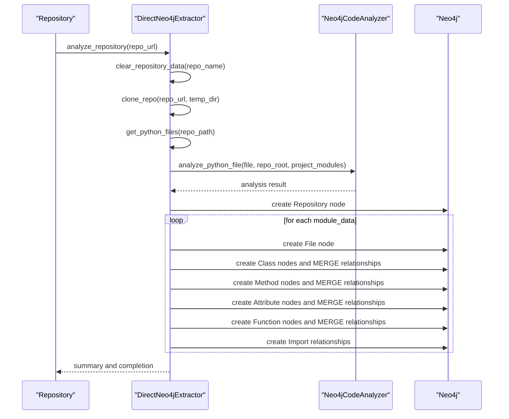
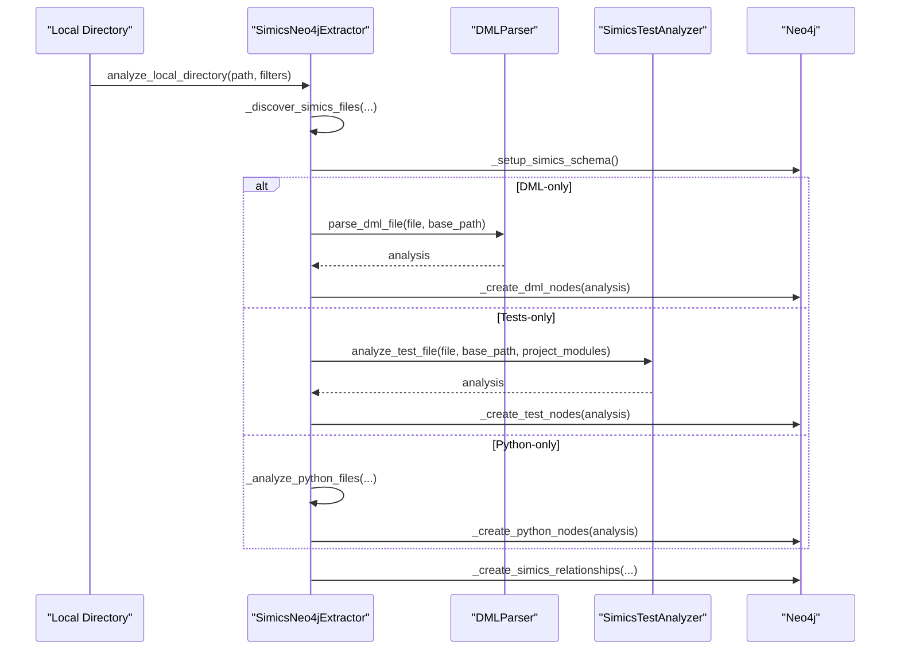
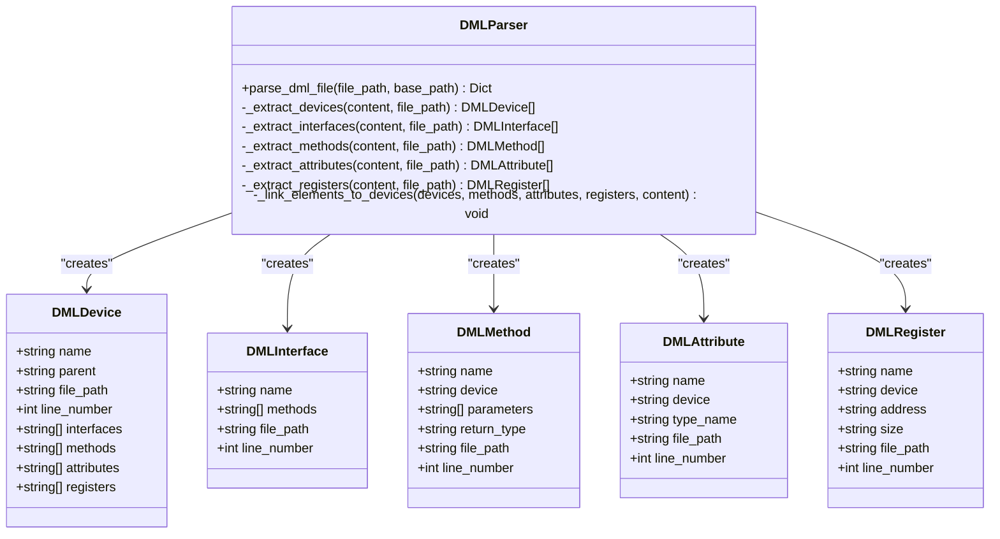
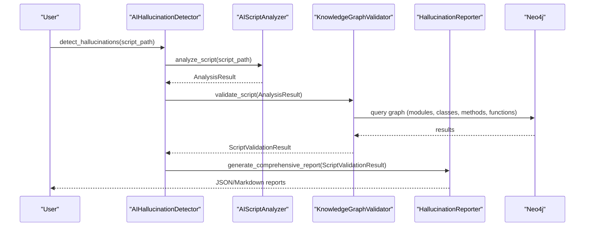
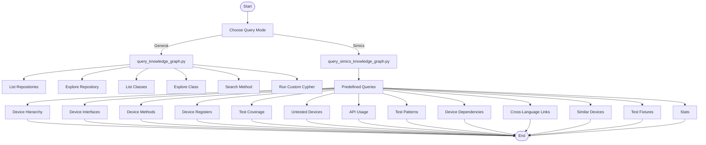
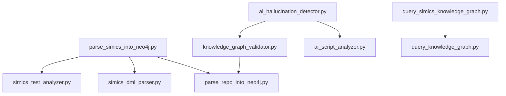

# Knowledge Graph Architecture

<cite>
**Referenced Files in This Document**
- [parse_repo_into_neo4j.py](file://knowledge_graphs/parse_repo_into_neo4j.py)
- [parse_simics_into_neo4j.py](file://knowledge_graphs/parse_simics_into_neo4j.py)
- [simics_dml_parser.py](file://knowledge_graphs/simics_dml_parser.py)
- [simics_test_analyzer.py](file://knowledge_graphs/simics_test_analyzer.py)
- [query_knowledge_graph.py](file://knowledge_graphs/query_knowledge_graph.py)
- [query_simics_knowledge_graph.py](file://knowledge_graphs/query_simics_knowledge_graph.py)
- [knowledge_graph_validator.py](file://knowledge_graphs/knowledge_graph_validator.py)
- [ai_hallucination_detector.py](file://knowledge_graphs/ai_hallucination_detector.py)
- [ai_script_analyzer.py](file://knowledge_graphs/ai_script_analyzer.py)
- [CODE_FLOW_DIAGRAM.md](file://CODE_FLOW_DIAGRAM.md)
</cite>

## Table of Contents
1. [Introduction](#introduction)
2. [Project Structure](#project-structure)
3. [Core Components](#core-components)
4. [Architecture Overview](#architecture-overview)
5. [Detailed Component Analysis](#detailed-component-analysis)
6. [Dependency Analysis](#dependency-analysis)
7. [Performance Considerations](#performance-considerations)
8. [Troubleshooting Guide](#troubleshooting-guide)
9. [Conclusion](#conclusion)
10. [Appendices](#appendices)

## Introduction
This document describes the knowledge graph system architecture for modeling source code and Simics Device Modeling Language (DML) content. It covers:
- Neo4j schema design for nodes and relationships
- Parsing workflows from source code to graph population
- AI hallucination detection via graph validation and script analysis
- Query interfaces for exploration and domain-specific insights
- Use cases for code validation, dependency analysis, and cross-referencing

## Project Structure
The knowledge graph system is organized around a set of Python modules that:
- Parse and extract structural information from Python and DML sources
- Populate Neo4j with nodes and relationships
- Provide query interfaces for exploration and domain-specific analytics
- Validate AI-generated scripts against the knowledge graph to detect hallucinations



**Diagram sources**
- [parse_repo_into_neo4j.py](file://knowledge_graphs/parse_repo_into_neo4j.py#L1-L120)
- [parse_simics_into_neo4j.py](file://knowledge_graphs/parse_simics_into_neo4j.py#L1-L120)
- [simics_dml_parser.py](file://knowledge_graphs/simics_dml_parser.py#L1-L120)
- [simics_test_analyzer.py](file://knowledge_graphs/simics_test_analyzer.py#L1-L120)
- [knowledge_graph_validator.py](file://knowledge_graphs/knowledge_graph_validator.py#L1-L120)
- [ai_script_analyzer.py](file://knowledge_graphs/ai_script_analyzer.py#L1-L120)
- [ai_hallucination_detector.py](file://knowledge_graphs/ai_hallucination_detector.py#L1-L120)
- [query_knowledge_graph.py](file://knowledge_graphs/query_knowledge_graph.py#L1-L120)
- [query_simics_knowledge_graph.py](file://knowledge_graphs/query_simics_knowledge_graph.py#L1-L120)

**Section sources**
- [parse_repo_into_neo4j.py](file://knowledge_graphs/parse_repo_into_neo4j.py#L1-L120)
- [parse_simics_into_neo4j.py](file://knowledge_graphs/parse_simics_into_neo4j.py#L1-L120)
- [simics_dml_parser.py](file://knowledge_graphs/simics_dml_parser.py#L1-L120)
- [simics_test_analyzer.py](file://knowledge_graphs/simics_test_analyzer.py#L1-L120)
- [query_knowledge_graph.py](file://knowledge_graphs/query_knowledge_graph.py#L1-L120)
- [query_simics_knowledge_graph.py](file://knowledge_graphs/query_simics_knowledge_graph.py#L1-L120)
- [knowledge_graph_validator.py](file://knowledge_graphs/knowledge_graph_validator.py#L1-L120)
- [ai_hallucination_detector.py](file://knowledge_graphs/ai_hallucination_detector.py#L1-L120)
- [ai_script_analyzer.py](file://knowledge_graphs/ai_script_analyzer.py#L1-L120)

## Core Components
- Neo4j graph population:
  - Python repository analyzer and extractor
  - Simics-aware extractor for DML, tests, and Python
- Structural parsers:
  - DML parser for devices, interfaces, methods, attributes, registers
  - Simics test analyzer extending Python AST analysis
- Validation and query:
  - Knowledge graph validator for imports, classes, methods, attributes, functions
  - Query interfaces for general and Simics-specific exploration
  - AI hallucination detector orchestrating analyzer and validator

**Section sources**
- [parse_repo_into_neo4j.py](file://knowledge_graphs/parse_repo_into_neo4j.py#L1-L120)
- [parse_simics_into_neo4j.py](file://knowledge_graphs/parse_simics_into_neo4j.py#L1-L120)
- [simics_dml_parser.py](file://knowledge_graphs/simics_dml_parser.py#L1-L120)
- [simics_test_analyzer.py](file://knowledge_graphs/simics_test_analyzer.py#L1-L120)
- [knowledge_graph_validator.py](file://knowledge_graphs/knowledge_graph_validator.py#L1-L120)
- [query_knowledge_graph.py](file://knowledge_graphs/query_knowledge_graph.py#L1-L120)
- [query_simics_knowledge_graph.py](file://knowledge_graphs/query_simics_knowledge_graph.py#L1-L120)
- [ai_hallucination_detector.py](file://knowledge_graphs/ai_hallucination_detector.py#L1-L120)
- [ai_script_analyzer.py](file://knowledge_graphs/ai_script_analyzer.py#L1-L120)

## Architecture Overview
The system follows a layered architecture:
- Data ingestion layer: parsers and extractors populate Neo4j
- Graph layer: nodes and relationships represent code structure
- Validation layer: graph-backed checks for AI-generated scripts
- Query layer: interactive and domain-specific interfaces



**Diagram sources**
- [parse_repo_into_neo4j.py](file://knowledge_graphs/parse_repo_into_neo4j.py#L1-L120)
- [parse_simics_into_neo4j.py](file://knowledge_graphs/parse_simics_into_neo4j.py#L1-L120)
- [simics_dml_parser.py](file://knowledge_graphs/simics_dml_parser.py#L1-L120)
- [simics_test_analyzer.py](file://knowledge_graphs/simics_test_analyzer.py#L1-L120)
- [knowledge_graph_validator.py](file://knowledge_graphs/knowledge_graph_validator.py#L1-L120)
- [ai_script_analyzer.py](file://knowledge_graphs/ai_script_analyzer.py#L1-L120)
- [ai_hallucination_detector.py](file://knowledge_graphs/ai_hallucination_detector.py#L1-L120)
- [query_knowledge_graph.py](file://knowledge_graphs/query_knowledge_graph.py#L1-L120)
- [query_simics_knowledge_graph.py](file://knowledge_graphs/query_simics_knowledge_graph.py#L1-L120)

## Detailed Component Analysis

### Neo4j Schema Design
Nodes and relationships are designed to reflect code structure and Simics specifics.

```mermaid
erDiagram
REPOSITORY {
string name PK
datetime created_at
}
FILE {
string path PK
string name
string module_name
int line_count
string file_type
}
CLASS {
string full_name PK
string name
datetime created_at
}
METHOD {
string method_id PK
string name
string full_name
list args
list params_list
list params_detailed
string return_type
datetime created_at
}
ATTRIBUTE {
string attr_id PK
string name
string full_name
string type
datetime created_at
}
FUNCTION {
string func_id PK
string name
string full_name
list args
list params_list
list params_detailed
string return_type
datetime created_at
}
IMPORT {
string source_path
string target_path
}
REPOSITORY ||--o{ FILE : "CONTAINS"
FILE ||--o{ CLASS : "DEFINES"
FILE ||--o{ FUNCTION : "DEFINES"
CLASS ||--o{ METHOD : "HAS_METHOD"
CLASS ||--o{ ATTRIBUTE : "HAS_ATTRIBUTE"
FILE ||--o{ IMPORT : "IMPORTS"
```

Notes:
- Unique constraints and indexes are created for performance and integrity.
- Python-specific nodes include File, Class, Method, Attribute, Function.
- Simics-specific additions include DMLFile, DMLDevice, DMLInterface, DMLMethod, DMLAttribute, DMLRegister, TestFile, TestFunction, TestFixture, SimicsAPI, DeviceUnderTest, and relationships like INHERITS_FROM, DEFINES, IMPLEMENTS, HAS_METHOD, HAS_ATTRIBUTE, HAS_REGISTER, TESTS, USES_API.

**Diagram sources**
- [parse_repo_into_neo4j.py](file://knowledge_graphs/parse_repo_into_neo4j.py#L420-L470)
- [parse_repo_into_neo4j.py](file://knowledge_graphs/parse_repo_into_neo4j.py#L612-L783)
- [parse_simics_into_neo4j.py](file://knowledge_graphs/parse_simics_into_neo4j.py#L182-L224)
- [parse_simics_into_neo4j.py](file://knowledge_graphs/parse_simics_into_neo4j.py#L311-L468)

**Section sources**
- [parse_repo_into_neo4j.py](file://knowledge_graphs/parse_repo_into_neo4j.py#L420-L470)
- [parse_repo_into_neo4j.py](file://knowledge_graphs/parse_repo_into_neo4j.py#L612-L783)
- [parse_simics_into_neo4j.py](file://knowledge_graphs/parse_simics_into_neo4j.py#L182-L224)
- [parse_simics_into_neo4j.py](file://knowledge_graphs/parse_simics_into_neo4j.py#L311-L468)

### Parsing Workflow: Python Repository
The repository analyzer performs:
- Cloning and scanning for Python files
- First pass to discover project modules
- Second pass to analyze files via AST
- Graph creation with MERGE semantics to avoid duplicates
- Import relationship creation based on module matching



**Diagram sources**
- [parse_repo_into_neo4j.py](file://knowledge_graphs/parse_repo_into_neo4j.py#L529-L611)
- [parse_repo_into_neo4j.py](file://knowledge_graphs/parse_repo_into_neo4j.py#L612-L783)

**Section sources**
- [parse_repo_into_neo4j.py](file://knowledge_graphs/parse_repo_into_neo4j.py#L529-L611)
- [parse_repo_into_neo4j.py](file://knowledge_graphs/parse_repo_into_neo4j.py#L612-L783)

### Parsing Workflow: Simics DML and Tests
The Simics extractor:
- Discovers DML, test, and Python files locally
- Sets up Simics-specific constraints and indexes
- Parses DML and test files, then creates nodes and relationships
- Links tests to DML devices and other Simics constructs



**Diagram sources**
- [parse_simics_into_neo4j.py](file://knowledge_graphs/parse_simics_into_neo4j.py#L54-L121)
- [parse_simics_into_neo4j.py](file://knowledge_graphs/parse_simics_into_neo4j.py#L182-L224)
- [parse_simics_into_neo4j.py](file://knowledge_graphs/parse_simics_into_neo4j.py#L225-L310)
- [parse_simics_into_neo4j.py](file://knowledge_graphs/parse_simics_into_neo4j.py#L311-L468)
- [parse_simics_into_neo4j.py](file://knowledge_graphs/parse_simics_into_neo4j.py#L469-L563)
- [simics_dml_parser.py](file://knowledge_graphs/simics_dml_parser.py#L120-L179)
- [simics_test_analyzer.py](file://knowledge_graphs/simics_test_analyzer.py#L90-L159)

**Section sources**
- [parse_simics_into_neo4j.py](file://knowledge_graphs/parse_simics_into_neo4j.py#L54-L121)
- [parse_simics_into_neo4j.py](file://knowledge_graphs/parse_simics_into_neo4j.py#L182-L224)
- [parse_simics_into_neo4j.py](file://knowledge_graphs/parse_simics_into_neo4j.py#L225-L310)
- [parse_simics_into_neo4j.py](file://knowledge_graphs/parse_simics_into_neo4j.py#L311-L468)
- [parse_simics_into_neo4j.py](file://knowledge_graphs/parse_simics_into_neo4j.py#L469-L563)
- [simics_dml_parser.py](file://knowledge_graphs/simics_dml_parser.py#L120-L179)
- [simics_test_analyzer.py](file://knowledge_graphs/simics_test_analyzer.py#L90-L159)

### DML Parsing Model
DML parsing extracts devices, interfaces, methods, attributes, registers, and links them to devices.



**Diagram sources**
- [simics_dml_parser.py](file://knowledge_graphs/simics_dml_parser.py#L19-L86)
- [simics_dml_parser.py](file://knowledge_graphs/simics_dml_parser.py#L87-L179)

**Section sources**
- [simics_dml_parser.py](file://knowledge_graphs/simics_dml_parser.py#L19-L86)
- [simics_dml_parser.py](file://knowledge_graphs/simics_dml_parser.py#L87-L179)

### AI Hallucination Detection Process
The detector orchestrates AST analysis, graph validation, and reporting.



**Diagram sources**
- [ai_hallucination_detector.py](file://knowledge_graphs/ai_hallucination_detector.py#L48-L126)
- [ai_script_analyzer.py](file://knowledge_graphs/ai_script_analyzer.py#L93-L133)
- [knowledge_graph_validator.py](file://knowledge_graphs/knowledge_graph_validator.py#L129-L164)
- [knowledge_graph_validator.py](file://knowledge_graphs/knowledge_graph_validator.py#L642-L804)

**Section sources**
- [ai_hallucination_detector.py](file://knowledge_graphs/ai_hallucination_detector.py#L48-L126)
- [ai_script_analyzer.py](file://knowledge_graphs/ai_script_analyzer.py#L93-L133)
- [knowledge_graph_validator.py](file://knowledge_graphs/knowledge_graph_validator.py#L129-L164)
- [knowledge_graph_validator.py](file://knowledge_graphs/knowledge_graph_validator.py#L642-L804)

### Query Interfaces
- General query tool explores repositories, classes, methods, and runs custom Cypher.
- Simics query tool provides domain-specific queries for device hierarchy, test coverage, API usage, fixtures, and statistics.



**Diagram sources**
- [query_knowledge_graph.py](file://knowledge_graphs/query_knowledge_graph.py#L39-L211)
- [query_knowledge_graph.py](file://knowledge_graphs/query_knowledge_graph.py#L212-L294)
- [query_simics_knowledge_graph.py](file://knowledge_graphs/query_simics_knowledge_graph.py#L30-L113)
- [query_simics_knowledge_graph.py](file://knowledge_graphs/query_simics_knowledge_graph.py#L114-L245)
- [query_simics_knowledge_graph.py](file://knowledge_graphs/query_simics_knowledge_graph.py#L246-L450)

**Section sources**
- [query_knowledge_graph.py](file://knowledge_graphs/query_knowledge_graph.py#L39-L211)
- [query_knowledge_graph.py](file://knowledge_graphs/query_knowledge_graph.py#L212-L294)
- [query_simics_knowledge_graph.py](file://knowledge_graphs/query_simics_knowledge_graph.py#L30-L113)
- [query_simics_knowledge_graph.py](file://knowledge_graphs/query_simics_knowledge_graph.py#L114-L245)
- [query_simics_knowledge_graph.py](file://knowledge_graphs/query_simics_knowledge_graph.py#L246-L450)

## Dependency Analysis
Key dependencies and relationships:
- parse_simics_into_neo4j.py imports and extends DirectNeo4jExtractor and Neo4jCodeAnalyzer from parse_repo_into_neo4j.py
- SimicsNeo4jExtractor composes DMLParser and SimicsTestAnalyzer
- KnowledgeGraphValidator depends on Neo4j for graph queries
- AIHallucinationDetector composes AIScriptAnalyzer, KnowledgeGraphValidator, and HallucinationReporter
- Query interfaces depend on KnowledgeGraphQuerier



**Diagram sources**
- [parse_simics_into_neo4j.py](file://knowledge_graphs/parse_simics_into_neo4j.py#L33-L53)
- [simics_dml_parser.py](file://knowledge_graphs/simics_dml_parser.py#L1-L20)
- [simics_test_analyzer.py](file://knowledge_graphs/simics_test_analyzer.py#L12-L21)
- [knowledge_graph_validator.py](file://knowledge_graphs/knowledge_graph_validator.py#L1-L21)
- [ai_script_analyzer.py](file://knowledge_graphs/ai_script_analyzer.py#L1-L20)
- [ai_hallucination_detector.py](file://knowledge_graphs/ai_hallucination_detector.py#L16-L30)
- [query_knowledge_graph.py](file://knowledge_graphs/query_knowledge_graph.py#L1-L20)
- [query_simics_knowledge_graph.py](file://knowledge_graphs/query_simics_knowledge_graph.py#L21-L33)

**Section sources**
- [parse_simics_into_neo4j.py](file://knowledge_graphs/parse_simics_into_neo4j.py#L33-L53)
- [simics_dml_parser.py](file://knowledge_graphs/simics_dml_parser.py#L1-L20)
- [simics_test_analyzer.py](file://knowledge_graphs/simics_test_analyzer.py#L12-L21)
- [knowledge_graph_validator.py](file://knowledge_graphs/knowledge_graph_validator.py#L1-L21)
- [ai_script_analyzer.py](file://knowledge_graphs/ai_script_analyzer.py#L1-L20)
- [ai_hallucination_detector.py](file://knowledge_graphs/ai_hallucination_detector.py#L16-L30)
- [query_knowledge_graph.py](file://knowledge_graphs/query_knowledge_graph.py#L1-L20)
- [query_simics_knowledge_graph.py](file://knowledge_graphs/query_simics_knowledge_graph.py#L21-L33)

## Performance Considerations
- Constraints and indexes:
  - Unique constraints for File.path and DML nodes
  - Indexes on File.name, Class.name, Method.name for efficient lookups
- MERGE semantics:
  - Used to avoid duplicate nodes and relationships during ingestion
- Caching:
  - KnowledgeGraphValidator caches module and class lookups to reduce repeated queries
- Filtering:
  - Excludes test files and large files to keep ingestion fast
- Asynchronous Neo4j driver:
  - Uses AsyncGraphDatabase for concurrent operations

**Section sources**
- [parse_repo_into_neo4j.py](file://knowledge_graphs/parse_repo_into_neo4j.py#L420-L470)
- [parse_simics_into_neo4j.py](file://knowledge_graphs/parse_simics_into_neo4j.py#L182-L224)
- [knowledge_graph_validator.py](file://knowledge_graphs/knowledge_graph_validator.py#L100-L115)

## Troubleshooting Guide
Common issues and resolutions:
- Neo4j connectivity:
  - Ensure NEO4J_URI, NEO4J_USER, and NEO4J_PASSWORD are configured
  - Verify Neo4j service is running and reachable
- Duplicate nodes:
  - MERGE is used to prevent duplicates; if duplicates appear, check uniqueness constraints and indexes
- Large files:
  - Files larger than a threshold are skipped; adjust thresholds if needed
- Import resolution:
  - External modules are treated as uncertain; confirm module names and repository matching logic
- Query timeouts:
  - Use LIMIT clauses and targeted queries; leverage indexes on frequently queried properties

**Section sources**
- [query_knowledge_graph.py](file://knowledge_graphs/query_knowledge_graph.py#L350-L399)
- [parse_repo_into_neo4j.py](file://knowledge_graphs/parse_repo_into_neo4j.py#L508-L528)
- [knowledge_graph_validator.py](file://knowledge_graphs/knowledge_graph_validator.py#L642-L804)

## Conclusion
The knowledge graph system provides a robust foundation for code and Simics DML analysis:
- Structured schema enables rich relationships between files, classes, methods, attributes, functions, and Simics constructs
- Automated ingestion pipelines populate the graph efficiently with constraints and indexes
- Validation against the graph detects AI hallucinations by checking imports, classes, methods, attributes, and functions
- Query interfaces offer both general exploration and Simics-specific insights for dependency analysis and cross-referencing

## Appendices

### Use Cases
- Code validation:
  - Validate imports, class instantiations, method calls, attribute accesses, and function calls against the graph
- Dependency analysis:
  - Analyze device inheritance, interface implementations, and relationships between DML devices and tests
- Cross-referencing:
  - Link Python tests to DML devices and Simics APIs to understand usage patterns

**Section sources**
- [knowledge_graph_validator.py](file://knowledge_graphs/knowledge_graph_validator.py#L129-L164)
- [query_simics_knowledge_graph.py](file://knowledge_graphs/query_simics_knowledge_graph.py#L70-L167)
- [parse_simics_into_neo4j.py](file://knowledge_graphs/parse_simics_into_neo4j.py#L564-L618)

### System-wide Flow Reference
For broader context on summarization and chunking flows in the repository, refer to the provided diagram.

**Section sources**
- [CODE_FLOW_DIAGRAM.md](file://CODE_FLOW_DIAGRAM.md#L1-L254)