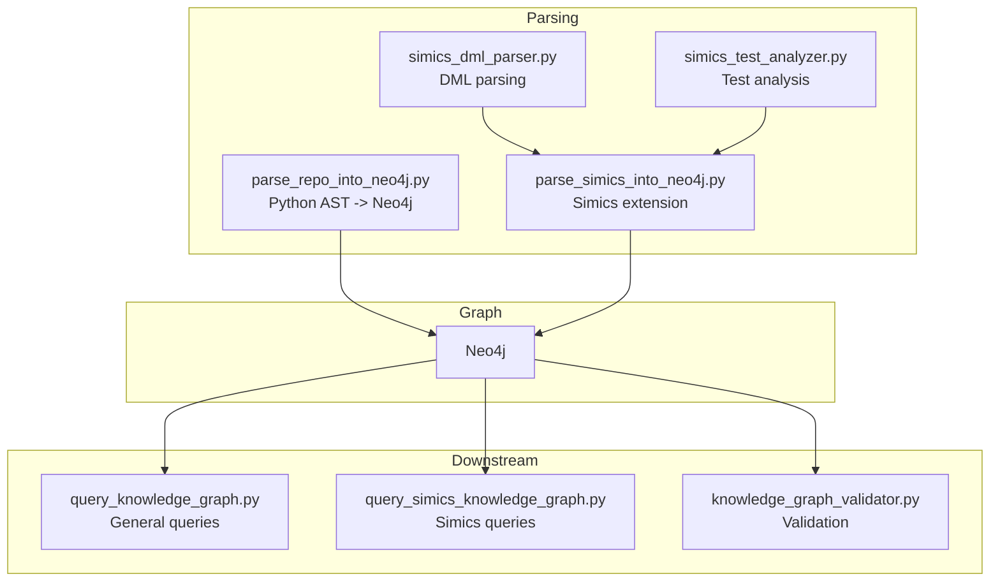
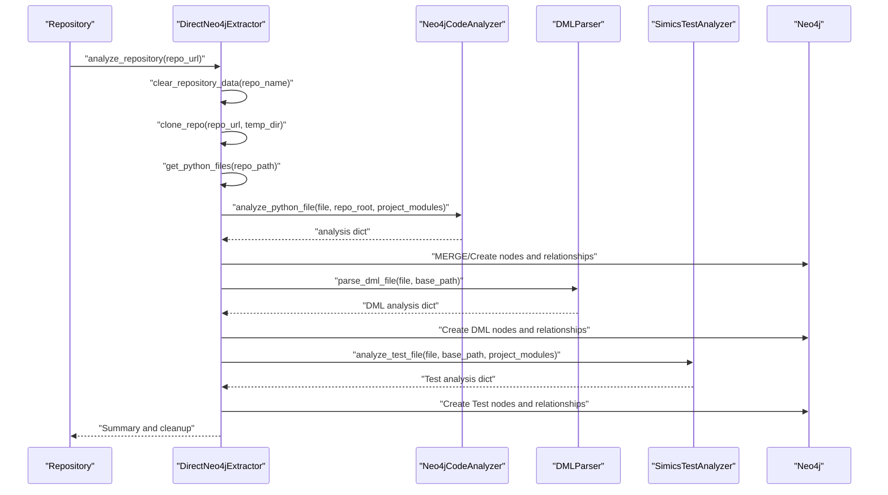
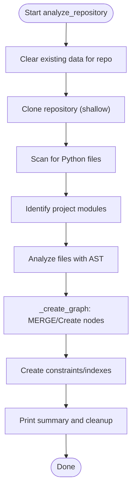
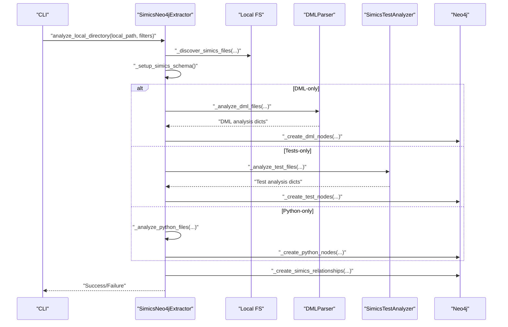
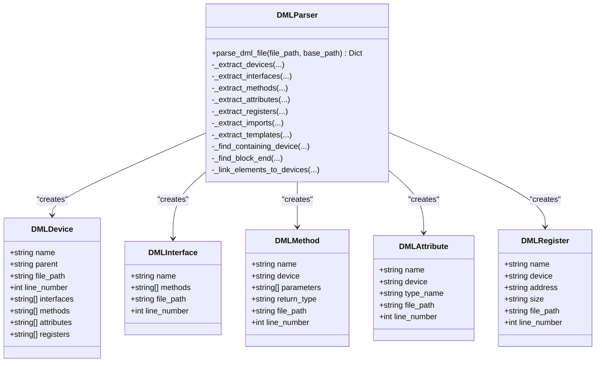
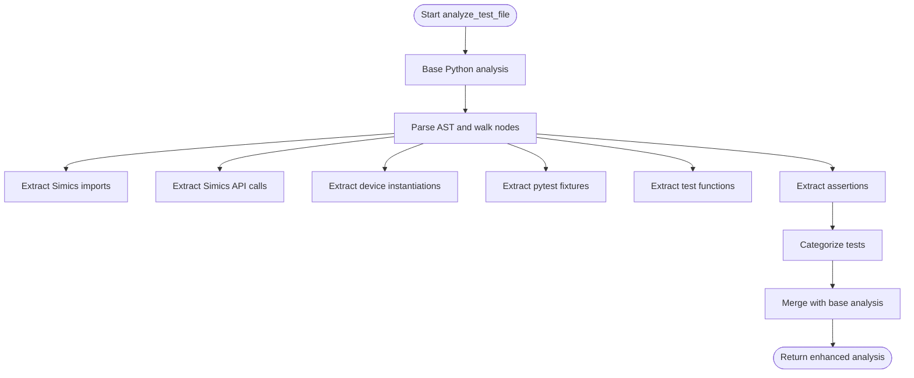
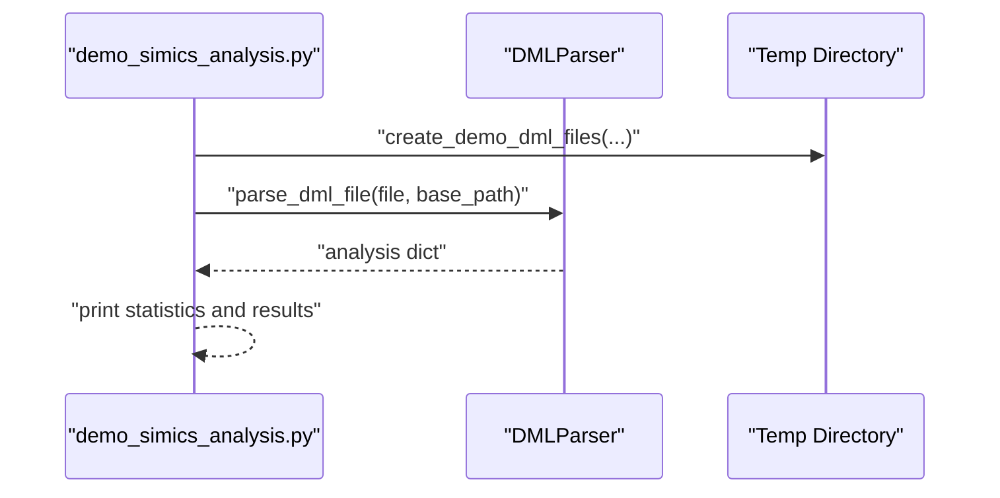
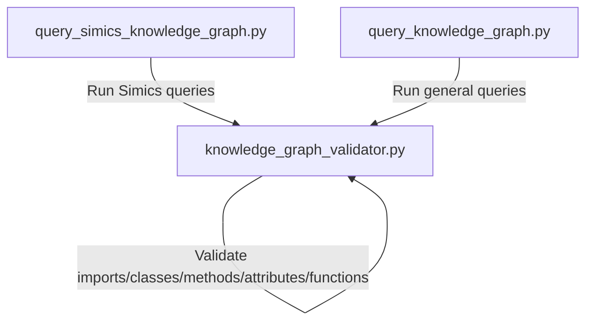
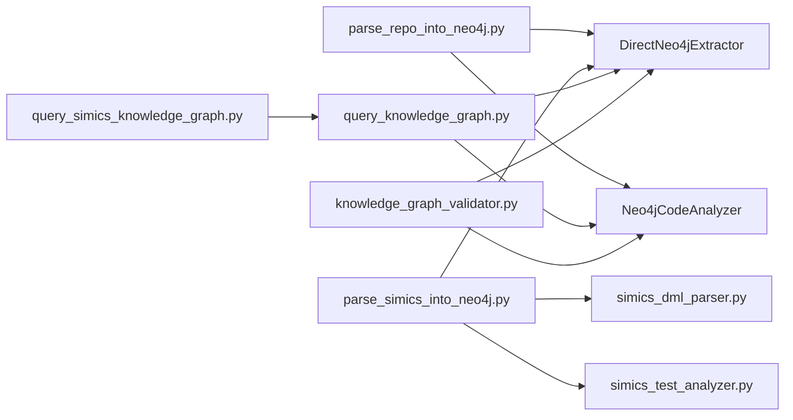

# Knowledge Graph Parsing Pipeline

<cite>
**Referenced Files in This Document**
- [parse_repo_into_neo4j.py](file://knowledge_graphs/parse_repo_into_neo4j.py)
- [parse_simics_into_neo4j.py](file://knowledge_graphs/parse_simics_into_neo4j.py)
- [simics_dml_parser.py](file://knowledge_graphs/simics_dml_parser.py)
- [simics_test_analyzer.py](file://knowledge_graphs/simics_test_analyzer.py)
- [demo_simics_analysis.py](file://knowledge_graphs/demo_simics_analysis.py)
- [query_knowledge_graph.py](file://knowledge_graphs/query_knowledge_graph.py)
- [query_simics_knowledge_graph.py](file://knowledge_graphs/query_simics_knowledge_graph.py)
- [knowledge_graph_validator.py](file://knowledge_graphs/knowledge_graph_validator.py)
</cite>

## Table of Contents
1. [Introduction](#introduction)
2. [Project Structure](#project-structure)
3. [Core Components](#core-components)
4. [Architecture Overview](#architecture-overview)
5. [Detailed Component Analysis](#detailed-component-analysis)
6. [Dependency Analysis](#dependency-analysis)
7. [Performance Considerations](#performance-considerations)
8. [Troubleshooting Guide](#troubleshooting-guide)
9. [Conclusion](#conclusion)
10. [Appendices](#appendices)

## Introduction
This document explains the knowledge graph parsing pipeline that transforms source code and Simics Device Modeling Language (DML) into a Neo4j graph. It covers:
- General repository parsing via Python AST to create File, Class, Method, Function, and Import relationships
- Simics-specific processing for DML, Python test files, and local directory analysis
- The role of the DML parser in extracting devices, interfaces, methods, attributes, registers, and templates
- Transformation from raw artifacts to Neo4j nodes and relationships, including error handling and edge cases
- Concrete execution flow demonstrated by the demo script
- Integration points with downstream validation and querying
- Performance considerations and incremental parsing strategies

## Project Structure
The knowledge graph pipeline spans several modules:
- General repository parsing: Python AST-based extraction and Neo4j insertion
- Simics extension: DML parsing, test analysis, and local directory traversal
- Query interfaces: general and Simics-specific graph exploration
- Validation: cross-checking generated code against the knowledge graph



**Diagram sources**
- [parse_repo_into_neo4j.py](file://knowledge_graphs/parse_repo_into_neo4j.py#L1-L120)
- [parse_simics_into_neo4j.py](file://knowledge_graphs/parse_simics_into_neo4j.py#L1-L120)
- [simics_dml_parser.py](file://knowledge_graphs/simics_dml_parser.py#L1-L120)
- [simics_test_analyzer.py](file://knowledge_graphs/simics_test_analyzer.py#L1-L120)
- [query_knowledge_graph.py](file://knowledge_graphs/query_knowledge_graph.py#L1-L120)
- [query_simics_knowledge_graph.py](file://knowledge_graphs/query_simics_knowledge_graph.py#L1-L120)
- [knowledge_graph_validator.py](file://knowledge_graphs/knowledge_graph_validator.py#L1-L120)

**Section sources**
- [parse_repo_into_neo4j.py](file://knowledge_graphs/parse_repo_into_neo4j.py#L1-L120)
- [parse_simics_into_neo4j.py](file://knowledge_graphs/parse_simics_into_neo4j.py#L1-L120)

## Core Components
- Neo4jCodeAnalyzer: Python AST-based analyzer that extracts classes, methods, functions, and imports, plus robust type and parameter extraction.
- DirectNeo4jExtractor: Orchestrates cloning repositories, scanning files, building analysis results, and inserting nodes/relationships into Neo4j with constraints and indexes.
- SimicsNeo4jExtractor: Extends the base extractor to support DML, Python tests, and local directory analysis; creates Simics-specific nodes and relationships.
- DMLParser: Regex-based parser for DML files that identifies devices, interfaces, methods, attributes, registers, imports, and templates.
- SimicsTestAnalyzer: Enhances Python AST analysis with Simics-specific patterns for API calls, device instantiations, fixtures, and test categories.
- Query interfaces: Provide programmatic and interactive access to the knowledge graph for general and Simics-specific insights.
- KnowledgeGraphValidator: Validates generated code against the knowledge graph to detect hallucinations and parameter mismatches.

**Section sources**
- [parse_repo_into_neo4j.py](file://knowledge_graphs/parse_repo_into_neo4j.py#L36-L120)
- [parse_repo_into_neo4j.py](file://knowledge_graphs/parse_repo_into_neo4j.py#L396-L528)
- [parse_simics_into_neo4j.py](file://knowledge_graphs/parse_simics_into_neo4j.py#L38-L120)
- [simics_dml_parser.py](file://knowledge_graphs/simics_dml_parser.py#L19-L120)
- [simics_test_analyzer.py](file://knowledge_graphs/simics_test_analyzer.py#L62-L160)
- [query_knowledge_graph.py](file://knowledge_graphs/query_knowledge_graph.py#L1-L120)
- [query_simics_knowledge_graph.py](file://knowledge_graphs/query_simics_knowledge_graph.py#L1-L120)
- [knowledge_graph_validator.py](file://knowledge_graphs/knowledge_graph_validator.py#L100-L220)

## Architecture Overview
The pipeline follows a layered approach:
- Extraction: Python AST and DML regex parsing produce structured analysis results
- Normalization: Unified IDs and MERGE semantics prevent duplicates
- Graph construction: Nodes and relationships are inserted with constraints and indexes
- Downstream usage: Query interfaces and validation consume the graph



**Diagram sources**
- [parse_repo_into_neo4j.py](file://knowledge_graphs/parse_repo_into_neo4j.py#L529-L612)
- [parse_repo_into_neo4j.py](file://knowledge_graphs/parse_repo_into_neo4j.py#L612-L783)
- [parse_simics_into_neo4j.py](file://knowledge_graphs/parse_simics_into_neo4j.py#L225-L310)
- [simics_dml_parser.py](file://knowledge_graphs/simics_dml_parser.py#L120-L179)
- [simics_test_analyzer.py](file://knowledge_graphs/simics_test_analyzer.py#L90-L159)

## Detailed Component Analysis

### General Repository Parsing: parse_repo_into_neo4j.py
- Purpose: Convert Python repositories into a Neo4j graph with File, Class, Method, Function, and Import relationships.
- Key responsibilities:
  - Clone repository (shallow) and scan for Python files
  - Identify project modules and compute module names
  - Analyze files with AST to extract classes, methods, functions, and imports
  - Normalize parameter types and defaults; support positional, keyword-only, varargs, and varkwargs
  - Insert nodes and relationships with MERGE to avoid duplicates
  - Create constraints and indexes for performance
  - Provide search helpers for imports and class membership
- Error handling:
  - Per-file analysis returns None on failure; logging continues
  - Cleanup handles permission errors and partial removal
- Edge cases:
  - Internal vs external imports are distinguished
  - Module name inference accounts for packages and common project roots
  - Large files are skipped based on size thresholds



**Diagram sources**
- [parse_repo_into_neo4j.py](file://knowledge_graphs/parse_repo_into_neo4j.py#L529-L612)
- [parse_repo_into_neo4j.py](file://knowledge_graphs/parse_repo_into_neo4j.py#L612-L783)

**Section sources**
- [parse_repo_into_neo4j.py](file://knowledge_graphs/parse_repo_into_neo4j.py#L529-L612)
- [parse_repo_into_neo4j.py](file://knowledge_graphs/parse_repo_into_neo4j.py#L612-L783)

### Simics-Specific Processing: parse_simics_into_neo4j.py
- Purpose: Extend the general pipeline to handle Simics DML, Python tests, and local directories.
- Key responsibilities:
  - Local directory discovery for DML, test, and Python files
  - Setup Simics-specific constraints and indexes
  - Parse DML files and create DMLFile, DMLDevice, DMLInterface, DMLMethod, DMLAttribute, DMLRegister nodes
  - Parse Python test files with SimicsTestAnalyzer and create TestFile, TestFunction, SimicsAPI, TestFixture nodes
  - Create relationships between tests and DML devices, and between Python code and DML devices
  - CLI entry point supports local path or repository URL
- Error handling:
  - Graceful warnings for parsing/test analysis failures
  - Schema setup tolerates existing constraints/indexes
- Integration:
  - Inherits from DirectNeo4jExtractor to reuse graph creation logic



**Diagram sources**
- [parse_simics_into_neo4j.py](file://knowledge_graphs/parse_simics_into_neo4j.py#L54-L128)
- [parse_simics_into_neo4j.py](file://knowledge_graphs/parse_simics_into_neo4j.py#L182-L224)
- [parse_simics_into_neo4j.py](file://knowledge_graphs/parse_simics_into_neo4j.py#L225-L310)
- [parse_simics_into_neo4j.py](file://knowledge_graphs/parse_simics_into_neo4j.py#L311-L563)
- [parse_simics_into_neo4j.py](file://knowledge_graphs/parse_simics_into_neo4j.py#L564-L618)

**Section sources**
- [parse_simics_into_neo4j.py](file://knowledge_graphs/parse_simics_into_neo4j.py#L38-L120)
- [parse_simics_into_neo4j.py](file://knowledge_graphs/parse_simics_into_neo4j.py#L129-L224)
- [parse_simics_into_neo4j.py](file://knowledge_graphs/parse_simics_into_neo4j.py#L225-L310)
- [parse_simics_into_neo4j.py](file://knowledge_graphs/parse_simics_into_neo4j.py#L311-L563)
- [parse_simics_into_neo4j.py](file://knowledge_graphs/parse_simics_into_neo4j.py#L564-L618)

### DML Parsing: simics_dml_parser.py
- Purpose: Extract DML constructs from Simics DML files.
- Key responsibilities:
  - Define dataclasses for DMLDevice, DMLInterface, DMLMethod, DMLAttribute, DMLRegister
  - Use regex patterns to identify devices, interfaces, methods, attributes, registers, imports, and templates
  - Link methods, attributes, and registers to their containing devices
  - Compute line numbers and file paths for provenance
- Edge cases:
  - Handles both semicolon-terminated and brace-delimited device declarations
  - Uses block boundary detection to resolve scoping
  - Aggregates imports and templates for completeness



**Diagram sources**
- [simics_dml_parser.py](file://knowledge_graphs/simics_dml_parser.py#L19-L120)
- [simics_dml_parser.py](file://knowledge_graphs/simics_dml_parser.py#L120-L179)
- [simics_dml_parser.py](file://knowledge_graphs/simics_dml_parser.py#L321-L447)

**Section sources**
- [simics_dml_parser.py](file://knowledge_graphs/simics_dml_parser.py#L19-L120)
- [simics_dml_parser.py](file://knowledge_graphs/simics_dml_parser.py#L120-L179)
- [simics_dml_parser.py](file://knowledge_graphs/simics_dml_parser.py#L321-L447)

### Simics Test Analysis: simics_test_analyzer.py
- Purpose: Enhance Python AST analysis with Simics-specific patterns.
- Key responsibilities:
  - Detect Simics API calls and device instantiations
  - Extract pytest fixtures and categorize tests
  - Build metadata for test functions including devices tested, APIs used, fixtures, and assertions
  - Integrate with the base analyzer to preserve Python structural analysis
- Edge cases:
  - Heuristic extraction of device names from call sites
  - Fixture scope and dependencies inferred from decorators and parameters
  - Categories derived from content heuristics



**Diagram sources**
- [simics_test_analyzer.py](file://knowledge_graphs/simics_test_analyzer.py#L90-L159)
- [simics_test_analyzer.py](file://knowledge_graphs/simics_test_analyzer.py#L160-L347)
- [simics_test_analyzer.py](file://knowledge_graphs/simics_test_analyzer.py#L348-L541)

**Section sources**
- [simics_test_analyzer.py](file://knowledge_graphs/simics_test_analyzer.py#L62-L160)
- [simics_test_analyzer.py](file://knowledge_graphs/simics_test_analyzer.py#L160-L347)
- [simics_test_analyzer.py](file://knowledge_graphs/simics_test_analyzer.py#L348-L541)

### Execution Flow Example: demo_simics_analysis.py
- Demonstrates DML parsing with synthetic files and shows how to analyze a local path
- Creates demo DML files for base device, UART device, enhanced UART, and memory controller
- Generates demo test files for UART and memory controller
- Provides CLI options to run demos and show Neo4j integration steps



**Diagram sources**
- [demo_simics_analysis.py](file://knowledge_graphs/demo_simics_analysis.py#L26-L167)
- [demo_simics_analysis.py](file://knowledge_graphs/demo_simics_analysis.py#L318-L388)
- [simics_dml_parser.py](file://knowledge_graphs/simics_dml_parser.py#L120-L179)

**Section sources**
- [demo_simics_analysis.py](file://knowledge_graphs/demo_simics_analysis.py#L1-L120)
- [demo_simics_analysis.py](file://knowledge_graphs/demo_simics_analysis.py#L120-L240)
- [demo_simics_analysis.py](file://knowledge_graphs/demo_simics_analysis.py#L318-L388)

### Downstream Integration: Query and Validation
- Query interfaces:
  - General: list repositories, explore classes, search methods, run custom queries
  - Simics-specific: device hierarchy, interfaces, methods, registers, test coverage, API usage, fixtures, stats
- Validation:
  - Validates imports, class instantiations, method calls, attribute accesses, and function calls
  - Uses cached lookups and parameter validation against graph schema
  - Detects hallucinations and suggests corrections



**Diagram sources**
- [query_knowledge_graph.py](file://knowledge_graphs/query_knowledge_graph.py#L1-L120)
- [query_simics_knowledge_graph.py](file://knowledge_graphs/query_simics_knowledge_graph.py#L1-L120)
- [knowledge_graph_validator.py](file://knowledge_graphs/knowledge_graph_validator.py#L100-L220)

**Section sources**
- [query_knowledge_graph.py](file://knowledge_graphs/query_knowledge_graph.py#L1-L120)
- [query_simics_knowledge_graph.py](file://knowledge_graphs/query_simics_knowledge_graph.py#L1-L120)
- [knowledge_graph_validator.py](file://knowledge_graphs/knowledge_graph_validator.py#L100-L220)

## Dependency Analysis
- parse_repo_into_neo4j.py defines Neo4jCodeAnalyzer and DirectNeo4jExtractor
- parse_simics_into_neo4j.py imports and extends DirectNeo4jExtractor, and depends on DMLParser and SimicsTestAnalyzer
- simics_dml_parser.py and simics_test_analyzer.py are standalone parsers/utilities
- query_* and knowledge_graph_validator.py depend on Neo4j connectivity and graph schema



**Diagram sources**
- [parse_repo_into_neo4j.py](file://knowledge_graphs/parse_repo_into_neo4j.py#L36-L120)
- [parse_simics_into_neo4j.py](file://knowledge_graphs/parse_simics_into_neo4j.py#L33-L53)
- [simics_dml_parser.py](file://knowledge_graphs/simics_dml_parser.py#L1-L40)
- [simics_test_analyzer.py](file://knowledge_graphs/simics_test_analyzer.py#L1-L40)
- [query_knowledge_graph.py](file://knowledge_graphs/query_knowledge_graph.py#L1-L40)
- [query_simics_knowledge_graph.py](file://knowledge_graphs/query_simics_knowledge_graph.py#L1-L30)
- [knowledge_graph_validator.py](file://knowledge_graphs/knowledge_graph_validator.py#L1-L40)

**Section sources**
- [parse_repo_into_neo4j.py](file://knowledge_graphs/parse_repo_into_neo4j.py#L36-L120)
- [parse_simics_into_neo4j.py](file://knowledge_graphs/parse_simics_into_neo4j.py#L33-L53)

## Performance Considerations
- File filtering:
  - Excludes tests, caches, hidden directories, and large files to reduce overhead
- Shallow cloning:
  - Reduces network and disk usage for repository analysis
- Batched graph operations:
  - Uses MERGE to avoid duplicates and minimize redundant writes
  - Creates indexes and constraints to accelerate lookups
- Caching:
  - KnowledgeGraphValidator caches module/class/method lookups to reduce repeated queries
- Incremental strategies:
  - Clear existing data per repository before reprocessing
  - Consider per-file diffs or selective reprocessing in future iterations
- Concurrency:
  - Asynchronous Neo4j driver usage supports concurrent operations

[No sources needed since this section provides general guidance]

## Troubleshooting Guide
- Neo4j connectivity:
  - Ensure credentials and URI are configured; verify server availability
- Permission issues during cleanup:
  - Logs warn and continue if directories cannot be removed
- Parsing failures:
  - Per-file AST parsing returns None; logs warnings and continues
  - DML parsing returns error entries; continue with remaining files
- Schema conflicts:
  - Constraint/index creation tolerates existing indices; logs warnings
- Validation edge cases:
  - External modules are treated as uncertain rather than errors
  - Parameter validation supports detailed signatures with positional, keyword-only, varargs, and varkwargs

**Section sources**
- [parse_repo_into_neo4j.py](file://knowledge_graphs/parse_repo_into_neo4j.py#L593-L611)
- [parse_repo_into_neo4j.py](file://knowledge_graphs/parse_repo_into_neo4j.py#L437-L479)
- [parse_simics_into_neo4j.py](file://knowledge_graphs/parse_simics_into_neo4j.py#L225-L249)
- [simics_dml_parser.py](file://knowledge_graphs/simics_dml_parser.py#L166-L179)
- [knowledge_graph_validator.py](file://knowledge_graphs/knowledge_graph_validator.py#L214-L226)

## Conclusion
The knowledge graph pipeline provides a robust foundation for transforming source code and Simics DML into a Neo4j graph. It supports general repository parsing, Simics-specific extensions, and downstream querying and validation. The modular design allows for incremental improvements, such as selective reprocessing and enhanced parameter validation, while maintaining strong error handling and performance characteristics.

[No sources needed since this section summarizes without analyzing specific files]

## Appendices

### Data Model Overview
The graph includes nodes and relationships for:
- General: Repository, File, Class, Method, Function, Import relationships
- Simics: DMLFile, DMLDevice, DMLInterface, DMLMethod, DMLAttribute, DMLRegister, TestFile, TestFunction, SimicsAPI, TestFixture, inheritance and usage relationships

```mermaid
erDiagram
REPOSITORY {
string name PK
datetime created_at
}
FILE {
string path PK
string name
string module_name
int line_count
string file_type
}
CLASS {
string full_name PK
string name
datetime created_at
}
METHOD {
string method_id PK
string name
string full_name
string[] args
string[] params_list
string[] params_detailed
string return_type
datetime created_at
}
FUNCTION {
string func_id PK
string name
string full_name
string[] args
string[] params_list
string[] params_detailed
string return_type
datetime created_at
}
ATTRIBUTE {
string attr_id PK
string name
string full_name
string type
datetime created_at
}
REPOSITORY ||--o{ FILE : "CONTAINS"
FILE ||--o{ CLASS : "DEFINES"
FILE ||--o{ FUNCTION : "DEFINES"
CLASS ||--o{ METHOD : "HAS_METHOD"
CLASS ||--o{ ATTRIBUTE : "HAS_ATTRIBUTE"
FILE }o--o{ FILE : "IMPORTS"
```

**Diagram sources**
- [parse_repo_into_neo4j.py](file://knowledge_graphs/parse_repo_into_neo4j.py#L612-L783)