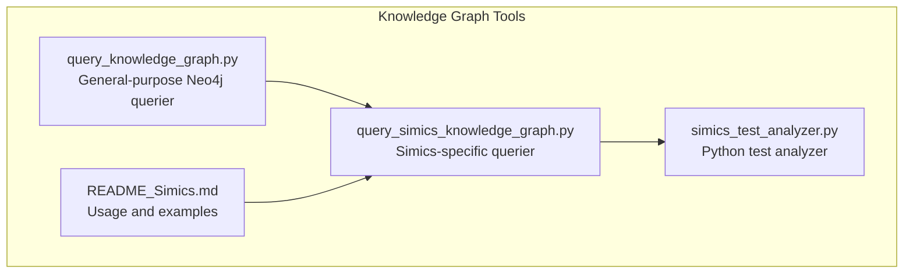
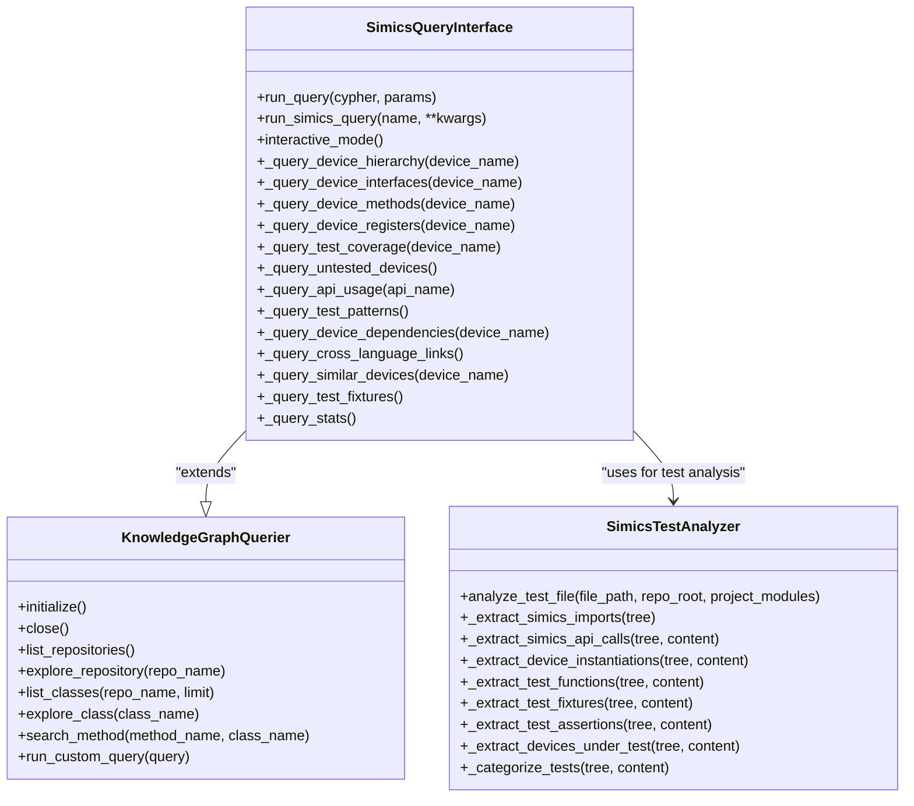
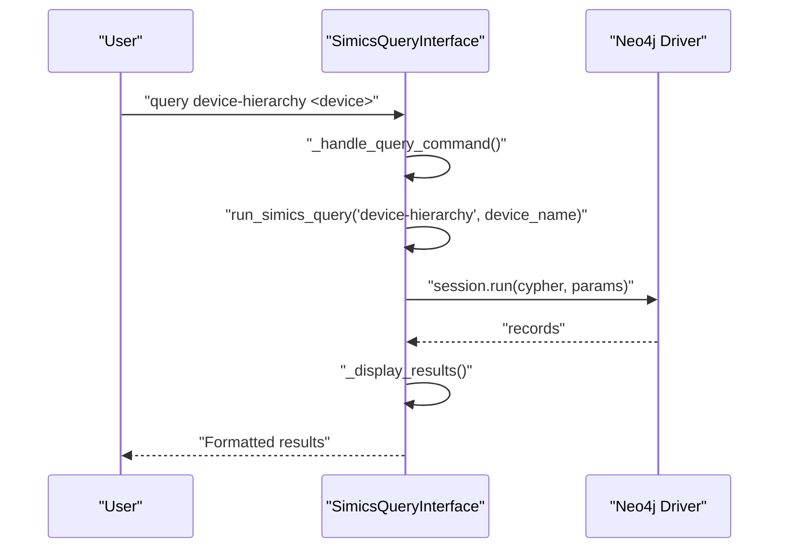
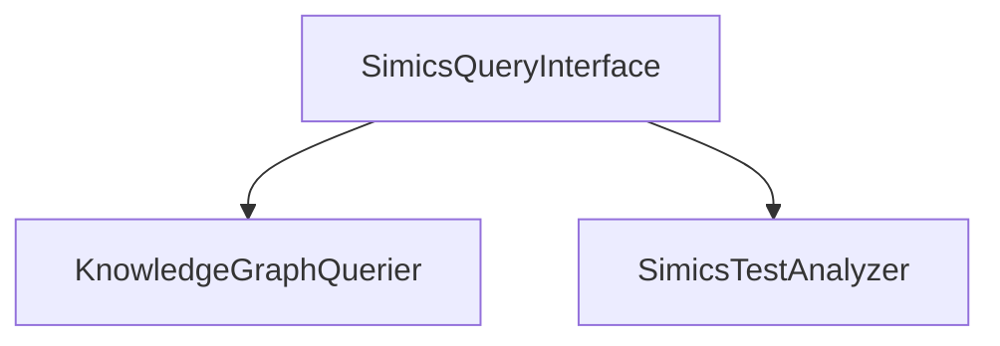
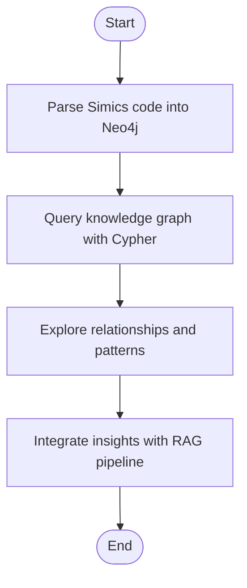

# Knowledge Graph Query Interface

<cite>
**Referenced Files in This Document**
- [query_knowledge_graph.py](file://knowledge_graphs/query_knowledge_graph.py)
- [query_simics_knowledge_graph.py](file://knowledge_graphs/query_simics_knowledge_graph.py)
- [simics_test_analyzer.py](file://knowledge_graphs/simics_test_analyzer.py)
- [README_Simics.md](file://knowledge_graphs/README_Simics.md)
- [CODE_FLOW_DIAGRAM.md](file://CODE_FLOW_DIAGRAM.md)
</cite>

## Table of Contents
1. [Introduction](#introduction)
2. [Project Structure](#project-structure)
3. [Core Components](#core-components)
4. [Architecture Overview](#architecture-overview)
5. [Detailed Component Analysis](#detailed-component-analysis)
6. [Dependency Analysis](#dependency-analysis)
7. [Performance Considerations](#performance-considerations)
8. [Troubleshooting Guide](#troubleshooting-guide)
9. [Conclusion](#conclusion)
10. [Appendices](#appendices)

## Introduction
This document explains the knowledge graph query interface for executing Cypher queries against the Neo4j database. It focuses on:
- The primary interface in query_knowledge_graph.py for general-purpose graph exploration and querying
- Domain-specific extensions in query_simics_knowledge_graph.py for Simics DML pattern matching and test analysis
- Common query patterns for code navigation, dependency tracing, and impact analysis
- Practical examples from simics_test_analyzer.py demonstrating how test analysis integrates with the knowledge graph
- Guidance on constructing efficient queries, handling large result sets, and avoiding performance bottlenecks
- Error handling, query validation, and debugging techniques for complex graph traversals

## Project Structure
The knowledge graph query interface lives under the knowledge_graphs directory and consists of:
- A general-purpose query tool for Neo4j
- A Simics-specific extension that builds on the general tool
- Supporting documentation and examples

**Diagram sources**
- [query_knowledge_graph.py](file://knowledge_graphs/query_knowledge_graph.py#L1-L120)
- [query_simics_knowledge_graph.py](file://knowledge_graphs/query_simics_knowledge_graph.py#L1-L120)
- [simics_test_analyzer.py](file://knowledge_graphs/simics_test_analyzer.py#L1-L120)
- [README_Simics.md](file://knowledge_graphs/README_Simics.md#L1-L120)

**Section sources**
- [query_knowledge_graph.py](file://knowledge_graphs/query_knowledge_graph.py#L1-L120)
- [query_simics_knowledge_graph.py](file://knowledge_graphs/query_simics_knowledge_graph.py#L1-L120)
- [README_Simics.md](file://knowledge_graphs/README_Simics.md#L1-L120)

## Core Components
- KnowledgeGraphQuerier: Asynchronous Neo4j client with convenience methods for listing repositories, exploring classes, searching methods, and running custom Cypher queries. It manages connection lifecycle and provides interactive and CLI-driven modes.
- SimicsQueryInterface: Extends the general querier with Simics-specific queries for device hierarchy, interfaces, methods, registers, test coverage, API usage, dependencies, cross-language links, similar devices, fixtures, and statistics.

Key capabilities:
- Asynchronous Neo4j driver initialization and session management
- Predefined queries for Simics DML and test analysis
- Interactive and CLI modes with argument parsing
- Result formatting and limits for readability

**Section sources**
- [query_knowledge_graph.py](file://knowledge_graphs/query_knowledge_graph.py#L16-L120)
- [query_knowledge_graph.py](file://knowledge_graphs/query_knowledge_graph.py#L265-L399)
- [query_simics_knowledge_graph.py](file://knowledge_graphs/query_simics_knowledge_graph.py#L27-L120)
- [query_simics_knowledge_graph.py](file://knowledge_graphs/query_simics_knowledge_graph.py#L50-L120)

## Architecture Overview
The Simics query interface composes the general querier to execute domain-specific Cypher queries. It also integrates with test analysis to enrich the knowledge graph with test metadata.

**Diagram sources**
- [query_knowledge_graph.py](file://knowledge_graphs/query_knowledge_graph.py#L16-L210)
- [query_simics_knowledge_graph.py](file://knowledge_graphs/query_simics_knowledge_graph.py#L27-L294)
- [simics_test_analyzer.py](file://knowledge_graphs/simics_test_analyzer.py#L62-L160)

## Detailed Component Analysis

### General Query Interface: KnowledgeGraphQuerier
Responsibilities:
- Manage Neo4j connection and sessions
- Provide high-level exploration methods for repositories, classes, and methods
- Execute custom Cypher queries with safe result limits and error handling
- Offer interactive and CLI modes

Design patterns:
- Asynchronous session management with context managers
- Parameterized queries to prevent injection
- Result limiting and pagination-friendly output
- Centralized error handling with user-friendly messages

Common operations:
- Listing repositories and classes
- Exploring class details (methods and attributes)
- Searching methods by name and class
- Running arbitrary Cypher queries with safety caps

**Section sources**
- [query_knowledge_graph.py](file://knowledge_graphs/query_knowledge_graph.py#L16-L120)
- [query_knowledge_graph.py](file://knowledge_graphs/query_knowledge_graph.py#L121-L210)
- [query_knowledge_graph.py](file://knowledge_graphs/query_knowledge_graph.py#L211-L294)
- [query_knowledge_graph.py](file://knowledge_graphs/query_knowledge_graph.py#L296-L399)

### Simics-Specific Query Interface: SimicsQueryInterface
Responsibilities:
- Extend the general querier with Simics domain queries
- Provide interactive mode with help, listing, stats, and custom queries
- Parse arguments for specific queries and display results in a readable format

Domain-specific queries:
- Device hierarchy traversal with inheritance chains
- Interface implementations and counts
- Device methods and registers
- Test coverage analysis and untested devices
- API usage patterns and samples
- Device dependencies and relationships
- Cross-language links between DML and Python tests
- Similar devices by shared methods
- Test fixtures and usage
- Overall codebase statistics

Interactive workflow:
- Help, list, stats, query <name> [args], custom <cypher>, quit

**Section sources**
- [query_simics_knowledge_graph.py](file://knowledge_graphs/query_simics_knowledge_graph.py#L27-L120)
- [query_simics_knowledge_graph.py](file://knowledge_graphs/query_simics_knowledge_graph.py#L121-L294)
- [query_simics_knowledge_graph.py](file://knowledge_graphs/query_simics_knowledge_graph.py#L295-L545)

### Practical Use Case: Simics Test Analyzer
The Simics test analyzer enhances Python test files with Simics-specific metadata:
- Detects Simics API calls and device instantiations
- Extracts test functions, fixtures, and assertions
- Categorizes tests by type
- Flags whether a file is a Simics test

This enriched metadata can be ingested into the knowledge graph and queried via SimicsQueryInterface to analyze test coverage and patterns.

**Section sources**
- [simics_test_analyzer.py](file://knowledge_graphs/simics_test_analyzer.py#L1-L160)
- [simics_test_analyzer.py](file://knowledge_graphs/simics_test_analyzer.py#L160-L347)
- [simics_test_analyzer.py](file://knowledge_graphs/simics_test_analyzer.py#L348-L542)

### Query Patterns and Examples
Common patterns for code navigation, dependency tracing, and impact analysis:
- Device inheritance chains
- Interface implementations and counts
- Device methods and registers
- Test coverage per device and untested devices
- API usage patterns and samples
- Device dependencies and relationships
- Cross-language links between DML and Python tests
- Similar devices by shared methods
- Test fixtures and usage
- Overall statistics

Example usage and patterns are documented in the Simics README and can be executed via the Simics query interface.

**Section sources**
- [README_Simics.md](file://knowledge_graphs/README_Simics.md#L111-L205)
- [README_Simics.md](file://knowledge_graphs/README_Simics.md#L166-L205)

### Sequence: Interactive Query Execution

**Diagram sources**
- [query_simics_knowledge_graph.py](file://knowledge_graphs/query_simics_knowledge_graph.py#L375-L449)

## Dependency Analysis
- SimicsQueryInterface depends on KnowledgeGraphQuerier for Neo4j connectivity and session management
- SimicsQueryInterface uses SimicsTestAnalyzer indirectly through ingestion pipelines to enrich test metadata
- The general querier provides reusable primitives for custom queries and exploration

**Diagram sources**
- [query_knowledge_graph.py](file://knowledge_graphs/query_knowledge_graph.py#L16-L120)
- [query_simics_knowledge_graph.py](file://knowledge_graphs/query_simics_knowledge_graph.py#L27-L120)
- [simics_test_analyzer.py](file://knowledge_graphs/simics_test_analyzer.py#L62-L160)

**Section sources**
- [query_knowledge_graph.py](file://knowledge_graphs/query_knowledge_graph.py#L16-L120)
- [query_simics_knowledge_graph.py](file://knowledge_graphs/query_simics_knowledge_graph.py#L27-L120)
- [simics_test_analyzer.py](file://knowledge_graphs/simics_test_analyzer.py#L62-L160)

## Performance Considerations
Guidance for efficient querying and handling large result sets:
- Use LIMIT clauses in Cypher to cap results
- Prefer indexed properties for filtering (e.g., device names, file paths)
- Break down complex traversals into smaller steps
- Use OPTIONAL MATCH for sparse relationships to avoid missing results
- Filter early with WHERE clauses to reduce intermediate result sizes
- Batch operations when importing data to minimize round trips
- Monitor Neo4j memory usage and tune heap settings for large imports

Practical tips:
- The general querier caps output to a small number of records for readability
- The Simics querier displays a limited number of results and indicates additional rows
- Use the stats query to understand scale before running expensive traversals

**Section sources**
- [query_knowledge_graph.py](file://knowledge_graphs/query_knowledge_graph.py#L265-L316)
- [query_simics_knowledge_graph.py](file://knowledge_graphs/query_simics_knowledge_graph.py#L413-L449)
- [README_Simics.md](file://knowledge_graphs/README_Simics.md#L279-L320)

## Troubleshooting Guide
Common issues and resolutions:
- Neo4j connection failures: verify credentials and URI; ensure the server is running
- DML parsing errors: increase logging verbosity and process subsets of files
- Memory issues with large codebases: process subdirectories separately and use filters
- Query timeouts: add LIMIT, refine WHERE clauses, and avoid deep star traversals without bounds

Validation and debugging techniques:
- Use the stats query to confirm graph population and scale
- Run custom queries with small LIMITs to validate patterns
- Leverage interactive mode to explore and iterate quickly
- Validate node and relationship types with simple RETURN statements

**Section sources**
- [README_Simics.md](file://knowledge_graphs/README_Simics.md#L291-L320)
- [query_knowledge_graph.py](file://knowledge_graphs/query_knowledge_graph.py#L265-L316)
- [query_simics_knowledge_graph.py](file://knowledge_graphs/query_simics_knowledge_graph.py#L451-L545)

## Conclusion
The knowledge graph query interface provides a robust foundation for exploring and analyzing Simics codebases in Neo4j. The general-purpose querier offers flexible, safe querying, while the Simics-specific querier adds domain expertise for device architecture, test coverage, and API usage. Together with test analysis, it enables practical use cases such as code navigation, dependency tracing, and impact analysis.

## Appendices

### Integration with the Overall System Data Flow
While the provided CODE_FLOW_DIAGRAM.md focuses on chunk summarization and embeddings, the knowledge graph query interface complements this by enabling structured, relational exploration of the codebase. The Simics README outlines how the Neo4j integration works alongside the RAG system, allowing complementary use of graph traversal and semantic search.

**Diagram sources**
- [README_Simics.md](file://knowledge_graphs/README_Simics.md#L321-L355)
- [CODE_FLOW_DIAGRAM.md](file://CODE_FLOW_DIAGRAM.md#L1-L120)