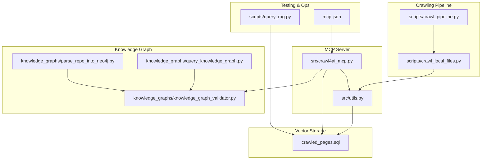
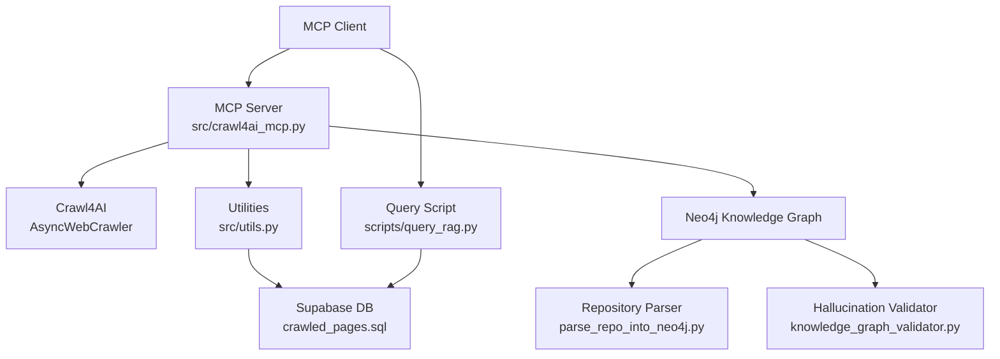
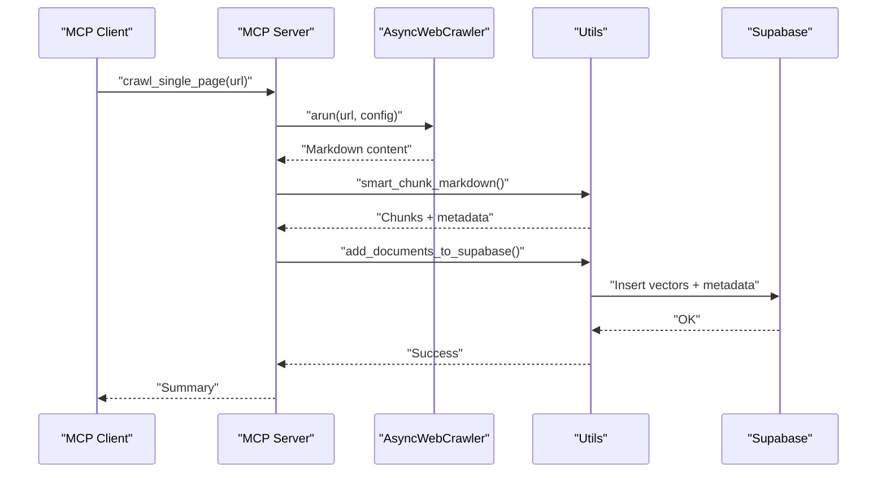
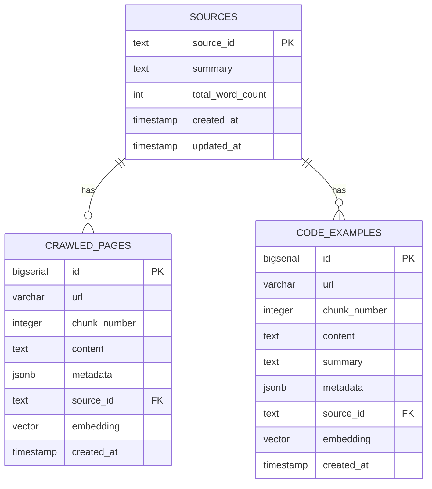
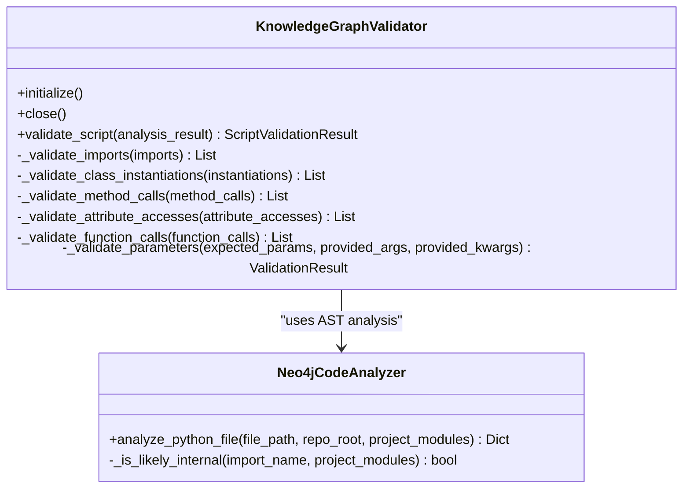
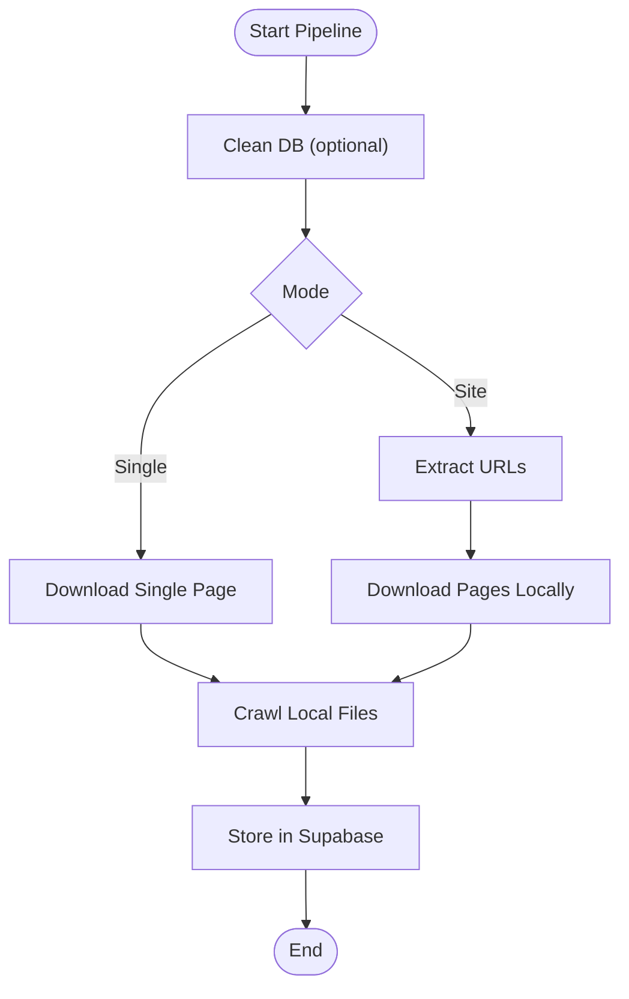
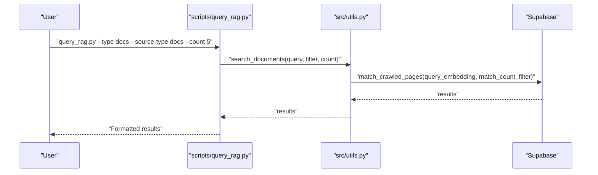
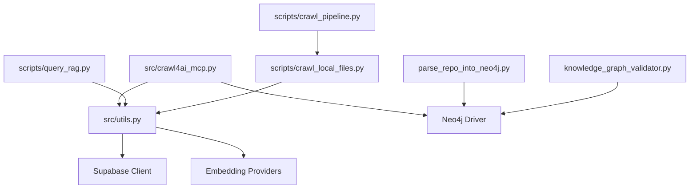

# Project Overview

<cite>
**Referenced Files in This Document**
- [README.md](file://README.md)
- [mcp.json](file://mcp.json)
- [src/crawl4ai_mcp.py](file://src/crawl4ai_mcp.py)
- [src/utils.py](file://src/utils.py)
- [scripts/crawl_pipeline.py](file://scripts/crawl_pipeline.py)
- [scripts/crawl_local_files.py](file://scripts/crawl_local_files.py)
- [scripts/query_rag.py](file://scripts/query_rag.py)
- [knowledge_graphs/query_knowledge_graph.py](file://knowledge_graphs/query_knowledge_graph.py)
- [knowledge_graphs/knowledge_graph_validator.py](file://knowledge_graphs/knowledge_graph_validator.py)
- [knowledge_graphs/parse_repo_into_neo4j.py](file://knowledge_graphs/parse_repo_into_neo4j.py)
- [crawled_pages.sql](file://crawled_pages.sql)
</cite>

## Table of Contents
1. [Introduction](#introduction)
2. [Project Structure](#project-structure)
3. [Core Components](#core-components)
4. [Architecture Overview](#architecture-overview)
5. [Detailed Component Analysis](#detailed-component-analysis)
6. [Dependency Analysis](#dependency-analysis)
7. [Performance Considerations](#performance-considerations)
8. [Troubleshooting Guide](#troubleshooting-guide)
9. [Conclusion](#conclusion)
10. [Appendices](#appendices)

## Introduction
This document introduces the mcp-crawl4ai-rag project, a backend implementation that brings web crawling and Retrieval-Augmented Generation (RAG) capabilities to AI agents via the Model Context Protocol (MCP). The system enables AI systems to dynamically extend their knowledge by:
- Crawling and indexing external content (web pages, documentation, and codebases)
- Storing content in a vector database for semantic search
- Performing hybrid and reranked retrieval augmented with contextual embeddings
- Detecting AI hallucinations using a Neo4j knowledge graph
- Providing modular tool registration for extensibility

Real-world use cases include AI coding assistants that need to search documentation and code examples, and documentation-aware chatbots that ground answers in authoritative sources.

## Project Structure
At a high level, the repository is organized around:
- An MCP server that exposes tools for crawling, searching, and validating knowledge
- A crawling pipeline for local and remote content ingestion
- A vector database schema for storing documents and code examples
- A knowledge graph subsystem for repository parsing and hallucination detection
- Scripts for testing, querying, and operational tasks

**Diagram sources**
- [src/crawl4ai_mcp.py](file://src/crawl4ai_mcp.py#L1-L120)
- [src/utils.py](file://src/utils.py#L1-L120)
- [scripts/crawl_pipeline.py](file://scripts/crawl_pipeline.py#L1-L120)
- [scripts/crawl_local_files.py](file://scripts/crawl_local_files.py#L1-L120)
- [crawled_pages.sql](file://crawled_pages.sql#L1-L120)
- [knowledge_graphs/parse_repo_into_neo4j.py](file://knowledge_graphs/parse_repo_into_neo4j.py#L1-L120)
- [knowledge_graphs/knowledge_graph_validator.py](file://knowledge_graphs/knowledge_graph_validator.py#L1-L120)
- [knowledge_graphs/query_knowledge_graph.py](file://knowledge_graphs/query_knowledge_graph.py#L1-L120)
- [scripts/query_rag.py](file://scripts/query_rag.py#L1-L120)
- [mcp.json](file://mcp.json#L1-L9)

**Section sources**
- [README.md](file://README.md#L1-L120)
- [mcp.json](file://mcp.json#L1-L9)

## Core Components
- MCP Server: Implements the MCP protocol and exposes tools for crawling, RAG, and knowledge graph operations. See [src/crawl4ai_mcp.py](file://src/crawl4ai_mcp.py#L1-L120).
- Utilities: Embedding generation, vector search, contextual embeddings, code example extraction, and database helpers. See [src/utils.py](file://src/utils.py#L1-L200).
- Crawling Pipeline: Orchestrates URL extraction, local downloads, and database ingestion. See [scripts/crawl_pipeline.py](file://scripts/crawl_pipeline.py#L1-L120) and [scripts/crawl_local_files.py](file://scripts/crawl_local_files.py#L1-L120).
- Vector Database: PostgreSQL with pgvector for embeddings and auxiliary tables/functions. See [crawled_pages.sql](file://crawled_pages.sql#L1-L120).
- Knowledge Graph: Repository parsing, validation, and querying. See [knowledge_graphs/parse_repo_into_neo4j.py](file://knowledge_graphs/parse_repo_into_neo4j.py#L1-L120), [knowledge_graphs/knowledge_graph_validator.py](file://knowledge_graphs/knowledge_graph_validator.py#L1-L120), and [knowledge_graphs/query_knowledge_graph.py](file://knowledge_graphs/query_knowledge_graph.py#L1-L120).
- Testing & Ops: Query and validation scripts. See [scripts/query_rag.py](file://scripts/query_rag.py#L1-L120).

**Section sources**
- [src/crawl4ai_mcp.py](file://src/crawl4ai_mcp.py#L1-L200)
- [src/utils.py](file://src/utils.py#L1-L200)
- [scripts/crawl_pipeline.py](file://scripts/crawl_pipeline.py#L1-L120)
- [scripts/crawl_local_files.py](file://scripts/crawl_local_files.py#L1-L120)
- [crawled_pages.sql](file://crawled_pages.sql#L1-L120)
- [knowledge_graphs/parse_repo_into_neo4j.py](file://knowledge_graphs/parse_repo_into_neo4j.py#L1-L120)
- [knowledge_graphs/knowledge_graph_validator.py](file://knowledge_graphs/knowledge_graph_validator.py#L1-L120)
- [knowledge_graphs/query_knowledge_graph.py](file://knowledge_graphs/query_knowledge_graph.py#L1-L120)
- [scripts/query_rag.py](file://scripts/query_rag.py#L1-L120)

## Architecture Overview
The system architecture centers on:
- MCP server hosting tools for crawling and RAG
- Crawl4AI for robust web scraping and markdown conversion
- Supabase (PostgreSQL with pgvector) for vector storage and retrieval
- Optional Neo4j knowledge graph for repository parsing and hallucination detection
- Modular tool registration and configuration via environment variables

**Diagram sources**
- [src/crawl4ai_mcp.py](file://src/crawl4ai_mcp.py#L1-L120)
- [src/utils.py](file://src/utils.py#L1-L120)
- [crawled_pages.sql](file://crawled_pages.sql#L1-L120)
- [knowledge_graphs/parse_repo_into_neo4j.py](file://knowledge_graphs/parse_repo_into_neo4j.py#L1-L120)
- [knowledge_graphs/knowledge_graph_validator.py](file://knowledge_graphs/knowledge_graph_validator.py#L1-L120)
- [scripts/query_rag.py](file://scripts/query_rag.py#L1-L120)

## Detailed Component Analysis

### MCP Server and Tools
The MCP server initializes dependencies, manages lifecycles, and exposes tools for:
- Crawling single pages and smart crawling of sites
- Retrieving available sources and performing RAG queries
- Conditional tools for code example extraction (agentic RAG)
- Knowledge graph tools for repository parsing, hallucination checks, and graph queries

Key implementation highlights:
- Lifespan management for crawler, Supabase client, reranking model, and Neo4j components. See [src/crawl4ai_mcp.py](file://src/crawl4ai_mcp.py#L120-L220).
- Hybrid search and reranking utilities. See [src/crawl4ai_mcp.py](file://src/crawl4ai_mcp.py#L300-L470) and [src/crawl4ai_mcp.py](file://src/crawl4ai_mcp.py#L430-L470).
- Contextual embedding augmentation for improved retrieval. See [src/crawl4ai_mcp.py](file://src/crawl4ai_mcp.py#L660-L800) and [src/utils.py](file://src/utils.py#L318-L367).

**Diagram sources**
- [src/crawl4ai_mcp.py](file://src/crawl4ai_mcp.py#L660-L800)
- [src/utils.py](file://src/utils.py#L383-L548)

**Section sources**
- [src/crawl4ai_mcp.py](file://src/crawl4ai_mcp.py#L120-L220)
- [src/crawl4ai_mcp.py](file://src/crawl4ai_mcp.py#L300-L470)
- [src/crawl4ai_mcp.py](file://src/crawl4ai_mcp.py#L660-L800)
- [src/utils.py](file://src/utils.py#L318-L367)

### Vector Storage and Retrieval
The vector database schema defines:
- Sources table for domain-level metadata
- Crawled pages table with embeddings and metadata
- Code examples table for specialized code search
- SQL functions for vector similarity search with optional filters

Operational details:
- Embeddings dimension is 1536 (aligned with OpenAI embeddings)
- Indexes for IVFFLAT cosine similarity and GIN metadata
- Row-level security policies for public read access
- Dedicated functions for document and code example retrieval

**Diagram sources**
- [crawled_pages.sql](file://crawled_pages.sql#L1-L175)

**Section sources**
- [crawled_pages.sql](file://crawled_pages.sql#L1-L175)

### Knowledge Graph Integration
The knowledge graph subsystem:
- Parses GitHub repositories into Neo4j nodes and relationships (files, classes, methods, functions)
- Validates AI-generated Python scripts against the graph to detect hallucinations
- Provides interactive querying and reporting

Key components:
- Repository parser builds AST-based structure and stores it in Neo4j. See [knowledge_graphs/parse_repo_into_neo4j.py](file://knowledge_graphs/parse_repo_into_neo4j.py#L1-L120).
- Validator performs import, class, method, attribute, and function validations with parameter checking. See [knowledge_graphs/knowledge_graph_validator.py](file://knowledge_graphs/knowledge_graph_validator.py#L1-L120).
- Query tool explores repositories, classes, methods, and runs custom Cypher queries. See [knowledge_graphs/query_knowledge_graph.py](file://knowledge_graphs/query_knowledge_graph.py#L1-L120).

**Diagram sources**
- [knowledge_graphs/knowledge_graph_validator.py](file://knowledge_graphs/knowledge_graph_validator.py#L1-L120)
- [knowledge_graphs/parse_repo_into_neo4j.py](file://knowledge_graphs/parse_repo_into_neo4j.py#L1-L120)

**Section sources**
- [knowledge_graphs/parse_repo_into_neo4j.py](file://knowledge_graphs/parse_repo_into_neo4j.py#L1-L120)
- [knowledge_graphs/knowledge_graph_validator.py](file://knowledge_graphs/knowledge_graph_validator.py#L1-L120)
- [knowledge_graphs/query_knowledge_graph.py](file://knowledge_graphs/query_knowledge_graph.py#L1-L120)

### Crawling Pipeline and Local Processing
The pipeline automates:
- URL extraction and local downloads
- Cleaning the database (optional)
- Crawling local HTML files with Crawl4AI’s raw content feature
- Storing results into Supabase with chunking and metadata

**Diagram sources**
- [scripts/crawl_pipeline.py](file://scripts/crawl_pipeline.py#L1-L120)
- [scripts/crawl_local_files.py](file://scripts/crawl_local_files.py#L1-L120)

**Section sources**
- [scripts/crawl_pipeline.py](file://scripts/crawl_pipeline.py#L1-L120)
- [scripts/crawl_local_files.py](file://scripts/crawl_local_files.py#L1-L120)

### Query and Testing
The query script supports:
- Document search with source filtering and hybrid search
- Code example search with source filtering
- Listing available sources
- Verbose configuration display

**Diagram sources**
- [scripts/query_rag.py](file://scripts/query_rag.py#L1-L120)
- [src/utils.py](file://src/utils.py#L549-L587)
- [crawled_pages.sql](file://crawled_pages.sql#L46-L80)

**Section sources**
- [scripts/query_rag.py](file://scripts/query_rag.py#L1-L120)
- [src/utils.py](file://src/utils.py#L549-L587)
- [crawled_pages.sql](file://crawled_pages.sql#L46-L80)

## Dependency Analysis
High-level dependencies:
- MCP server depends on Crawl4AI, Supabase client, optional reranking model, and Neo4j driver
- Utilities depend on embedding providers (OpenAI, Copilot, Qwen) and Supabase
- Knowledge graph components depend on Neo4j and AST parsing
- Scripts depend on utilities and environment configuration

**Diagram sources**
- [src/crawl4ai_mcp.py](file://src/crawl4ai_mcp.py#L1-L120)
- [src/utils.py](file://src/utils.py#L1-L120)
- [knowledge_graphs/parse_repo_into_neo4j.py](file://knowledge_graphs/parse_repo_into_neo4j.py#L1-L120)
- [knowledge_graphs/knowledge_graph_validator.py](file://knowledge_graphs/knowledge_graph_validator.py#L1-L120)
- [scripts/query_rag.py](file://scripts/query_rag.py#L1-L120)
- [scripts/crawl_pipeline.py](file://scripts/crawl_pipeline.py#L1-L120)
- [scripts/crawl_local_files.py](file://scripts/crawl_local_files.py#L1-L120)

**Section sources**
- [src/crawl4ai_mcp.py](file://src/crawl4ai_mcp.py#L1-L120)
- [src/utils.py](file://src/utils.py#L1-L120)
- [knowledge_graphs/parse_repo_into_neo4j.py](file://knowledge_graphs/parse_repo_into_neo4j.py#L1-L120)
- [knowledge_graphs/knowledge_graph_validator.py](file://knowledge_graphs/knowledge_graph_validator.py#L1-L120)
- [scripts/query_rag.py](file://scripts/query_rag.py#L1-L120)
- [scripts/crawl_pipeline.py](file://scripts/crawl_pipeline.py#L1-L120)
- [scripts/crawl_local_files.py](file://scripts/crawl_local_files.py#L1-L120)

## Performance Considerations
- Embedding model downloads and loading can dominate startup time; subsequent runs are faster due to caching. See [README.md](file://README.md#L447-L482).
- Disable unused features (reranking, knowledge graph) to reduce initialization overhead. See [README.md](file://README.md#L470-L482).
- Batch inserts and retries in utilities mitigate transient failures. See [src/utils.py](file://src/utils.py#L512-L548).
- Parallel processing for contextual embeddings and code example summaries. See [src/utils.py](file://src/utils.py#L443-L478) and [src/crawl4ai_mcp.py](file://src/crawl4ai_mcp.py#L759-L800).

[No sources needed since this section provides general guidance]

## Troubleshooting Guide
Common issues and resolutions:
- Installation on restricted environments: Use provided installation script or Docker. See [README.md](file://README.md#L674-L714).
- Memory errors during crawling: Reduce concurrency in smart crawling. See [README.md](file://README.md#L706-L714).
- Rate limiting: Adjust requests per minute and rely on automatic throttling. See [README.md](file://README.md#L298-L317).
- Neo4j connection errors: Verify URI, user, and password. See [README.md](file://README.md#L161-L203).
- Supabase connection errors: Confirm URL and service key. See [README.md](file://README.md#L151-L160).
- Testing RAG: Use the query script to validate setup and results. See [scripts/query_rag.py](file://scripts/query_rag.py#L1-L120).

**Section sources**
- [README.md](file://README.md#L674-L714)
- [README.md](file://README.md#L298-L317)
- [README.md](file://README.md#L161-L203)
- [README.md](file://README.md#L151-L160)
- [scripts/query_rag.py](file://scripts/query_rag.py#L1-L120)

## Conclusion
mcp-crawl4ai-rag delivers a flexible, extensible backend for AI agents to crawl, index, and retrieve knowledge from external sources. By combining Crawl4AI, Supabase, and Neo4j, it supports advanced RAG strategies, code-centric search, and hallucination detection. The MCP server’s modular design and comprehensive scripts make it suitable for both experimentation and production use.

[No sources needed since this section summarizes without analyzing specific files]

## Appendices

### Beginner-Friendly Concepts
- Model Context Protocol (MCP): A standardized way for AI clients to discover and invoke tools provided by servers. See [mcp.json](file://mcp.json#L1-L9).
- Retrieval-Augmented Generation (RAG): Augments model responses with retrieved context from a knowledge base. See [README.md](file://README.md#L1-L40).
- Knowledge Graph: A graph database storing relationships between entities (e.g., classes, methods). See [knowledge_graphs/parse_repo_into_neo4j.py](file://knowledge_graphs/parse_repo_into_neo4j.py#L1-L120).

**Section sources**
- [mcp.json](file://mcp.json#L1-L9)
- [README.md](file://README.md#L1-L40)
- [knowledge_graphs/parse_repo_into_neo4j.py](file://knowledge_graphs/parse_repo_into_neo4j.py#L1-L120)