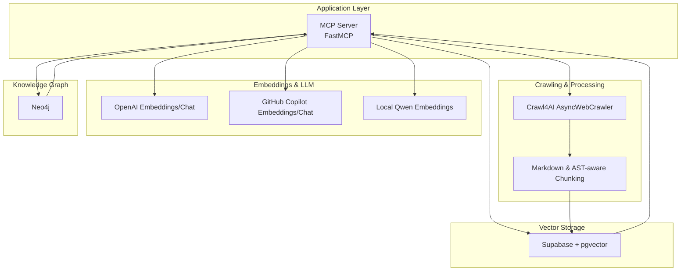
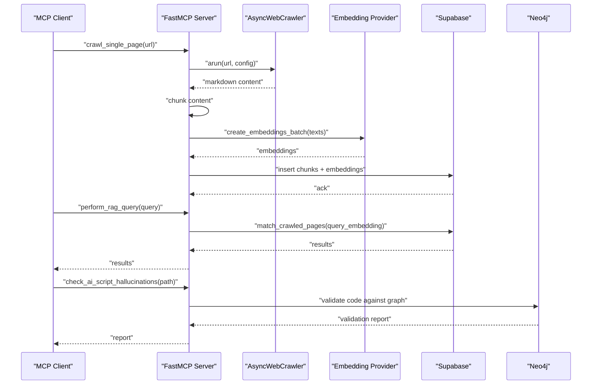
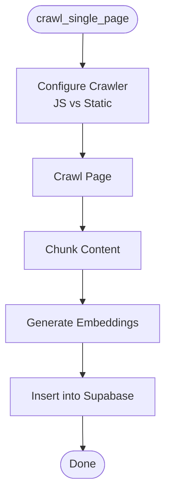
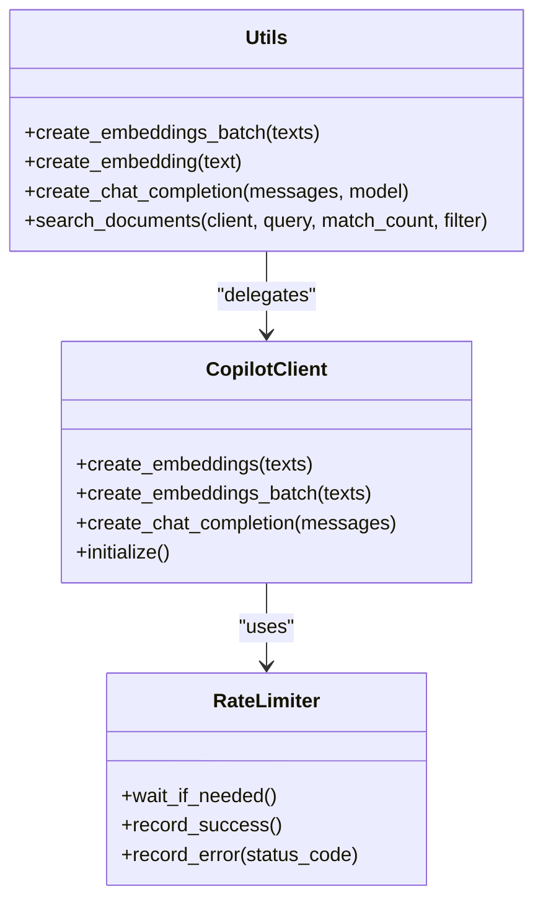
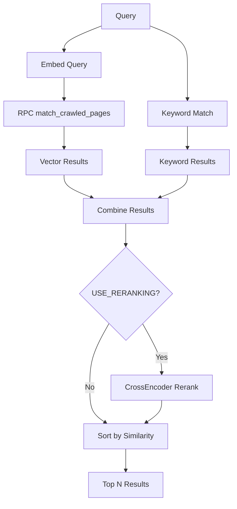
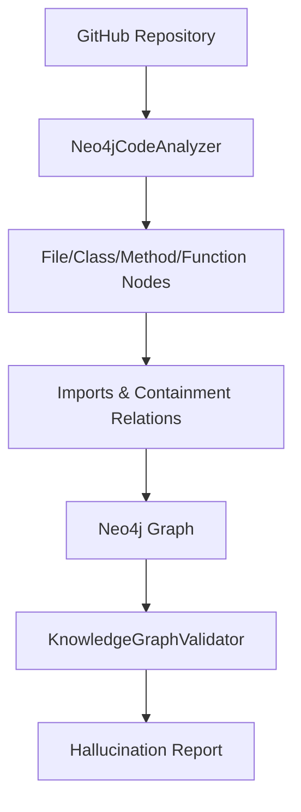
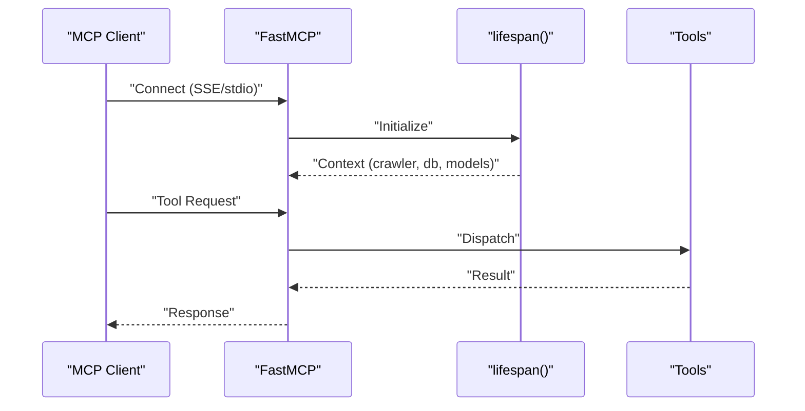

# Technology Stack & Dependencies

<cite>
**Referenced Files in This Document**
- [README.md](file://README.md)
- [pyproject.toml](file://pyproject.toml)
- [mcp.json](file://mcp.json)
- [src/crawl4ai_mcp.py](file://src/crawl4ai_mcp.py)
- [src/utils.py](file://src/utils.py)
- [src/copilot_client.py](file://src/copilot_client.py)
- [knowledge_graphs/parse_repo_into_neo4j.py](file://knowledge_graphs/parse_repo_into_neo4j.py)
- [scripts/crawl_pipeline.py](file://scripts/crawl_pipeline.py)
- [tests/test_mcp_server.py](file://tests/test_mcp_server.py)
- [tests/test_neo4j_integration.py](file://tests/test_neo4j_integration.py)
</cite>

## Table of Contents
1. [Introduction](#introduction)
2. [Project Structure](#project-structure)
3. [Core Components](#core-components)
4. [Architecture Overview](#architecture-overview)
5. [Detailed Component Analysis](#detailed-component-analysis)
6. [Dependency Analysis](#dependency-analysis)
7. [Performance Considerations](#performance-considerations)
8. [Troubleshooting Guide](#troubleshooting-guide)
9. [Conclusion](#conclusion)
10. [Appendices](#appendices)

## Introduction
This document explains the technology stack and dependencies for the Crawl4AI RAG MCP Server. It covers how Crawl4AI powers JavaScript-heavy web crawling, how Supabase provides vector storage and full-text search, how Neo4j persists a knowledge graph for hallucination detection, and how multiple embedding providers (OpenAI, GitHub Copilot, local Qwen) are integrated. It also explains the role of the Model Context Protocol (MCP) in enabling interoperability between AI agents and tools, and outlines Python dependencies grouped by functionality. Version compatibility requirements and rationale for key technology choices are included, along with guidance on async/await patterns and FastAPI-style routing in the MCP server.

## Project Structure
The repository organizes functionality into modules that reflect the system’s layered responsibilities:
- Application server: FastMCP-based MCP server with async lifecycle and tool registration
- Crawling and chunking: Crawl4AI integration for JavaScript-heavy pages and intelligent chunking
- Embedding and LLM orchestration: OpenAI, GitHub Copilot, and local Qwen SentenceTransformers
- Vector storage and search: Supabase with pgvector for embeddings and hybrid search
- Knowledge graph: Neo4j for repository parsing and hallucination detection
- Utilities and helpers: shared embedding, search, and database operations
- Scripts and tests: automation pipelines and validation tests

**Diagram sources**
- [src/crawl4ai_mcp.py](file://src/crawl4ai_mcp.py#L295-L301)
- [src/utils.py](file://src/utils.py#L121-L277)
- [src/copilot_client.py](file://src/copilot_client.py#L183-L385)
- [knowledge_graphs/parse_repo_into_neo4j.py](file://knowledge_graphs/parse_repo_into_neo4j.py#L1-L200)

**Section sources**
- [README.md](file://README.md#L1-L120)
- [src/crawl4ai_mcp.py](file://src/crawl4ai_mcp.py#L1-L120)
- [pyproject.toml](file://pyproject.toml#L1-L40)

## Core Components
- Crawl4AI for JavaScript-heavy web crawling
  - AsyncWebCrawler with headless browser configuration and caching
  - Intelligent chunking for Markdown and AST-aware chunking for source code
  - Parallel processing for code example extraction and summaries
- Supabase for vector storage and full-text search
  - pgvector-enabled tables and RPC-based similarity search
  - Hybrid search combining vector and keyword matching
  - Optional reranking with cross-encoder models
- Neo4j for knowledge graph persistence
  - AST-based repository parsing and graph construction
  - Hallucination detection and validation of AI-generated code
- Supported embedding providers
  - OpenAI text-embedding-3-small
  - GitHub Copilot embeddings (same underlying model)
  - Local Qwen embedding model via SentenceTransformers
- MCP specification for interoperability
  - FastMCP server exposing tools for crawling, RAG, and knowledge graph operations
  - SSE and stdio transports for client connectivity

**Section sources**
- [README.md](file://README.md#L43-L120)
- [src/crawl4ai_mcp.py](file://src/crawl4ai_mcp.py#L662-L800)
- [src/utils.py](file://src/utils.py#L549-L587)
- [src/copilot_client.py](file://src/copilot_client.py#L183-L385)
- [knowledge_graphs/parse_repo_into_neo4j.py](file://knowledge_graphs/parse_repo_into_neo4j.py#L1-L200)

## Architecture Overview
The MCP server orchestrates a pipeline:
- Receive tool requests from clients
- Crawl and chunk content using Crawl4AI
- Generate embeddings via OpenAI, Copilot, or local Qwen
- Store vectors in Supabase with pgvector
- Perform hybrid search and optional reranking
- Optionally validate AI code against a Neo4j knowledge graph

**Diagram sources**
- [src/crawl4ai_mcp.py](file://src/crawl4ai_mcp.py#L662-L800)
- [src/utils.py](file://src/utils.py#L121-L277)
- [src/utils.py](file://src/utils.py#L549-L587)
- [knowledge_graphs/parse_repo_into_neo4j.py](file://knowledge_graphs/parse_repo_into_neo4j.py#L1-L200)

## Detailed Component Analysis

### Crawl4AI Integration
- AsyncWebCrawler lifecycle managed via FastMCP lifespan
- Smart chunking for Markdown and AST-aware chunking for Python/DML
- Parallel processing for code example extraction and summaries
- Optional contextual embeddings to enrich chunk semantics

**Diagram sources**
- [src/crawl4ai_mcp.py](file://src/crawl4ai_mcp.py#L662-L800)
- [src/utils.py](file://src/utils.py#L383-L548)

**Section sources**
- [src/crawl4ai_mcp.py](file://src/crawl4ai_mcp.py#L130-L293)
- [src/crawl4ai_mcp.py](file://src/crawl4ai_mcp.py#L559-L627)
- [src/utils.py](file://src/utils.py#L383-L548)

### Embedding Providers and LLM Orchestration
- Provider selection order: Qwen (local) → GitHub Copilot → OpenAI
- Chat completion provider selection: Copilot → OpenAI
- Rate limiting and resilience for Copilot (exponential backoff, token refresh)
- Lazy loading of local Qwen model and cross-encoder reranking

**Diagram sources**
- [src/utils.py](file://src/utils.py#L121-L277)
- [src/copilot_client.py](file://src/copilot_client.py#L183-L385)
- [src/copilot_client.py](file://src/copilot_client.py#L19-L108)

**Section sources**
- [src/utils.py](file://src/utils.py#L121-L277)
- [src/copilot_client.py](file://src/copilot_client.py#L19-L108)

### Supabase Vector Storage and Hybrid Search
- RPC-based similarity search with optional metadata filtering
- Hybrid search combining vector and keyword results
- Optional reranking with cross-encoder models
- Batched inserts with retry logic and upsert behavior

**Diagram sources**
- [src/utils.py](file://src/utils.py#L549-L587)
- [src/crawl4ai_mcp.py](file://src/crawl4ai_mcp.py#L302-L363)
- [src/crawl4ai_mcp.py](file://src/crawl4ai_mcp.py#L430-L467)

**Section sources**
- [src/utils.py](file://src/utils.py#L549-L587)
- [src/crawl4ai_mcp.py](file://src/crawl4ai_mcp.py#L302-L363)
- [src/crawl4ai_mcp.py](file://src/crawl4ai_mcp.py#L430-L467)

### Neo4j Knowledge Graph
- AST-based repository parsing into nodes and relationships
- Hallucination detection by validating AI-generated Python scripts
- Query tools for exploring repositories, classes, and methods

**Diagram sources**
- [knowledge_graphs/parse_repo_into_neo4j.py](file://knowledge_graphs/parse_repo_into_neo4j.py#L1-L200)
- [src/crawl4ai_mcp.py](file://src/crawl4ai_mcp.py#L186-L216)

**Section sources**
- [knowledge_graphs/parse_repo_into_neo4j.py](file://knowledge_graphs/parse_repo_into_neo4j.py#L1-L200)
- [src/crawl4ai_mcp.py](file://src/crawl4ai_mcp.py#L186-L216)

### MCP Server Routing and Async Patterns
- FastMCP server with SSE or stdio transport
- Lifespan manages crawler, Supabase client, reranking model, and Neo4j components
- Tools exposed via decorators and FastMCP routing
- Async I/O for crawling, embedding, and database operations

**Diagram sources**
- [src/crawl4ai_mcp.py](file://src/crawl4ai_mcp.py#L295-L301)
- [src/crawl4ai_mcp.py](file://src/crawl4ai_mcp.py#L130-L293)
- [mcp.json](file://mcp.json#L1-L9)

**Section sources**
- [src/crawl4ai_mcp.py](file://src/crawl4ai_mcp.py#L295-L301)
- [src/crawl4ai_mcp.py](file://src/crawl4ai_mcp.py#L2279-L2289)
- [mcp.json](file://mcp.json#L1-L9)

## Dependency Analysis
Python dependencies grouped by functionality:
- Crawling and processing
  - crawl4ai: JavaScript-heavy crawling and caching
  - lxml/requests: sitemap parsing and HTTP utilities
  - aiofiles: async file operations
- Embeddings and LLM
  - openai: OpenAI embeddings and chat completions
  - sentence-transformers: local Qwen embeddings and reranking
  - litellm: unified provider abstraction
- Vector storage and search
  - supabase: Supabase client and RPC invocation
  - httpx: async HTTP for external APIs
- Knowledge graph
  - neo4j: Neo4j driver for graph operations
- MCP and server
  - mcp: FastMCP server framework
  - protobuf: serialization for MCP protocol
- Testing and development
  - pytest, pytest-asyncio: async test runner and markers

Version compatibility and rationale:
- Python 3.12+: requirement for modern async features and ecosystem
- crawl4ai 0.6.2: latest stable version with async crawler and caching
- mcp>=1.19.0: FastMCP server and protocol support
- supabase==2.15.1: pgvector-compatible client
- openai==1.71.0: embeddings and chat completions
- sentence-transformers>=4.1.0: local embedding and reranking models
- neo4j>=5.28.1: async driver and graph operations
- httpx>=0.25.0: async HTTP client
- aiofiles>=23.0.0: async file IO
- pytest>=7.0.0, pytest-asyncio>=0.21.0: async test support
- protobuf>=3.20.0: MCP protocol serialization
- litellm>=1.0.0: provider abstraction for embeddings/chat

**Section sources**
- [pyproject.toml](file://pyproject.toml#L1-L40)
- [README.md](file://README.md#L205-L243)

## Performance Considerations
- Use async/await patterns for I/O-bound operations (crawling, embedding, database)
- Batch embeddings and database inserts to reduce overhead
- Enable USE_RERANKING only when precision is critical; it adds ~100–200ms per query
- Prefer static content crawling (disable JavaScript) for predictable content sizes and faster runs
- Use SSE transport for better connection reliability during long server initialization
- Disable unused features to reduce startup time (reranker, knowledge graph, Qwen embeddings)

[No sources needed since this section provides general guidance]

## Troubleshooting Guide
Common issues and resolutions:
- Startup delays: First-time model downloads and loading can take 30 seconds to several minutes; subsequent startups are faster
- Rate limiting errors: Adjust COPILOT_REQUESTS_PER_MINUTE and ensure token refresh works
- Neo4j connection errors: Verify URI, user, and password; ensure Neo4j is running
- Supabase connection errors: Confirm SUPABASE_URL and SUPABASE_SERVICE_KEY
- Memory errors during crawling: Reduce max_concurrent in smart_crawl_url
- Knowledge graph Docker compatibility: Not fully compatible yet; run through uv for hallucination detection

**Section sources**
- [README.md](file://README.md#L447-L532)
- [README.md](file://README.md#L672-L714)
- [tests/test_mcp_server.py](file://tests/test_mcp_server.py#L196-L213)
- [tests/test_neo4j_integration.py](file://tests/test_neo4j_integration.py#L35-L71)

## Conclusion
The Crawl4AI RAG MCP Server integrates modern technologies to deliver robust web crawling, RAG, and knowledge graph capabilities. Crawl4AI handles JavaScript-heavy pages efficiently, Supabase provides scalable vector storage and hybrid search, and Neo4j enables hallucination detection. Multiple embedding providers offer flexibility in cost and privacy, while the MCP specification ensures interoperability with AI agents. Async/await patterns and FastAPI-style routing in the MCP server optimize I/O efficiency and developer ergonomics.

[No sources needed since this section summarizes without analyzing specific files]

## Appendices

### Alternative Providers and Substitutions
- Embedding providers
  - Replace OpenAI with Azure OpenAI or AWS Bedrock via litellm abstraction
  - Replace GitHub Copilot with Azure AI or other hosted embedding services
  - Replace local Qwen with other SentenceTransformers models or ONNX runtime
- Vector databases
  - Replace Supabase with Pinecone, Weaviate, or Chroma for vector similarity
- Knowledge graph
  - Replace Neo4j with Amazon Neptune or ArangoDB for graph operations
- MCP clients
  - Connect via stdio or SSE with any MCP-compliant client (Claude, Windsurf, n8n)

[No sources needed since this section provides general guidance]