# Integration Testing

<cite>
**Referenced Files in This Document**   
- [test_mcp_server.py](file://tests/test_mcp_server.py)
- [test_neo4j_integration.py](file://tests/test_neo4j_integration.py)
- [test_copilot_integration.py](file://tests/test_copilot_integration.py)
- [test_qwen_integration.py](file://tests/test_qwen_integration.py)
- [test_simics_integration.py](file://knowledge_graphs/test_simics_integration.py)
- [crawl_pipeline.py](file://scripts/crawl_pipeline.py)
- [crawl4ai_mcp.py](file://src/crawl4ai_mcp.py)
- [utils.py](file://src/utils.py)
- [copilot_client.py](file://src/copilot_client.py)
- [parse_repo_into_neo4j.py](file://knowledge_graphs/parse_repo_into_neo4j.py)
- [query_rag.py](file://scripts/query_rag.py)
</cite>

## Table of Contents
1. [Introduction](#introduction)
2. [Test Setup Requirements](#test-setup-requirements)
3. [Core Component Integration](#core-component-integration)
4. [End-to-End Workflows](#end-to-end-workflows)
5. [Test Environment Configuration](#test-environment-configuration)
6. [State Management](#state-management)
7. [Troubleshooting Guide](#troubleshooting-guide)
8. [Conclusion](#conclusion)

## Introduction
This document provides comprehensive guidance on integration testing procedures for the MCP server system. The integration tests validate interactions between core components including the MCP server, Neo4j knowledge graph, Supabase vector storage, and embedding providers (GitHub Copilot, OpenAI, and Qwen). The tests ensure that all components work together seamlessly to support end-to-end workflows such as content crawling, document chunking, embedding generation, and query operations. The testing framework includes validation of configuration settings, connectivity, and feature availability across the entire system.

## Test Setup Requirements

### Database Connections
The integration tests require proper configuration of database connections for both Neo4j and Supabase services. The environment variables must be set correctly to establish connectivity:

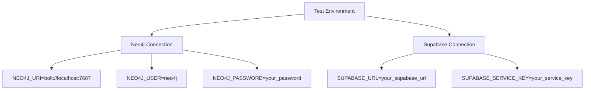

The Neo4j database must be running and accessible at the specified URI. The Supabase project URL and service key must be valid and have appropriate permissions for read/write operations. These connections are validated during the test execution to ensure both databases are available and properly configured.

### Service Dependencies
The integration tests depend on several external services and components that must be available:

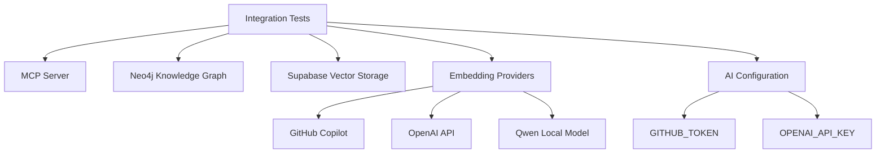

The MCP server must be running and accessible. The embedding providers have specific requirements:
- **GitHub Copilot**: Requires a valid GITHUB_TOKEN with appropriate permissions
- **OpenAI**: Requires a valid OPENAI_API_KEY
- **Qwen**: Requires the Qwen3-Embedding-0.6B model to be available locally

The system validates these dependencies during test execution and provides appropriate fallback mechanisms when certain services are unavailable.

**Section sources**
- [test_mcp_server.py](file://tests/test_mcp_server.py#L80-L110)
- [test_neo4j_integration.py](file://tests/test_neo4j_integration.py#L42-L45)
- [test_copilot_integration.py](file://tests/test_copilot_integration.py#L43-L45)

## Core Component Integration

### MCP Server Validation
The MCP server integration tests validate the server's configuration, connectivity, and available tools. The test suite checks multiple aspects of the server setup:

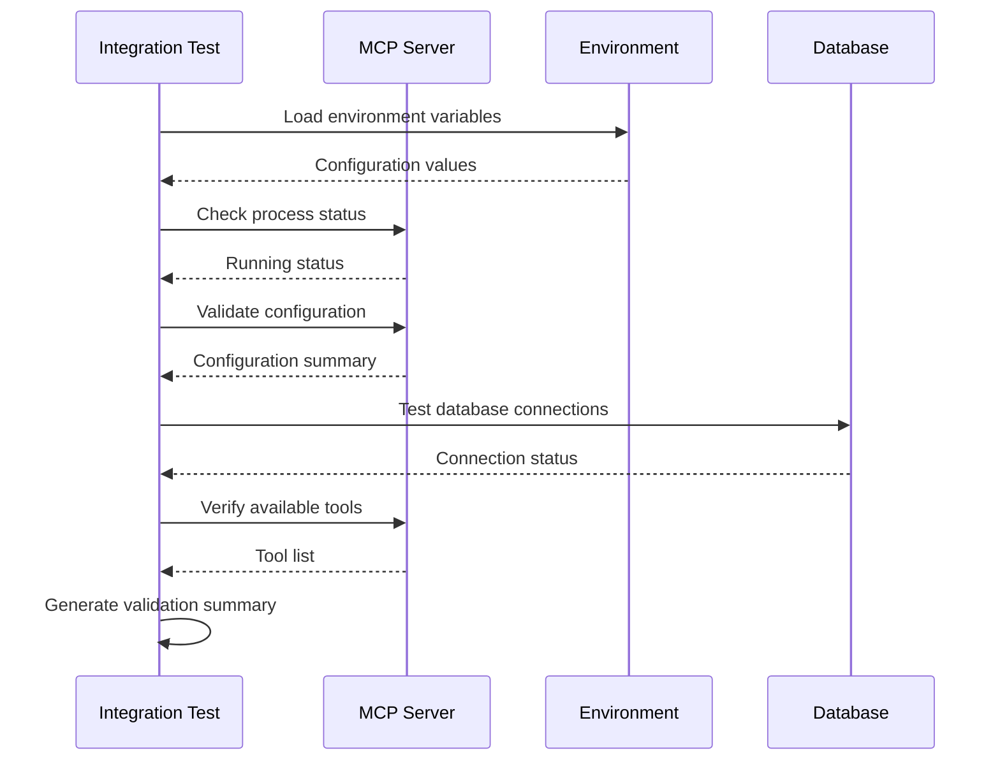

The validation process includes checking the server process status, configuration settings (transport, host, port), database connections (Supabase and Neo4j), AI provider configuration (GitHub Copilot and OpenAI), RAG feature configuration, and available tools. The test confirms that all expected tools are available and properly configured.

### Neo4j Knowledge Graph Integration
The Neo4j integration tests validate the knowledge graph functionality, including connection, tool availability, and query operations:

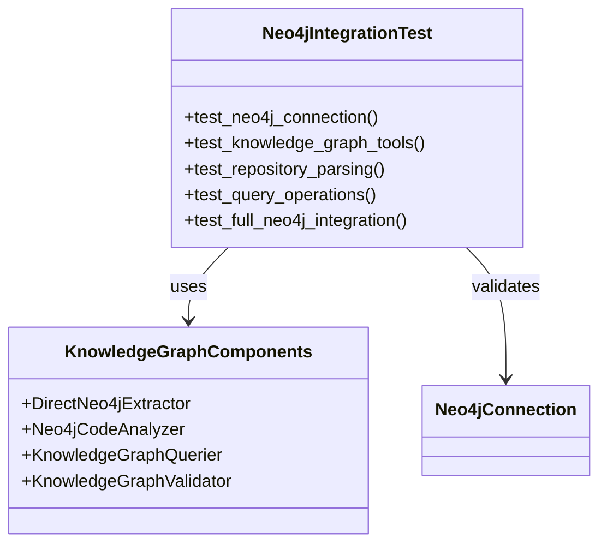

The tests verify the Neo4j connection by attempting to connect to the database and execute simple queries. They also test the availability of knowledge graph tools and their ability to parse repositories and execute queries. The integration includes creating and deleting test nodes to validate write permissions.

### Embedding Provider Integration
The system supports multiple embedding providers with a fallback mechanism. The integration tests validate each provider's functionality:

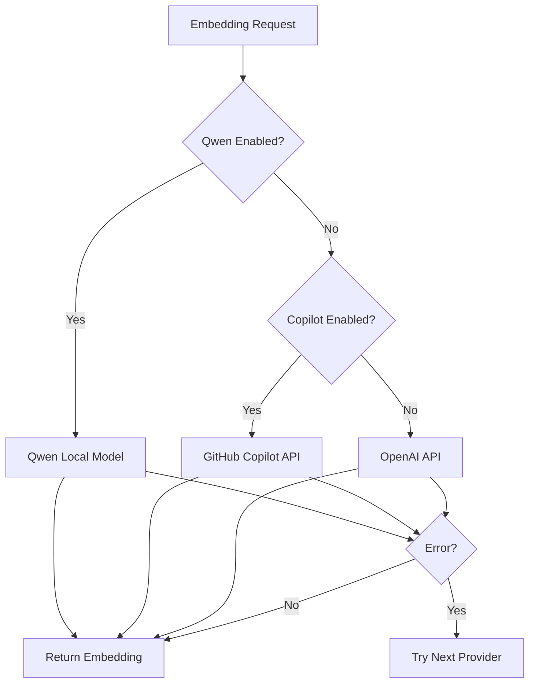

The tests validate each embedding provider independently and in combination, ensuring the fallback mechanism works correctly. The Qwen integration tests verify the local model loading and embedding generation, while the Copilot tests validate API connectivity and authentication.

**Section sources**
- [test_mcp_server.py](file://tests/test_mcp_server.py#L36-L273)
- [test_neo4j_integration.py](file://tests/test_neo4j_integration.py#L35-L269)
- [test_copilot_integration.py](file://tests/test_copilot_integration.py#L38-L263)
- [test_qwen_integration.py](file://tests/test_qwen_integration.py#L43-L249)

## End-to-End Workflows

### Content Crawling and Processing Pipeline
The integration tests validate the complete workflow from content crawling to storage in the vector database. The process follows a structured pipeline:

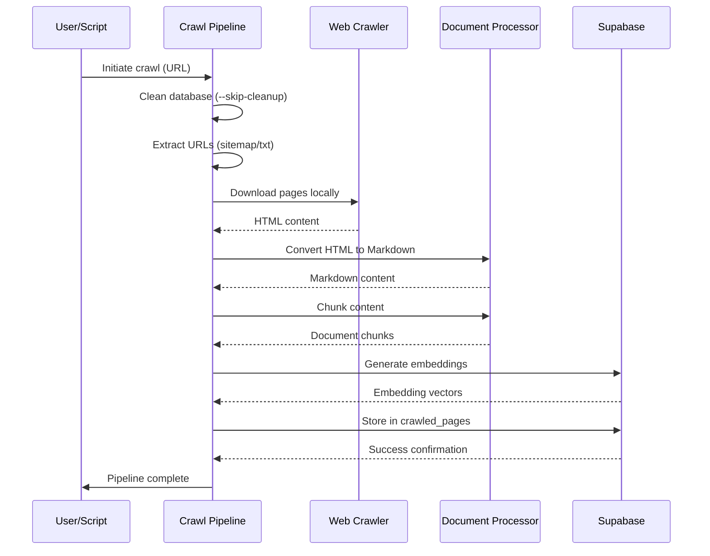

The workflow begins with URL extraction from a sitemap or text file, followed by local downloading of pages. The HTML content is then processed into Markdown format, chunked into manageable pieces, and stored in Supabase with generated embeddings. The pipeline supports both single-page and site-wide crawling modes.

### Document Chunking and Embedding Generation
The document processing workflow involves several steps to transform raw content into searchable vector representations:

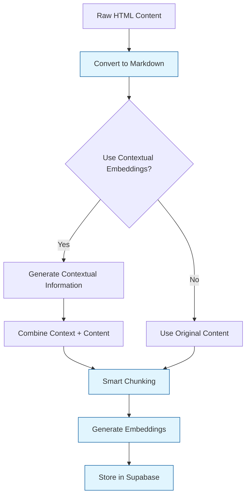

The system uses smart chunking that respects code blocks and paragraph boundaries. For contextual embeddings, it generates additional context information using AI to improve retrieval quality. The embeddings are generated using the configured provider (Qwen, Copilot, or OpenAI) and stored in Supabase with metadata.

### Query and Retrieval Operations
The end-to-end query workflow validates the complete RAG (Retrieval-Augmented Generation) process:

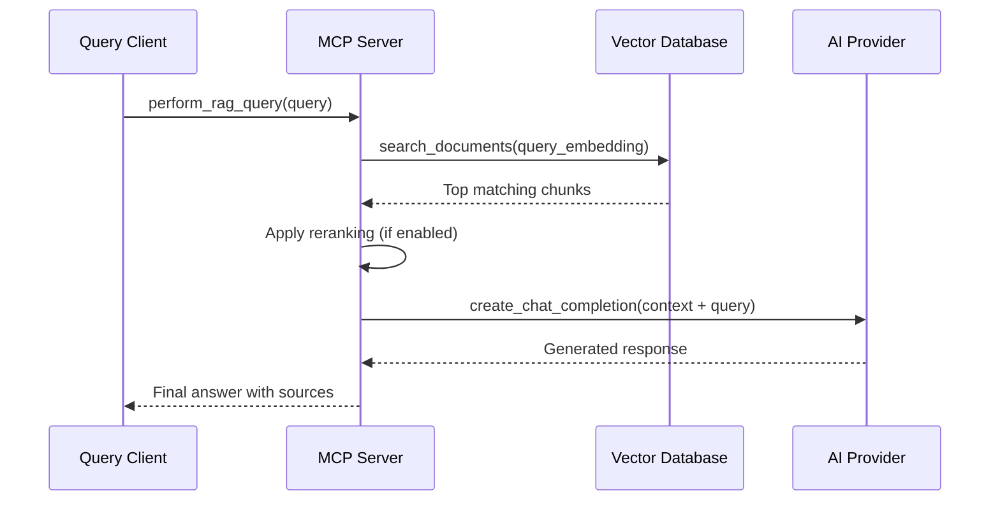

The query process involves creating an embedding for the search query, retrieving the most similar document chunks from Supabase, optionally reranking the results, and generating a response using the AI provider with the retrieved context.

**Section sources**
- [crawl_pipeline.py](file://scripts/crawl_pipeline.py#L68-L259)
- [crawl4ai_mcp.py](file://src/crawl4ai_mcp.py#L662-L800)
- [utils.py](file://src/utils.py#L383-L548)
- [query_rag.py](file://scripts/query_rag.py#L15-L348)

## Test Environment Configuration

### Environment Variables
Proper configuration of environment variables is critical for successful integration testing. The following variables must be set:

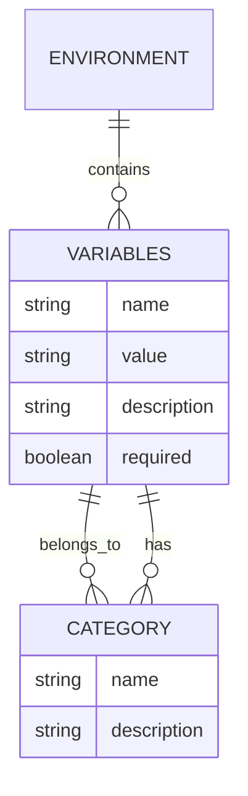

**Core Configuration Variables:**
- **MCP Server**: HOST, PORT, TRANSPORT
- **Neo4j**: NEO4J_URI, NEO4J_USER, NEO4J_PASSWORD, USE_KNOWLEDGE_GRAPH
- **Supabase**: SUPABASE_URL, SUPABASE_SERVICE_KEY
- **AI Providers**: GITHUB_TOKEN, OPENAI_API_KEY, MODEL_CHOICE
- **RAG Features**: USE_CONTEXTUAL_EMBEDDINGS, USE_HYBRID_SEARCH, USE_AGENTIC_RAG, USE_RERANKING
- **Embedding Providers**: USE_QWEN_EMBEDDINGS, USE_COPILOT_EMBEDDINGS, USE_COPILOT_CHAT
- **Rate Limiting**: COPILOT_REQUESTS_PER_MINUTE

### Configuration Validation
The test framework includes comprehensive configuration validation to ensure all required settings are present and correct:

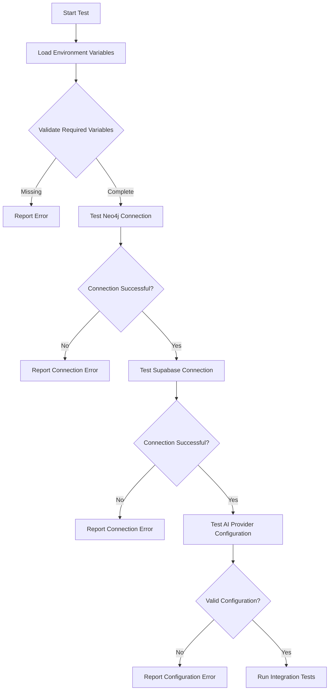

The validation process checks for the presence of required environment variables, tests database connectivity, and verifies AI provider configuration before executing the main integration tests. This ensures that test failures are due to actual integration issues rather than configuration problems.

**Section sources**
- [test_mcp_server.py](file://tests/test_mcp_server.py#L59-L213)
- [test_neo4j_integration.py](file://tests/test_neo4j_integration.py#L18-L34)
- [pyproject.toml](file://pyproject.toml#L1-L40)

## State Management

### Test Data Seeding
The integration tests include mechanisms for seeding test data to validate functionality:

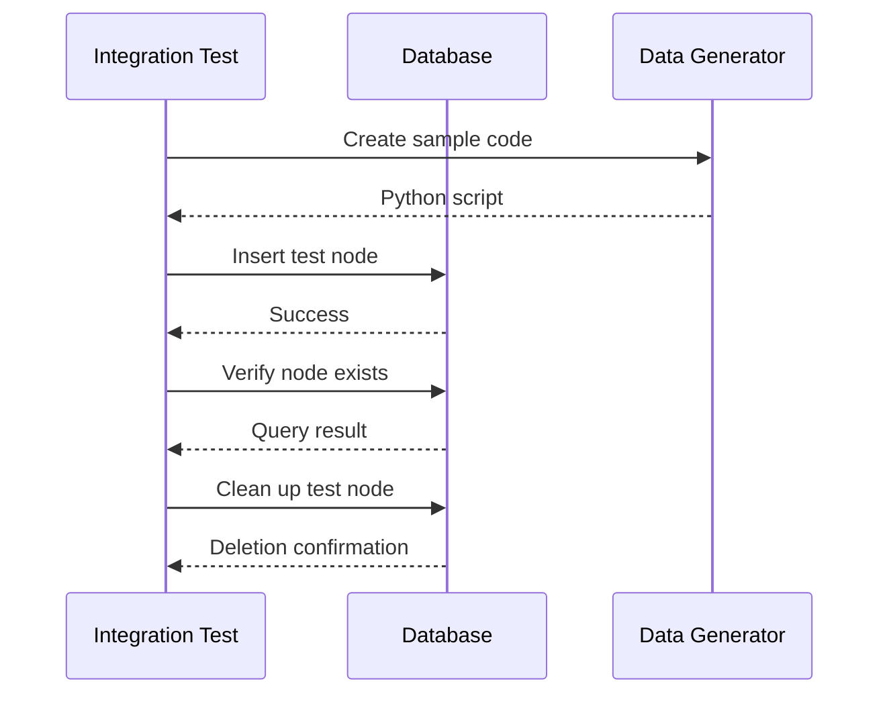

The Neo4j integration test creates a sample Python script to test hallucination detection and inserts a test node to verify write permissions. These operations ensure that the knowledge graph is functional and can handle both data insertion and retrieval.

### Cleanup Strategies
Proper cleanup is essential to maintain test isolation and prevent data contamination between test runs:

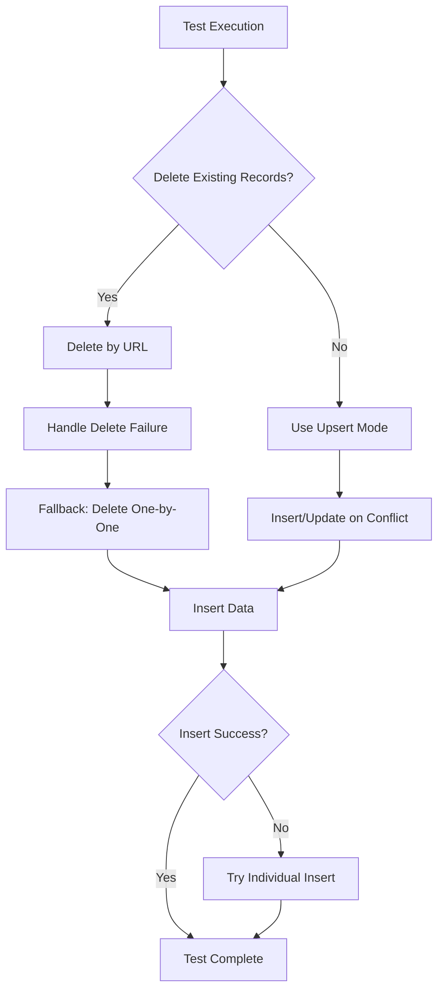

The system uses batch deletion of existing records with the same URLs before inserting new data to prevent duplicates. If batch deletion fails, it falls back to one-by-one deletion. When the --skip-delete flag is used, it employs upsert operations to insert or update records based on URL and chunk number.

### Asynchronous Operations Handling
The integration tests properly handle asynchronous operations to ensure reliable test execution:

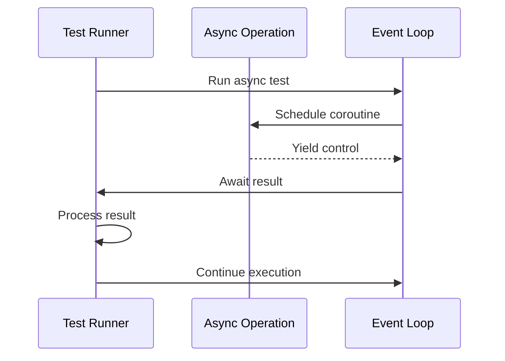

The tests use asyncio to handle asynchronous operations such as API calls and database operations. The test framework properly manages the event loop and ensures that all asynchronous operations complete before proceeding to the next test step.

**Section sources**
- [test_neo4j_integration.py](file://tests/test_neo4j_integration.py#L160-L170)
- [utils.py](file://src/utils.py#L407-L426)
- [crawl4ai_mcp.py](file://src/crawl4ai_mcp.py#L279-L293)

## Troubleshooting Guide

### Common Issues and Solutions
This section addresses common issues encountered during integration testing and provides solutions:

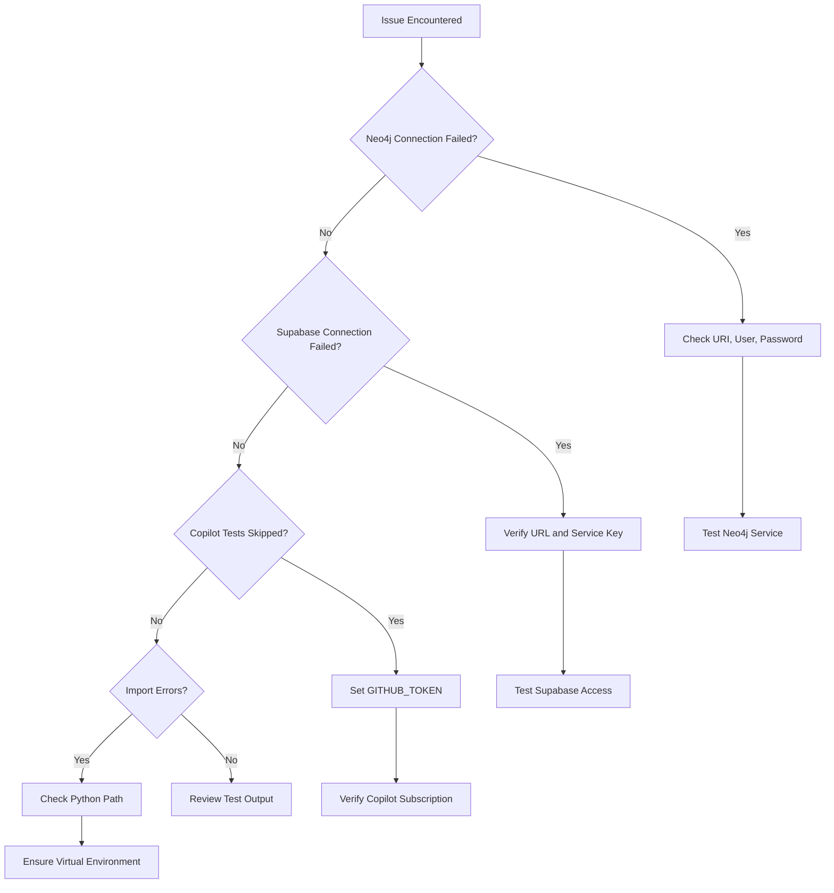

**Neo4j Connection Issues:**
- Verify the Neo4j service is running
- Check that NEO4J_URI points to the correct address and port
- Ensure NEO4J_USER and NEO4J_PASSWORD are correct
- Confirm USE_KNOWLEDGE_GRAPH=true if knowledge graph features are needed

**Supabase Connection Issues:**
- Verify the SUPABASE_URL is correct
- Ensure the SUPABASE_SERVICE_KEY has appropriate permissions
- Check network connectivity to the Supabase project

**Copilot Integration Issues:**
- Set the GITHUB_TOKEN environment variable
- Ensure an active GitHub Copilot subscription
- Verify the token has the necessary permissions
- Check rate limiting settings (COPILOT_REQUESTS_PER_MINUTE)

**General Troubleshooting Tips:**
- Run tests from the project root directory
- Ensure the virtual environment is activated
- Install dependencies with `uv pip install -e .`
- Check the test output for specific error messages
- Use individual test files for detailed debugging

**Section sources**
- [tests/README.md](file://tests/README.md#L168-L184)
- [test_mcp_server.py](file://tests/test_mcp_server.py#L239-L267)
- [test_neo4j_integration.py](file://tests/test_neo4j_integration.py#L69-L71)

## Conclusion
The integration testing framework for the MCP server system provides comprehensive validation of all core components and their interactions. The tests cover the complete workflow from content crawling to query retrieval, ensuring that the system functions correctly as a whole. By validating database connections, service dependencies, and end-to-end workflows, the integration tests help maintain system reliability and catch issues early in the development process. The modular test structure allows for both comprehensive suite execution and targeted testing of specific components, making it suitable for both development and CI/CD environments.